```{r settings, include = FALSE}
options(htmltools.dir.version = FALSE)
knitr::opts_chunk$set(fig.retina = 3, out.width = "100%", cache = FALSE,
                      comment = ">", echo = TRUE, message = FALSE,
                      warning = FALSE, hiline = TRUE, dpi = 120)

# xaringan Extra
# devtools::install_github("gadenbuie/xaringanExtra")
library(xaringanExtra)
use_xaringan_extra(c("tile_view", "animate_css", "tachyons"))
use_tile_view() # panel
# xaringanExtra::use_scribble() # scribble
use_extra_styles(hover_code_line = TRUE,
                 mute_unhighlighted_code = FALSE) # Hover triangle code line
use_clipboard( # About clipboard
  button_text = "Click para copiar código",
  success_text = "Código copiado",
  error_text = "Ctrl+C para copiar"
)
use_freezeframe() # restarting gifs
use_animate_all("fade") # animates
use_panelset() # panels 
```

class: inverse center middle

# ATAJOS DE LAS DIAPOSITIVAS


$$\\[2.7in]$$

.left[Pulsa <kbd-black>O</kbd-black> para ver el panel de diapositivas]
.left[Pulsa <kbd-black>H</kbd-black> para ver otros atajos]

---


# Material de las clases


.pull-left[

- **Diapositivas** del curso:
<https://dadosdelaplace.github.io/teaching/pca-clustering>

- **Scripts** del curso:
<https://github.com/dadosdelaplace/teaching/tree/main/bdba-pca-clustering-2022/scripts>

- **Bibliografía**: <https://github.com/dadosdelaplace/teaching/tree/main/bdba-pca-clustering-2022/biblio>

&nbsp;

- **Manual** de R: <https://dadosdelaplace.github.io/courses-intro-R/>

- **Materiales del curso de dataviz** en R: <https://dadosdelaplace.github.io/curso-dataviz-ECI-2022>


]

.pull-right[

```{r material, echo = FALSE,  out.width = "83%", fig.align = "right"}

``` 

]

---

# Me presento: la turra

.pull-left[

```{r echo = FALSE,  out.width = "80%", fig.align = "left"}
knitr::include_graphics("./img/me.jpeg")
``` 

]

.pull-right[

* **Javier Álvarez Liébana**, nacido en 1989 en Carabanchel Bajo (Madrid)


* No, lo siento, Manolito era de Caranbanchel Alto)


* Licenciado (UCM) en **Matemáticas** (Erasmus en Bologna mediante)

* **Máster (UCM) en Ingeniería Matemática** (2013-2014)


* **Doctorado en estadística** por la Universidad de Granada


* Encargado de la **visualización y análisis de datos covid** de la Consejería de Salud del **Principado de Asturias**

]

&nbsp;

Intentando la **divulgación científica** por `Twitter (@dadosdelaplace)` e `Instagram (@javieralvarezliebana)`

---

# Objetivos


.pull-left[

El propósito de estas clases será el tratamiento de **datos multidimensionales**, con tres objetivos principales:

- **Reducción de la dimensión**: ¿todas las variables (columnas) nos aportan información? ¿Todas son necesarias? ¿Podemos transformar las variables para mantener la información de los datos pero reducir la dimensionalidad de los mismos?

- **Visualización**: ¿cuántas dimensiones podemos incluir en un gráfico 2D? ¿Cómo visualizar datos multidimensionales?

- **Encontrar patrones**: ¿cómo agrupar (clusterizar) los elementos en función de sus diferencias y similitudes?

]

.pull-right[

```{r material2, echo = FALSE,  out.width = "120%", fig.align = "left"}

``` 

]

&nbsp;

📚 Estas **diapositivas** han sido elaboradas con el propio `R` haciendo uso del paquete `{xaringan}`
y `{xaringanExtra}`.


---


# Requisitos

Para el presente curso los únicos **requisitos** serán:

1. **Conexión a internet** (para la descarga de algunos datos y paquetes).

2. **Instalar R**: será nuestro **lenguaje**, nuestro **castellano** para poder «comunicarnos con el ordenador. La descarga la haremos (gratuitamente) desde <https://cran.r-project.org/>

3. **Instalar R Studio**. De la misma manera que podemos escribir castellano en un ordenador, en un Word, en un papel o en un tuit, podemos usar distintos IDE (entornos de desarrollo integrados, nuestro Office), para que el trabajo sea más cómodo. Nuestro **Word** para nosotros será **RStudio**.

.left[
  
]

.right[
  
]


---

# R vs excel


---

# Incel vs excel

```{r echo = FALSE, out.width = '85%', fig.align = "center"}
knitr::include_graphics("./img/incel.jpg")
```

---

# Tips de RStudio: modo oscuro


**Consejo**: cambiar en tu `RStudio` la tonalidad del fondo de tu programa, en tonos oscuros y no blancos.

---

# Datos: de la celda a la tabla


* **Celda**: un **dato individual** de un tipo concreto.
* **Variable**: **concatenación de datos** del mismo tipo.
* **Matriz**: **concatenación de variables** del **mismo tipo** y longitud.
* **Tabla**: **concatenación de variables** de **distinto tipo** pero igual longitud.

---

class: inverse center middle

# BLOQUE I. Selección de variables: PCA

&nbsp;


### [¿Por qué es un paso importante en el análisis de datos multidimensional?](#intro-PCA)

### [Teoría: análisis de componentes principales](#teoria-PCA)

### [Práctica: PCA en R (visualización)](#practica-PCA)

---

name: intro-PCA
class: center, middle

# ¿Por qué es un paso importante en el análisis de datos multidimensional?

### **¿Qué es el análisis multivariante?**

---

# Breve historia de la estadística

* Del (neo)latín «statisticum collegium»: consejo de **Estado**.
* Del alemán «statistik» (ciencia del **Estado**, intoducido por G. Achenwall).

&nbsp;

**Origen**: una herramienta para la **administración** eficiente del Estado, pero **sin intención de comunicar ni de convertir el dato en información**.

---

# Breve historia de la estadística

.pull-left[

## Primeros usos: elaboración de censos

Los **primeros usos** documentados de la estadística fueron la elaboración de **censos** por parte de **mesopotámicos, chinos y egipcios**, con tres fines:

* Cobrar **impuestos** (un saludo, Willyrex).
* Reparto de **tierras** y optimización de su uso.
* **Reclutamiento de soldados**.

]

.pull-right[

## Estadística en la guerra

Según Tucídides, conceptos estadísticos como la **moda** datan del **siglo V a.C.**: para asaltar la muralla de la ciudad de Platea, ponían a contar a varios soldados el número de ladrillos vistos en la muralla, quedándose con el **conteo más repetido (la moda, el más frecuente)**, permitiendo el cálculo de la altura de la muralla.

```{r echo = FALSE, out.width = "70%", fig.align = "center"}
knitr::include_graphics("./img/peloponeso.jpg")
```

]

---

# ¿Qué han hecho los romanos por nosotros?

.pull-left[

Precisamente por el tamaño de su Imperio, fueron los **romanos** quienes hicieron un uso más intenso de la estadística:

* **Censos** (elaborados por la censura, que elaboraba no solo el censo sino la supervisión de la moralidad pública).
* Primeras **tablas de natalidad/mortalidad**
* Primeros **catastros** (registros oficiales de propiedades, primeros impuestos)

```{r echo = FALSE, out.width = "60%", fig.align = "center"}

```

]

.pull-right[

```{r echo = FALSE, out.width = "95%", fig.align = "left"}
knitr::include_graphics("https://www.publico.es/tremending/wp-content/uploads/2019/02/lifeofbrian3.jpg")
```

]

---

# Breve historia de la estadística

.pull-left[

## **ÁRABES**

Autores de los **primeros tratados de estadística**, como el manuscrito de **Al-Kindi (801-873)**, que usó la distribución de **frecuencias de palabras** para el desarrollo de métodos de cifrado y descifrado de **mensajes encriptados**.

]

.pull-right[

## **MÉXICO**

Ya en el **año 1116, el rey Xólotl** implementó un **censo** que consistía en la **estimación de piedras**, tirando cada súbdito una a un montón (Nepohualco).
]


&nbsp;

.pull-left[

## **INGLATERRA**

Desde el siglo XII se realiza la **Prueba del Pyx**, considerado uno de los **primeros controles de calidad**: se extre una de las monedas acuñadas y se deposita en una caja, para un año después comprobar su calidad y pureza.

]

.pull-right[

## **ITALIA**

En paralelo al **auge de los primeros «sistemas financieros» en Italia**, «La Nuova Crónica» de G. Villani fue considerado durante mucho tiempo el primer tratado de estadística (hasta el descubrimiento de los trabajos de Al-Kindi).

]

---

# Navegación y astronomía

Y es de aquella época medieval, en la que la navegación y la astronomía empezaban a tomar relevancia científica, cuando aparece la que se considera la primera gráfica (aunque no propiamente estadística) <sup>1</sup>, representando el **movimiento cíclico de los planetas** (entre los siglos X y XI)

```{r echo = FALSE,  out.width = "60%", fig.align = "center", fig.cap = "Gráfica extraída de Beniger y Robyn (1978)"}
knitr::include_graphics("./img/dataviz_historico_1.png")
``` 

[1] [📚 «Quantitative Graphics in Statistics: A Brief History» de James R. Beniger y Dorothy L. Robyn. The American Statistician (1978)](https://www.jstor.org/stable/2683467)

 
---

# Navegación y astronomía

Con una motivación similar, en torno a 1360 el matemático **Nicole Oresme** diseñó el **primer gráfico de barras**<sup>1</sup> (no estadístico), con la idea de **visualizar a la vez dos magnitudes físicas teóricas**.


```{r echo = FALSE,  out.width = "30%", fig.align = "center", fig.cap = "Gráfica extraída de Friendly y Valero-Mora (2010), de «Tractatus De Latitudinibus Formarum»"}
knitr::include_graphics("./img/dataviz_historico_2.jpeg")
``` 

[1] [📚 «The First (Known) Statistical Graph: Michael Florent van Langren and the 'Secret' of Longitude» de M. Friendly y P. M. Valero-Mora. The American Statistician (2010)](https://www.researchgate.net/publication/227369016_The_First_Known_Statistical_Graph_Michael_Florent_van_Langren_and_the_Secret_of_Longitude)

 
---

# Primer gráfico estadístico

La mayoría de expertos, como Tufte <sup>1,2</sup>, consideran **este gráfico** casi longitudinal como la **primera visualización de datos** de la historia, hecha por **van Langren** en 1644, representando la **distancia (en longitud) entre Toledo y Roma** (un poco mal medida ya que la distancia real es de 16.5º).

```{r echo = FALSE,  out.width = "45%", fig.align = "center", fig.cap = "Gráfica original extraída de Friendly y Valero-Mora (2010)"}
knitr::include_graphics("./img/longitud_dataviz.jpg")
``` 

```{r echo = FALSE,  out.width = "45%", fig.align = "center", fig.cap = "Adaptación extraída de Friendly y Valero-Mora (2010)"}
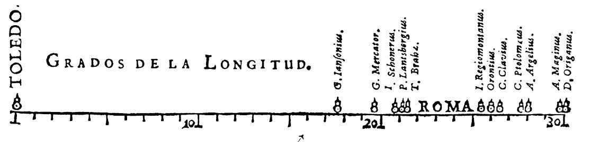
``` 

[1] [📚 «Visual explanations: images and quantities, evidence and narrative» de E. Tufte](https://archive.org/details/visualexplanatio00tuft)

[2] [📚 «PowerPoint is evil» de E. Tufte](https://www.wired.com/2003/09/ppt2/)

---


# Historia de la estadística: navegación y astronomía

.pull-left[

### T. Brahe

Uno de los primeros usos «modernos» de la estadística fue en la **navegación y la astronomía**, siendo Tycho Brahe de los primeros en utilizar la estadística para **reducir los errores** observacionales.
]

.pull-right[

### E. Wright

Fue el primero en usar en 1599 lo que hoy llamamos **mediana** en su libro «Certaine errors in navigation», aplicada a la navegación.

]

.pull-left[

### G. Galileo

Aunque la fama se la llevó **Gauss**, fue el primero en plantear una idea similar a la que hoy llamamos **método de mínimos cuadrados**: los valores más probables serían aquellos que minimizaran los errores.

]

.pull-right[
### C. F. Gauss y A. M. Legendre

El **método de los mínimos cuadrados**, en el que basan modelos actuales como la regresión, fue desarrollado por **Legendre y Gauss** (el último lo aplicó a la detección más probable del planeta enano Ceres).

]

---

# Historia de la estadística: demografía, epidemiología y fisiología

.pull-left[

#### J. Graunt

Autor de «Natural and Political Observations Made upon the Bills of Mortality» (1662), uno de los primeros trabajos en los que ya se hablaba de **exceso de mortalidad** a partir de las primeras tablas de natalidad y mortalidad, **estimando la población de Londres**.
]

.pull-right[

#### G. Neumann

Las **fakes news** ya existían en el siglo XVII: Gaspar Neumann también un precursor en el **análisis estadístico de tablas de mortalidad**, para desmentir bulos (ejemplo: desmontó la creencia de que en los años acabados en siete morían más personas).
]


Son precisamente las tablas de Graunt las que usó **Christiaan Huygens** (pionero en teoría de probabilidad con su «De ratiociniis in ludo aleae» en 1656) para generar la **primera gráfica de densidad** de una distribución continua, visualizando la **esperanza de vida** (en función de la edad).


---

# Primer gráfico de densidad


```{r echo = FALSE,  out.width = "50%", fig.align = "center", fig.cap = "Primera función de densidad, extraída de https://omeka.lehigh.edu/exhibits/show/data_visualization/vital_statistics/huygen"}
knitr::include_graphics("https://omeka.lehigh.edu/files/fullsize/65fc32c11a768f1d3263a99caca28dff.jpg")
``` 

---

# El gran boom: los gráficos de Playfair

La figura que cambió el dataviz fue, sin lugar a dudas, el economista y político **William Playfair (1759-1823)**. En 1786 publicó el **«Atlas político y comercial»**<sup>1,2</sup> con 44 gráficas (43 series temporales y el **diagrama de barras más famoso**, aunque no el primero).

.pull-left[

```{r echo = FALSE, out.width = "85%", fig.align = "center", fig.cap = "Gráficas de Playfair, extraídas de Funkhouser y Walker (1935)"}
knitr::include_graphics("./img/playfair_1.jpg")
``` 

]

.pull-right[

```{r echo = FALSE, out.width = "35%", fig.align = "center", fig.cap = "Gráficas de Playfair, extraídas de Funkhouser y Walker (1935)"}
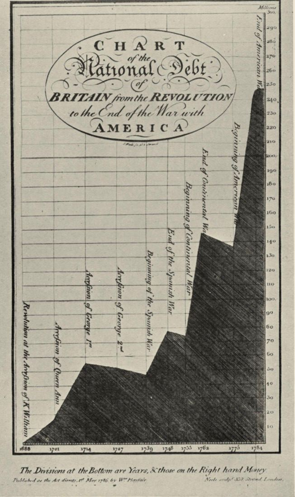
``` 

]

[1] [📚 «Atlas político y comercial» de William Playfair (1786)](https://www.amazon.es/Playfairs-Commercial-Political-Statistical-Breviary/dp/0521855543)

[2] [📚 «Playfair and his charts» de H. Gray Funkhouser and  Helen M. Walker (1935)](https://www.jstor.org/stable/45366440)

---

# Primer gráfico de barras

Playfair es además el **autor del gráfico de barras más famoso** (aunque no fue el primero, pero sí el que sentó un precedente, quien lo hizo _mainstream_).

.pull-left[

```{r echo = FALSE, out.width = "95%", fig.align = "center", fig.cap = "Gráficas de Playfair de importaciones (barras grises) y exportaciones (negras) de Escocia en 1781, extraídas de la wikipedia."}
knitr::include_graphics("./img/playfair_5.jpg")
``` 

]

.pull-right[

```{r echo = FALSE, out.width = "95%", fig.align = "center", fig.cap = "Primer diagrama de barras (Philippe Buache y Guillaume de L’Isle), visualizando los niveles del Sena desde 1732 hasta 1766, extraída de https://friendly.github.io/HistDataVis"}
knitr::include_graphics("./img/playfair_6.jpg")
``` 

]


---


# Epidemiología y bioestadística

.pull-left[

#### F. Galton

Primo de Charles Darwin, inventor de los **silbatos para perretes**, de los mapas de predicción meteorológica y la persona que acuñó el concepto de **regresión** (y el de eugenesia :/).

```{r echo = FALSE, out.width = "93%", fig.align = "center"}
knitr::include_graphics("https://www.bogleheads.org/w/images/thumb/9/95/Screen_Shot_2012-01-03_at_7.36.29_AM.png/600px-Screen_Shot_2012-01-03_at_7.36.29_AM.png")
``` 


]

.pull-right[

```{r echo = FALSE, out.width = "58%", fig.align = "center"}
knitr::include_graphics("./img/galton_1.jpg")
``` 

```{r echo = FALSE, out.width = "58%", fig.align = "center"}
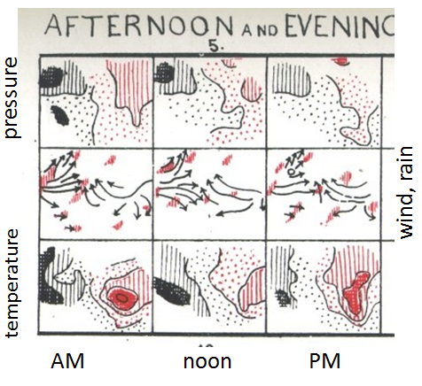
``` 

]


---

# Epidemiología y bioestadística

.pull-left[

#### John Snow

Se le considera uno de los pioneros de la **epidemiología moderna** y la **estadística espacial**: aunque los **diagramas de Voronoi** tardarían años en ser formalizados, John Snow aplicó el mismo concepto para mitigar la **epidemia de cólera en Londres**, con su **mapa con diagrama de barras**, localizando el foco en la conocida fuente de Broad Street.

]

.pull-right[

```{r echo = FALSE, out.width = "100%", fig.align = "center"}
knitr::include_graphics("https://media.revistagq.com/photos/5cc84a91c46d3a2b7435d7cf/2:3/w_1799,h_2699,c_limit/pelo%20jon%20snow.jpg")
``` 

]

---

# El boom de la estadística: epidemiología y bioestadística


.pull-left[

#### John Snow

Se le considera uno de los pioneros de la **epidemiología moderna** y la **estadística espacial**: aunque los **diagramas de Voronoi** tardarían años en ser formalizados, John Snow aplicó el mismo concepto para mitigar la **epidemia de cólera en Londres**, con su **mapa con diagrama de barras**, localizando el foco en la conocida fuente de Broad Street<sup>1</sup>.


[1] [📚 «El mapa fantasma», Steven Johnson, sobre la historia de John Snow](https://capitanswing.com/libros/el-mapa-fantasma/)


]

.pull-right[

```{r echo = FALSE, out.width = "100%", fig.align = "center", fig.cap = "John Snow, el epidemiólogo"}
knitr::include_graphics("https://s1.eestatic.com/2016/04/22/reportajes/reportajes_119248513_3987143_854x640.jpg")
``` 

]

---

# Nacimiento de la estadística espacial

```{r echo = FALSE, out.width = "77%", fig.align = "center", fig.cap = "Mapa de Londres, mostrando los casos de cólera del 19 de agosto al 30 de septiembre de 1854, extraído de https://friendly.github.io/HistDataVis."}
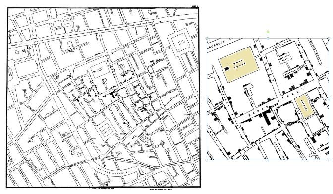
``` 

---

# Cólera en Londres

Esa **epidemia de cólera** en Londres fue una catástrofe en términos humanos pero supuso un verdadero auge de la **bioestadística y visualización de datos**. Unos años antes que Snow, **William Farr** ya usaba el dataviz para **monitorizar las muertes diarias**<sup>1</sup> de cólera (abajo, cólera en azul, diarre en amarillo), en función del tiempo meteorológico (arriba)


```{r echo = FALSE, out.width = "48%", fig.align = "center"}
knitr::include_graphics("./img/farr_colera.png")
``` 

[1] [«General Register Office, Report on the Mortality of Cholera in England, 1848–49» publicado en 1852](https://wellcomecollection.org/works/pajtrpez/items?canvas=9)


---


# Florence Nigthingale: una revolución

.pull-left[


* El 21 de octubre de 1854 **Florence Nigthingale** fue enviada para mejorar las **condiciones sanitarias** de los **soldados británicos en la guerra de Crimea**. 

* A su regreso se dedicó a demostrar que los **soldados fallecían por las condiciones sanitarias**: eran **muertes evitables**. Nigthingale es la creadora del famoso **diagrama de rosa**, permitiendo pintar tres variables a la vez y su estacionalidad.

* El 8 de febrero de 1955, The Times la describió como la **«ángel guardián» de los hospitales**, y al finalizar la contienda, fue recibida como una heroína, conocida como **«The Lady with the Lamp»** tras un poema de H. W. Longfellow publicado en 1857.

* Años después se convirtió en la **primera mujer en la Royal Statistical Society** y renunció a su puesto para crear las primeras escuelas de enfermería

]

.pull-right[

```{r echo = FALSE, out.width = "90%", fig.align = "center"}
knitr::include_graphics("https://www.researchgate.net/profile/Miguel-Guevara-4/publication/325622727/figure/fig1/AS:635977265582080@1528640204506/FIGURA-2-La-dama-con-la-lampara-1891-en-ingles-The-lady-with-the-lamp.png")
``` 

]

---

# ¿Qué es el análisis multidimensional?

Hasta la década de los 60, la mayoría de la estadística que se realizaba era

* **estadística unidimensional**: extraer información de una sola variable (rentas, impuestos, exportaciones, etc).

* **estadística bidimensional**: desde que Galton acuñó la regresión, los grandes estadísticos de principios de siglo se centraron en el **análisis bidimensional**, analizando la dependencia entre una variable $X$ y otra variable $Y$, con herramientas como los **coeficientes de correlación** de Pearson, Spearman o Kendall<sup>1</sup>


[1] [📚 Kendall, M. (1938). «A New Measure of Rank Correlation». Biometrika 30 (1–2): 81-89. doi:10.1093/biomet/30.1-2.81](https://doi.org/10.1093/biomet/30.1-2.81)

--

&nbsp;

## Wishart, contigo empezó todo

En 1928, Wishart publicó su famoso artículo <sup>1</sup> en el que, se demostraba y desarrollaba explícitamente la función de distribución de una 
**distribución normal multivariante**<sup>2</sup>, trabajo más tarde extendido por Fisher.

[2] [📚 Wishart, J. (1928). «The generalised product moment distribution in samples from a normal multivariate population». Biometrika. 20A (1–2): 32–52. doi:10.1093/biomet/20A.1-2.32](https://doi.org/10.1093/biomet/20A.1-2.32)


---
 
# ¿Qué es el análisis multidimensional?
 

El verdadero boom no llegó hasta la **década de los 60**,  con la publicación del libro «An Introduction to Multivariate Statistical Analysis»<sup>1</sup> de Anderson (1958), proporcionando todo un marco teórico

[1] [📚 Anderson, T.W. (1958). «An Introduction to Multivariate Analysis». New York: Wiley ISBN 0471026409](http://www.ru.ac.bd/stat/wp-content/uploads/sites/25/2019/03/301_03_Anderson_An-Introduction-to-Multivariate-Statistical-Analysis-2003.pdf)

--

&nbsp;

## **Definición**

> El Análisis Multivariante es la rama de la estadística que estudia las relaciones (CONJUNTAMENTE) entre conjuntos de variables dependientes y los individuos para los cuales se han medido dichas variables (Kendall)

## **Notación**

* $n$ tamaño muestral (número de individuos).

* $\boldsymbol{X}_i = \left(\boldsymbol{X}_{1, i}, \ldots, \boldsymbol{X}_{i, p} \right)$ conjunto de $p$ variables medidas para cada individuo $i=1,\ldots,n$.

* Nuestros datos serán una matriz $\boldsymbol{X}$ de $n$ filas y $p$ columnas (con $p \ll n$)

---

# Ejemplo de distribución bidimensional: normal bivariante

.pull-left[ 

Veamos un ejemplo sencillo con algo que seguramente nos sea familiar: la **distribución Normal o campana de Gauss** $X \sim \mathcal{N}\left(\mu, \sigma \right)$, cuya función de densidad es

$$f(x) = \frac{1}{\sigma {\sqrt{2\pi}}} e^{-{\frac{(x-\mu )^{2}}{2\sigma^{2}}}}, \quad \mu \in\mathbb{R},~\sigma >0$$

&nbsp;

La normal univariante depende de **dos parámetros**:

* **esperanza o media** $\mu = {\rm E} [X]$ 
* **varianza** (unidimensional) $\sigma^2 := {\rm Var} [X] = {\rm E} [\left(X - \mu \right)^2] = {\rm E} [X^2] - \mu^2$


]


.pull-right[

```{r eval = FALSE}
# Generamos muestra normal
rnorm(n = 10000, mean = 0, sd = 1)
```

```{r echo = FALSE}
library(tidyverse)
# Generamos una muestra normal (n = 10 000)
data <- tibble("x" = rnorm(n = 10000, mean = 0, sd = 1))
```

```{r echo = FALSE, out.width = "80%"}
# Ploteamos
ggplot(data, aes(x = x)) +
  geom_density(fill = "#F29288", alpha = 0.5, size = 1.2) +
  labs(x = "x", y = "f(x) (función densidad)")
```
  

]

---

# Normal bivariante

### **¿Y si medimos para cada individuo DOS variables?**

Si tenemos $\boldsymbol{X} = \left(X_1, X_2 \right)$, ¿qué estadísticos tenemos ahora a nuestra disposición?

* **Medidas marginales** (cada variable por separado):
  - medias $\mu_1:= {\rm E} [X_1]$ y $\mu_2:= {\rm E} [X_2]$
  - varianzas $\sigma_{1}^{2}:=\sigma_{1, 1}^{2} = \sigma_{X_1, X_1}^2$ y $\sigma_{2}^{2}:=\sigma_{2, 2}^{2} = \sigma_{X_2, X_2}^2$.

* **Varianza**: la varianza ${\rm Var} [X] := \sigma_{X}^2 = {\rm E} [ \left( X - \mu \right)^2 ]$ se puede entender cómo una medida que nos **cuantifica** la relación entre la variable consigo misma. ¿Y si en lugar de medir $X_1$ vs $X_1$ medimos $X_1$ vs $X_2$?

--

&nbsp;

### **Covarianza**

Definiremos la covarianza como una especie de varianza en la que cambiamos una de las $X$ por la otra variable


$${\rm Cov} [X_1, X_2] := \sigma_{1,2} =  {\rm E} [ \left( X_1 - \mu_1 \right) \left( X_2 - \mu_2 \right) ] = {\rm E}[X_1 * X_2] - \mu_1 * \mu_2 = \sigma_{2,1}$$

---

# Normal bivariante

### **Matriz de covarianzas**

Desde un punto de vista teórico, dada una variable aleatoria bidimensional $\boldsymbol{X} = \left(X_1, X_2 \right)^{T}$, con vector de medias $\boldsymbol{\mu} = \left(\mu_1, \mu_2 \right)^{T}$ definiremos la **matriz de varianzas y covarianzas** $\Sigma$ de la siguiente manera:

$$\boldsymbol{\Sigma} := \begin{pmatrix} \sigma_{1,1}^2 & \sigma_{1,2} \\ \sigma_{2,1} & \sigma_{2,2}^2 \end{pmatrix} = \begin{pmatrix} \sigma_{1}^2 & \sigma_{1,2} \\ \sigma_{1,2} & \sigma_{2}^2 \end{pmatrix}, \quad \left| \boldsymbol{\Sigma} \right| = \sigma_{1}^{2}  \sigma_{2}^{2} - \sigma_{1,2}^{2} > 0$$

--

Se puede expresar **matricialmente** como

$\begin{eqnarray} \left(\boldsymbol{X} - \boldsymbol{\mu} \right)^{T}\left(\boldsymbol{X} - \boldsymbol{\mu} \right) &=& \left( X_1  - \mu_1, X_2 - \mu_2 \right)^{T} \begin{pmatrix} X_1  - \mu_1 \\ X_2 - \mu_2 \end{pmatrix} \\ &=& \begin{pmatrix} \left(X_1  - \mu_1 \right)^2 & \left(X_1  - \mu_1 \right)\left(X_2  - \mu_2 \right) \\ \left(X_2  - \mu_2 \right)\left(X_1  - \mu_1 \right) & \left(X_2  - \mu_2 \right)^2 \end{pmatrix} \end{eqnarray}$

**IMPORTANTE**: es una **matriz simétrica** (nos da igual medir $X$ vs $Y$, que $Y$ vs $X$).

---

# Normal multivariante

### **Normal univariante**

$$X \sim \mathcal{N} \left(\mu, \sigma^2 \right), \quad \boldsymbol{\Sigma} = \sigma^2, \quad f(x) =  \frac{1}{\sigma {\sqrt{2\pi}}} e^{-{\frac{(x-\mu )^{2}}{2\sigma^{2}}}} = \frac{1}{\sigma {\sqrt{2\pi}}} e^{-\frac{1}{2} (x-\mu ) \boldsymbol{\Sigma}^{-1} (x-\mu )}$$


### **Normal bivariante**

$$\boldsymbol{X} = \left(X_1, X_2 \right)^{T}  \sim \mathcal{N} \left( \boldsymbol{\mu}, \boldsymbol{\Sigma} \right), \quad f(x_1, x_2) = \frac{1}{2\pi \left| \Sigma \right|^{1/2}} e^{-\frac{1}{2}{(\boldsymbol{x} - \mu )^{T} \boldsymbol{\Sigma}^{-1}(\boldsymbol{x} - \mu )}}$$

### **Normal multivariante (caso general)** 

Multivariante de $p \ll n$ variables

$$\boldsymbol{X} = \left(X_1, \ldots, X_p \right)^{T}  \sim \mathcal{N} \left( \boldsymbol{\mu}, \boldsymbol{\Sigma} \right), \quad f(x_1, \ldots, x_p) = \frac{1}{\left(2\pi \right)^{p/2} \left| \Sigma \right|^{1/2}} e^{-\frac{1}{2}{(\boldsymbol{x} - \mu )^{T} \boldsymbol{\Sigma}^{-1}(\boldsymbol{x} - \mu )}}$$

$$\boldsymbol{\Sigma} = \left(\Sigma_{i,j} \right)_{i,j=1,\ldots,p}, \quad \Sigma_{i,j}:= {\rm Cov} [X_i, X_j ] = {\rm E}[(X_i-\mu_i) (X_j - \mu_j)]$$

---

# Versión muestral

Lo anterior nos permite conocer la **formulación teórica (poblacional)**: ¿cómo calculamos la varianza y covarianza cuando tenemos una muestra $\boldsymbol{X}$ de $n$ individuos y $p$ observaciones medidas?


$$\boldsymbol{X} = \begin{pmatrix} x_{1, 1} & \ldots & x_{1, p} \\ \vdots & \ddots & \vdots \\ x_{n, 1} & \ldots & x_{n, p} \end{pmatrix} \quad \text{muestra}$$

#### **p = 2**

* **Varianzas muestrales**: $s_{x_1}^{2} := s_{1}^2 = \frac{1}{n} \sum_{i=1}^n \left(x_{i, 1} - \overline{x}_1 \right)^2$ y $s_{x_2}^{2} := s_{2}^2 = \frac{1}{n} \sum_{i=1}^n \left(x_{i, 2} - \overline{x}_2 \right)^2$, donde $\overline{x}_1$ y $\overline{x}_2$ son sus medias muestrales.

* **Covarianza muestral**: : $s_{x_1, x_2}^{2} := s_{1, 2} = s_{2, 1}^2 = \frac{1}{n} \sum_{i=1}^n \sum_{j=1}^n \left(x_{i, 1} - \overline{x}_1 \right)\left(x_{j, 2} - \overline{x}_2 \right)$

--

#### **Estimadores insesgados**

Seguramente dichos valores los hallas visto divididos por $n-1$ en lugar de $n$: los valores muestrales son estimadores de los valores poblacionales, y de aquí en adelante usaremos **estimadores insesgados**, estimadores $T$ del valor población $U$ tal que ${\rm E}[T] = U$

* Estimador insesgado de $\mu_{x}$: $\overline{x}$ tal que ${\rm E}[\overline{x}] = \mu$

* Estimador insesgado de $\sigma_{x}^2$: la **cuasivarianza** $S_{x}^2 = \frac{n}{n-1} s_{x}^{2}$ tal que ${\rm E}[\sigma_{x}^2] = S_{x}^2$

* Estimador insesgado de $\sigma_{x, y}$: la **cuasicovarianza** $S_{x, y} = \frac{n}{n-1} s_{x, y}$ tal que ${\rm E}[\sigma_{x, y}] = S_{x, y}$

---

# Matriz de covarianzas (versión muestral)


En un **caso general**, dada una muestra $\boldsymbol{X}$ de $n$ individuos y $p$ variables

$$S_{x_{k}}^2 := S_{k}^2 = \frac{1}{n-1} \sum_{i=1}^{n} \left(x_{i, k} - \overline{x}_k \right)^2 \quad \text{(cuasi) var. muestrales (marginales)}$$


$$S_{x_{k}, x_{l}} := S_{k, l} = \frac{1}{n-1} \sum_{i=1}^{n} \sum_{j=1}^{n} \left(x_{i, k} - \overline{x}_k \right)\left(x_{j, l} - \overline{x}_l \right) \quad \text{(cuasi) covarianzas}$$

Así, la **matriz de (cuasi) covarianzas empíricas** quedará como

$$S := \frac{1}{n-1} \left(\boldsymbol{X} - \boldsymbol{\mu} \right)^{T} \left(\boldsymbol{X} - \boldsymbol{\mu} \right) =_{\boldsymbol{\mu} = 0} \frac{1}{n-1} \boldsymbol{X}^{T} \boldsymbol{X} = \begin{pmatrix} S_{1,1} & S_{1,2} & \ldots & S_{1, p} \\ S_{2,1} & S_{2,2} & \ldots & S_{2, p} \\ \vdots & \vdots & \ddots & \vdots \\ S_{p,1} & S_{p,2} & \ldots & S_{p, p} \end{pmatrix}$$

&nbsp;

--

Las **covarianzas (y varianzas)** tienen un **«problema»**: **dependen de la magnitud** de los datos, proporcionando una medida que solo nos sirve para ser comparada con otra covariana, pero que **no nos proporciona una escala absoluta** para poder cuantificar.

---

# Matriz de correlaciones (versión muestral)


Para resolverlo, tenemos la **correlación (de Pearson)** 

$$\rho_{k, l} := r_{k, l} = \frac{s_{k, l}}{\sqrt{s_{k}^2} \sqrt{s_{l}^2}} = \frac{S_{k, l}}{\sqrt{S_{k}^2} \sqrt{S_{l}^2}}$$

tal que siempre $-1 \leq r_{k, l} \leq 1$.

&nbsp;

--

De esta forma la **matriz de correlaciones** se puede expresar como

$$R := \left(r_{k, l} \right)_{k,l=1,\ldots,p} = D^{-1/2} S D^{-1/2}, \quad D = diag(S) = \begin{pmatrix} S_{1,1}^2 & \ldots & 0 \\ \vdots  & \ddots & \vdots \\  0 & \ldots & S_{p, p}^2 \end{pmatrix}$$


---


name: teoria-PCA
class: center, middle

# Teoría: análisis de componentes principales

---

# Objetivo: ¿reducir dimensión?

.pull-left[

El **objetivo «mainstream»** del **análisis de componentes principales** (PCA en inglés) suele ser el de **reducir la dimensión** de nuestros datos: pasar de un conjunto de $n$ individuos y $p$ variables a otro de $k \leq p$ variables (para los mismos $n$ individuos).

&nbsp;

Esta reducción de la dimensión se suele hacer con **3 objetivos** principalmente:

* **Mejora computacional** de los algoritmos al tener un dataset más reducido.

* **Permitir la visualización** en 2 o 3 dimensiones conjuntos $n$-dimensionales.

* **«Reflotar» patrones** subyacentes en los datos.

]

.pull-right[

```{r echo = FALSE,  out.width = "100%", fig.align = "center", fig.cap = "Extraída de https://towardsdatascience.com/dimensionality-reduction-cheatsheet-15060fee3aa"}

knitr::include_graphics("https://miro.medium.com/max/959/1*kK4aMPHQ89ssFEus6RT4Yw.jpeg")
``` 

]

---


# Objetivo: ¿reducir dimensión?

.pull-left[

¿Entonces? ¿No tiene sentido aplicar componentes principales o técnicas de reducción de la dimensión en **datos bidimensionales**?

&nbsp;

Empecemos por un sencillo ejemplo, visualizando la **longitud y anchura de pétalo** del famoso conjunto de datos `iris`

&nbsp;

**¿Cuáles podrían ser los objetivos?** ¿Tiene sentido en este ejemplo aplicar **técnicas de reducción de la dimensión** como las componentes principales?

]

.pull-right[

```{r echo = FALSE, out.width = "100%"}
library(tidyverse)
ggplot(iris, aes(x = Petal.Width, y = Petal.Length)) +
  geom_point() +
  labs(x = "Anchura pétalo", y = "Longitud pétalo",
       caption = "Iris dataset extraído de Fisher (1936) y Anderson (1935).")
```

]

---

# Objetivo: maximizar la información


```{r echo = FALSE,  out.width = "80%", fig.align = "center", fig.cap = "Gráfica extraída de https://towardsdatascience.com/a-one-stop-shop-for-principal-component-analysis-5582fb7e0a9c"}
knitr::include_graphics("https://miro.medium.com/max/1400/1*V3JWBvxB92Uo116Bpxa3Tw.png")
``` 

Como veremos, el **objetivo real** será **maximizar la información obtenido al menor coste posible**, y eso hace que siga siendo útil, aunque no reduzcamos dimensiones, hacerlo en el caso bidimensional: una **clave** de las componentes principales es que las **componentes resultantes** serán **ortogonales** (perpendiculares), es decir, **linealmente independientes**.

&nbsp;

Las **componentes principales** pueden ser una herramienta muy útil para atajar problemas de **colinealidad** (variables altamente correladas entre sí, interfiriendo entre ellas)


---


# Idea principal

La **idea subyacente** tras el cálculo de las componentes principales se puede resumir de forma **geométrica**: para un conjunto de puntos $p$-dimensionales, encontrar un **nuevo sistema de coordenadas** de dimensión $k \leq p$ en el que expresar los datos, de forma que las **nuevas variables sean linealmente independientes**.

En el **caso bidimensional**, el resultado de aplicar componentes principales será una especie de «rotación» de los datos


```{r echo = FALSE,  out.width = "57%", fig.align = "center", fig.cap = "Gráfica extraída de https://towardsdatascience.com/a-one-stop-shop-for-principal-component-analysis-5582fb7e0a9c"}
knitr::include_graphics("https://miro.medium.com/max/1400/1*V3JWBvxB92Uo116Bpxa3Tw.png")
``` 

📚 **«Principal Component Analysis»**. Hervé and Lynne (2010) <http://staff.ustc.edu.cn/~zwp/teach/MVA/abdi-awPCA2010.pdf>


---

# Idea principal: caso bidimensional


En el **caso bidimensional**, la idea será buscar esa **elipse** en torno a la cual tenemos los datos, de forma que la dirección que marca el **eje mayor** será la **primera componente** (la que tiene mayor rango --> mayor varianza) y la dirección que marca el **eje menor** será la **segunda componente**.


.pull-left[

```{r echo = FALSE,  out.width = "77%", fig.align = "center", fig.cap = "Gráfica extraída de Hervé and Lynne (2010)"}
knitr::include_graphics("./img/pca_words_1.jpg")
```

]


.pull-right[

```{r echo = FALSE,  out.width = "58%", fig.align = "center", fig.cap = "Gráfica extraída de Hervé and Lynne (2010)"}
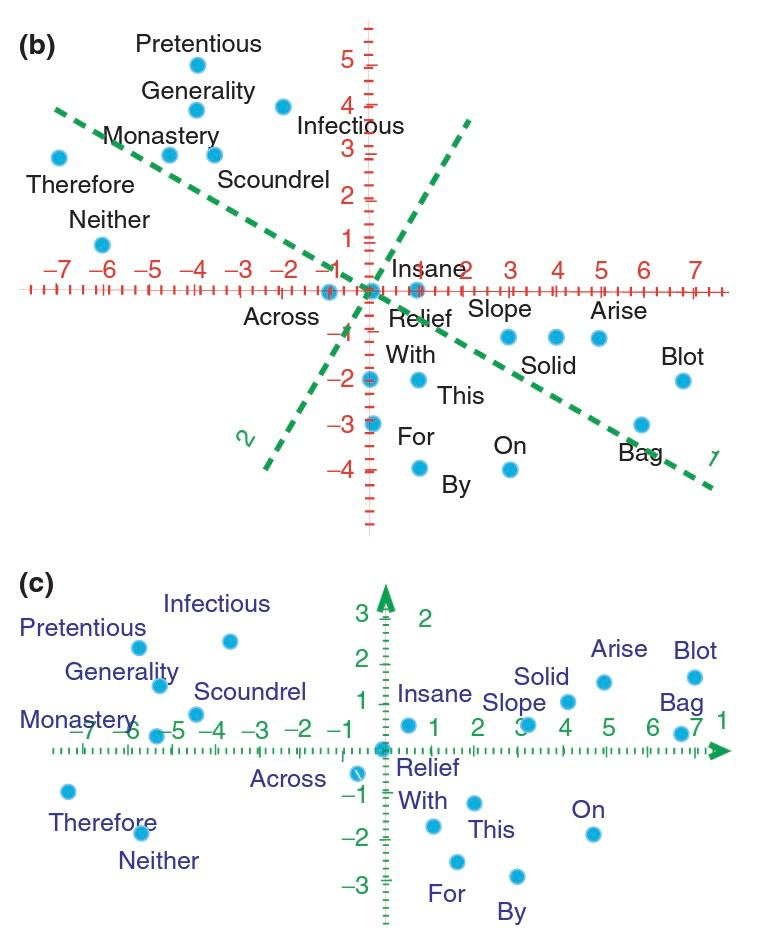
```

]

📚 **«Principal Component Analysis»**. Hervé and Lynne (2010) <http://staff.ustc.edu.cn/~zwp/teach/MVA/abdi-awPCA2010.pdf>

---

# Caso inicial bidimensional


.pull-left[

Vamos a empezar por un **ejemplo sencillo (bidimensional)** tomando algunas observaciones de `{iris}` y solo las variables del pétalo.

```{r echo = FALSE}
iris_bi <-
  tibble(iris) %>%
  select(contains("Petal")) %>%
  distinct(Petal.Width, .keep_all = TRUE) %>%
  slice(7:20)
```

```{r echo = FALSE}
iris_bi
```

]

.pull-right[

```{r echo = FALSE}
ggplot(iris_bi, aes(x = Petal.Width, y = Petal.Length)) +
  geom_point(size = 3) +
  labs(x = "Anchura pétalo", y = "Longitud pétalo",
       caption = "Iris dataset extraído de Fisher (1936) y Anderson (1935).") +
  theme_minimal() +
  theme(axis.title.x = element_text(size = 23),
        axis.text.x = element_text(size = 15),
        axis.title.y = element_text(size = 23),
        axis.text.y = element_text(size = 15),
        plot.caption = element_text(size = 15))
```

]

---

# Caso bidimensional

.pull-left[

1. Encontrar las **direcciónes de máxima varianza**. Dichas direcciones vendrán determinadas por **dos vectores** $\left\lbrace \boldsymbol{\Phi}_1, \boldsymbol{\Phi}_2 \right\rbrace$ perpendiculares entre sí y que serán **combinación lineal de las variables** originales.

$$\Phi_1 = z_{1, 1} * \boldsymbol{x}_1 + z_{2, 1} * \boldsymbol{x}_2, \quad \Phi_2 = z_{1, 2} * \boldsymbol{x}_1 + z_{2, 2} * \boldsymbol{x}_2$$


]

.pull-right[

```{r echo = FALSE,  out.width = "85%", fig.align = "center", fig.cap = "Direcciones de máxima varianza"}
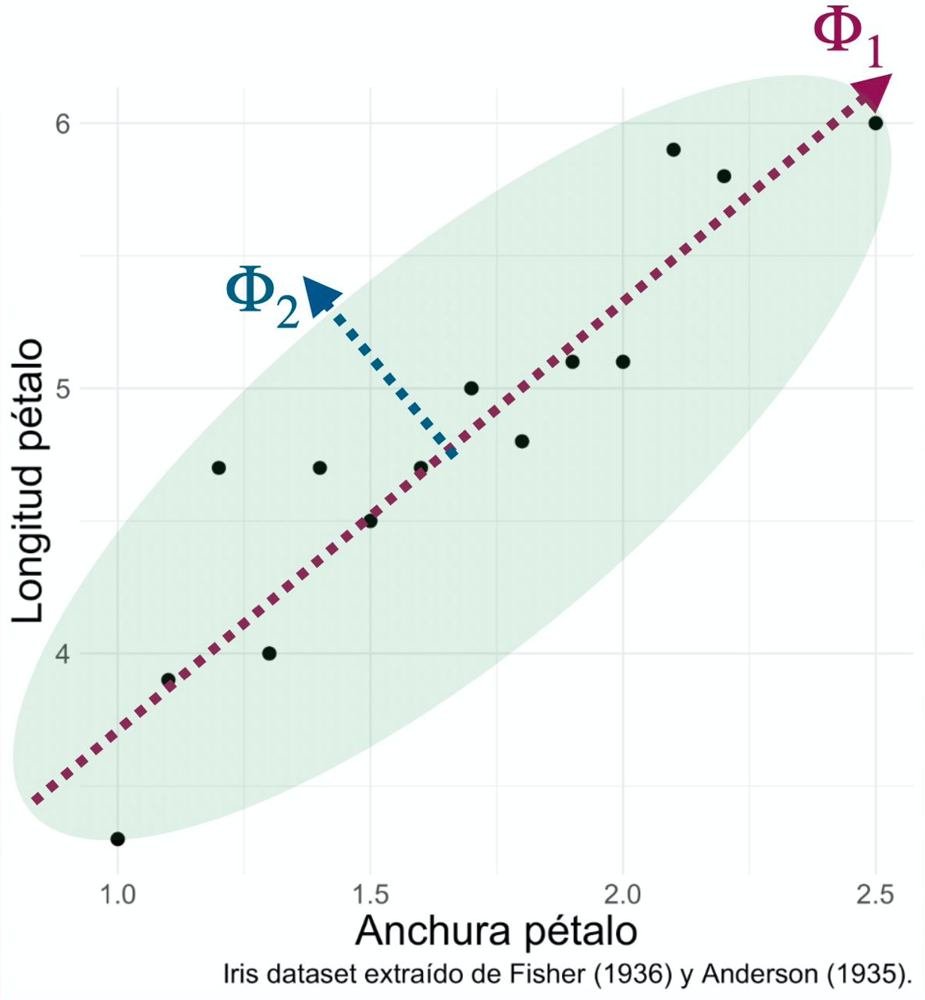
```

]

---

# Caso bidimensional

.pull-left[


1. Encontrar las **direcciónes de máxima varianza**. Dichas direcciones vendrán determinadas por **dos vectores** $\left\lbrace \Phi_1, \Phi_2 \right\rbrace$ perpendiculares entre sí y que serán **combinación lineal de las variables** originales.
$$\Phi_1 = z_{1, 1} * \boldsymbol{x}_1 + z_{2, 1} * \boldsymbol{x}_2, \quad \Phi_2 = z_{1, 2} * \boldsymbol{x}_1 + z_{2, 2} * \boldsymbol{x}_2$$

2. Dado un registro $\boldsymbol{x}_i = \left(x_{i, 1}, x_{i, 2} \right)$ (que puede entenderse como un vector $\overline{\boldsymbol{x}}_i := \boldsymbol{x}_i$), lo que haremos será obtener las **nuevas coordenadas** **proyectando ortogonalmente** el vector sobre las nuevas direcciones:
$$x_{i, 1}' =\left| \boldsymbol{x}_i \right| cos (\alpha)  =  \frac{\langle \boldsymbol{x}_i, \Phi_1 \rangle}{ \left| \Phi_1 \right|}, \quad x_{i, 2}' =  \frac{\langle \boldsymbol{x}_i, \Phi_2 \rangle}{ \left| \Phi_2 \right|}$$

]

.pull-right[

```{r echo = FALSE,  out.width = "78%", fig.align = "center", fig.cap = "Proyección ortogonal"}
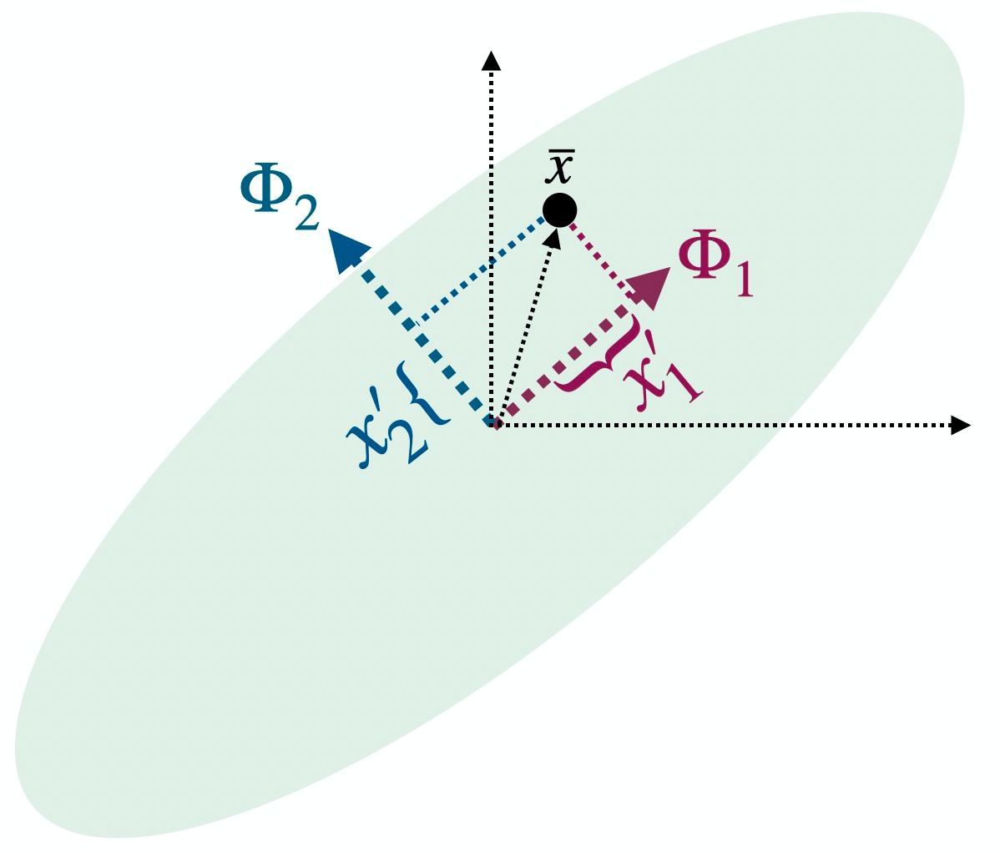
```

]

---


# Caso bidimensional

.pull-left[


1. Encontrar las **direcciónes de máxima varianza**. Dichas direcciones vendrán determinadas por **dos vectores** $\left\lbrace \Phi_1, \Phi_2 \right\rbrace$ perpendiculares entre sí y que serán **combinación lineal de las variables** originales.
$$\Phi_1 = z_{1, 1} * \boldsymbol{x}_1 + z_{2, 1} * \boldsymbol{x}_2, \quad \Phi_2 = z_{1, 2} * \boldsymbol{x}_1 + z_{2, 2} * \boldsymbol{x}_2$$

2. Dado un registro $\boldsymbol{x}_i = \left(x_{i, 1}, x_{i, 2} \right)$ (que puede entenderse como un vector $\overline{\boldsymbol{x}}_i := \boldsymbol{x}_i$), lo que haremos será obtener las **nuevas coordenadas** **proyectando ortogonalmente** el vector sobre las nuevas direcciones:
$$x_{i, 1}' =\left| \boldsymbol{x}_i \right| cos (\alpha)  =  \frac{\langle \boldsymbol{x}_i, \Phi_1 \rangle}{ \left| \Phi_1 \right|}, \quad x_{i, 2}' =  \frac{\langle \boldsymbol{x}_i, \Phi_2 \rangle}{ \left| \Phi_2 \right|}$$

3. Las **nuevas direcciones** las seleccionaremos  **ortonormales** (módulo unitario):
$$x_{i, 1}'  =  \langle \boldsymbol{x}_i, \Phi_1 \rangle =  \left(x_{i, 1}, x_{i, 2} \right) \left(z_{1, 1}, z_{2, 1} \right)^{T} = \boldsymbol{x}_{i} \boldsymbol{\Phi}_{1}^{T}, \quad x_{i, 2}' = \langle \boldsymbol{x}_i, \Phi_2 \rangle = \boldsymbol{x}_{i} \boldsymbol{\Phi}_{2}^{T}$$

]

.pull-right[

```{r echo = FALSE,  out.width = "78%", fig.align = "center", fig.cap = "Proyección ortogonal"}

```

]

---

# Idea general


Nuestros datos originales $\boldsymbol{X}$  (dimensiones $n \times p$) serán reconvertidos en un conjunto $\boldsymbol{X}'$ de dimensiones $n \times k$, con $k \leq p$, tal que 

$$\boldsymbol{X}' = \boldsymbol{X} \boldsymbol{\Phi}^{T}$$

--

tal que $\boldsymbol{\Phi}^{T}$ es una matriz $p \times k$ que contiene por columnas las $k$ **direcciones principales**

$$\boldsymbol{\Phi}^{T} = \begin{pmatrix} z_{1,1} & z_{2,1} & \ldots & z_{k,1} \\ z_{1,2} & z_{2,2} & \ldots & z_{k,2} \\ \vdots & \vdots & \ddots & \vdots \\ z_{1,p} & z_{2,p} & \ldots & z_{k,p} \end{pmatrix}$$

--

bajo la condición de que sean **direcciones ortonormales**

$$\Phi \Phi^{T} = \begin{pmatrix} 1 & 0 & \ldots & 0 \\ 0 & 1 & \ldots & 0 \\ \vdots & \vdots & \ddots & \vdots \\ 0 & 0 & \ldots & 1 \end{pmatrix}$$

tal que dichas direcciones **maximicen la varianza**.

---

# Primera componente

Por ejemplo, para la **primera componente** el objetivo es encontrar, de entre todas las direcciones  $\boldsymbol{u}_1$ posibles, la dirección $\boldsymbol{\Phi}_1$ que **maximice la varianza de nuestros datos cuanos los proyectamos sobre dicha dirección**

$$\boldsymbol{x}_{1}' = \boldsymbol{X} \boldsymbol{\Phi}_{1}^{T} = \begin{pmatrix} x_{1,1} & x_{1, 2} & \ldots & x_{1, p} \\ x_{2,1} & x_{2, 1} & \ldots & x_{2, p} \\ \vdots & \vdots & \ddots & \vdots
\\ x_{n,1} & x_{n, 2} & \ldots & x_{n, p}\end{pmatrix} \begin{pmatrix} z_{1,1} \\ z_{1,2} \\ \vdots \\ z_{1,p} \end{pmatrix} =  \begin{pmatrix} x_{1,1}^{'} \\ x_{2,1}^{'} \\ \vdots \\ x_{n, 1}^{'} \end{pmatrix}$$


--

&nbsp;

Dicha dirección por tanto saldrá de un proceso de **optimización**

$$\boldsymbol{\Phi}_1 = \arg \max_{\boldsymbol{u}_{1}^{T} \boldsymbol{u}_1 = 1} {\rm Var} \left( \boldsymbol{x}_{1}'  \right) = \arg \max_{\boldsymbol{u}_{1}^{T} \boldsymbol{u}_1 = 1} {\rm Var} \left( \boldsymbol{X} \boldsymbol{u}_{1}^{T} \right)$$

---

# Primera componente

Dicha dirección por tanto saldrá de un proceso de **optimización**

$$\boldsymbol{\Phi}_1 = \arg \max_{\boldsymbol{u}_{1}^{T} \boldsymbol{u}_1 = 1} {\rm Var} \left( \boldsymbol{x}_{1}'  \right) = \arg \max_{\boldsymbol{u}_{1}^{T} \boldsymbol{u}_1 = 1} {\rm Var} \left( \boldsymbol{X} \boldsymbol{u}_{1}^{T} \right)$$

--

Si **centramos los datos** (restamos su media para tener media nula)


$$\begin{eqnarray}\boldsymbol{\Phi}_1 &=& \arg \max_{\boldsymbol{u}_{1}^{T} \boldsymbol{u}_{1} = 1} {\rm Var} \left( \boldsymbol{X}\boldsymbol{u}_{1}^{T} \right) = \arg \max_{\boldsymbol{u}_{1}^{T} \boldsymbol{u}_1 = 1} \left({\rm E} \left[\left( \boldsymbol{X} \boldsymbol{u}_1^{T} \right)^{T}\left( \boldsymbol{X} \boldsymbol{u}_{1}^{T} \right)\right] \right) \\ &=& \arg \max_{\boldsymbol{u}_{1}^{T} \boldsymbol{u}_{1} = 1} \left({\rm E} \left[ \boldsymbol{u}_{1} \boldsymbol{X}^{T} \boldsymbol{X} \boldsymbol{u}_1^{T} \right] \right) = \arg \max_{\boldsymbol{u}_{1}^{T} \boldsymbol{u}_1 = 1} \left( \boldsymbol{u}_1 {\rm E} \left[\boldsymbol{X}^{T} \boldsymbol{X} \right] \boldsymbol{u}_{1}^{T}  \right) \\ &=& \arg \max_{\boldsymbol{u}_{1}^{T} \boldsymbol{u}_1 = 1} \left( \boldsymbol{u}_1 S \boldsymbol{u}_{1}^{T}  \right)\end{eqnarray}$$

--

Si **estandarizamos los datos** (restamos su media y dividimos entre su desviación típica, teniendo **datos con media cero y varianza unitaria** para que todos los datos ponderen por igual)

$$\boldsymbol{\Phi}_1 = \arg \max_{\boldsymbol{u}_{1}^{T} \boldsymbol{u}_1 = 1} {\rm Var} \left( \boldsymbol{X} \boldsymbol{u}_1^{T} \right) = \arg \max_{\boldsymbol{u}_{1}^{T} \boldsymbol{u}_1 = 1} \left( \boldsymbol{u}_1 S \boldsymbol{u}_1^{T}  \right) = \arg \max_{\boldsymbol{u}_{1}^{T} \boldsymbol{u}_1 = 1} \left( \boldsymbol{u}_1 R \boldsymbol{u}_1^{T}  \right)$$

---

# Primera componente

Para **encontrar esa dirección $\boldsymbol{u}_1$** que nos maximiza la varianza de los proyectados en ella, sujeto a la restrcción de que $\boldsymbol{u}_{1}^{T} \boldsymbol{u}_1 = 1$, se puede usar la técnica de los **multiplicadores de Lagrange** que nos dice que

$$\boldsymbol{\Phi}_1 =  \arg \max_{\boldsymbol{u}_{1}^{T} \boldsymbol{u}_1 = 1} \left( \boldsymbol{u}_1 R \boldsymbol{u}_1^{T}  \right) = \arg \max_{\boldsymbol{u}_{1}^{T} \boldsymbol{u}_1 = 1} \left( \boldsymbol{u}_1 R \boldsymbol{u}_1^{T}  - \lambda \left(\boldsymbol{u}_1^{T} \boldsymbol{u}_1  - 1\right) \right), \quad \lambda \in \mathbb{R}$$

--

Eso es equivalente a encontrar el valor que nos **iguale la derivada a cero**

$$\frac{\partial}{\partial \boldsymbol{u}_1} \left( \boldsymbol{u}_1 R \boldsymbol{u}_1^{T}  - \lambda \left(\boldsymbol{u}_1^{T} \boldsymbol{u}_1  - 1\right) \right) =   R \boldsymbol{u}_1  - \lambda \boldsymbol{u}_1^{T} = \left(R - \lambda \boldsymbol{Id}_{p} \right) \boldsymbol{u}_1^{T}  =  0$$
--

Esto es lo mismo que decir que $R \boldsymbol{u}_1^{T}  = \lambda \boldsymbol{u}_1^{T}$, es decir, la dirección que buscamos $\boldsymbol{u}_{1}^{T}$ es un **autovector de la matriz de covarianzas** (tras **estandarizar** los datos).

---

# Paréntesis: autovectores y autovalores

---

# Primera componente

Recapitulando, para obtener la **primera componente** $\boldsymbol{\Phi}_1$, debemos de 

* **Estandarizar** nuestros datos
* Calcular la **matriz de (cuasi)covarianzas** $\boldsymbol{S}$
* Calcula sus **autovectores** tal que $S \boldsymbol{\Phi}_{1}^{T} = \lambda_1 \boldsymbol{\Phi}_{1}^{T}$ (normalizados a módulo 1).

--

Además si es un autovector de la matriz de covarianzas tenemos entonces que la **varianza maximizada**, la **proporción de información** que **explica dicha componente**, será

$$\boldsymbol{\Phi}_{1} \left(  S \boldsymbol{\Phi}_{1}^{T} \right) = \boldsymbol{\Phi}_{1} \left( R \boldsymbol{\Phi}_{1}^{T} \right) =\boldsymbol{\Phi}_{1}\left(  \lambda_1 \boldsymbol{\Phi}_{1}^{T} \right) =  \lambda_1 \boldsymbol{\Phi}_{1} \boldsymbol{\Phi}_{1}^{T} =_{\text{ortonormales}} \lambda_1$$ 

--

Así que obtener la dirección (de todos los autovalores) que mayor información captura nos fijaremos en aquella que tenga **asociada el autovalor más grande**.


$$\boldsymbol{x}_{1}' = \boldsymbol{X} \boldsymbol{\Phi}_{1}^{T} = \begin{pmatrix} x_{1,1} & \ldots & x_{1, p}  \\ \vdots  & \ddots & \vdots
\\ x_{n,1}  & \ldots & x_{n, p}\end{pmatrix} \begin{pmatrix} z_{1,1} \\ \vdots \\ z_{1,p} \end{pmatrix} =  \begin{pmatrix} x_{1,1}^{'} \\ \vdots \\ x_{n, 1}^{'} \end{pmatrix}$$

donde $S \boldsymbol{\Phi}_{1}^{T} = \lambda_1 \boldsymbol{\Phi}_{1}^{T}$, siendo $\lambda_1$ el mayor de los autovalores de la matriz de (cuasi)covarianzas $S$, y $\boldsymbol{\Phi}_{1}^{T}$ su autovector asociado. El **resto de las componentes** se obtendrán de forma similar, siendo ortogonales a cada una de las direcciones obtenidas.

---

# Idea general paso a paso 

El proceso completo es el siguiente:

* Dados unos datos $\boldsymbol{X}$ de $n$ individuos y $p$ variables, el objetivo es encontrar nuevas **direcciones ortonormales** $\left\lbrace \boldsymbol{\Phi}_1, \ldots, \boldsymbol{\Phi}_k \right\rbrace$, con $1 \leq k \leq p$, como combinación lineal de las variables originales.

* Los **datos son estandarizados**  tal que

$$\begin{pmatrix} \frac{x_{1,1} - \overline{x}_1}{S_{1}} & \frac{x_{1,2} - \overline{x}_2}{S_{2}} & \ldots & \frac{x_{1,p} - \overline{x}_p}{S_{p}} \\  \frac{x_{2,1} - \overline{x}_1}{S_{1}} & \frac{x_{2,2} - \overline{x}_2}{S_{2}} & \ldots & \frac{x_{2,p} - \overline{x}_p}{S_{p}} \\ \vdots & \vdots & \ddots & \vdots \\ \frac{x_{n,1} - \overline{x}_1}{S_{1}} & \frac{x_{n,2} - \overline{x}_2}{S_{2}} & \ldots & \frac{x_{n,p} - \overline{x}_p}{S_{p}} \end{pmatrix}$$

* Calcular la **matriz $S$ de (cuasi)covarianzas** de dichos datos estandarizados.

---

# Idea general paso a paso 

El proceso completo es el siguiente:

* Calculamos los $p$ **autovectores** $\left\lbrace \boldsymbol{\Phi}_1, \ldots, \boldsymbol{\Phi}_p \right\rbrace$, y sus **autovalores asociados** $\left\lbrace \lambda_1, \ldots, \lambda_p \right\rbrace$, de la matriz $S$, tal que $S  \boldsymbol{\Phi}_k = \lambda_k  \boldsymbol{\Phi}_k$.

* Seleccionamos las primeras $k \leq p$ componentes $\left\lbrace \boldsymbol{\Phi}_1, \ldots, \boldsymbol{\Phi}_k \right\rbrace$ asociadas a los primeros $\left\lbrace \lambda_1, \ldots, \lambda_k \right\rbrace$ autovalores.

* La **varianza (información) capturada** por la dirección $k$-ésima será igual a $\lambda_k$.

* Las nuevas coordenadas serán

$$\boldsymbol{X}^{'} = \boldsymbol{X} \boldsymbol{\Phi}^{T} = \begin{pmatrix} x_{1,1} & x_{1, 2} & \ldots & x_{1, p} \\ x_{2,1} & x_{2, 1} & \ldots & x_{2, p} \\ \vdots & \vdots & \ddots & \vdots
\\ x_{n,1} & x_{n, 2} & \ldots & x_{n, p}\end{pmatrix} \begin{pmatrix} z_{1,1} & z_{2,1} & \ldots & z_{k,1} \\ z_{1,2} & z_{2,2} & \ldots & z_{k,2}  \\ \vdots & \vdots & \ddots & \vdots \\ z_{1,p} & z_{2,p} & \ldots & z_{k,p} \end{pmatrix} = \begin{pmatrix} \boldsymbol{x}_1 \boldsymbol{\Phi}_1^{T} & \boldsymbol{x}_1 \boldsymbol{\Phi}_2^{T} & \ldots & \boldsymbol{x}_1 \boldsymbol{\Phi}_k^{T} \\ \boldsymbol{x}_2 \boldsymbol{\Phi}_1^{T} & \boldsymbol{x}_2 \boldsymbol{\Phi}_2^{T} & \ldots & \boldsymbol{x}_2 \boldsymbol{\Phi}_k^{T} \\ \vdots & \vdots & \ddots & \vdots \\ \boldsymbol{x}_n \boldsymbol{\Phi}_1^{T} & \boldsymbol{x}_n \boldsymbol{\Phi}_2^{T} & \ldots & \boldsymbol{x}_n \boldsymbol{\Phi}_k^{T}\end{pmatrix}$$

---

# Idea general paso a paso 

* Los **autovectores** nos indican la **dirección de la componente**, y sus **coeficientes** (conocidos como _loadings_, los que generan la combinación lineal de las variables originales) nos indican el **peso que tiene cada variable original en dicha componente**. Si por ejemplo $\boldsymbol{\Phi}_1 = \left(0.95, 0.15, 0.273 \right)$, significa que la primera componente (la que más varianza captura) será $0.95* \boldsymbol{X}_1 + 0.15 * \boldsymbol{X}_2 + 0.273 * \boldsymbol{X}_3$, estando dominada por la variable original $\boldsymbol{X}_1$ (un peso de 0.95).


* El **signo** de dichos _loadings_ nos indican el sentido de la relación entre la componente y la variable original (correlación positiva/negativa). Si alguno de ellos fuese 0 significaría que la nueva componente está incorrelada respecto a dicha variable original.

&nbsp;

--

* Para cada observación $i$, las nuevas coordenadas $\left(x_{i, 1}^{'}, \ldots, x_{i, k}^{'} \right)$, calculadas tras **proyectar la observación original en las direcciones principales** $\boldsymbol{x}_{i} \boldsymbol{\Phi}^{T}$, se conocen como _scores_

&nbsp;

--

* Para **seleccionar el número $k$** de componentes a seleccionar el método más sencillo es **fijar de antemano** un **umbral varianza explicada** que queremos conservar (por ejemplo, $95%$), de forma que nos quedemos con el primer número $k$ tal que $\sum_{j=1}^{k} \lambda_k > 0.95$ (**varianza explicada acumulada**, teniendo los autovalores ordenados de mayor a menor).


---


name: practica-PCA
class: center, middle

# Práctica: PCA en R

---

class: inverse center middle

# Extra. Introducción al dataviz en R.

&nbsp;

### [¿Qué es una gráfica?](#intro-historica)

### [Introducción a ggplot2](#intro-ggplot2)

### [La importancia de visualizar datos](#importancia-dataviz)

### [Profundizando en ggplot2](#importancia-dataviz)


---

name: intro-historica
class: center, middle


# Primer gráfico estadístico

La mayoría de expertos, como Tufte <sup>1,2</sup>, consideran **este gráfico** casi longitudinal como la **primera visualización de datos** de la historia, hecha por **van Langren** en 1644, representando la **distancia (en longitud) entre Toledo y Roma** (un poco mal medida ya que la distancia real es de 16.5º).

```{r echo = FALSE,  out.width = "45%", fig.align = "center", fig.cap = "Gráfica original extraída de Friendly y Valero-Mora (2010)"}
knitr::include_graphics("./img/longitud_dataviz.jpg")
``` 

```{r echo = FALSE,  out.width = "45%", fig.align = "center", fig.cap = "Adaptación extraída de Friendly y Valero-Mora (2010)"}

``` 

[1] [📚 «Visual explanations: images and quantities, evidence and narrative» de E. Tufte](https://archive.org/details/visualexplanatio00tuft)

[2] [📚 «PowerPoint is evil» de E. Tufte](https://www.wired.com/2003/09/ppt2/)

---

# ¿Qué es una gráfica estadística?

¿Por qué ese gráfico se considera la primera visualización estadística de la historia? ¿Qué es lo que hace que una visualización sea una gráfica estadística? **¿Cuál es la frontera entre una ilustración y una gráfica (de datos)?**

&nbsp;

Esas mismas preguntas se hizo **Joaquín Sevilla** en su manual <sup>1</sup>, argumentando que deben cumplir **3 requisitos**:

1. Que se base en el esquema de composición de **eje métrico** (proceso de medida): **no cualquier dibujo que incluya números** lo podemos denominar «gráfica estadística». 

.pull-left[

```{r echo = FALSE,  out.width = "55%", fig.align = "center", fig.cap = "INFOGRAFÍA extraída del manual de Joaquín Sevilla"}
knitr::include_graphics("./img/mapa_sevilla.jpg")
``` 

]

.pull-right[

```{r echo = FALSE,  out.width = "53%", fig.align = "center", fig.cap = "GRÁFICA extraída del manual de Joaquín Sevilla"}
knitr::include_graphics("./img/grafica_dinero_sevilla.jpg")
``` 

]

📚 [1] [«Gramática de las gráficas: pistas para mejorar las representaciones de datos» de Joaquín Sevilla](http://academica-e.unavarra.es/bitstream/handle/2454/15785/Gram%C3%A1tica.pdf)


---

# Vizfail

.pull-left[

```{r echo = FALSE,  out.width = "99%", fig.align = "center", fig.cap = "Ejemplo de metáfora visual mal ejecutada"}
knitr::include_graphics("./img/persona_dataviz.jpg")
``` 

]

.pull-right[

* La figura elegida (una persona caminando) no guarda relación alguna con lo que se pretende representar.

* Los sectores señalados no tienen relación con el ítem a representar, lo que dificulta su interpretación

* Los colores no dan información de ningún tipo.

* La forma hace imposible la comparación entre áreas (salvo que leas el % adjunto).

* La suma total supera el 100% ¿?

* **Sin la fuente de los datos**.

]

---

# ¿Qué es una gráfica estadística?

Ese **proceso de medida** en el que una gráfica se debe apoyar lo ilustra muy bien Alberto Cairo <sup>1</sup> con esta **infografía**.


* ¿Sabrías decir en 5 segundos en que región el empleo ha crecido más? ¿Y menos?
* ¿Sabrías decir en 5 segundos si la variación ha sido mayor en Madrid, La Rioja o Canarias?

```{r echo = FALSE,  out.width = "65%", fig.align = "center", fig.cap = "INFOGRAFÍA extraída de Alberto Cairo"}
knitr::include_graphics("./img/mapa_cairo_esp.jpg")
``` 

📚 [1] «The Functional Art: an introduction to information graphics and visualization» de Alberto Cairo.

---

# ¿Qué es una gráfica estadística?


```{r echo = FALSE,  out.width = "90%", fig.align = "center", fig.cap = "GRÁFICA extraída de Alberto Cairo"}
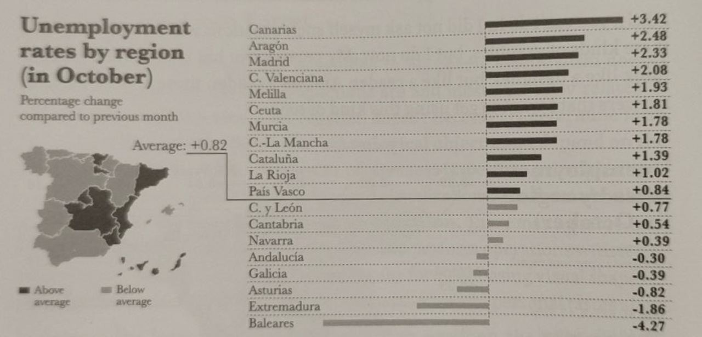
``` 

La principal diferencia entre otro tipo de comunicación visual y una **gráfica estadística** radica en proporcionar **herramientas de medida**.

---

# ¿Qué es una gráfica estadística?

1. Que se base en el esquema de composición de **eje métrico**

2. Debe incluir **información cuantitativa** (debe visualizar datos)

3. La relación de representatividad debería **ser reversible**: los **datos deberían poder «recuperarse»** a partir de la gráfica (una gráfica estadística es un tipo particular de **aplicación** matemática).


```{r echo = FALSE,  out.width = "50%", fig.align = "center", fig.cap = "Gráfica extraída del manual de Joaquín Sevilla"}
knitr::include_graphics("./img/sevilla_densidad.jpg")
``` 

📚 [«Gramática de las gráficas: pistas para mejorar las representaciones de datos» de Joaquín Sevilla](http://academica-e.unavarra.es/bitstream/handle/2454/15785/Gram%C3%A1tica.pdf)


---

# ¿Qué es una gráfica estadística?

Hay muchas formas de hacer una gráfica estadística, y **no suele pasar** por hacer un gráfico de tartas. Los **diagramas de tartas o sectores** tiene un problema de reversibilidad:

* Si hay **muchas variables**: salvo que conozcas el montante total y tengas un transportador de ángulos a mano, es muy complicado que obtengas información.

* Si hay **pocas variables**: ¿aporta algo distinto (y/o mejor) que una tabla?


```{r echo = FALSE,  out.width = "40%", fig.align = "center", fig.cap = "Gráfica extraída del manual de Joaquín Sevilla"}
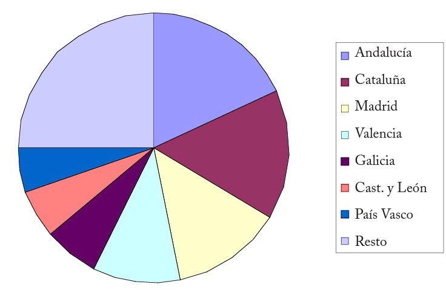
``` 

---

# ¿Qué es una gráfica estadística?

El principal problema de un **diagrama de sectores** es que la posible información está contenido en los **ángulos**, pero nuestra interpretación la realizamos a través de la **comparación de áreas** (nuestros ojos no miden bien ángulos), las cuales dependen no solo del ángulo sino del radio.

Algo similar sucede con los mal llamados **gráficos tridimensionales** (son bidimensionales con perspectiva en realidad): los valores más cercanos aparecen sobredimensionados, siendo prácticamente imposible la reversibilidad.


```{r echo = FALSE,  out.width = "70%", fig.align = "center", fig.cap = "Gráfica extraída del manual de Joaquín Sevilla"}
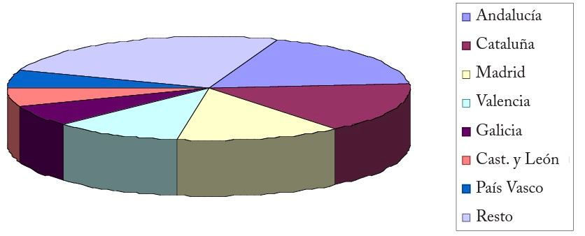
``` 

---

# Vizfail

Además, dado que un diagrama de sectores solo permite una **visualización relativa** de los datos, no son comparables con otros diagramas de tartas.

```{r echo = FALSE,  out.width = "78%", fig.align = "center"}
knitr::include_graphics("https://pbs.twimg.com/media/BgDR4urIMAAnHmG?format=jpg&name=medium")
``` 

Gráfica extraída de <https://twitter.com/Dave_Andrade/status/432576336872624129?t=FGjLtxE8V1BJR_QdXdtZgQ&s=19>

---

# ¿Líneas rojas?

* Entender el contexto y respetar el dato

```{r echo = FALSE, out.width = "60%", fig.align = "center", fig.cap = "Infografía extraída de https://twitter.com/storywithdata"}
knitr::include_graphics("https://pbs.twimg.com/media/FIgZcF4X0AAzLnC?format=jpg&name=medium")
``` 

(en lo de los diagramas de tartas discrepamos :P)

---

# Contexto

Una **buena idea** puede estar mejor o peor ejecutada, y la forma de llevarla a cabo es importante

```{r echo = FALSE, out.width = "30%", fig.align = "center", fig.cap = "Un semáforo no es una mala idea, la forma de instalarlo sí puede serlo. Imagen extraída del manual de Joaquín Sevilla"}
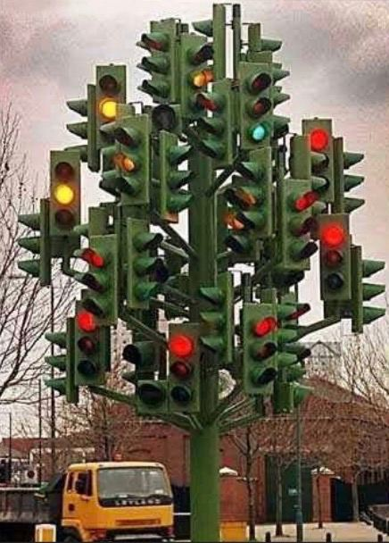
``` 

---

# Fundamentos de la visualización de datos estadísticos

## **Recomendaciones**

[«The Functional Art: an introduction to information graphics and visualization» de Alberto Cairo](https://www.amazon.es/Functional-Art-Voices-That-Matter/dp/0321834739)


[«Gramática de las gráficas: pistas para mejorar las representaciones de datos» de Joaquín Sevilla](https://academica-e.unavarra.es/bitstream/handle/2454/15785/Gram%C3%A1tica.pdf)


[«A Brief History of Visualization» de Friendly et al. (2008)](https://www.researchgate.net/publication/226400313_A_Brief_History_of_Data_Visualization)

[«Quantitative Graphics in Statistics: A Brief History» de James R. Beniger y Dorothy L. Robyn. The American Statistician (1978)](https://www.jstor.org/stable/2683467)]

[«Presentation Graphics» de Leland Wilkinson. International Encyclopedia of the Social & Behavioral Sciences](https://www.cs.uic.edu/~wilkinson/Publications/iesbs.pdf)

[«The Grammar of Graphics» de Leland Wilkinson](https://www.amazon.es/Grammar-Graphics-Statistics-Computing/dp/0387245448)


[«The Minard System: The Graphical Works of Charles-Joseph Minard» de Sandra Rendgen](https://www.amazon.es/gp/product/1616896337/ref=sw_img_1?smid=A1AT7YVPFBWXBL&psc=1)


[«The Visual Display of Quantitative Information» de E. W. Tufte](https://www.amazon.es/Visual-Display-Quantitative-Information/dp/0961392142)

---

name: intro-ggplot2
class: center, middle

# Dataviz e introducción a ggplot2

## **La gramática de los gráficos**

&nbsp;

El paquete `{ggplot2}` se basa en la idea propuesta en «Grammar of graphics» del recién fallecido Wilkinson.

---

## ggplot2: grammar of graphics (gg)

.pull-left[

```{r echo = FALSE,  out.width = "70%", fig.align = "center", fig.cap = "Imagen extraída de Reddit"}
knitr::include_graphics("https://dadosdelaplace.github.io/courses-ECI-2022/img/telling-dataviz")
``` 

]

.pull-right[

Una de las **principales fortalezas** de `R` no solo es el manejo de datos con `{tidyverse}`, también la visualización con uno de sus paquetes: el paquete `{ggplot2}`.

La **visualización de datos** debería ser una parte fundamental de todo análisis de datos. No es solo una cuestión estética. La visualización de datos es fundamental para convertir el dato en información.

]


---

## ggplot2: grammar of graphics (gg)

.pull-left[

La idea de la filosofía detrás de `{ggplot2}` es entender los **gráficos como parte integrada del flujo de datos**, dotándoles de una **gramática**, basándose en la idea de 
[«The Grammar of Graphics» de Leland Wilkinson](https://www.amazon.es/Grammar-Graphics-Statistics-Computing/dp/0387245448).

El objetivo es empezar con un lienzo en blanco e ir **añadiendo capas a tu gráfico**, como harías por ejemplo en Photoshop, con la diferencia de que nuestras capas podemos **ligarlas al conjunto de datos**.

La ventaja de `{ggplot2}` es poder **mapear atributos estéticos** (color, forma, tamaño) de **objetos geométricos** (puntos, barras, líneas) en **función de los datos**, añadiendo transformaciones de los datos, resúmenes estadísticos y transformaciones de las coordenadas.


La **documentación** del paquete puedes consultarla en <https://ggplot2-book.org/introduction.html> 
]

.pull-right[

```{r echo = FALSE,  out.width = "100%", fig.align = "center", fig.cap = "Idea detrás de la «Grammar of graphics» de Wilkinson"}
knitr::include_graphics("https://dadosdelaplace.github.io/courses-ECI-2022/img/grammar.jpg")
``` 
]


---

## ggplot2: grammar of graphics (gg)

.pull-left[


```{r echo = FALSE,  out.width = "100%", fig.align = "center", fig.cap = "Idea detrás de la «Grammar of graphics» de Wilkinson"}
knitr::include_graphics("https://dadosdelaplace.github.io/courses-ECI-2022/img/grammar.jpg")
``` 

]

.pull-right[

Un gráfico se podrá componer de las siguientes **capas**

* **Datos**
* **Mapeado de elementos estéticos (aesthetics)**: ejes, color, forma, tamaño, etc (en función de los datos)
* **Elementos geométricos (geom)**: puntos, líneas, barras, polígonos, etc.
* **Componer gráficas (facet)**: visualizar varias gráficas a la vez.
* **Transformaciones estadísticas (stat)**: ordenar, resumir, agrupar, etc.
* **Sistema de coordenadas (coord)**: coordenadas, grids, etc.
* **Temas (theme)**: fuente, tamaño de letra, subtítulos, captions, leyenda, ejes, etc.

]

---


# Recursos y bibliografía

&nbsp;

### **Leyenda de los recursos**

&nbsp;

&nbsp;


#### 📚 **Artículos o libros** científicos que han sido sometidos a revisión por pares.

&nbsp;

#### 🔗 **Recursos online** recomendados

&nbsp;

#### 💻 Recursos para la **programación en R**

---

# Bibliografía general

💻 **Tidy Data Tutor**: para visualizar la mecánica interna de `{tidyverse}`. <https://tidydatatutor.com/>

🔗 Web con recursos para la **introducción a la estadística y Machine Learning en R** <https://artofstat.com/>

📚 **«An Introduction to Multivariate Statistical Analysis»**. Anderson (1958) <https://github.com/dadosdelaplace/teaching/blob/main/bdba-pca-clustering-2022/biblio/introduction_mva_anderson_2003.pdf>

📚 **«A New Measure of Rank Correlation»**. Kendall (1938) <https://github.com/dadosdelaplace/teaching/blob/main/bdba-pca-clustering-2022/biblio/correlation_kendall_1938.pdf>

📚 **«The generalised product moment distribution in samples from a normal multivariate population»**. Wishart (1928) <https://github.com/dadosdelaplace/teaching/blob/main/bdba-pca-clustering-2022/biblio/multivariate_normal_wishart_1928.pdf>

📚 **«On lines and planes of closest fit to systems of points in space»**. Pearson (1901) <https://github.com/dadosdelaplace/teaching/blob/main/bdba-pca-clustering-2022/biblio/fit_pearson_1901.pdf>


---

# Recursos dataviz

### Dataviz

📚 **«Gramática de las gráficas: pistas para mejorar las representaciones de datos»**. Sevilla (2005) <http://academica-e.unavarra.es/bitstream/handle/2454/15785/Gram%C3%A1tica.pdf>

📚 **«Quantitative Graphics in Statistics: A Brief History»**. Beniger and Robyn <https://github.com/dadosdelaplace/teaching/blob/main/bdba-pca-clustering-2022/biblio/graphics_beniger_robin_1978.pdf>
 

---

# Bibliografía componentes principales

💻 **Componentes principales** en `{tidymodels}`. <https://www.tmwr.org/dimensionality.html#beans>


📚 **«Principal Component Analysis»**. Jolliffe (2002) <https://github.com/dadosdelaplace/teaching/blob/main/bdba-pca-clustering-2022/biblio/pca_jolliffe_2002.pdf>

📚 **«Principal Component Analysis»**. Hervé and Lynne (2010) <http://staff.ustc.edu.cn/~zwp/teach/MVA/abdi-awPCA2010.pdf>

📚 **«Principal Component Analysis: a review and recent developments»**. Jolliffe and Cadima (2016) <https://royalsocietypublishing.org/doi/10.1098/rsta.2015.0202>

🔗 **«The Mathematics Behind Principal Component Analysis»**. Dubey (2018).  <https://towardsdatascience.com/the-mathematics-behind-principal-component-analysis-fff2d7f4b643>


🔗 **«A One-Stop Shop for Principal Component Analysis»**. Brems (2017). <https://towardsdatascience.com/a-one-stop-shop-for-principal-component-analysis-5582fb7e0a9c>

📚 **«On the number of principal components: a test of dimensionality based on measurements of similarity between matrices»**. Dray (2008) <https://github.com/dadosdelaplace/teaching/blob/main/bdba-pca-clustering-2022/biblio/numer_pca_dray_2008.pdf>


---

# Recursos y bibliografía

### Otras técnicas de reducción de la dimensión

🔗 Sobre **PCA y PLS**. Amat (2017). <https://www.cienciadedatos.net/documentos/35_principal_component_analysis#Introducci%C3%B3n>

📚 **«On the early history of the singular value decomposition»**. Stewart (1993) <https://github.com/dadosdelaplace/teaching/blob/main/bdba-pca-clustering-2022/biblio/svd_stewart_1993.pdf>

---

# Bibliografía: clustering


---

# Tareas pendientes

- cuadros en dataviz
- ¿ggplot2 aquí?
- scripts covarianza/correlación
- ¿pls? ¿canonical analysis?
- clustering