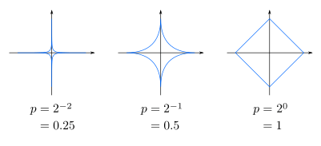
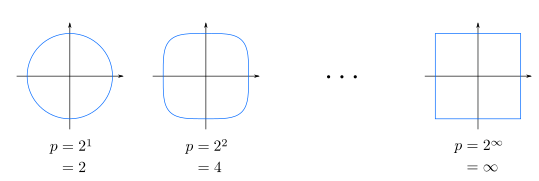
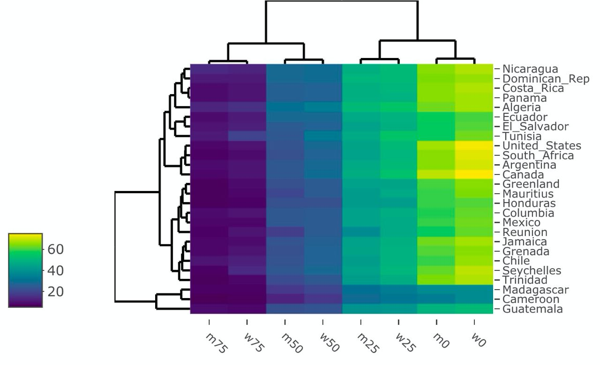

```{r setup, include = FALSE}
# Ajuste comunes de los chunk
knitr::opts_chunk$set(fig.width = 9, fig.asp = 1, out.width = "100%",
                      message = FALSE, warning = FALSE,
                      echo = TRUE, res = 400)
```

# Objetivos

El objetivo de este pequeño manual es aprender a implementar e interpretar el el **análisis clúster** en `R` 

## Paquetes necesarios

Necesitaremos los siguientes paquetes

* **Manejo de datos**: paquete `{tidyverse}`.
* **Resumen numérico**: paquete `{skimr}`.

```{r paquetes}
# Borramos variables del environment
rm(list = ls())

# Paquetes (si no están instalados, install.packages())
library(tidyverse)
library(skimr)
```

# Teoría: análisis clúster

El **análisis clúster** forma parte de los **algoritmos de agrupación o clasificación** con **aprendizaje no supervisado**:

* **Clasificación supervisada**: los individuos se clasifican en un grupo a partir de la
información de un conjunto de variables observadas de unos inviduos **cuyo grupo conocemos**, los **datos están etiquetados** (sabemos que es acierto y error). Es el caso por ejemplo del **análisis discriminante**.


```{r supervised, echo = FALSE,  out.width = "80%", fig.align = "right"}
knitr::include_graphics("./img/supervised_classification.png")
``` 

El **análisis clúster** forma parte de los **algoritmos de agrupación o clasificación** con **aprendizaje no supervisado**:


* **Clasificación/agrupación no supervisada**: los individuos también se clasifican en un grupo a partir de la información de un conjunto de variables observadas PERO en esta ocasión **no sabemos a qué grupo pertenece cada individuo a priori**, no tenemos conocimiento de qué es acierto y qué es error. Es este el caso del **análisis clúster**.


```{r unsupervised, echo = FALSE,  out.width = "80%", fig.align = "right"}
knitr::include_graphics("./img/unsupervised_classification.png")
``` 


## Objetivo

El análisis clúster tiene como principal objetivo **encontrar grupos** dentro de los individuos, de forma que los individuos de cada grupo sean **lo más parecidos entre sí** (homogeneidad interna) y **lo más diferentes a los individuos de otros grupos** (heterogeneidad entre grupos)


&nbsp;

De aquí en adelante usaremos la siguiente notación:

* $n$ tamaño muestral (número de individuos --> filas).

* $\boldsymbol{X}_i = \left(\boldsymbol{X}_{1, i}, \ldots, \boldsymbol{X}_{i, p} \right)$ conjunto de $p$ variables (--> columnas) medidas para cada individuo $i=1,\ldots,n$.

* Nuestros datos estarán en forma de tabla o matriz $\boldsymbol{X}$ de $n$ filas y $p$ columnas (con $p \ll n$)
 
 
Los **algoritmos  de clustering** los dividiremos en dos grandes grupos:


* **Algoritmos jerárquicos**: algoritmos que tienen como objetivo construir una jerarquía de grupos. Existen principalmente dos estrategias:
  - **Aglomerativa**: cada individuo empieza siendo su propio grupo, mientras se van uniendo de forma secuencial ascendiendo en la jerarquía, hasta acabar con un solo grupo que incluya todas las observaciones.
  - **Divisiva**: se construye una jerarquía descendiente, empezando con un único grupo hasta acabar con un grupo por individuo

Los métodos jerárquicos suelen ser muy **explicativos** y fáciles de visualizar (por ejemplo, con un **dendograma**) pero **muy costoso computacionalmente** (ya que siempre se construye la jerarquía entera, para decidir luego dónde cortar)

&nbsp;

* **Algoritmos no jerárquicos**: dado un número $K$ de grupos fijado a priori, se pretenden agrupar los datos de forma que obtengamos finalmente $K$ agrupaciones de los mismos.

## Métricas

En los algoritmos usados será clave el concepto de **métrica**. Los datos serán agrupados en base a los conceptos de «lejos» y «cerca», o mejor dicho, en base a «parecido» y «diferente»

**¿Qué es ser parecido? ¿Y diferente?**


### Métrica entre observaciones

Para medir distancias entre los individuos tenemos principalmente dos alternativas:

* **Distancias geométricas**: distancias que miden la distancia entre dos individuos como si fuesen dos puntos en un espacio geométrico. Son distancias determinísticas.

* **Distancias probabilísticas**: distancias que miden la distancia entre individuos teniendo en cuenta la distribución de las variables y su dependencia.

&nbsp;

Las **métricas determinísticas** más usadas son:

* **Distancia euclídea bidimensional**: $d(\boldsymbol{x}_i, \boldsymbol{x}_j) = \sqrt{(x_{i, 1} - x_{j,1})^2 + (x_{i, 2} - x_{j, 2})^2}$
   

* **Distancia euclídea multidimensional**: $d(\boldsymbol{x}_i, \boldsymbol{x}_j) = \sqrt{\displaystyle \sum_{k=1}^{p} (x_{i,k} - x_{j,k})^2}$

* **Distancia Manhattan**:  $d(\boldsymbol{x}_i, \boldsymbol{x}_j) = \displaystyle \sum_{k=1}^{p} \left| x_{i,k} - x_{j,k} \right|$

* **Distancia de Minkowski**: $d(\boldsymbol{x}_i, \boldsymbol{x}_j) = \left(\displaystyle \sum_{k=1}^{p} \left| x_{i,k} - x_{j,k} \right|^l\right)^{1/l}$ (si $l=1$ es Manhattan, si $l=2$ es Euclídea)
   
Cuando usemos este tipo métricas es **muy importante** **reescalar por rango**: transformamos para crear nuevas observaciones $\widetilde{x}_{i, k} = \frac{x_{i, k} - min(\boldsymbol{x}_i)}{max(\boldsymbol{x}_i) - min(\boldsymbol{x}_i)}$ de forma que todas las variables estén entre 0 y 1 (y así todas tengan el mismo peso dentro de las métricas).


```{r mink, echo = FALSE,  out.width = "65%", fig.align = "center"}

``` 

```{r mink2, echo = FALSE,  out.width = "65%", fig.align = "center"}

``` 


&nbsp;

Las **métricas probabilísticas** más usadas son:

* **Distancia de Mahalanobis** multidimensional **(variables independientes)**:  $d(\boldsymbol{x}_i, \boldsymbol{x}_j) = \sqrt{\displaystyle \sum_{k=1}^{p} \left(\frac{x_{i, k} - x_{j,k}}{\sigma_i} \right)^2}$ que se puede aproximar por $d(\boldsymbol{x}_i, \boldsymbol{x}_j) = \sqrt{\displaystyle \sum_{k=1}^{p} \left(\frac{x_{i, k} - x_{j,k}}{S_i} \right)^2}$

* **Distancia de Mahalanobis** multidimensional **(variables dependientes)**:  $d(\boldsymbol{x}_i, \boldsymbol{x}_j) = \sqrt{\displaystyle \sum_{k=1}^{p} \left(\boldsymbol{x}_i - \boldsymbol{x}_j \right)^{T} \Sigma^{-1} \left(\boldsymbol{x}_i - \boldsymbol{x}_j \right)}$ que se puede aproximar por $d(\boldsymbol{x}_i, \boldsymbol{x}_j) = \sqrt{\displaystyle \sum_{k=1}^{p} \left(\boldsymbol{x}_i - \boldsymbol{x}_j \right)^{T} S^{-1} \left(\boldsymbol{x}_i - \boldsymbol{x}_j \right)}$, donde $\Sigma$ es la matriz de covarianzas, con $S$ matriz de (cuasi)covarianzas.
  
Cuando usemos este tipo métricas es **muy importante** **estandarizar** para tener variables de media $0$ y varianza $1$.


### Métrica entre variables

Además de medir la distancia entre individuos podemos plantearnos medir la **distancia entre las propias variables**, normalmente basadas en la correlación de Pearson o sus derivados.

* **Correlación de Pearson**: definida como $d(\boldsymbol{X}_1, \boldsymbol{X}_2) = 1 - \left| r_{1,2} \right|$ donde $r_{1,2}$ se define como la correlción entre las variables $\boldsymbol{X}_1$ y $\boldsymbol{X}_2$

* **Correlación de Spearman**: definida como $d(\boldsymbol{X}_1, \boldsymbol{X}_2) = 1 - \left| \rho_{1,2} \right| = 1 - \left| \frac{6 \sum D^{2}}{n (n^{2}-1)} \right|$, donde $D$ es la diferencia entre los correspondientes estadísticos de orden.


* **Correlación de Kendall**: definida como  $d(\boldsymbol{X}_1, \boldsymbol{X}_2) = 1 - \left| \tau_{1,2} \right| =  1- \left| \frac{n_c - n_d}{\frac{1}{2} n (n-1)} \right|$ donde $n_c$ es el número de pares concordantes (si el orden de clasificación de $(x_{i},x_{j})$ y $(y_{i},y_{j})$ coinciden, tal que $x_{i}>x_{j}$ y $y_{i}>y_{j}$, donde $i<j$) y $n_d$ es el número de pares discordantes


# Visualización previa

Vamos a empezar a trabajar con un conjunto familiar, el conjunto de `iris` que ya conocemos haciendo una selección previa de 35 observaciones

```{r}
iris_sample <- iris %>% slice_sample(n = 35)
iris_sample 
```


Una primera visualización la podemos realizar con `heatmaply()` del paquete homónimo que nos permite realizar agrupaciones tanto de variables (dendograma superior) como de individuos (dendograma en el lateral).

```{r eval = FALSE}
library(heatmaply)
heatmaply(iris_sample,
          seriate = "mean",
          row_dend_left = TRUE,
          plot_method = "plotly")
```

Es importante recordar que el **clustering** es un método de **clasificación NO SUPERVISADA**: no sabemos a priori el grupo correcto de cada individuo.


```{r echo = FALSE}
library(heatmaply)
heatmaply(iris_sample,
          seriate = "mean",
          row_dend_left = TRUE,
          plot_method = "plotly")
```


&nbsp;

Podemos mejorar la representación **estandarizando** las variables.

```{r}
heatmaply(iris_sample %>%  mutate(across(where(is.numeric), ~scale(.))),
          seriate = "mean", row_dend_left = TRUE, plot_method = "plotly")
```


&nbsp;

Además con `seriate = ...` podemos cambiar el método de ordenación para una mejor visualización

```{r}
heatmaply(iris_sample %>%
            mutate(across(where(is.numeric), ~scale(.))),
          seriate = "OLO",
          row_dend_left = TRUE,
          plot_method = "plotly")
```

&nbsp;

Otra forma de ver las relaciones entre individuos es calcular su **matriz de distancias** con `dist()`, indicándole en `method = ...` el tipo de métrica.


```{r}
# Distancias euclídeasde los datos estandarizados (sin la variable no numérica)
d <- dist(iris_sample %>%
            select(-Species) %>% 
            mutate(across(where(is.numeric), ~scale(.))),
          method = "euclidean")
d
```

&nbsp;

Con `fviz_dist()` podremos visualizar dicha matriz de distancias.


```{r}
fviz_dist(d, show_labels = TRUE) +
  labs(title = "Matriz de distancias (estandarizadas)")
```


# Algoritmos jerárquicos

En nuestro caso empezaremos usando solo **algoritmos aglomerativos**, de forma que empezaremos con un clúster por individuo, e iremos **juntando clúster** en base a distintos enlaces


## Enlace simple


* **Enlace simple (single)** o del vecino más cercano: la distancia entre dos clústeres será definida como la **distancia mínima** entre pares de observaciones (cada una perteneciente a uno de los dos clústeres)

$$d(C_k, C_l) = \min_{x_i \in C_k, x_j \in C_l} d(x_i, x_j)$$

Con la función `hclust()` le pasamos la matriz de distancias (en este euclídeas y de los datos estandarizados, y el método de aglomeración)

```{r}
# Clustering (single)
single_clust <- hclust(d, method = "single")
single_clust
```

Además con `fviz_dend()` del paquete `{factoextra}` podemos visualizar un  dendograma preliminar

```{r}
# Dendograma
library(factoextra)
fviz_dend(single_clust, cex = 1) +
  labs(title = "Dendograma para clustering single")
```

Ese **dendograma** deberemos **cortarlo en alguno de los níveles** para quedarnos con un número de clústers.Con `cutree()` podemos indicarle el corte del número de clústers que queremos

```{r}
# Seleccionamos 3 clusters
groups <- cutree(single_clust, k = 3)
groups 
```

Vamos a volver a usar `fviz_dend()` pero con una mayor personalización de lo estético.

```{r}
# k = 3
fviz_dend(single_clust, # Clustering
          k = 3, # Nº de grupos
          cex = 0.5, # Tamaño textos
          k_colors = # colores
            c("#2E9FDF", "#00AFBB",
              "#E7B800"),
          # Diferentes colores a las etiqeutas
          color_labels_by_k = TRUE, 
          # Añade un rectángulo alrededor
          rect = TRUE) +
  labs(title = "Dendograma (simple)")
```

Además con `fviz_cluster()`  de `{factoextra}` **visualizaremos los clústers en base a las dos componentes** que más varianza capturen

```{r}
# Datos estandarizados (solo variables numéricas)
iris_scale <-
  iris_sample %>%
  select(-Species) %>% 
  mutate(across(where(is.numeric),
                ~scale(.)))

# Asignaciones para 3 clústers
groups <- cutree(single_clust, k = 3)

fviz_cluster(# Datos y asignaciones
             list(data = iris_scale,
                  cluster = groups),
             # Colores
             palette =
               c("#2E9FDF", "#00AFBB", "#E7B800"),
             # Tipo de polígono (cóncavo/convexo)
             ellipse.type = "convex", 
             # Evitar solapamiento etiquetas
             repel = TRUE,
             # Ocultar centros de clústers
             show.clust.cent = FALSE) +
  labs(title = "Cluster (single)") +
  theme_minimal()
```


Y así quedaría con todas las observaciones (sin el sampleo inicial)

```{r}
# Estandarizamos
iris_scale <-
  iris %>%
  select(-Species) %>% 
  mutate(across(where(is.numeric),
                ~scale(.)))

# Recalculamos matriz de distancias
d <- dist(iris_scale, method = "euclidean")

# Clustering (single)
single_clust <-
  hclust(d, method = "single")

# Asignaciones
groups <- cutree(single_clust, k = 3)

fviz_cluster(list(data = iris_scale, cluster = groups),
             palette =
               c("#2E9FDF", "#00AFBB", "#E7B800"),
             ellipse.type = "convex", 
             repel = TRUE,
             show.clust.cent = FALSE) +
  labs(title = "Cluster (single)") +
  theme_minimal()
```


## Enlace completo

* **Enlace completo (complete)** o del vecino más alejado (complete): la distancia entre dos clústeres será definida como la **distancia máxima** entre pares de observaciones (cada una perteneciente a uno de los dos clústeres)

$$d(C_k, C_l) = \max_{x_i \in C_k, x_j \in C_l} d(x_i, x_j)$$


```{r}
# Clustering (complete
complete_clust <- hclust(d, method = "complete")

# k = 3
fviz_dend(complete_clust, k = 3,
          cex = 0.5, 
          k_colors =
            c("#2E9FDF", "#00AFBB", "#E7B800"),
          # Diferentes colores a los clusters
          color_labels_by_k = TRUE, 
          #añade un rectángulo alrededor
          rect = TRUE) +
  labs(title = "Dendograma (complete)")
```


```{r}
groups <- cutree(complete_clust, k = 3)

fviz_cluster(list(data = iris_scale,
                  cluster = groups),
             palette =
               c("#2E9FDF", "#00AFBB", "#E7B800"),
             ellipse.type = "convex", 
             repel = TRUE,
             show.clust.cent = FALSE) +
  labs(title = "Cluster (complete)") +
  theme_minimal()
```


## Enlace medio (average)

.pull-left[

* **Enlace medio (average)**: la distancia entre dos clústeres será definida como la **distancia media** entre observaciones de distintos grupos

$$d(C_k, C_l) = \frac{\sum_{x_i \in C_k} \sum_{x_j \in C_l} d(x_i, x_j)}{n_k n_l}$$

siendo $n_k$ el número de elementos del clúster $C_k$.

```{r eval = FALSE}
# Clustering (average)
average_clust <-
  hclust(d, method = "average")

# k = 3
fviz_dend(average_clust, k = 3,
          cex = 0.5, 
          k_colors =
            c("#2E9FDF", "#00AFBB", "#E7B800"),
          # Diferentes colores a los clusters
          color_labels_by_k = TRUE, 
          #añade un rectángulo alrededor
          rect = TRUE) +
  labs(title = "Dendograma (average)")
```

]

.pull-right[

```{r echo = FALSE}
# Clustering (average)
average_clust <-
  hclust(d, method = "average")

# k = 3
fviz_dend(average_clust, k = 3,
          cex = 0.5, 
          k_colors =
            c("#2E9FDF", "#00AFBB", "#E7B800"),
          # Diferentes colores a los clusters
          color_labels_by_k = TRUE, 
          #añade un rectángulo alrededor
          rect = TRUE) +
  labs(title = "Dendograma (average)")
```

]

---

# Algoritmos jerárquicos: average

.pull-left[

```{r eval = FALSE}
# Estandarizamos
iris_scale <-
  iris %>% select(-Species) %>% 
  mutate(across(where(is.numeric),
                ~scale(.)))

# Matriz de distancias
d <-
  dist(iris_scale, method = "euclidean")

# Clustering (single)
average_clust <-
  hclust(d, method = "average")
groups <- cutree(average_clust, k = 3)

fviz_cluster(list(data = iris_scale,
                  cluster = groups),
             palette =
               c("#2E9FDF", "#00AFBB", "#E7B800"),
             ellipse.type = "convex", 
             repel = TRUE,
             show.clust.cent = FALSE) +
  labs(title = "Cluster (average)") +
  theme_minimal()
```

]

.pull-right[

```{r echo = FALSE}
# Estandarizamos
iris_scale <-
  iris %>% select(-Species) %>% 
  mutate(across(where(is.numeric),
                ~scale(.)))

# Matriz de distancias
d <-
  dist(iris_scale, method = "euclidean")

# Clustering (single)
average_clust <-
  hclust(d, method = "average")
groups <- cutree(average_clust, k = 3)

fviz_cluster(list(data = iris_scale,
                  cluster = groups),
             palette =
               c("#2E9FDF", "#00AFBB", "#E7B800"),
             ellipse.type = "convex", 
             repel = TRUE,
             show.clust.cent = FALSE) +
  labs(title = "Cluster (average)") +
  theme_minimal()
```

]


---

# Algoritmos jerárquicos: centroid

.pull-left[

* **Distancia entre centroides** (centroid): la distancia entre dos clústeres será definida como la distancia entre los centroides de cada grupo.

$$d(C_k, C_l) = d(\overline{x}_k, \overline{x}_l)$$

donde $\overline{x}_k = \frac{\sum_{x_k \in C_k} x_{k}}{n_k}$


```{r eval = FALSE}
# Clustering (centroid)
centroid_clust <-
  hclust(d, method = "centroid")

# k = 3
fviz_dend(centroid_clust, k = 3,
          cex = 0.5, 
          k_colors =
            c("#2E9FDF", "#00AFBB", "#E7B800"),
          # Diferentes colores a los clusters
          color_labels_by_k = TRUE, 
          #añade un rectángulo alrededor
          rect = TRUE) +
  labs(title = "Dendograma (centroid)")
```

]

.pull-right[

```{r echo = FALSE}
# Clustering (centroid)
centroid_clust <-
  hclust(d, method = "centroid")

# k = 3
fviz_dend(centroid_clust, k = 3,
          cex = 0.5, 
          k_colors =
            c("#2E9FDF", "#00AFBB", "#E7B800"),
          # Diferentes colores a los clusters
          color_labels_by_k = TRUE, 
          #añade un rectángulo alrededor
          rect = TRUE) +
  labs(title = "Dendograma (centroid)")
```

]

---

# Algoritmos jerárquicos: centroid

.pull-left[

```{r eval = FALSE}
# Estandarizamos
iris_scale <-
  iris %>% select(-Species) %>% 
  mutate(across(where(is.numeric),
                ~scale(.)))

# Matriz de distancias
d <-
  dist(iris_scale, method = "euclidean")

# Clustering (centroid)
centroid_clust <-
  hclust(d, method = "centroid")
groups <- cutree(centroid_clust, k = 3)

fviz_cluster(list(data = iris_scale,
                  cluster = groups),
             palette =
               c("#2E9FDF", "#00AFBB", "#E7B800"),
             ellipse.type = "convex", 
             repel = TRUE,
             show.clust.cent = FALSE) +
  labs(title = "Cluster (centroid)") +
  theme_minimal()
```

]

.pull-right[

```{r echo = FALSE}
# Estandarizamos
iris_scale <-
  iris %>% select(-Species) %>% 
  mutate(across(where(is.numeric),
                ~scale(.)))

# Matriz de distancias
d <-
  dist(iris_scale, method = "euclidean")

# Clustering (centroid)
centroid_clust <-
  hclust(d, method = "centroid")
groups <- cutree(centroid_clust, k = 3)

fviz_cluster(list(data = iris_scale,
                  cluster = groups),
             palette =
               c("#2E9FDF", "#00AFBB", "#E7B800"),
             ellipse.type = "convex", 
             repel = TRUE,
             show.clust.cent = FALSE) +
  labs(title = "Cluster (centroid)") +
  theme_minimal()
```

]


---

# Algoritmos jerárquicos: Ward

.pull-left[


* **Método de Ward** (mínima varianza): de todas las posibles aglomeraciones, selecciona aquella que **minimiza la variabilidad interna**


$$W = \sum_{k=1}^{G} W_k, \quad W_k = \sum_{\boldsymbol{X_i} \in C_k} \sum_{j=1}^{p} \left(x_{i,j} - \overline{x}_{j}^{k} \right)$$

donde $\overline{x}_{j}^{k}$ es la coordenada j-ésima del centroide $k$.

```{r eval = FALSE}
# Clustering (ward)
ward_clust <-
  hclust(d, method = "ward.D2")

# k = 3
fviz_dend(ward_clust, k = 3,
          cex = 0.5, 
          k_colors =
            c("#2E9FDF", "#00AFBB", "#E7B800"),
          # Diferentes colores a los clusters
          color_labels_by_k = TRUE, 
          #añade un rectángulo alrededor
          rect = TRUE) +
  labs(title = "Dendograma (Ward)")
```

]

.pull-right[

```{r echo = FALSE}
# Clustering (ward)
ward_clust <-
  hclust(d, method = "ward.D2")

# k = 3
fviz_dend(ward_clust, k = 3,
          cex = 0.5, 
          k_colors =
            c("#2E9FDF", "#00AFBB", "#E7B800"),
          # Diferentes colores a los clusters
          color_labels_by_k = TRUE, 
          #añade un rectángulo alrededor
          rect = TRUE) +
  labs(title = "Dendograma (Ward)")
```

]

---

# Algoritmos jerárquicos: Ward

.pull-left[

```{r eval = FALSE}
# Estandarizamos
iris_scale <-
  iris %>% select(-Species) %>% 
  mutate(across(where(is.numeric),
                ~scale(.)))

# Matriz de distancias
d <-
  dist(iris_scale, method = "euclidean")

# Clustering (ward)
ward_clust <-
  hclust(d, method = "ward.D2")
groups <- cutree(ward_clust, k = 3)

fviz_cluster(list(data = iris_scale,
                  cluster = groups),
             palette =
               c("#2E9FDF", "#00AFBB", "#E7B800"),
             ellipse.type = "convex", 
             repel = TRUE,
             show.clust.cent = FALSE) +
  labs(title = "Cluster (Ward)") +
  theme_minimal()
```

]

.pull-right[

```{r echo = FALSE}
# Estandarizamos
iris_scale <-
  iris %>% select(-Species) %>% 
  mutate(across(where(is.numeric),
                ~scale(.)))

# Matriz de distancias
d <-
  dist(iris_scale, method = "euclidean")

# Clustering (ward)
ward_clust <-
  hclust(d, method = "ward.D2")
groups <- cutree(ward_clust, k = 3)

fviz_cluster(list(data = iris_scale,
                  cluster = groups),
             palette =
               c("#2E9FDF", "#00AFBB", "#E7B800"),
             ellipse.type = "convex", 
             repel = TRUE,
             show.clust.cent = FALSE) +
  labs(title = "Cluster (Ward)") +
  theme_minimal()
```

]

---

# Ejemplo de jerárquico divisivo

.pull-left[

El paquete `{cluster}` nos permite implementar el **algoritmo de clustering jerárquico divisivo** más famoso, **DIANA (DIvisive ANAlysis Clustering)**. En cada iteración se seleccionará el **clúster con mayor diametro** (la mayor de las diferencias entre dos de sus observaciones) y se identificará la observación más alejada (en promedio) del resto de observaciones, siendo esta observación la que inicia el nuevo clúster. 


```{r eval = FALSE}
library(cluster)
hc_diana <- diana(x = d, diss = TRUE, stand = FALSE)

fviz_dend(hc_diana , k = 3,
          cex = 0.5, 
          k_colors =
            c("#2E9FDF", "#00AFBB", "#E7B800"),
          # Diferentes colores a los clusters
          color_labels_by_k = TRUE, 
          #añade un rectángulo alrededor
          rect = TRUE) +
  labs(title = "Dendograma (DIANA, divisivo)")
```

]

.pull-right[

```{r echo = FALSE}
# Estandarizamos
iris_scale <-
  iris %>% select(-Species) %>% 
  mutate(across(where(is.numeric),
                ~scale(.)))

# Matriz de distancias
d <-
  dist(iris_scale, method = "euclidean")


library(cluster)
hc_diana <- diana(x = d, diss = TRUE, stand = FALSE)

fviz_dend(hc_diana, k = 3,
          cex = 0.5, 
          k_colors =
            c("#2E9FDF", "#00AFBB", "#E7B800"),
          # Diferentes colores a los clusters
          color_labels_by_k = TRUE, 
          #añade un rectángulo alrededor
          rect = TRUE) +
  labs(title = "Dendograma (DIANA, divisivo)")
```


]

---


name: no-jerarquicos
class: center, middle

# Algoritmos no jerárquicos

---

# Algoritmo k-means

Dentro de los no jerárquicos nos centraremos en el **algoritmo k-means** (o algoritmo de Lloyd), basado en encontrar los $k$ mejores clústers, entiendo como mejor clúster aquel cuya **varianza interna sea lo más pequeña posible**

1. **Seleccionaremos $k$ puntos iniciales** (tantos cómo número de clústers) aleatorios de nuestro espacio (no tienen porque ser observaciones)  que definiran los **centroides** de nuestros clústers $\left\lbrace C_1, C_2, \ldots, C_k \right\rbrace$

2. Asignaremos **cada observación a su clúster más cercano**, entendiendo como clúster más cercano aquel cuyo centroide tiene más cerca (diagrama de Voronoi)

3. Una vez formado el clúster, **recalcularemos los $k$ centroides** (cómo las coordenadas medias de las observaciones agrupadas en dichos clústers)

4. Se **repiten los pasos 2. y 3.** hasta que no haya ningún cambio en los clúster, hasta que no hayan movido los centroides por encima de una tolerancia o hasta que se haya llegado a un número máximo de iteraciones

---

# Algoritmo k-means

En dicho algoritmo se deberán tomar dos decisiones:

* La métrica usada para medir la distancia entre los individuos (normalmente la Euclídea)

* **Selección inicial de los $k$ centroides**:
  - Seleccionar las $k$ primeras observaciones
  - Seleccionar la primera observación como primer centroide, y el centroide i-ésimo como aquella observación cuya distancia a los $i-1$ centroides previos sea tan grande como una distancia predefinida.
  - Seleccionar $k$ observaciones aleatorias.
  - Seleccionar $k$ observaciones en base a conocimiento experto.

---

# Algoritmo k-means con R


Vamos a generar un **conjunto aleatorio bidimensional**.

```{r}
centers <- tibble(cluster = factor(1:3), num_points =  c(100, 150, 50),
                  x = c(5, 0, -3), y = c(-1, 1, -2))
centers

set.seed(1234567)
labelled_points <- centers %>% mutate(x = map2(num_points, x, rnorm), y = map2(num_points, y, rnorm)) %>% 
  select(-num_points) %>%  unnest(cols = c(x, y))
labelled_points
```

---

# Algoritmo k-means con R

.pull-left[

```{r eval = FALSE}
ggplot(labelled_points,
       aes(x = x, y = y, color = cluster)) +
  geom_point(alpha = 0.5, size = 5) +
  labs(x = "Coordenada X",
       y = "Coordenada Y",
       title = "Datos simulados")
```
  
]

.pull-right[

```{r echo = FALSE}
ggplot(labelled_points,
       aes(x = x, y = y, color = cluster)) +
  geom_point(alpha = 0.5, size = 5) +
  labs(x = "Coordenada X", y = "Coordenada Y",
       title = "Conjunto de datos a clusterizar") + 
  theme_minimal()
```
  
]

---

# Algoritmo k-means con R

Para realizar el clustering basta usar la función `kmeans()`, indicándole el **número de clústers** y el **número máximo de iteraciones**

```{r}
kclust <- kmeans(labelled_points %>% select(-cluster),
                 centers = 3, iter.max = 50)
kclust
```

---

# Algoritmo k-means con R

.pull-left[

Los grupos están guardados en `kclust$cluster` y los centroides en `kclust$centers`

```{r}
kclust$centers
```

```{r eval = FALSE}
fviz_cluster(list(data =
                    labelled_points %>%
                    select(-cluster),
                  cluster = kclust$cluster),
             palette =
               c("#2E9FDF", "#00AFBB", "#E7B800"),
             ellipse.type = "convex", 
             repel = TRUE,
             show.clust.cent = FALSE) +
  labs(title = "Cluster (k-means)") +
  theme_minimal()
```

]

.pull-right[

```{r echo = FALSE}
fviz_cluster(list(data = labelled_points %>% select(-cluster), cluster = kclust$cluster),
             palette =
               c("#2E9FDF", "#00AFBB", "#E7B800"),
             ellipse.type = "convex", 
             repel = TRUE,
             show.clust.cent = FALSE) +
  labs(title = "Cluster (k-means)") +
  theme_minimal()
```

]

---

# Algoritmo k-means con R

.pull-left[

```{r echo = FALSE}
ggplot(labelled_points,
       aes(x = x, y = y, color = cluster)) +
  geom_point(alpha = 0.5, size = 5) +
  labs(x = "Coordenada X", y = "Coordenada Y",
       title = "Clústers originales") + 
  theme_minimal()
```

]

.pull-right[

```{r echo = FALSE}
ggplot(labelled_points %>%
         mutate(cluster_predict = as_factor(kclust$cluster)),
       aes(x = x, y = y, color = cluster_predict)) +
  geom_point(alpha = 0.5, size = 5) +
  labs(x = "Coordenada X", y = "Coordenada Y",
       title = "Clústers tras k-means") + 
  theme_minimal()
```

]

---

# Algoritmo k-means con R

Podemos también implementar el k-means para nuestro conjunto conocido `iris`


```{r}
kclust <- kmeans(iris %>% select(-Species),
                 centers = 3, iter.max = 50)
kclust$centers
kclust
```

---

# Algoritmo k-means con R

.pull-left[

```{r eval = FALSE}
fviz_cluster(list(data =
                    iris %>%
                    select(-Species),
                  cluster = kclust$cluster),
             palette =
               c("#2E9FDF", "#00AFBB", "#E7B800"),
             ellipse.type = "convex", 
             repel = TRUE,
             show.clust.cent = FALSE) +
  labs(title = "Cluster (k-means)") +
  theme_minimal()
```

Recordatorio: de la 1 a la 50 son setosa, de la 51 a la 100 son versicolor, y de la 101 a la 151 virginica. 

]

.pull-right[

```{r echo = FALSE}
fviz_cluster(list(data = iris %>% select(-Species), cluster = kclust$cluster),
             palette =
               c("#2E9FDF", "#00AFBB", "#E7B800"),
             ellipse.type = "convex", 
             repel = TRUE,
             show.clust.cent = FALSE) +
  labs(title = "Cluster (k-means)") +
  theme_minimal()
```

]


---

name: n-grupos
class: center, middle

# Determinación del número de grupos

---

# Determinación del número de grupos

Hasta ahora **hemos hecho «trampas»** ya que el **número de clústers se lo hemos indicado a priori**, en un caso porque hemos simulado nosotros los datos, y en otro caso porque es un conjunto del que conocemos su etiqueta (aprendizaje supervisado).

Para decidir el **número de clúster óptimo** (recuerda que estamos en aprendizaje NO supervisado, no sabemos a priori la etiqueta de los datos), tenemos **varias métricas** a nuestra disposición

* **Variabilidad total**

$$T = \sum_{j=1}^{p} \sum_{i=1}^{n} \left(x_{ij} - \overline{x}_j \right)^2$$

donde $\overline{x}_j  = \frac{\sum_{i=1}^{n} x_{ij}}{n}$

```{r}
kclust$totss
```

---

# Determinación del número de grupos


* **Variabilidad del clúster $C_k$**

$$W_k = \sum_{j=1}^{p} \sum_{\boldsymbol{X}_i \in C_k} \left(x_{ij} - \overline{x}_{j}^{k} \right)^2$$

donde $\overline{x}_{j}^{k}$ es la coordenada j-ésima del centroide $k$.

```{r}
kclust$withinss
```

* **Variabilidad total intra-clústeres**

$$W = \sum_{k=1}^{K} W_k$$

```{r}
kclust$tot.withinss
```

---

# Determinación del número de grupos


Para decidir el **número de clúster óptimo** (recuerda que estamos en aprendizaje NO supervisado, no sabemos a priori la etiqueta de los datos), tenemos **varias métricas** a nuestra disposición


* **Variabilidad total entre-clústeres**

$$E = \sum_{k=1}^{K} \sum_{j=1}^{p} \left( \overline{x}_{j}^{k} - \overline{x}_j  \right)^2$$

tal que $T = W + E$

```{r}
kclust$betweenss
```

```{r}
kclust$betweenss + kclust$tot.withinss
```

```{r}
kclust$totss
```

---

# Determinación del número de grupos

.pull-left[

Para decidir el **número óptimo** se usan principalmente dos métodos:

* Basado en la **variabilidad total intra-clústeres (W)**:


```{r eval = FALSE}
fviz_nbclust(iris_scale, kmeans,
             method = "wss") +
  geom_vline(xintercept = 3,
             linetype = 2) +
  theme_minimal() +
  labs(x = "nº clústeres (k)",
       y = "Variabilidad total intra-clústeres (W)",
       title = "Número óptimo basado en variabilidad total intra-clústeres")
```

Con el **«método del codo» (Elbow method)** cuando $W$ ya no se reduce de forma significativa al aumentar el número de clústers.

]

.pull-right[

```{r echo = FALSE}
fviz_nbclust(iris_scale, kmeans, method = "wss") +
  geom_vline(xintercept = 3, linetype = 2) +
  theme_minimal() +
  labs(x = "nº clústeres (k)",
       y = "Variabilidad total intra-clústeres (W)",
       title = "Número óptimo basado en variabilidad total intra-clústeres")
```


]

---

# Determinación del número de grupos

.pull-left[

Así sería para el conjunto de datos simulados

```{r echo = FALSE}
fviz_nbclust(labelled_points %>%
               select(-cluster),
             kmeans, method = "wss") +
  geom_vline(xintercept = 3, linetype = 2) +
  theme_minimal() +
  labs(x = "nº clústeres (k)",
       y = "Variabilidad total intra-clústeres (W)",
       title = "Número óptimo basado en variabilidad total intra-clústeres")
```

]

.pull-right[

```{r eval = FALSE}
fviz_nbclust(labelled_points %>% select(-cluster),
             kmeans, method = "wss") +
  geom_vline(xintercept = 3, linetype = 2) +
  theme_minimal() +
  labs(x = "nº clústeres (k)",
       y = "Variabilidad total intra-clústeres (W)",
       title = "Número óptimo basado en variabilidad total intra-clústeres")
```

Con el **«método del codo» (Elbow method)** cuando $W$ ya no se reduce de forma significativa al aumentar el número de clústers.

]

---

# Determinación del número de grupos

.pull-left[

Para decidir el **número óptimo** se usan principalmente dos métodos:

* Basado en la **compacidad** (índice silhouette)

$$S= \frac{\sum_{i=1}^{n} S(i)}{n}, \quad S(i) = \frac{b(i) - a(i)}{\max(a(i), b(i))}$$

donde $a(i)$ representa las **distancia media de la observación i-ésima** a las observaciones de su clúster, y y $b(i)$ respecto a la de otros clústers.

```{r eval = FALSE}
fviz_nbclust(iris_scale, kmeans,
             method = "silhouette") +
  theme_minimal() +
  labs(x = "nº clústeres (k)",
       y = "Silhouette media",
       title = "Número óptimo basado en silhouette")
```

]

.pull-right[

```{r echo = FALSE}
fviz_nbclust(iris_scale, kmeans,
             method = "silhouette") +
  theme_minimal() +
  labs(x = "nº clústeres (k)",
       y = "Variabilidad total intra-clústeres (W)",
       title = "Número óptimo basado en silhouette")
```

]

---

# Determinación del número de grupos

La función `silhouette()` del paquete `{cluster}` nos permite calcular dicho índice para la agrupación realizada (más adelante veremos como visualizarlo)

```{r}
kclust <- kmeans(iris_scale,
                 centers = 3, iter.max = 50)
d <- dist(iris_scale, method = "euclidean")
sil <- silhouette(kclust$cluster, d)
sil
```

---

# Poniendo en práctica: clustering de países

Para poner en práctica lo aprendido vamos a analizar los **datos de esperanza de vida de distintos países**, en hombres y mujeres, a distintas edades, que tenemos en el archivo `EsperanzaVida.xlsx`

```{r}
library(readxl)
esperanza <-
  read_xlsx(path = "./DATOS/EsperanzaVida.xlsx")
glimpse(esperanza)
```

---

# Clustering de países

### Visualización previa


.pull-left[

La función `heatmaply()` del paquete homónimo qos permite realizar agrupaciones tanto de variables (dendograma superior) como de individuos (dendograma en el lateral).

```{r eval = FALSE}
# Convertimos a data.frame para
# tener row.names y eliminamos PAIS
esperanza_df <-
  as.data.frame(esperanza) %>%
  select(-PAIS)
row.names(esperanza_df) <- esperanza %>% pull(PAIS)

library(heatmaply)
heatmaply(esperanza_df,
          seriate = "mean",
          row_dend_left = TRUE,
          plot_method = "plotly")
```

]

.pull-right[

```{r echo = FALSE}
esperanza_df <-
  as.data.frame(esperanza) %>%
  select(-PAIS)
row.names(esperanza_df) <- esperanza %>% pull(PAIS)
```

```{r echo = FALSE, out.width = "95%", fig.align = "right"}

``` 

]


---

# Clustering de países

### Visualización previa

.pull-left[

Dicha representación puede ser mejorada estandarizando los datos

```{r eval = FALSE}
# Estandarizamos
esperanza_scale_df <-
  esperanza_df %>%
  mutate(across(where(is.numeric),
                ~scale(.)))

heatmaply(esperanza_scale_df,
          seriate = "mean",
          row_dend_left = TRUE,
          plot_method = "plotly")
```

]

.pull-right[

```{r echo = FALSE}
esperanza_scale_df <-
  esperanza_df %>%
  mutate(across(where(is.numeric),
                ~scale(.)))
```

```{r echo = FALSE, out.width = "95%", fig.align = "right"}
knitr::include_graphics("./img/heatmap_paises_2.jpg")
``` 

]

---

# Clustering de países

### Matriz de distancias

.pull-left[

Con los datos estandarizados podemos visualizar su matriz de distancias

```{r eval = FALSE}
# matriz de distancias
d <- dist(esperanza_scale_df,
          method = "euclidean")

# Visualizamos
fviz_dist(d, show_labels = TRUE)
```

Podemos ya atisbar cuatro grupos de países: Madasgar-Camerún, Nicaragua-Algeria-Tunez, Groenlandia-...-Guatemala, y los demás.

]
.pull-right[

```{r echo = FALSE, out.width = "95%"}
# matriz de distancias
d <- dist(esperanza_scale_df, method = "euclidean")

# Visualizamos
fviz_dist(d, show_labels = TRUE)
```

]

---

# Clustering de países

### Clustering (single)

.pull-left[

```{r eval = FALSE}
# Clustering (single)
single_clust <-
  hclust(d, method = "single")

# Dendograma
library(factoextra)
fviz_dend(single_clust, k = 4,
          cex = 0.5, 
          k_colors =
            c("#2E9FDF", "#00AFBB",
              "#E7B800", "#FC4E07"),
          # Diferentes colores a los clusters
          color_labels_by_k = TRUE, 
          # añade rectángulo
          rect = TRUE) +
  labs(title = "Dendograma (single)")
```

]

.pull-right[

```{r echo = FALSE}
# Clustering (single)
single_clust <-
  hclust(d, method = "single")

# Dendograma
library(factoextra)
fviz_dend(single_clust, k = 4,
          cex = 0.5, 
          k_colors =
            c("#2E9FDF", "#00AFBB",
              "#E7B800", "#FC4E07"),
          # Diferentes colores a clusters
          color_labels_by_k = TRUE, 
          # Añade rectángulo alrededor
          rect = TRUE) +
  labs(title = "Dendograma (single)")
```

]

---

# Clustering de países

### Clustering (complete)

.pull-left[

```{r eval = FALSE}
# Clustering (complete)
complete_clust <-
  hclust(d, method = "complete")

# Dendograma
fviz_dend(complete_clust, k = 4,
          cex = 0.5, 
          k_colors =
            c("#2E9FDF", "#00AFBB",
              "#E7B800", "#FC4E07"),
          # Diferentes colores a los clusters
          color_labels_by_k = TRUE, 
          # Añade un rectángulo alrededor
          rect = TRUE) +
  labs(title = "Dendograma (complete)")
```

]

.pull-right[

```{r echo = FALSE}
# Clustering (complete)
complete_clust <-
  hclust(d, method = "complete")

# Dendograma
fviz_dend(complete_clust, k = 4,
          cex = 0.5, 
          k_colors =
            c("#2E9FDF", "#00AFBB",
              "#E7B800", "#FC4E07"),
          # Diferentes colores a los clusters
          color_labels_by_k = TRUE, 
          # Añade un rectángulo alrededor
          rect = TRUE) +
  labs(title = "Dendograma (complete)")
```

]

---

# Clustering de países

### Clustering (average)

.pull-left[

```{r eval = FALSE}
# Clustering (average)
average_clust <-
  hclust(d, method = "average")

# Dendograma
fviz_dend(average_clust, k = 4,
          cex = 0.5, 
          k_colors =
            c("#2E9FDF", "#00AFBB",
              "#E7B800", "#FC4E07"),
          # Diferentes colores a los clusters
          color_labels_by_k = TRUE, 
          #añade un rectángulo alrededor
          rect = TRUE) +
  labs(title = "Dendograma (average)")
```

]

.pull-right[

```{r echo = FALSE}
# Clustering (average)
average_clust <-
  hclust(d, method = "average")

# Dendograma
fviz_dend(average_clust, k = 4,
          cex = 0.5, 
          k_colors =
            c("#2E9FDF", "#00AFBB",
              "#E7B800", "#FC4E07"),
          # Diferentes colores a los clusters
          color_labels_by_k = TRUE, 
          #añade un rectángulo alrededor
          rect = TRUE) +
  labs(title = "Dendograma (average)")
```

]

---


# Clustering de países

### Clustering (centroid)

.pull-left[

```{r eval = FALSE}
# Clustering (centroid)
centroid_clust <-
  hclust(d, method = "centroid")

# Dendograma
fviz_dend(centroid_clust, k = 4,
          cex = 0.5, 
          k_colors =
            c("#2E9FDF", "#00AFBB",
              "#E7B800", "#FC4E07"),
          # Diferentes colores a los clusters
          color_labels_by_k = TRUE, 
          #añade un rectángulo alrededor
          rect = TRUE) +
  labs(title = "Dendograma (centroid)")
```

]

.pull-right[

```{r echo = FALSE}
# Clustering (centroid)
centroid_clust <-
  hclust(d, method = "centroid")

# Dendograma
fviz_dend(centroid_clust, k = 4,
          cex = 0.5, 
          k_colors =
            c("#2E9FDF", "#00AFBB",
              "#E7B800", "#FC4E07"),
          # Diferentes colores a los clusters
          color_labels_by_k = TRUE, 
          #añade un rectángulo alrededor
          rect = TRUE) +
  labs(title = "Dendograma (centroid)")
```

]

---

# Clustering de países

### Clustering (Ward)

.pull-left[

```{r eval = FALSE}
# Clustering (ward)
ward_clust <-
  hclust(d, method = "ward.D2")

# Dendograma
fviz_dend(ward_clust, k = 4,
          cex = 0.5, 
          k_colors =
            c("#2E9FDF", "#00AFBB",
              "#E7B800", "#FC4E07"),
          # Diferentes colores a los clusters
          color_labels_by_k = TRUE, 
          #añade un rectángulo alrededor
          rect = TRUE) +
  labs(title = "Dendograma (Ward)")
```

]

.pull-right[

```{r echo = FALSE}
# Clustering (ward)
ward_clust <-
  hclust(d, method = "ward.D2")

# Dendograma
fviz_dend(ward_clust, k = 4,
          cex = 0.5, 
          k_colors =
            c("#2E9FDF", "#00AFBB",
              "#E7B800", "#FC4E07"),
          # Diferentes colores a los clusters
          color_labels_by_k = TRUE, 
          #añade un rectángulo alrededor
          rect = TRUE) +
  labs(title = "Dendograma (Ward)")
```

]

---


# Clustering de países

### Clustering divisivo

.pull-left[

```{r eval = FALSE}
# Clustering divisivo
hc_diana <-
  diana(x = d, diss = TRUE,
        stand = FALSE)

# Dendograma
fviz_dend(hc_diana, k = 4,
          cex = 0.5, 
          k_colors =
            c("#2E9FDF", "#00AFBB",
              "#E7B800", "#FC4E07"),
          # Diferentes colores a los clusters
          color_labels_by_k = TRUE, 
          #añade un rectángulo alrededor
          rect = TRUE) +
  labs(title = "Dendograma (divisivo)")
```

]

.pull-right[

```{r echo = FALSE}
# Clustering divisivo
hc_diana <-
  diana(x = d, diss = TRUE,
        stand = FALSE)

# Dendograma
fviz_dend(hc_diana, k = 4,
          cex = 0.5, 
          k_colors =
            c("#2E9FDF", "#00AFBB",
              "#E7B800", "#FC4E07"),
          # Diferentes colores a los clusters
          color_labels_by_k = TRUE, 
          #añade un rectángulo alrededor
          rect = TRUE) +
  labs(title = "Dendograma (divisivo)")
```

]

---

# Clustering de países

### Clustering no jerárquico

.pull-left[

```{r eval = FALSE}
# Clustering k-means
kclust <- kmeans(esperanza_scale_df,
                 centers = 4,
                 iter.max = 50)
kclust$totss

# Clustering
fviz_cluster(list(data =
                    esperanza_scale_df,
                  cluster =
                    kclust$cluster),
             palette =
               c("#2E9FDF", "#00AFBB",
                 "#E7B800", "#FC4E07"),
             ellipse.type = "convex", 
             repel = TRUE,
             show.clust.cent = FALSE) +
  labs(title = "Cluster (k-means)") +
  theme_minimal()
```

]

.pull-right[

```{r echo = FALSE}
# Clustering k-means
kclust <- kmeans(esperanza_scale_df,
                 centers = 4, iter.max = 50)

# Clustering
fviz_cluster(list(data = esperanza_scale_df,
                  cluster = kclust$cluster),
             palette =
               c("#2E9FDF", "#00AFBB",
                 "#E7B800", "#FC4E07"),
             ellipse.type = "convex", 
             repel = TRUE,
             show.clust.cent = FALSE) +
  labs(title = "Cluster (k-means)") +
  theme_minimal()
```

]

---


# Clustering de países

### Comparativa de clusterings


.pull-left[

```{r echo = FALSE}
groups <- cutree(single_clust, k = 4)

fviz_cluster(list(data = esperanza_scale_df,
                  cluster = groups),
             palette =
               c("#2E9FDF", "#00AFBB",
                 "#E7B800", "#FC4E07"),
             ellipse.type = "convex", 
             repel = TRUE,
             show.clust.cent = FALSE) +
  labs(title = "Cluster (single)") +
  theme_minimal()
```

]

.pull-right[
```{r echo = FALSE}
groups <- cutree(complete_clust, k = 4)

fviz_cluster(list(data = esperanza_scale_df,
                  cluster = groups),
             palette =
               c("#2E9FDF", "#00AFBB",
                 "#E7B800", "#FC4E07"),
             ellipse.type = "convex", 
             repel = TRUE,
             show.clust.cent = FALSE) +
  labs(title = "Cluster (complete)") +
  theme_minimal()
```

]

---

# Clustering de países

### Comparativa de clusterings

.pull-left[

```{r echo = FALSE}
groups <- cutree(average_clust, k = 4)

fviz_cluster(list(data = esperanza_scale_df,
                  cluster = groups),
             palette =
               c("#2E9FDF", "#00AFBB",
                 "#E7B800", "#FC4E07"),
             ellipse.type = "convex", 
             repel = TRUE,
             show.clust.cent = FALSE) +
  labs(title = "Cluster (average)") +
  theme_minimal()
```

]

.pull-right[

```{r echo = FALSE}
groups <- cutree(centroid_clust, k = 4)

fviz_cluster(list(data = esperanza_scale_df,
                  cluster = groups),
             palette =
               c("#2E9FDF", "#00AFBB",
                 "#E7B800", "#FC4E07"),
             ellipse.type = "convex", 
             repel = TRUE,
             show.clust.cent = FALSE) +
  labs(title = "Cluster (centroid)") +
  theme_minimal()
```

]

---

# Clustering de países

### Comparativa de clusterings

.pull-left[

```{r echo = FALSE}
groups <- cutree(ward_clust, k = 4)

fviz_cluster(list(data = esperanza_scale_df,
                  cluster = groups),
             palette =
               c("#2E9FDF", "#00AFBB",
                 "#E7B800", "#FC4E07"),
             ellipse.type = "convex", 
             repel = TRUE,
             show.clust.cent = FALSE) +
  labs(title = "Cluster (Ward)") +
  theme_minimal()
```

]

.pull-right[


```{r echo = FALSE}
# Clustering k-means
kclust <- kmeans(esperanza_scale_df,
                 centers = 4, iter.max = 50)

# Clustering
fviz_cluster(list(data = esperanza_scale_df,
                  cluster = kclust$cluster),
             palette =
               c("#2E9FDF", "#00AFBB",
                 "#E7B800", "#FC4E07"),
             ellipse.type = "convex", 
             repel = TRUE,
             show.clust.cent = FALSE) +
  labs(title = "Cluster (k-means)") +
  theme_minimal()
```

]

---

# Poniendo en práctica: clustering de países

### Elección del número de clusters

.pull-left[

```{r eval = FALSE}
fviz_nbclust(esperanza_scale_df, kmeans,
             method = "wss") +
  theme_minimal() +
  labs(x = "nº clústeres (k)",
       y = "Variabilidad total intra-clústeres (W)",
       title = "Número óptimo basado en variabilidad")
```

]

.pull-right[

```{r echo = FALSE}
fviz_nbclust(esperanza_scale_df, kmeans,
             method = "wss") +
  theme_minimal() +
  labs(x = "nº clústeres (k)",
       y = "Variabilidad total intra-clústeres (W)",
       title = "Número óptimo basado en variabilidad")
```

]

---

# Poniendo en práctica: clustering de países

### Elección del número de clusters

.pull-left[

```{r eval = FALSE}
fviz_nbclust(esperanza_scale_df, kmeans,
             method = "silhouette") +
  theme_minimal() +
  labs(x = "nº clústeres (k)",
       y = "Variabilidad total intra-clústeres (W)",
       title = "Número óptimo basado en compacidad")
```

]

.pull-right[

```{r echo = FALSE}
fviz_nbclust(esperanza_scale_df, kmeans,
             method = "silhouette") +
  theme_minimal() +
  labs(x = "nº clústeres (k)",
       y = "Variabilidad total intra-clústeres (W)",
       title = "Número óptimo basado en compacidad")
```

]

---

# Poniendo en práctica: clustering de países

### Elección del número de clusters

.pull-left[


```{r eval = FALSE}
kclust <- kmeans(esperanza_scale_df,
                 centers = 4, iter.max = 50)
sil <- silhouette(kclust$cluster, d)
sil
```

]

.pull-right[

```{r echo = FALSE}
kclust <- kmeans(esperanza_scale_df,
                 centers = 4, iter.max = 50)
sil <- silhouette(kclust$cluster, d)
sil
```

]

---


# Poniendo en práctica: clustering de países

### Elección del número de clusters

.pull-left[


```{r eval = FALSE}
kclust <- kmeans(esperanza_scale_df,
                 centers = 4, iter.max = 50)
sil <- silhouette(kclust$cluster, d)
row.names(sil) <- row.names(esperanza_scale_df)

# Visualización
fviz_silhouette(sil, label = TRUE) +
  scale_fill_manual(values =
                      c("#2E9FDF", "#00AFBB",
                        "#E7B800", "#FC4E07")) +
  scale_color_manual(values =
                      c("#2E9FDF", "#00AFBB",
                        "#E7B800", "#FC4E07")) +
  theme_minimal() +
  labs(title =
         "Índice silhouette para k-means con k = 4") +
  # Giramos etiquetas eje
  theme(axis.text.x =
          element_text(angle = 90,
                       vjust = 0.5,
                       hjust=1))
```

]

.pull-right[


```{r echo = FALSE}
kclust <- kmeans(esperanza_scale_df,
                 centers = 4, iter.max = 50)
sil <- silhouette(kclust$cluster, d)
row.names(sil) <- row.names(esperanza_scale_df)

# Visualización
fviz_silhouette(sil, label = TRUE) +
  scale_fill_manual(values =
                      c("#2E9FDF", "#00AFBB",
                        "#E7B800", "#FC4E07")) +
  scale_color_manual(values =
                      c("#2E9FDF", "#00AFBB",
                        "#E7B800", "#FC4E07")) +
  theme_minimal() +
  labs(title =
         "Índice silhouette para k-means con k = 4") +
  # Giramos etiquetas eje
  theme(axis.text.x =
          element_text(angle = 90,
                       vjust = 0.5,
                       hjust=1))
```

]

---

# Poniendo en práctica: clustering de países

### Elección del número de clusters

.pull-left[


```{r eval = FALSE}
# Clustering (ward)
ward_clust <-
  hclust(d, method = "ward.D2")
groups <- cutree(ward_clust, k = 4)
sil <- silhouette(groups, d)
row.names(sil) <- row.names(esperanza_scale_df)

# Visualización
fviz_silhouette(sil, label = TRUE) +
  scale_fill_manual(values =
                      c("#2E9FDF", "#00AFBB",
                        "#E7B800", "#FC4E07")) +
  scale_color_manual(values =
                      c("#2E9FDF", "#00AFBB",
                        "#E7B800", "#FC4E07")) +
  theme_minimal() +
  labs(title =
         "Índice silhouette para jerárquico Ward con k = 4") +
  # Giramos etiquetas eje
  theme(axis.text.x =
          element_text(angle = 90,
                       vjust = 0.5,
                       hjust=1))
```

]

.pull-right[


```{r echo = FALSE}
# Clustering (ward)
ward_clust <-
  hclust(d, method = "ward.D2")
groups <- cutree(ward_clust, k = 4)
sil <- silhouette(groups, d)
row.names(sil) <- row.names(esperanza_scale_df)

# Visualización
fviz_silhouette(sil, label = TRUE) +
  scale_fill_manual(values =
                      c("#2E9FDF", "#00AFBB",
                        "#E7B800", "#FC4E07")) +
  scale_color_manual(values =
                      c("#2E9FDF", "#00AFBB",
                        "#E7B800", "#FC4E07")) +
  theme_minimal() +
  labs(title =
         "Índice silhouette para jerárquico Ward con k = 4") +
  # Giramos etiquetas eje
  theme(axis.text.x =
          element_text(angle = 90,
                       vjust = 0.5,
                       hjust=1))
```

]

---

# Poniendo en práctica: clustering de países

### Elección del número de clusters

Podemos ejecutar varios clustering a la vez mapeando sobre el número de clusters (por ejemplo, usando el k-medias)

```{r}
kclusts <- 
  tibble(k = 1:9) %>%
  mutate(kclust =
           map(k, ~kmeans(esperanza_scale_df, .x)),
         tidied = map(kclust, tidy),
         glanced = map(kclust, glance),
         augmented = map(kclust, augment,
                         esperanza_scale_df)
         )
clusters <- 
  kclusts %>%
  unnest(cols = c(tidied))

assignments <- 
  kclusts %>% 
  unnest(cols = c(augmented))

clusterings <- 
  kclusts %>%
  unnest(cols = c(glanced))
```

