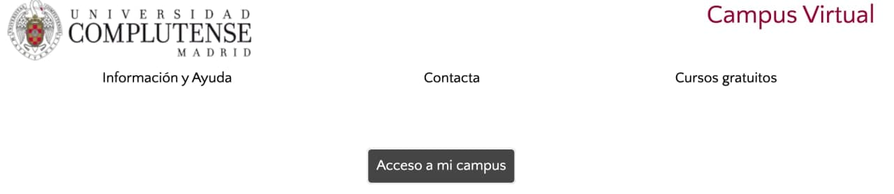
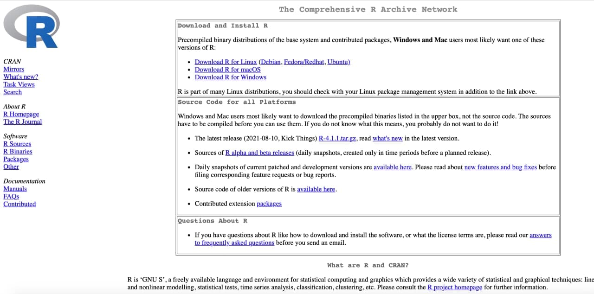
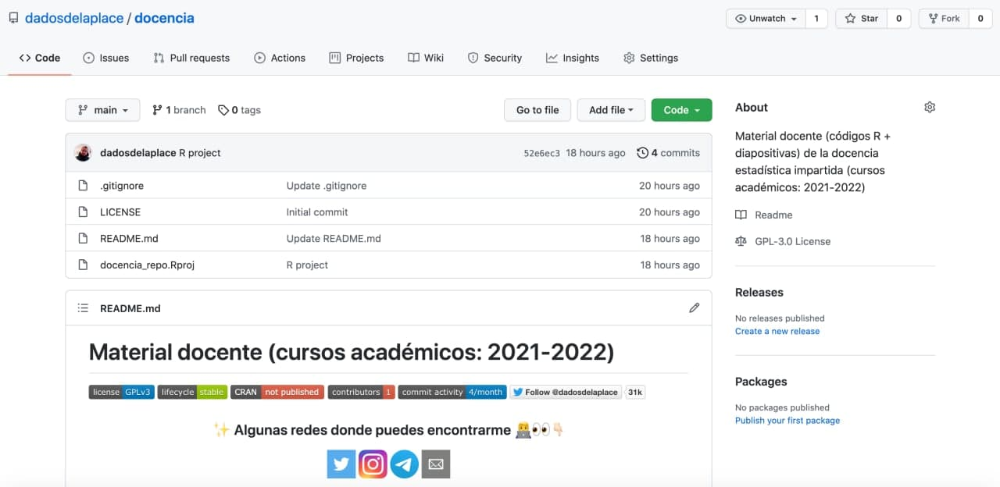
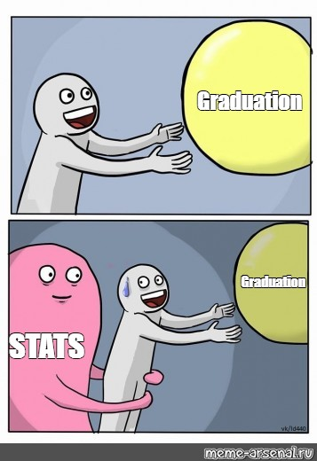
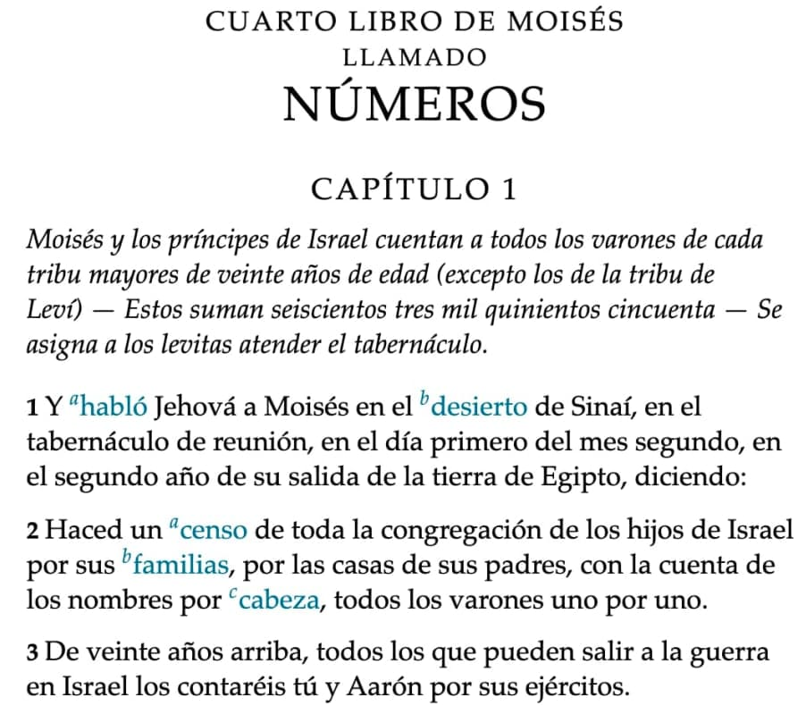

```{r settings, echo = FALSE, message = FALSE}
options(htmltools.dir.version = FALSE)
library(knitr)
knitr::opts_chunk$set(echo = TRUE, warning = FALSE, message = FALSE, fig.showtext = T, fig.retina = 1)
library(tidyverse)
library(fontawesome)
library(glue)
library(xaringanExtra)

use_xaringan_extra(c("tile_view", "animate_css", "tachyons"))
use_tile_view() # panel
# xaringanExtra::use_scribble() # scribble
use_extra_styles(hover_code_line = TRUE,
                 mute_unhighlighted_code = FALSE) # Hover triangle code line
use_clipboard( # About clipboard
  button_text = "Click para copiar código",
  success_text = "Código copiado",
  error_text = "Ctrl+C para copiar"
)
use_freezeframe() # restarting gifs
use_animate_all("fade") # animates
use_panelset() # panels 
```

class: inverse, center, middle

# PRESENTACIÓN DE LA <br> .fat[ASIGNATURA]

&nbsp;  

&nbsp;  

&nbsp; 

&nbsp;

.left[.salt[Pulsa <kbd-white>O</kbd-white> para ver el panel de diapositivas]]
.left[.salt[Pulsa <kbd-white>H</kbd-white> para ver otros atajos]]

---

.right[Clase 1/28]
# Me presento

**[Javier Álvarez Liébana](http://twitter.com/dadosdelaplace)**, nacido en un año indeterminado en **Carabanchel** (Madrid).


--

(no, Manolito Gafotas era de Carabanchel Alto)

--

[**Un poco de CV**](https://www.dadosdelaplace.com/): licenciatura Matemáticas (UCM), máster Ingeniería Matemática (UCM), Doctor en Estadística (UGR), Ayudante Doctor en UNIOVI y UCM

--

&nbsp;

### .fancy[**Divulgando cuando puedo**] 👇🏻

[`r fa(name = "desktop")` www.dadosdelaplace.com](http://www.dadosdelaplace.com)  
[`r fa(name = "twitter")` @dadosdelaplace](http://twitter.com/dadosdelaplace)  
[`r fa(name = "instagram")` @javieralvarezliebana](https://instagram.com/javieralvarezliebana)  
[`r fa(name = "paper-plane")` http://t.me/dadosdelaplace](https://t.me/dadosdelaplace)  
[`r fa(name = "github")` http://github.com/dadosdelaplace](http://github.com/dadosdelaplace) 

--

**`Despacho`**: X, planta Y, Facultad de Estudios Estadísticos (UCM).

---
.right[Clase 1/28]
# ¿Cómo vamos a funcionar?

🗓 .saltinline[**Horario**]: lunes de 13:00 a 15:00; jueves de 11:00 a 13:00.  
🏫 .fatinline[**Tutorías**]: 12:00-13:00 lunes; 13:00-14:00 y 17:00-18:00 jueves.

--

&nbsp;

.heat[Campus virtual]

Lugar donde se subirán los **materiales docentes** y se hará la comunicación oficial del curso, así como la subida de calificaciones.

```{r campus, echo = FALSE}

``` 

---
.right[Clase 1/28]
# ¿Cómo vamos a funcionar?

🗓 .saltinline[**Horario**]: lunes de 13:00 a 15:00; jueves de 11:00 a 13:00.  
🏫 .fatinline[**Tutorías**]: 12:00-13:00 lunes; 13:00-14:00 y 17:00-18:00 jueves.

&nbsp;

.heat[Telegram]

Usaremos un [canal de Telegram](https://t.me/exploracion_datos_2021_2022) como foro de la clase para la **comunicación del día a día** (si procede podemos hacer un grupo para preguntar dudas rápidas).

```{r telegram, echo = FALSE}

``` 

---

.right[Clase 1/28]
# ¿Cómo vamos a funcionar?

🗓 .saltinline[**Horario**]: lunes de 13:00 a 15:00; jueves de 11:00 a 13:00.  
🏫 .fatinline[**Tutorías**]: 12:00-13:00 lunes; 13:00-14:00 y 17:00-18:00 jueves.

&nbsp;

.heat[Software: R]

El software que usaremos durante todo el curso será [R](https://cran.r-project.org/), un **software estadístico gratuito y de código libre**, que nos permitirá implentar en la práctica los conocimientos teóricos.

```{r R, echo = FALSE}

``` 

---
.right[Clase 1/28]
# ¿Cómo vamos a funcionar?

🗓 .saltinline[**Horario**]: lunes de 13:00 a 15:00; jueves de 11:00 a 13:00.  
🏫 .fatinline[**Tutorías**]: 12:00-13:00 lunes; 13:00-14:00 y 17:00-18:00 jueves.

&nbsp;

.heat[GitHub]

Todos los **códigos R y Rmarkdown** (así como los códigos de estas diapositivas) estarán subidos en el [repositorio de GitHub](github.com/dadosdelaplace/docencia).

```{r github, echo = FALSE}

```

---
.right[Clase 1/28]
# ¿Cómo vamos a funcionar?

🗓 .saltinline[**Horario**]: lunes de 13:00 a 15:00; jueves de 11:00 a 13:00.  
🏫 .fatinline[**Tutorías**]: 12:00-13:00 lunes; 13:00-14:00 y 17:00-18:00 jueves.

&nbsp;

.heat[Diapositivas]

Las diapositivas están disponibles y actualizadas en las [webs](https://www.dadosdelaplace.com/docencia/descriptiva-2021-2022/)

https://www.dadosdelaplace.com/docencia/descriptiva-2021-2022/

https://descriptiva-estad-apli-ucm-2021-2022.netlify.app/


---
.right[Clase 1/28]
# ¿Cómo vamos a funcionar?

🗓 .saltinline[**Horario**]: lunes de 13:00 a 15:00; jueves de 11:00 a 13:00.  
🏫 .fatinline[**Tutorías**]: 12:00-13:00 lunes; 13:00-14:00 y 17:00-18:00 jueves.

&nbsp;

&nbsp;

.heat[EVALUACIÓN]

- La **asistencia no será obligatoria**, aunque la participación en clase si contará en positivo en la evaluación continua

- .saltinline[**Evaluación continua**]: participación en clase y trabajo realizado durante el curso (problemas y posibles entregas de prácticas).

- .saltinline[**Nota final**]: se ponderará un **35% la evaluación continua** y un **65% la calificación de un examen final**. La nota final será el **máximo entre esta ponderación y dicho examen**. Ejemplos: continua 9/10 + examen final 5/10 = nota final 6.4/10; continua 5/10 + examen final 1/10 = nota final 5/10 (ponderación 3.6/10 pero 5/10 en la prueba final).

---
class: inverse, center, middle

# APRENDIENDO A <br> .fat[PROGRAMAR EN R]


---

class: inverse, center, middle

# ¿CUÁLES SON LAS VENTAJAS DEL <br> .acid[SOFTWARE LIBRE?]


---
.right[Clase 1/28]
# Introducción a `R`

`R` es un **lenguaje de programación** (https://cran.r-project.org/) especialmente pensado para el **análisis estadístico** (pero de proposito general)

* .saltinline[**Gratis**]
* .saltinline[**Software libre**]: no solo es gratis sino que su código se puede ver y modificar (e **incorporar código de otras personas**, INCLUSO de otros lenguajes).
* **Modular**: instalas lo que necesitas (hola, Matlab).
* **Soporte infinito**: tiene una inmensa comunidad de usuarios.
--

## ¿Qué NO es `R`?

⛔️ .heatinline[**NO**] requiere una curva de aprendizaje elevada (sí C++ o Fortran).  
⛔️ .heatinline[**NO**] es un lenguaje especialmente rápido en la ejecución (sí C++ o Fortran).  
⛔️ .heatinline[**NO**] es una base de datos

---
.right[Clase 1/28]
# Introducción a `R`

El **aprendizaje de `R`** irá pegado a los contenidos teóricos y ejercicios del curso, en lugar de darnos un atracón final de programación sin relación con el mundo real.

--

⛔️ .saltinline[**NO TE AGOBIES**] ni te obsesiones con aprender cada comando o función: tienes un manual y un invento llamado internet a tu disposición.

--

⏳.saltinline[**NO LO DEJES PARA EL FINAL**]:  pregunta las dudas en el momento que necesites.

--

🗓 Normalmente los .fatinline[**lunes**] los dedicaremos a los **conceptos teóricos** y los .fatinline[**jueves**] a realizar ejercicios y programación en `R` (y alguna entrega 😈).

--

## Manual de programación alojado en `GitHub` 

Todo lo relacionado con `R` lo seguiremos a través del manual alojado en [GitHub](https://github.com/dadosdelaplace/cursoR_intro_2021_2022) y disponible actualizado en https://aprendiendo-r-intro.netlify.app/

---

class: inverse, center, middle

# Tema 1 <br> .fat[estadística...WTF?]

---

class: inverse, center, middle

# ¿CÓMO DEFINIRÍAS <br> .acid[LA ESTADÍSTICA?]

---
.right[Clase 2/28]
# .saltinline[Tema 1: estadística...WTF?]

.pull-left[
## Objetivos:
* ¿Qué es la estadística?
* Un poquito de historia
* Conceptos básicos: muestra, caracteres, modalidades y variables]

.pull-right[
```{r echo = FALSE, out.width = "75%", fig.align = "center"}

```
]

---
.right[Clase 2/28]
# .fat[¿Qué es la estadística?]

## Según la RAE:

1. f. Estudio de los datos cuantitativos de la población, de los recursos naturales e industriales, del tráfico o de cualquier otra manifestación de las sociedades humanas.

2. f. Rama de la matemática que utiliza grandes conjuntos de datos numéricos para obtener inferencias basadas en el cálculo de probabilidades.

---
.right[Clase 2/28]
# .fat[¿Qué es la estadística?]

## Según Stanford<sup>1</sup>:

Disciplina encargada del estudio, la recolección, la organización, el análisis, la interpretación Y .saltinline[**LA PRESENTACIÓN**] de los datos.

.footnote[[1] [Stanford Encyclopedia of Philosophy](https://plato.stanford.edu/entries/statistics/)]

---

class: inverse, center, middle

# ¿CUÁLES FUERON LOS <br> .acid[PRIMEROS USOS] <br> DE LA ESTADÍSTICA?

---
.right[Clase 2/28]
## .salt[Historia de la estadística]

.pull-left[
* Del (neo)latín «statisticum collegium»: consejo de **Estado**.
* Del alemán «statistik» (ciencia del **Estado**, intoducido por G. Achenwall).

&nbsp;

&nbsp;

.heatinline[**Origen**]: una herramienta para la **administración** eficiente del Estado

]

.pull-right[
```{r echo = FALSE, out.width = "80%", fig.align = "center"}

```
]

---
.right[Clase 2/28]
## .saltinline[Primeros usos: elaboración de censos]

Los **primeros usos** documentados de la estadística fue la elaboración de censos por parte de **mesopotámicos, chinos y egipcios**, con el objetivo de llevar un **recuento de los recursos** (humanos y materiales), con tres fines:

* Cobrar **.saltinline[impuestos]**.
* Reparto de **tierras** y optimización de su uso.
* **Reclutamiento de soldados** en edad de merecer.

## .fatinline[Estadística en la guerra]

.pull-left[Según Tucídides, conceptos como **.fatinline[la moda]** datan del **siglo V a.C.**: para asaltar la muralla de la ciudad de Platea, ponían a contar a varios soldados el número de ladrillos vistos en la muralla, quedándose con el **conteo más repetido (la moda, el más frecuente)**, permitiendo el cálculo de la altura de la muralla.]

.pull-right[
```{r echo = FALSE, out.width = "70%", fig.align = "center"}
knitr::include_graphics("./img/peloponeso.jpg")
```
]

---
.right[Clase 2/28]
### .salt[¿Qué han hecho los romanos por nosotros?]

```{r include=FALSE}
options(htmltools.dir.version = FALSE)
```

<iframe width="850" height="380" src="https://www.youtube.com/embed/WYU5SAQwc4I" frameborder="0" allow="accelerometer; autoplay; encrypted-media; gyroscope; picture-in-picture" allowfullscreen></iframe>

---
.right[Clase 2/28]
### .salt[¿Qué han hecho los romanos por nosotros?]

Precisamente por el tamaño de su Imperio, fueron los romanos quienes hicieron un uso más intenso de la estadística:

* .fatinline[**Censos**] (elaborados por la censura, que elaboraba no solo el censo sino la supervisión de la moralidad pública).
* Primeras .heatinline[**tablas de natalidad/mortalidad**]
* Primeros .acidinline[**catastros**] (registros oficiales de propiedades, creando los primeros impuestos a la vivienda a nobles y terratenientes, en función de su características)

```{r echo = FALSE, out.width = "50%", fig.align = "center"}

```

---
.right[Clase 2/28]

.pull-left[
.fat[**ÁRABES**]

Autores de los **primeros tratados de estadística**, como el manuscrito de **Al-Kindi (801-873)**, que usó la distribución de **frecuencias de palabras** para el desarrollo de métodos de cifrado y descifrado de **mensajes encriptados**.]

--

.pull-right[.fat[**MÉXICO**]

Ya en el **año 1116, el rey Xólotl** implementó un **censo** que consistía en la **estimación de piedras**, tirando cada súbdito una a un montón (Nepohualco).
]


--

&nbsp;

&nbsp;

.pull-left[.salt[**INGLATERRA**]

Desde el siglo XII se realiza la **Prueba del Pyx**, considerado uno de los **primeros controles de calidad**: se extre una de las monedas acuñadas y se deposita en una caja, para un año después comprobar su calidad y pureza.
]

--
.pull-right[
.salt[**ITALIA**]

En paralelo al **auge de los primeros «sistemas financieros» en Italia**, «La Nuova Crónica» de G. Villani fue considerado durante mucho tiempo el primer tratado de estadística (hasta el descubrimiento de los trabajos de Al-Kindi).
]

---
.right[Clase 2/28]

# Navegación y astronomía


.pull-left[
#### .salt[T. Brahe]

Uno de los primeros usos «modernos» de la estadística fue en la **navegación y la astronomía**, siendo Tycho Brahe de los primeros en utilizar la estadística para **reducir los errores** observacionales.
]

.pull-right[

#### .fat[E. Wright]

Fue el primero en usar en 1599 lo que hoy llamamos **mediana** en su libro «Certaine errors in navigation», aplicada a la navegación.

]

.pull-left[

#### .fat[G. Galileo]

Aunque la fama se la llevó **Gauss**, fue el primero en plantear una idea similar a la que hoy llamamos **método de mínimos cuadrados**: los valores más probables serían aquellos que minimizaran los errores.

]

.pull-right[
#### .salt[C. F. Gauss y A. M. Legendre]

El **método de los mínimos cuadrados**, en el que basan modelos actuales como la regresión, fue desarrollado por **Legendre y Gauss** (el último lo aplicó a la detección más probable del planeta enano Ceres).

]


[📌🧶 Hilo sobre la historia de la regresión y del método de mínimos cuadrados](https://twitter.com/DadosdeLaplace/status/1317766004466978817)


---

.right[Clase 2/28]
# Demografía, epidemiología y fisiología

.pull-left[

#### .fat[J. Graunt]

Autor de «Natural and Political Observations Made upon the Bills of Mortality» (1662), uno de los primeros trabajos en los que ya se hablaba de **exceso de mortalidad** a partir de las primeras tablas de natalidad y mortalidad, **estimando la población de Londres**.
]

.pull-right[

#### .salt[G. Neumann]

Las **fakes news** ya existían en el siglo XVII: Gaspar Neumann también un precursor en el **análisis estadístico de tablas de mortalidad**, para desmentir bulos (ejemplo: desmontó la creencia de que en los años acabados en siete morían más personas.
]


.pull-left[

#### .salt[J. Snow]

Se le considera pionero de la **epimdemiología moderna** y la **estadística espacial**: aunque los **diagramas de Voronoi** tardarían años en ser formalizados, John Snow aplicó el concepto para mitigar la **epidemia de cólera en Londres**.

]

.pull-right[

#### .fat[F. Galton]

Primo de Charles Darwin, inventor de los **silbatos para perretes**, de los mapas meteorológicos y la persona que acuñó el concepto de **regresión** para el análisis de la estatura a lo largo de los miembros de una familia.

]


[📚 «El mapa fantasma», Steven Johnson, sobre la historia de John Snow](https://capitanswing.com/libros/el-mapa-fantasma/)

---
.right[Clase 2/28]
### .salt[Probabilidad]

No fue hasta el auge de la **probabilidad** (con **Pascal, Laplace, los Bernoulli, de Moivre y Gauss**) cuando se empezaron a desarrollar los primeros métodos formales en estadística para **inferir conclusiones estadísticamente significativas**.


### .fat[Bioestadística]
Con los nuevos métodos de inferencia estadística que empezaban a surgir, y la **producción de datos** cada vez mayor, a finales del siglo XIX y principios del siglo XX la **bioestadística** supuso la explosión definitiva de la estadística.

### .acid[Encuestas y muestreo]
La complejidad de los análisis demográficos, políticos y sociológicos ha devuelto a la utilidad pública y estatal el protagonismo que tuvo, poniendo especial enfásis en cómo es la recogida y procesamiento de la información.

---

class: inverse, center, middle

# EMPECEMOS... <br> .acid[CONCEPTOS BÁSICOS]

### .fancy[Población vs Muestra - Variables - Modalidades - Cuanti vs Cuali]


---
.right[Clase 2/28]
### .salt[Población, individuo y muestra]

.panelset[
.panel[.panel-name[Población]

.pull-left[
```{r poblacion}
set.seed(1234567) #<<
# Creamos tabla dummy
tabla <-
  data.frame("nombres" = glue("nombre_{1:100}"),
             "casado" = rep(c(TRUE, FALSE), 50),
             "estudios" = rep(c("primaria",
                                "ESO", "bach", "uni"), 25),
             "estatura" = rnorm(100, mean = 170,
                                sd = 0.25),
             "hermanos" = rep(0:4, 20))
head(tabla) #<<
```
]

.pull-right[Muchos de los nombres y conceptos de la estadística hacen referencia a su uso primigenio: **los censos de población**

* .fatinline[**Población**]: en su momento era el **colectivo de individuos** a estudiar (por ejemplo, 47 millones de españoles), pero llamaremos población al **conjunto de posibles elementos o eventos**  de los que podríamos tener observaciones. 

* .heatinline[**Ejemplo con `R`**]: la tabla entera de 100 posibles individuos a medir.

* .acidinline[**Problema**]: normalmente es **inaccesible** su totalidad (es imposible medir al conjunto de la población española).
]
]

.panel[.panel-name[Individuo]

.pull-left[
```{r individuo}
# Número de individuos en la población
n_individuos <- nrow(tabla)

# Mensaje con el número
cat(glue("Hay {n_individuos} individuos"))

# Accedemos al primero y al décimo
tabla[1, ] #<<
tabla[10, ] #<<
```
]

.pull-right[

* .fatinline[**Individuo**]: cada uno de los **elementos** sobre los que vamos a **medir una característica** (cada una de las personas de España).

* .heatinline[**Ejemplo con `R`**]: normalmente los individuos son cada una de las filas de una tabla o base de datos (podría estar al revés, pero **el esquema habitual es una fila por individuo, una columna por característica**).

* .acidinline[**Aleatoriedad**]: un **experimento aleatorio** es aquel cuyo resultado inmediato, para cada individuo, no es posible saber con certeza, aunque eso no impida definir y conocer su patrón a **nivel poblacional (teórico)**. No sabemos que saldrá en el dado en cada tirada pero sí la probabilidad de cada dígito.

]

]

.panel[.panel-name[Muestra]

.pull-left[
```{r muestra}
# Generamos aleatoriamente 6 índices de filas 
set.seed(1234567) #<<
filas <- # replace = FALSE (por defecto), para no repetir filas
  sample(x = 1:n_individuos, size = 6)
tabla[filas, ] #<<
```
]

.pull-right[

* .fatinline[**Muestra**]: **selección representativa** de la población, subconjunto que **capture una información lo más similar** posible a la de la población total (teórica).

* .acidinline[**Tamaño muestral**]: número de individuos seleccionados, denotado como $n$.

* .heatinline[**Ejemplo con `R`**]: seleccionar un número de filas de la tabla total. El **tamaño muestral** será el **tamaño de la tabla** con la que vamos a trabajar (el número de filas)

]


.heatinline[**Importante**]: normalmente en `R` la tabla que nos llega ya en sí la muestra de una población más grande, y no es necesario aplicar técnicas de muestreo (sí de filtrado y depuración).
]

.panel[.panel-name[Ejemplos de muestreo]

.pull-left[
```{r}
set.seed(1234567) #<<
library(SamplingUtil) # instalar en devtools::install_github("DFJL/SamplingUtil")

# Aleatorio sistemático
idx <- sys.sample(n_individuos, n = 5) #<<
idx
tabla[idx, ]
``` 
]

.pull-right[

* .fatinline[**Aleatorio simple**]: individuos seleccionados **totalmente al azar** (no garantiza representatividad).

* .fatinline[**Aleatorio sistemático**]: una vez elegido un individuo al azar de la población (tamaño $N$), los siguientes se seleccionan de forma **sistemática** cada $k = N / n$ valores, donde $n$ es el tamaño de la muestra deseada. Si $N=150$ y $n=45$, se seleccionarán cada $k=150/45 \simeq 3$ valores a partir del primero (ignorando **sesgos de ordenación**).

* .fatinline[**Muestreo aleatorio estratificado**]: se divide a la población en **estratos** (subgrupos o subpoblaciones), lo más diferenciados entre sí pero lo más parecidos internamente respecto a la característica a medir.
]
]
]

---
.right[Clase 2/28]

### .fat[Características y modalidades]

.panelset[
.panel[.panel-name[Variables]
.pull-left[
```{r}
head(tabla)

# Características medidas (nombre de columnas)
colnames(tabla) #<<
```
]

.pull-right[

### .salt[**Caracteres**]

Cada una de las variables o **columnas de una tabla**, cada una de las **características o cualidades que se miden/estudian** para cada uno de los individuos seleccionados en la muestra.
]
]


.panel[.panel-name[Modalidades]
.pull-left[

```{r}
# Modalidades de la variable casado
unique(tabla$casado) #<<

# Modalidades de la variable estudios
unique(tabla$estudios) #<<
```
]

.pull-right[

### .salt[**Modalidades**]

Llamaremos modalidades a los **diferentes valores que puede adoptar** una característica o variable. En el caso de `estado` solo podrá tomar los valores `TRUE` y `FALSE`, pero la estatura es una variable continua: su modalidad es son todos los números reales positivos hasta una altura máxima.
]
]

.panel[.panel-name[Variables cuantitativas]
.pull-left[

```{r}
# Variable discreta
tabla$hermanos[1:10] #<<

# Variable discreta (no depende de que tengan o no decimales)
tabla$hermanos[1:10] / 7 #<<

# Variable continua
tabla$estatura[1:10] #<<
``` 

]

.pull-right[
### .fat[Cuantitativas]

Representan una **cantidad numérica** medible.

* .saltinline[**Discretas**]: se pueden **contar** y **enumerar (aunque sean infinitos)**, detrás de un valor puedo saber cuál viene después (personas, granos de arena, etc).

* .acidinline[**Continuas**]: no solo toman infinitos valores sino que entre dos valores cualesquiera, también hay infinitos términos, no se puede determinar el siguiente valor (estaturas, pesos, temperatura, etc).

]
]

.panel[.panel-name[Variables cualitativas]
.pull-left[

```{r}
# Variable nominal (lógica en este caso)
tabla$casado[1:10] #<<

# Variable nominal (cadena de texto)
tabla$nombres[1:10]#<<

# Variable ordinal
tabla$estudios[1:10] #<<


``` 

]

.pull-right[
### .fat[Cualitativas]

Variables que representan **cualidades (CATEGORÍAS)** (estado civil, sexo, religión, nivel de estudios, etc).

* .saltinline[**Ordinales**]: cualidades que **admiten una ordenación, tienen definida una jerarquía** (suspenso-aprobado-notable, sano-leve-grave-muerto).

* .acidinline[**Nominales**]: representan cualidades que **no tienen (no deberían) asociada una jerarquía** (hombre-mujer, rojo-azul-amarillo, ateo-católico-musulmán).

]
]
]

---
class: inverse, center, middle

.salt[MUESTRA   ➡️   ] .acid[HIPÓTESIS   ➡️   ] .fat[CONCLUSIONES]

### .fancy[.saltinline[**descriptiva** (realidad)]] - .fancy[.acidinline[**probabilidad**]] - .fancy[.fatinline[**inferencia** (realidad vs hipótesis)]]
---

class: inverse, center, middle

# Tema 2 <br> .fat[DESCRIPTIVA UNIDIMENSIONAL]

### .fancy[Frecuencias unidimensionales - Medidas de centralización, dispersión, posición y forma - Diagramas diferencial e integral - Momentos - Dataviz (tallos y hojas + caja)]


---

.right[Clase 3/28]


---


class: inverse, center, middle

# Tema 3 <br> .fat[DESCRIPTIVA BIDIMENSIONAL]

### .fancy[Frecuencias bidimensionales - Tablas de doble entrada - Marginal vs condicionada - Independencia - Momentos - Dataviz]

---

class: inverse, center, middle

# Tema 4 <br> .fat[MODELOS PREDICTIVOS]

### .fancy[Regresión lineal y correlación - Coeficiente Sperman y Kendall - Introducción a lo multivariante - Regresión logística - Introducción a los GLM]

---


class: inverse, center, middle

# Tema 5 <br> .fat[PROBABILIDAD (INTRODUCCIÓN)]

### .fancy[Enfoque frecuentista - Enfoque axiomático - Sucesos y espacios de probabilidad - Teorema de la probabilidad condicionada - Teorema de la probabilidad total - Teorema de Bayes]

---

.heat[**Recursos usados para las diapositivas**]

* [Paquete `{tidyverse}`](https://www.tidyverse.org/): conjunto de paquetes para la **depuración**, análisis y **visualización** de datos.

* [Paquete `{purrr}`](https://purrr.tidyverse.org/): paquete para la **programación funcional con listas**.

* [Paquete `{SamplingUtil}`](https://rpubs.com/Felipe1986/MuestreoTutorialR): paquete para la simulación de distintos **tipos de muestreos**.

* [Paquete `{rmarkdown}`](https://rmarkdown.rstudio.com/): paquete para **contar una historia** con tus datos (documentos, informes, paneles, presentaciones, libros, etc).

* [Paquete `{knitr}`](https://yihui.org/knitr/): paquete para la elaboración flexible y rápida de **informes** y documentos con `R`.

* [Paquete `{fontawesome}`](https://www.ctan.org/pkg/fontawesome): paquete para el uso de **fuentes y emojis**.

* [Paquete `{xaringan}`](https://slides.yihui.org/xaringan/#6): paquete para elaborar **diapositivas** uniendo {`rmarkdown`} y **javascript**.

* [Meet `{xaringan}` (de Alison Hill)](https://arm.rbind.io/slides/xaringan.html#1): tips para presentaciones en `{xaringan}`.

* [Paquete `{xaringanExtra}`](https://pkg.garrickadenbuie.com/xaringanExtra/#/?id=xaringanextra): paquete para algunas **extensiones** en la elaboración de diapositivas con `{xaringan}` (paneles, destacar líneas de código, etc)

---

.salt[**Recursos generales en redes**]
  - [Paquete `{tidyverse}`](https://www.tidyverse.org/): web oficial y documentación.
  - [Epidemiología en `R`](https://epirhandbook.com/index.html).
  - [Anabel Forte](https://twitter.com/AnaBayes): estadística y divulgadora, e investigadora de la Universidad de Valencia.
  - [Picanúmeros](https://twitter.com/Picanumeros): divulgador e investigador de la Universidad de Granada).
  - [RLangPackage](https://twitter.com/RLangPackage): un postean en Twitter un paquete al día.
  - [R posts you might have missed!](https://twitter.com/icymi_r): postean en Twitter recursos de todo tipo para el análisis estadístico en R.
  - [Mine Çetinkaya-Rundel](https://twitter.com/minebocek): estadística y experta en `R` (trabajando en `R Studio`).
  - [Alison Hill](https://twitter.com/apreshill): científica de datos y desarrolladora de múltiples paquetes.
  - [Hadley Wickham](https://twitter.com/hadleywickham): Chief Scientist en `R Studio` y desarrollador del entorno de paquetes `{tidyverse}`.
  - [Grupo de Telegram](https://t.me/hispanoverse) y [canal de Discord](https://discord.gg/7ueKQqeaGr) de la comunidad de R hispano.
  
.fat[**Dataviz**]
  - [Paquetes `{ggplot2}`](https://r4ds.had.co.nz/data-visualisation.html) y [`{plotly}`](https://plotly.com/r/)
  - [Expertos en visualización de datos](https://twitter.com/i/lists/1324478481338683392): cuenta de usuarios de Twitter expertos en dataviz.
  - [Visualización de predicciones](https://www.fharrell.com/post/addvalue/).
  - [Proyecto #tidytuesday](https://github.com/rfordatascience/tidytuesday): desafío semanal para el aprendizaje en comunidad ([cuenta de Twitter](https://twitter.com/r4dscommunity)).
  - [Cédric Scherer](https://t.co/2jRS9ovubO?amp=1): ecólogo y especialista en visualización de datos con `{ggplot2}`.
  - [Dominic Royé](https://twitter.com/dr_xeo): experto en visualización de datos geográficos.
  - [Paula Casado (El arte del dato)](https://twitter.com/elartedeldato): cuenta de Twitter especializada en dataviz.
  - [Michela Lazzaroni](https://twitter.com/michelaz988): editora, diseñadora y experta en visualización de datos.
  - [Gráficos BBC](https://bbc.github.io/rcookbook/#how_to_create_bbc_style_graphics): generar gráficos en `R` con el estilo de las infografías de la BBC.
  - [Mapas en `R`](geocompr.robinlovelace.net (https://geocompr.robinlovelace.net/adv-map.html) y [geocomputación](https://geocompr.github.io/).
  - [Paquete `{spiralize}`](https://jokergoo.github.io/spiralize_vignettes/spiralize.html): visualizar datos en formato de espiral.

---

.fat[**Presentación de resultados**:]
  - [Paquete `{bookdown}`](https://bookdown.org/yihui/bookdown/): generación en `R` de informes y libros, mezclando fórmulas matemáticas, texto plano, código `R` y gráficas.
  - [Paquete `{xaringan}`](https://slides.yihui.org/xaringan/#1): generar diapositivas desde `R`.
  - [Presentación de tablas estéticamente](https://rfortherestofus.com/2019/11/how-to-make-beautiful-tables-in-r/): paquetes `{gt}`, `{kable}`, `{DT}`, `{formattable}`, `{reactable}`, `{flextable}`.
  - [Paquete `{shiny}`](https://shiny.rstudio.com/): creación  de webs interactivas.
  
.salt[**Inferencia y ciencia de datos**]
  - [Inferencia estadística en `R`](https://moderndive.com/8-confidence-intervals.html).
  - [Women in Statistics and Data Science](https://twitter.com/WomenInStat?t=6HSzYGrrX44yv9C_XuCddA&s=09): cuenta de Twitter para visibilizar el trabajo de mujeres en la estadística y la ciencia de datos.
  - [Paquete de `{tidytext}`](https://www.tidytextmining.com/sentiment.html): para **analizar textos (data mining)** y «análisis de sentimientos» de los mismos.
  - [Curso en Datacamp de text mining](https://www.datacamp.com/tracks/text-mining-with-r)
  - [Ciencia de datos en `R`](https://bookdown.org/dparedesi/data-science-con-r/).
  
.fat[**Gestionar versiones**:]
  - [GitHub en `R Studio`](https://comunidadbioinfo.github.io/cdsb2020/gitIntro/GitHubIntro.html#1)
  - [Git en `R`](https://happygitwithr.com/rstudio-git-github.html)
  
---

class: inverse, center, middle

# ESPERO QUE HABERTE ENSEÑADO ALGO <br> .fat[MUCHAS GRACIAS]

&nbsp;

### Tienes más recursos en <br> .salt[🔗 www.dadosdelaplace.com]


