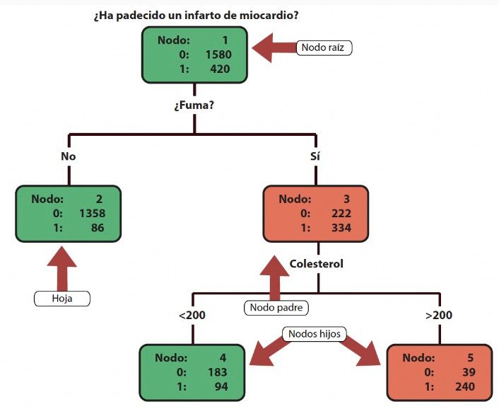
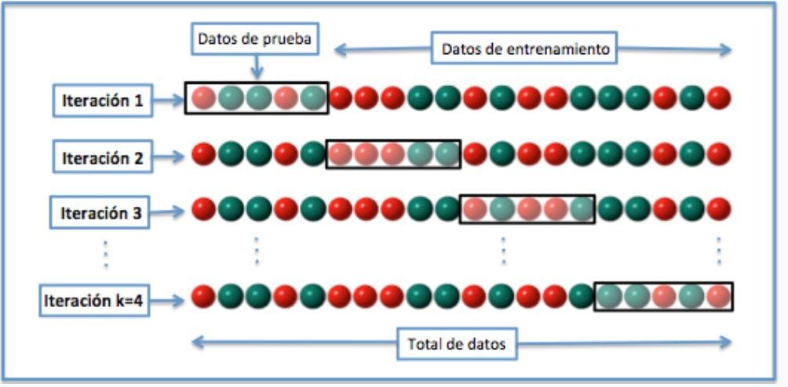

```{r setup, include = FALSE}
# Ajuste comunes de los chunk
knitr::opts_chunk$set(fig.width = 8, fig.asp = 1, out.width = "100%",
                      message = FALSE, warning = FALSE,
                      echo = TRUE, res = 400)
```

# Objetivo {#objetivo}

El objetivo de este pequeño tutorial es saber aplicar un flujo de trabajo en el entorno `{tidymodels}` para poder implementar un algoritmo de clasificación basado en árboles de decisión en `R`. Puedes ver más detalles y funcionalidades en la web oficial del paquete: <https://www.tidymodels.org/>


## Paquetes necesarios

Necesitaremos los siguientes paquetes

* **Análisis exploratorio numérico**: paquete `{skimr}`
* **Depuración y preprocesamiento**: paquete `{tidyverse}`
* **Detección de outliers**: paquete `{outliers}`
* **Modelización**: paquete `{tidymodels}` para modelos
* **Dibujar árboles**: paquete `{rpart.plot}`
* **Importancia de variables**: paquete `{vip}`


```{r paquetes}
# Borramos
rm(list = ls())

# Paquetes
library(skimr) # resumen numérico
library(outliers) # resumen outliers
library(tidymodels) # depuración datos
library(tidyverse) # modelos
library(rpart.plot) # dibujar árboles
library(vip) # importancia de varibales
```

# Datos {#datos}

Los datos utilizados en este primer tutorial será el famoso dataset conocido como `iris`, que pasaremos a formato tibble nada más empezar

```{r carga-datos}
iris <- as_tibble(iris)
glimpse(iris)
```

## Análisis exploratorio (numérico)

Antes de tomar ninguna decisión con los datos lo primero que deberíamos hacer es **echar un vistazo numérico** a cómo se comportan las variables. Dado que vamos a clasificar, lo primero que deberíamos observar es como se distribuyen los niveles de nuestra variable objetivo.

```{r}
# Objetivo: predecir la especie de las plantas
iris %>% count(Species) %>% mutate(porc = 100 * n / sum(n))
```

Además con la función `skim()` del paquete `{skimr}` podemos **extraer algunas estadísticas básicas** de nuestros datos.

```{r skim}
# Resumen numérico
iris %>% skim()
```

## Análisis visual: gráficas

### Scatter plot

```{r}
sysfonts::font_add_google(name = "Roboto") # Fuente de google
# Usar fuentes a futuro
library(showtext)
showtext_auto()

theme_set(theme_minimal(base_family = "Roboto")) # Definir tema base
theme_update( # Configurar tema
  plot.title = element_text(color = "#C34539", face = "bold", size = 30),
  plot.subtitle = element_text(color = "#3E6FCB", face = "bold", size = 20))

library(ggthemes)
ggplot(iris,
       aes(x = Sepal.Length, y = Sepal.Width,
           color = Species)) +
  geom_point(size = 3, alpha = 0.5) +
  scale_color_brewer(palette = "Dark2") + 
  labs(title = "Scatter plot de iris",
       subtitle = "Longitud de sépalo vs anchura de sépalo") +
  theme_minimal()
```

### Scatter plot de todas las variables + densidades

Con `geom_autodensity()` junto con `facet_matrix()` podemos pintar todas las variables frente a todos, poniendo en la diagonal las funcuones de densidad de cada variable (se indica `x = .panel_x` y `y = .panel_y` y el se encarga de seleccionar todas ellas, menos `Species` que se la quitamos)

```{r}
library(ggforce)
ggplot(iris,
       aes(x = .panel_x, y = .panel_y,
           color = Species, fill = Species)) +
    geom_point(alpha = 0.4, size = 3) +
    geom_autodensity(alpha = 0.4) +
    facet_matrix(vars(-Species), layer.diag = 2) + 
    scale_color_brewer(palette = "Dark2") + 
    scale_fill_brewer(palette = "Dark2") + 
  labs(title = "Scatter plot de iris",
       subtitle = "Todas vs todas (densidades en diagonal") +
  theme_minimal()
```


### Histogramas

Para representar un **histograma** usaremos la capa geométrica `geom_histogram()`

* `alpha = ...`: transparencia del color.
* `bins = ...`: número de barras a construir.
* `color = ...`: color del contorno.
* `fill = ...`: relleno del histograma.

Con la capa de escala `scale_x_continuous()` le indicamos dónde queremos las marcas en los ejes y las etiquetas de las unidades, usando `scales::label_number()`.

```{r}
ggplot(iris,
       aes(x = Sepal.Length)) +
  geom_histogram(alpha = 0.3, bins = 25,
                 color = "white", fill = "blue") +
  scale_x_continuous(breaks = seq(4, 8, by = 0.5),
                     label = scales::label_number(suffix = " cm")) +
  labs(title = "Histograma de iris",
       subtitle = "Variable Sepal.Length, con bins = 25 (número de barras)",
       x = "Longitud de sépalo", y = "Frecuencia") +
  theme_minimal()
```


Podemos pintarlos todos juntos, preparando antes los datos y convirtiéndolos a tidy

```{r}
iris_tidy <-
  iris %>%
  pivot_longer(cols = Sepal.Length:Petal.Width,
               names_to = "variable", values_to = "values")
iris_tidy
```

Tras ello, pintamos lo mismo (ahora `x = values`) pero añadimos `facet_wrap()`. La capa de facets nos permite **componer gráficas**, por la variable que le indiquemos (mira `facet_wrap()` y `facet_grid()` para dos variables). En este caso, hará uno por valor diferente que tenga en `variable`.

```{r}
ggplot(iris_tidy,
       aes(x = values)) +
  geom_histogram(alpha = 0.3, bins = 25,
                 color = "white", fill = "blue") +
  facet_wrap(~variable, scales = "free") +  # escalas libres en cada uno
  labs(title = "Histogramas de iris",
       subtitle = "Con bins = 25 (número de barras)",
       x = "Longitud de sépalo", y = "Frecuencia") +
  theme_minimal()
```

```{r}
ggplot(iris_tidy,
       aes(x = values, bins = 25,
           color = Species, fill = Species)) +
  geom_histogram(alpha = 0.3) +
  scale_color_brewer(palette = "Dark2") +
  scale_fill_brewer(palette = "Dark2") +  
  facet_wrap(~variable, scales = "free") + 
  labs(title = "Histogramas de iris (por colores)",
       subtitle = "Con bins = 25 (número de barras)",
       x = "Longitud de sépalo", y = "Frecuencia") +
  theme_minimal()
```

### Diagrama de barras

Con `geom_bar()` construimos diagramas de barras. Fíjate que ggplot solo hace el conteo, no tenemos que hacer nosotros `count()` antes del gráfico.

```{r}
ggplot(starwars, aes(x = sex, fill = sex)) +
  geom_bar(color = "white", alpha = 0.3) +
  scale_fill_brewer(palette = "Dark2") +
  labs(title = "Diagrama de barras en starwars",
       subtitle = "Conteo del sexo de los personajes de starwars",
       x = "Sexo", y = "Frecuencia") +
  theme_minimal()
```

Podemos usar lo que sabemos de factores para ordenarlos por frecuencia

```{r}
ggplot(starwars, aes(x = fct_infreq(sex), fill = sex)) +
  geom_bar(color = "white", alpha = 0.3) +
  scale_fill_brewer(palette = "Dark2") +
  labs(title = "Diagrama de barras en starwars",
       subtitle = "Conteo del sexo de los personajes de starwars",
       x = "Sexo", y = "Frecuencia") +
  theme_minimal()
```
    
# Introducción teórica

Los **arboles de clasificación y regresión** (empezaremos por los primeros), conocidos como CART, fueron propuestos por Breiman et al. en 1984. La **principal idea** es _divide and conquer_: segmentar el espacio de predictoras (variables independientes) en **regiones distintas y no solapadas** a partir de un conjunto de reglas de decisión simples aplicadas de forma secuencial.


&nbsp;

Un árbol estará formado por los siguientes elementos:

* **Nodos**: segmentos del árbol que contienen subconjuntos de la muestra.

* **Nodo raíz**: segmento original (arranque inicial del árbol) que contiene a la **totalidad** de los datos.

* **Nodo padre/hijo**: nodos predecesor/sucesor de otro nodo.

* **Rama**: nodo y el conjunto de sus sucesores

* **Hojas**: nodos sin hijos em los que **finaliza una rama** y que usaremos para asignar las clases predichas.


```{r echo = FALSE,  out.width = "80%", fig.align = "center"}

``` 


## Construcción del árbol

* **Paso 1**: partimos de un nodo raíz con todas las observaciones.

* **Paso 2**: decidir la **regla de decisión óptima** (tomaremos decisiones binarias)
  - Decidir el **mejor punto de corte de todas** las variables a elegir.
  - Una vez que tenemos calculado el punto de corte óptimo de todas, nos quedamos con la mejor variable (¿qué es mejor?)

* **Paso 3**: repetimos proceso anterior hasta criterio de parada

```{r echo = FALSE,  out.width = "80%", fig.align = "center"}
knitr::include_graphics("./img/arboles_cortes.jpg")
``` 

Esta forma de construcción de árbol **no asegura obtener el mejor árbol posible**: no se evalúan todas las combinaciones posibles, es **algoritmo greedy o voraz**.

## Criterios de parada

Existen muchos criterios de parada pero los más habituales son los siguientes:

* **Mejora insuficiente**: ninguna de las variables y cortes posibles produce una mejora suficiente que compense sobreajustar el modelo.

* **Tamaño de hoja**: los posibles hijos tienen pocas observaciones (tamaño inferior a un valor/porcentaje de la muestra fijado) para seguir dividiendo.

* **Tamaño de división**: número de observaciones en la hoja actual (nodo susceptible de ser segmentado) demasiado pequeño. Tendrá relación con el criterio anterior.

* **Profundidad del árbol**: distancia (en número de nodos entre raíz y hoja más alejada) que supere un umbral predefinido para evitar el sobreajuste.

## Asignación de la clase


* **Árbol de clasificación**: para variables objetivo cualitativa se calcularán las **probabilidades estimadas** como la proporción de eventos en dicho nodo. Lo habitual es asignar al nodo la **categoría modal**.

&nbsp;

* **Árbol de regresión**: para variables objetivo cuantitativa se calculará la **estimación de continua** como la media de los valores en dicho nodo.


## Criterios de mejora/división


* **Criterios basados en la impureza**: llamaremos impureza a la cantidad de **«ruido»** que quedaría en nuestros nodos en caso de realizar la división. Un **nodo puro tendrá impureza nula** (solo elementos de una clase) .

```{r echo = FALSE,  out.width = "70%", fig.align = "center"}
knitr::include_graphics("./img/impureza.jpg")
``` 


* **Criterios basados en inferencia**: los conocidos como **árboles condicionados o inferenciales** la selección de ramas se realiza en base a un **contraste de independencia**. Si el contraste nos pide rechazar la hipótresis nula de independencia, significa hay una dependencia entre el corte y el reparto de clases de la objetivo (corte útil para segmentar). 


### Impureza: índice de Gini

* **Criterio del índice de Gini**: criterio basado en la impureza, definida como la **probabilidad** de, **extraídos dos elementos de un nodo** (con remplazamiento), que **no sean de la misma clase**. Si tenemos una objetivo con $k$ categorías entonces, llamaremos $P(C_i)$ a la probabilidad de que los dos elementos sean de la categoría $C_i$, con $i=1, \ldots, C$

Para cada nodo, la **probabilidad de que ambos sean de la misma categoría** (clases no solapadas, la intersección es nula) será por tanto

$$P(C_1 \cup C_2 \cup \ldots \cup C_k) = \sum_{i=1}^{k}P(C_i) = \sum_{i=1}^{k} \left(\frac{n(C_i)}{n(nodo)}\right)^2$$


La impureza entonces queda definida como su complementario

$$Gini(nodo) = 1 - \sum_{i=1}^{k} \left(\frac{n(C_i)}{n(nodo)}\right)^2$$


* **Mejor caso**: que todos sean de la misma clase, por ejemplo $C_1$, tal que $Gini(nodo) = 1 - \left(\frac{n(C_1)}{n(nodo)}\right)^2 = 0$

* **Peor caso**: que tengas las clases igual de repartidas tal que $Gini(nodo) = 1 - \sum_{i=1}^{k} \left(\frac{n(nodo) / k}{n(nodo)}\right)^2 = 1-\sum_{i=1}^{k} \frac{1}{k^2} = 1 - \frac{1}{k}$ (0.5 en el caso de que tengamos $k=2$)

&nbsp;

Así la **impureza total del árbol]** se calculará como la suma de las impurezas de cada nodo ponderadas por su tamaño (número de observaciones de cada nodo).

### Impureza: entropía

* **Criterio de entropía**: criterio basado en la impureza, definida como la **cantidad de información necesaria para «explicar» el nodo**. La entropía en teoría de la información se define como $H = -\sum_{i=1}^{k}p_i log_2(pi)$, donde $p_i$ es la probabilidad de cada uno de los posibles evenetos (se usa log en base 2 porque se asume que la información será representada en código binario)


Para cada nodo, la **entropía** será definida por tanto como

$$H(nodo) = -\sum_{i=1}^{k}\frac{n(C_i)}{n(nodo)} log_2\left( \frac{n(C_i)}{n(nodo)} \right)$$


* **Mejor caso**: que todos sean de la misma clase, por ejemplo $C_1$, tal que $H(nodo) =-\frac{n(C_1)}{n(nodo)} log_2\left(\frac{n(C_1)}{n(nodo)} \right) = -log_2(1) = 0$

* **Peor caso**: que tengas las clases igual de repartidas tal que $H(nodo) = -\sum_{i=1}^{k}\frac{n(nodo)/k}{n(nodo)} log_2\left( \frac{n(nodo)/k}{n(nodo)} \right) = -\sum_{i=1}^{k}\frac{1}{k} log_2\left( \frac{1}{k} \right)$ (1 en el caso de que tengamos $k=2$)

De nuevo la **impureza total** se calculará como la suma de las entropías de cada nodo ponderadas por su tamaño (número de observaciones de cada nodo).

### Árboles inferenciales

* **Criterios basados en inferencia**: los conocidos como **árboles condicionados o inferenciales** la selección de ramas se realiza en base a un **contraste de independencia**. 


$$\sum_{i=1}^{2}\sum_{j=1}^{k} \frac{\left(O_{ij} - E_{ij}\right)^2}{E_{ij}} \sim \chi_{1, k-1}^{2}$$

Tendremos una variable predictora (la que usamos para ejecutar el corte) con 2 modalidades (cortes binarias) y una objetivo de $k$ clases tal que

* $O_{ij}$: frecuencias observadas, número de veces que $(X=x_i, Y=y_j)$, donde $x_1$ y $x_2$ son las opciones de corte.

* $E_{ij}$: frecuencias esperadas si el corte fuese independiente de la objetivo, es decir, $E_{ij} = \frac{E_{i, \cdot} * E_{\cdot,j}}{N}$.


Si el contraste nos pide rechazar la hipótesis nula de independencia, significa que hay una dependencia entre el corte y el reparto de clases de la objetivo -> **corte útil** para segmentar


### Caso práctico: calcular la impureza

Vamos a determinar la impureza según ambos criterios en el ejemplo de la imagen, para cada uno de los posibles cortes, con la variable objetivo definida como «juega al cricket» (binaria)

```{r echo = FALSE,  out.width = "100%", fig.align = "center"}
knitr::include_graphics("./img/ej_impureza.jpg")
```


## Validación: poda

Los árboles son modelos **muy interpretables** pero tienen una gran desventaja: tienen **tendencia al sobreajuste**, ya que es un algoritmo voraz. El modelo encontrado no necesariamente tiene que ser el mejor (solo era el mejor en cada paso, sin ver el árbol en su conjunto, al igual que la mejor decisión del coche amarillo sería cambiarse de carril con la información que tiene en ese momento, aunque no fuese la mejor global).

```{r echo = FALSE,  out.width = "80%", fig.align = "center"}
knitr::include_graphics("./img/poda_coche.jpg")
``` 


Para evitarlo una táctica habitual es **usar el conjunto de validación** para realizar una poda (con las reglas de decisión obtenidas en entrenamiento). La idea de la **poda** es la siguiente:

* **Paso 1: construir subárboles**. Dado un árbol final (un árbol maximal de N hojas), construimos todos los subárboles posibles de N-1 hojas.

* **Paso 2: evaluación**. Calculamos la tasa de mal clasificados para todos los subárboles y marcamos el que obtenga mejor métrica (incluido el árbol maximal).

* **Paso 3: recursividad**. Repetimos los pasos 1-2 hasta llegar al nodo raíz inicial.

* **Paso 4: criterio de selección**. Con todos los subárboles evaluados, seleccionamos como solución final el subárbol para el que un incremento de sus hojas no produza una mejora significativa.

&nbsp;

**Ventajas de los árboles**: amén de no tener hipótesis teóricas (tampoco el knn), **no dummyficar** (podremos introducir cuali vs cuanti), nos aportará al final una **jerarquía de importancia** de variables y nos crea una **partición de nuestro espacio de predictores**.


# Primer flujo de trabajo: iris datset

## Filosofía tidymodels

Como ya vimos, la idea detrás de `{tidymodels}` es **tratar por separado** la depuración y preparación de los datos, el modelo o paradigma de aprendizaje que se quiere aplicar, la optimización de los parámetros de dicho modelo, el ajuste, la evaluación y la predicción correspondiente, **creando un flujo de trabajo muy flexible**. La **filosofía es la misma que hay detrás de cocinar un plato**:

1. Primero **escribimos la receta**, una lista de pasos e instrucciones.
2. Después **preparamos la herramientas y utensilios para cocinar** (nuestro modelo).
3. Con la **receta + utensilios** podemos cocinar el plato muchas veces, con **distintos lotes de ingredientes (datos)**.

También podemos aplicar una receta distinta a distintos ingredientes, o incluso combinar partes de dos recetas. La idea es que tengamos guardado, y explícitamente detallado, cada uno de los componentes, para poder **combinarlos entre ellos**.

## Fase 1-2-3

Aplicando lo que ya vimos (en este caso el muestreo no será necesario por la poca cantidad de registros), implementaremos una **partición train-test** estratificado por la variable `Species`: repartiremos en **80-20%** los datos **PERO asegurándonos de que la proporción de 0's-1's se preserva**.

```{r sample, warning = FALSE}
# Partición 80-20%: estratificada
iris_split <- initial_split(iris, strata = Species, prop = 0.8)
iris_split
```

En `iris_split` tenemos **guardada la información** de lo que queremos hacer cuando lo apliquemos, pero hasta que no se aplique no realiza ninguna acción.

```{r}
iris_train <- training(iris_split)
iris_test  <- testing(iris_split)

# Comprobamos estratos
iris_train %>% count(Species) %>% mutate(porc = 100 * n / sum(n))
iris_test %>% count(Species) %>% mutate(porc = 100 * n / sum(n))
```

### Validación cruzada v-folds con repeticiones

Dado que tenemos **pocos datos**, lo ideal es validar con la técnica de **validación cruzada**: para tener una media de lo que nos equivocamos y una varianza de las predicciones, necesitaremos no solo varios modelos sino, en cada una, **varios conjuntos de validación**, y la forma más habitual es mediante **validación cruzada v-folds**, basada en **generar artificialmente conjuntos de validación** a partir de los datos originales.

```{r echo = FALSE,  out.width = "80%", fig.align = "center"}

``` 

Los datos se dividen en **v subsubconjuntos de igual tamaño**: en cada iteración i (de 1 a v) se usa como **conjunto train todo menos el subconjunto i-ésimo**, el cual es usado para validar (obteniendo un promedio de v iteraciones).


* **Iteración i**: entrenamos el modelo con los **conjuntos {1,...,i-1, i+1, ..., v}** y validamos con el **conjunto i-ésimo**.


En muchas ocasiones ese proceso se **repite un número k de veces** con el objetivo de **liminar el efecto de la forma de subdivisión** en v subconjuntos, obteniendo un promedio de $k*v$ conjuntos de validación, y tomar decisiones sobre los parámetros.

```{r}
iris_cv_folds <- vfold_cv(data = iris_train, v = 4, repeats = 10, strata = Species) #<<
iris_cv_folds
```


### Depuración

Ya vimos en la fase 2 de exploración que

* No parece que tengamos **problemas de codificación o rango**: los valores parecen valores permitidos según lo que representa la variable. 

* Tampoco tenemos **datos ausentes** (aunque en el caso de los árboles podemos dejarlo como una categoría más).

* La **variable con mayor dispersión** es `Petal.Length`

* Todas las **variables predictoras son numéricas** (aunque en el caso de los árboles no habrá problema para incluir las cualitativas)

* La variable objetivo está **balanceada**: tenemos proporciones similares para cada una de las modalidades.

* Las **variables relacionadas con el sépalo** no parece que cambien mucho de una especie a otra.

* Las **variables relacionadas con el pétalo** si parecen ser determinantes ya que la especie setosa tiene valores muy pequeños. Seguramente lo más complicado sea clasificar entre versicolor y virginica (se diferencia muy ligeramente)

* Tenemos dos variables muy correlacionadas: `Petal.Length` y `Petal.Width`, con una correlación de casi 1, lo que nos indica que nos van a aportar **información redundante** una de la otra, provocando **problemas de colinealidad**.

### Receta

Con la información obtenida de la anterior fase, en la **fase de modificación o depuración** es donde tendremos que tomar decisiones para **preparar nuestros datos** de manera adecuada. Y para ello será **fundamental conocer el algoritmo** que vamos a aplicar.

Antes vamos a definir una **función** para la detección de outliers

```{r}
outlier_detection <- function(x, method = "z", k = 2.5) {
  
  output <- ifelse(is.na(x) | abs(scores(x, type = method)) > k,
                   NA, x)
  return(output)
}

x <- c(1, 1.5, 2, 0, -1, -0.5, 0.3, 1, 0.1, 10, -12, 0, 1)
outlier_detection(x, method = "z", k = 2)
outlier_detection(x, method = "mad", k = 3)
```

De esta manera podremos usarla para cualquiera de los métodos y para cualquier valor de $k$.


```{r}
iris_tree_rec <-
  # Fórmula y datos
  recipe(data = iris_train, Species ~ .) %>%
  # Roles
  add_role(starts_with("Sepal"), new_role = "simétricas") %>% 
  add_role(starts_with("Petal"), new_role = "no simétricas") %>% 
  # Detectar outliers
  step_mutate(across(has_role("simétricas"), outlier_detection),
              across(has_role("no simétricas"), outlier_detection,
                     "mad", 3)) %>% 
  step_impute_mean(has_role("simétricas")) %>% 
  step_impute_median(has_role("no simétricas")) %>% 
  # Filtro de correlación
  step_corr(all_numeric_predictors(), threshold = 0.9) %>% 
  # Filtro de cero varianza
  step_zv(all_predictors())
iris_tree_rec %>% summary()
```

Fíjate que para los **árboles no necesitamos** normalizar con `step_range()` ni dummificar con `step_dummy()` (ya que no usaremos métricas geométricas).

&nbsp;

Una vez que la **receta está diseñada** una buena práctica para evitar errores es comprobar que se ejecuta correctamente (y qué no sucede nada raro) en el conjunto de entrenamiento. Tras escribir la receta vamos a **prepararla** (con `prep()`) y a **hornear los datos** con `bake()`: para hornearla en el conjunto de train, basta con poner `new_data = NULL`.

```{r bake}
# Aplicada a train
bake(iris_tree_rec %>% prep(), new_data = NULL)

# Aplicada a test
bake(iris_tree_rec %>% prep(), new_data = iris_test)
```

Nuestra receta, aplicada a nuestros ingredientes, está lista. Este «horneado» con `bake()` solo lo necesitamos **si queremos ya aplicar la receta a nuestros datos**. Nosotros, al añadir ahora un modelo de clasificación, **incluiremos la receta en un flujo de trabajo**.

## Fase 4: modelización

En este caso **nuestro modelo (en este caso de clasificación)** será un árbol de decisión, que implementaremos con `decision_tree()` (echa un vistazo a los modelos del paquete `{parsnip}`). 

En `decision_tree()` especificaremos los siguientes argumentos (de momento):

- `mode`: admite dos opciones, `mode = "classification"` o `mode = "regression"` (en nuestro caso `mode = "classification"`).
- `tree_depth`: profundidad del árbol (máxima longitud de una rama).
- `min_n`: mínimo número observaciones en una hoja para que sea dividida.
- `cost_complexity`: penalización para evitar modelos sobreajustados usada en la poda (a valores más altos, árboles más sencillos y simples)

Como vimos en knn, dichos parámetros podemos dejarlos libres con `tune()` (asignándole una etiqueta), para luego probar muchos modelos.

```{r}
decision_tree <-
  decision_tree(mode = "classification", tree_depth = tune("depth"),
                min_n = tune("min_n"), cost_complexity = tune("cost"))
```


Con `set_engine()` le **especificaremos en concreto el «motor» (el paquete)** que contiene las herramientas matemáticas necesarias con el que realizaremos el ajuste.

* `set_engine("rpart")`: sirve tanto para clasificación como para regresión, e implementa el algoritmo CART (Clasification and Regression Trees, Breiman et al., 1984), cuya **.bg-purple_light[construcción se basa en la impureza de Gini]**.

* `set_engine("C5.0")`: sirve solo para clasificación, e implementa el algoritmo C5.0 (Quinlan, 1996) cuya **.bg-purple_light[construcción se basa en la entropía]**.

* `set_engine("spark")`: sirve tanto para clasificación como para regresión, e implementa un algoritmo de árboles basado en el paquete `{sparklyr}`, enfocado a la **.bg-purple_light[aplicación de técnicas Machine Learning en el contexto Big Data]**. Para aprender Spark: <https://www.datacamp.com/community/tutorials/apache-spark-tutorial-machine-learning>

* `set_engine("party")`: árbol basado en métodos inferenciales.

```{r}
decision_tree_gini <- decision_tree %>% set_engine("rpart") 
decision_tree_entropy <- decision_tree %>% set_engine("C5.0") 
```

### Flujo de trabajo

Llegados a este punto tenemos

* Tenemos una **receta para preprocesar los datos**, una lista de instrucciones.
* Tenemos los **utensilios (modelo)**.
* Tenemos los **ingredientes (datos) ya preparados** (muestreo, partición, etc).

Con dichos ingredientes podemos crear ya un **flujo de trabajo** con `workflow()`, en realidad dos, uno para Gini y otro para la entropía.

```{r flujo}
# Flujos de trabajo
iris_tree_gini_wflow <-
  workflow() %>%
  add_recipe(iris_tree_rec) %>%
  add_model(decision_tree_gini)
iris_tree_entropy_wflow <-
  workflow() %>%
  add_recipe(iris_tree_rec) %>%
  add_model(decision_tree_entropy)

iris_tree_gini_wflow
iris_tree_entropy_wflow
```


### Grid de parámetros (expandido)

Con `expand_grid()` definimos los **posibles valores para cada parámetro** y probamos **todas las combinaciones entre ellos**. Vamos a **crear 225 árboles**


```{r}
grid_tree <-
  expand_grid("depth" = c(1, 2, 3, 4, 5),
              "min_n" = c(1, 2, 5, 7, 10, 12, 15, 20, 30),
              "cost" = c(0.01, 0.1, 0.5, 1, 2))
grid_tree
```

Reminder: vamos a **entrenar 180 modelos**, y vamos a validar cada uno de ellos en **40 conjuntos de validación** diferentes.

### Entrenamiento y validación cruzada (y en paralelo)

Lo primero es **inicializar la paralelización**

```{r}
library(doParallel)
library(parallel)
clusters <- detectCores() - 1
make_cluster <- makeCluster(clusters)
registerDoParallel(make_cluster)
```

En este caso como tenemos definida una **función que vamos a querer usar** en cada hilo de la paralelización, vamos a **exportarla a todos los clústers** con `clusterExport()`

```{r}
clusterExport(make_cluster, "outlier_detection")
```


Tras ello, definoimos las **métricas que queremos que calcule** en validación

```{r}
metricas_val <- metric_set(accuracy, sensitivity, specificity, roc_auc)
```

Por último usamos `tune_grid()`: la única diferencia con knn es que hemos cambiado el modelo y adaptado la receta, lo demás todo igual. Vamos a validar los **180 árboles en 40 conjuntos de validación** (con 8 cores --> en torno a **9 minutos**)

* `pkgs`: paquetes que necesite importar en cada cor
* `save_pred = TRUE` que nos guarde las predicciones de cada conjunto de validación

```{r}
iris_fit_tree_gini <-
  iris_tree_gini_wflow %>%
  tune_grid(resamples = iris_cv_folds,
            grid = grid_tree, metrics = metricas_val,
            control = control_grid(verbose = TRUE,
                                   allow_par = TRUE,
                                   pkgs = c("outliers"),
                                   save_pred = TRUE))
stopCluster(make_cluster)
registerDoSEQ()
iris_fit_tree_gini 
```

### Métricas en validación (tras poda)

Para calcular las métricas en validación basta con usar `collect_metrics()`

```{r}
iris_fit_tree_gini %>% collect_metrics()
```

Dado que el resultado es un `tibble` podemos aplicar lo que sabemos de `{tidyverse}` para filtrar, ordenar, etc.

```{r}
resultados <- iris_fit_tree_gini %>% collect_metrics()
resultados %>%
  filter(.metric == "roc_auc") %>% 
  arrange(desc(mean), std_err)
```

Las **métricas son muy parecidas porque tenemos muy pocas observaciones** de forma que nuestras validación son muy muy poco representativas.


### Visualización resultados

Lo primero es preparar los datos para visualizarlos, y para ello usaremos `pivot_longer()` para tener una columna de `parameter` (coste, profundad y min_n) y otra de `value` (con su valor)

```{r}
resultados_tidy <-
  resultados %>% 
  pivot_longer(cols = c("cost", "depth", "min_n"),
               names_to = "parameter", values_to = "value")
resultados_tidy
```

Tras prepararlos calcularemos la media de la métrica (que ya es una media en los 48 conjuntos de validación) por cada uno de los valores de los parámetros, para todos los modelos en los que coincida (puedes hacer el gráfico todo lo cuco que sepas con `ggplot` y con `theme_update()`)

```{r}
theme_set(theme_minimal())
ggplot(resultados_tidy %>% 
         group_by(parameter, value) %>%
         summarise(mean = mean(mean), .metric = .metric) %>% 
         ungroup(),
       aes(x = value, y = mean)) +
  geom_line() +
  geom_point(size = 2) +
  facet_grid(.metric ~ parameter, scales = "free") +
  labs(x = "Parámetros", y = "Media (en todos los conjuntos de validación",
       title = "Resumen de las métricas en validación",
       caption = "Autor: Javier Álvarez Liébana")
```

  
  
### Selección del mejor

Como sucedía en knn, podemos ver los mejores con `show_best()` (e indicándole la métrica)

```{r}
iris_fit_tree_gini %>% show_best("roc_auc", n = 10)
iris_fit_tree_gini %>% show_best("accuracy", n = 10)
```

Con `select_best()` podemos seleccionar el mejor respecto a una métrica y con `select_by_one_std_err()` podemos seleccionar el mejor no solo por una métrica dada sino buscar el que tiene menor varianza (dado un parámetro), buscando ese equilibrio sesgo-varianza.

```{r}
best_tree_gini_iris_roc <-
  iris_fit_tree_gini %>% select_best("roc_auc")
best_tree_gini_iris_acc <-
  iris_fit_tree_gini %>% select_best("accuracy")
best_tree_gini_iris_roc_std <-
  iris_fit_tree_gini %>% select_by_one_std_err("roc_auc", cost)
best_tree_gini_iris_acc_std <-
  iris_fit_tree_gini %>% select_by_one_std_err("accuracy", cost)
```

Con el modelo ganador que queramos tras validación, **finalizamos el flujo**

```{r}
final_wf <- 
  iris_tree_gini_wflow %>% 
  finalize_workflow(best_tree_gini_iris_roc)
```

## Fase 5: evaluación

Con ese flujo finalizado lo usamos para ajustar a test ese modelo ganador seleccionado en validación

```{r}
final_tree_fit <- 
  final_wf %>%
  last_fit(iris_split) 
final_tree_fit %>% collect(metrics)
```

### Predicción

Con `predict()` podemos predecir tanto la clase como la probabilidad estimada de pertenencia a cada clase

```{r}
# Predecir el conjunto test: devuelve la clase
predict(extract_workflow(final_tree_fit), iris_test)

# Predecir las probabilidades (las necesitamos para la ROC)
predict(extract_workflow(final_tree_fit), iris_test, type = "prob")
```

Con `augment()` incluimos predicciones al conjunto de test y con `conf_mat()` construimos la matriz de confusión

```{r}
# Incluir predicciones en tabla
prob_test <- augment(extract_workflow(final_tree_fit), iris_test)

# Matriz de confusión: etiqueta real vs etiqueta predicha
conf_mat_test <-
  prob_test %>%
  conf_mat(truth = Species, estimate = .pred_class)
conf_mat_test 

# todas las métricas en test
conf_mat_test %>% summary()
```


### Visualización

En el caso de los árboles, amén de todo lo que podíamos hacer con knn, podemos además **visualizar el árbol** con `rpart.plot()` del paquete `{rpart.plot}` (el parámetro `extra` nos cambia la forma de visualizarlo)

```{r}
final_tree_fit %>%
  extract_fit_engine() %>%
  rpart.plot(roundint = FALSE, extra = 1)

final_tree_fit %>%
  extract_fit_engine() %>%
  rpart.plot(roundint = FALSE, extra = 2)

final_tree_fit %>%
  extract_fit_engine() %>%
  rpart.plot(roundint = FALSE, extra = 3)

final_tree_fit %>%
  extract_fit_engine() %>%
  rpart.plot(roundint = FALSE, extra = 4)
```


Con `vi()` del paquete `{vip}` podemos **visualizar la importancia relativa de las variables**. Para detalles del cálculo ver <https://rdrr.io/cran/vip/man/vi_model.html> y <https://koalaverse.github.io/vip/articles/vip.html>

```{r}
fit_gini <-
  final_tree_fit %>% 
  extract_fit_engine()

fit_gini$variable.importance
vi(fit_gini)

```

Con `vip()` podemos visualizar la **importancia de las variables**.

```{r}
fit_gini %>%
  vip() +
  labs(x = "Importancia", y = "Variables",
       title = "IMPORTANCIA DE VARIABLES",
       subtitle = "Con el paquete {vip}",
       caption =
         paste0("Autor: Javier Álvarez Liébana | ",
                "Datos: iris"))
```

# Random Forest

Por último, podemos aplicar fácilmente un **random forest**, un ejemplo de **bagging (bootstrap aggregaating)** de árboles (obtener como clasificación final el promedio o combinación de varios clasificadores construidos a partir de submuestras aleatoriamente elegidas de la muestra original con reemplazamiento), uno de los **métodos que mejor funcionan**.

La idea de los random forest es intentar reducir la varianza (con el bagging clásico puede no conseguirse por existir un predictor muy influyente que acaba produciendo árboles similares): amén de considerar submuestras aleatorias diferentes, en cada decisión a tomar, se seleccionan aleatoriamente $m<p$ variables ($p$ variables en total, por ejemplo, $m = \sqrt{p}$), de forma que se hace un **«barrido» de muchos árboles con una parte aleatoria de las variables y una parte aleatoria de los datos**.

Para ello usaremos la función `rand_forest()` con tres argumentos:

* `mtry`: **número de predictores** que el árbol puede ver en cada decisión (si es igual a $p$, es equivalente a un bagging clásico).

* `min_n`: como antes, es el **número mínimo de observaciones** que se permite tener a un nodo para dividirse.

* `trees`: **árboles a probar**.

Vamos a lanzar 1000 árboles, que seleccione **21 configuraciones posibles** del par `(mtry-min_n)`, para decidir cual es el par de hiperparámetros más óptimo (en total, 21 000 árboles, y no tarda más de 1 minuto). Aquí en iris tampoco podemos elegir mucho ya que solo tenemos 3 variables así que podremos construir árboles solo con 1-2-3 variables. El criterio de división será Gini.

```{r}
clusters <- detectCores() - 1
# Random forest con tune
rf_iris <-
  rand_forest(mode = "classification",
              mtry = tune("n_pred"),
              min_n = tune("min_n"),
              trees = 100) %>% 
  set_engine("ranger", num.threads = 7)

# Grid
grid_rf <- 
  expand_grid("n_pred" = c(1, 2, 3),
              "min_n" = c(1, 2,  5, 7, 10, 20, 30))

# Flujo de trabajo
iris_rf_wflow <-
  workflow() %>%
  add_recipe(iris_tree_rec) %>%
  add_model(rf_iris)

# Ajuste con tune paralelizado
make_cluster <- makeCluster(clusters)
registerDoParallel(make_cluster)
clusterExport(make_cluster, "outlier_detection")

rf_tune_par <- 
  iris_rf_wflow %>% 
  tune_grid(resamples = iris_cv_folds,
            grid = grid_rf,
            metrics = metricas_val,
            control = control_grid(verbose = TRUE,
                                   allow_par = TRUE,
                                   pkgs = c("outliers"),
                                   save_pred = TRUE))
# finalizamos clusters (por si acaso)
stopCluster(make_cluster)
registerDoSEQ()

rf_tune_par %>% collect_metrics()
rf_tune_par %>%  select_best("roc_auc")
```

Tras ello podemos hacer la misma idea de seleccionar el mejor, para luego palicarlo a test. **Prueba dicha estrategia en hoteles donde tenemos bastantes más variables**
