```{r settings, include = FALSE, warning = FALSE}
knitr::opts_chunk$set(fig.retina = 3, out.width = "100%",
                      cache = FALSE, comment = ">",
                      echo = TRUE, message = FALSE,
                      warning = FALSE, hiline = TRUE,
                      dpi = 100)
```

```{r xaringan-extra, include = FALSE, warning = FALSE}
# devtools::install_github("gadenbuie/xaringanExtra")
library(xaringanExtra)
use_xaringan_extra(c("tile_view", "animate_css", "tachyons"))
use_tile_view() # panel
use_extra_styles(hover_code_line = TRUE,
                 mute_unhighlighted_code = FALSE) # Hover triangle
# code line
use_clipboard( # About clipboard
  button_text = "Click para copiar código",
  success_text = "Código copiado",
  error_text = "Ctrl+C para copiar"
)

# use_freezeframe() # restarting gifs
# use_animate_all("fade") # animates
use_panelset() # panels 
```

```{r xaringan-themer, include = FALSE, warning = FALSE}
# devtools::install_github("gadenbuie/xaringanthemer")
library(xaringanthemer)
style_duo_accent(primary_color = "#1F4257",
          secondary_color = "#EA9D8E", # #F97B64",
          background_color = "#FFFEFE",
          header_font_google = google_font("Josefin Sans"),
          text_font_google =
            google_font("Montserrat", "300", "300i", "400", "500", "600", "700", "800", "900"),
          code_font_google = google_font("Fira Mono"),
          black = "#1F4257",
          inverse_text_color = "#1F4257",
          inverse_header_color = "#1F4257",
          base_font_size = "21px",
          text_font_size = "1.1rem",
          code_font_size = "1rem",
          header_h1_font_size = "2.8rem",
          header_h2_font_size = "2.3rem",
          header_h3_font_size = "1.8rem",
          code_highlight_color = "rgba(248, 223, 88, 0.25)",
          code_inline_background_color = "rgba(248, 223, 88, 0.6)",
          code_inline_font_size = "1em",
          colors = c(purple = "#74688D",
                     yellow = "#F8DF58",
                     green = "#2c8475",
                     red = "#E54F4D",
                     orange = "#EA9D8E",
                     green_light = "rgba(44, 132, 117, 0.35)",
                     red_light = "rgba(229, 79, 77, 0.7)",
                     purple_light = "rgba(116, 104, 141, 0.5)"),
          text_bold_font_weight = 800,
          link_decoration = "underline dotted",
          link_color = "#74688D",
          inverse_link_color = "#1F4257"
)
```


class: inverse center middle

# ATAJOS DE LAS DIAPOSITIVAS


```{r packages, include = FALSE, warning = FALSE}
library(tidyverse)
library(lubridate)
library(glue)
```


$$\\[2in]$$

.left[Pulsa <kbd-black>O</kbd-black> para ver el **PANEL DE DIAPOSITIVAS**]
.left[Pulsa <kbd-black>H</kbd-black> para ver **OTROS ATAJOS**]

---

# .orange[MATERIAL] de las clases


.pull-left[

- **.bg-purple_light[Diapositivas]** del curso:
<https://dadosdelaplace.github.io/teaching/data_mining/slides>

- **.bg-red_light[Evaluación]** de la asignatura
<https://github.com/dadosdelaplace/teaching/tree/main/data_mining/eval>

- **.bg-yellow[Scripts]** de la asignatura
<https://github.com/dadosdelaplace/teaching/tree/main/data_mining/scripts>

- **.bg-orange[Bibliografía]**: <https://github.com/dadosdelaplace/teaching/tree/main/data_mining/biblio>

&nbsp;

- **.bg-green_light[Manual introductorio de R]**: <https://dadosdelaplace.github.io/courses-intro-R/>

]

---

# Me presento: la turra

.pull-left[

```{r echo = FALSE,  out.width = "80%", fig.align = "left"}
knitr::include_graphics("./img/me.jpeg")
``` 

]

.pull-right[

* **.bg-purple_light[Javier Álvarez Liébana]**, nacido en 1989 en Carabanchel Bajo (Madrid)

* Licenciado (UCM) en **Matemáticas** (Erasmus en Bologna mediante). **Máster (UCM) en Ingeniería Matemática** (2013-2014)


* **.bg-orange[Doctorado en estadística]** por la Universidad de Granada


* Encargado de la **visualización y análisis de datos covid** de la Consejería de Salud del **Principado de Asturias**

]


Intentando eso de la **.bg-yellow[divulgación]** por **Twitter** (**.bg-yellow[@dadosdelaplace]**) e **Instagram** (**.bg-yellow[@javieralvarezliebana]**)

---

name: objetivos

# .orange[OBJETIVOS] de la asignatura


El **.bg-purple_light[propósito]** de esta asignatura será cuadruple

- **.bg-orange[Quitarnos el miedo]** a programar: a programar se aprende programando, no hace falta ser Julian Assange.

--

- Aprender las **.bg-orange[técnicas básicas de depuración y exploración]** datos, aprendiendo a implementarlas en un software estadístico.

--

- Aprender las **.bg-orange[técnicas básicas de minería de datos]**, centrándonos en las técnicas de **.bg-orange[aprendizaje supervisado]**.

--

- Ser capaces de **.bg-orange[interpretar y evaluar]** nuestros modelos.

&nbsp;

📚 Estas **diapositivas** han sido elaboradas con el propio `R` haciendo uso de los paquetes `{xaringan}`, `{xaringanExtra}` y `{xaringanthemer}`.

---

# .orange[EVALUACIÓN] de la asignatura


La **.bg-purple_light[evaluación]** del curso se hará mediante entregas:

* El **.bg-orange[40% de la nota]** final corresponderá a pequeñas **.bg-green_light[prácticas individuales]** (entre 2 y 4 prácticas) que se empezarán en clase y se completarán en casa (se deberán entregar ambos archivos).

* El otro **.bg-orange[40% de la nota]** vendrá determinado por la entrega de **.bg-green_light[1-2 prácticas grupales]** (mínimo 3, máximo 5 personas). Se podrá solicitar a cualquier persona del grupo que explique el trabajo realizado en una tutoría individual.

*  El otro **.bg-orange[20% de la nota]** se asignará en función de un **.bg-green_light[datathon final]** que se realizará de forma grupal (mínimo 2, máximo 4 personas).

---

# .orange[EVALUACIÓN] de la asignatura


* Para poder promediar nota es **.bg-red_light[obligatorio]** entregar **.bg-purple_light[todas las entregas individuales]** con una **.bg-green_light[nota superior al 3]** sobre 10, amén de participar en **.bg-purple_light[al menos una entrega grupal]**.

* Además la nota media de las entregas **.bg-red_light[individuales no podrá ser un 50% inferior]** a la media de notas grupales.


* En caso de **.bg-red_light[no cumplir dichos requisitos]**, y/o haya faltado a más de un tercio de las clases, tendrá que presentarse a un examen final, cuya
nota será el 100% de la nota del curso.

---

# .orange[CONTENIDOS] de la asignatura


- Las **.bg-purple_light[primeras clases]** las dedicaremos a una **.bg-orange[introducción de la programación]** en R (ya que necesitaremos algunas nociones básicas para poder funcionar) así como **.bg-orange[algunos conceptos básicos de estadística]** (medidas de centralización, dispersión, sesgo/varianza, supervisado vs no supervisado, metolodogía SEMMA, etc).

--

- Metodologías de **.bg-purple_light[aprendizaje supervisado]**:
  - Algoritmo de los **.bg-orange[k-vecinos (knn)]**: clasificaremos elementos en función de la moda/media de los elementos más cercanos.
  
  - **.bg-orange[Árboles de decisión]**: clasificaremos elementos en función de la moda/media de una partición final (hoja) tras segmentar nuestro espacio de variables (reglas de decisión).
  
  - **.bg-orange[Regresión lineal]**: realizaremos una predicción (variable continua) teniendo como inputs una colección de variables continuas, asumiendo una relación lineal.
  
  - **.bg-orange[Regresión logística y GLM]**: realizaremos una predicción continua de la probabilidad de que una variable cualitativa tome cada una de las categorías (probabilidad de estar sano o enfermo, por ejemplo).
  
---

# .orange[EJEMPLOS] reales de alumnos


✈️ **.bg-purple_light[Clasificación de vuelos]**: usando, entre otras, variables de tráfico de aereo, tipología de vuelo, variables meteorológicas, se consiguió clasificar el retraso (o no) de 4 millones de vuelos (TFM de Almudena María Moreno Maderuelo)

--

📰 **.bg-purple_light[Clasificación de Fake News]**: usando técnicas de minería de datos aplicadas a textos (minería de textos), se propuso clasificar noticias en verdaderas o falsas, analizando la frecuencia y sentimientos de las palabras analizadas, así como la relación entre las palabras (TFM de Iván Guarionex de Frías Chireno)

--

🩺 **.bg-purple_light[Predicción de diabetes]**: haciendo uso de diferente variables médicas y de hábitos de salud sacados de la encuesta de salud pública de EE.UU., se pretende predecir la aparición o no de diabetes en personas adultos, y determinar posibles factores de riesgo (TFM de María Martínez Ramudo).

--

🗳 **.bg-purple_light[Predicción de encuestas electorales]**: usando el promedio de diferentes encuestas, y considerando diferentes variables sociológicos (como el sesgo de las casas encuestadores), conseguir una predicción del % de voto de cada partido promediando por tamaño de muestra y ventana temporal (TFM de Enric Palau Payeras)

---


class: inverse center middle

# CLASES

&nbsp;

.pull-left[

#### [CLASE 1: INTRODUCCIÓN A R](#clase-1)

#### [CLASE 2: PRIMEROS DATOS Y CONCEPTOS](#clase-2)

#### [CLASE 3: TIDYDATA](#clase-3)

#### [CLASE 4: INTRO A LA MINERÍA (SEMMA)](#clase-4)

#### [CLASE 5: PRIMER ALGORITMO (KNN)](#clase-5)

#### [CLASE 6: DEPURACIÓN PARA KNN](#clase-6)

]

.pull-right[

#### [CLASE 7: MODELIZANDO CON TIDYMODELS (KNN)](#clase-7)

#### [CLASE 8: PROFUNDIZANDO EN TIDYMODELS (KNN)](#clase-8)

#### [CLASE 9: VALIDACIÓN CRUZADA, SOBREMUESTREO Y DATAVIZ](#clase-9)

]


---

class: inverse center middle
name: clase-1

# CLASE 1: introducción a R desde cero.

&nbsp;

### [Instalación](#instalacion)

### [¿Qué es R? Primeros pasos](#que-es-R)

### [Primeros ejercicios](#ejercicios1)

### [Variables numéricas y caracteres](#variables)

### [Variables lógicas y de tipo fecha](#logicas)

### [Ejercicios](#ejercicios2)


---

name: instalacion

# Requisitos

Para la asignatura los únicos **.bg-purple_light[requisitos]** serán:

--

1. **.bg-orange[Conexión a internet]** (para la descarga de algunos datos y paquetes).

--

2. **.bg-orange[Instalar R]**: será nuestro lenguaje, nuestro **.bg-yellow[castellano]** para poder «comunicarnos con el ordenador. La descarga la haremos (gratuitamente) desde <https://cran.r-project.org/>

--

3. **.bg-orange[Instalar R Studio]**. De la misma manera que podemos escribir castellano en un Word o en un tuit, podemos usar **distintos IDE** (entornos de desarrollo integrados, nuestro Office), para que el trabajo sea más cómodo. Nuestro **.bg-yellow[Word]** para nosotros será **RStudio**.

.left[
  
]

.right[
  
]


---

# Instalación de R

El lenguaje `R` será nuestra **.bg-purple_light[gramática]**, nuestra ortografía y nuestro diccionario

.pull-left[


- **Paso 1**: entra en <https://cran.r-project.org/> y selecciona **.bg-purple_light[sistema operativo]**.

- **Paso 2**: para **.bg-purple_light[Mac]** basta con que hacer click en el archivo .pkg, y abrirlo una vez descargado. Para sistemas **.bg-purple_light[Windows]**, debemos clickar en `install R for the first time` y en la siguiente pantalla en `Download R for Windows`. Una vez descargado, abrirlo como cualquier archivo de instalación.

- **Paso 3**: abrir el **ejecutable**.

]

.pull-right[


]

**.bg-green_light[Consejito]**: siempre que tengas que descargar algo de CRAN (ya sea el propio R o un paquete), asegúrate de tener conexión a **.bg-orange[internet]**.


---

# Primera operación

Para comprobar que se ha instalado correctamente, tras abrir `R`, deberías ver una **pantalla blanca** similar a esta (en realidad se llama **.bg-purple_light[consola]**). Vamos a escribir nuestra **.bg-orange[primera operación]** en la consola:

.pull-left[

* A una variable llamada `a` le asignaremos el valor 1 (asignamos con `<-`, como una flecha)

```{r eval = FALSE}
# Una variable a con valor --> 1
a <- 1 #<<
```

]

--

.pull-right[

* A otra variable llamada `b` le asignaremos el valor 2 (cambia a la izquierda el nombre, cambia a la derecha el valor).

```{r eval = FALSE}
# Una variable b con valor --> 2
b <- 2 #<<
```

]

--

.pull-left[

* Sumamos las variables haciendo `a + b`.

```{r eval = FALSE}
# Primera operación
a <- 1 # Una variable a con valor --> 1
b <- 2 # Una variable b con valor --> 2
a + b #<<
```
]

--

.pull-right[

* El resultado que nos devuelve será `3`.

```{r echo = FALSE}
a <- 1
b <- 2
a + b
```

]

---

# .orange[INSTALACIÓN] de RStudio

El **.bg-purple_ligth[Word]** que usaremos para trabajar y escribir en nuestro lenguaje será **.bg-purple_ligth[RStudio]** (lo que se conoce como un **IDE**, un entorno integrado de desarrollo).

.pull-left[

* **Paso 1**: entra en la [web oficial de RStudio](https://www.rstudio.com/products/rstudio/download/#download) y selecciona la **.bg-purple_light[descarga gratuita]**.

* **Paso 2**: selecciona el ejecutable que te aparezca, acorde a tu sistema operativo.

* **Paso 3**: tras descargar el ejecutable, hay que abrirlo como otro cualquier otro ejecutable y dejar que **.bg-purple_light[termine la instalación]**.

]

.pull-right[

```{r echo = FALSE,  out.width = "80%", fig.align = "left"}
knitr::include_graphics("./img/R-studio.jpg")
``` 


]

---

# .orange[ORGANIZACIÓN] de RStudio

.pull-left[

```{r echo = FALSE,  out.width = "95%", fig.align = "left"}
knitr::include_graphics("./img/inicio_rstudio_2.jpg")
``` 

]

.pull-right[

* **.bg-purple_light[Consola]**: es el nombre para llamar a la ventana grande que te ocupa buena parte de tu pantalla. Prueba a escribir el mismo código que antes (la suma) en ella. La consola será donde **.bg-orange[ejecutaremos órdenes]** y **.bg-yellow[mostraremos resultados]**.
]

---

# .orange[ORGANIZACIÓN] de RStudio

.pull-left[

```{r echo = FALSE,  out.width = "75%", fig.align = "left"}
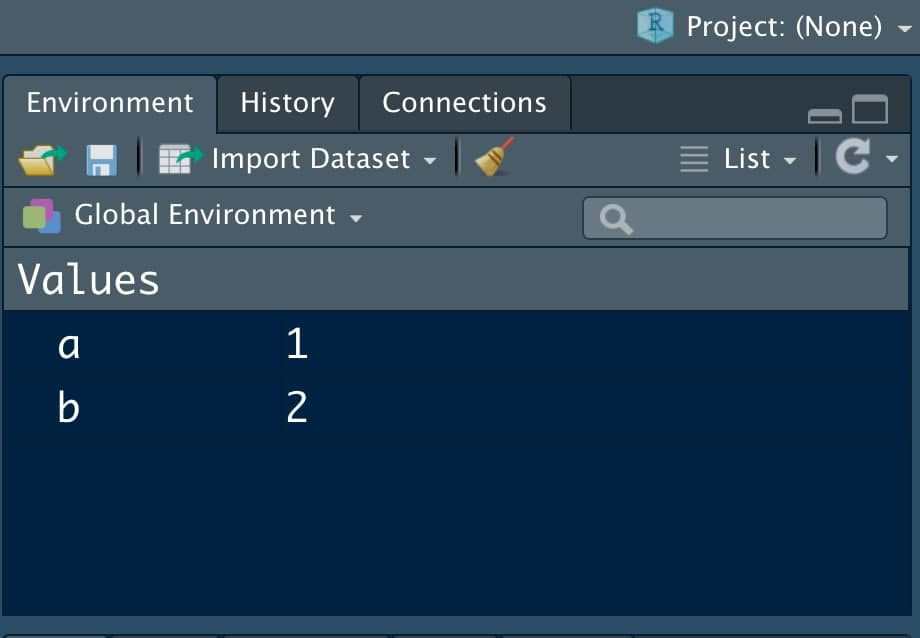
``` 

]

.pull-right[

* **.bg-purple_light[Environment]** (entorno de variables): la pantalla pequeña (puedes ajustar los márgenes con el ratón) que tenemos en la parte superior derecha. Nos mostrará las **variables que tenemos definidas, el tipo y su valor**.

]

---

# .orange[ORGANIZACIÓN] de RStudio

.pull-left[

```{r echo = FALSE,  out.width = "85%", fig.align = "left"}
knitr::include_graphics("./img/inicio_rstudio_4.jpg")
``` 

]

.pull-right[

* **.bg-purple_light[Panel multiusos]**: la ventana que tenemos en la parte inferior derecha no servirá para buscar **.bg-orange[ayuda de funciones]**, además de para **.bg-yellow[visualizar gráficos]**. 

]

---

name: que-es-R

# ¿Qué es R?


`R` es un **.bg-purple_light[lenguaje estadístico]**, creado por y para la estadística, con 4 ventajas fundamentales:

--

* **.bg-purple_light[Software libre]** (como C++, Python, etc). no solo es gratis, sino que permite **.bg-orange[acceder libremente a código ajeno]**.

--

* **.bg-purple_light[Lenguaje modular]**: en la instalación que hemos realizado solo se ha instalado el mínimo para poder funcionar. Al ser software libre, existen **.bg-orange[trozos de código]** hechos por otras personas (**.bg-yellow[paquetes]**) que podemos instalar según necesidades.

--

* **.bg-purple_light[Gran comunidad de usuarios]**: `R` tiene una comunidad de usuarios gigante para hacer estadística (Python tiene una comunidad más enfocada al Machine Learning), con más de 18 000 paquetes.

--

* **.bg-purple_light[Lenguaje de alto nivel]**. Los lenguajes de alto nivel, como `R` o `Python`, facilitan la programación al usuario (menor curva de aprendizaje, aunque más lentos en ejecución).


---

# Paquetes en R

A lo largo del curso usaremos varios de esos **.bg-purple_light[paquetes]**, como por ejemplo el paquete `{ggplot2}`, un paquete para la elaboración de **.bg-purple_light[visualizaciones de datos]**. Vamos a instalarlo (necesitamos internet para ello) con la orden `install.packages("ggplot")`

```{r eval = FALSE}
install.packages("ggplot2")
```

&nbsp;


&nbsp;


La **.bg-purple_light[instalación]** de un paquete es el equivalente a **.bg-orange[comprar a un libro]**: solo lo debemos hacer **la primera vez** que lo usemos en un ordenador. Una vez que tenemos comprado nuestro libro, para poder usarlo, simplemente debemos indicar al programa que nos lo **.bg-purple_light[acerque de la estantería]** con `library(ggplot2)`.

```{r eval = FALSE}
library(ggplot2)
```

---

class: inverse center middle

**COMPRAR** libro --> instalar un paquete (una sola vez) `install.packages()`
<figure>

</figure>

**SELECCIONAR** libro (ya comprado) --> acceder a un paquete instalado (en cada sesión que queramos usarlo) `library()`
<figure>

</figure>


---

class: center middle

# .orange[CASOS REALES] de uso de R


.pull-left[

```{r echo = FALSE,  out.width = "97%", fig.align = "left"}
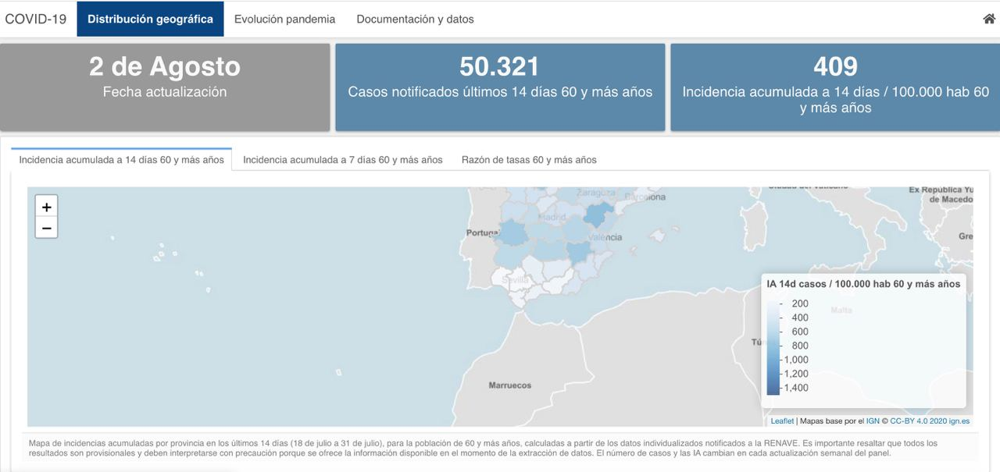
``` 

]

.pull-right[

```{r echo = FALSE,  out.width = "97%", fig.align = "left"}
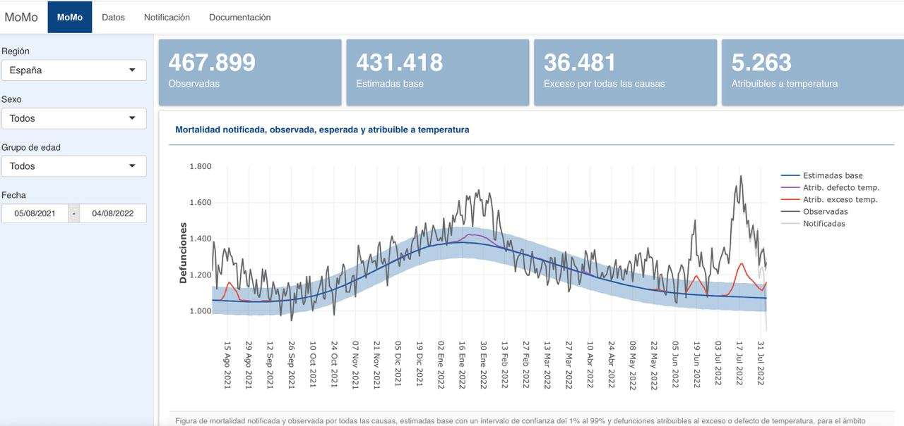
``` 


]

Las webs del Instituto de Salud Carlos III <https://cnecovid.isciii.es/covid19/> y <https://momo.isciii.es/panel_momo/> están hechas con `R` (con `{shiny}` y `{plotly}` )

---

# .orange[CASOS REALES] de uso de R

.pull-left[

```{r echo = FALSE,  out.width = "99%", fig.align = "left"}
knitr::include_graphics("./img/elpais_R.jpg")
``` 

]

.pull-right[

El **.bg-purple_light[equipo de datos]** (Borja Andrino, Kiko Llaneras y Daniele Grasso) trabaja con `R` para elaborar sus análisis, desde los datos electorales hasta el cambio climático.

Es una de las razones por las que son capaces de realizar brillantes análisis de grandes volúmenes de datos de forma rápida y ágil: la **.bg-purple_light[automatización de procesos]** que nos permite programar en `R` puede ser fundamental para analizar datos que hasta entonces no podíamos.

]


---

# .orange[Incel] vs excel

```{r echo = FALSE, out.width = '75%', fig.align = "center"}
knitr::include_graphics("./img/incel.jpg")
```

---

class: inverse center middle

# ¿Por qué .orange[NO] usamos Excel?


---

# ¿Por qué .orange[NO] usamos Excel?

Excel es una **.bg-purple_light[hoja de cálculo]**, ni más ni menos, y el propio **Microsoft desaconseja su uso** para el análisis de datos. El Excel es una herramienta maravillosa para ser usada como una sencilla hoja de cálculo (llevar cuentas de tu familia, declaración de Renta, planificar viajes, etc).

&nbsp;

**.bg-red_light[NO ESTÁ DISEÑADO]** para ser una base de datos, y muchos menos pensado para generar un entorno flexible para el análisis estadístico:

* **.bg-red_light[Software de pago]**

* **.bg-red_light[Software cerrado]**: solo podemos hacer lo que Excel ha creído que interesante que podamos hacer.

* **.bg-red_light[Alto consumo de memoria]**.

* **.bg-red_light[No es universal]**: no solo es de pago sino que además, dependiendo de la versión que tengas de Excel, tendrá un formato distinto para datos como fechas, teniendo incluso extensiones distintas.

---


# .red[EPIC FAILS] en Excel

Problemas de **.red[versiones]**


```{r echo = FALSE,  out.width = "37%", fig.align = "left"}

``` 


📚 Ver **.bg-green_light[bibliografía]** en <https://github.com/dadosdelaplace/teaching/tree/main/data_mining/biblio>


---

# .red[EPIC FAILS] en Excel

Problemas de **.red[memoria]**

```{r echo = FALSE,  out.width = "50%", fig.align = "left"}
knitr::include_graphics("./img/excel_uk.jpg")
``` 


📚 Ver **.bg-green_light[bibliografía]** en <https://github.com/dadosdelaplace/teaching/tree/main/data_mining/biblio>


---

# .red[EPIC FAILS] en Excel

Problemas de **.red[codificación]**

```{r echo = FALSE,  out.width = "50%", fig.align = "left"}
knitr::include_graphics("./img/excel_edades.jpg")
``` 

📚 Ver **.bg-green_light[bibliografía]** en <https://github.com/dadosdelaplace/teaching/tree/main/data_mining/biblio>

---

name: primeros-pasos

# Primeros pasos en R: .orange[CALCULADORA]

Empecemos por lo sencillo: **.bg-purple-light[¿cómo usar R como una calculadora?]** Si escribimos `2 + 1` en la consola y pulsamos ENTER, la consola nos mostrará el resultado de la suma.

```{r}
2 + 1
```

--

Si dicha suma la quisiéramos utilizar para un segundo cálculo: ¿y si la **.bg-purple-light[almacenamos en alguna variable]**? Por ejemplo, vamos a guardar la suma en una variable `x`

```{r}
x <- 2 + 1 #<<
```

--

Si te fijas ahora `x` aparece definida en nuestro **.bg-yellow[environment]**, y puede ser usada de nuevo

```{r}
x + 3
```

---

# Primeros pasos en R: .orange[CALCULADORA]

### Multiplicación

```{r eval = FALSE}
x * y #<<
```

### Elevar al cuadrado

```{r eval = FALSE}
x^2 #<<
```

### Valor absoluto

```{r eval = FALSE}
abs(x) #<<
```

---

# .red[Errores]

Durante tu aprendizaje va a ser **muy habitual** que las cosas no salgan a la primera, apareciendo en consola **.bg-purple_light[mensajes de error]** en un **.bg-red_light[color rojo]**. No te asustes: lo peor que puede pasar es que tengas que reiniciar `R`).

&nbsp;

* Mensajes de **.bg-red_light[ERROR]**: irán precedidos de la frase **.bg-yellow[«Error in…»]**, y serán aquellos fallos que **impidan la ejecución del código** 

```{r error = TRUE}
"a" + 1 # intentando sumar 1 a un texto
```

&nbsp;

**.bg-green_light[CONSEJO]**: lee siempre los mensajes de error para aprender de ellos (ya que suelen dar pistas de cómo resolverlos).

---

# .red[Errores]

Durante tu aprendizaje va a ser **muy habitual** que las cosas no salgan a la primera, apareciendo en consola **.bg-purple_light[mensajes de error]** en un **.bg-red_light[color rojo]**. No te asustes: lo peor que puede pasar es que tengas que reiniciar `R`).

&nbsp;
 
* Mensajes de **.bg-orange[WARNING]**: irán precedidos de la frase **.bg-yellow[«Warning in…»]**, y son los fallos más delicados ya que son posibles incoherencias pero sin que tu código deje de ejecutarse.

```{r warning = TRUE}
sqrt(-1) # raiz cuadrada de número negativo
```

&nbsp;

**¿Ha ejecutado la orden?** Sí, pero te advierte de que el resultado de la operación es un `NaN`, **Not A Number**, un valor que no existe (al menos dentro de los números reales).


---

# ¿Dónde programamos? .orange[SCRIPTS]

Un **.bg-purple_light[script]** será el documento en el que programamos, nuestro equivalente a un archivo .doc, pero aquí será un archivo con extensión `.R`, donde **escribiremos las órdenes**. Para **.bg-purple_light[abrir nuestro primero script]**, haz click en el menú superior en `File << New File << R Script`.

&nbsp;


.pull-left[


```{r echo = FALSE,  out.width = "95%", fig.align = "left"}
knitr::include_graphics("./img/inicio_rstudio_5.jpg")
``` 

]

.pull-right[

**.bg-green_light[CONSEJO]**: intenta no abusar de la consola, ya que todo lo que no escribas en un script, cuando cierres `RStudio`, lo **habrás perdido** (cómo si en lugar de escribir en un Word y guardarlo, nunca guardases el documento).

]

---

# ¿Dónde programamos? .orange[SCRIPTS]

Ahora tenemos una **cuarta ventana**: la ventana donde **escribiremos nuestros códigos**


### **¿Cómo ejecutar nuestro script?**

.pull-left[

```{r echo = FALSE,  out.width = "95%", fig.align = "left"}
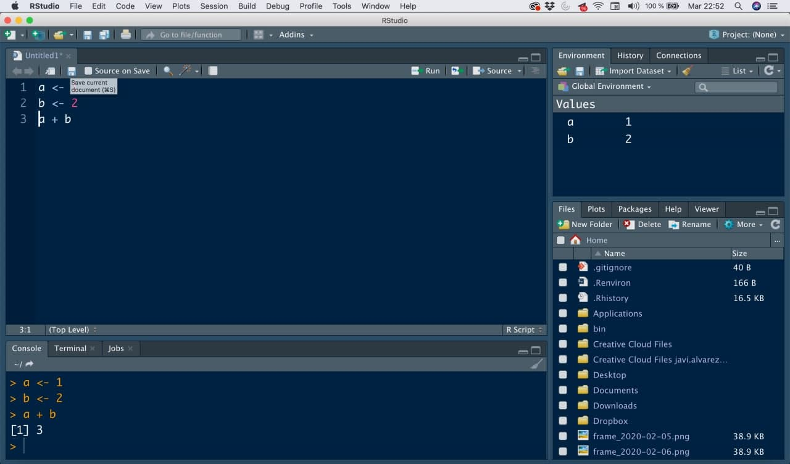
``` 

]

.pull-right[

1. **.bg-purple_light[Escribimos el código]** a ejecutar.

2. **.bg-purple_light[Guardamos]** el archivo `.R` haciendo click en `Save current document`.

3. El código **no se ejecuta salvo que se lo indiquemos**. Tenemos tres opciones:
  - **.orange[Copiar y pegar]** en consola.
  - **.orange[Seleccionar líneas]** y clickar en `Run`.
  - Activar `Source on save` a la **derecha de guardar**: no solo guarda sino que ejecuta el código completo.

]

---

name: ejercicios1

# Primeros ejercicios

.panelset[
.panel[.panel-name[Ejercicios]


* 📝 **Ejercicio 1**: añade debajo otra línea para definir una variable `b` con el valor `5`. Tras asignarles valores, multiplica los números en consola.

```{r}
a <- 2
```

* 📝 **Ejercicio 2**: modifica el código inferior para definir dos variables `c` y `d`, con valores 3 y -1.

```{r eval = FALSE}
c <- # deberías asignarle el valor 3
d <- # deberías asignarle el valor -1
```

* 📝 **Ejercicio 3**: con las variables `a` y `b` del ej. 1, crea una nueva variable `e` guardando el resultado de su multiplicación `a * b`. Escribe `e` en consola para ver su resultado

]

.panel[.panel-name[Solución ej. 1]

```{r}
# Para poner comentarios en el código se usa #

# Definición de variables
a <- 2
b <- 5

# Multiplicación
a * b
```
]

.panel[.panel-name[Solución ej. 2]

```{r}
# Definición de variables
c <- 3
d <- -1
```
]

.panel[.panel-name[Solución ej. 3]

```{r}
# Variables
a <- 2
b <- 5

# Resultado
e <- a * b

# Muestro en consola
e
```

]
]

---

# Primeros ejercicios


.panelset[
.panel[.panel-name[Ejercicios extra]


* 📝 **Ejercicio 4**: asigna un valor positivo a `x` y calcula su raíz cuadrada; asigna otro negativo y calcula su valor absoluto con la función `abs()`.


* 📝 **Ejercicio 5**: usando la variable `x` ya definida, completa/modifica el código inferior para guardar en una nueva variable `z` el resultado guardado en `x` menos 5.

```{r eval = FALSE}
z <- ? - ? # completa el código
z
```

* 📝 **Ejercicio 6**: usando las variables `x` e `y` ya definidas, calcula el máximo de ambas (función `max()`), y guárdalo en una nueva variable `t`.

]

.panel[.panel-name[Solución ej. 4]

```{r}
# Raíz cuadrada
x <- 73 # por ejemplo
sqrt(x)

# Valor absoluto
y <- -19 # por ejemplo
abs(y)
```
]

.panel[.panel-name[Solución ej. 5]

```{r}
z <- x - 5
z
```
]

.panel[.panel-name[Solución ej. 6]

```{r}
t <- max(x, y)
t
```

]
]


---


name: variables

# De la .orange[celda] a la .green[tabla]
 

¿De qué tipo pueden ser los datos que tenemos contenidos en cada celda de una «tabla»?


```{r echo = FALSE,  out.width = "55%", fig.align = "center"}
knitr::include_graphics("./img/celdas.jpg")
``` 

* **.bg-purple_light[Celda]**: un dato **.bg-orange[individual]** de un tipo concreto.
* **.bg-purple_light[Variable]**: una **.bg-orange[concatenación de valores]** del mismo tipo (**vectores**).
* **.bg-purple_light[Matriz]**: **.bg-orange[concatenación de variables]** del **.bg-yellow[mismo tipo]** y longitud.
* **.bg-purple_light[Tabla]**: **.bg-orange[concatenación de variables]** de **.bg-yellow[distinto tipo]** pero igual longitud.

---

# .orange[Celdas]: tipos de datos individuales

¿Existen **variables más allá de los números**?

&nbsp;

Piensa por ejemplo en los **datos guardados de una persona**:

* La edad o el peso será un **.bg-purple_light[número]**.
* Su nombre será una cadena de **.bg-purple_light[texto]**.
* Su fecha de nacimiento será precisamente eso, una **.bg-purple_light[fecha]**.
* A la pregunta «¿está usted soltero/a?» la respuesta será lo que llamamos una **.bg-purple_light[variable lógica]** (`TRUE` si está soltero/a o `FALSE` en otro caso).

```{r echo = FALSE,  out.width = "40%", fig.align = "center"}
knitr::include_graphics("./img/celdas.jpg")
``` 

---

# Variables .orange[NUMÉRICAS]

El **dato más sencillo**, dato que ya hemos usado en nuestros primeros pasos como calculadora, serán las variables que guardan simplemente números

```{r}
a <- 1
b <- 2
a + b
```

--

En el código anterior, tanto `a` como `b` como la suma `a + b` son de **.bg-purple_light[tipo numérico]**

```{r}
class(a) #<<
typeof(a) #<<
```


---

# Variables .orange[NUMÉRICAS]

Como ya hemos visto, con los datos numéricos podemos realizar todas las **.bg-purple_light[operaciones aritméticas]** que se nos ocurriría hacer en una **calculadora** como sumar (`+`), restar (`-`), multiplicar (`+`), dividir (`/`), raíz cuadrada (`sqrt()`), valor absoluto (`abs()`), elevar al cuadrado (`^2`), elevar al cubo (`^3`), etc.


```{r}
a <- 5
a^3 # Elevar al cubo
```

```{r}
b <- -43
abs(b) # valor absoluto
```

---

# Variables de .orange[TEXTO]

No solo de números viven los datos: imagina que además de la edad de una persona queremos **guardar su nombre** (**.bg-purple_light[tipo caracter]**: una **cadena de texto**)

```{r}
nombre <- "Javier" #<<
class(nombre)
```

--

Las cadenas de texto son un **tipo especial de dato** con los que obviamente no podremos hacer operaciones aritméticas (pero sí **.bg-purple_light[otras operaciones]** como pegar o localizar patrones).

```{r error = TRUE}
nombre + 1 # error al sumar número a texto
```

&nbsp;

--

**.bg-green_light[IMPORTANTE]**: las variables de tipo texto van **.bg-red_light[SIEMPRE ENTRE comillas]**.


---

name: primer-paquete

# .orange[PRIMERA FUNCIÓN]: paste

Una **.bg-purple_light[función]** es un **trozo de código encapsulado** bajo un nombre, que depende de unos **.bg-purple_light[argumentos de entrada]**.

--

Nuestra primera función será `paste()`: dadas dos cadenas de texto como argumento de entrada nos permite pegarlas, indicándole en el argumento `sep = ` el caracter que queremos entre medias.

```{r}
# todo junto, sin espacios, igual a paste0("Javier", "Álvarez")
paste("Javier", "Álvarez", sep = "") 
```


```{r}
paste("Javier", "Álvarez", sep = "?*?") # separados por un ?*?
```


---

# .orange[PRIMERA FUNCIÓN]: paste


```{r}
paste("Javier", "Álvarez") #<<
```

Por defecto, `paste()` añade un espacio, es decir, `sep = " "`. Muchas funciones en `R` tendrán lo que llamamos **.bg-purple_light[argumentos por defecto]**, el valor que tomará sino se le asigna otro. Puedes mirar la **.bg-green_light[ayuda de la función]** escribiendo en consola `? paste`

Existe una función similar llamada `paste0()` que pega por defecto con `sep = ""` (sin nada).

```{r}
paste0("Javier", "Álvarez") 
paste("Javier", "Álvarez", sep = "") 
```

---

# .orange[PRIMER PAQUETE]: glue

Otra forma **más intuitiva de trabajar con textos** es usar el **paquete** `{glue}`.

```{r}
library(glue) # solo la 1ª vez install.packages("glue")
```

--

Con dicho paquete podemos **.bg-purple_light[usar variables dentro de cadenas]** de texto. Por ejemplo, la frase «la edad es de ... años», donde la edad concreta la tenemos guardada en una variable.

```{r}
edad <- 33
glue("La edad es de {edad} años") #<<
```

Dentro de las llaves también podemos ejecutar operaciones

```{r}
unidades <- "días"
glue("La edad es de {edad * 365} {unidades}") #<<
```

---


# .orange[VECTORES]: concatenación

¿Y si en lugar de querer almacenar un solo elemento, por ejemplo , tenemos una **colección de elementos**?

Hasta ahora solo hemos operado con el contenido de las **celdas**, pero cuando trabajamos con datos normalmente tendremos columnas que representan variables o características: llamaremos **.bg-purple_light[vectores]** a una **.bg-orange[concatenación]** de variables del **.bg-orange[mismo tipo]**
 
--

La forma más sencilla es con el comando `c()` (c de concatenar), y basta con introducir sus **elementos entre paréntesis y separados por comas** (por ejemplo, la edad de 4 personas).

```{r}
edades <- c(33, 27, 60, 61) #<<
edades
```


&nbsp;

--

**.bg-green_light[IMPORTANTE]**: un número individual (`x <- 1`) es en realidad un vector de longitud uno. 

---

# .orange[VECTORES]: concatenación


Como ves ahora en el `environment` tenemos una **.bg-purple_light[colección de elementos]** guardada

.pull-left[

```{r}
edades
```

]


.pull-right[
```{r echo = FALSE,  out.width = "80%", fig.align = "left"}
knitr::include_graphics("./img/vectores_enviroment.jpg")
``` 
]

--

.pull-left[

La **.bg-purple_light[longitud de un vector]** se puede calcular con `length()`

```{r}
length(edades) #<<
```

]


.pull-right[

También podemos **.bg-purple_light[concatenar vectores]**

```{r}
c(edades, edades, 8)
```

]

---

# Vectores: .orange[SECUENCIAS NUMÉRICAS]

En muchas ocasiones querremos **.bg-purple_light[crear secuencias numéricas]** mucho más rápido (por ejemplo, un vector con los días del mes). El comando `seq()` nos permite crear una **secuencia** desde un elemento inicial hasta un elemento final, avanzando de uno en uno.

```{r}
seq(1, 31)
```

--

El comando `1:n` nos devuelve lo mismo que la orden `seq(1, n)`. Además, si el elemento inicial es mayor que el final, `R` entenderá solo que la secuencia es **decreciente**.

```{r}
n <- 5
n:1
```

---

# Vectores: .orange[SECUENCIAS NUMÉRICAS]

También podemos definir **.bg-purple_light[otro tipo de distancia]** (**.bg-orange[paso de discretización]**) entre dos elementos consecutivos

```{r}
seq(1, 7, by = 0.5) # secuencia desde 1 a 7 de 0.5 en 0.5
```

--

Otras veces nos interesará definir una **.bg-purple_light[secuencia con un número concreto]** de elementos.

```{r}
seq(1, 50, l = 7) # secuencia desde 1 a 50 de longitud 7
```

--

También podemos crear **.bg-purple_light[vectores de elementos repetidos]** con la función `rep()`

```{r}
rep(0, 7) # vector de 7 ceros
```


---

# .green[OPERACIONES] .orange[ARITMÉTICAS]
 
Dado que un **.bg-purple_light[número es un vector]** de longitud 1, toda **.bg-orange[operación aritmética]** (suma, resta, multiplicación, etc) que podamos hacer con un número la vamos a poder a hacer con un vector de números.

--

Si hacemos por ejemplo la operación `2 * x`, siendo `x` un vector, lo que sucederá es que la operación se realizará en **.bg-purple_light[CADA ELEMENTO]** del vector (una sola línea de código paro realizar operaciones en 10, 20, 1000 o 100000 elementos).

```{r}
# Multiplicamos por 2 a CADA ELEMENTO del vector
x <- c(2, 4, 6)
2 * x #<<
```

--

&nbsp;

**.bg-green_light[IMPORTANTE]**: el **.bg-purple_light[resultado]** de una operación aritmética sobre un vector será **.bg-orange[otro vector]**.

---

# .green[OPERACIONES] .orange[ARITMÉTICAS]
 
 
De la misma manera podemos **.bg-purple_light[sumar o restar una constante]** al vector

```{r}
# Sumamos 3 a CADA ELEMENTO DEL VECTOR
x + 3
```

--

Los vectores también pueden **.bg-purple_light[interactuar entre ellos]**, así que podemos definir sumas de vectores, como `x + y`

```{r}
y <- c(1, 3, 5)

# suma de vectores 
x + y #<< 
```

--

**.bg-green_light[IMPORTANTE]**: salvo que especifiquemos lo contrario, toda operación aritmética que hagas a un vector será **.bg-purple_light[elemento a elemento]**.

 
---


# .green[OPERACIONES] con .orange[AUSENTES]

Imagina que tenemos un vector de temperaturas pero varios de los días el aparato de medición no funcionaba, por lo que tenemos un **.bg-purple_light[dato ausente]** marcado como `NA`.

```{r}
x <- c(21, NA, 13, NA, NA, 25, 36, 17, 19, 5)
sum(x)
```

--

Dado que hay días que no tenemos disponibles, la suma tampoco la podemos conocer.  Para evitar que nos impida hacer ciertas operaciones, en muchas funciones de `R` podemos añadir el **argumento** `na.rm = TRUE`: primero elimina ausentes, y luego ejecuta la función.

```{r}
# eliminando datos ausentes antes de aplicar la función
sum(x, na.rm = TRUE) #<<
mean(x, na.rm = TRUE)
```


---

# .green[OPERACIONES] con .orange[AUSENTES]

Para **comprobar** si tenemos un **dato ausente**  podemos hacer uso de la función `is.na()`

```{r}
is.na(x)
```

--

También puede aparecernos un **.bg-purple_light[resultado no permitido]**, marcado como `NaN` (not a number): no es un dato ausente, es un dato resultado de una **operación no permitida**.

```{r}
x <- c(1, NA, 3, 4, 6, 7, sqrt(-1), NA)
x
is.nan(x)
```


---

# .orange[SELECCIONAR] elementos

Otra operación muy habitual es la **.bg-purple_light[extraer un subconjunto del mismo]**. La forma más sencilla es **usar el operador de selección** `[i]` para **acceder al elemento i-ésimo**

```{r}
edades <- c(20, 30, 33, NA, 61)

# accedemos a la edad de la tercera persona en la lista
edades[3] #<<

# accedemos a la edad de la cuarta persona
edades[4]
```

---

# .orange[SELECCIONAR] elementos

Un número no es más que un vector de longitud uno, así que esta operación también la podemos aplicar usando un **.bg-purple_light[vector de índices a seleccionar]**

```{r}
# Tercer y cuarto elemento
edades[c(3, 4)] #<<
```

--

Esta lógica para acceder a elementos también sirve para **vectores de caracteres**.

```{r}
y <- c("hola", "qué", "tal", "todo", "ok", "?")
y[1:2]
```

--

**.bg-green_light[TIP]**: para **.bg-purple_light[acceder al último elemento]** podemos pasarle como índice la longitud del vector 

```{r}
y[length(y)] 
```

---

# .green[OPERACIONES] .orange[ARITMÉTICAS]
 

Dado que la operación (por ejemplo, una suma) se realiza elemento a elemento, ¿qué sucederá si **.bg-purple_light[sumamos dos vectores de distinta longitud]**?

--

Por ejemplo, definamos `z` con los 4 primeros impares, e intentemos hacer la suma `x + z`.

```{r}
z <- c(1, 3, 5, 7)
x + z
```

--

.pull-left[


```{r echo = FALSE,  out.width = "99%", fig.align = "left"}
knitr::include_graphics("./img/recycle.jpg")
``` 


]

.pull-right[

`R` intenta molestarte lo menos posible, así que lo que hace es **.bg-purple_light[reciclar elementos]**: si tiene un vector de 4 elementos y le intentas sumar uno de 3 elementos, lo que hará será reciclar elementos del vector con menor longitud: hará `1 + 2`, `3 + 4`, `5 + 6` pero… `7 + 2` (vuelve al primero).

]

---

# Vectores: .orange[CARACTERES]

Un vector es una **.bg-purple_light[concatenación de elementos del mismo tipo]**, pero no tienen porque ser necesariamente números. Vamos a crear una frase de ejemplo, con 4 elementos.

.pull-left[

```{r}
vector <- c("Me", "llamo", "Javi") #<<
vector
length(vector)
```

]

.pull-right[

```{r}
frase <- "Mi llamo Javi"
frase
length(frase)
```

]

Fíjate la **diferencia** entre tenerlo guardado en un vector o tenerlo como una sola cadena de texto (unida).

---

# Vectores: .orange[CARACTERES]

Cuando usamos la función `paste()` con variables diferentes, usábamos `sep = ...`. Cuando la función `paste()` la aplicamos a un vector de caracteres, decidiremos que caracter queremos que vaya entre palabra con el argumento `collapse = ...`.

```{r}
paste(vector, collapse = ".") # separados por un punto
```

Podemos **combinar las secuencias de números y un vector de caracteres** con `glue()`

```{r}
edad <- 10:12 # edades
glue("La edad es de {edad} años")
```


---

name: logicas

# Datos de tipo .orange[LÓGICO]

Un tipo de datos muy importante en todo lenguaje de programación: los **.bg-purple_light[valores lógicos]**. Un valor lógico puede tomar **tres valores**:

* `TRUE` (guardado internamente como un `1`).
* `FALSE` (guardado internamente como un `0`).
* `NA` (**.bg-purple_light[dato ausente]**, son las siglas de **.bg-orange[not available]**).

--

Los valores lógicos suelen ser resultado de evaluar **.bg-purple_light[condiciones lógicas]** (preguntar a los datos). Por ejemplo, imaginemos que definimos un vector de temperaturas. ¿Qué días hizo menos de 22 grados?

```{r}
x <- c(15, 20, 31, 27, 15, 29)
x < 22 #<<
```

Nos devolverá un **vector lógico** con `TRUE` o `FALSE` en cada hueco, en función de si cumple o no la condición pedida.

---

# Datos de tipo .orange[LÓGICO]


Dicha condición lógica puede hacerse con `<=` (menor o igual), `>` (mayor) o `>=` (mayor igual).

```{r}
x <= 22
```

--

```{r}
x > 30
```

--

```{r}
x >= 15
```

---

# Datos de tipo .orange[LÓGICO]

También podemos comparar **.bg-purple_light[si es igual a otro elemento]**, para lo que usaremos el operador `==`, pudiendo usar también su opuesto `!=` («distinto de»).

```{r}
x == 15
x != 15
```

--

Si tuviéramos un **.bg-purple_light[dato ausente]** (por error del aparato ese día, marcado como `NA`), la condición evaluada también sería `NA`

```{r}
y <- c(15, 20, NA, 31, 27, 7, 29, 10)
y < 22
```

---

# Datos de tipo .orange[LÓGICO]

Las **.bg-purple_light[condiciones pueden ser combinadas]**, principalmente de dos maneras:

.pull-left[

* **.bg-purple_light[Intersección]**: **.bg-orange[TODAS]** las condiciones concatenadas se deben cumplir (conjunción y) para devolver un `TRUE`.

```{r}
x
x < 30 & x > 15
```

]

.pull-right[

* **.bg-purple_light[Unión]**: basta con que **.bg-orange[AL MENOS UNA]** de las condiciones se cumpla (conjunción o) para devolver un `TRUE`.

```{r}
x
x < 30 | x > 15
```

]

---

name: fecha

# Datos de tipo .orange[FECHA]


Un tipo de datos muy especial: los **.bg-purple_light[datos de tipo fecha]**. 

```{r}
# Cadena de texto
fecha_char <- "2021-04-21"
class(fecha_char)
```

Podríamos pensar que no tiene nada de especial ya que parece una simple cadena de texto pero representa un **.bg-purple_light[instante en el tiempo]**, que deberíamos poder operar como tal.

--

¿Qué sucedería si **sumamos un 1 (un día)** a una fecha definida como una cadena de texto?

```{r error = TRUE}
fecha_char + 1
```

--

Si guardamos las fechas como un cadena de texto **.bg-red_light[no podemos operar con ellas]**

---

# Datos de tipo .orange[FECHA]

Para trabajar con fechas tenemos el paquete `{lubridate}`, y su función `as_date()`: nos **.bg-purple_light[convierte texto a fecha]**.

```{r}
library(lubridate)
fecha <- as_date(fecha_char) #<<
class(fecha)
```

--

```{r}
fecha + 1 # día siguiente
```

--

```{r}
fecha - 3 # 3 días antes
```

--

Al convertir texto a fecha, aunque se visualice como un texto, **.bg-purple_light[internamente es un número]**. 

---

# Datos de tipo .orange[FECHA]

La función `as_date()` tiene un argumento opcional, el **.bg-purple_light[formato]**, que por defecto será `format = "yyyy-mm-dd"` (que podemos cambiar)


```{r}
as_date("10-03-2020", format = "%d-%m-%Y") #<<
```

--

```{r}
as_date("10-03-20", format = "%d-%m-%y")
```

--

```{r}
as_date("03-10-2020", format = "%m-%d-%Y")
```

--

```{r}
as_date("Octubre 21, 1995 21:24", format = "%B %d, %Y %H:%M")
```

---

# Datos de tipo .orange[FECHA]

Para facilitar conversiones de formatos habituales, el paquete también tiene a nuestra disposición diferentes funciones preparadas para directamente **.bg-purple_light[convertir fechas en distintos formatos]**, como la función `ymd_hms()` o `ydm_hms()`

```{r}
ymd_hms("2017-11-28 14:02:00") # convertir a fecha una cadena año-mes-día + hora
ydm_hms("2017-22-12 10:00:00") # convertir a fecha una cadena año-día-mes + hora
```

--

De la misma manera tenemos la función `dmy_hms()`

```{r}
dmy_hms("1 Jan 2017 23:59:59") # convertir a fecha una cadena textual de fecha + hora
```

 
---

# Datos de tipo .orange[FECHA]


También podemos hacerlo de forma muy simplificada con `ymd()`

```{r}
ymd(20170131)
```

--

Otra de las funcionalidades que nos proporciona dicho paquete es obtener automáticamente la **.bg-purple_light[fecha de hoy]**, haciendo uso de la función `today()`

```{r}
hoy <- today() #<<
hoy
```

--

También podemos obtener el **.bg-purple_light[«hoy y ahora»]** con la función `now()`

```{r}
now() #<<
```
 
---

# Datos de tipo .orange[FECHA]

También tenemos disponibles funciones para **.bg-purple_light[extraer facilmente algunas variables]**.

.pull-left[

```{r}
year(fecha)
month(fecha)
hour(fecha)
second(fecha)
```

]

.pull-right[
```{r}
week(fecha)
wday(fecha)
wday(fecha, week_start = 1) # Día de la semana 
```

]


---

# Datos de tipo .orange[FECHA]


También podemos **.bg-purple_light[realizar comparaciones]**

```{r}
fecha_actual <- today()
fecha_actual > ymd(20170131) # Actual vs 2017-01-31
fecha_actual > ymd(21000131) # Actual vs 2100-01-31
```
 
--

Con la función `leap_year()` podremos saber si la fecha **.bg-purple_light[corresponde a un año bisiesto]**

```{r}
leap_year(as_date(ymd(20190131)))
```

---

# Datos de tipo .orange[FECHA]

.pull-left[

```{r echo = FALSE,  out.width = "101%", fig.align = "right", fig.cap = "Chuleta de https://lubridate.tidyverse.org/"}
knitr::include_graphics("./img/lubridate.png")
``` 

]

.pull-right[

También podemos hacer uso de diferentes funciones para **.bg-purple_light[añadir intervalos]** de tiempo.

```{r}
fecha + weeks(0:2)
fecha + seconds(2)
```

]

---


name: ejercicios2

# Ejercicios


.panelset[
.panel[.panel-name[Ejercicios]


* 📝 **Ejercicio 1**: define una variable `edad` que guarde tu edad y otra `nombre` con tu nombre.

* 📝 **Ejercicio 2**: define otra variable con tus apellidos y junta las variables `nombre` y `apellidos` en una sola cadena de texto que guardes en `nombre_completo`.
 
* 📝 **Ejercicio 3**: define un vector que contenga los números `1`, `10`, `-1` y `2`, y guárdalo en una variable llamada `vector_num`. Obtén la longitud del vector anterior.
 
* 📝 **Ejercicio 4**: crea una secuencia de -2 a 17 de forma que salte de uno en uno (y también de forma decreciente). Repite el proceso pero saltando de 3 en 3.


]

.panel[.panel-name[Solución ej. 1]

```{r}
# variable numérica
edad <- 33
edad

# variable de tipo texto
nombre <- "Javi"
nombre
```
]

.panel[.panel-name[Solución ej. 2]

```{r}
apellidos <- "Álvarez Liébana"

# Opción 1
nombre_completo <- glue("{nombre} {apellidos}")
nombre_completo

# Opción 2
nombre_completo <- paste(nombre, apellidos)
nombre_completo
```
]

.panel[.panel-name[Solución ej. 3]

```{r}
vector_num <- c(1, 10, -1, 2)
vector_num

# longitud
length(vector_num)
```

]

.panel[.panel-name[Solución ej. 4]

```{r}
secuencia <- -2:17
secuencia
# otra forma
secuencia <- seq(-2, 17, by = 1)

# decreciente
17:-2

# de 3 en 3
seq(-2, 17, by = 3)
```

]

]

---

# Ejercicios


.panelset[
.panel[.panel-name[Ejercicios]


* 📝 **Ejercicio 5**: crea una secuencia que repita 7 veces el patrón -1, 2, 4. Después crea otra que repita dicho patrón pero de forma intercalada.
 
* 📝 **Ejercicio 6**: crea una secuencia de 7 valores lógicos en los que haya 2 valores ciertos, 3 valores falsos y 2 valores ausentes.


* 📝 **Ejercicio 7**: toma el vector `vector_num` del ejercicio 3 y obtén un vector lógico que nos diga que valores son mayores de 0. Obtén otro vector lógico que nos diga que valores están entre 0 y 7. Obtén otro vector lógico que nos diga que valores son distintos de 1 en valor absoluto.

* 📝 **Ejercicio 8**: obtén la fecha de hoy, define la fecha de tu cumpleaños, y calcula la diferencia de días.
 
* 📝 **Ejercicio 9**: suma un mes y una semana a la fecha de tu cumpleaños

 

]

.panel[.panel-name[Sol ej. 5]

```{r}
secuencia <- rep(c(-1, 2, 4), 7)
secuencia

# intercalada
rep(c(-1, 2, 4), each = 7)
```

]

.panel[.panel-name[Sol ej. 6]

```{r}
secuencia <- c(FALSE, TRUE, NA, FALSE, NA, TRUE, FALSE)
secuencia
```

]

.panel[.panel-name[Sol ej. 7]

```{r}
vector_num > 0
vector_num > 0 & vector_num < 7
abs(vector_num) != 1
```

]


.panel[.panel-name[Sol ej. 8]

```{r}
library(lubridate)
hoy <- today()
cumple <- as_date("1989-09-10")
hoy - cumple
```

]

.panel[.panel-name[Sol ej. 9]

```{r}
cumple + months(1) + weeks(1)
```

]

]

---

# Ejercicios extras

.panelset[
.panel[.panel-name[Ejercicios extra]


* 📝 **Ejercicio 10**: construye con `glue()` una frase que diga «Hola, me llamo … y tengo … años».

* 📝 **Ejercicio 11**: modifica el código inferior para crear un vector de nombre `vector_num` que contenga los números 1, 5 y -7.

```{r eval = FALSE}
# Vector de números
vector_num <- c(1)
vector_num
```

* 📝 **Ejercicio 12**:  extrae el mes, año y día de la semana de tu cumpleaños

]

.panel[.panel-name[Solución ej. 10]

```{r}
nombre <- "Javi"
edad <- 33
glue("Hola, me llamo {nombre} y tengo {edad} años")
```
]

.panel[.panel-name[Solución ej. 11]

```{r}
# Vector de números
vector_num <- c(1, 5, -7)
vector_num

# longitud
length(vector_num)
```

]

.panel[.panel-name[Solución ej. 12]

```{r}
library(lubridate)
cumple <- as_date("1989-09-10")
month(cumple)
day(cumple)
year(cumple)
wday(cumple, week_start = 1, label = TRUE)
```

]


]


---

class: inverse center middle
name: clase-2

# CLASE 2: primeros datos. Primeros conceptos.

&nbsp;

### [Operaciones con vectores](#operaciones-vectores)

### [Matrices](#matrices)

### [data.frame y tibble](#data.frame)

### [Ejercicios datasets](#ejercicios-tibble)

### [Intro estadística](#intro-estadistica)


---

name: operaciones-vectores


# .green[OPERACIONES] .orange[ARITMÉTICAS]


Los **.bg-purple_light[valores lógicos]** `TRUE` y `FALSE` son **.bg-orange[guardados internamente]** como `0` y `1`, por lo que podemos usar operaciones aritméticas con ellos.

--

Por ejemplo, si queremos **.bg-purple_light[averiguar el número de elementos que cumplen una condición]** (por ejemplo, `< 3`), los que lo hagan tendrán asignado un 1 y los que no un 0, por lo que basta con sumar dicho vector lógico para obtener el número de elementos que cumplen dicha condición (elementos que son `TRUE`).

```{r}
# sumamos el vector de TRUE/FALSE
x
sum(x < 3) 
```

---

# .green[OPERACIONES] .orange[ESTADÍSTICAS]

También podemos realizar **.bg-purple_light[operaciones estadísticas]** con los vectores, como calcular su **suma**, su **media**, su **mediana**, entre otros.

--

Hagamos antes un **.bg-purple_light[breve repaso]** de algunos términos estadísticos:

* **.bg-purple_light[Media]**: medida de **.bg-orange[centralización]** que consiste en sumar todos los elementos y dividirlos entre la cantidad de elementos sumados (función `mean()`). La más conocida pero la menos robusta: dado un conjunto, si se introducen valores atípicos o outliers (valores muy grandes o muy pequeños), la media se perturba con mucha facilidad.

$$\overline{x} = \frac{1}{n} \sum_{i=1}^{n} x_i$$

```{r}
x <- c(165, 170, 181, 191, 150, 155, 167, 173, 177)
mean(x)
```

---

# .green[OPERACIONES] .orange[ESTADÍSTICAS]

También podemos realizar **.bg-purple_light[operaciones estadísticas]** con los vectores, como calcular su **suma**, su **media**, su **mediana**, entre otros.


Hagamos antes un **.bg-purple_light[breve repaso]** de algunos términos estadísticos:

* **.bg-purple_light[Mediana]**: medida de **.bg-orange[centralización]** (función `median()`) que consiste en, tras **.bg-orange[ordenar]** los datos de menor a mayor, quedarnos con el valor que ocupa el medio (deja tantos números por debajo como por encima). 


$$Me_{x} = \displaystyle \arg \min_{x_i} \left\lbrace F_i > 0.5 \right\rbrace, \quad F_i = \frac{\# \left\lbrace x_j \leq x_i \right\rbrace}{n}$$

```{r}
x <- c(165, 170, 181, 191, 150, 155, 167, 173, 177)
median(x)
```

---

# .green[OPERACIONES] .orange[ESTADÍSTICAS]

También podemos realizar **.bg-purple_light[operaciones estadísticas]** con los vectores, como calcular su **suma**, su **media**, su **mediana**, entre otros.


Hagamos antes un **.bg-purple_light[breve repaso]** de algunos términos estadísticos:

* **.bg-purple_light[Moda]**: medida de **.bg-orange[centralización]** que consiste en encontrar el **.bg-orange[valor o valores más repetidos]**. Es la medida de centralización más robusta. 

$$Mo_{x} = \displaystyle \arg \max_{x_i}  f_i , \quad f_i = \frac{\# \left\lbrace x_j = x_i \right\rbrace}{n}$$

&nbsp;

**.bg-red_light[PROBLEMA]**: la moda no siempre es fácil de calcular (aunque existen paquetes para calcularla como `{modeest}`)


---

# .green[OPERACIONES] .orange[ESTADÍSTICAS]

Otra de las funciones más útil es la **.bg-purple_light[suma de elementos]** de un vector con `sum()`

```{r}
# suma
sum(x) #<<
sum(x) / length(x) # media artesanal
```

--

Otra función útil es la **.bg-purple_light[suma acumulada]** de un vector haciendo uso de `cumsum()`

```{r}
# suma acumulada
cumsum(c(1, 2, 4, 7, 7, 10)) #<<
```

---

# .green[OPERACIONES] .orange[ESTADÍSTICAS]

No solo de medidas de centralización vive la estadística: **.bg-purple_light[¿cómo calcular las medidas de dispersión?]**

* **.bg-purple_light[Varianza]**: definida como la media de desviaciones (respecto a la media) al cuadrado, tal que $s_{x}^{2} = \frac{1}{n} \sum_{i = 1}^{n} \left(x_i - \overline{x} \right)^2 = \overline{x^2} - \overline{x}^2$

```{r}
var(x)
```

--

**.bg-green_light[IMPORTANTE]**: las funciones de `R` (y de cualquier calculadora) nos devuelve la **.bg-red_light[cuasivarianza]** (dividido entre $n-1$)
 
```{r}
# Varianza real
mean((x - mean(x))^2)
```

---


# .green[OPERACIONES] .orange[ESTADÍSTICAS]

No solo de medidas de centralización vive la estadística: **.bg-purple_light[¿cómo calcular las medidas de dispersión?]**

* **.bg-purple_light[Desv. típica (standard deviation)]**: definida como la raíz cuadrada de la varianza, tal que $s_{x} = \sqrt{s_{x}^{2} }$

```{r}
sd(x)
```

--

**.bg-green_light[IMPORTANTE]**: las funciones de `R` (y de cualquier calculadora) nos devuelve la **.bg-red_light[cuasidesviación típica]** (raíz de la cuasivarianza, dividida entre $n-1$)
 
```{r}
# Desv. típica real
sqrt(mean((x - mean(x))^2))
```


---

# .green[OPERACIONES] .orange[ESTADÍSTICAS]

También pueden sernos útiles las **.bg-purple_light[medidas de posición/localización]**, como los **.bg-orange[percentiles]** (valores que nos dividen en partes iguales los datos).

```{r}
y <- c(1, 2, 5, 5, 10, 10, 10, 13, 15, 20, 25)

# Percentiles por defecto: cuartiles
quantile(y) #<<
```

--

En `quantile()` hay un argumento por defecto `probs = c(0, 0.25, 0.5, 0.75, 1)` (**percentiles** a calcular) que puede ser cambiado, por ejemplo, para percentiles 20%-30%-70%-90%.

```{r}
quantile(y, probs = c(0.2, 0.3, 0.7, 0.9))
```

---


# Valores .orange[ÚNICOS]

Con la función `unique()` podemos también extraer los **.bg-purple_light[valores únicos de una variable]**

```{r}
colores <- c("azul", "azul", "verde", "amarillo",
             "azul", "rojo", "rojo", "azul", "rojo",
             "verde", "morado")
unique(colores) #<<
```

---


# .orange[FILTRAR] elementos


Otras veces no querremos seleccionar un elemento en concreto sino **.bg-purple_light[filtrar algunos elementos en concreto]** y no extraerlos, **.bg-orange[eliminarlos]**.

Deberemos repetir la misma operación pero con el signo `-` delante: el operador `[-i]` **no selecciona** el elemento i-ésimo del vector sino que lo **elimina**

```{r}
y
y[-2] 
```

---

# .orange[FILTRAR] elementos

Lo habitual es que dicho filtro lo hagamos **.bg-purple_light[en base a una condición lógica]**. Supongamos que tenemos las edades de dos grupos de personas y que queremos quedarnos **solo con los mayores edad**: vamos a seleccionar los **elementos que cumplen una condición dada**.

```{r}
edades_1 <- c(7, 20, 18, 3, 19, 9, 13, 3, 45)
edades_2 <- c(17, 21, 58, 33, 15, 59, 13, 1, 45)
```

--

```{r}
edades_1[edades_1 >= 18] #<<
edades_2[edades_2 >= 18]
```

Lo que hemos hecho ha sido pasar como **índices a seleccionar un vector lógico** `TRUE/FALSE`: solo filtrará los lugares donde se guarde un `TRUE`.

---

# .orange[FILTRAR] elementos

Esto también nos puede servir para **.bg-purple_light[limpiar de datos ausentes]**, combinando la función `is.na()`: nos localiza el lugar que ocupan los ausentes, con el operador `!` (**negar el valor lógico** que venga detrás).

```{r}
x <- c(7, NA, 20, 3, 19, 21, 25, 80, NA)
x[is.na(x)] # solo valores ausentes
x[!is.na(x)] # sin valores ausentes: ! es el símbolo de 
```

--

También podemos probar a **combinar condiciones lógicas** para nuestra selección.

```{r}
x[x >= 18 & x <= 25] # los valores que cumplen ambas (&): entre 18 y 25 años
```

---
 

# .green[SELECCIONAR] elementos: .orange[WHICH]

A veces no querremos el elemento en sí, sino el **.bg-purple_light[lugar que ocupa]**: ¿qué valores de un vector cumplen una condición lógica? Para obtener dicho índice usaremos la función `which()`.

```{r}
x <- c(7, NA, 20, 3, 19, 21, 25, 80, NA)
which(x >= 18) # Obtenemos los lugares 
```

--

Esta función es muy útil especialmente cuando queremos el valor que ocupa el **.bg-purple_light[máximo/mínimo]** de un vector, con las funciones `which.max()` y `which.min()`.

```{r}
max(x, na.rm = TRUE)
which.max(x) # Lugar que ocupa el máximo
```


---

# .green[SELECCIONAR] elementos: .orange[any/all]
 

Existen dos funciones muy útiles para saber si **.bg-purple_light[todos o alguno de los elementos]** de un vector cumple una condición: `all()` y `any()` nos devolverá un único valor lógico.

```{r}
x <- c(1, 2, 3, 4, 5, NA, 7)
all(x < 3) #<<
any(x < 3)
all(x > 0)
```


---

# .orange[NOMBRAR] elementos

`R` nos permite dar **.bg-purple_light[significado léxico a nuestros valores]** (significan algo, no solo números), pudiendo poner **nombres a los elementos** de un vector.

```{r}
x <- c("edad" = 31, "tlf" = 613910687, "cp" = 33007)
x
```

--

Esto es una ventaja ya que nos permite su **.bg-purple_light[selección usando dichos nombres]**

```{r}
x[c("edad", "cp")] # seleccionamos los elementos que tienen ese nombre asignado
```

--

Con la función `names()` podemos, no solo **.bg-purple_light[consultar los nombres]** sino **cambiarlos**.

---

# .orange[ORDENAR] vectores


Una acción también habitual al trabajar con datos es saber **.bg-purple_light[ordenarlos]**: de menor a mayor edad, datos más recientes vs antiguos, etc. Para ello tenemos la función `sort()`, que podemos usar directamente para ordenar de **menor a mayor**.

```{r}
edades <- c(81, 7, 25, 41, 65, 20, 33, 23, 77)

# orden de joven a mayor
sort(edades) #<<
```

--

Por defecto, `sort()` ordena de menor a mayor. Con el argumento opcional `decreasing = TRUE` podemos **ordenar de mayor a menor**.

```{r}
# orden de mayor a joven
sort(edades, decreasing = FALSE) #<<
```

---

# .orange[ORDENAR] vectores

Otra forma de ordenar es obtener los **índices de los elementos ordenados**, y luego usar dichos índices para **reorganizar los elementos**, con la función `order()`.

```{r}
order(x) #<<
x[order(x)]
```

---


# .orange[MEDIR] tiempos de ejecución

Hay un paquete muy útil para **.bg-purple_light[medir tiempos de distintas órdenes]** que hacen lo mismo (el paquete `{microbenchmark}`). Vamos a comparar `order()` y `sort()`.

```{r}
library(microbenchmark) # instalar primera vez
x <- rnorm(1e3) # 1000 elementos aleatorias
microbenchmark(sort(x), x[order(x)], times = 1e3) #<<
```


---

name: ejercicios-vectores

# Ejercicios de vectores


.panelset[
.panel[.panel-name[Ejercicios]


* 📝 **Ejercicio 1**: define el vector `x` como la concatenación de los 5 primeros números impares, y calcula su suma.
 
* 📝 **Ejercicio 2**: obtén los elementos de `x` mayores que 4. Determina los lugares que ocupan. Calcula el número de elementos de `x` mayores que 4.

* 📝 **Ejercicio 3**: calcula el vector `1/x` y obtén la versión ordenada (de menor a mayor).

* 📝 **Ejercicio 4**: define un vector con tu estatura y peso, y nombra cada elemento.

 
]

.panel[.panel-name[Solución ej. 1]

```{r}
x <- c(1, 3, 5, 7, 9)

# otra forma
x <- seq(1, 9, by = 2)

# Suma
sum(x)
```
]

.panel[.panel-name[Solución ej. 2]

```{r}
# Elementos mayores que 4
x[x > 4]

# Lugares que ocupan
which(x > 4)

# Cantidad de elementos mayores que 4
sum(x > 4)
```
]

.panel[.panel-name[Solución ej. 3]

```{r}
y <- 1/x

# una forma
sort(y)

# otra forma
y[order(y)]
```

]


.panel[.panel-name[Solución ej. 4]

```{r}
x <- c("estatura" = 180, "peso" = 80)
x
```

]

]

---

# Ejercicios de vectores

.panelset[
.panel[.panel-name[Ejercicios]

 
* 📝 **Ejercicio 5**:  encuentra del vector `x` del ejercicio 1 los elementos mayores (estrictos) que 1 y menores (estrictos) que 7. Encuentra una forma de averiguar si todos los elementos son o no positivos.
 
 
* 📝 **Ejercicio 6**: define el vector `x <- c(-1, 0, -2, 5, 3, 7)` y obtén los elementos que ocupan una posición impar.
 
 
* 📝 **Ejercicio 7**: define el vector de los primeros números impares (hasta el 21) y extrae los elementos que ocupan los lugares `1, 4, 5, 8`. Elimina del vector el segundo elemento

 
* 📝 **Ejercicio 8**: define un vector de 8 valores y determina la media, la mediana y los cuartiles.

]

.panel[.panel-name[Solución ej. 5]

```{r}
x <- c(1, 3, 5, 7, 9)
# valores >1 y <7
x[x > 1 & x < 7]

# ¿Todos positivos?
all(x > 0)
sum(all(x <= 0)) # debe dar 0
```

]

 
 
.panel[.panel-name[Solución ej. 6]

```{r}
x <- c(-1, 0, -2, 5, 3, 7)
x[seq(1, length(x), by = 2)]
```

]

.panel[.panel-name[Solución ej. 7]

```{r}
x <- seq(1, 21, by = 2)

# posiciones pedidas
x[c(1, 4, 5, 8)]

# sin las posiciones pedidas
x[-c(1, 4, 5, 8)]

# eliminamos del vector el segundo elemento
x[-2]
```
]

.panel[.panel-name[Solución ej. 8]

```{r}
x <- c(0, -2, 3, 7, -5, 9, 3, 1)
mean(x)
median(x)
quantile(x)
```
]


]

---

name: matrices

# De la .orange[celda] a la .green[tabla]
 

```{r echo = FALSE,  out.width = "55%", fig.align = "center"}
knitr::include_graphics("./img/celdas.jpg")
``` 

* **.bg-purple_light[Celda]**: un dato **.bg-orange[individual]** de un tipo concreto.

* **.bg-purple_light[Variable]**: una **.bg-orange[concatenación de valores]** del mismo tipo (**vectores**).


&nbsp;

--

**.bg-purple_light[Matriz]**: **.bg-orange[concatenación de variables]** del **.bg-yellow[mismo tipo]** y longitud.

---

# .orange[MATRICES]: concatenando variables


Cuando analizamos datos solemos tener varias **variables distintas** de cada individuo: necesitamos una «tabla» con **.bg-purple_light[distintas variables]** (de **.bg-orange[IGUAL longitud]**).

Las **.bg-purple_light[matrices]** son una concatenación de variables, del **.bg-orange[mismo tipo e igual longitud]**, dispuestas en **p columnas** (datos p-dimensionales) 

--

&nbsp;

Vamos a empezar definiendo una **matriz sencilla**: imagina que tenemos las estaturas y pesos de 5 personas. ¿Cómo juntar las dos variables creando nuestro primer conjunto de datos? Fíjate que son del mismo tipo e igual longitud.

```{r}
estaturas <- c(150, 160, 170, 180, 190)
pesos <- c(60, 70, 80, 90, 100)
```

---

# .orange[MATRICES]: concatenando variables

```{r}
estaturas <- c(150, 160, 170, 180, 190)
pesos <- c(60, 70, 80, 90, 100)
```

¿Cómo juntar las dos variables creando nuestro primer conjunto de datos? Vamos a **.bg-purple_light[crear una matriz]**, un conjunto de números organizado en 2 columnas (una por variable) y 5 filas o registros (una por persona). Para ello usaremos la función `cbind()`, que nos **concatena vectores de igual longitud en columnas**.

 
```{r}
# Construimos la matriz por columnas
datos_matriz <- cbind(estaturas, pesos) #<<
datos_matriz
```

---

# .orange[MATRICES]: concatenando variables


.pull-left[

```{r echo = FALSE,  out.width = "99%", fig.align = "left"}
knitr::include_graphics("./img/datos_matriz_1.jpg")
``` 


]


.pull-right[

```{r eval = FALSE}
View(datos_matriz)
```

Podemos **.bg-purple_light[visualizar la matriz]** en un formato «excelizado» con la función `View()`.


También podemos **.bg-purple_light[construir la matriz por filas]** con la función `rbind()` (aunque lo recomendable es tener cada variable en  columna y cada individuo en fila).

```{r}
# Construimos la matriz por filas
rbind(estaturas, pesos) 
```

]

---
 
 
# .orange[MATRICES]: concatenando variables

Podemos comprobar las **.bg-purple_light[dimensiones de una matriz]** con `dim()`, `nrow()` y `ncol()`: nuestros datos están **.bg-orange[tabulados]**:

```{r}
dim(datos_matriz) # vector
nrow(datos_matriz)
ncol(datos_matriz)
```

---

# .orange[MATRICES]: concatenando variables


Veamos un ejemplo con **tres variables/columnas**: edades, teléfonos y códigos postales.

```{r}
edades <- c(14, 24, 56, 31, 20, 87, 73) 
tlf <- c(NA, 683839390, 621539732, 618211286, NA, 914727164, NA)
cp <- c(33007, 28019, 37005, 18003, 33091, 25073, 17140)

# Construimos la matriz por columnas
datos_matriz <- cbind(edades, tlf, cp) #<<
datos_matriz
```


---

# .orange[MATRICES]: añadir registros/variables

Las funciones `cbind()` y `rbind()` no solo nos permiten crear matrices desde cero sino también **.bg-purple_light[añadir filas o columnas]** a matrices existentes.

```{r}
# Añadimos una fila
rbind(datos_matriz, c(27, 620125780, 28051))
```

---

# .orange[MATRICES]: valores repetidos

Podemos definir una **.bg-purple_light[matriz de nº repetidos]** con `matrix(..., nrow = ..., ncol = ...)`

```{r}
# matriz de ceros de 3 filas, 2 columnas,
matrix(0, nrow = 3, ncol = 2) #<<
```

--

También podemos definir una **.bg-purple_light[matriz a partir de un vector numérico]**, reorganizando los valores en forma de matriz (sabiendo que los elementos se van colocando por columnas).

```{r}
matrix(1:15, ncol = 5) # Matriz con el vector 1:15
```

---

# .green[OPERACIONES] con .orange[MATRICES]

Con las matrices sucede como con los vectores: cuando aplicamos una **.bg-purple_light[operación aritmética]** lo hacemos **.bg-orange[elemento a elemento]**

```{r}
z <- matrix(1:15, ncol = 5) 
z / 5
z + 3
```

---

# .orange[MATRICES] de .green[CARACTERES]

También podemos crear matrices de otros tipos de datos, siempre y cuando las **.bg-purple_light[columnas sean del mismo tipo e igual longitud]**, por ejemplo una **.bg-orange[matriz de caracteres]**.

```{r}
# matriz de caracteres
nombres <- c("Javier", "Carlos", "María")
apellidos <- c("Álvarez", "García", "Pérez")
cbind(nombres, apellidos)
```

--

```{r}
# matriz de valores lógicos
cbind(c(TRUE, FALSE), c(FALSE, TRUE))
```

---

# .orange[SELECCIONAR] elementos

Si recuerdas para los vectores, usábamos el operador `[i]` para **acceder al elemento i-ésimo**. En el caso de las matrices la lógica será la misma:

* para **.bg-purple_light[acceder a la fila i-ésima]** se usa el operador `[i, ]` (dejando libre la columna).

```{r}
datos_matriz[1, ] # fila 1
```

---

# .orange[SELECCIONAR] elementos

Si recuerdas para los vectores, usábamos el operador `[i]` para **acceder al elemento i-ésimo**. En el caso de las matrices la lógica será la misma:

* para **.bg-purple_light[acceder a la columna j-ésima]** se usa el operador `[, j]` (dejando libre la fila).

```{r}
datos_matriz[, 3] # columna 3
```


---

# .orange[SELECCIONAR] elementos

Si recuerdas para los vectores, usábamos el operador `[i]` para **acceder al elemento i-ésimo**. En el caso de las matrices la lógica será la misma:

* para **.bg-purple_light[acceder conjuntamente al elemento (i, j)]** se usa el operador `[i, j]`.

```{r}
datos_matriz[1, 3] # elemento (1, 3)
datos_matriz[2, 2] # elemento (1, 3)
```


---

# .orange[NOMBRAR] variables

Una matriz por defecto adopta los nombres de los vectores como los nombres de columnas, pero podemos 
**.bg-purple_light[personalizar los nombres de las variables]**

```{r}
estaturas <- c(150, 160, 170)
pesos <- c(60, 70, 80)
cbind("altura" = estaturas, "pesaje" = pesos)
```


--

Si las columnas tienen nombres podemos hacer uso de ellos para **acceder a las columnas**

```{r}
datos_matriz[, c("edades", "tlf")]
```

---

# .orange[NOMBRAR] variables

También podemos **.bg-purple_light[asignar nombres]** a las filas de una matriz con `row.names()` y acceder a filas y columnas por nombres.

```{r}
row.names(datos_matriz) <- c("Javi", "Laura", "Patricia", "Carlos", "Juan", "Luis", "Carla")
datos_matriz
datos_matriz["Javi", "edades"]
```

---

# .orange[OPERACIONES] por filas/columnas

Normalmente, para explicar las **operaciones con matrices** en un lenguaje de programación al uso, necesitaríamos hablar de una **herramienta llamada bucles**. Lo mencionaremos más adelante pero no los vamos a necesitar de momento (cuántos menos los usemos en `R`, mejor)

--

Imagina que tuviésemos nuestra matriz de estaturas y pesos.

```{r}
datos_matriz <- cbind(estaturas, pesos)
datos_matriz
```

--

¿Cómo podemos **.bg-purple_light[aplicar una operación para cada una de las filas o columnas]** de una matriz?

---

# .orange[OPERACIONES] por filas/columnas

Imagina que queremos obtener la **.bg-purple_light[media de cada columna]**. Lo haremos con la función `apply()`, y le indicaremos como argumentos la matriz, el **.bg-orange[sentido de la operación]** (`MARGIN = 1` por filas, `MARGIN = 2` por columnas) y la **función a aplicar**

```{r}
# Media (mean) por columnas (MARGIN = 2)
apply(datos_matriz, MARGIN = 2, FUN = "mean")
```

--

Si la función **requiere de argumentos extras** se lo podemos indicar al final.

```{r}
estaturas_bis <- c(150, NA, 170, 180, 190)
datos_matriz_bis <- cbind(estaturas_bis, pesos) 
apply(datos_matriz_bis, MARGIN = 2, FUN = "mean")
```

---

name: ejercicios-matrices

# Ejercicios de matrices

.panelset[
.panel[.panel-name[Ejercicios]


* 📝 **Ejercicio 1**: modifica el código para definir una matriz `x` de ceros de 3 filas y 7 columnas.
 
```{r eval = FALSE}
# Matriz
x <- matrix(0, nrow = 2, ncol = 3)
x
```

* 📝 **Ejercicio 2**: a la matriz anterior, suma un 1 a cada número de la matriz y divide el resultado entre 5.
 

* 📝 **Ejercicio 3**: tras definir la matriz `x` calcula su transpuesta y obtén sus dimensiones
 

]

.panel[.panel-name[Solución ej. 1]

```{r}
x <- matrix(0, nrow = 3, ncol = 7)
x
```

]

.panel[.panel-name[Solución ej. 2]

```{r}
# sumamos 1
x + 1

# dividimos entre 5
(x + 1) / 5
 
```

]

.panel[.panel-name[Solución ej. 3]

```{r}
# dimensiones originales
dim(x)

# transpuesta
y <- t(x)
y
dim(y)
```

]


]

---

# Ejercicios de matrices

.panelset[
.panel[.panel-name[Ejercicios]


* 📝 **Ejercicio 4**: define la matriz `x <- matrix(1:12, nrow = 4)`. Obtén la primera fila, la tercera columna, y el elemento (4, 1).

* 📝 **Ejercicio 5**: en la matriz anterior, pon a cada fila `i` el nombre `fila_i` (fila_1, fila_2, fila_3, fila_4).

* 📝 **Ejercicio 6**: con la matriz anterior definida como `matrix(1:12, nrow = 4)`, calcula la media de todos los elementos, la media de cada fila y la media de cada columna. Calcula la suma de de cada fila y de cada columna

]

.panel[.panel-name[Solución ej. 4]

```{r}
x <- matrix(1:12, nrow = 4)

# primera fila
x[1, ]

# tercera columna
x[, 3]

# (4, 1)
x[4, 1]
```

]

.panel[.panel-name[Solución ej. 5]

```{r}
x
row.names(x) <- glue("fila_{1:4}")
x
```

]

.panel[.panel-name[Solución ej. 6]

```{r}
# media por filas
apply(x, MARGIN = 1, FUN = mean)

# media por columnas
apply(x, MARGIN = 2, FUN = mean)

# suma por filas
apply(x, MARGIN = 1, FUN = sum)

# suma por columnas
apply(x, MARGIN = 2, FUN = sum)
```

]

]


---

# Ejercicios extras (matrices y vectores)

.panelset[
.panel[.panel-name[Ejercicios extra]

* 📝 **Ejercicio 1**: define un vector `y` que contenga los 5 primeros pares, y otro `x` con los 5 primeros impares. Haz la suma de `x` (ejercicio 1 anterior) e `y`.
 
* 📝 **Ejercicio 2**: encuentra del vector `x <- c(-1, 0, -2, 5, 3, 7)` el lugar (el índice) que ocupa su mínimo y su máximo.
 

* 📝 **Ejercicio 3**: define el vector `c(-1, 0, 4, 5, -2)`, calcula la raíz cuadrada del vector y determina que lugares son de tipo `NaN`.

* 📝 **Ejercicio 4**:  el siguiente código define una matriz de dimensiones `4 x 3` y calcula la suma por columnas. Modifica el código para que realice la suma por filas.
 
```{r eval = FALSE}
matriz <- matrix(1:12, nrow = 4)
apply(matriz, MARGIN = 2, FUN = "sum")
```

]

.panel[.panel-name[Solución ej. 1]

```{r}
y <- c(0, 2, 4, 6, 8)
x <- y + 1 # forma más rápida de (1, 3, 5, 7, 9)
x + y
```

]

.panel[.panel-name[Solución ej. 2]

```{r}
x <- c(-1, 0, -2, 5, 3, 7)
which.max(x)
which.min(y)
```

]

.panel[.panel-name[Solución ej. 3]

```{r}
x <- c(-1, 0, 4, 5, -2)
sqrt(x)
is.nan(sqrt(x))
```

]

.panel[.panel-name[Solución ej. 4]

```{r}
matriz <- matrix(1:12, nrow = 4)
apply(matriz, MARGIN = 1, FUN = "sum")
```

]

]

---

name: data.frame

# .orange[TABLAS]: variables .green[data.frame]
 


```{r echo = FALSE,  out.width = "45%", fig.align = "center"}
knitr::include_graphics("./img/celdas.jpg")
``` 

* **.bg-purple_light[Celda]**: un dato **.bg-orange[individual]** de un tipo concreto.

* **.bg-purple_light[Variable]**: una **.bg-orange[concatenación de valores]** del mismo tipo (**vectores**).

* **.bg-purple_light[Matriz]**: **.bg-orange[concatenación de variables]** del **.bg-yellow[mismo tipo]** y longitud.

&nbsp;

--

* **.bg-purple_light[data.frame (tabla)]**: **.bg-orange[concatenación de variables]** de **.bg-yellow[DISTINTO tipo]** e igual longitud.


---

# .red[PROBLEMAS] de las .green[MATRICES]


Retomemos nuestra matriz de edades, teléfonos y códigos postales.

```{r}
edades <- c(14, 24, 56, 31, 20, 87) 
tlf <- c(NA, 683839390, 621539732, 618211286, NA, 914727164)
cp <- c(33007, 28019, 37005, 18003, 33091, 25073)

# Construimos la matriz por columnas
datos_matriz <- cbind(edades, tlf, cp) #<<
datos_matriz
```

--

¿Qué sucederá si ahora **.bg-purple_light[añadimos una columna con los nombres]** (tipo caracter) de cada persona?

---


# .red[PROBLEMAS] de las .green[MATRICES]

```{r}
nombres <- c("Sonia", "Carla", "Pepito", "Carlos", "Lara", "Sandra", "Javi")
datos_matriz_nueva <- cbind(nombres, datos_matriz)
```

```{r echo = FALSE}
datos_matriz_nueva 
```

**.bg-red_light[¿Has visto lo que ha sucedido?]**

--

Como una **.bg-purple_light[matriz solo puedes tener un tipo de dato]**, al añadir una variable de tipo texto, `R` se ha visto obligado a **convertir los números en texto** (poniéndole **comillas**). 

```{r error = TRUE}
datos_matriz_nueva[, "edades"] + 1
```

---

# .red[PROBLEMAS] de las .green[MATRICES]

Las **.bg-purple_light[matrices]** nos permiten almacenar distintas variables SIEMPRE Y CUANDO tengan

* **.bg-orange[Misma longitud]**.
* **.bg-orange[Mismo tipo]** de dato (sin mezclar).

Esto es bastante limitante en la vida real nuestros datos tendrán variables de todo tipo: supongamos que queremos **guardar de 7 personas las siguientes variables**.


```{r}
# Nombres
nombres <- c("Sonia", "Carla", "Pepito", "Carlos", "Lara", "Sandra", "Javi")

# Apellidos
apellidos <- c(NA, "González", "Fernández", "Martínez", "Liébana", "García", "Ortiz")

# Código postal
cp <- c(28019, 28001, 34005, 18410, 33007, 34500, 28017)

# Edades
edades <- c(45, 67, NA, 31, 27, 19, 50)
```

---


# .red[PROBLEMAS] de las .green[MATRICES]

Las **.bg-purple_light[matrices]** nos permiten almacenar distintas variables SIEMPRE Y CUANDO tengan

* **.bg-orange[Misma longitud]**.
* **.bg-orange[Mismo tipo]** de dato (sin mezclar).

Esto es bastante limitante en la vida real nuestros datos tendrán variables de todo tipo: supongamos que queremos **guardar de 7 personas las siguientes variables**.


```{r}
# Teléfono
tlf <- c(618910564, 914718475, 934567891, 620176565, NA, NA, 688921344)

# Estado civil (no lo sabemos de una persona)
casado <- c(TRUE, FALSE, FALSE, NA, TRUE, FALSE, FALSE)

# Fecha de creación (fecha en el que esa persona entra en el sistema)
# lo convertimos a tipo fecha
fecha_creacion <-
  as_date(c("2021-03-04", "2020-10-12", "1990-04-05",
            "2019-09-10", "2017-03-21", "2020-07-07",
            "2000-01-28"))
```


---

# .red[PROBLEMAS] de las .green[MATRICES]

Aahora tenemos un **popurrí de variables**, de la misma longitud pero de tipos distintos:

* `(edades, tlf, cp)` son variables **numéricas**.
* `(nombres, apellidos)` son variables de **texto**.
* `casado` es una variable **lógica**.
* `fecha_creacion` de tipo **fecha**.

¿Qué sucedería si **.bg-purple_light[intentamos mezclar todo en una matriz]**?

--

```{r}
# Juntamos por columnas
datos_matriz <-
  cbind(nombres, apellidos, edades, tlf, cp, casado, fecha_creacion)
datos_matriz
```

---

# .red[PROBLEMAS] de las .green[MATRICES]

```{r}
datos_matriz
```

Dado que en una **.bg-purple_light[matriz solo podemos almacenar datos del mismo tipo]**, los números los convierte a texto, las variables lógicas las convierte a texto (`TRUE` era un valor lógico, `"TRUE"` es un texto, sin significado de verdadero/falso) y las fechas las ha convertido a texto.

```{r error = TRUE}
datos_matriz[1, "fecha_creacion"] - datos_matriz[2, "fecha_creacion"]
```

---

# .orange[TABLAS]: variables .green[data.frame]

Vamos a aprender cómo juntar variables de distinto tipo, sin **modificar la integridad** del dato. El formato de **.bg-purple_light[tabla de datos]** que vamos a empezar a usar se llama `data.frame`: una **.bg-purple_light[colección de variables de igual longitud]** pero cada una puede ser de un **.bg-orange[tipo distinto]**.

--

Para crearlo basta con usar la función `data.frame()`, pasándole como argumentos (separados por comas) las variables que queremos reunir.

```{r}
# Creamos nuestro primer data.frame
tabla <- data.frame(nombres, apellidos, edades, tlf,
                    cp, casado, fecha_creacion) #<<
tabla
```

---

# .orange[TABLAS]: variables .green[data.frame]

```{r}
tabla
class(tabla)
dim(tabla)
```

---

# .orange[TABLAS]: variables .green[data.frame]

Al igual que con matrices, podemos **.bg-purple_light[crear un data.frame]** indicando **nombre de columnas**

```{r}
tabla <- data.frame("nombre" = nombres, "apellido" = apellidos, "edad" = edades, "teléfono" = tlf, 
                    "cp" = cp, "casado" = casado, "fecha_registro" = fecha_creacion)
tabla
```

&nbsp;

**.bg-green_light[¡TENEMOS NUESTRO PRIMER CONJUNTO DE DATOS!]** Puedes visualizarlo escribiendo su nombre en consola o con `View(tabla)`

---

# .orange[TABLAS]: variables .green[data.frame]

Si tenemos uno ya creado y queremos **.bg-purple_light[añadir una columna]** es tan simple como usar la `función data.frame()` que ya hemos visto para concatenar la columna. Vamos añadir por ejemplo una nueva variable, el **número de hermanos** de cada individuo.

```{r}
# Añadimos una nueva columna con nº de hermanos/as
hermanos <- c(0, 0, 1, 5, 2, 3, 0)
tabla <- data.frame(tabla, "n_hermanos" = hermanos)
tabla
```

---

# .orange[TABLAS]: variables .green[data.frame]

Si queremos **.bg-purple_light[acceder a una columna, fila o elemento]** en concreto, los `data.frame` tienen las mismas ventajas que una matriz, así que bastaría con usar los mismos operadores.

```{r}
tabla[5, ] # Accedemos a la quinta fila
```

--

.pull-left[

```{r echo = FALSE,  out.width = "99%", fig.align = "left", fig.cap = "Menú desplegable de variables (columnas)"}
knitr::include_graphics("./img/tabla_dolar.jpg")
``` 
]

.pull-right[

No solo tiene las ventajas de una matriz sino que también tiene las **.bg-purple_light[ventajas de una «base» de datos]**: podemos aceder a las variables por el índice de columna que ocupan pero también **.bg-purple_light[acceder por su nombre]**, poniendo el nombre de la tabla, el símbolo `$` y, con el tabulador, nos aparecerá un menú de columnas a elegir.

]

---

# Primer .orange[ANÁLISIS DE DATOS]

.panelset[
.panel[.panel-name[USArrests]

Nuestro primer conjunto será `USArrests`, un dataset de **.bg-purple_light[arrestos en EE.UU.]** del paquete `{datasets}` (si escribimos `datasets::` y pulsamos tabulador, se nos abre un desplegable con distintos conjuntos de datos para ser usado)

```{r}
# install.packages("datasets") # Descomentar si nunca se ha instalado
library(datasets)
datasets::USArrests
```

Contiene **.bg-purple_light[estadísticas de arrestos en 1973 (por cada 100 000 habitantes)]** por agresión, asesinato y violación, en cada uno de los 50 estados de Estados Unidos.
]

.panel[.panel-name[Visualizar]

Con `View()` se nos abrirá el conjunto en un formato «excelizado». Además con `head()` podemos **.bg-purple_light[visualizar la cabecera]** (primeras) del conjunto de datos.

```{r}
head(USArrests)
```

]

.panel[.panel-name[Variables]

Con la función `names()` podemos obtener directamente el **.bg-purple_light[nombre de las variables]** (también podemos usarlo para renombrarlas)

```{r}
names(USArrests)
```

El conjunto contiene los **3 tipos de delito** mencionados (para cada estado), y además el **porcentaje de población que vive en áreas urbanas**. Esto lo podemos saber ejecutando la ayuda con `? datasets::USArrests`.

]

.panel[.panel-name[Individuos]

Con la función `row.names()` podemos obtener el **.bg-purple_light[nombre de las filas]** (de los estados) para cada uno de ellos.

```{r}
row.names(USArrests)
```

]


.panel[.panel-name[Dimensiones]

¿Cómo averiguar el **.bg-purple_light[número de registros y el número de variables]**?

```{r}
dim(USArrests)
nrow(USArrests)
ncol(USArrests)
```

]

.panel[.panel-name[Selección]

Al igual que antes, podemos **.bg-purple_light[seleccionar filas por índices]** y **.bg-purple_light[variables nombre]**.


```{r}
USArrests[c(2, 10), c("Murder", "Assault")]
```

También podemos usar las ventajas de los `data.frame` para acceder a las variables.

```{r}
USArrests$Murder
```

]

.panel[.panel-name[subset]

En el caso de los `data.frame` tenemos además a nuestro disposición una **herramienta muy potente**: la función `subset()`. Dicha función nos va a permitir **.bg-purple_light[seleccionar filas y columnas a la vez]**, tomando de entrada la tabla, `subset = ...` igual a la **condición lógica** para filtrar registros (filas) y `select = ...` igual al  nombre de las columnas que queremos seleccionar.

```{r}
subset(USArrests, subset = UrbanPop > 70, select = c("Murder"))
```

]

.panel[.panel-name[Caso práctico]

* 📝 **Ejercicio**: filtra aquellos estados cuyo porcentaje de población urbana sea inferior al 70% y donde las agresiones sean superiores a 250 por cada 100 000 habitantes, seleccionando solo las variables `Murder` y `Rape`

]

.panel[.panel-name[Caso práctico]

* 📝 **Ejercicio**: filtra aquellos estados cuyo porcentaje de población urbana sea inferior al 70% y donde las agresiones sean superiores a 250 por cada 100 000 habitantes, seleccionando solo las variables.

```{r}
subset(USArrests, subset = UrbanPop < 70 & Assault > 250,
       select = c("Murder", "Rape"))
```

]

]

---

name: tibble

# Mejorando los data.frame: .orange[TIBBLE]
 
Las tablas en formato `tibble` (con `tibble()` del paquete `{tibble}`, su clase será `tbl_df`) son un tipo de `data.frame` mejorado, para una gestión **.bg-purple_light[más ágil, eficiente y coherente]**. Las tablas en formato `tibble` tienen **.bg-purple_light[4 ventajas principales]**

```{r echo = FALSE,  out.width = "30%", fig.align = "center"}
knitr::include_graphics("./img/tibble.svg")
``` 

---

# Mejorando los data.frame: .orange[TIBBLE]


*  Muestran **.bg-purple_light[metainformación de las variables]**, y solo imprime por defecto las primeras filas.

```{r}
library(tibble)
tabla_tb <- tibble("x" = 1:50, "y" = rep(c("a", "b", "c", "d", "e"), 10),
                   "logica" = rep(c(TRUE, FALSE), 25))
tabla_tb
```


---

# Mejorando los data.frame: .orange[TIBBLE]
 
Puedes **imprimir las filas y columnas** que quieras con `print()`

```{r}
print(tabla_tb, n = 12, width = Inf) #<<
```

---

# Mejorando los data.frame: .orange[TIBBLE]
 

* La función `tibble()` **.bg-purple_light[construye las variables secuencialmente]**, pudiendo hacer uso en la propia definición de variables recién definidas en dicha definición.

```{r error = TRUE}
# data.frame
data.frame("x1" = 1:3, "x2" = 4:6, "y" = x1 * x2)
```

```{r}
# tibble
tibble("x1" = 1:3, "x2" = 4:6, "y" = x1 * x2)
```


---

# Mejorando los data.frame: .orange[TIBBLE]
 
* Si accedes a una **.bg-purple_light[columna que no existe]** avisa con un **.bg-red[warning]**.

```{r}
tabla_df <- data.frame("x" = 1:50, "y" = rep(c("a", "b", "c", "d", "e"), 10),
                   "logica" = rep(c(TRUE, FALSE), 25))
```

.pull-left[

```{r warning = TRUE}
# data.frame
tabla_df$variable_inexistente
```

]

.pull-right[

```{r warning = TRUE}
# tibble
tabla_tb$variable_inexistente
```

]

---


# Mejorando los data.frame: .orange[TIBBLE]

* No solo no te cambiará el tipo de datos sino que **.bg-purple_light[no te cambiará el nombre de las variables]**.

.pull-left[

```{r}
data.frame(":)" = "emoticono",
           " " = "en blanco",
           "2000" = "número")
```

]

.pull-right[

```{r}
tibble(":)" = "emoticono",
       " " = "en blanco",
       "2000" = "número")
```

]

---


# Mejorando los data.frame: .orange[TIBBLE]

Si ya tienes un `data.frame` es altamente recomendable **.bg-purple_light[convertirlo a tibble]** con `as_tibble()` (del paquete `{dplyr}`)

```{r}
library(dplyr)
as_tibble(USArrests)
```

Puedes consultar **más funcionalidades** de dichos datos en <https://tibble.tidyverse.org/>

---

# Mejorando los data.frame: .orange[TIBBLE]

Una de las ventajas es la función `glimpse()`, que nos permite obtener el **.bg-purple_light[resumen de columnas]** (no es para tener un resumen de los datos sino para ver las variables que tenemos y su tipo).

```{r}
glimpse(tabla_tb)
```

---

# Mejorando los data.frame: .orange[TIBBLE]

Amén de poder convetir con `as_tibble()` podemos **.bg-purple_light[crearlos por filas]** (como copiar y pegar de una tabla en documento) en lugar de por columnas con `tribble()`

```{r}
datos <- tribble(
  ~colA, ~colB,
  "a",   1,
  "b",   2)
datos
```

&nbsp;

--

**.bg-green_light[CONSEJO]**: prueba además el paquete `{datapasta}`, que nos permite **.bg-purple_light[copiar y pegar tablas de páginas web]**


---

name: ejercicios-tibble

# Ejercicios

.panelset[
.panel[.panel-name[Ejercicios]


* 📝 **Ejercicio 1**: carga del paquete `{datasets}` el conjunto de datos `airquality` (contiene variables de la calidad del aire de la ciudad de Nueva York desde mayo hasta septiembre de 1973). ¿Es el conjunto de datos airquality de tipo tibble? En caso negativo, conviértelo a `tibble`.

* 📝 **Ejercicio 2**: obtén el nombre de las variables y las dimensiones del conjunto de datos. ¿Cuántas variables hay? ¿Cuántos días se han medido?
 
* 📝 **Ejercicio 3**:  modifica el código inferior para que nos filtre solo los datos del mes de agosto.
 
```{r eval = FALSE}
# Filtramos filas
filtro_fila <- subset(., subset = Month < 6)
filtro_fila
```

]

.panel[.panel-name[Solución ej. 1]

```{r}
library(datasets)
class(airquality) # no es data.frame

# Convertimos a tibble
airquality <- as_tibble(airquality)
class(airquality)
```

]

.panel[.panel-name[Solución ej. 2]

```{r}
names(airquality)

dim(airquality)

# Número variables
ncol(airquality)

# Número días
nrow(airquality)
```

]


.panel[.panel-name[Solución ej. 3]

```{r}
# Filtramos filas
filtro_fila <- subset(airquality, subset = Month == 8)
filtro_fila
```
]

]

---

# Ejercicios

.panelset[
.panel[.panel-name[Ejercicios]


* 📝 **Ejercicio 4**: del conjunto selecciona aquellos datos que no sean ni de julio ni de agosto.

* 📝 **Ejercicio 5**: modifica el siguiente código para quedarte solo con las variable de ozono y temperatura.
 
```{r eval = FALSE}
filtro_col <- subset(.,  select = c("Ozone"))
filtro_col
```

* 📝 **Ejercicio 6**:  selecciona los datos de temperatura y viento de agosto. Traduce a castellano el nombre de las columnas del conjunto filtrado.


* 📝 **Ejercicio 7**: añade a los datos originales una columna con la fecha completa (recuerda que es del año 1973 todas las observaciones).

]

.panel[.panel-name[Solución ej. 4]

```{r}
subset(airquality, subset = !(Month %in% c(7, 8)))
```

]

.panel[.panel-name[Solución ej. 5]

```{r}
# Filtramos columnas
filtro_col <- subset(airquality,  select = c("Ozone", "Temp"))
filtro_col
```

]

.panel[.panel-name[Solución ej. 6]

```{r}
datos <- subset(airquality, subset = Month == 8, select = c("Temp", "Wind"))
datos 

# Traducimos a castellano el nombre
names(datos) <- c("temperatura", "viento")
glimpse(datos)
```

]

.panel[.panel-name[Solución ej. 7]

```{r}
nuevos_datos <- 
  tibble(airquality, "fecha" = as_date(glue("1973-{Month}-{Day}")))
nuevos_datos
```

]


]

---

# Ejercicios extras

.panelset[
.panel[.panel-name[Ejercicios extras]


* 📝 **Ejercicio 8**: define un `tibble` con tres variables numéricas `a, b, c`, tal que la tercera sea el producto de las dos primeras `c = a * b`.

* 📝 **Ejercicio 9**:  define un tibble con tres variables de nombres `variable`, `2`, `tercera` y `:)`, e intenta acceder a ellas.
 
* 📝 **Ejercicio 10**:  obten de los paquetes `{dplyr}` y `{gapminder}` los conjuntos de datos `starwars` y `gapminder`. Comprueba el número de variables, de registros e imprime los datos

]

.panel[.panel-name[Solución ej. 8]

```{r}
tibble("a" = 1:4, "b" = 11:14, "c" = a * b)
```

]

.panel[.panel-name[Solución ej. 9]

```{r}
datos <- tibble("variable" = 1, "2" = "a", "tercera" = 3, ":)" = "b")

# Accedemos
datos$variable
datos$`2`
datos$tercera
datos$`:)`
```

]

.panel[.panel-name[Solución ej. 10]

```{r}
library(dplyr)
dim(starwars)

library(gapminder)
dim(gapminder)
```

]

]

---

class: inverse center middle
name: intro-estadistica

# Introducción a la ESTADÍSTICA

---


# Introducción a la .orange[ESTADÍSTICA]

```{r echo = FALSE,  out.width = "50%", fig.align = "center"}
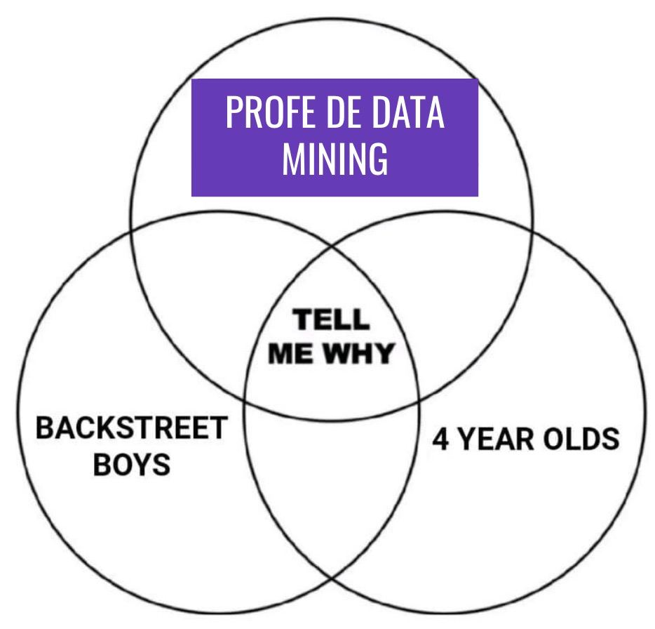
``` 


---

# Introducción a la .orange[ESTADÍSTICA]

.pull-left[

**.bg-purple_light[¿Qué es la estadística?]** Según la RAE...

* **.bg-purple_light[Estudio de los datos]** cuantitativos de la población, de los recursos naturales e industriales, del tráfico o de cualquier otra manifestación de las sociedades

* **.bg-purple_light[Rama de la matemática]** que utiliza grandes conjuntos de datos numéricos para obtener inferencias basadas en el cálculo de probabilidades.

]

.pull-right[

```{r echo = FALSE,  out.width = "90%", fig.align = "center"}

``` 

]

---

# Introducción a la .orange[ESTADÍSTICA]

.pull-left[

**.bg-purple_light[¿Qué es la estadística?]** Según la RAE...

* **.bg-purple_light[Estudio de los datos]** cuantitativos de la población, de los recursos naturales e industriales, del tráfico o de cualquier otra manifestación de las sociedades

* **.bg-purple_light[Rama de la matemática]** que utiliza grandes conjuntos de datos numéricos para obtener inferencias basadas en el cálculo de probabilidades.

]

.pull-right[

```{r echo = FALSE,  out.width = "51%", fig.align = "center"}

``` 

]


> «La estadística está caracterizada por una información acerca de un colectivo o universo, lo que constituye su objeto material; un modo propio de razonamiento, el método estadístico, lo que constituye su objeto formal y unas previsiones de cara al futuro, lo que implica un ambiente de incertidumbre» (Cabriá, 1994). 

---

# Introducción a la .orange[ESTADÍSTICA]

.pull-left[

La **.bg-purple_light[estadística]** como ciencia nació como una **.bg-purple_light[ciencia del Estado]**, de hecho nuestra palabra actual viene de dos palabras previas

* del término (neo)latino «statisticum collegium»: consejo de Estado.
* del alemán **.bg-purple_light[«statistik»]** (ciencia del Estado), término introducido por G. Achenwall.

&nbsp;

En su origen fue una desarrollada como una mera **.bg-purple_light[herramienta para la administración eficiente]** de la sociedad.

]

.pull-right[

```{r echo = FALSE,  out.width = "95%", fig.align = "left"}

``` 

]

---

# Introducción a la .orange[ESTADÍSTICA]

.pull-left[

Los **.bg-purple_light[primeros usos]** documentados son de hecho para elaborar **.bg-purple_light[censos y de uso militar]** en Mesopotamia, China y Egipto, con el objetivo de tener un **.bg-purple_light[recuento y organización de recursos]**

* Cobrar **impuestos**
* Repartir **tierras**
* Reclutar **soldados**

&nbsp;

Según Tucídides, conceptos como la **.bg-purple_light[moda]** ya existían en el siglo V a.C.: para asaltar la muralla de Platea, se usaba la estadística para el recuento de ladrillos de la muralla y aproximar su altura.

]


.pull-right[

```{r echo = FALSE,  out.width = "95%", fig.align = "left"}

``` 

]


---

# Introducción a la .orange[ESTADÍSTICA]

El **.bg-purple_light[objetivo principal]** de la estadística, ayudada por la probabilidad, es **.bg-purple_light[analizar datos y fenómenos]** cuyo mecanismo subyacente suele ser un experimento aleatorio.

--

### Experimento .green[ALEATORIO]

Un experimento se puede clasificar principalmente en

* **.bg-purple_light[Determinista]**: con las mismas condiciones iniciales, se obtiene el mismo resultado. Por ejemplo, el movimiento parabólico de un proyectil sin rozamiento.

* **.bg-purple_light[Aleatorio]**: con las mismas condiciones iniciales, se pueden obtener resultados diferentes. Por ejemplo, el tiempo entre clientes que entran en un establecimiento.

---

# Introducción a la .orange[ESTADÍSTICA]


Un error muy habitual es interpretar lo «aleatorio» como **.bg-purple_light[equiprobable]**: un suceso aleatorio **.bg-red_light[NO IMPLICA]** que todas sus opciones tengan la misma probabilidad de suceder.

* **.bg-purple_light[Aleatorio]**: el resultado individual inmediato no se puede asegurar con total certeza (tenemos **.bg-orange[incertidumbre]**)

* **.bg-purple_light[Sucesos equiprobables]**: colección de sucesos de una variable aleatoria cuya probabilidad de suceder es la misma para todos ellos.

--

**.bg-green_light[RECUERDA]**: un **dado trucado** sigue siendo aleatorio, igual de aleatorio que un dado sin trucar. No hay algo más o menos aleatorio, solo **.bg-purple_light[diferentes distribuciones de probabilidad]** que modelizan los sucesos.

---

# .green[POBLACIÓN] vs .orange[MUESTRA]

.pull-left[

**.bg-green_light[POBLACIÓN]**

Una población será el conjunto total o **.bg-purple_light[colectivo de individuos factibles de estudiar]**, o de posibles elementos/eventos de los podríamos tener observaciones (por ejemplo, 47 millones de españoles). 

Es nuestro **.bg-purple_light[universo teórico]**, y nuestro objetivo será conocer algunas de las propiedades de esa población.

&nbsp;

**.bg-green_light[INDIVIDUO]**

Cada uno de los elementos o eventos de la población.

]

.pull-right[

**.bg-orange[MUESTRA (SAMPLE)]**

Dado que la **.bg-red_light[población suele ser inaccesible]** en su totalidad (no podemos medir a TODA la población), debemos realizar una **.bg-purple_light[selección]** de un conjunto de individuos

Dicho subconjunto será siempre de **.bg-purple_light[tamaño finito n]**, de forma que la muestra sea de alguna manera **.bg-purple_light[«representativa»]** de la población (bien a lo largo de los individuos, bien a lo largo del tiempo). Un estudio estadístico realizado sobre la totalidad de una población se denomina censo. 


]

---

# .green[POBLACIÓN] vs .orange[MUESTRA]


```{r echo = FALSE,  out.width = "55%", fig.align = "center"}
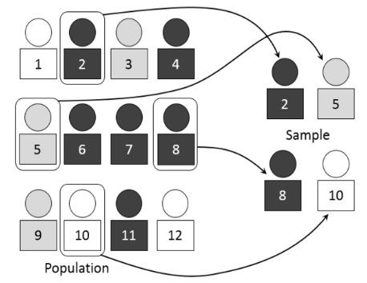
``` 

---

# .green[CARACTERES] y .orange[MODALIDADES]


.pull-left[

* **.bg-purple_light[Caracteres (variables)]**: cada una de las **características o cualidades** que se podrían medir o analizar para cada individuo de la población (y de los que disponemos el valor para cada individuo de la muestra).

* **.bg-purple_light[Modalidades]**: conjunto de los **diferentes valores** que puede adoptar una característica o variable.


]

.pull-right[

Un **.bg-purple_light[ejemplo]** (población de alumnos de UCM)

* **.bg-orange[Caracteres o variables]**:
  - sexo
  - edad
  - carrera
  - estatura

* **.bg-orange[Modalidades]**:
  - sexo: hombre/mujer.
  - edad: 18, 19, 20, 21, 22, ..., 98, 99, 100
  - carrera: mates, filología, historia, etc.
  - estatura: intervalo [130cm, 200cm].
  
* **.bg-orange[Muestra]**: conjunto de 300 estudiantes seleccionados al azar.
]

---

# .orange[TIPOS] de variables

Imagina las siguientes variables:

* ¿Tienes hermanos?
* Resultado de la tirada de un dado
* Color de zapatillas
* Nivel de estudios
* Número de hermanos
* Número de pelos en la cabeza
* Resultado de un dado dividido entre 10
* Temperatura ºC
* Género
* Estatura o peso
* Religión


**.bg-purple_light[¿CUÁL ES LA DIFERENCIA ENTRE ELLAS?]**

---


# .orange[TIPOS] de variables

.pull-left[

Imagina las siguientes variables:

* ¿Tienes hermanos?
* Resultado de la tirada de un dado
* Color de zapatillas
* Nivel de estudios
* Número de hermanos
* Número de pelos en la cabeza
* Resultado de un dado dividido entre 10
* Temperatura ºC
* Género
* Estatura o peso
* Religión


**.bg-purple_light[¿CUÁL ES LA DIFERENCIA ENTRE ELLAS?]**

]

.pull-right[

* **.bg-purple_light[Cualitativas]**: representan **.bg-orange[cualidades o categorías]** no cuantificables numéricamente (sexo, estado civil, etc).

  - **.bg-purple_light[Ordinales]**: admiten **jerarquía** (suspenso-aprobado-notable).
  - **.bg-purple_light[Nominales]**: no tienen asociada una jerarquía (sexo, religión, color, etc).


* **.bg-purple_light[Cuantitativas]**: característica **.bg-orange[cuantificable numéricamente]**.

  - **.bg-purple_light[Discretas]**: se pueden contar y enumerar (aunque sean infinitos) (nº granos de arena, nº hermanos, etc).
  - **.bg-purple_light[Continuas]**: además de tomar infinitos valores, entre dos valores cualesquiera hay a su vez infinitas opciones (estatura, peso, etc).


]

---

# .orange[DISCRETA] vs .green[CONTINUAS]

```{r echo = FALSE,  out.width = "76%", fig.align = "center"}
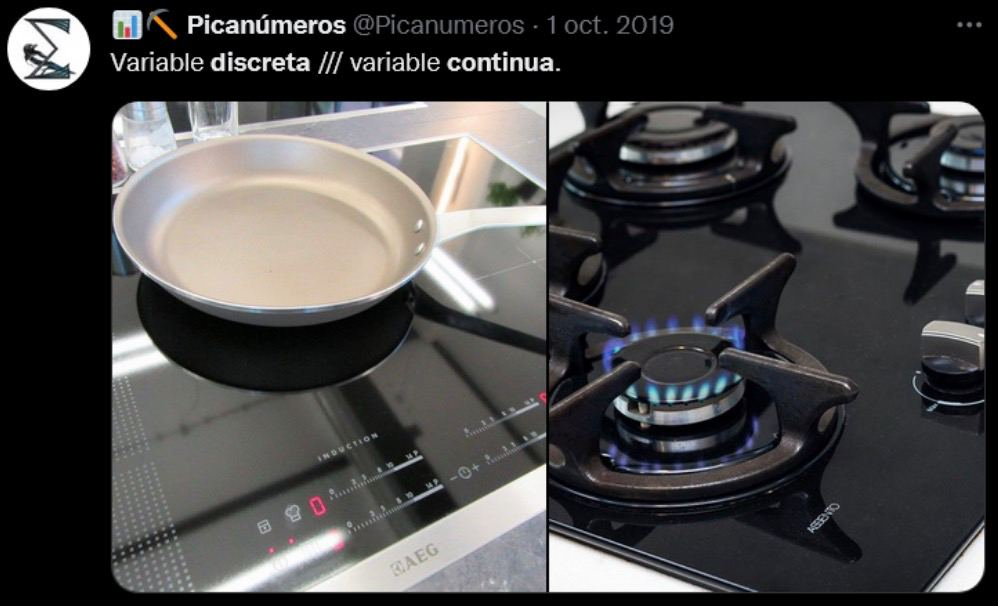
``` 

---

# Resumiendo información: .orange[MOMENTOS]

En estadística los **.bg-purple_light[momentos]** serán parámetros calculados a partir de los datos que, mediante una fórmula, **.bg-purple_light[resumen numéricamente]** algunas características de nuestros datos:

--

* Medidas de **.bg-purple_light[centralización]**: en torno a qué valores se **concentran** los datos.

--

* Medidas de **.bg-purple_light[dispersión]**: cuantifican la **dispersión respecto al centro**.

--

* Medidas de **.bg-purple_light[posición/localización]**: cómo se **localizan** los datos, valores que nos permiten segmentar nuestros datos en conjuntos de partes iguales (mismo % de datos, los famosos percentiles).

--

* Medidas de **.bg-purple_light[forma]**: nos complementan la caracterización de la distribución, por ejemplo, indicándonos la **dirección** en la que se desvían los datos.


---

# Medidas de .orange[CENTRALIZACIÓN]

Las **.bg-purple_light[medidas de centralización]** nos informan de los valores en torno a los que se **concentra** nuestra variable, un **.bg-purple_light[«representante»]** de nuestra variable.

--

* **.bg-purple_light[Media]** (aritmética, sin ponderar): definida como la suma de valores, dividida entre el tamaño muestral. **.bg-red_light[Solo para cuantitativas]**

--

* **.bg-purple_light[Mediana]**: si ordenamos los datos de menor a mayor, el valor central (por debajo el 50%, por encima el 50%). **.bg-red_light[Solo si existe jerarquía de orden]**.

--

* **.bg-purple_light[Moda]**: el **valor o valores más repetidos** de nuestra variable, lo más frecuente. **.bg-red_light[Amodal]**: todos se repiten por igual -> no hay moda.


---

# .orange[MEDIA] aritmética

.pull-left[

Dada una muestra, la **.bg-purple_light[media (aritmética) muestral]** $\overline{x}$ se define como la suma de todos los valores dividida por el tamaño muestral.

$$\overline{x} = \frac{1}{N} \sum_{i=1}^{N} x_i$$

También se puede definir como el **.bg-purple_light[valor «más cercano» a todos los datos]** a la vez, minimizando las distancias (al cuadrado) de los datos a dicho valor.

]

.pull-right[

```{r echo = FALSE,  out.width = "89%", fig.cap = "Extraída de instagram.com/javieralvarezliebana", fig.align = "left"}
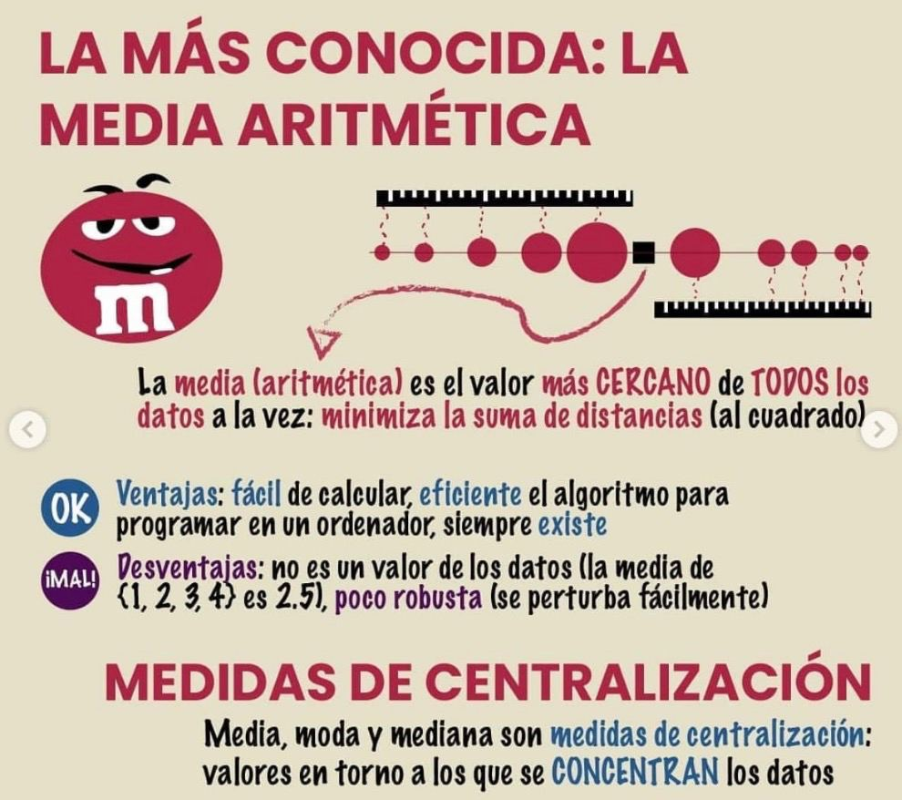
``` 


]


---

# .orange[ROBUSTEZ] de la media

```{r echo = FALSE,  out.width = "43%", fig.cap = "Extraída de instagram.com/javieralvarezliebana", fig.align = "center"}
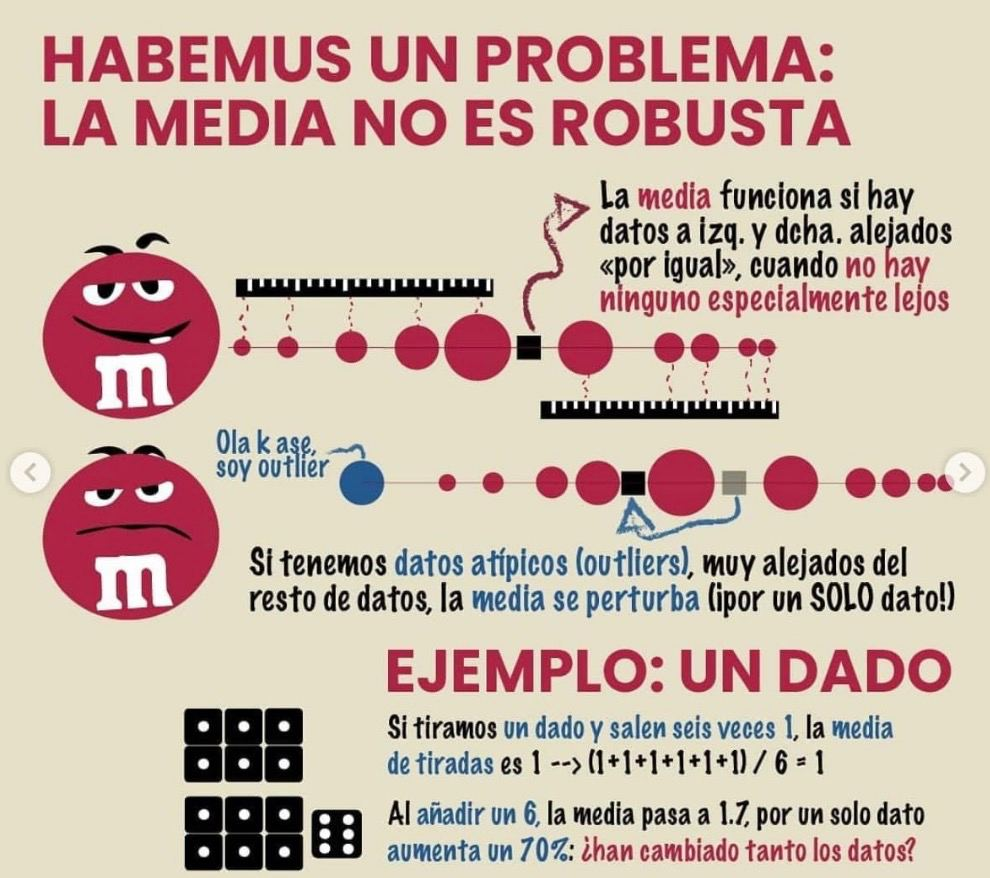
``` 

---


# .orange[MEDIANA]


.pull-left[

Dada una muestra, la **.bg-purple_light[mediana muestral]** se define como el valor que es mayor o igual que al menos el 50%, y menor igual que al menos el 50% de los datos

$$Me_{x} = \displaystyle \arg \min_{x_i} \left\lbrace F_i > 0.5 \right\rbrace$$

En caso de $F_i = 0.5$ en variables discretas, realizaremos la media de $x_i$ y $x_{i+1}$.

]

.pull-right[

```{r echo = FALSE,  out.width = "89%", fig.cap = "Extraída de instagram.com/javieralvarezliebana", fig.align = "left"}
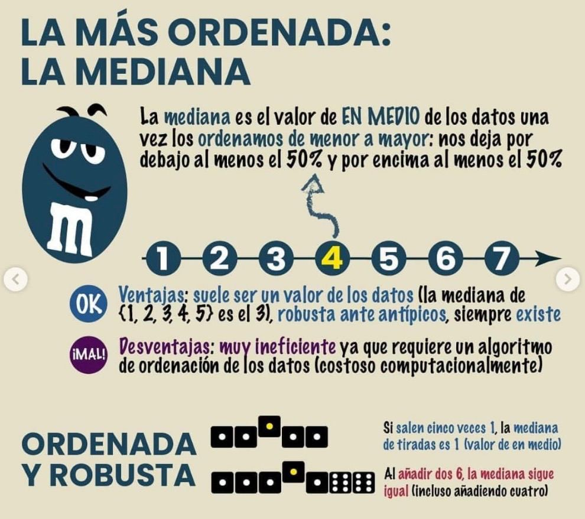
``` 


]


---

# .orange[MODA]


.pull-left[

Dada una muestra, la **.bg-purple_light[moda muestral]** se define como el valor o valores más repetidos (en caso de que existan)

$$Mo_{x} = \displaystyle \arg \max_{x_i} f_i$$

Podríamos tener distribuciones **unimodales**, **bimodales**, **trimodales**...incluso **amodales**

]

.pull-right[

```{r echo = FALSE,  out.width = "89%", fig.cap = "Extraída de instagram.com/javieralvarezliebana", fig.align = "left"}
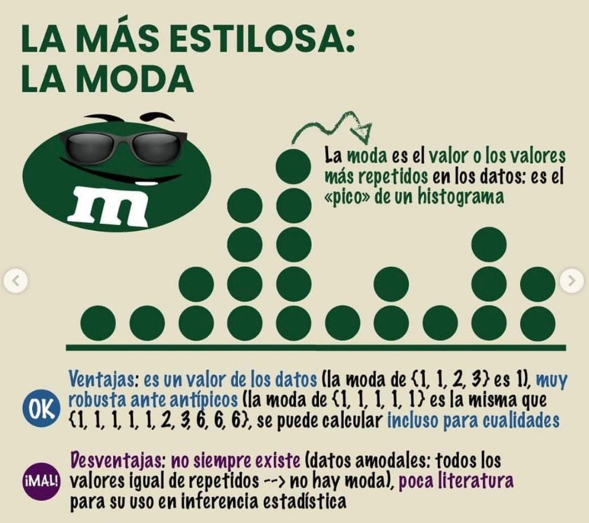
``` 


]

---

# .orange[ROBUSTEZ]

**.bg-green_light[¿Cuál es cuál?]**

```{r echo = FALSE,  out.width = "70%", fig.align = "center"}
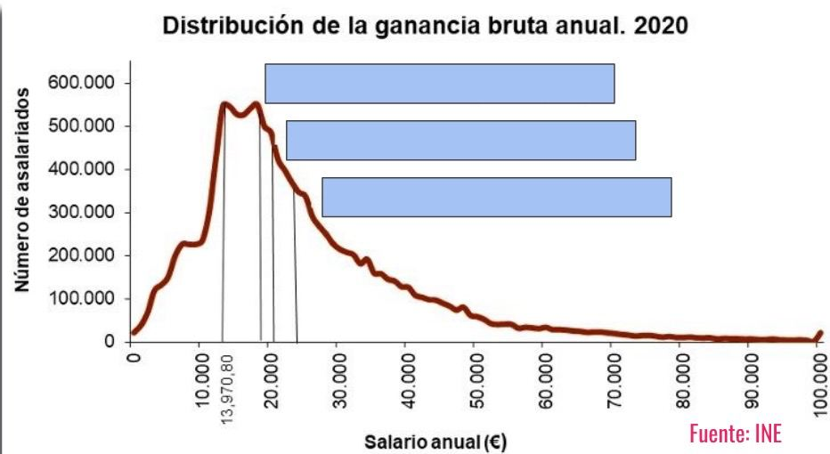
``` 


---

# Medidas de .orange[DISPERSIÓN]

```{r echo = FALSE,  out.width = "45%", fig.align = "center"}

``` 

--

El cambio climático, un problema de dispersión

---

# Medidas de .orange[DISPERSIÓN]

```{r echo = FALSE,  out.width = "70%", fig.align = "center"}
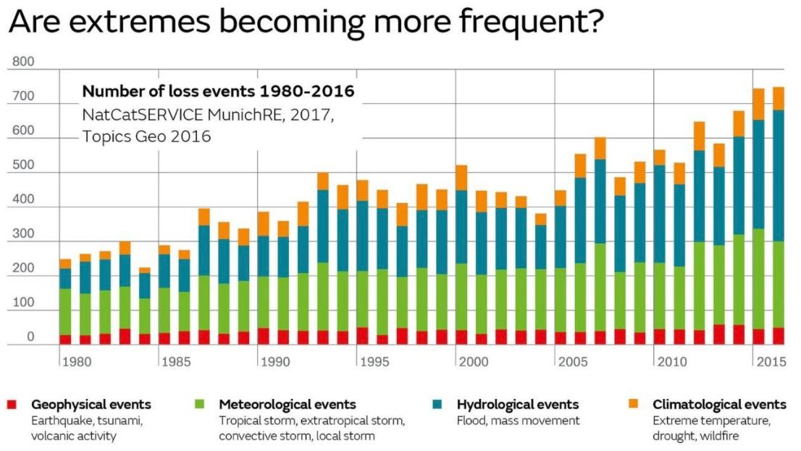
``` 

El cambio climático, un **.bg-purple_light[problema de dispersión]**

---

# Medidas de .orange[DISPERSIÓN]

.pull-left[

Una primera idea podría ser **.bg-purple_light[medir la distancia de cada dato al centro]**, es decir, restar cada dato de la media, y después realizar su promedio.

$$\frac{1}{N} \sum_{i=1}^{N} \left(x_i - \overline{x} \right)$$

**.bg-red_light[¿Problema?]**

]

.pull-right[

```{r echo = FALSE,  out.width = "99%", fig.align = "center"}
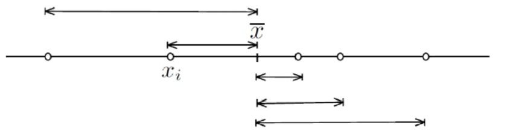
``` 

]

--

&nbsp;

Imagina que tenemos $X = \left\lbrace -5, -3, -1, 0, 1, 3, 5 \right\rbrace$: la media es 0, y el promedio de las distancias a la media también ya que se **.bg-red_light[cancelan los signos]**.

**.bg-green_light[¿Solución?]**

---

# Medidas de .orange[DISPERSIÓN]

En matemáticas suele ser **desaconsejable usar el valor absoluto** (dado que es una función no derivable), así que lo que haremos será calcula el **.bg-purple_light[promedio de las distancias al cuadrado]**


$$s_{x}^{2} = \frac{1}{N} \sum_{i=1}^{N} \left(x_i - \overline{x} \right)^2 = \overline{x^2} - \overline{x}^2$$

--

Esta medida de dispersión es lo que conocemos como **.bg-purple_light[VARIANZA muestral]**.

--

**.bg-red_light[CUIDADO]**: tanto `R` como el resto de software nos devolverán la cuasivarianza $S_{x}^{2}$ (promedio entre $N-1$, no entre $N$), ya que es el **estimador insesgado** de la varianza poblacional $\sigma_{x}^2$: asumimos que los estimadores casi nunca coincidirán con su valor teórico pero si repetimos el experimento un número suficiente de veces, su promedio si tenderá a él.

$${\rm E} [\overline{x}] = \mu, \quad {\rm E} [S_{x}^{}] = \sigma_{x}^{2}$$


---

# Medidas de .orange[DISPERSIÓN]


**.bg-red_light[¿Problema?]**

--

```{r echo = FALSE,  out.width = "70%", fig.align = "center"}

``` 

Necesitamos una medida de dispersión en las **unidades de los datos**.

---

# Medidas de .orange[DISPERSIÓN]


Para tener una **.bg-purple_light[medida de dispersión en las unidades]** de los datos calcularemos la **.bg-purple_light[desviación típica]**, como la raíz cuadrada de la varianza


$$s_{x} = \sqrt{s_{x}^{2}} = \sqrt{\frac{1}{N} \sum_{i=1}^{N} \left(x_i - \overline{x} \right)^2} = \sqrt{\overline{x^2} - \overline{x}^2}$$
--

Imaginemos entonces que tenemos dos conjuntos de datos: estaturas (de 165 a 175 cm) y diámetros de núcleos de células (de 3 a 7 micrómetros). Si obtenemos una  desviación típica de 1 cm y 1.5 micrómetros, **.bg-purple_light[¿cuál es más dispersa?]**

--

&nbsp;

¿**.bg-red_light[NO podemos comparar]** varianzas y desviaciones típicas? 

---

# Medidas de .orange[DISPERSIÓN]


```{r echo = FALSE,  out.width = "80%", fig.align = "center"}

``` 


**.bg-red_light[NO podemos comparar]** ni varianzas ni desviaciones típicas: dependen de la magnitud y unidades de los datos.

---

# Medidas de .orange[DISPERSIÓN]

Para tener una **.bg-purple_light[medida de dispersión adimensional]** que podamos comparar en distintos conjuntos de datos calcularemos el **.bg-purple_light[coeficiente de variación]**, como la desv. típica entre el valor absoluto de la media


$$CV_{x} = \frac{s_{x}}{\left| \overline{x} \right|}$$

---

# Medidas de .orange[LOCALIZACIÓN/POSICIÓN]


Las **.bg-purple_light[medidas de posición]** nos **localizan** los datos: son **.bg-purple_light[valores que nos dividen]** un conjunto ordenado en un número de tramos con el mismo tamaño muestral. Ejemplo: la mediana es el percentil $P_{50}$, el decil $D_{5}$ y el cuartil $C_{2}$ o $q_2$.

* **.bg-purple_light[Percentil]**: valores $P_{\alpha}$ del conjunto ordenado que dejan por debajo, al menos, el $\alpha  \%$ de datos y el $(100-\alpha) \%$ por encima.   


* **.bg-purple_light[Decil]**: valores $D_{\alpha}$ del conjunto ordenado que dividen los datos en 10 partes iguales, que dejan por debajo, al menos, el $10*\alpha  \%$ de datos y el $(100-10*\alpha) \%$ por encima.   


* **.bg-purple_light[Cuartil]**: valores $C_{\alpha}$ o $q_{\alpha}$ del conjunto ordenado que dividen los datos en 4 partes iguales, que dejan por debajo, al menos, el $25*\alpha  \%$ de datos y el $(100-25*\alpha) \%$ por encima.   

---

class: inverse center middle
name: clase-3

# CLASE 3: Tidydata

&nbsp;


### [Estructuras de control](#estructuras-condicionales)

### [Tidydata](#tidydata)

### [Comunicando resultados](#rmd)

### [Caso práctico: datos de la OMS](#oms)


---

name: estructuras-condicionales

# Estructuras de control: .orange[IF-ELSE]


Una **.bg-purple_light[expresión de control]** será un conjunto de órdenes que nos permiten **.bg-purple_light[decidir el camino]** por el que queremos que avance nuestro código:

* ¿Qué hacemos si sucede A?

* ¿Y si sucede B?

* ¿Tengo que programar X veces lo mismo si quiere que se repita?

&nbsp;

Si has programado en algún otro lenguaje, estarás familiarizado/a con **.bg-purple_light[estructuras condicionales]** como un `if (blabla) {...} else {...}` (que los usaremos a veces) o **.bg-purple_light[bucles]** `for/while` (que intentaremos evitarlos lo máximo posible).

---

# Estructuras de control: .orange[IF]

Una de las estructuras de control más famosas de cualquier lenguaje de programación es la **.bg-purple_light[estructura condicional]** `if`

> SI las condiciones impuestas se cumplen (TRUE), ejecuta las órdenes que tengamos dentro de la misma.

Por ejemplo, la estructura `if (x == 1) { código A }` lo que hará será **.bg-purple_light[ejecutar el código entre llaves]** pero **.bg-orange[SI Y SOLO SI]** la **.bg-purple_light[condición es cierta]** (en este caso, solo si `x` es igual 1). En **caso contrario, no hace nada**.

--

Definamos por ejemplo una variable sencilla, las edades de 8 personas y comprobemos cuales son menores de edad.

```{r}
edades <- c(14, 17, 24, 56, 31, 20, 87, 73)
edades < 18
```

---

# Estructuras de control: .orange[IF]


Recuerda que con las funciones `any()` y `all()` podemos saber si **.bg-purple_light[todos o alguno de los elementos]** de un vector cumplen una condición.

```{r}
any(edades < 18) # existe algun menor de edad
```

--

Con dichos elementos vamos a construir nuestra primera estructura condicional: queremos que, **.bg-purple_light[SI existe algún menor de edad, nos imprima un mensaje]**.

```{r}
if (any(edades < 18)) { 
  
  print("existe alguna persona mayor de edad")
  
}
```

---

# Estructuras de control: .orange[IF]

```{r eval = FALSE}
if (any(edades < 18)) { 
  
  print("existe alguna persona mayor de edad")
  
}
```


En caso de que **.bg-purple_light[no se cumplan las condiciones]** dentro del `if()` (FALSE), no sucederá nada. 


```{r}
if (all(edades >= 18)) { 
  
  print("todas las personas son mayores de edad")
  
}
```

Fíjate que en este caso **no hemos obtenido ningún mensaje** porque la condición `all(edades >= 18)` no es cierta (no son todos mayores de 18 años), así que **no ha ejecutado el código**.

---

# Estructuras de control: .orange[IF-ELSE]

La estructura `if (condicion) { }` puede ser combinada con un `else { }`: cuando la **.bg-purple_light[condición no se cumpla]** (como en el último ejemplo), se **.bg-purple_light[ejecutará el código alternativo]** que haya dentro del `else { }`, permitiéndonos decidir que sucede cuando SÍ se cumple y cuando NO se cumple.

--

Por ejemplo, la estructura `if (x == 1) { código A } else { código B }` ejecutará A si `x` es 1 y B en cualquier otro caso.

```{r}
if (all(edades >= 18)) { 
  
  print("todas las personas son mayores de edad")
  
} else { #<<
  
  print("existe alguna persona menor de edad")
}
```

---

# Estructuras de control: .orange[IF-ELSE]

Dicha estructura `if - else` puede **.bg-purple_light[anidarse]**: imagina que queremos realizar una acción si todos fuesen mayores de edad; en caso contrario, pero si todos los menores tienen 16 años o más, realizar otra acción; en caso contrario, otra acción

```{r}
if (all(edades >= 18)) { 
  
  print("todas las personas son mayores de edad")
  
} else if (all(edades >= 16)) {
  
  print("Existe alguna persona menor de edad pero todos con 16 años o más")
  
} else { print("Existe alguna persona menor de 16 años") }
```

**.bg-green_light[CONSEJO]**: puedes **colapsar las estructuras de control** pulsando en la flecha que aparece a la izquierda de ellas en tu script.


---

# Estructuras de control: .orange[IFELSE()]


Esta estructura condicional puede ser **.bg-purple_light[vectorizada]**: reunir en una sola fila un número elevado de estructuras de comparación con la función `ifelse()`, cuyos argumentos de entrada serán

* la condición a evaluar
* lo que sucede cuando se cumple
* lo que sucede cuando no se cumple

Con el ejemplo de las edades, vamos a dejar el dato ausente si son menores de edad, y si son mayores de edad se queda como está.

```{r}
# NA si no cumple la condición, la edad si se cumple.
ifelse(edades >= 18, edades, NA) #<<
```

---

# Estructuras de control: .orange[IFELSE()]


Todas estas estructuras **.bg-purple_light[no solo sirven para datos numéricos]**. Vamos a definir un vector de nombres con algunos ausentes, y vamos a sustituir los ausentes por el texto `"nombre_desconocido"` (los que no sean ausentes, es decir los que `is.na()` devuelva FALSE, se quedan como están).

```{r}
nombres <- c("Juan", "María", NA, NA, "Lucía",
             "Carmen", "Javier", NA, "Carlos", 
             NA, "Gregorio", "Paloma")

# Si tiene ausente --> "nombre_desconocido"
# Si no tiene ausente --> nombres originales
nombres <-
  ifelse(is.na(nombres), "nombre_desconocido", nombres)
nombres
```

---

name: bucles

# Estructuras de control: .orange[BUCLES]

Aunque la mayoría de veces son sustituibles por otras expresiones más legibles y eficientes, es importante que conozcamos otra archiconocida expresion de control: **.bg-purple_light[los bucles]**.

* `for { }`: permite **.bg-purple_light[repetir el mismo código]** un **.bg-orange[número fijo y conocido]** de veces (normalmente en función de un índice).

* `while { }`: permite **.bg-purple_light[repetir el mismo código]** un **.bg-orange[número indeterminado de veces]**, hasta que una **condición** dada se deje de cumplir.

---

# Estructuras de control: .orange[BUCLES FOR]

Un **.bg-purple_light[bucle for]** es una estructura que nos permite **.bg-purple_light[repetir]** un conjunto de órdenes un **.bg-orange[número finito y conocido]** de veces: dado un **conjunto de índices**, el bucle irá recorriendo cada uno de ellos.

Vamos a definir un vector `x`. Si quisiéramos el primer elemento al cuadrado escribiríamos `x[1]^2`; si quisiéramos el segundo elemento al cuadrado `x[2]^2`; si lo quisiéramos hacer en general, para el elemento i-ésimo, `x[i]^2`. Lo que haremos dentro del `for (indices) { órdenes }` es indicarle que valores irá tomando `i` (**.bg-purple_light[vector de índices]**).

```{r}
x <- c(0, -7, 1, 4)
for (i in 1:4) { #<<
  
  print(x[i]^2) # órdenes
  
}
```

---

# Estructuras de control: .orange[BUCLES FOR]

```{r eval = FALSE}
for (i in 1:4) { #<<
  print(x[i]^2) # órdenes
}
```

Lo que tenemos dentro de los paréntesis `for ()` no es más que la **.bg-purple_light[secuencia de números]** que hemos aprendido a construir. Si quisiéramos que haga lo mismo pero excluyendo por ejemplo el segundo elemento bastaría con definir los índices a recorrer como `c(1, 3, 4)`.

```{r}
for (i in c(1, 3, 4)) {
  
  print(x[i]^2) # que lo imprima
  
}
```

---

# Estructuras de control: .orange[BUCLES FOR]

Podemos definir también una variable `y <- rep(0, 4)` (un **vector «vacío»** lleno de ceros), y hacer que el **.bg-purple_light[elemento i-ésimo del vector]** se defina como `x[i]^2`

```{r}
y <- rep(0, 4)
for (i in 1:4) {
  
  y[i] <- x[i]^2
  
}
y
```

--

Lo anterior es equivalente a esto

```{r}
y <- x^2
y
```

---

# .orange[BUCLES] suelen ser .red[INEFICIENTES]


Haciendo uso del paquete `microbenchmark` podemos comprobar como los **.bg-purple_light[bucles son menos eficientes]** (de ahí que la mayoría de veces los intentemos evitar si existe otra alternativa)

```{r}
library(microbenchmark)
x <- 1:100
microbenchmark(x^2, 
               for (i in 1:100) { y[i] <- x[i]^2 },
               times = 1000)
```

---
 
# Estructuras de control: .orange[BUCLES FOR]


Veamos otro ejemplo **.bg-purple_light[combinando vectores numéricos y de caracteres]**: vamos a definir de nuevo un vector de edades y nombres, y vamos a recorrer cada uno imprimiento un mensaje por pantalla.

```{r}
nombres <- c("Javi", "Laura", "Carlos", "Lucía", "Mar")
edades <- c(33, 51, 18, 43, 29)

# Recorremos cada uno de los 5 elementos e imprimimos un
# mensaje que depende de ese índice i
for (i in 1:5) { 
  
  print(glue("{nombres[i]} tiene {edades[i]} años")) 
  
}
```

---

# Estructuras de control: .orange[BUCLES FOR]

Fíjate que **.bg-purple_light[si no nos queremos preocupar de si añadimos otra persona]**, podemos hacer que el bucle empiece en 1 y termine en el **.bg-purple_light[último lugar]** (sea el que sea), usando `length()`.

```{r}
for (i in 1:length(nombres)) { 
  
  print(glue("{nombres[i]} tiene {edades[i]} años")) 
  
}
```

---

# Estructuras de control: .orange[BUCLES FOR]

Aunque normalmente el conjunto que recorre el bucle suelen ser índices numéricos, podemos **.bg-purple_light[recorrer cualquier tipo de objeto]**, por ejemplo días e la semana

```{r}
library(stringr)
dias_semana <- c("lunes", "martes", "miércoles", "jueves",
                 "viernes", "sábado", "domingo")

for (dias in dias_semana) { # dias recorre los días de la semana
  
  print(str_to_upper(dias)) # Imprimimos en mayúsculas el día
}
```

---

# Estructuras de control: .orange[BUCLES FOR]

Un último ejemplo: vamos a recorrer nuestro conjunto de datos `swiss` del paquete `{datasets}` y vamos a **pasar a dato ausente** todos los valores de fertilidad superiores a 80. Para ello recorreremos cada fila para después ejecutar un `if`.

```{r}
for (i in 1:nrow(swiss)) {
  
  # si cumple la condición dicha fila, ponemos ausente.
  if (swiss$Fertility[i] > 80) { 
    
    swiss$Fertility[i] <- NA
    
  }
}
```

--

Esto sería exactamente equivalente al `ifelse()` vectorizado que vimos en el tema anterior

```{r}
data("swiss") # lo cargamos de 0
swiss$Fertility <- ifelse(swiss$Fertility > 80, NA, swiss$Fertility)
```


---

# Estructuras de control: .orange[BUCLES WHILE]

Otra manera de diseñar un bucle es con la estructura `while { }`, que ejecutará el bucle un **.bg-purple_light[número de veces a priori  desconocido]**, lo hará hasta que la **.bg-purple_light[condición impuesta deje de ser cierta]**. Por ejemplo, vamos a inicializar una variable `ciclos <- 1`, y en cada paso aumentaremos una unidad, y no saldremos del bucle hasta que `ciclos > 4`

```{r}
ciclos <- 1

# Mientras el número de ciclos sea inferior 4, imprime
while(ciclos <= 4) {
  
  print(paste("Todavía no, vamos por el ciclo ", ciclos)) # Pegamos la frase al número de ciclo por el que vayamos con paste
  ciclos <- ciclos + 1
  
}
```


---
  
# Estructuras de control: .orange[BUCLES WHILE]


¿Y qué sucede cuando la **.bg-purple_light[condición nunca llega a ser FALSE]**? Compruébalo tú mismo/a.

```{r eval = FALSE}
while (1 > 0) { # Nunca va a dejar de ser cierto
  
  print("Presiona ESC para salir del bucle")
  
}
```

&nbsp;

**.bg-red_light[CUIDADO]**: un bucle `while { }` puede ser muy peligroso sino se controla bien que el bucle acaba en algún momento.

---

# Estructuras de control: .orange[BUCLES WHILE]

Tenemos dos comandos reservados para poder **.bg-purple_light[abortar un bucle o avanzar forzosamente]**:

* `break`: os habilita para **.bg-purple_light[parar un bucle]** aunque no haya llegado al final de su conjunto de índices a recorrer (o se siga cumpliendo la condición).

```{r}
for(i in 1:10) {
  if (i == 3) {
    
    break # si i es 3, el bucle frena aquí
    
  }
  print(i)
}
```

---

# Estructuras de control: .orange[BUCLES WHILE]

Tenemos dos comandos reservados para poder **.bg-purple_light[abortar un bucle o avanzar forzosamente]**:

* `next`: **.bg-purple_light[obliga al bucle a avanzar]** a la siguiente iteracción, abortando la iteración actual en la que se encuentra. 

```{r}
for(i in 1:5) {
  if (i == 3) {
    
    next # si i es 3, pasará a la siguiente
    
  }
  print(i)
}
```

---


# Ejercicios

.panelset[
.panel[.panel-name[Ejercicios]


* 📝 **Ejercicio 1**: modifica el código inferior para imprimir un mensaje por pantalla si todos los datos del conjunto `airquality` son de meses que no sean enero.

```{r eval = FALSE}
# install.packages("dataset") # solo la primera vez
library(datasets) # paquete con los datos
mes <- airquality$Month

if (mes == 2) {
  
  print("Ningún dato es del mes de enero")
  
}
```

]

.panel[.panel-name[Solución ej. 1]

* 📝 **Ejercicio 1**: modifica el código inferior para imprimir un mensaje por pantalla si todos los datos del conjunto `airquality` son de meses que no sean enero.

```{r}
# install.packages("dataset") # solo la primera vez
library(datasets) # paquete con los datos
mes <- airquality$Month

if (all(mes != 1)) {
  
  print("Ningún dato es del mes de enero")
  
}
```

]

]


---

# Ejercicios

.panelset[
.panel[.panel-name[Ejercicios]

* 📝 **Ejercicio 2**: modifica el código inferior para guardar en una variable llamada `temperatura_alta` un valor `TRUE` si alguno de los registros tiene una temperatura mayor a 90 (están en Farenheit) y un `FALSE` en caso contrario.
 
```{r eval = FALSE}
temperatura <- airquality$Temp

if (temperatura == 100) {
  
  print("Alguno de los registros tiene temperatura superior a 90 Farenheit")
  
}
```

]

.panel[.panel-name[Solución ej. 2]

* 📝 **Ejercicio 2**: modifica el código inferior para guardar en una variable llamada `temperatura_alta` un valor `TRUE` si alguno de los registros tiene una temperatura mayor a 90 (están en Farenheit) y un `FALSE` en caso contrario.
 
```{r eval = FALSE}

# Opción 1
temperatura <- airquality$Temp
temperatura_alta <- FALSE
if (any(temperatura > 90)) {
  
   temperatura_alta <- TRUE
  
}

# Opción 2
temperatura_alta <- any(airquality$Temp > 90)
```


]

]

---


# Ejercicios

.panelset[
.panel[.panel-name[Ejercicios]

* 📝 **Ejercicio 3**: modifica el código inferior para diseñar un bucle `for` de 5 iteraciones que recorra los 5 primeros impares y les sume uno.

```{r eval = FALSE}
for (i in 1:5) {
  
  print(i)
}
```

* 📝 **Ejercicio 4**: modifica el código inferior para diseñar un bucle `while` que parta con una variable `conteo <- 1` y pare cuando llegue a 6.

```{r eval = FALSE}
conteo <- 1
while (conteo == 2) {
  
  print(conteo)
}
```

]

.panel[.panel-name[Solución ej. 3]

* 📝 **Ejercicio 3**: modifica el código inferior para diseñar un bucle `for` de 5 iteraciones que recorra los 5 primeros impares y les sume uno.

```{r}
for (i in c(1, 3, 5, 7, 9)) {
  
  print(i + 1)
}
```

]

.panel[.panel-name[Solución ej. 4]

* 📝 **Ejercicio 4**: modifica el código inferior para diseñar un bucle `while` que parta con una variable `conteo <- 1` y pare cuando llegue a 6.

```{r}
conteo <- 1
while (conteo < 6) {
  
  print(conteo)
  conteo <- conteo + 1
  
}
```

]

]

---

# Ejercicios

.panelset[
.panel[.panel-name[Ejercicios]

* 📝 **Ejercicio 5**: diseña un bucle `for` de 200 iteraciones que, empezando en un valor inicial de 100 (euros), te sume 3€ (actualizando el valor) si el número actual de la iteración es par, y te reste 5€ si es impar (investiga la función `%%`).

* 📝 **Ejercicio 6**: diseña el anterior bucle pero guardando el dinero de cada iteración en alguna variable
 

* 📝 **Ejercicio 7**: diseña el bucle del ejercicio 5 pero parando cuando no nos quede dinero.

]

.panel[.panel-name[Sol. ej. 5]

Un número par será todo aquel número que al dividir entre 2, la división es exacta, es decir, que su resto es nulo. Para calcular ese resto usaremos la función `%%`.


```{r}
# dinero inicial
dinero <- 100

for (i in 1:200) {
  
  dinero <- ifelse(i %% 2 == 0, dinero + 3, dinero  - 5)
  
}
dinero
```

]

.panel[.panel-name[Sol. ej. 6]

```{r}
# vector inicial de importes
dinero <- rep(0, 201)
dinero[1] <- 100 # dinero inicial

# Bucle for
for (i in 2:201) {
  
  # si i es par o  impar
  dinero[i] <- ifelse(i %% 2 == 0, dinero[i - 1] + 3,
                      dinero[i - 1]  - 5)
  
}
dinero
```

]

.panel[.panel-name[Sol. ej. 7]

```{r}
dinero <- 100 # dinero inicial

# Bucle while
while (dinero > 0) {
  
  dinero <- ifelse(i %% 2 == 0, dinero + 3, dinero - 5)
  
}
dinero
```

]


]


---

name: tidydata

# Datos limpios: .orange[TIDY DATA]

.pull-left[

```{r echo = FALSE,  out.width = "99%", fig.align = "center"}
knitr::include_graphics("./img/tidyverrse_universe.jpg")
``` 

]

.pull-right[
```{r echo = FALSE,  out.width = "99%", fig.align = "center"}
knitr::include_graphics("./img/flow_tidyverse.jpg")
``` 
]

Universo de **.bg-purple_light[paquetes tidyverse]**: un conjunto de paquetes para un flujo de **trabajo eficiente, coherente y lexicográficamente** sencillo de entender.

---

# Datos limpios: .orange[TIDY DATA]

> Tidy datasets are all alike, but every messy dataset is messy in its own way (Hadley Wickham, Chief Scientist en RStudio)

Hasta ahora solo le hemos dado importancia al «qué» pero no al **.bg-purple_light[«cómo» manejamos los datos]**. La organización de nuestros datos es fundamental para que su **.bg-purple_light[preparación y explotación]** sea lo más eficiente posible.

```{r echo = FALSE,  out.width = "60%", fig.align = "center", fig.cap = "Flujo deseable de datos según Hadley Wickham, extraída de https://r4ds.had.co.nz/wrangle-intro.html"}
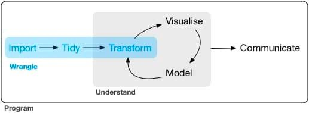
``` 


---

# Datos limpios: .orange[TIDY DATA]

El concepto **.bg-purple_light[tidy data]** fue introducido por **Hadley Wickham** (Wickham, 2014) como el primer paso de un flujo de trabajo eficiente. Para ello haremos uso del paquete `{tidyr}` (dentro de `{tidyverse}`) que nos proporciona herramientas eficientes y sencillaspara su manejo.

&nbsp;

Los **.bg-purple_light[conjuntos tidy u ordenados]** tienen tres objetivos

* **.bg-orange[Estandarización]** en su estructura para una depuración y análisis eficiente.
* **.bg-orange[Sencillez]** en su manipulación.
* Listos para ser **.bg-orange[modelizados y visualizados]**.

&nbsp;

📚 Ver Wickham (2014) en **.bg-green_light[bibliografía]** en <https://github.com/dadosdelaplace/teaching/tree/main/data_mining/biblio>

---

# Datos limpios: .orange[TIDY Dblob/main/data_mining/biblio/tidy_data_wickham_2014.pdfbg-purple_light[datos ordenados o tidy data]** deben cumplir:

1. Cada **.bg-green_light[variable en una columna]**.

2. Cada **.bg-orange[observación/individuo en una fila]** diferente.

3. Cada **.bg-green_light[celda con un único valor]**.

4. Cada **.bg-orange[conjunto en un tibble]** (tabla).

5. Si usamos múltiples tablas a la vez debemos tener una **.bg-green_light[columna común para poder cruzarlas]**.

]

.pull-right[

```{r echo = FALSE,  out.width = "85%", fig.align = "center"}
knitr::include_graphics("./img/tidy_def.jpg")
``` 

&nbsp;

```{r echo = FALSE,  out.width = "53%", fig.align = "center"}
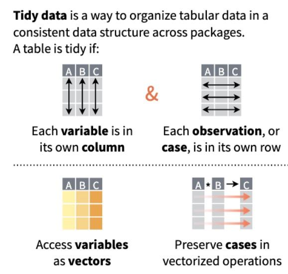
``` 


]


---

# Tubería .orange[PIPE]

En este entorno de trabajo tendremos un **.bg-purple_light[operador clave]**: el **.bg-purple_light[operador pipeline]** `%>%` (podemos usar el atajo con `ctrl+shift+M` o `command+shift+M`). Dicho operador lo debemos interpretar como una **.bg-purple_light[tubería]** que va pasando por los datos y los va transformando.


Por ejemplo, si tuviésemos tres funciones `first()`, `second()` y `third()`, la opción más inmediata sería anidar las tres funciones tal que `third(second(first(x)))`, algo que dificulta la lectura posterior del código

--

Con `%>%` podremos escribir (y leer) la concetanción de acciones como una **.bg-purple_light[tubería de izquierda a derecha]**:

```{r eval = FALSE}
first(x) %>% second(x) %>% third(x)
```

--

Dicho operador viene del paquete `{magrittr}`. Para **evitar esta dependencia** (cuantos menos paquetes tengamos que cargar, mejor), desde la versión 4.1.0 de R, disponemos de un pipeline nativo de R, el **operador** `|>` (disponible además fuera del entorno tidyverse).

---

# Tubería .orange[PIPE]

.pull-left[

```{r eval = FALSE}
datos %>%
  limpio(...) %>%
  selecciono(...) %>%
  filtro(...) %>%
  ordeno(...) %>%
  agrupo(...) %>%
  cuento(...) %>%
  resumo(...) %>% 
  pinto(...)
```

```{r eval = FALSE}
datos |>
  limpio(...) |>
  selecciono(...) |>
  filtro(...) |>
  ordeno(...) |>
  agrupo(...) |>
  cuento(...) |>
  resumo(...) |>
  pinto(...)
```

]

.pull-right[

```{r echo = FALSE,  out.width = "90%", fig.align = "center"}

``` 

]

---

# Datos .orange[SUCIOS]: messy data

Por ejemplo, vamos a cargar la tabla `table4a` del paquete `{tidyr}` (que ya lo tenemos cargado del entorno `{tidyverse}`).

```{r echo = FALSE}
library(tidyverse)
```

```{r}
table4a
```

**.bg-purple_light[¿Qué falla?]**

---


# Datos .orange[SUCIOS]: messy data

.pull-left[

```{r echo = FALSE}
library(tidyverse)
```

```{r}
table4a
```

**.bg-purple_light[¿Qué falla?]**

]

.pull-right[


❎ Cada **.bg-green_light[variable en una columna]**.

❎ Cada **.bg-orange[observación/individuo en una fila]** diferente.

❎ Cada **.bg-green_light[celda con un único valor]**.

]

Aunque la columna `$country` representa una variable, las otras columnas no: **.bg-purple_light[ambas son la misma variable]**, solo que medida en años distintos (que debería ser a su vez otra variable), de forma que **.bg-purple_light[cada fila está representando dos observaciones]** (1999, 2000). Tenemos datos en los nombres de las columnas.


---

# Datos .orange[SUCIOS]: messy data


.pull-left[

Lo que haremos será incluir una nueva columna llamada (por ejemplo) `year` que nos marque el año y otra llamada `cases` que nos diga el valor de la variable de interés en cada uno de esos años.

]

.pull-right[

```{r echo = FALSE,  out.width = "65%", fig.align = "center"}
knitr::include_graphics("./img/table4a.jpg")
``` 


]

--

Con la función `pivot_longer()` pivotaremos la tabla para pasarla a **formato long**:

```{r}
table4a %>%
  pivot_longer(cols = c("1999", "2000"), names_to = "year", values_to = "cases") #<<
```

---

# Datos .orange[SUCIOS]: messy data

.pull-left[

```{r eval = FALSE}
table4a %>%
  pivot_longer(cols = c("1999", "2000"),
               names_to = "year", 
               values_to = "cases") #<<
```

]

.pull-right[

```{r echo = FALSE,  out.width = "110%", fig.align = "center"}
knitr::include_graphics("./img/table4a_2.png")
``` 


]


* `cols`: el **.bg-purple_light[nombre de las columnas a pivotar]** (con comillas por ser números y no caracteres).
* `names_to`: el **.bg-purple_light[nombre de la nueva columna]** a la mandamos los **.bg-purple_light[nombres]** de las columnas.
* `values_to`: el **.bg-purple_light[nombre de la nueva columna]** a la que vamos a mandar los **.bg-purple_light[datos]**.


---

# Datos .orange[SUCIOS]: messy data

Echa un vistazo a la tabla `{table4b}`

```{r}
table4b
```

**.bg-purple_light[TODO TUYO]**: ¿es tidy o messy? ¿Cómo convertirla a tidy data en caso de que no lo sea ya?


---

# Datos .orange[SUCIOS]: messy data

Echa un vistazo a la tabla `{relig_income}`

```{r}
relig_income
```

**.bg-purple_light[TODO TUYO]**: ¿es tidy o messy? ¿Cómo convertirla a tidy data en caso de que no lo sea ya?

---

# Datos .orange[SUCIOS]: messy data

Veamos un segundo tipo de dato sucio: vamos a cargar la tabla `table2` del paquete `{tidyr}` (que ya lo tenemos cargado del entorno `{tidyverse}`). **.bg-purple_light[¿Qué falla?]**


```{r}
table2
```


---

# Datos .orange[SUCIOS]: messy data

.pull-left[


```{r}
head(table2)
```

]

.pull-right[


```{r echo = FALSE,  out.width = "69%", fig.align = "center"}
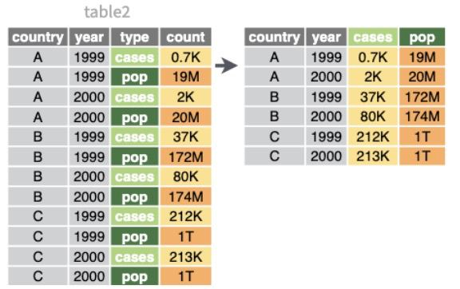
``` 
]


❎ Cada **.bg-orange[observación/individuo en una fila]** diferente.


Fíjate en las cuatro primeras filas: los registros con el mismo año deberían ser el mismo, es la misma información, **.bg-purple_light[debería estar en la misma fila]**, pero está dividada en dos. 

---


# Datos .orange[SUCIOS]: messy data

Lo que haremos será lo opuesto a antes: con `pivot_wider()` «ampliaremos» la **.bg-purple_light[tabla a lo ancho]**, con menos filas pero con más columnas.

```{r}
table2 %>%
  pivot_wider(names_from = type, values_from = count) #<<
```

* `names_from`: el **.bg-purple_light[nombre de la columna original]** de la que vamos a sacar las **.bg-purple_light[nuevas columnas]** que vamos a crear (`cases` y `population`).
* `values_from`: el **.bg-purple_light[nombre de la columna orignal]** de la que vamos a sacar los **.bg-purple_light[datos]**.


---

# Datos .orange[SUCIOS]: messy data


Por último veamos un tercer tipo de dato sucio: vamos a cargar la tabla `table3` del paquete `{tidyr}` (que ya lo tenemos cargado del entorno `{tidyverse}`). **.bg-purple_light[¿Qué falla?]**


```{r}
table3
```

--

❎ Cada **.bg-green_light[celda con un único valor]**.


---

# Datos .orange[SUCIOS]: messy data

Lo que haremos será usar `separate()` para mandar **.bg-purple_light[cada valor a una columna diferente]**.

```{r}
table3 %>% separate(rate, into = c("cases", "pop")) #<<
```

* `into`: **.bg-purple_light[nombre de nuevas columnas]** donde separaremos valores.


```{r echo = FALSE,  out.width = "40%", fig.align = "center"}
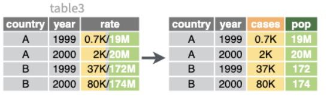
``` 


---

# Datos .orange[SUCIOS]: messy data


Por defecto lo que hace es **.bg-purple_light[localizar como separador cualquier caracter que no sea alfa-numérico]**. Si queremos un caracter concreto para dividir podemos indicárselo explícitamente. Si usas un separador que no está en los datos te devolverá dichas columnas vacías ya que no ha podido dividirlas.


```{r warning = TRUE}
table3 %>% separate(rate, into = c("cases", "population"), sep = ".")
```

---

# Datos .orange[SUCIOS]: messy data

De la misma manera que podemos separar columnas también podemos **.bg-purple_light[unir columnas]**. Para ello vamos a usar la tabla `table5` del ya mencionado paquete.

```{r}
table5
```

---

# Datos .orange[SUCIOS]: messy data

.pull-left[

Con la función `unite()` vamos a **.bg-purple_light[unir]** el siglo (en `century`) y el año (en `year`), y al inicio le indicaremos como se llamará la nueva variable `year_ok`

```{r}
table5 %>%
  unite(col = year_ok,
        century, year, sep = "")
```

]

.pull-right[

```{r echo = FALSE,  out.width = "99%", fig.align = "center"}
knitr::include_graphics("./img/unite.jpg")
``` 

]


---

# Eliminando .orange[AUSENTES]

El paquete `{tidyr}` también dispone de algunas herramientas útiles para **.bg-purple_light[quitar ausentes]**

```{r}
datos <- tibble(x = c(1, 2, NA), y = c("a", NA, "b"))
datos
```

---

# Eliminando .orange[AUSENTES]


Con `drop_na()` podemos indicarle que nos **.bg-purple_light[elimine las filas con algún ausente]** en alguna de las variables (o especificarle la variable concreta).


.pull-left[

```{r}
datos %>% drop_na()
```

]


.pull-right[

```{r}
datos %>% drop_na(x)
```

]

---

# Eliminando .orange[AUSENTES]

A veces no querremos eliminarlos sino **.bg-purple_light[imputar por el valor previo/siguiente]**  con `fill()`

.pull-left[

```{r}
datos %>% fill(x)
datos %>% fill(x, .direction = c("up"))
```

]

.pull-right[

```{r}
datos %>% fill(y)
datos %>% fill(y, .direction = c("up"))
```

]


---

# Eliminando .orange[AUSENTES]

Los **.bg-purple_light[ausentes]** también pueden ser **.bg-purple_light[eliminados al pivotar]** con `values_drop_na`.


```{r}
stocks <-
  tibble(qtr = 1:4,
         "2015" = c(1.88, 0.59, 0.35, NA),
         "2016" = c(NA, 0.92, 0.17, 2.66))
stocks
```

---

# Eliminando .orange[AUSENTES]

Los **.bg-purple_light[ausentes]** también pueden ser **.bg-purple_light[eliminados al pivotar]** con `values_drop_na`.

```{r}
stocks %>%
  pivot_longer(cols = c("2015", "2016"), names_to = "year",
               values_to = "return", values_drop_na = TRUE)
```

---

# Reemplazando .orange[AUSENTES]

Otras veces querremos **.bg-purple_light[imputar los ausentes por un valor fijo]**, algo que podemos hacer con `replace_na()`

.pull-left[

```{r}
datos
```

]

.pull-right[

```{r}

datos %>%
  replace_na(list(x = -1,
                  y = "unknown"))
```

]

---


# Completando .orange[AUSENTES]

Por último, también podemos **.bg-purple_light[crear todas las combinaciones posibles de variables]** (para completar datos ausentes que se hayan podido eliminar).


```{r}
stocks <- tibble(year = c(2015, 2015, 2015, 2015, 2016, 2016, 2016),
                 qtr = c(1, 2, 3, 4, 2, 3, 4),
                 return = c(1.88, 0.59, 0.35, NA, 0.92, 0.17, 2.66))
```

.pull-left[

```{r}
stocks
```

]

.pull-right[

```{r}
stocks %>% complete(year, qtr)
```

]

---

name: rmd

# .orange[COMUNICANDO] resultados: archivos .green[.Rmd] 


Una de las principales **.bg-purple_light[fortalezas]** de `R` es la facilidad para generar informes, libros, webs, **.bg-purple_light[apuntes y hasta diapositivas]** (este material por ejemplo).

&nbsp;

Para ello instalaremos antes el paquete `{rmarkdown}` que nos permitirá generar documentos `.Rmd`

```{r eval = FALSE}
install.packages("rmarkdown")
```

---

# .orange[COMUNICANDO] resultados: archivos .green[.Rmd] 

¿Cuál son las **ventajas** de generarlos desde **.bg-purple_light[rmarkdown]**?

--

* Al hacerlo desde `RStudio`, puedes generar un informe o una presentación **.bg-purple_light[sin salirte del entorno]** de programación en el que estás trabajando

--

* Podrás analizar los datos, resumirlos y a la vez **.bg-purple_light[comunicarlos]**. 

--

* Permite **.bg-purple_light[integrar fácilmente código]** `R`, de forma que no solo podremos integrar las salidas de nuestro trabajo sino también el código con el que lo hemos generado.

---

# ¿Qué es .orange[RMARKDOWN]? 


Una herramienta que nos permite crear de forma sencilla **documentos combinando**:

--

* **.bg-purple_light[Markdown]**: creado en 2004 por John Gruber, y de uso libre, es un «lenguaje» que nos permite crear contenido de una manera sencilla de escribir, y que en todo momento mantenga un diseño legible, con algunas de las ventajas de un HTML (si acostumbras a escribir en wordpress o blogs, seguramente hayas escrito de esta forma).

--

* **.bg-green_light[Matemáticas (latex)]**: herramienta (lenguaje en realidad) para escribir notación matemática como $x^2$ o $\sqrt{2}$ (si escribes notación similar en editores de texto, seguramente sin saberlo estés usando ya latex).

--

* **.bg-purple_light[Código]** y salidas de `R`: podremos no solo mostrar el paso final sino el código que has ido realizando, con **cajitas de código** como las del manual.

--

* **.bg-green_light[Imágenes y tablas]**.

--

* **.bg-purple_light[Estilos]** (css, js, etc).

---

# Creando nuestro .orange[PRIMER INFORME] 

.pull-left[

```{r echo = FALSE,  out.width = "80%", fig.align = "left", fig.cap = "Creando el primer fichero .rmd"}
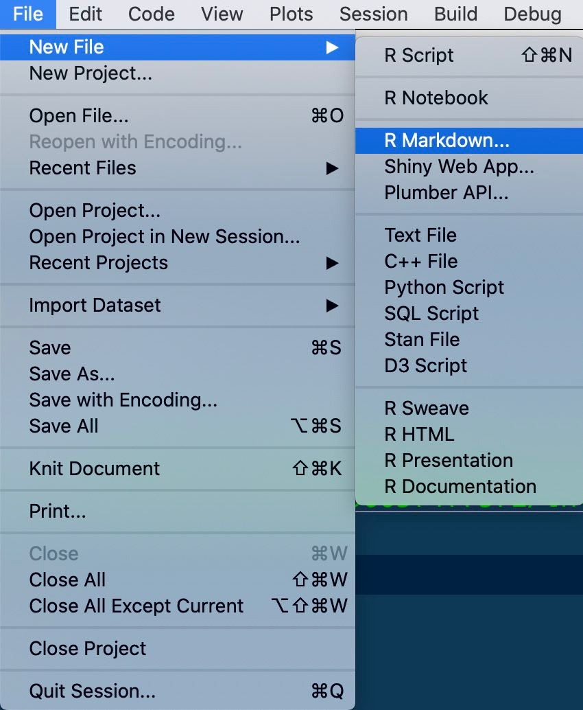
``` 


]

.pull-right[

Vamos a crear el **.bg-purple_light[primer fichero]** con extensión `.Rmd` (la extensión de los archivos R Markdown).

&nbsp;

Haz click en el botón `File << New File << R Markdown`.

]

---

# Creando nuestro .orange[PRIMER INFORME] 

.pull-left[

```{r echo = FALSE,  out.width = "80%", fig.align = "left", fig.cap = "Creando el primer fichero .rmd"}
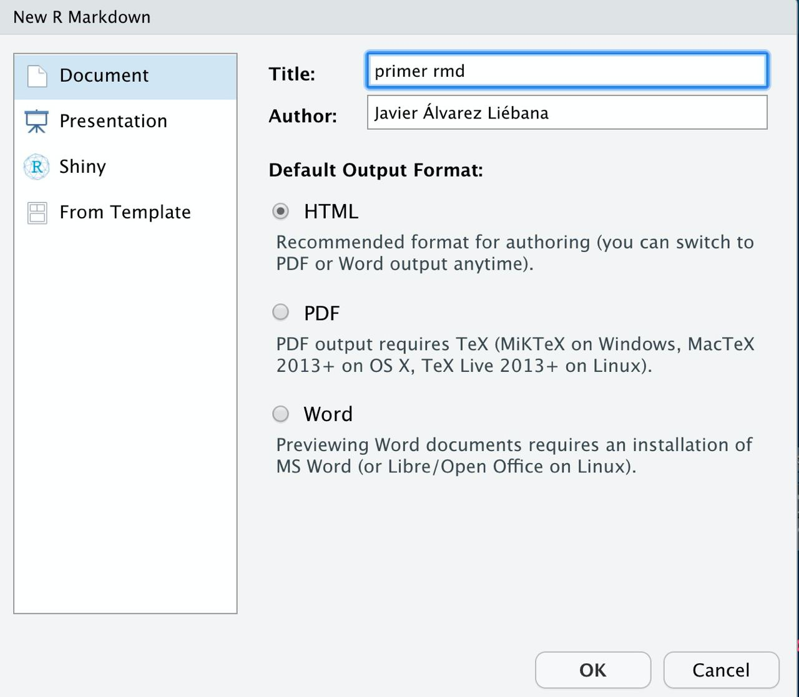
``` 


]

.pull-right[

Tras hacerlo, nos aparecerán **.bg-purple_light[varias opciones]**de formatos de salida:

* archivo `.pdf`

* archivo `.html` (**.bg-purple_light[recomendable]**): documento dinámico, permite la interacción con el usuario, como una «página web»)

* archivo `.doc` (nada recomendable)

De momento dejaremos marcado el **.bg-purple_light[formato HTML que viene por defecto]**, y escribiremos el título de nuestro documento. Tras ello tendremos nuestro archivo `.Rmd` (ya no es un script `.R` como los que hemos abierto hasta ahora)

]

---


# Creando nuestro .orange[PRIMER INFORME] 

Un fichero `.Rmd` se divide básicamente en **.bg-purple_light[tres partes]**

1. **.bg-purple_light[Cabecera]**: la parte que tienes al inicio entre `---`.

2.  **.bg-purple_light[Texto]**: que podremos formatear y mejorar con **negritas** (escrito como `**negritas**`, con doble astérisco al inicio y final), _cursivas_ (`_cursivas_`, con barra baja al inicio y final) o destacar nombres de funciones o variables de `R` (con ``R`). Recuerda que puedes añadir además ecuaciones como $x^2$ (he escrito `$x^2$`, la ecuación entre dólares).

3. **.bg-purple_light[Código R]**.

---

# .orange[PRIMER INFORME]: .green[CABECERA]


La cabecera están en formato `YAML`, y contiene los **.bg-purple_light[metadatos del documento]**: título, autor, fecha, estilos (si los tuviésemos), etc. Para probar, vamos a cambiar la cabecera que nos ha generado por defecto de la siguiente forma:

```{r eval = FALSE}
---
title: "Probando Probando"
author: "Señor/a X"
date: "11/7/2014"
output: html_document
---
```

Tras tunear nuestra cabecera borraremos todo lo que viene después para **.bg-purple_light[empezar desde cero]**.

```{r echo = FALSE,  out.width = "27%", fig.align = "left", fig.cap = "Fichero .Rmd vacío, solo con la cabecera"}
knitr::include_graphics("./img/rmd_vacio.jpg")
``` 

---

# .orange[PRIMER INFORME]: .green[TEXTO]

Solo hay una cosa **.bg-purple_light[importante]** a tener en cuenta en este entorno: salvo que indiquemos lo contrario, **.bg-purple_light[TODO lo que vamos a escribir en el documento es texto]**. No código R. Texto plano que podremos mejorar un poco con algun detalle, pero texto.

Vamos a empezar nuestro documento escribiendo por ejemplo la siguiente frase


```{r eval = FALSE}
Este material ha sido diseñado por el profesor Javier Álvarez Liébana,
docente en la Universidad Complutense de Madrid
```

---

# .orange[PRIMER INFORME]: .green[TEXTO]


.pull-left[

```{r echo = FALSE,  out.width = "99%", fig.align = "left", fig.cap = "Primer informe html"}
knitr::include_graphics("./img/html_con_texto.jpg")
``` 

]

.pull-right[

Una vez que hemos escrito el texto vamos a **.bg-purple_light[guardar el archivo .Rmd]** haciendo click en el botón `Guardar` (yo he llamado al archivo `primer_rmarkdown.Rmd`). Tras guardar el documento, **.bg-purple_light[«tejeremos» nuestro documento]** haciendo click en el botón `Knit`.

Al «tejer» se nos habrá generado (seguramente en una ventana al margen) un archivo .html, que podemos incluso **.bg-purple_light[abrir en nuestro navegador]**. Hemos creado nuestro primer informe, obviamente vacío de momento. 


]


---

# .orange[PRIMER INFORME]: .green[TEXTO]


.pull-left[

```{r echo = FALSE,  out.width = "99%", fig.align = "left", fig.cap = "Tuneando nuestro primer informe html"}
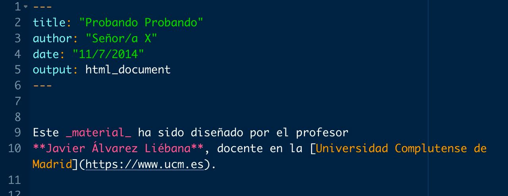
``` 

]

.pull-right[

Vamos a **.bg-purple_light[mejorar]** un poco el texto haciendo lo siguiente:

* Vamos a añadir **.bg-purple_light[negrita]** al nombre (poniendo `**` al inicio y al final).

* Vamos añadir _cursiva_ a la palabra `material` (poniendo `_` al inicio y al final).

*  Vamos añadir un enlace `https://www.ucm.es`, asociándolo al nombre de la Universidad. Para ello el título lo ponemos entre corchetes y justo detrás el enlace entre paréntesis `[«Universidad Complutense de Madrid»](https://www.ucm.es)`

]

---


# .orange[PRIMER INFORME]: .green[CHUNKS] de R

Para añadir **.bg-purple_light[código R]** debemos crear nuestras **.bg-purple_light[cajas de código]** llamadas **.bg-orange[chunks]**: altos en el camino en nuestro texto markdown donde podremos incluir **código**. Para incluir uno deberá de ir encabezado de la siguiente forma.

```{r echo = FALSE,  out.width = "90%", fig.align = "left", fig.cap = "Encabezado/final del chunk"}
knitr::include_graphics("./img/chunk_1.jpg")
``` 

---

# .orange[PRIMER INFORME]: .green[CHUNKS] de R


Dentro de dicha **.bg-purple_light[cajita]** (que tiene ahora **otro color** en el documento) escribiremos **.bg-purple_light[código R]**, como lo veníamos haciendo hasta ahora. Vamos por ejemplo a **.bg-purple_light[definir dos variables]** y su suma de la siguiente manera, escribiendo dicho código en nuestro `.Rmd` (dentro de ese chunk)

.pull-left[

```{r}
# Código R
x <- 1
y <- 2
x + y
```

]

.pull-right[

```{r echo = FALSE,  out.width = "99%", fig.align = "left", fig.cap = "Primer chunk con código"}
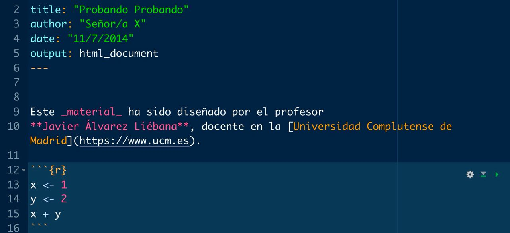
``` 

]

---

# .orange[PRIMER INFORME]: .green[CHUNKS] de R

.pull-left[

```{r}
# Código R
x <- 1
y <- 2
x + y
```

]

.pull-right[

```{r echo = FALSE,  out.width = "70%", fig.align = "left", fig.cap = "Primer chunk con código"}

``` 

]

Como ves dentro de esos _chunks_ puedes **.bg-purple_light[comentar código]** con `#` (ahora veremos que hace `#` fuera de esas cajas de código). Tras hacerlo tejemos de nuevo y obtenemos ahora un documento que tiene una caja de código y su salida.

```{r echo = FALSE,  out.width = "40%", fig.align = "left", fig.cap = "Salida del html con el primer chunk"}
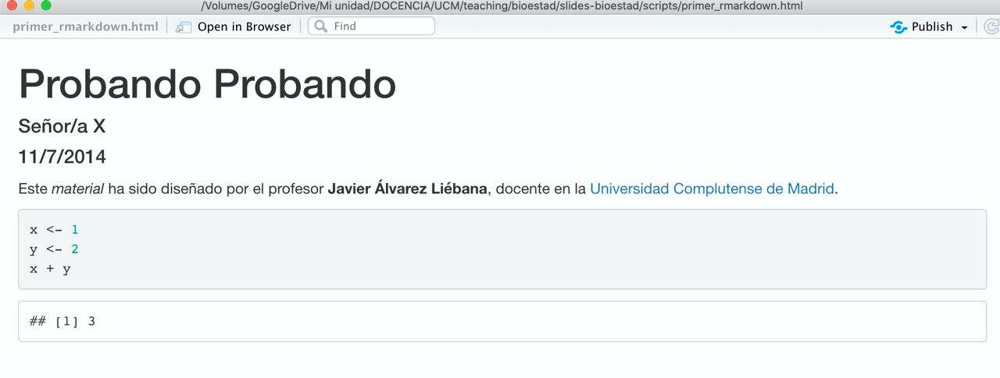
``` 


---

# .orange[PRIMER INFORME]: .green[CHUNKS] de R


Somos capaces de **.bg-purple_light[escribir en un mismo documento texto]** con cierto formato, **.bg-purple_light[código R y la salida]** del resultado, permitiéndonos generar informes (ya veremos como incluir gráficas). De hecho, lo más práctico para **.bg-purple_light[tomar apuntes de R]** es ir anotando en un archivo `.Rmd`.

Los chunks pueden tener un **.bg-purple_light[nombre o etiqueta]**, de forma que podamos referenciarlos de nuevo para no repetir código.

```{r echo = FALSE,  out.width = "40%", fig.align = "left", fig.cap = "Etiquetando un chunk y reciclándolo"}
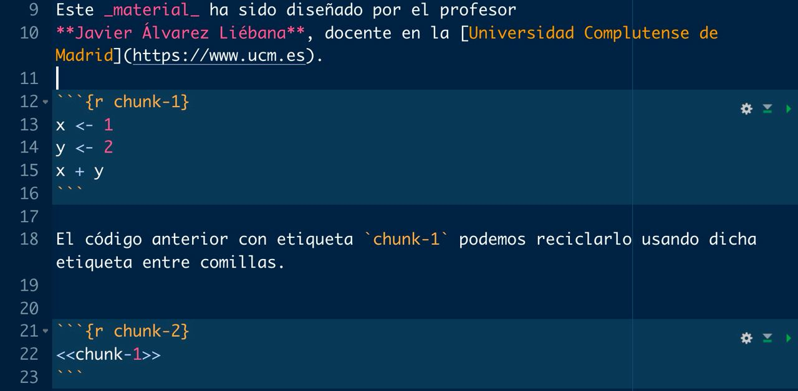
``` 


---

# .orange[PRIMER INFORME]: .green[ORGANIZANDO]

Con todo incluido en el documento podemos **.bg-purple_light[dividirlo en secciones y subsecciones]**. Para ello usaremos la sintaxis de markdown, poniendo **.bg-purple_light[almohadillas]**: una `#` para secciones, `##` para subsecciones, `###` para subsubsecciones, etc. Por ejemplo, vamos a

* Hacer una sección principal que sea `# Primer informe`
* Tras ello añadiremos la parte de texto.
* Creamos una subsección que se titule `## Chunks de código` donde incluiremos los dos chunks que tenemos hasta ahora.


.pull-left[

```{r echo = FALSE,  out.width = "80%", fig.align = "right", fig.cap = "Secciones en el rmd"}
knitr::include_graphics("./img/secciones_rmd.jpg")
``` 


]

.pull-right[

```{r echo = FALSE,  out.width = "80%", fig.align = "left", fig.cap = "Secciones en el html"}
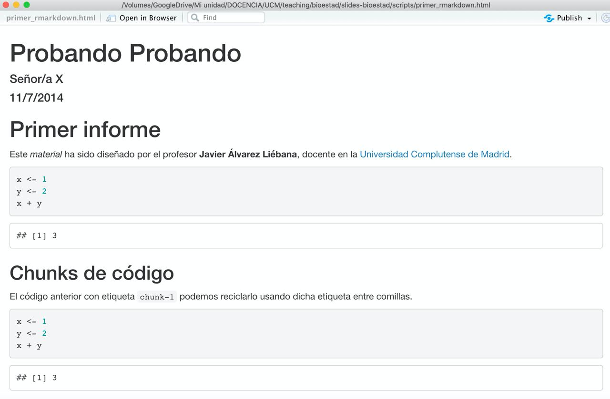
``` 


]

---


# .orange[PRIMER INFORME]: .green[ORGANIZANDO]

Además podemos incluir tras el título (y entre llaves `{}`) **.bg-purple_light[etiquetas]** (con `{#etiqueta}`) para luego **.bg-purple_light[referenciar dichas secciones]** en el documento.

.pull-left[

```{r echo = FALSE,  out.width = "75%", fig.align = "left", fig.cap = "Referencias a secciones y subsecciones"}
knitr::include_graphics("./img/ref_rmd.jpg")
``` 

]

.pull-right[

También podemos organizar nuestro código **.bg-purple_light[creando listas]**, usando `*` como ítems.

```{r echo = FALSE,  out.width = "85%", fig.align = "left", fig.cap = "Creando listas con ítems"}
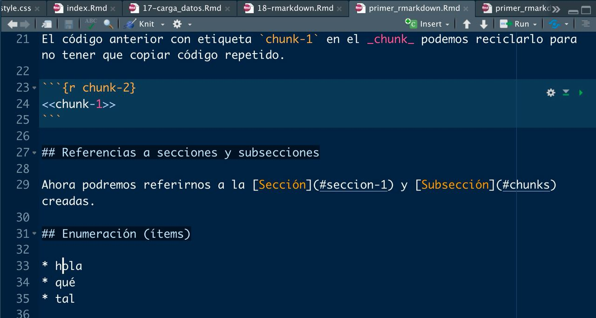
``` 

]

---

# .orange[PRIMER INFORME]: .green[PERSONALIZAR]

En cada chunk aparece una **.bg-purple_light[botón de play]**: pulsándolo podemos tener la **ejecución y salida** de cada chunk en nuestro `.Rmd`, sin tener que esperar a «tejer» (con Knit) todo el documento para ver lo que vamos ejecutando.


.pull-left[

```{r echo = FALSE,  out.width = "99%", fig.align = "left", fig.cap = "Pulsando al botón play"}
knitr::include_graphics("./img/play_chunk.jpg")
```

]

.pull-right[

```{r echo = FALSE,  out.width = "99%", fig.align = "left", fig.cap = "Chunk ejecutado in-line"}
knitr::include_graphics("./img/chunk_ejecutado.jpg")
```

]

---

# .orange[PRIMER INFORME]: .green[PERSONALIZAR]


Además podemos **.bg-purple_light[incluir código R dentro de la línea de texto]** (en lugar de mostrar el texto x ejecuta el código R mostrando la variable).


.pull-left[

```{r echo = FALSE,  out.width = "99%", fig.align = "left", fig.cap = "Código R inline"}
knitr::include_graphics("./img/codigo_inline_rmd.jpg")
```

]

.pull-right[

```{r echo = FALSE,  out.width = "99%", fig.align = "left", fig.cap = "Salida del código in-line"}
knitr::include_graphics("./img/codigo_inline_html.jpg")
```

]

---

# .orange[PRIMER INFORME]: .green[PERSONALIZAR]


Los chunk podemos **.bg-purple_light[personalizar su salida]** con algunas opciones, pasándolos como argumentos dentro de las llaves ({r etiqueta, ...}).

* `include = FALSE`: **.bg-green_light[ejecuta código]** pero **.bg-red_light[no se muestra (ni resultados)]** en la salida.

* `echo = FALSE`: **.bg-green_light[ejecuta código]** y se **.bg-green_light[muestra resultado]** pero **.bg-red_light[no el código]** en la salida.

* `eval = FALSE`: se **.bg-green_light[muestra el código]** pero **.bg-red_light[no se ejecuta]** en la salida final.

* `message = FALSE`: se **.bg-green_light[ejecuta el código]** pero **.bg-red_light[no se muestran mensajes]** de salida que tendríamos en consola.

* `warning = FALSE`: **.bg-green_light[ejecuta código]** pero **.bg-red_light[no se muestran warning]**.

* `error = TRUE`: se **.bg-green_light[ejecuta el código]** pero permite ejecutar el código **.bg-green_light[con errores]** mostrando los mensajes de error.
 
--

Estas opciones podemos aplicarlas chunk a chunk o fijar los parámetros de forma global con `knitr::opts_chunk$set()` (dentro de un chunk), pasándole como argumentos dichas opciones (por ejemplo, `knitr::opts_chunk$set(echo = FALSE)`).

---

# .orange[PRIMER INFORME]: .green[VARIABLES/ECUACIONES]

Por último en este primer documento vamos a añadir una subsección `## Variables y ecuaciones` donde añadiremos un chunk asignando la suma `x + y` a una variable `z`, escribiendo antes en texto el nombre de la variable y la **.bg-purple_light[fórmula]** ($z = x + y$ entre dólares).


.pull-left[

```{r echo = FALSE,  out.width = "90%", fig.align = "left", fig.cap = "Añadiendo variables en el .rmd"}
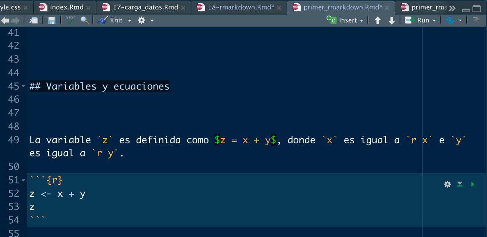
``` 

]

.pull-right[

```{r echo = FALSE,  out.width = "110%", fig.align = "left", fig.cap = "Añadiendo variables en el .rmd"}
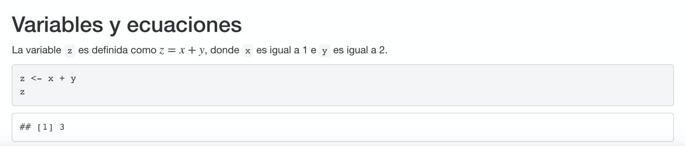
``` 

]


---

name: oms

# .orange[CASO PRÁCTICO]: datos de la OMS

Instala el paquete `{tidyr}` y usa el conjunto `who` contenido en él mismo (sobre casos de tuberculosis). Lee la ayuda `? who` para detalles de los datos.  

```{r}
# install.packages("tidyr")
library(tidyr)
who
```

---

class: inverse center middle
name: clase-4

# CLASE 4: introducción a la minería (SEMMA)

&nbsp;

### [Introducción al aprendizaje estadístico](#learning)

### [Sesgo vs varianza](#sesgo-varianza)

### [Introducción a la minería de datos (SEMMA)](#data-mining)

### [Muestreo (sample)](#sample)


---

name: learning

```{r echo = FALSE,  out.width = "80%", fig.align = "center"}

``` 


---

# .orange[CIENCIA DE DATOS]


**.bg-purple_light[¿Qué es la ciencia de datos]** ¿Qué incluye? La conocida como **.bg-purple_light[Data Science (Ciencia de Datos)]** es un campo muy extenso en el que, según algunos autores, se podría incluir (o intersecar con) campos como la **Minería de Datos**, el **Machine Learning** o el **Big Data**


```{r echo = FALSE,  out.width = "40%", fig.align = "center"}
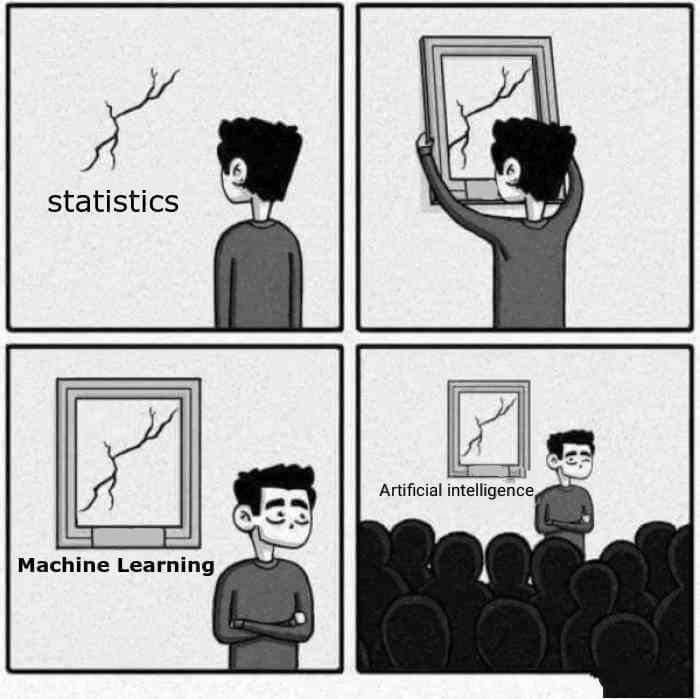
``` 

📚 Ver definiciones en **.bg-green_light[Fernández-Casal et al. (2021)]** en <https://rubenfcasal.github.io/aprendizaje_estadistico>

---

# .orange[APRENDIZAJE] estadístico

Uno de los conceptos clave es la idea de **.bg-purple_light[aprendizaje estadístico]**: formularemos modelos que buscan **.bg-purple_light[aprender]** de los datos (teniendo en cuenta la incertidumbre subyacente), mejorando los resultados si **.bg-purple_light[aumentamos la calidad de la información]** (!= aumentar su tamaño).

&nbsp;

--

En ese aprendizaje normalmente realizaremos una **.bg-purple_light[partición preliminar de los datos]**:

- **.bg-purple_light[Entrenamiento]**: conjunto del que modelo **.bg-orange[aprenderá para su construcción]** (por ej., 70%).

--

- **.bg-purple_light[Validación]**: conjunto que usaremos para **.bg-orange[evaluar nuestras decisiones]** (el modelo no ha podido aprender de él) y poder afinar los hiperparámetros (por ej., 20%).

--

- **.bg-purple_light[Test]**: conjunto final que nos proporcionará una **.bg-orange[evaluación insesgada]** (por ej., 10%).

📚 Ver explicación detallada en <https://mlu-explain.github.io/train-test-validation/>

---


# .orange[APRENDIZAJE] estadístico

.pull-left[

Veamos un ejemplo: imagina que queremos construir un método que nos permita **.bg-purple_light[clasificar]** si un animal es un **.bg-purple_light[gato o perro]** en función de dos variables: **suavidad** y **peso**.

En concreto el aprendizaje será **.bg-purple_light[supervisado]** (sé a priori en mi dataset cuál es gato o perro, veremos más adelante qué es el aprendizaje supervisado y el no supervisado).

]

.pull-right[

```{r echo = FALSE,  out.width = "85%", fig.align = "left"}
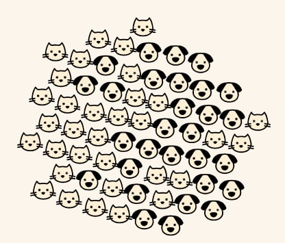
``` 

]

📚 Ver explicación en <https://mlu-explain.github.io/train-test-validation/>


---

# .orange[APRENDIZAJE] estadístico


```{r echo = FALSE,  out.width = "45%", fig.align = "center"}
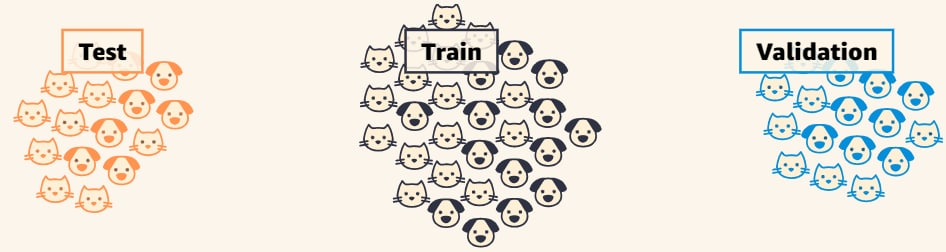
``` 

.pull-left[


- **.bg-orange[Conjunto train]**: datos que el **modelo conocerá** para **.bg-purple_light[aprender patrones]**, siendo lo más representativo de mi conjunto global (para evitar la propagación de sesgos)

]

.pull-right[

```{r echo = FALSE,  out.width = "55%", fig.align = "center"}
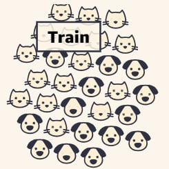
``` 

]

---

# .orange[APRENDIZAJE] estadístico

.pull-left[

El aprendizaje no solo dependerá de los datos, también de **.bg-purple_light[nuestras decisiones]**: cada decisión es un sesgo que acumulamos.

* un clasificador tonto (**.bg-green_light[dummy]**) que diga que todos son la moda (gatos)
* usar solo la variable suavidad
* usar solo la variable peso
* un clasificador que use ambas variables

**.bg-purple_light[¿Cuál elegir?]** Y si tuviéramos más variables, ¿con cuántas?

&nbsp;

**.bg-green_light[Clasificador dummy]**: asigna la moda (cuali)/media (cuanti) o bien un valor al azar, sin asumir patrón alguno en los datos.

]

.pull-right[


.pull-left[

```{r echo = FALSE,  out.width = "140%", fig.align = "center"}
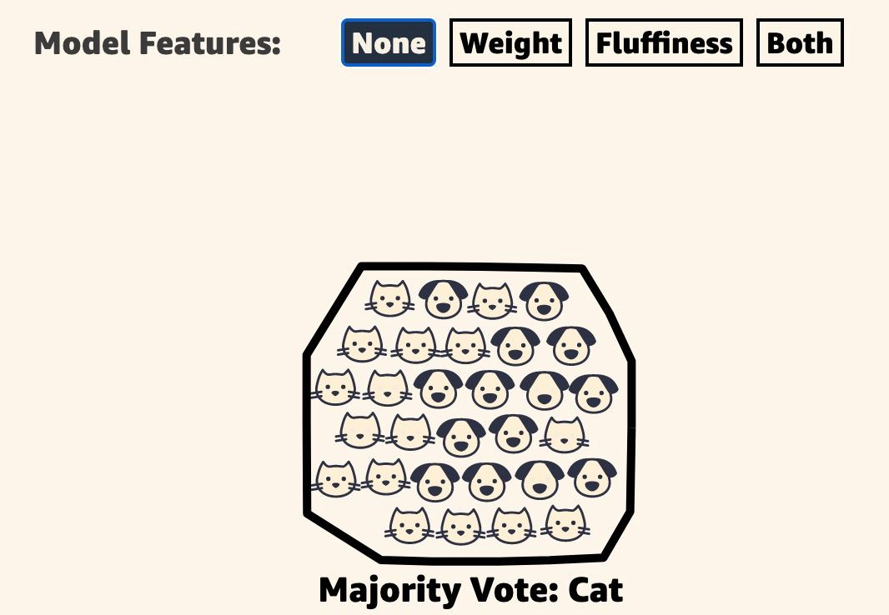
``` 

```{r echo = FALSE,  out.width = "140%", fig.align = "center"}
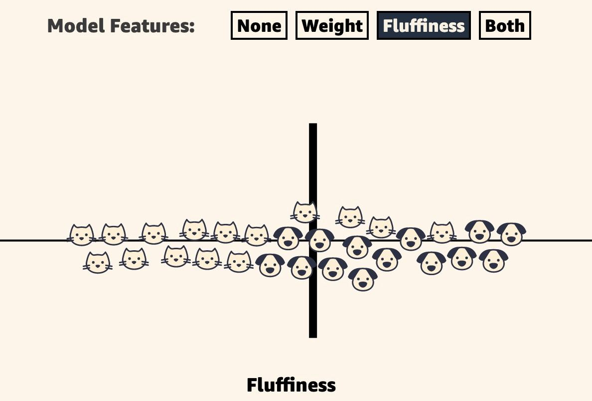
``` 

]

.pull-right[

```{r echo = FALSE,  out.width = "150%", fig.align = "center"}
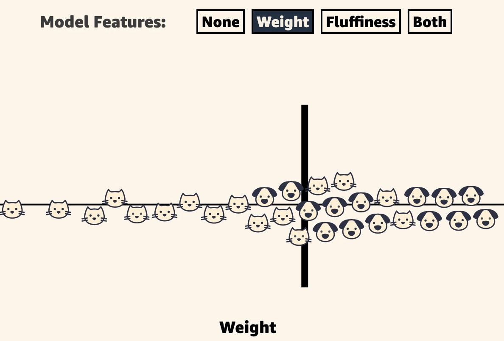
``` 

```{r echo = FALSE,  out.width = "150%", fig.align = "center"}
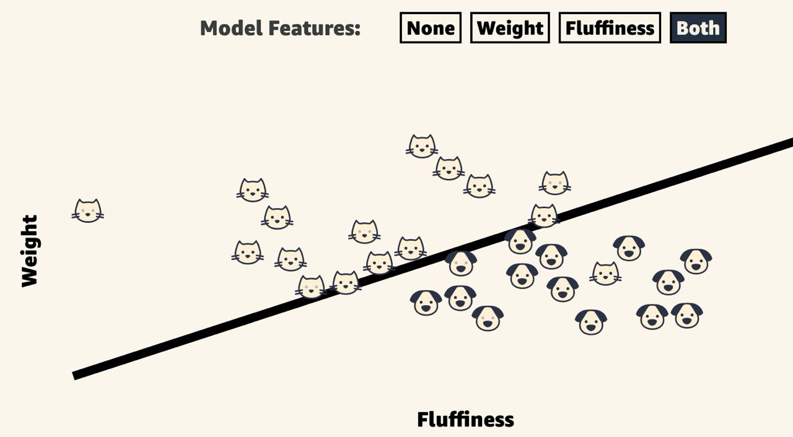
``` 

]

]

---

# .orange[APRENDIZAJE] estadístico


```{r echo = FALSE,  out.width = "45%", fig.align = "center"}

``` 


.pull-left[


- **.bg-orange[Conjunto validation]**: datos que el modelo **no ha conocido** para aprender pero que usaremos para **.bg-purple_light[afinar y calibrar nuestras decisiones]**, de forma que sea **.bg-purple_light[independiente del entrenamiento]**

]

.pull-right[

```{r echo = FALSE,  out.width = "99%", fig.align = "center"}
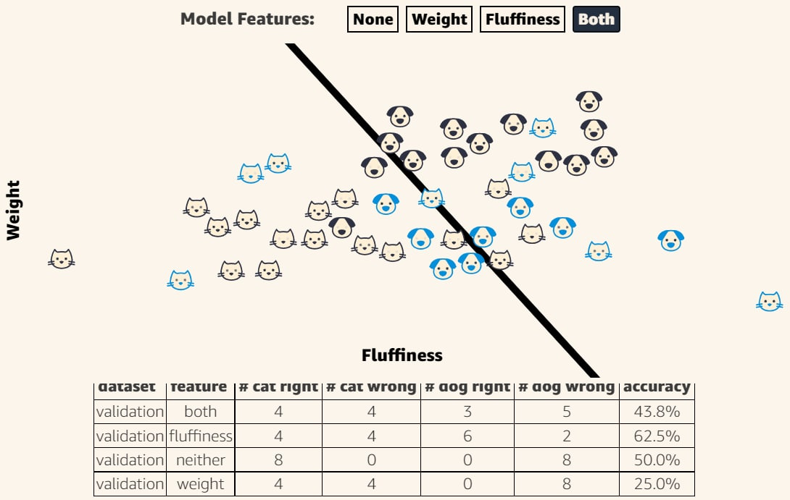
``` 

]

---

# .orange[APRENDIZAJE] estadístico


```{r echo = FALSE,  out.width = "45%", fig.align = "center"}

``` 


.pull-left[


- **.bg-orange[Conjunto test]**: datos que el **modelo no ha conocido**

❎ ni para aprender

❎ ni para afinar hiperparámetros/decisiones

Es un modelo que SOLO será usado para una **.bg-purple_light[evaluación final]** (insesgada): **.bg-red_light[NUNCA se usará en el proceso]**, solo cuando ya se ha terminado (simulando un cliente final).

]

.pull-right[

```{r echo = FALSE,  out.width = "99%", fig.align = "center"}
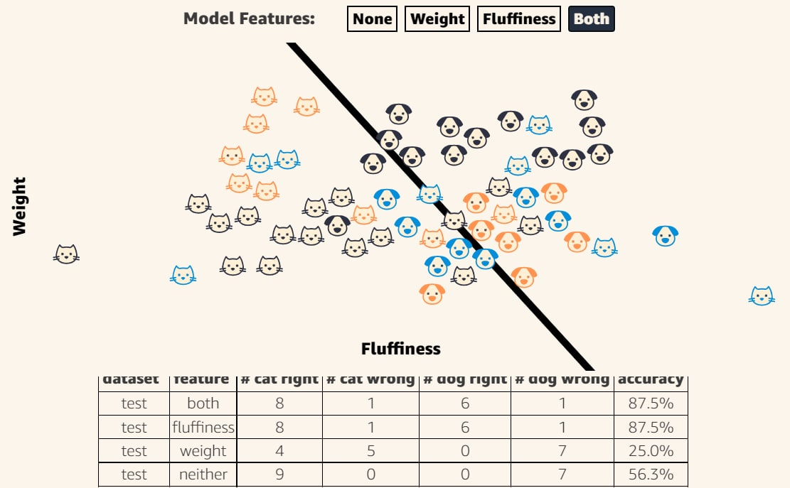
``` 

]


---

# .orange[APRENDIZAJE] estadístico


.pull-left[


Si te fijas en este ejemplo, la **.bg-purple_light[métrica (tasa de bien clasificados)]** es superior en el conjunto de test que en el conjunto de validación. **.bg-red_light[¿Es malo? ¿Extraño?]**

]

.pull-right[

```{r echo = FALSE,  out.width = "97%", fig.align = "center"}
knitr::include_graphics("./img/test_vs_validation.jpg")
``` 

]

--

No, no es ni malo ni extraño. Es más, es un síntoma de que el conjunto de test no está sesgado a ninguna otra de las particiones

**.bg-green_light[RECUERDA]**: el éxito del conjunto test **.bg-purple_light[NO es algo a optimizar]**, es simplemente una **.bg-purple_light[estimación de cómo funcionará]** nuestro modelo en datos reales.


---

name: sesgo-varianza

# Sobreajuste. .green[SESGO] vs .orange[VARIANZA]

En el campo del aprendizaje estadístico (y por tanto en la minería de datos) será recurrente un término a evitar: **.bg-purple_light[sobrejauste]**.


&nbsp;

📚 Ver bibliografía en 

* «The bias-variance tradeoff»: <https://mlu-explain.github.io/bias-variance/>

* «Understanding the bias-variance tradeoff»:  <https://towardsdatascience.com/understanding-the-bias-variance-tradeoff-165e6942b229>

* «Bias–variance tradeoff»: <https://daviddalpiaz.github.io/r4sl/biasvariance-tradeoff.html>

* «Understanding the Bias-Variance Tradeoff»: <https://scott.fortmann-roe.com/docs/BiasVariance.html>

---


# Sobreajuste. .green[SESGO] vs .orange[VARIANZA]


En el campo del aprendizaje estadístico (y por tanto en la minería de datos) será recurrente un término a evitar: **.bg-purple_light[sobrejauste]**.

```{r echo = FALSE,  out.width = "80%", fig.align = "center"}

``` 

---

# Sobreajuste. .green[SESGO] vs .orange[VARIANZA]

Imagina que tenemos los siguientes ingredientes

* **.bg-purple_light[Modelo real]** $f(X)$ donde $X$ serán los datos, con $\hat{f}(X)$ las estimaciones.

--

* **.bg-purple_light[Output real]** que llamaremos $Y = f(X) + \varepsilon$ ($\varepsilon$ será el **.bg-orange[ruido existente]**)

--

* **.bg-purple_light[Output estimada]** que llamaremos $\hat{Y}$, definido como $\hat{Y} = \hat{f}(X)$

--

* **.bg-purple_light[Error]** tras aplicar el modelo que llamaremos $E(x, f)$, y que podríamos definir como la **.bg-purple_light[media de las equivocaciones al cuadrado]**

--

$$Error := E(x, f) := {\rm E} \left[ \left(realidad - estimado\right)^2 \right] = {\rm E} \left[ \left(Y - \hat{Y}\right)^2 \right] = {\rm E}\left[\left(Y - \hat{f}(X)\right)^2  \right]$$

&nbsp;

--

¿Cómo podemos **.bg-purple_light[descomponer el error]**?

---


# Sobreajuste. .green[SESGO] vs .orange[VARIANZA]


* **Paso 1**: añadir y restar ${\rm E} \left[ \hat{Y} \right]$ dentro del paréntesis.

$$E(x, f) := {\rm E}\left[\left(Y - \hat{f}(X)\right)^2  \right] = {\rm E}\left[\left(\left(Y - {\rm E} \left[ \hat{Y} \right] \right) + \left( {\rm E} \left[ \hat{Y} \right] - \hat{f}(X)\right)^2 \right)  \right] $$

--

* **Paso 2**: resolver $(a-c+c-b)^2 = ((a-c)+(c-b))^2 = (a-c)^2 + (c-b)^2 - 2*(a-c)(c-b)$ 

$$E(x, f) := \left(Y - {\rm E} \left[ \hat{Y} \right] \right)^2  + {\rm E}\left[ \left( {\rm E} \left[ \hat{Y} \right] - \hat{f}(X)\right)^2 \right] + 2 {\rm E} \left[\left(Y - {\rm E} \left[ \hat{Y} \right] \right) \left( {\rm E} \left[ \hat{Y} \right] - \hat{f}(X)\right) \right] $$
--

* **Paso 3**: identificar términos

$$E(x, f) := {\rm E}\left[\left(Y - \hat{f}(X)\right)^2  \right] = sesgo^2 + varianza + ruido$$

---


# Sobreajuste. .green[SESGO] vs .orange[VARIANZA]


* **.bg-red_light[Sesgo (bias)]** será igual a $\left(Y - {\rm E} \left[ \hat{Y} \right] \right)^2$ (diferencia media entre la predicción media del modelo y el valor correcto a predecir).

--

* **.bg-green_light[Varianza (variance)]** será igual a ${\rm E}\left[ \left( {\rm E} \left[ \hat{Y} \right] - \hat{f}(X)\right)^2 \right]$ (la  dispersión/variación entre las predicción individuales y la predicción media).

--

* **.bg-orange[Ruido]**: error aleatorio **irreducible** $\varepsilon$ (la componente aleatoria del modelo no determinístico) de media nula.

--

&nbsp;

El **.bg-red_light[sesgo]** será por tanto lo que nos **.bg-red_light[equivocamos/desviamos de forma sistemática]** y la **.bg-green_light[varianza]** del modelo será la **.bg-green_light[dispersión entre las predicciones]** de un mismo valor, como si repitieramos el modelo con distintas muestras aleatorias obtenidas de la misma población. 

---

# Sobreajuste. .green[SESGO] vs .orange[VARIANZA]

```{r echo = FALSE,  out.width = "40%", fig.align = "center", fig.cap = "Extraída de https://scott.fortmann-roe.com/docs/BiasVariance.html"}
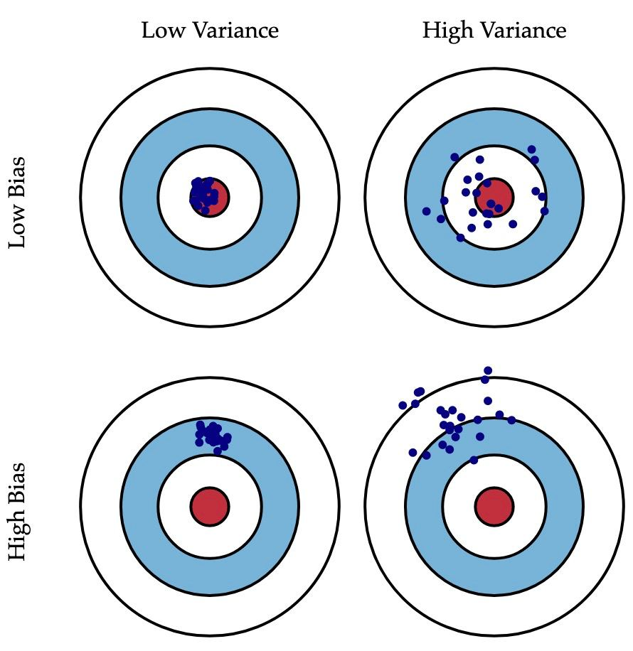
``` 

---

# Sobreajuste. .green[SESGO] vs .orange[VARIANZA]


.pull-left[

* **.bg-red_light[Bajoajuste (underfitting)]**: modelos **muy simples** proporcionan un **.bg-red_light[sesgo muy grande]**, y poca varianza ya que la predicción siempre será muy parecida (errores altos en train).

* **.bg-green_light[Sobreajuste (overfitting)]**: modelos **muy complicados**  proporcionan un **.bg-green_light[sesgo bajo]** pero al ser tan complejas proporcionarán una **.bg-green_light[mayor varianza]** para cada intento (errores altos en test).

]

.pull-right[

```{r echo = FALSE,  out.width = "99%", fig.align = "center", fig.cap = "Extraída de https://mlu-explain.github.io/bias-variance/"}
knitr::include_graphics("./img/bias_varianc_tradeoff.jpg")
``` 

Lo deseable será encontrar ese **.bg-purple_light[punto óptimo de equilibrio]** en el que el error será mínimo.

]

---

# Sobreajuste. .green[SESGO] vs .orange[VARIANZA]

.pull-left[

```{r echo = FALSE,  out.width = "99%", fig.align = "center", fig.cap = "Extraída de https://mlu-explain.github.io/bias-variance/"}
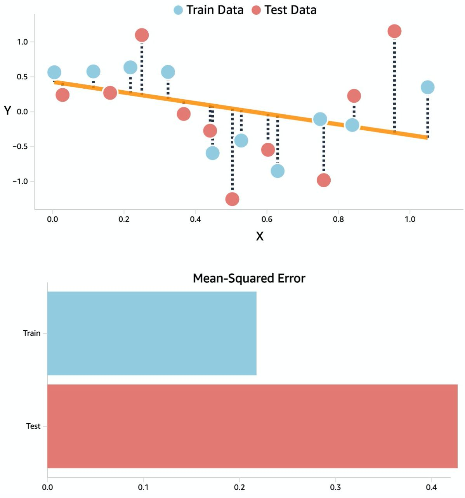
``` 

]

.pull-right[

```{r echo = FALSE,  out.width = "99%", fig.align = "center", fig.cap = "Extraída de https://mlu-explain.github.io/bias-variance/"}
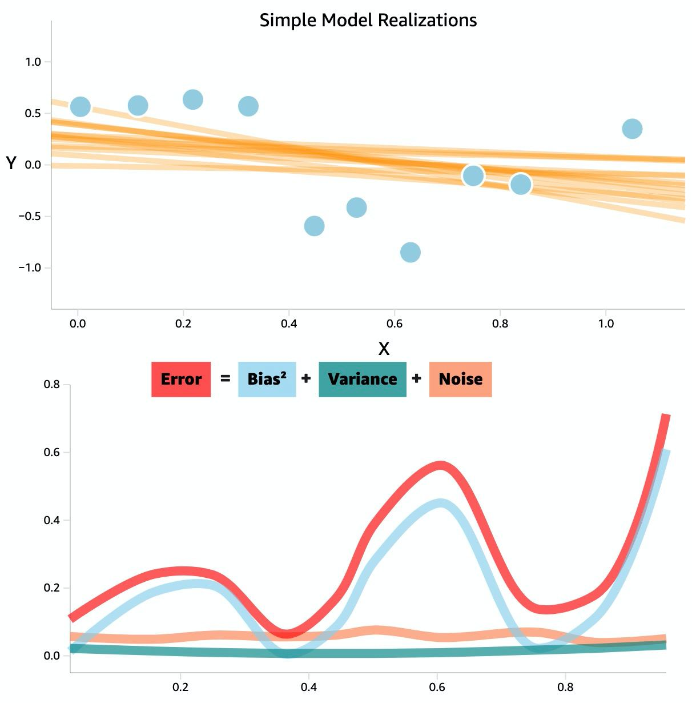
``` 

]

---

# Sobreajuste. .green[SESGO] vs .orange[VARIANZA]

.pull-left[

```{r echo = FALSE,  out.width = "99%", fig.align = "center", fig.cap = "Extraída de https://mlu-explain.github.io/bias-variance/"}
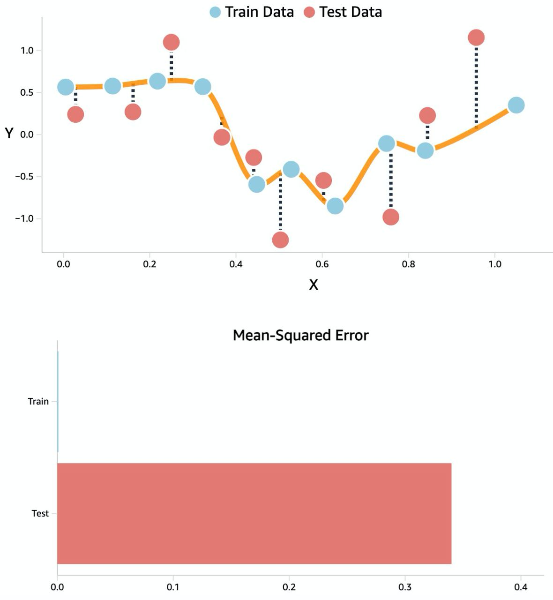
``` 

]

.pull-right[

```{r echo = FALSE,  out.width = "99%", fig.align = "center", fig.cap = "Extraída de https://mlu-explain.github.io/bias-variance/"}
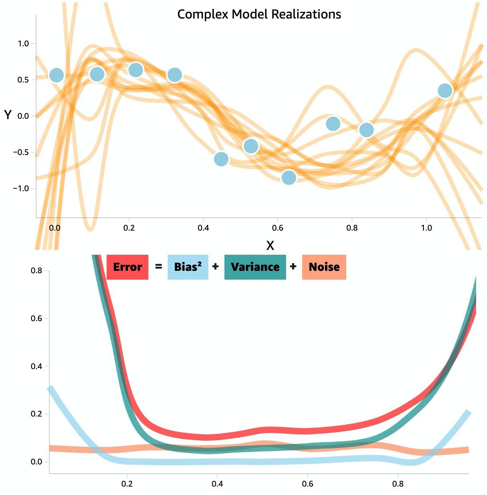
``` 

]


---

# Sobreajuste. .green[SESGO] vs .orange[VARIANZA]

```{r echo = FALSE,  out.width = "60%", fig.align = "center", fig.cap = "Extraída de https://365datascience.com/tutorials/machine-learning-tutorials/overfitting-underfitting/"}
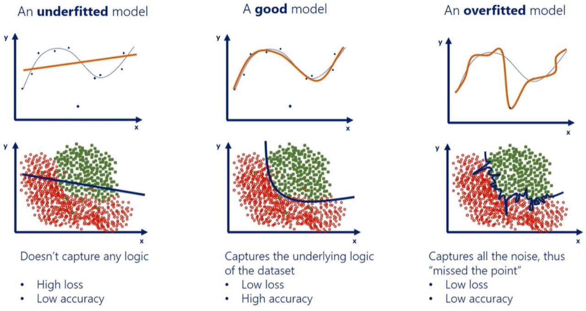
``` 

Un **.bg-purple_light[modelo muy simple no captura los patrones]** subyancetes en los datos mientras que un **.bg-purple_light[modelo muy complejo solo memoriza]**, no aprende.


---

# Sobreajuste. .green[SESGO] vs .orange[VARIANZA]

```{r echo = FALSE,  out.width = "45%", fig.align = "center"}
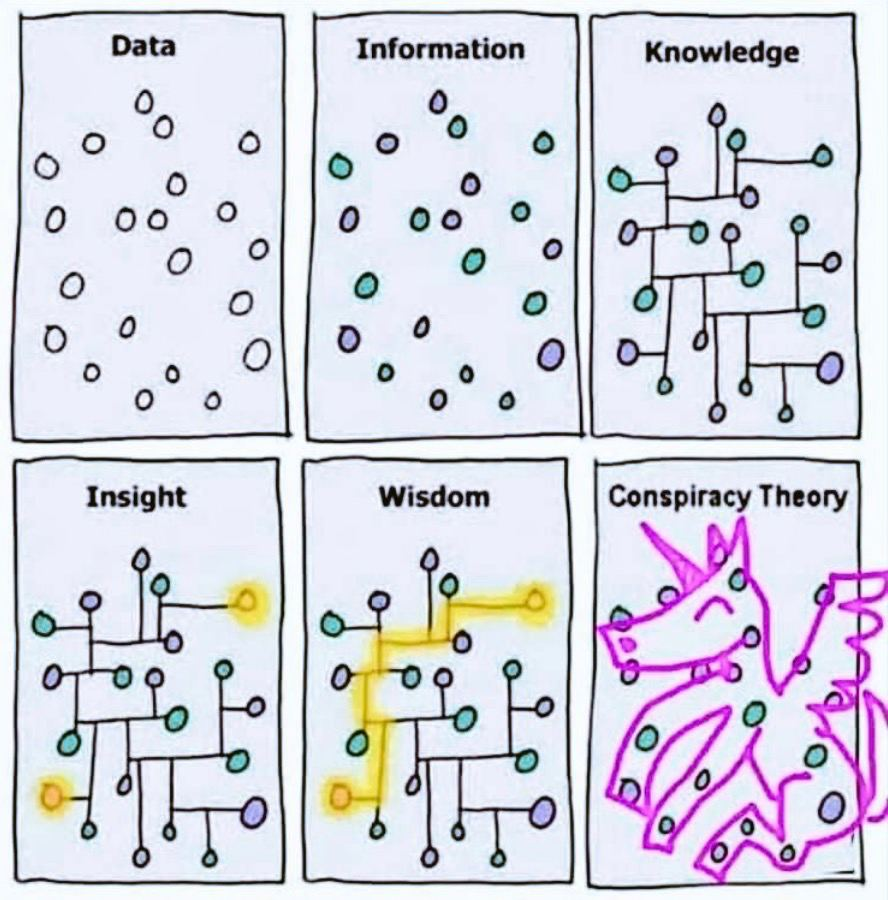
``` 

---

# .green[SUPERVISADO] vs .orange[NO SUPERVISADO]

```{r echo = FALSE,  out.width = "47%", fig.align = "center"}
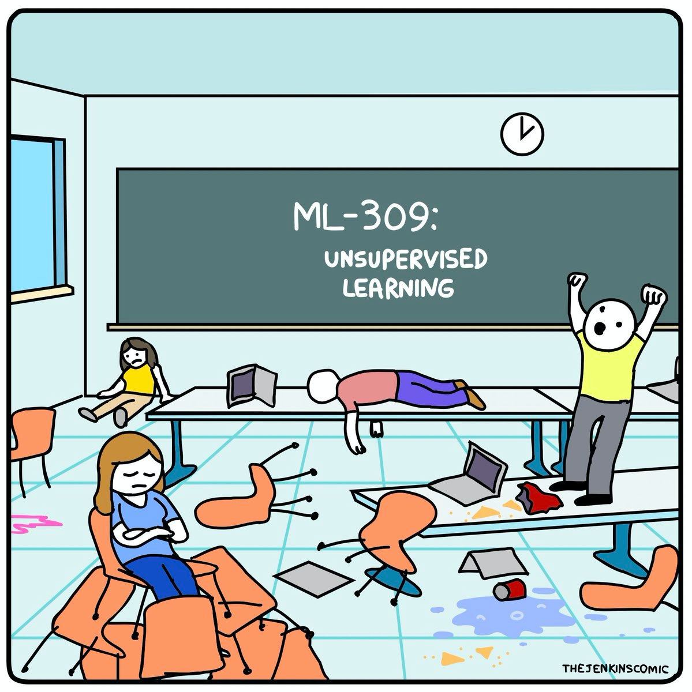
``` 


---

# .green[SUPERVISADO] vs .orange[NO SUPERVISADO]


.pull-left[

* **.bg-purple_light[Aprendizaje supervisado]**: tendremos dos tipos de variables, la **.bg-orange[variable dependiente (output/target)]** que se quiere predecir/clasificar (con su valor conocido en el conjunto de entrenamiento) y las **.bg-orange[variables independientes (inputs)]** o variables explicativas, que contienen la información disponible.

&nbsp;

Todo lo que veremos en esta asignatura entra dentro de la idea de **aprendizaje supervisado**

]


.pull-right[


```{r echo = FALSE,  out.width = "110%", fig.align = "center", fig.cap = "Extraída de https://realpython.com/knn-python/basics-of-machine-learning"}
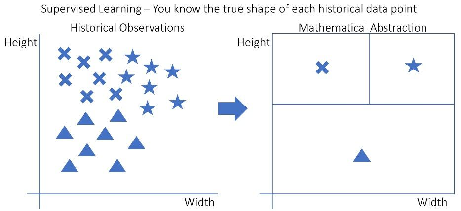
``` 


]

---

# .green[SUPERVISADO] vs .orange[NO SUPERVISADO]


.pull-left[


* **.bg-purple_light[Aprendizaje no supervisado]**: no existe la distinción entre target y variables explicativas ya que **.bg-orange[no tenemos etiquetados los datos]**, no sabemos a priori la respuesta correcta. El aprendizaje no supervisado buscará **.bg-orange[similitudes/diferencias]**.

]


.pull-right[

```{r echo = FALSE,  out.width = "110%", fig.align = "center", fig.cap = "Extraída de https://realpython.com/knn-python/basics-of-machine-learning"}
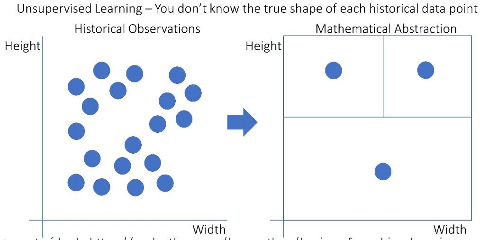
``` 


]


---

# .green[CLASIFICACIÓN] vs .orange[PREDICCIÓN]

Dos opciones dependiendo de la **.bg-purple_light[naturaleza de la variable objetivo]** (output/target):

* **.bg-purple_light[Predicción]**: la variable objetivo es una variable **.bg-purple_light[cuantitativa continua]** (por ejemplo, precio, glucosa, etc), y la etiqueta del conjunto de entrenamiento tomará un **valor continuo**, a partir de una (unidimensional) o varias variables (multidimensional).

* **.bg-purple_light[Clasificación]**: la variable objetivo es una variable **.bg-purple_light[cualitativa]** (por ejemplo, especie de flor, ausencia/presencia de enfermedad, si/no, etc) o **.bg-purple_light[cuantitativa discreta]** (por ejemplo, número de accidentes). La etiqueta tomará un valor dentro del conjunto de **modalidades permitidas**, pudiendo ser binaria (si/no) o multiclase (A, B, C, D).

&nbsp;

De aquí en adelante $Y$ será nuestra variable objetivo (cdentro de un rango o de un grupo de modalidades $G = \left\lbrace 1, 2, \ldots,k \right\rbrace$), y el conjunto $\left(X_1, \ldots, X_p \right)$ serán las variables predictoras.


📚 Ver «The elements of Statistical Learning» (Hastie et al., 2008): <https://github.com/dadosdelaplace/teaching/blob/main/data_mining/biblio/datamining_hastieetal_2008.pdf>


---

name: data-mining

# .orange[DATA MINING]: ¿qué es?

No hay una definición única o formal pero podemos ayudarnos de las definiciones dadas por algunos de los máximos gigantes tecnológicos.

--

Según **.bg-purple_light[IBM]**...

> La minería de datos es una forma innovadora de obtener información comercial valiosa mediante el análisis de los datos contenidos en la base de datos de la empresa (IBM)

--

&nbsp;

Según **.bg-purple_light[Microsoft]**...

> La minería de datos es el proceso de detectar información procesable de grandes conjuntos de datos para deducir los patrones y tendencias que existen. Normalmente,
estos patrones no se pueden detectar mediante la exploración tradicional de los datos
porque las relaciones son demasiado complejas o hay demasiados datos (Microsoft)

---

# .orange[DATA MINING]: ¿qué es?

.pull-left[

La minería de datos tiene como objetivo  **.bg-purple_light[descubrir patrones]** de forma automática o semiautomática, patrones que a simple vista (o con estadística básica) no podemos aflorar, bien por contar con **.bg-orange[grandes conjuntos de datos]**, bien por existir **.bg-green_light[relaciones muy complejas]**.

&nbsp;

No solo comprende la exploración y el modelado, sino también la **.bg-purple_light[evaluación]** y la **.bg-purple_light[transformación de la información]** para su uso posterior.

]

.pull-right[

```{r echo = FALSE,  out.width = "90%", fig.align = "left", fig.cap = "Extraída de https://www.masterdatascienceucm.com"}
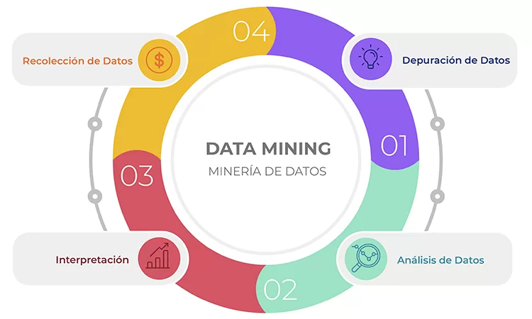
``` 


El **gran tamaño muestral** suele hacer inviable la aplicación de técnicas de inferencia clásica (problemas de potencia).

]

---

# .orange[DATA MINING]: ejemplos de uso


* **.bg-purple_light[Clasificación de vuelos]**: usando, entre otras, variables de tráfico de aereo, tipología de vuelo, variables meteorológicas, las aerolíneas pueden calcular la probabilidad de retraso en un vuelo.

* **.bg-purple_light[Marketing y ventas]**: conocer el perfil de público objetivo para enfocar campañas personalizadas, en función de patrones en su comportamiento, y predecir futuras bajas.

* **.bg-purple_light[Minería de textos]**: extracción de patrones en textos para clasificar, por ejemplo, noticias (detección de Fake News).

* **.bg-purple_light[Supermercados]**: pueden analizar el conjunto de compras masivas que hacen sus clientes, para identificar asociaciones de productos o las ofertas que mejor han funcionado.

* **.bg-purple_light[Predicción de enfermedades]**: haciendo uso de diferente variables médicas y de hábitos de salud se puede predecir la probabilidad de aparición de ciertas enfermedades, así como encontrar factores explicativos que nos puedan ayudar a su prevención.


---

# Metodología .orange[SEMMA]

Existen distintas metodologías/esquemas dentro de la minería de datos como la CRISP-DM (desarrollada por IBM) la
**.bg-purple_light[metodología SEMMA]** (desarrollada por SAS), que usaremos parcialmente en esta asignatura. En esta metodología SEMMA no siempre intervienen todas las fases del proceso y, además, las fases pueden repetirse y el
orden de las mismas modificarse.

.pull-left[


* **.bg-purple_light[SAMPLE (muestreo)]**: amén de las particiones train-validate-train, si la base de datos es demasiado grande, será necesario tomar una **.bg-purple_light[submuestra representativa]** para poder ser procesada computacionalmente.

]

.pull-right[

```{r echo = FALSE,  out.width = "82%", fig.align = "left"}
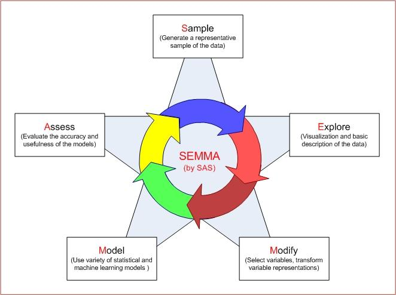
``` 

]

---

# Metodología .orange[SEMMA]

En esta metodología SEMMA no siempre intervienen todas las fases del proceso y, además, las fases pueden repetirse y el
orden de las mismas modificarse.

.pull-left[


* **.bg-purple_light[EXPLORE (explorar)]**: antes de tomar decisiones deberemos **.bg-purple_light[explorar, visualizar y entender]** los datos que tenemos, para poder detectar posibles tendencias, inconsistencias, datos ausentes o anomalías.

]

.pull-right[

```{r echo = FALSE,  out.width = "95%", fig.align = "left"}

``` 

]

---

# Metodología .orange[SEMMA]

En esta metodología SEMMA no siempre intervienen todas las fases del proceso y, además, las fases pueden repetirse y el
orden de las mismas modificarse.

.pull-left[

* **.bg-purple_light[MODIFY (modificar)]**: para preparar los datos de forma adecuada a los modelos, a veces es necesario realizar una **.bg-purple_light[transformación]** previa de los mismos.

]

.pull-right[

```{r echo = FALSE,  out.width = "95%", fig.align = "left"}

``` 

]

---

# Metodología .orange[SEMMA]


En esta metodología SEMMA no siempre intervienen todas las fases del proceso y, además, las fases pueden repetirse y el
orden de las mismas modificarse.

.pull-left[

* **.bg-purple_light[MODEL (modelizar)]**: aplicación de los **.bg-purple_light[modelos y técnicas estadísticas]** en el conjunto del entrenamiento para predecir la variable objetivo (regresión, knn, árboles de decisión, redes neuronales, etc).

]

.pull-right[

```{r echo = FALSE,  out.width = "95%", fig.align = "left"}

``` 

]

---

# Metodología .orange[SEMMA]


En esta metodología SEMMA no siempre intervienen todas las fases del proceso y, además, las fases pueden repetirse y el
orden de las mismas modificarse.

.pull-left[

* **.bg-purple_light[ASSESS (evaluar)]**: comprobar y **.bg-purple_light[evaluar nuestras decisiones]** para decidir los mejores parámetros haciendo uso del conjunto de validación. Es habitual tener que volver a la fase de modelización, para plantear correcciones en el modelado. Finalmente, al final del camino, se proveerá de la calidad del modelo en el conjunto test.

]

.pull-right[

```{r echo = FALSE,  out.width = "95%", fig.align = "left"}

``` 

]


---

name: sample

# Primera fase SEMMA: .orange[MUESTREO]

Como hemos comentado, **.bg-purple_light[ANTES]** de las posibles particiones train-validación-test que necesitemos, si la base de datos es **.bg-purple_light[demasiado grande]**, será necesario tomar una **.bg-purple_light[submuestra]** (representativa) para poder ser procesada de forma eficiente.

--

.pull-left[

* **.bg-purple_light[No aleatorio]** (por cuotas) en base a **.bg-orange[condiciones]** sobre los registros (`filter()`)

* **.bg-purple_light[No aleatorio]** (intencional/discreccional) en base a **.bg-orange[posición]** (`slice`)

* **.bg-purple_light[Aleatorio]** **.bg-orange[simple]**  (`slice_sample()`)

* **.bg-purple_light[Aleatorio]** **.bg-orange[estratificado]** (`group_by()` + `slice_sample()`)

]

.pull-right[

```{r echo = FALSE,  out.width = "99%", fig.align = "left"}
knitr::include_graphics("./img/sample.jpg")
``` 


]

📚 Ver otros tipos de muestreo <https://www.unir.net/ingenieria/revista/tipos-de-muestreo/>

---

# Introducción a .orange[TIDYVERSE]


.pull-left[

```{r echo = FALSE,  out.width = "89%", fig.align = "center"}
knitr::include_graphics("./img/tidyverrse_universe.jpg")
``` 

También tenemos los paquetes `{purrr}` y `{lubridate}` para el manejo de **listas** y **fechas**, `{readxl}` para importar archivos **.xls y .xlsx**, `{haven}` para importar archivos **SPSS, Stata y SAS**, `{httr}` para importar **desde web** y `{rvest}` para **web scraping**.


]

.pull-right[

* `{tibble}`: **.bg-purple_light[optimizando data.frame]**.

* `{tidyr}`: **.bg-purple_light[limpiar datos]**.

* `{readr}`: **.bg-purple_light[carga rápida]** de datos rectangulares (formatos .csv, .tsv, etc). 

* `{dplyr}`: gramática para **.bg-purple_light[depuración de datos]** para facilitar su procesamiento.

* `{stringr}`: manejo de **.bg-purple_light[textos]**. 

* `{forcast}` manejo de **.bg-purple_light[cualitativas]**.

* `{ggplot2}`: una gramática para la **.bg-purple_light[visualización de datos]**.

* `{tidymodels}`: una gramática para la **.bg-purple_light[modelización y predicción]**.


]


Puedes ver su **documentación completa** en <https://www.tidyverse.org/>.


---

# Introducción a .orange[TIDYVERSE]


```{r dplyr, echo = FALSE,  out.width = "60%", fig.align = "center", fig.cap = "Cheet sheet de las opciones del paquete dplyr"}
knitr::include_graphics("./img/dplyr.png")
``` 

El paquete vamos a usar para **.bg-purple_light[depurar y muestrear los datos]** será el paquete `{dplyr}`, una gramática para la manipulación de datos.

---

# No aleatorio por condiciones: .orange[FILTER]

El conocido como **.bg-purple_light[muestreo no aleatorio por cuotas]** se basa en seleccionar (filtrar) individuos (registros) concretos que cumplan condiciones concretas.

.pull-left[

```{r eval = FALSE}
datos %>%
  filtro(condicion)
```

]

.pull-right[

```{r eval = FALSE}
starwars %>%
  filter(condicion)
```

]


--

Comparadores habituales:

* `==, !=` igual/distinto que
* `>, <` mayor/menor que
* `>=, <=` mayor/menor o igual que
* `%in%` los valores pertenecen a un listado
* `!is.na()` los valores no son ausentes (mejor usar `drop_na()`)
* `between(variable, val1, val2)`: si los valores (normalmente continuos) están dentro de un rango.

---

# No aleatorio por condiciones: .orange[FILTER]

.pull-left[

```{r eval = FALSE}
datos %>%
  filtro(condicion)
```

]

.pull-right[

```{r eval = FALSE}
starwars %>%
  filter(condicion)
```

]

&nbsp;

```{r echo = FALSE,  out.width = "80%", fig.align = "center", fig.cap = "Tablas de verdad de operadores lógicos"}
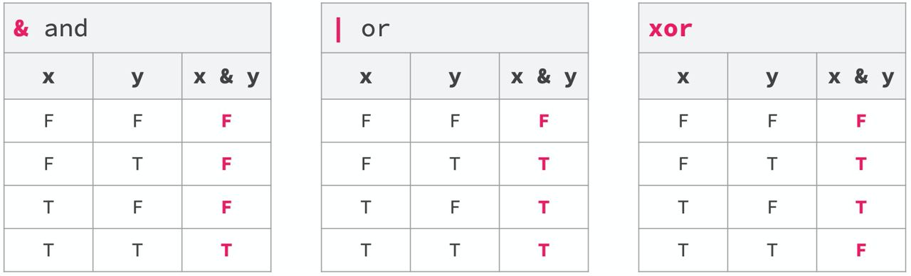
``` 

---

# No aleatorio por condiciones: .orange[FILTER]

Dicha función `filter()` también la usaremos cuando queramos **.bg-purple_light[depurar los datos]** en nuestra fase exploratoria.

.pull-left[

```{r eval = FALSE}
datos %>%
  filtro(condicion)
```

]

.pull-right[

```{r eval = FALSE}
starwars %>%
  filter(condicion)
```

]

--

Por ejemplo, vamos a **filtrar** aquellos personajes con **.bg-purple_light[ojos marrones]**.

```{r}
starwars %>%
  filter(eye_color == "brown") #<<
```

---

# .orange[VISUALIZAR] operaciones con datos


En la web <https://tidydatatutor.com/> podemos visualizar el flujo de datos d las transformaciones que podemos hacer con `dplyr`

```{r filter1, echo = FALSE,  out.width = "90%", fig.align = "center", fig.cap = "Flujo de https://tidydatatutor.com/"}
knitr::include_graphics("./img/filter1.jpg")
``` 

]

---

# No aleatorio por condiciones: .orange[FILTER]


De la misma manera podemos **filtrar** los personajes que **.bg-purple_light[no tienen ojos marrones]** (en realidad estamos eliminando filas de alguna manera).


```{r}
starwars %>% filter(eye_color != "brown")
```

---

# No aleatorio por condiciones: .orange[FILTER]

Al ser una variable discreta, sería bastante lógico comprobar si toma algún valor **.bg-purple_light[dentro de una lista permitida]**  (por ejemplo, personjes con ojos marrones o azules).


```{r}
starwars %>% filter(eye_color %in% c("brown", "blue"))
```

---

# No aleatorio por condiciones: .orange[FILTER]

Cuando es una variable continua el interés podría estar en comprobar si la variable toma valores **.bg-purple_light[dentro de un intervalo continuo]**.


.pull-left[

```{r eval = FALSE}
starwars %>%
  filter(between(height, 120, 160))
```

```{r echo = FALSE}
# con estatura entre 120 y 160 cm
starwars %>%
  select(name, height, mass, eye_color) %>%
  filter(between(height, 120, 160)) %>%
  slice(1:5)
```

]

.pull-right[

```{r filter3, echo = FALSE,  out.width = "160%", fig.align = "center", fig.cap = "Flujo de https://tidydatatutor.com/"}
knitr::include_graphics("./img/filter3.jpg")
``` 

]


---


# No aleatorio por condiciones: .orange[FILTER]


Las condiciones también se pueden **.bg-purple_light[concatenar]**, pudiendo en pocas líneas realizar un filtro complejo. Por ejemplo, podemos filtrar los personajes con **.bg-purple_light[ojos marrones Y ADEMÁS NO humanos]**, o **.bg-purple_light[con más de 60 años]**.

.pull-left[

```{r eval = FALSE}
starwars %>%
  filter((eye_color == "brown" &
            species != "Human") |
           birth_year > 60)
```

]

.pull-right[

```{r filter5, echo = FALSE,  out.width = "100%", fig.align = "center", fig.cap = "Flujo de https://tidydatatutor.com/"}
knitr::include_graphics("./img/filter5.jpg")
``` 


]

---

# Ejercicios (filter)

.panelset[
.panel[.panel-name[Ejercicios]


* 📝 **Ejercicio 1**: selecciona del conjunto de `starwars` solo los personajes que sean humanos (`species == "Human"`)

* 📝 **Ejercicio 2**: selecciona del conjunto de `starwars` solo los personajes cuyo peso esté entre 65 y 90 kg.

* 📝 **Ejercicio 3**: selecciona del conjunto de `starwars` los personajes con ojos marrones o rojos.

* 📝 **Ejercicio 4**: selecciona del conjunto de `starwars` los personajes no humanos, hombres y que midan más de 170 cm, o los personajes con ojos marrones o rojos.

* 📝 **Ejercicio 5**: selecciona aquellos personajes de `starwars` que hayan pilotado más de 2 naves.

]

.panel[.panel-name[Sol. Ej. 1]

```{r}
starwars %>%
  filter(species == "Human")
```

]

.panel[.panel-name[Sol. Ej. 2]

```{r}
starwars %>%
  filter(between(mass, 65, 90))
```

]

.panel[.panel-name[Sol. Ej. 3]

```{r}
starwars %>%
  filter(eye_color %in% c("brown", "red"))
```

]

.panel[.panel-name[Sol. Ej. 4]

```{r}
starwars %>%
  filter((species != "Human" & sex == "Male" & height > 170) |
           eye_color %in% c("brown", "red"))
```

]

.panel[.panel-name[Sol. Ej. 5]

```{r}
library(purrr) # ya está en tidyverse per por si
starwars$n_starships <- starwars$starships %>% map_int(length)
starwars %>% filter(n_starships > 2)
```

```{r echo = FALSE}
starwars <- dplyr::starwars
```

]

]

---

# Ejercicio extra


Veamos un ejercicio extra para comprobar la **potencia y flexibilidad** de `{tidyverse}`, pudiendo hacer muchas cosas en dos líneas de código.

&nbsp;

* 📝 **Ejercicio extra**: selecciona aquellos personajes de `starwars` que hayan salido en la película de la saga "El ataque de los clones" (en inglés, "Attack of the Clones"). Busca información de la función `str_detect()` del paquete `stringr`. Consejo: prueba antes las funciones que vayas a usar con algún vector de prueba para poder comprobar su funcionamiento.

---


# No aleatorio por posición: .orange[SLICE]

El conocido como **.bg-purple_light[muestreo no aleatorio intencional o discreccional]** se basa en seleccionar (filtrar) individuos (registros) concretos por su posición, elementos «a dedo».

.pull-left[

```{r eval = FALSE}
datos %>%
  rebanada(posicion)
```

]

.pull-right[

```{r eval = FALSE}
starwars %>%
  slice(posicion)
```

]

--

Normalmente filtraremos registros por alguna condición pero a veces nos puede interesar, por ejemplo, sacar las primeras n filas. Para podemos crear **.bg-purple_light[rebanadas de los datos]**, seleccionando filas por su posición con `slice()`.

```{r}
starwars %>% slice(1) #<<
```

---

# No aleatorio por posición: .orange[SLICE]

.pull-left[

```{r eval = FALSE}
datos %>%
  rebanada(posicion)
```

]

.pull-right[

```{r eval = FALSE}
starwars %>%
  slice(posicion)
```

]


Recuerda que todo lo que podemos hacer con un número (vector de longitud 1) podemos hacerlo con un vector de índices, así que podemos **.bg-purple_light[extraer varias rebanadas]**, a la vez.

```{r}
# filas de la 1 a la 5
starwars %>% slice(1:5)
```

---

# No aleatorio por posición: .orange[SLICE]

También podríamos usar una **.bg-purple_light[secuencia de índices]** a extraer.

```{r}
# filas 1, 2, 10, 13, 27
starwars %>% slice(c(1, 2, 10, 13, 27))
```


---

# No aleatorio por posición: .orange[SLICE]


Disponemos además de opciones por defecto de operaciones habituales

* `slice_head(n = ...)`: extraer las n **.bg-purple_light[primeras filas]**.


```{r}
# las 2 primeras filas
starwars %>% slice_head(n = 2)
```

---


# No aleatorio por posición: .orange[SLICE]

* `slice_tail(n = ...)`: extraer las n **.bg-purple_light[últimas filas]**.

```{r}
# los 3 últimas filas
starwars %>% slice_tail(n = 3) 
```

---

# No aleatorio por posición: .orange[SLICE]


* `slice_min(var, n = ...)` y `slice_max(var, n = ...)`: extrae las n filas con **.bg-purple_light[menor/mayor de una variable]** (si hay empate, mostrará todas salvo que `with_ties = FALSE`). 

.pull-left[

```{r eval = FALSE}
# los 3 más bajitos
starwars %>% slice_min(height, n = 3) 
```

```{r echo = FALSE}
# los 3 más bajitos
starwars %>% slice_min(height, n = 3) %>% select(name:hair_color)
```

]

.pull-right[

```{r eval = FALSE}
# los 3 más pesados
starwars %>% slice_max(mass, n = 3) 
```

```{r echo = FALSE}
# los 3 más pesados
starwars %>% slice_max(mass, n = 3) %>% select(name:hair_color)
```

]

---

# Ejercicios (slice)

.panelset[
.panel[.panel-name[Ejercicios]


* 📝 **Ejercicio 1**: selecciona solo los personajes que sean humanos y de ojos marrones.

* 📝 **Ejercicio 2**: selecciona los 3 personajes más mayores.

* 📝 **Ejercicio 3**: selecciona los 5 personajes más bajitos.


]

.panel[.panel-name[Sol. Ej. 1]

```{r}
# Podemos combinar varias acciones en pocas líneas
starwars %>%
  filter(eye_color == "brown",
         species == "Human")
```

]

.panel[.panel-name[Sol. Ej. 2]


```{r}
starwars %>%
  slice_max(birth_year, n = 3)
```

]

.panel[.panel-name[Sol. Ej. 3]


```{r}
starwars %>%
  slice_min(height, n = 5)
```
]

]

---

# Ejercicio extra


Veamos un ejercicio extra para comprobar la **potencia y flexibilidad** de `{tidyverse}`, pudiendo hacer muchas cosas en dos líneas de código.

&nbsp;

* 📝 **Ejercicio extra**: de los personajes que son humanos y miden más de 160 cm, selecciona los 5 más altos, y orden de mayor a menor peso. Devuelve la tabla.


---


# Aleatorio simple: .orange[SLICE_SAMPLE]

El conocido como **.bg-purple_light[muestreo aleatorio simple]** se basa en seleccionar individuos aleatoriamente, de forma que cada uno tenga las mismas probabilidades de ser seleccionado.

.pull-left[

```{r eval = FALSE}
datos %>%
  rebanada_aleatoria(n, probabilidades)
```

]

.pull-right[

```{r eval = FALSE}
starwars %>%
  slice_sample(n = ..., weight_by = ..., replace = ...)
```

]

--

Con`slice_sample(n = ...)` podemos extraer n **.bg-purple_light[registros aleatoriamente]** (a priori equiprobables).


```{r}
# 3 registros aleatorios
starwars %>% slice_sample(n = 3)
```

---

# Aleatorio simple: .orange[SLICE_SAMPLE]

También podremos indicarle la **.bg-purple_light[proporción]** de datos a samplear (en lugar del número) y si queremos que sea con **.bg-purple_light[reemplazamiento]** (que se puedan repetir).

```{r}
# 5% de registros aleatorios
starwars %>% slice_sample(prop = 0.05, replace = TRUE)
```

---

# Aleatorio simple: .orange[SLICE_SAMPLE]

En `slice_sample()` podemos pasar un **.bg-purple_light[vector de probabilidades]** (no equiprobable). Vamos a forzar que sea muy improbable sacar una fila que no sean las dos primeras

```{r eval = FALSE}
starwars %>% slice_sample(n = 2, weight_by = c(0.495, 0.495, rep(0.01/85, 85)))
```

```{r echo = FALSE}
starwars %>% slice_sample(n = 2, weight_by = c(0.495, 0.495, rep(0.01/85, 85))) %>% select(name:gender)
```

```{r eval = FALSE}
starwars %>% slice_sample(n = 2, weight_by = c(0.495, 0.495, rep(0.01/85, 85)))
```

```{r echo = FALSE}
starwars %>% slice_sample(n = 2, weight_by = c(0.495, 0.495, rep(0.01/85, 85))) %>% select(name:gender)
```

---

# Aleatorio .orange[ESTRATIFICADO]

El conocido como **.bg-purple_light[muestreo aleatorio estratificado]** se basa en seleccionar (filtrar) individuos (registros) de forma que la seleccióna sea **.bg-purple_light[aleatoria PERO en diferentes estratos]**: crearemos grupos, de forma que **.bg-purple_light[muestreemos un porcentaje similar]** en cada estrato.

--

Para ello, antes del muestreo, usaremos una opción muy potente de tidyverse: con `group_by()` no modificaremos los datos sino **.bg-purple_light[modificaremos la acción posterior]**, realizándose en paralelo en cada grupo o estrato.

.pull-left[

```{r eval = FALSE}
datos %>%
  agrupar(var_grupo1, var_grupo2, ...) %>% 
  rebanada_aleatoria(n, probabilidades) %>% 
  desagrupar()
```

]

.pull-right[

```{r eval = FALSE}
starwars %>%
  group_by(var_grupo1, var_grupo2, ...) %>% 
  slice_sample(n = ..., weight_by = ...) %>% 
  ungroup()
```

]

---

# Aleatorio .orange[ESTRATIFICADO]

Cuando apliquemos `group_by()` es importante entender que **.bg-purple_light[NO MODIFICA los datos]**: nos crea una variable de grupo que **.bg-purple_light[modificará las acciones futuras]** que apliquemos, generando una especie de generar **múltiples subtablas**, y las operaciones aplicadas después se **.bg-purple_light[aplicarán a cada una por separado]**.

---

# Aleatorio .orange[ESTRATIFICADO]

.pull-left[

Por ejemplo, imagina que queremos saber el **.bg-purple_light[número de registros por sexo]**: primero **.bg-purple_light[agruparemos]** por la variable `sex`, y después aplicaremos el **.bg-purple_light[conteo]** con `count()` (realiza la acción pedida en cada subtabla).

```{r}
starwars %>%
  group_by(sex) %>% #<< 
  count() %>%
  ungroup() #<<
```

**IMPORTANTE**: siempre que agrupes, acuérdate de desagrupar con `ungroup()`.

]


.pull-right[

```{r echo = FALSE,  out.width = "45%", fig.align = "center"}
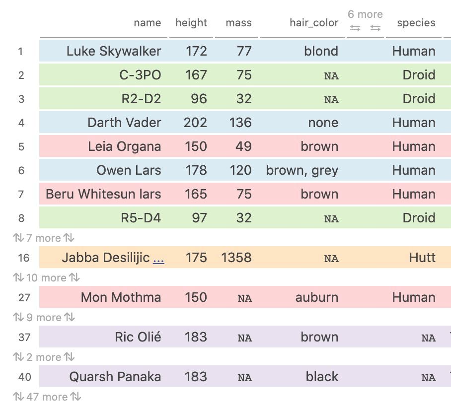
``` 

```{r echo = FALSE,  out.width = "95%", fig.align = "center", fig.cap = "Flujo de https://tidydatatutor.com/"}
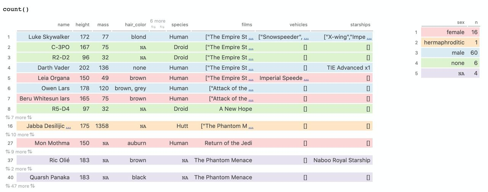
``` 


]

---

# Aleatorio .orange[ESTRATIFICADO]


.pull-left[

Podemos **.bg-purple_light[agrupar por variables]**, por ejemplo vamos a agrupar por `sex` y `gender`, y después aplicaremos `count()` (realiza la acción en cada subtabla).

```{r}
starwars %>%
  group_by(sex, gender) %>% #<< 
  count() %>%
  ungroup() #<<
```

**IMPORTANTE**: siempre que agrupes, acuérdate de desagrupar con `ungroup()`.

]

.pull-right[

```{r echo = FALSE,  out.width = "150%", fig.align = "center"}
knitr::include_graphics("./img/group_1.jpg")
``` 

```{r group-count, echo = FALSE,  out.width = "150%", fig.align = "center", fig.cap = "Flujo de https://tidydatatutor.com/"}
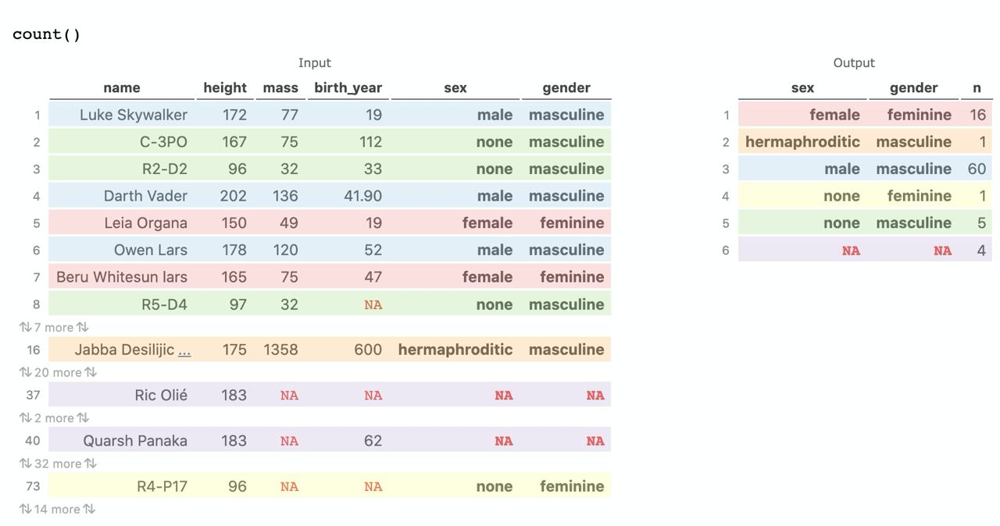
``` 

]

---

# Aleatorio .orange[ESTRATIFICADO]

El **.bg-purple_light[muestreo aleatorio estratificado]** lo podremos realizar con un `slice_sample()` pero antes aplicando un `group_by()` para **.bg-purple_light[seleccionar por estratos]**. 

¿Cómo **.bg-purple_light[muestrear el 50%]** pero tener la **.bg-purple_light[misma proporción de hombres que de mujeres]** que en los datos originales?

--

Para el ejemplo, filtraremos solo los hombres y mujeres (76 registros)

```{r eval = FALSE}
starwars %>% filter(sex %in% c("female", "male"))
```

---


# Aleatorio .orange[ESTRATIFICADO]

¿Cómo **.bg-purple_light[muestrear el 50%]** pero tener la **.bg-purple_light[misma proporción de hombres que de mujeres]** que en los datos originales?

Fíjate que tenemos 38 filas (el 50% de los 76 registros, redondeando hacia abajo) pero...

```{r}
starwars %>%
  filter(sex %in% c("female", "male")) %>% 
  group_by(sex) %>%#<<
  slice_sample(prop = 0.5) %>% 
  ungroup()
```


---

# Aleatorio .orange[ESTRATIFICADO]

Fíjate que seguimos teniendo 38 filas (el 50% de los 76 registros, redondeando hacia abajo) pero...

.pull-left[

```{r}
starwars %>%
  filter(sex %in% c("female", "male")) %>% 
  group_by(sex) %>%#<<
  slice_sample(prop = 0.5) %>% 
  ungroup() %>% 
  count(sex)
```

]

.pull-right[

```{r}
starwars %>%
  filter(sex %in% c("female", "male")) %>% 
  count(sex)
```

]

...**.bg-purple_light[asegurando una proporción similar]** de hombres que de mujeres que en la muestra original

---

# .orange[CONTAR]: group_by() + count()

Aunque lo veremos de nuevo en exploración y depuración, hemos visto ya como **.bg-purple_light[generar el resumen estadístico]** más sencillo: **.bg-purple_light[contar (frecuencias)]**

.pull-left[

```{r eval = FALSE}
datos %>%
  contar(var1, var2)
```

]

.pull-right[

```{r eval = FALSE}
starwars %>%
  count(var1, var2)
```

]

--

Cuando lo usamos en solitario, `count()` nos devolverá simplemente el **.bg-purple_light[número de registros]**

```{r}
starwars %>% count()
```

---

# .orange[CONTAR]: group_by() + count()

Sin embargo, cuando lo usamos pasándole como **.bg-purple_light[argumento una o varias variables]**, `count()` nos cuenta lo que se conoce en estadística como **.bg-purple_light[frecuencias absolutas]**: el número de elementos pertenecientes a cada una de las **modalidades**. En nuestro caso, la variable `sex` tiene 4 modalidades: `female, hermaphroditic, male, none`.

```{r}
starwars %>% count(sex)#<<
```

---

# .orange[CONTAR]: group_by() + count()


Además si pasamos **.bg-purple_light[varias variables]** nos calcula una **.bg-purple_light[tabla de contigencia]** con las frecuencias absolutas n-dimensionales

```{r}
starwars %>% count(sex, gender)
```

---


# .orange[CONTAR]: group_by() + count()

Además dentro del `count()` podemos añadir `sort = TRUE`, que nos devolverá el conteo de frecuencias con los **.bg-purple_light[elementos más frecuentes primero]** (sin necesidad de añadir un `arrange()` a la tabla de conteo generada).

```{r}
starwars %>%
  count(sex, sort = TRUE)
```

---

# Ejercicios (group_by() + count())

.panelset[
.panel[.panel-name[Ejercicios]


* 📝 **Ejercicio 1**: calcula cuántos personajes hay de cada especie de `starwars` haciendo uso de `group_by()` y `count()`. Determina el número de especies distintas.

* 📝 **Ejercicio 2**: calcula cuántos personajes hay de cada sexo y género.

* 📝 **Ejercicio 3**: tras eliminar ausentes en  `birth_year`, obtén la edad mínima y máxima por sexo.

* 📝 **Ejercicio 4**: obtén el personaje más viejo por cada sexo.

* 📝 **Ejercicio 5**: selecciona aleatoriamente el 60% de los registros de `starwars` pero manteniendo el reparto original entre humanos y no humanos (recuerda limpiar antes de ausentes, con `filter()` o `drop_na()`)

* 📝 **Ejercicio 6**: selecciona aleatoriamente un personaje de cada sexo.

]

.panel[.panel-name[Sol. Ej. 1]

```{r}
starwars %>% 
  group_by(species) %>% 
  count() %>% 
  ungroup()
```

```{r}
starwars %>% 
  group_by(species) %>% 
  count() %>% 
  ungroup() %>%
  nrow()
```


]

.panel[.panel-name[Sol. Ej. 2]


```{r}
starwars %>%
  count(sex, gender)
```

```{r}
starwars %>%
  group_by(sex, gender) %>% 
  count() %>% 
  ungroup()
```

]

.panel[.panel-name[Sol. Ej. 3]

```{r}
starwars %>% 
  drop_na(birth_year) %>% 
  group_by(sex) %>% 
  slice_min(n = 1, birth_year) %>% 
  ungroup()

starwars %>% 
  drop_na(birth_year) %>% 
  group_by(sex) %>% 
  slice_max(n = 1, birth_year) %>% 
  ungroup()
```

]

.panel[.panel-name[Sol. Ej. 4]

```{r}
starwars %>% 
  group_by(sex) %>% 
  slice_max(n = 1, birth_year) %>% 
  ungroup()
```

]

.panel[.panel-name[Sol. Ej. 5]

```{r}
starwars %>% 
  drop_na(species) %>% 
  group_by(species == "Human") %>% 
  slice_sample(prop = 0.6) %>% 
  ungroup()
```


]

.panel[.panel-name[Sol. Ej. 6]

```{r}
starwars %>% 
  group_by(sex) %>% 
  slice_sample(n = 1) %>% 
  ungroup()
```

]

]

---

# Ejercicio extra

* 📝 **Ejercicio extra**

  - Carga la tabla `billboard` del paquete `{tidyr}`.
  - Convierte el dataset a tidydata, ausentes incluidos (deberías obtener 5307 filas y 5 columnas).
  - Extrae la lista de artistas distintos que aparecen en la tabla.
  - Determina el artista que aparece más veces en la lista.
  - Determina el arista y canción que ha estado más semanas en la lista.
  - Realiza un muestreo extrayendo solo los registros de Enrique Iglesias y The Backstreet Boys.
  - Realiza un muestreo extrayendo los 5 artistas cuya canción haya estado más veces en el top5.
  - Realiza un muestreo aleatorio estratificado, extrayendo el 60% de los datos manteniendo la proporción de datos entre las distintas semanas.
  
  

---

class: inverse center middle
name: clase-5

# CLASE 5: primer algoritmo de clasificación (knn)

&nbsp;

### [Depuración tidyverse](#preproc)

### [Introducción a la clasificación supervisada](#sup-class)

### [Clasificador Bayesiano](#bayes)

### [knn: algoritmo de los k-vecinos más cercanos](#knn)


---

name: preproc

# .orange[ELIMINAR] duplicados: distinct()

Otra opción es **.bg-purple_light[eliminar filas duplicadas]** con `distinct()`, pasándole como argumentos las variables. Por defecto, solo extrae las columnas en base a las cuales hemos eliminado duplicados. Si queremos que nos **mantenga todas** deberemos explicitarlo con `.keep_all = TRUE`.

.pull-left[

```{r}
# Elimina filas con igual (color_pelo, color_ojos)
starwars %>% distinct(hair_color, eye_color)
```

]

.pull-left[

```{r}
# Elimina filas con igual (color_pelo, color_ojos)
starwars %>% distinct(hair_color, eye_color, .keep_all = TRUE)
```

]
  
---

# .orange[SELECCIONAR] columnas:  select()

.pull-left[

```{r eval = FALSE}
datos %>%
  selecciono(col1, col2, ...)
```

]

.pull-right[

```{r eval = FALSE}
starwars %>%
  select(col1, col2, ...)
```

]

--

La opción más sencilla para **.bg-purple_light[seleccionar variables]** es `select()`, dando como argumentos los nombres de columnas. Por ejemplo, vamos a seleccionar las variables `names` y `hair_color`

```{r}
starwars %>%
  select(name, hair_color) #<<
```


---

# .orange[SELECCIONAR] columnas:  select()

.pull-left[

```{r}
starwars %>% select(name, hair_color)
```

]

.pull-right[

```{r select1, echo = FALSE,  out.width = "140%", fig.align = "center", fig.cap = "Flujo de https://tidydatatutor.com/"}
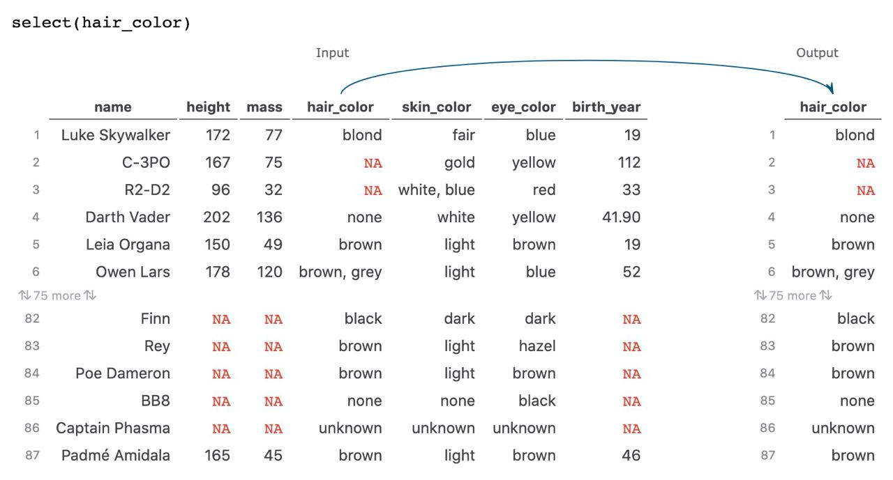
``` 

]

---

# .orange[SELECCIONAR] columnas:  select()


Como sucedía al filtrar, la función `select()` es bastante versatil y nos permite:

* Seleccionar **.bg-purple_light[varias variables a la vez]** (concatenando sus nombres).

```{r}
starwars %>% select(name:skin_color)
```

---

# .orange[SELECCIONAR] columnas:  select()

* **.bg-purple_light[Deseleccionar]** columnas con `-`

```{r}
starwars %>% select(-c(mass:eye_color), -species, -c(films:starships))
```

---

# .orange[SELECCIONAR] columnas:  select()


* Seleccionar columnas que **.bg-purple_light[comiencen por un prefijo]** (`starts_with()`), **.bg-purple_light[terminen]** con un sufijo (`ends_with()`), **.bg-purple_light[contengan]** un texto (`contains()`) o cumplan una **.bg-purple_light[expresión regular]** (`matches()`)


```{r}
# nombre acaba en "color"
starwars %>% select(ends_with("color"))
```

---

# .orange[SELECCIONAR] columnas:  select()


* Seleccionar columnas que **.bg-purple_light[comiencen por un prefijo]** (`starts_with()`), **.bg-purple_light[terminen]** con un sufijo (`ends_with()`), **.bg-purple_light[contengan]** un texto (`contains()`) o cumplan una **.bg-purple_light[expresión regular]** (`matches()`)

```{r}
# empiezan por new_sp
who %>% select(country, year, starts_with("new_sp"))
```

---

# .orange[SELECCIONAR] columnas:  select()


* Seleccionar columnas que **.bg-purple_light[comiencen por un prefijo]** (`starts_with()`), **.bg-purple_light[terminen]** con un sufijo (`ends_with()`), **.bg-purple_light[contengan]** un texto (`contains()`) o cumplan una **.bg-purple_light[expresión regular]** (`matches()`)

```{r}
tb <- tibble("edad" = c(30, 35, 40),
             "color_ojos" = c("azul", "amarillo", "negro"),
             "pelo_color" = c("negro", "marrón", "rubio"))
tb %>% select(contains("color"))
```


---

# .orange[SELECCIONAR] columnas:  select()

Incluso podemos seleccionar por rango numérico si tenemos variables conun prefijo y números.

```{r}
billboard %>% select(num_range("wk", 10:15))
```

---

# .orange[SELECCIONAR] columnas:  select()

* Seleccionar columnas de un **.bg-purple_light[tipo]** haciendo uso de `where()`.


```{r}
# Solo columnas numéricas o de trexto
starwars %>% select(where(is.numeric) | where(is.character))
```

---

# .orange[RECOLOCAR] columnas: relocate()

Fíjate que con `select()` podrías además **.bg-purple_light[recolocar columnas]**, indícandole el orden, ayudándote también de `everything()`

```{r}
starwars %>%  select(c(species, name, birth_year, everything()))
```

---

# .orange[RECOLOCAR] columnas: relocate()


.pull-left[

```{r eval = FALSE}
datos %>% 
  recolocar(col1, col2, .after = ...)
```

]

.pull-right[

```{r eval = FALSE}
starwars %>% 
  relocate(col1, col2, .after = ...)
```

]

--

Para facilitar la **.bg-purple_light[recolocación]** tenemos una función para ello, `relocate()`,  indicándole en `.after` o `.before` detrás o delante de qué columnas queremos moverlas.

```{r}
starwars %>% relocate(species, .before = name)
```

---

# .orange[EXTRAER] columnas: pull()


.pull-left[

```{r eval = FALSE}
datos %>% 
  retirar(variable)
```

]

.pull-right[

```{r eval = FALSE}
starwars %>% 
  pull(variable)
```

]

--

.pull-left[

Si observas la salida de los `select()`, sigue siendo una tabla `tibble`, nos preserva la naturaleza de nuestros datos.

```{r}
starwars %>% select(name)
```

]

.pull-right[

A veces no querremos dicha estructura sino **.bg-purple_light[extraer literalmente la columna]**, algo que podemos hacer con `pull()`

```{r}
starwars %>% pull(name)
```

]

---

# .orange[RENOMBRAR] columnas: rename()


.pull-left[

```{r eval = FALSE}
datos %>% 
  renombrar(col1, col2)
```

]

.pull-right[

```{r eval = FALSE}
starwars %>% 
  rename(col1, col2)
```

]

--

A veces también podemos querer **modificar la «metainformación»** de los datos, **.bg-purple_light[renombrando columnas]**. Para ello usaremos la función `rename()` poniendo primero el nombre nuevo y luego el antiguo.

```{r}
starwars %>% 
  rename(nombre = name, altura = height,  peso = mass)
```


---

# Ejercicios (columnas)

.panelset[
.panel[.panel-name[Ejercicios]


* 📝 **Ejercicio 1**: filtra el conjunto de personajes y quédate solo con aquellos que en la variable `height` no tengan un dato ausente.

* 📝 **Ejercicio 2**: con los datos obtenidos del filtro anterior, selecciona solo las variables `name`, `height`, así como todas aquellas variables que CONTENGAN la palabra `color` en su nombre.

* 📝 **Ejercicio 3**: con los datos obtenidos del ejercicio anterior, traduce el nombre de las columnas a castellano

* 📝 **Ejercicio 4**: con los datos obtenidos del ejercicio anterior, coloca la variable de color de pelo justo detrás de la variable de nombres.

* 📝 **Ejercicio 5**: con los datos obtenidos del ejercicio, comprueba cuántas modalidades únicas hay en la variable de color de pelo.

]

.panel[.panel-name[Sol. Ej. 1]

**IMPORTANTE**: todo lo que hagas en la tabla original, si el resultado final no se lo asignas `<-` a otra variable, lo verás en consola pero no se guardará en ningún sitio. Lo que no guardes, no existe.


```{r}
starwars_NA <- starwars %>% drop_na(height)
starwars_NA 
```

]

.panel[.panel-name[Sol. Ej. 2]

```{r}
starwars %>%
  drop_na(height) %>%
  select(c(name, height, contains("color")))
```

]

.panel[.panel-name[Sol. Ej. 3]


```{r}
starwars %>%
  drop_na(height) %>%
  select(c(name, height, contains("color"))) %>%
  rename(nombre = name, altura = height,
         color_pelo = hair_color,
         color_piel = skin_color,
         color_ojos = eye_color)
```

]

.panel[.panel-name[Sol. Ej. 4]


```{r}
starwars %>%
  drop_na(height) %>%
  select(c(name, height, contains("color"))) %>%
  rename(nombre = name, altura = height,
         color_pelo = hair_color,
         color_piel = skin_color,
         color_ojos = eye_color) %>%
  relocate(color_pelo, .after = nombre)
```

]

.panel[.panel-name[Sol. Ej. 5]

```{r}
starwars %>%
  drop_na(height) %>%
  select(c(name, height, contains("color"))) %>%
  rename(nombre = name, altura = height, color_pelo = hair_color,
         color_piel = skin_color, color_ojos = eye_color) %>%
  relocate(color_pelo, .after = nombre) %>%
  distinct(color_pelo)
```

**IMPORTANTE**: recuerda que `distinct()` de mantener todas las columnas añadiendo `.keep_all = TRUE`.

]

]


---

# Ejercicio extra


Veamos un ejercicio extra para comprobar la **potencia y flexibilidad** de `{tidyverse}`, pudiendo hacer muchas cosas en dos líneas de código.

&nbsp;

* 📝 **Ejercicio extra**: selecciona solo las variables `name` y aquellas que sean de tipo numérico y la variable `homeworld`, y selecciona solo los personajes que no sean humanos y que pesen entre 70 y 90 kg.  Tras ello elimina datos ausentes, y elimina duplicados con el mismo valor en `homeworld`. Tras ello, recoloca las variables para que el orden la primera columna sea `name` y la segunda `birth_year`. Para acabar, cambia el nombre  a castellano de las variables.


---

name: mutate


# .orange[MODIFICAR] columnas: mutate()


.pull-left[

```{r eval = FALSE}
datos %>%
  modificar(nueva_var = ...)
```

]

.pull-right[

```{r eval = FALSE}
starwars %>%
  mutate(nueva_var = ...)
```

]

--

En muchas ocasiones querremos **.bg-purple_light[modificar o crear  variables]**. Para ello tenemos la función `mutate()`. Vamos a crear una **nueva variable** `height_m` con la altura en centímetros.

```{r}
# altura en metros
starwars %>%
  mutate(height_m = height / 100) #<<
```

---

# .orange[MODIFICAR] columnas: mutate()


```{r eval = FALSE}
starwars %>% mutate(height_m = height / 100)
```

```{r mutate1, echo = FALSE,  out.width = "90%", fig.align = "center", fig.cap = "Flujo de https://tidydatatutor.com/"}
knitr::include_graphics("./img/mutate1.jpg")
``` 

---

# .orange[MODIFICAR] columnas: mutate()

Otra opción es **.bg-purple_light[quedarnos solo con las modificadas]** (por ejemplo, para ver si hace lo que debe) con `transmute()`

```{r}
starwars %>%
  transmute(height_m = height / 100) #<<
```

---


# .orange[MODIFICAR] columnas: mutate()

También se pueden aplicar **.bg-purple_light[funciones más complejas]** o incluso **.bg-purple_light[funciones propias]** creadas por nosotros mismos (y varias a la vez).

```{r}
calculo_IMC <- function(peso, estatura, unidades = "metros") {
  
  estatura <- ifelse(unidades == "metros", estatura, estatura / 100)
  IMC <- peso / (estatura^2)
  
  return(IMC)
}
```

---

# .orange[MODIFICAR] columnas: mutate()

También se pueden aplicar **.bg-purple_light[funciones más complejas]** o incluso **.bg-purple_light[funciones propias]** creadas por nosotros mismos (y varias a la vez).

```{r}
starwars %>%
  mutate(IMC = calculo_IMC(mass, height, unidades = "centímetros"),
         height_m = height / 100) %>%
  relocate(IMC, height_m, .after = mass)
```

---

# .orange[MODIFICAR] columnas: mutate()

También podemos combinarlo con la función `if_else()`, una modificación dentro de `{tidyverse}` para hacer un `if-else` vectorizado, que nos puede ayudar a **.bg-purple_light[recategorizaciones sencillas]**.

```{r}
starwars %>%
  mutate(human = if_else(species == "Human", "Human", "Not Human")) %>% 
  relocate(human, .after = name)
```


---

# .orange[RECATEGORIZAR]: case_when()

Para **.bg-purple_light[recategorizaciones más complejas]** tenemos a nuestra disposición `case_when()`. Supongamos por ejemplo que queremos crear una **categoría en función de su altura**.

* Si `height > 180` –> serán `"alto"`.
* Si `height <= 180` y `height > 120` –> serán `"bajo"`
* Si `height <= 120` y `height > 0` –> serán `"enano"`
* Si no se cumple lo anterior –> serán `"ausente"`

--

```{r}
starwars %>% mutate(height = case_when(height > 180 ~ "alto",
                                       height > 120 ~ "bajo",
                                       height > 0 ~ "enano",
                                       TRUE ~ "ausente"))
```

---

# .orange[RECATEGORIZAR]: case_when()

Las condiciones de `case_when()` pueden combinar varias variables, cómo por ejemplo:

* Si pesan mucho o miden mucho --> `"large"`
* Si `species == "Droid"` --> `"robot"`
* En caso contrario --> `"other"`

```{r}
starwars %>%
  mutate(type =
           case_when(height > 200 | mass > 200 ~ "large",
                     species == "Droid" ~ "robot",
                     TRUE ~ "other"))
```

---

# Ejercicios (mutate)


.panelset[
.panel[.panel-name[Ejercicios]


* 📝 **Ejercicio 1**: crea tres nuevas columnas que nos digan el número de películas en las que han salido, el número de vehículos y el número d naves (pero haciendo uso de mutate()). 

* 📝 **Ejercicio 2**: con las 3 columnas creadas, crea una nueva columna llamada `frequency` que nos ponga `almost_all` en personajes que salen en 5 o más películas, `many` en personajes que salen en más de 2 películas pero en menos de 5 y `some` en personajes que salen 1 o 2 películas.

* 📝 **Ejercicio 3**: elimina registros con datos ausentes en la variable `birth_year` y filtra solo los 20 personajes más jóvenes.

* 📝 **Ejercicio 4**: selecciona solo las variables numéricas y de tipo texto. Define una nueva variable llamada `under_18` que nos recategorice la variable `birth_year`: `TRUE` si es menor de edad y `FALSE` en caso contrario

]

.panel[.panel-name[Sol. Ej. 1]

```{r}
starwars_nueva <- 
  starwars %>%
  mutate(n_films = films %>% map_int(length),
         n_vehicles = vehicles %>% map_int(length),
         n_starships = starships %>% map_int(length))
starwars_nueva
```

]

.panel[.panel-name[Sol. Ej. 2]

```{r}
starwars_nueva <-
  starwars_nueva %>%
  mutate(frequency =
           case_when(n_films >= 5 ~ "almost_all",
                     n_films > 2 ~ "many",
                     TRUE ~ "some"))
starwars_nueva
```

]

.panel[.panel-name[Sol. Ej. 3]

```{r}
starwars_nueva <-
  starwars_nueva %>%
  drop_na(birth_year) %>%
  slice_min(n = 20, birth_year)
starwars_nueva
```

]

.panel[.panel-name[Sol. Ej. 4]

```{r}
starwars_nueva <-
  starwars_nueva %>%
  select(where(is.numeric) | where(is.character)) %>%
  mutate(under_18 = birth_year < 18)
starwars_nueva
```


]

]


---


# Ejercicios (mutate)


.panelset[
.panel[.panel-name[Ejercicios]

* 📝 **Ejercicio 5**: de la base de datos original, determina el número de modalidades que toma la variable `species` (elimina antes registros con ausente en dicha variable). Después elimina duplicados por dicha variable, dejando el representante más bajito.

* 📝 **Ejercicio 6**: sobre la base de datos original, crea una nueva columna llamada `auburn` (cobrizo/caoba) que nos diga `TRUE` si el color de pelo contiene dicha palabra y `FALSE` en caso contrario.

* 📝 **Ejercicio 7**: sobre la base de datos original, filtra solo aquellos personajes de la familia `"Skywalker"` o `"Antilles"`, selecciona solo las columnas de `name` y `specie`, y renombra a castellano.


]

.panel[.panel-name[Sol. Ej. 5]

```{r}
starwars %>%
  drop_na(species) %>%
  distinct(species)

starwars %>%
  drop_na(species) %>%
  arrange(height) %>%
  distinct(species, .keep_all = TRUE)
```

]

.panel[.panel-name[Sol. Ej. 6]

```{r}
starwars %>%
  drop_na(hair_color) %>%
  mutate(auburn = str_detect(hair_color, "auburn"))
```

]

.panel[.panel-name[Sol. Ej. 6]

```{r}
starwars %>%
  filter(str_detect(name, "Skywalker") |
           str_detect(name, "Antilles")) %>%
  select(name, species) %>%
  rename(nombre = name, especie = species)
```

]
]


---

name: sup-class

# Aprendizaje .green[SUPERVISADO]

.pull-left[

* **.bg-purple_light[Aprendizaje supervisado]**: tendremos dos tipos de variables, la **.bg-orange[variable dependiente (output/target)]** que se quiere predecir/clasificar (con su valor conocido en el conjunto de entrenamiento) y las **.bg-orange[variables independientes (inputs)]** o variables explicativas, que contienen la información disponible.

&nbsp;

Todo lo que veremos en esta asignatura entra dentro de la idea de **aprendizaje supervisado**

]


.pull-right[


```{r echo = FALSE,  out.width = "110%", fig.align = "center", fig.cap = "Extraída de https://realpython.com/knn-python/basics-of-machine-learning"}

``` 


]

---

# Fundamentos de la .orange[CLASIFICACIÓN]

Como decíamos en diapositivas pasadas, un problema de **.bg-purple_light[clasificación]** constará de los siguientes elementos

* Una **.bg-purple_light[variable objetivo]** $Y$ que será **.bg-purple_light[cualitativa]** (o cuantitativa discreta recategorizada).

--

* Dicha variable objetivo podrá tomar un **.bg-purple_light[número finito C de categorías]** denotadas como $G = \left\lbrace 1, 2, \ldots, C \right\rbrace$).

--

* El **.bg-purple_light[conjunto de variables predictoras]** será denotada como $\left(X_1, \ldots, X_p \right)$ 

--

* Nuestros datos formarán una **.bg-purple_light[muestra conjunta]** de tamaño $n$ denotada como $\left\lbrace \left(x_{i, 1},...,x_{i, p}, y_i \right) \right\rbrace_{i=1,\ldots,n}$

&nbsp;

--

Si $C = 2$ diremos que es un problema de **.bg-purple_light[clasificación binaria]**


📚 Ver «The elements of Statistical Learning» (Hastie et al., 2008): <https://github.com/dadosdelaplace/teaching/blob/main/data_mining/biblio/datamining_hastieetal_2008.pdf>


---

# Objetivo de la .orange[CLASIFICACIÓN]

Nuestro **.bg-purple_light[objetivo]** primario (no siempre) será conseguir que la mayor parte de etiquetas predichas $\hat{y}_i$ coincidan con su categoría real $y_i$, siendo la tasa de bien clasificados una de las métrias más importantes (no la única).

&nbsp;

* **.bg-purple_light[Accuracy]** (tasa de bien clasificados): del total de datos de tu partición, la **.bg-purple_light[proporción o % de observaciones con una etiqueta correcta]** (al ser supervisado sabemos que está bien y que está mal).


$$ACC  = \frac{1}{n} \sum_{i=1}^{n} I(y_i = \hat{y}_i)$$

A veces nos fijaremos en su complementario, la **.bg-purple_light[tasa de mal clasificados]**, siendo esta la proporción de individuos mal clasificados.

---

# Métricas de .orange[CLASIFICACIÓN BINARIA]

En la mayoría de ocasiones nuestros problemas serán de **.bg-purple_light[clasificación binaria]** (podemos entender las categorías como $G = \left\lbrace 0, 1\right\rbrace$), ya que todo problema de clasificacón multiclase se puede reducir a un conjunto de problemas binarios. En ese caso tendremos además un **.bg-purple_light[conjunto de métricas]** basadas en los conceptos de falso negativo/positivo y verdadero negativo/positivo

* **.bg-purple_light[Verdadero positivo (TP)]**: todos aquellos individuos con clasificación positiva $\hat{y}_i = 1$ y que efectivamente así lo eran $y_i = 1$

* **.bg-purple_light[Falso positivo (FP)]**: todos aquellos individuos con clasificación positiva $\hat{y}_i = 1$ pero que no lo eran $y_i = 0$

--

* **.bg-purple_light[Verdadero negativo (TN)]**: todos aquellos individuos con clasificación negativa $\hat{y}_i = 0$ y que efectivamente así lo eran $y_i = 0$

* **.bg-purple_light[Falso negativo (FN)]**: todos aquellos individuos con clasificación negativa $\hat{y}_i = 0$ pero que no lo eran $y_i = 1$

---


# Métricas de .orange[CLASIFICACIÓN BINARIA]

.pull-left[

* **.bg-purple_light[Verdadero positivo (TP)]**: individuos con clasificación positiva $\hat{y}_i = 1$ y que efectivamente así lo eran $y_i = 1$

* **.bg-purple_light[Falso positivo (FP)]**: individuos con clasificación positiva $\hat{y}_i = 1$ pero que no lo eran $y_i = 0$

* **.bg-purple_light[Verdadero negativo (TN)]**: individuos con clasificación negativa $\hat{y}_i = 0$ y que efectivamente así lo eran $y_i = 0$

* **.bg-purple_light[Falso negativo (FN)]**: individuos con clasificación negativa $\hat{y}_i = 0$ pero que no lo eran $y_i = 1$

]

.pull-right[


```{r echo = FALSE,  out.width = "80%", fig.align = "left", fig.cap = "Tabla extraída de wikipedia"}
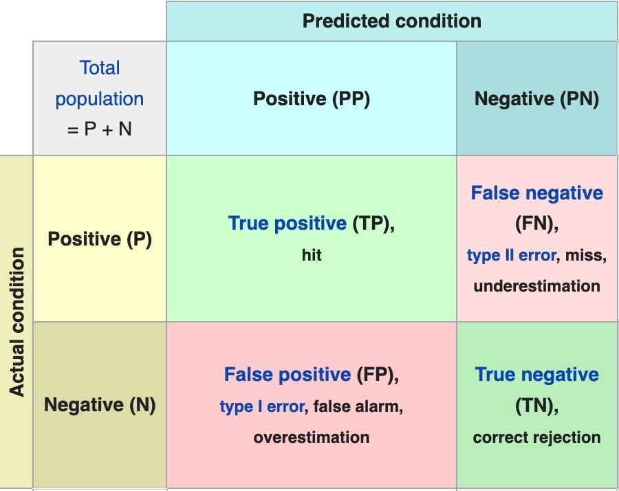
``` 

]

En el futuro, en la fase de evaluación (assess) hablaremos de una herramienta conocida como **.bg-purple_light[curva ROC]**.

---


# Métricas de .orange[CLASIFICACIÓN BINARIA]

En base a dichos conceptos existen otras **.bg-purple_light[métricas habituales]** a tener en cuenta:

* **.bg-purple_light[Accuracy (ACC)]**: definida en el caso binario como $ACC = \frac{TP + TN}{TP+TN+FP+FN} = \frac{TP + TN}{n}$

--

* **.bg-purple_light[Sensibilidad (TPR)]**: también conocida como True Positive Rate o **.bg-purple_light[recall]**, es la proporción de positivos reales $y_i=1$ que han sido clasificadas como  positivo $\hat{y}_i = 1$, definida como $TPR = \frac{TP}{P}$ (**.bg-purple_light[probabilidad]** empírica de **.bg-purple_light[detectar correctamente los positivos]**). Su complementario se conoce como **False Negative Rate (FNR)**.

--

* **.bg-purple_light[Especificidad (TNR)]**: también conocida como True Negative Rate, es la proporción de negativos reales $y_i=0$ que han sido clasificadas como negativos $\hat{y}_i = 0$, definida como $TNR = \frac{TN}{N}$ (**.bg-purple_light[probabilidad]** empírica de **.bg-purple_light[detectar correctamente los negativos]**). Su complementario se conoce como **False Positive Rate (FPR)**.

&nbsp;

Desde lo teórico, ambas son maximizables de forma conjunta al 100% (aunque en la práctica, una mejora en una supondrá un coste en la otra).

---


# Métricas de .orange[CLASIFICACIÓN BINARIA]

Un ejemplo reciente son las **.bg-purple_light[pruebas de detección de covid]**. En el caso de las pruebas PCR comercializadas en España

* la **.bg-purple_light[sensibilidad]** era en torno al 80-90%. ¿Qué implica el 10-20% restante?

* la **.bg-purple_light[especificidad]** era en torno al 99%. ¿Qué implica el 1% restante?


--

&nbsp;

Otras métricas habituales que pueden ayudarnos a tomar decisiones son la **.bg-purple_light[prevalencia]**, definida como  $P / (P + N)$ (la proporción de positivos en tu población) y la conocida como **.bg-purple_light[precisión (PPV)]** o Positive Predictive Value, definida como $TP / PP$ (siendo $PP$ los positivos predichos, del total de clasificados como positivos cuantos son verdaderos positivos)


📚 Ver <https://www.aemps.gob.es/la-aemps/ultima-informacion-de-la-aemps-acerca-del-covid%E2%80%9119/informacion-general-sobre-tests-de-diagnostico-de-covid-19/>

---

name: bayes

# Clasificador .orange[BAYESIANO]

Más allá de la comparación que podamos hacer entre distintos métodos, ¿existe **.bg-purple_light[algún clasificador de referencia]** contra el que compararnos? La buena noticia es que sí existe, la mala noticia es que en la mayoría de casos no vamos a poder conocerlo.

--

&nbsp;

Dicho clasificador se conoce como **.bg-purple_light[clasificador Bayesiano]**, y es el **.bg-purple_light[clasificador óptimo]** en el sentido de que nos devuelve como clase predicha aquella que sea más probable, haciendo uso de la distribución de probabilidad teórica de nuestros datos (algo que normalmente no conoceremos).


$$\hat{y_i} = j \quad \text{si} \quad  P(Y = j | X = \left(x_{i,1}, \ldots, x_{i,p} \right) =  \max_{g \in G} P(Y = g | X = \left(x_{i,1}, \ldots, x_{i,p} \right)$$

&nbsp;

En el **.bg-purple_light[caso binario]**, se asignará la clase 1 si $P(Y = 1|X) > 0.5$, y la clase 0 en otro
caso.


---

# Clasificador .orange[BAYESIANO]

.pull-left[

Fíjate que el criterio óptimo no es seguramente el perfecto, ni el que mejor tasa de bien clasificados proporcione: es aquel que es capaz de entender los patrones de los datos. El **.bg-purple_light[clasificador Bayesiano solo es posible si conocemos la distribución conjunta]** de probabilidad (algo que por desgracia, no suele ser).

]

.pull-right[


```{r echo = FALSE,  out.width = "99%", fig.align = "center", fig.cap = "Hastie et al. (2008)"}
knitr::include_graphics("./img/bayes_rule.jpg")
``` 

]

---


name: knn

# Algoritmo .orange[KNN]: k-vecinos más cercanos

**.bg-purple_light[Motivación]**: imagina que quieres dedicir si vas al cine para ver o no una película. **.bg-purple_light[¿Qué proceso seguirías?]**


--

Parece lógico que el proceso sea **.bg-purple_light[considerar opiniones]** de tu entorno y/o de las críticas que puedas buscar en internet. **.bg-purple_light[¿Qué decisiones tomarías? ¿Cómo «algoritmizarías» el proceso?]**

--

1. **.bg-purple_light[Número de vecinos]**: decidir el número $k$ de opiniones (**.bg-purple_light[k-vecinos]**) que vas a tomar cuenta (no puedes preguntar a todo el mundo ni leer todas las críticas, pero tampoco fiarte de una sola persona).

--

2. **.bg-purple_light[¿Qué es «entorno cercano»?]** Tendremos que decidir quién entra y quién no en nuestro entorno más cercano. ¿Cuál es la definición de cercano? Deberemos definir el **.bg-purple_light[concepto de cercanía con una distancia]** que nos permita decidir los **.bg-purple_light[k-vecinos más cercanos]**

--

3. **.bg-purple_light[Ponderación]**: deberemos por último decidir si **.bg-purple_light[todas las opiniones valen lo mismo o no]**. ¿Vale lo mismo la opinión de alguien muy afín a ti que la de Boyero (crítico de cine)? ¿Te fías igual
de todas ellas? Deberemos decidir si estas distancias son **.bg-purple_light[ponderadas]**.

---

# Algoritmo .orange[KNN]

Tu decisión final será por tanto aquella **.bg-purple_light[opinión mayoritaria (moda)]** de las opiniones de tus **.bg-purple_light[k-vecinos]** **.bg-orange[más cercanos]**, una vez que dichas opiniones han sido o no **.bg-green_light[ponderadas]**: 

* **.bg-purple_light[Sin poderar]**: para cada  individuo, su clasificación será asignada como la **.bg-purple_light[moda de sus k-vecinos]** más cercanos.

* **.bg-purple_light[Con ponderación]**: para cada  individuo, su clasificación será asignada como la **.bg-purple_light[moda ponderada de sus k-vecinos]** más cercanos, por ejemplo tomando como peso el inverso de la distancia (cuánto más cerca, más pesa).

--

Matemáticamente, dado un registro $x_i = (x_{i,1},\ldots,x_{i,p})$, un número $k$ de vecinos y una métrica $d()$, la **.bg-purple_light[probabilidad de pertenencia]** de $y_i$ a la **.bg-purple_light[clase j]** será

$$P(y_i = j | X = x_i) = \frac{1}{k} \sum_{l=1}^{k} w_l I(y_l = j)$$

donde $x_l$, con $l=1,...,k$, son los k-vecinos más cercanos en función de $d()$ y $w_l$ es el peso de vécino l-ésimo (pudiendo ser todos uno si no ponderamos, o $w_l = \frac{1}{d(x_i, x_l)}$)

---


# Algoritmo .orange[KNN]

En el caso de que tengamos un problema de **.bg-purple_light[clasificación binaria]**, el problema será mucho más sencillo. Dado un registro $x_i = (x_{i,1},\ldots,x_{i,p})$, un número $k$ de vecinos y una métrica $d()$, la **.bg-purple_light[probabilidad de ser 1]** de $y_i$ será

$$P(y_i = 1 | X = x_i) = \frac{1}{k} \sum_{l=1}^{k} w_l I(y_l = 1)$$

y la **.bg-purple_light[probabilidad de ser 0]** de $y_i$ será 
$P(y_i = 0 | X = x_i) = 1- P(y_i = 1 | X = x_i)$ (su complementario).

&nbsp;

La **.bg-purple_light[clase predicha]** será aquella cuya probabilidad sea mayor.

---

# Decisiones KNN: .orange[K] vecinos

.pull-left[

* **.bg-purple_light[Pocos vecinos]**: regla de decisión extremadamente flexible, creando incluso «islas» de un solo individuo. **.bg-purple_light[Poco sesgo y enorme varianza]** (con un dato nuevo que tuviéramos, ya cambiaría todo).

* **.bg-purple_light[Muchos vecinos]**: regla de decisión extremadamente rígida. **.bg-purple_light[Mucho sesgo y poca varianza]** (dado que aunque tengamos inputs nuevos, apenas cambiará)

]

.pull-right[

```{r echo = FALSE,  out.width = "70%", fig.align = "left"}
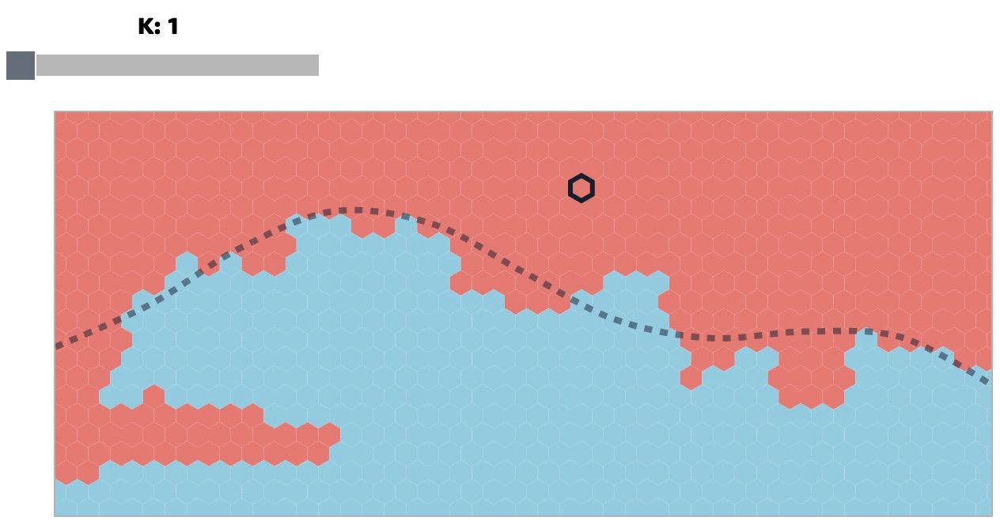
``` 

```{r echo = FALSE,  out.width = "70%", fig.align = "left"}
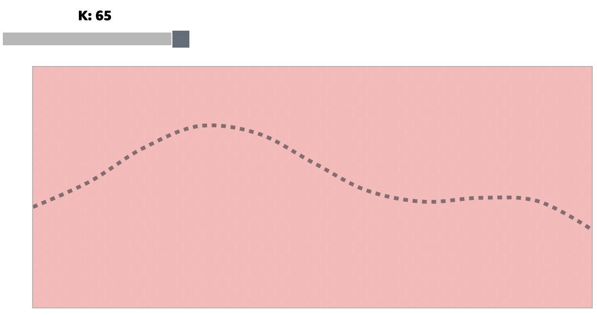
``` 

]

Será por tanto crucial **.bg-purple_light[probar un rango de vecinos lo suficientemente amplio]** como para encontrar lo óptimo.

---

# Decisiones KNN: .orange[DISTANCIA]

Lo segundo a elegir será la **.bg-purple_light[distancia]** con la que se decidirá qué está **.bg-purple_light[cerca o lejos]**.Cuando tenemos **.bg-purple_light[variables numéricas]** tenemos dos opciones:

* **.bg-purple_light[Distancias geométricas]**: miden distancias en un plano/espacio/espacio de dimensión p.

* **.bg-purple_light[Distancias probabilísticas]**: miden distancias en base parámetros estadísticos como la media o la desviación típica.

---

# Decisiones KNN: .orange[DISTANCIA]

En el caso de las **.bg-purple_light[distancias geométricas]** la más habitual es la conocida como **.bg-purple_light[distancia euclídea]**, la que usamos de forma habitual.


.pull-left[

En el plano, se define como

$$d(x, y) = \sqrt{(x_1 - y_1)^2 + (x_2 - y_2)^2}$$

En el caso general en el que tengamos $p$ predictoras numéricas se calculará como

$$d(x, y) = \sqrt{\displaystyle \sum_{j=1}^{p} (x_j - y_j)^2}$$

]

.pull-right[

```{r echo = FALSE,  out.width = "80%", fig.align = "left"}
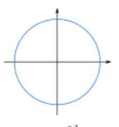
``` 

Círculo euclídeo: conjunto de puntos a la misma distancia del centro, haciendo uso de la distancia Euclídea (el radio).

]

---

# Decisiones KNN: .orange[DISTANCIA]


Existen otro tipo de distancias geométricas como la **.bg-purple_light[distancia Manhattan]**, la distancia que usas cuando caminas por la calle (dado que no puedes atravesar manzanas), definida como

$$d(x, y) = \sqrt{\displaystyle \sum_{j=1}^{p} |x_j - y_j|}$$


Otra métrica es la **.bg-purple_light[distancia de Chebyshev]**
 $d(x, y) = \max_i \left(|x_i - y_i| \right)$

```{r echo = FALSE,  out.width = "40%", fig.align = "center"}
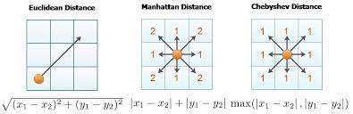
``` 


--

¿Cómo se definirían los círculos (lugares a la misma distancia de un centro) en dichas métricas?

---

# Decisiones KNN: .orange[DISTANCIA]


Todas estas métricas en realidad son casos particulares de las conocidas como **.bg-purple_light[distancias de Minkowski]**, definidas en función de un parámetro $r$

$$d(x, y) = \left(\displaystyle \sum_{j=1}^{p} |x_j - y_j|^r\right)^{1/r}$$

.pull-left[

```{r echo = FALSE,  out.width = "100%", fig.align = "left"}
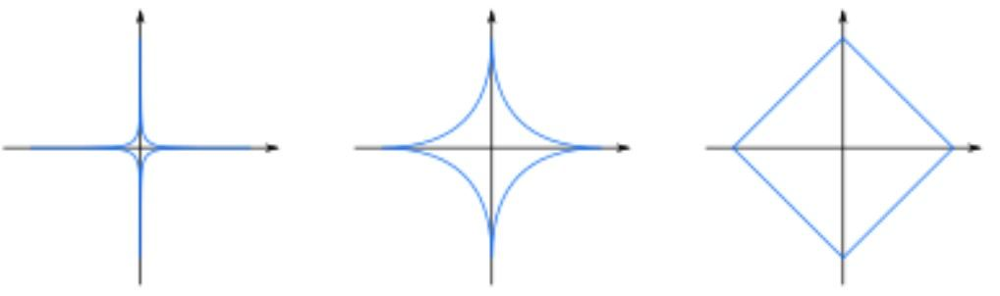
``` 

]


.pull-right[

```{r echo = FALSE,  out.width = "100%", fig.align = "left"}
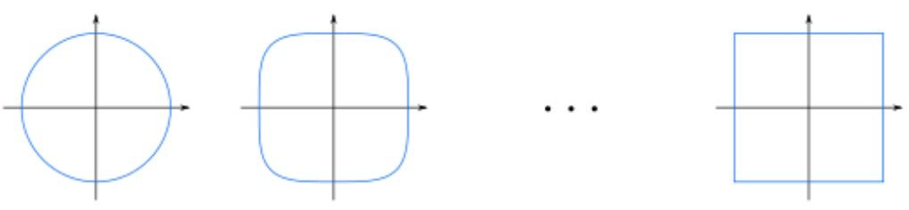
``` 

]

Cuando $p=1$ estamos ante la distancia Manhattan, cuando $p=2$ es la distancia Euclídea, cuando $p=\infty$ es la distancia de Chebyshev.

---

# .orange[PREPROCESAMIENTO] en KNN

En el caso en el que tengamos **.bg-purple_light[predictoras numéricas]** y que decidamos optar por una **.bg-purple_light[distancia geométrica]**, en un ejemplo bidimensional, si $x_1$ toma valores entre 10 000 y 100 000 y $x_2$ toma valores entre 0 y 0.001, a la hora de calcular las distancias en realidad la **.bg-purple_light[segunda variable no está participando]** en el aprendizaje (ya que es tan pequeña que da igual lo que valga).

¿Qué **.bg-purple_light[preprocesamiento/depuración]** de los datos deberíamos hacer para que eso no suceda?

--

Cuando usamos las distancias geométricas debemos **.bg-purple_light[reescalar o estandarizar por rango]**, de forma que **.bg-purple_light[todas las variables estén en un rango común]** (por ejempo, $[0,1]$)

$$\tilde{x}_{i,j} = \frac{x_{i,j} - min(x_j)}{max(x_j) - min(x_j)}$$

--

&nbsp;

Además necesitamos **.bg-purple_light[tratar los datos ausentes]** (lo veremos en futuras clases, si imputarles un valor o si eliminarlos).

---

# Decisiones KNN: .orange[DISTANCIA]

En el caso de las **.bg-purple_light[distancias probabilísticas]** la más habitual es la conocida como **.bg-purple_light[distancia de Mahalanobis]**, que tiene en cuenta las características probabilísticas de los datos. En el caso **.bg-purple_light[bidimensional (con variables independientes)]**

$$d(x, y) = \sqrt{\left(\frac{x_1 - y_1}{\sigma_1} \right)^2 + \left(\frac{x_2 - y_2}{\sigma_2} \right)^2}$$

--

En el caso **.bg-purple_light[multidimensional (con variables independientes)]**

$$d(x, y) = \sqrt{\displaystyle \sum_{j=1}^{p} \left(\frac{x_j - y_j}{\sigma_j} \right)^2 }$$

---

# Decisiones KNN: .orange[DISTANCIA]

En el caso general de tener un problema **.bg-purple_light[multidimensional (con variables dependientes)]**, la idea es promediar las observaciones por la **.bg-purple_light[matriz de varianzas y covarianzas]**

$$d(x, y) = \sqrt{\displaystyle \sum_{j=1}^{p} \left(x_j - y_j \right)^{T} \Sigma^{-1} \left(x_j - y_j \right) }$$

Donde $\Sigma^{-1}$ es la **.bg-purple_light[matriz de varianzas y covarianzas]** (matriz simétrica)

$$\Sigma = \begin{pmatrix} \sigma_{1}^2 & cov(x_1, x_2) & \ldots & cov(x_1, x_p) \\ cov(x_2, x_1) & \sigma_{2}^2 & \ldots & cov(x_2, x_p) \\ \vdots & \vdots & \ddots & \vdots \\ cov(x_p, x_1) & cov(x_p, x_2) & \ldots & \sigma_{p}^2 \end{pmatrix}$$

---

# .orange[PREPROCESAMIENTO] en KNN

En el caso en el que tengamos **.bg-purple_light[predictoras numéricas]** y que decidamos optar por una **.bg-purple_light[distancia probabilística]**,  ya no será tan importante los valores en sí literales sino las **.bg-purple_light[características probabilísticas de nuestras variables]** 

¿Qué **.bg-purple_light[preprocesamiento/depuración]** de los datos deberíamos hacer para que eso no suceda?

--

Cuando usamos las distancias probabilísticas debemos **.bg-purple_light[normalizar o estandarizar por media/varianza)]**, de forma que **.bg-purple_light[todas las variables tengan media 0 y desv. típica 1]**

$$\tilde{x}_{i,j} = \frac{x_{i,j} - \overline{x}_j}{\sigma_j}$$

---

class: inverse center middle
name: clase-6

# CLASE 6: depuración para KNN

&nbsp;


### [Factores](#factores)

### [Fase 1: muestreo](#sample-iris)

### [Fase 2: exploración](#exploracion-iris)

### [Fase 3: modificación/depuración](#depuracion-iris)


---

# Primer conjunto: iris

Para empezar con la implementación de nuestro primer **.bg-purple_light[algoritmo de clasificación]** vamos a usar un conjunto simple y conocido: el iris.

```{r}
iris <- as_tibble(iris)
iris
```

---

# .orange[EXPLORACIÓN] inicial

Dentro de esa metodología SEMMMA hay una fase muy importante: la **.bg-purple_light[fase exploratoria]**. Aunque más adelante podemos volver a realizarla, una vez realizado el muestro, lo conveniente sería una **.bg-purple_light[análisis exploratorio previo]** a los datos en bruto.


--

* `View()`: el primer paso debería ser ver nuestra tabla para tener una idea preliminar de nuestros datos.

```{r eval = FALSE}
iris %>% View()
```

---

# .orange[EXPLORACIÓN] inicial


* `glimpse()`: también podemos ejecutar algunos comandos que nos permiten saber rápidamente el **.bg-purple_light[número de registros y variables]** que tenemos, así como el **.bg-purple_light[tipo de variables]** que tenemos. En nuestro caso tenemos **.bg-purple_light[5 variables]**: 4 variables numéricas (cuantitativas continuas) y una **.bg-purple_light[variable categórica]** (de tipo factor).

```{r}
dim(iris)
iris %>% glimpse()
```

---

name: factores


# Variables cuali: .orange[FACTORES]

.pull-left[

Las variables cualitativas se conocen en `R` como **.bg-purple_light[factores]**. Y el paquete fundamental para tratarlos es `{forcats}` (del entorno `{tidyverse}`). 

]

.pull-right[

```{r echo = FALSE,  out.width = "100%", fig.align = "left"}
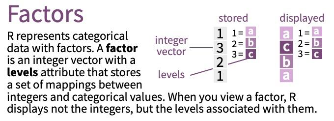
``` 

]

---

# Variables cuali: .orange[FACTORES]

Este paquete nos permite fijar los **.bg-purple_light[niveles/modalidades]** (guardados internamente como `levels`) que toma una determinada variable categórica para que no puedan generarse errores. Además hace que su análisis sea menos costoso computacionalmente a la hora de hacer búsquedas y comparativas, dándoles un **.bg-purple_light[tratamiento diferente que a las cadena de texto normales]**.

--

Veamos un ejempo sencillo definiendo una variable `estado` que tome los valores `"sano"`, `"leve"` y `"grave"` de la siguiente manera.

```{r}
estado <-
  c("leve", "grave", "sano", "sano", "leve", "sano", "sano", "grave",
    "grave", "leve", "grave", "sano", "sano")
estado
```

La variable `estado` actualmente es de **.bg-purple_light[tipo texto]**, de tipo `chr`, algo que podemos comprobar con `class(estado)`.

```{r}
class(estado)
```

---

# Variables cuali: .orange[FACTORES]


Desde un punto de vista estadístico y computacional, para `R` esta variable ahora mismo sería equivalente una variable de nombres. Pero estadísticamente **.bg-purple_light[no es lo mismo una variable con nombres]** (que identifican muchas veces el registro) que una variable categórica como estado que **.bg-purple_light[solo puede tomar esos 3 niveles]**. ¿Cómo **.bg-purple_light[convertir a factor]**? Haciendo uso de la función `as_factor()` del paquete `{forcats}`.

--

```{r}
library(tidyverse)
estado_fct <- tibble(paciente = 1:length(estado),
                     estado = as_factor(estado))
estado_fct
```

---

# Variables cuali: .orange[FACTORES]


No solo ha cambiado la clase de la variable sino que ahora, debajo del valor guardado, nos aparece la frase `Levels: grave leve sano`: son las **.bg-purple_light[modalidades o niveles]** de nuestra cualitativa. Imagina que ese día en el hospital no tuviésemos a **nadie en estado grave**: aunque ese día nuestra variable no tome dicho valor, el estado `grave` es un **.bg-purple_light[nivel permitido en la base de datos]**, así que aunque lo eliminemos, por ser un factor, el nivel permanece (no lo tenemos ahora pero es un nivel permitido).


```{r}
estado_fct %>% 
  filter(estado %in% c("sano", "leve")) %>% 
  pull(estado)
```

---

# Variables cuali: .orange[FACTORES]


Con `factor()` podemos **.bg-purple_light[especificar explícitamente]** los nombres de las modalidades, incluso si son nominales u **.bg-purple_light[ordinales]**

```{r}
estado_fct <-
  tibble(paciente = 1:length(estado),
         estado = factor(estado, ordered = TRUE))
estado_fct %>% pull(estado)
```

---

# Variables cuali: .orange[FACTORES]


Con  `levels = ...` podemos indicarle explícitamente el **.bg-purple_light[orden de las modalidades]**

```{r}
estado_fct <-
  tibble(paciente = 1:length(estado),
         estado = factor(estado,
                         levels = c("sano", "leve", "grave"),
                         ordered = TRUE))
estado_fct %>% pull(estado)
```


---

# Variables cuali: .orange[FACTORES]


.pull-left[

Si queremos indicarle que **.bg-purple_light[elimine un nivel no usado]** en ese momento (y que queremos excluir de la definición) podemos hacerlo con `fct_drop()`

]


.pull-right[

```{r echo = FALSE,  out.width = "100%", fig.align = "left"}
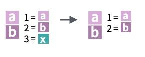
``` 

]

```{r}
estado_fct %>% 
  filter(estado %in% c("sano", "leve")) %>% 
  mutate(estado = fct_drop(estado)) %>% 
  pull(estado)
```

---

# Variables cuali: .orange[FACTORES]

.pull-left[

Al igual que podemos eliminar niveles podemos **.bg-purple_light[ampliar los niveles existentes]** (aunque no existan datos de ese nivel en ese momento) con `fct_expand()`


]


.pull-right[

```{r echo = FALSE,  out.width = "100%", fig.align = "left"}
knitr::include_graphics("./img/factor_expand.jpg")
``` 

]

```{r}
estado_fct %>% 
  mutate(estado = fct_expand(estado, c("UCI", "fallecido"))) %>% 
  pull(estado)
```

---

# Variables cuali: .orange[FACTORES]

.pull-left[

Además con `fct_explicit_na()` podemos **.bg-purple_light[asignar un nivel a los valores]** para que sea incluido dicho nivel en los análisis y visualizaciones.


]


.pull-right[

```{r echo = FALSE,  out.width = "100%", fig.align = "left"}
knitr::include_graphics("./img/factor_explicit.jpg")
``` 

]

```{r}
fct_explicit_na(factor(c("a", "b", NA)))
```

---

# Variables cuali: .orange[FACTORES]


Incluso una vez definidos podemos **.bg-purple_light[reordenar los níveles]** con `fct_relevel()`


```{r}
estado_fct_expand <- 
  estado_fct %>% 
  mutate(estado = fct_expand(estado, c("UCI", "fallecido"))) %>% 
  pull(estado)

estado_fct_expand %>%
  fct_relevel(c("fallecido", "leve", "sano",
                "grave", "UCI"))
  
```


---

# Variables cuali: .orange[FACTORES]

.pull-left[

Esta forma de trabajar con variables cualitativas nos permite dar una **.bg-purple_light[definición teórica]** de nuestra base de datos, pudiendo incluso contar valores que aún no existen (pero que podrían), haciendo uso de `fct_count()`

]


.pull-right[

```{r echo = FALSE,  out.width = "70%", fig.align = "left"}
knitr::include_graphics("./img/fct_count.jpg")
``` 

]

```{r}
estado_fct %>% 
  mutate(estado = fct_expand(estado, c("UCI", "fallecido"))) %>% 
  pull(estado) %>% 
  fct_count()
```


---

# Variables cuali: .orange[FACTORES]


Los níveles también podemos **.bg-purple_light[ordenarlos por frecuencia]** con `fct_infreq()`

```{r}
estado_fct %>% 
  mutate(estado = fct_infreq(estado)) %>% 
  pull(estado) %>% 
  fct_count()
```

---

# Variables cuali: .orange[FACTORES]


A veces querremos **.bg-purple_light[agrupar niveles]**, por ejemplo, no permitiendo niveles que **.bg-purple_light[no sucedan un mínimo de veces]** con `fct_lump_min(.., min = ..)` (las observaciones que no lo cumplan irán a un **nivel genérico** llamado `Other`, aunque se puede cambiar con el argumento `other_level`). 

.pull-left[


```{r}
estado_fct %>% 
  pull(estado) %>% 
  fct_lump_min(min = 4)
```

]

.pull-right[

```{r}
estado_fct %>% 
  pull(estado) %>% 
  fct_lump_min(min = 4,
               other_level = "otros")
```

]

---

# Variables cuali: .orange[FACTORES]


Podemos hacer algo equivalente pero en función de su **.bg-purple_light[frecuencia relativa]** con `fct_lump_prop()`.


```{r}
estado_fct %>% 
  pull(estado) %>% 
  fct_lump_prop(prop = 0.4,
                other_level = "otros")
```


---

# Variables cuali: .orange[FACTORES]

Con `fct_reorder()` podemos también indicar que queremos **.bg-purple_light[ordenar los factores]** en función de una función aplicada a otra variable.


```{r}
starwars_factor <- 
  starwars %>% 
  drop_na(height, species) %>% 
  mutate(species =
           fct_lump_min(species, min = 3,
                        other_level = "Otras"))
```

.pull-left[

```{r}
starwars_factor %>% pull(species)
```

]

.pull-right[

```{r}
starwars_factor %>%
  mutate(species = fct_reorder(species, height, mean)) %>% 
  pull(species)
```

]


---

# Ejercicios (factores)


.panelset[
.panel[.panel-name[Ejercicios]

* 📝 **Ejercicio 1**: dada la variable `meses` definida debajo (definida como un vector de caracteres), convierte dicha variable a factor (solo eso)

```{r}
meses <- c("Ene", "Feb", "Mar", "Abr")
```
  
* 📝 **Ejercicio 2**:  dada la variable `meses` definida debajo convierte dicha variable a factor pero indicando los niveles de forma correcta.

```{r}
meses <- c(NA, "Abr", "Ene", "Oct", "Jul", "Ene", "Sep", NA, "Feb", "Dic",
           "Jul", "Mar", "Ene", "Mar", "Feb", "Abr", "May", "Oct", "Sep",  NA,
           "Dic", "Jul", "Nov", "Feb", "Oct", "Jun", "Sep", "Oct", "Oct", "Sep")
```

  
* 📝 **Ejercicio 3**: cuenta cuantos valores hay de cada mes pero teniendo en cuenta que son factores (quizás haya niveles sin ser usados y de los que debería obtener un 0).

]

.panel[.panel-name[Sol. ej. 1]

```{r}
meses <- c("Ene", "Feb", "Mar", "Abr")
meses_fct <- as_factor(meses)
meses_fct
```


]

.panel[.panel-name[Sol. ej. 2]

```{r}
meses <- c(NA, "Abr", "Ene", "Oct", "Jul", "Ene", "Sep", NA, "Feb", "Dic",
           "Jul", "Mar", "Ene", "Mar", "Feb", "Abr", "May", "Oct", "Sep",  NA,
           "Dic", "Jul", "Nov", "Feb", "Oct", "Jun", "Sep", "Oct", "Oct", "Sep")

# Orden de niveles correcto e incluimos agosto aunque no haya
meses_fct <-
  factor(meses,
         levels = c("Ene", "Feb", "Mar", "Abr", "May", "Jun", "Jul", "Ago", "Sep", "Oct", "Nov", "Dic"))
meses_fct
```

]

.panel[.panel-name[Sol. ej. 3]

```{r}
meses_fct %>% fct_count()
```

]

]

---

# Ejercicios (factores)


.panelset[
.panel[.panel-name[Ejercicios]

* 📝 **Ejercicio 4**: dado que hay ausentes, indica que los ausentes sea un decimotercer nivel etiquetado como "ausente".

* 📝 **Ejercicio 5**: elimina los niveles no usados.

* 📝 **Ejercicio 6**: ordena los niveles por frecuencia de aparición.
  
* 📝 **Ejercicio 7**:  agrupa niveles de forma que todo nivel que no aparezca al menos el 7% de las veces se agrupe en un nivel llamado "otros meses"
]

.panel[.panel-name[Sol. ej. 4]

```{r}
meses_fct <- 
  meses_fct %>%
  fct_explicit_na(na_level = "ausente")
meses_fct
```

]

.panel[.panel-name[Sol. ej. 4]

```{r}
meses_fct <- 
  meses_fct %>%
  fct_drop()
meses_fct
```

]

.panel[.panel-name[Sol. ej. 6]

```{r}
meses_fct %>% 
  fct_infreq()
```

]

.panel[.panel-name[Sol. ej. 7]

```{r}
meses_fct <-
  meses_fct %>% 
  fct_lump_prop(prop = 0.07, other_level = "otros")
meses_fct
```

]
]

---

name: exploracion-inicial

# .orange[EXPLORACIÓN] inicial

* `skim()`: con el paquete `{skimr}` podemos realizar un **.bg-purple_light[primer análisis numérico]** muy sencillo, haciendo uso de la función `skim()`

```{r eval = FALSE}
library(skimr)
iris %>% skim()
```

---

# ¿Cuál es nuestra variable .orange[OBJETIVO]?

Una vez que hemos echado un vistazo a qué tenemos (de forma muy muy preliminar), lo primero a hacer en un **.bg-purple_light[problema de clasificación]** es determinar **.bg-purple_light[cuál es nuestra variable objetivo]**: nuestra variable $Y$ que vamos a clasificar, y que debe ser categórica.

--

En este caso nuestra variable objetivo será la **.bg-purple_light[variable Species]**: vamos a intentar clasificar las flores, siendo la variable objetivo una variable que puede tomar 3 categorías (algo que podemos ver y resumir con `count()`).

```{r}
iris %>% count(Species)
```

En nuestro caso la variable objetivo está **.bg-purple_light[balanceada]**: tenemos proporciones similares para cada una de las modalidades.

---

name: sample-iris

# Fase 1: .orange[MUESTREO]

La primera fase de la **.bg-purple_light[metodología SEMMA]** será decidir si es necesario realizar un **.bg-purple_light[muestreo]** previo (una submuestra de la muestra). ¿Cómo haríamos un **.bg-purple_light[muestro aleatorio estratificado del 50%]**, respetando la proporción de cada clase de la variable objetivo?

--

```{r}
iris_sample <-
  iris %>% group_by(Species) %>%
  slice_sample(prop = 0.5) %>% 
  ungroup()
iris_sample %>% count(Species)
```

En nuestro caso: ¿es necesario? No parece dado que tenemos **.bg-purple_light[muy pocas observaciones]**, así que trabajaremos con la tabla iris original.

---

name: exploracion-iris

# Fase 2: .orange[EXPLORACIÓN]

Como ya hemos comentado, una **.bg-purple_light[primera fase exploratoria]** la podemos realizar con `skim()` (del paquete `{skimr}`).

```{r eval = FALSE}
library(skimr)
iris %>% skim()
```

```{r echo = FALSE,  out.width = "75%", fig.align = "center"}
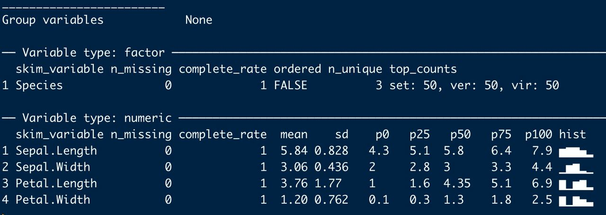
``` 

---

# Fase 2: .orange[EXPLORACIÓN]

* No parece que tengamos **.bg-purple_light[problemas de codificación o rango]**: los valores parecen valores permitidos según lo que representa la variable.

--

* No tenemos **.bg-purple_light[datos ausentes]** (no hace falta decidir que hacemos con ellos), ya que `complete_rate` sale en todas 1 (`n_missing` está a cero).

--

* A la vista de los pequeños histogramas y los percentiles, no parece que tengamos **.bg-purple_light[excesivos valores atípicos (outliers)]** (al menos muy evidentes, además la mediana y media se parecen entre sí). Quizás la **.bg-purple_light[variable con mayor dispersión]** sea `Petal.Length`.

--

* Todas las **.bg-purple_light[variables predictoras son numéricas]**: recordemos que para aplicar las métricas que conocemos en el KNN **.bg-purple_light[necesitamos que sean numéricas]**. En caso contrario nos tocaría **.bg-purple_light[recategorizar]**

---

# Fase 2: .orange[EXPLORACIÓN]


Otra de las acciones clave será analizar cómo se **.bg-purple_light[comporta la variable objetivo en función de los valores de cada variable]**. ¿La longitud del sépalo media es similar en cada especie de planta? ¿Y la anchura del pétalo? Con ello podremos tener una idea preliminar de la **.bg-purple_light[importancia de las variables]** en la clasificación. Para ello combinaremos `group_by()` con `summarise()` (nos construye resúmenes numéricos, con la función que le pidamos).

--

```{r}
iris %>%
  group_by(Species) %>% 
  summarise("mean_long_sep" = mean(Sepal.Length)) %>% 
  ungroup()
```

---

# Fase 2: .orange[EXPLORACIÓN]

Podemos hacer varias a la vez usando `across()`: le tendremos que indicar las variables a recorrer, y la función a aplicar en todas ellas.

```{r}
iris %>%
  group_by(Species) %>%
  summarise(mean = across(Sepal.Length:Petal.Width, mean)) %>% 
  ungroup()
```

---

# Fase 2: .orange[EXPLORACIÓN]

```{r}
iris %>%
  group_by(Species) %>%
  summarise(mean = across(Sepal.Length:Petal.Width, mean)) %>% 
  ungroup()
```

Si nos fijamos en cada una de ellas:

* Las **.bg-purple_light[variables relacionadas con el sépalo]** no parece que cambien mucho de una especie a otra: seguramente **.bg-purple_light[no sean influyentes]** en nuestra clasificación.

* Las **.bg-purple_light[variables relacionadas con el pétalo]** si parecen ser determinantes ya que la especie setosa tiene valores muy pequeños. Seguramente lo más complicado sea clasificar entre versicolor y virginica (se diferencia muy ligeramente)


---

# Fase 2: .orange[EXPLORACIÓN]


Otro de los aspectos a considerar antes de tomar decisiones será **.bg-purple_light[analizar la relación entre las variables]**, empezando por la posible relación lineal, calculando la matriz de correlaciones con las herramientas de la librería `{corrr}`. **.bg-red_light[Importante]**: solo podemos pasarle las variables numéricas de la tabla.

```{r}
library(corrr)
correlate(iris %>% select(where(is.numeric)))
```

---

# Fase 2: .orange[EXPLORACIÓN]


```{r}
library(corrr)
correlate(iris %>% select(where(is.numeric)))
```


La matriz de correlaciones será **siempre simétrica** y en la diagonal siempre será 1 (podemos indicarle que queremos que nos muestre con el argumento `diagonal = ...`)

---

# Fase 2: .orange[EXPLORACIÓN]

La matriz de correlaciones será **siempre simétrica** y en la diagonal siempre será 1 (podemos indicarle que queremos que nos muestre con el argumento `diagonal = ...`)


```{r}
correlate(iris %>% select(where(is.numeric)), diagonal = "*")
```

---

# Fase 2: .orange[EXPLORACIÓN]


También podemos mostrarla algo más estética **.bg-red_light[redondeando los valores]** con `fashion()`

```{r}
correlate(iris %>% select(where(is.numeric))) %>% fashion()
```

---

# Fase 2: .orange[EXPLORACIÓN]


Incluso visualizarla con el paquete `{corrplot}`

.pull-left[

```{r eval = FALSE}
library(corrplot)
cor_matrix <-
  cor(iris %>% select(where(is.numeric)))
corrplot(cor_matrix)
```

]

.pull-right[


```{r echo = FALSE,  out.width = "100%", fig.align = "center"}
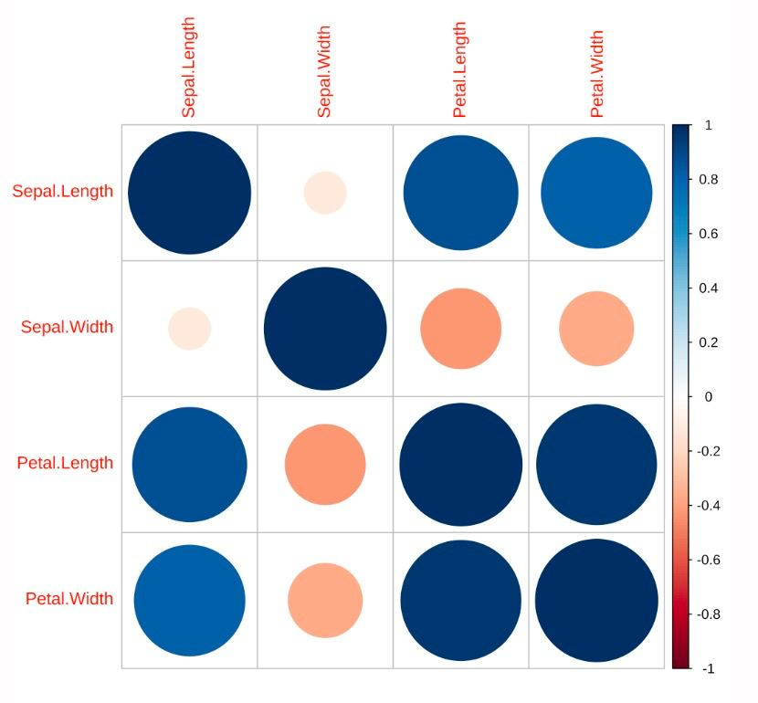
``` 

]

---

# Fase 2: .orange[EXPLORACIÓN]


.pull-left[

```{r eval = FALSE}
corrplot(cor_matrix, method = "number")
```

]

.pull-right[


```{r echo = FALSE,  out.width = "100%", fig.align = "center"}
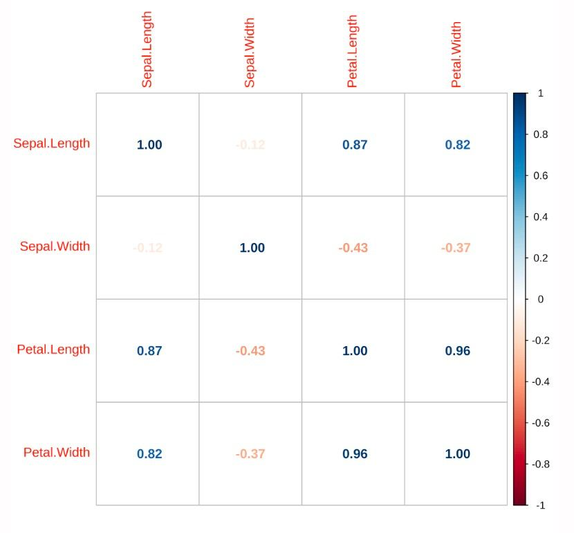
``` 

]

---


# Fase 2: .orange[EXPLORACIÓN]


.pull-left[

```{r eval = FALSE}
corrplot(cor_matrix, method = "color")
```

]

.pull-right[


```{r echo = FALSE,  out.width = "100%", fig.align = "center"}
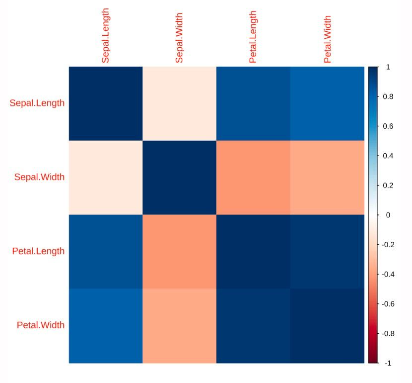
``` 

]

---

# Fase 2: .orange[EXPLORACIÓN]

.pull-left[

```{r eval = FALSE}
corrplot(cor_matrix, method = "ellipse")
```

]

.pull-right[


```{r echo = FALSE,  out.width = "100%", fig.align = "center"}
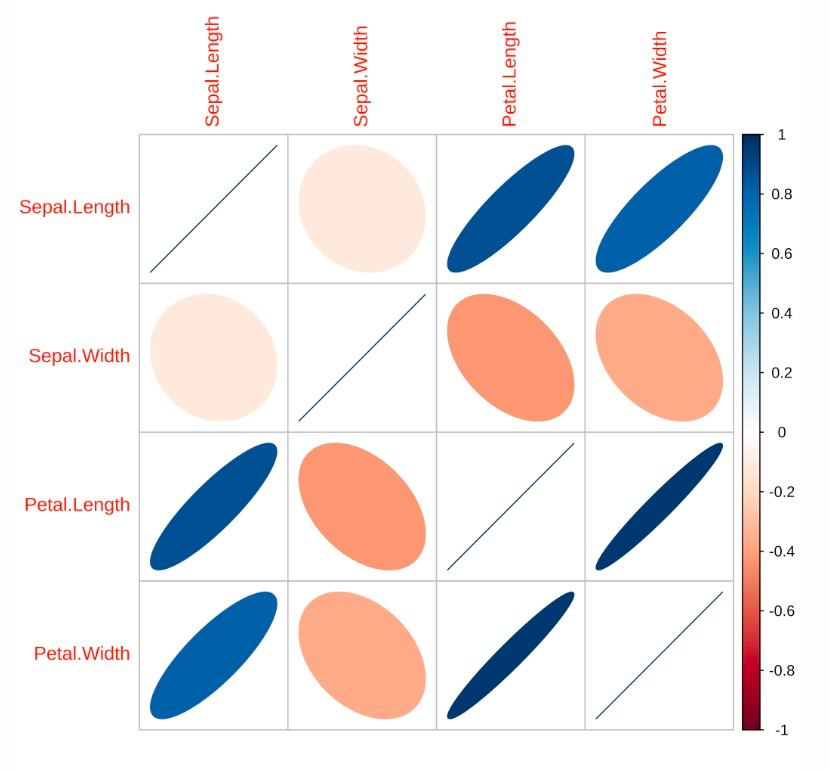
``` 

]


---

# Fase 2: .orange[EXPLORACIÓN]


En este caso tenemos dos variables muy correlacionadas: `Petal.Length` y `Petal.Width`, con una correlación de casi 1, lo que nos indica que nos van a aportar **.bg-red_light[información redundante]** una de la otra, provocando **.bg-red_light[problemas de colinealidad]**.

--


Nuestro caso ideal sería aquel en el que todas fuesen independientes (o al menos incorreladas entre sí, sin dependencia lineal), para **.bg-purple_light[maximizar la información de los datos]**. Si dos variables nos aportan lo mismo, una seguramente sobre (ya que solo nos va a aportar ruido). Veremos más adelante otras herramientas para cuantificar la dependencia (no solo lineal, y no solo de variables cuanti)

--

También aprenderemos a **.bg-purple_light[visualizar los datos]**, un paso CLAVE en el análisis exploratorio y la depuración, pero más adelante.

---

class: inverse center middle
name: clase-7

# CLASE 7: modelizando KNN con tidymodels

&nbsp;

### [Depuración iris](#depuracion-iris)

### [Tratamiento de outliers](#outliers)

### [Resumen knn](#knn-steps)

### [¿Qué es tidymodels?](#tidymodels)

---

name: depuracion-iris

# Fase 3: .orange[MODIFICACIÓN/DEPURACIÓN]

Con la información obtenida de la anterior fase, en la **.bg-purple_light[fase de modificación o depuración]** es donde tendremos que tomar decisiones para **.bg-purple_light[preparar nuestros datos]** de manera adecuada. Y para ello será **.bg-purple_light[fundamental conocer el algoritmo]** que vamos a aplicar. ¿Qué necesitaremos en el caso del KNN?


*  **.bg-purple_light[Tipología de las variables]**. ¿Todas mis variables  **.bg-orange[predictoras son numéricas]** o debo? ¿Mi **.bg-orange[variable objetivo]** es categórica?


*  **.bg-purple_light[Codificación de las variables]**. ¿Todas mis variables tienen un **.bg-orange[rango coherente]** (por ejemplo, que una variable de peso no sea negativa)? ¿Están **.bg-orange[bien codificadas]**?


* **.bg-purple_light[Atípicos y ausentes]**. ¿Tengo **.bg-orange[valores atípicos (outliers)]**? En caso afirmativo, ¿cómo tratarlos? Tras tratar atípicos, ¿tengo **.bg-orange[datos ausentes]**?


* **.bg-purple_light[Selección de variables]**. ¿Necesito seleccionar variables? ¿Tengo alguna de varianza cero (es decir, sin información)? ¿Tengo **.bg-orange[problemas de dependencia o colinealidad]**? ¿Puedo resumir mi info con un conjunto nuevo de variables incorreladas (componentes principales)?


---

# Fase 3: .orange[MODIFICACIÓN/DEPURACIÓN]


* **.bg-purple_light[Variables dummy]**. ¿Debo **.bg-orange[recategorizar]** variables que no sean numéricas? Recuerda que el kNN de momento solo sabemos hacerlo con numéricas (en caso contrario, veremos como «dummificar» variables: crear 0-1 para tener números)


* **.bg-purple_light[Añadir info]**. ¿Debo **.bg-orange[crear nuevas variables]** que nos aporte info extra?

* **.bg-purple_light[Normalizar variables]**. ¿Tengo ya mis variables preparadas (tras tratar lo anterior) para la métrica que vaya usar (**.bg-orange[estandarizadas]** por rango o **.bg-orange[tipificadas]** por media-varianza)?

  
---

name: outliers

# Tratamiento de .orange[OUTLIERS]

Una de las partes más importantes de la fase de exploración y modificación es la **.bg-purple_light[detección de outliers]**, pudiendo tener diferentes definiciones de valor atípico:

* **.bg-purple_light[Atípico respecto a media]**: será un dato muy alejado de la **.bg-purple_light[media de la variable]**. ¿Cuánto de alejado? Una definición habitual es definir un dato atípico como aquel que se aleja de la media $k$ veces la desviación típica (un valor habitual es $k = 2.5$).

$$x_i > \overline{x} + k* s_{j} \quad \text{ o bien } \quad x_i < \overline{x} - k *s_{j}$$

Dicha definición de atípico solo tendrá sentido cuando la **.bg-purple_light[media sea representativa]** de tu distribución, es decir, siempre y cuando tengamos cierta simetría (ya que sino, la media al ser poco robusta se perturbará fácilmente).

---

# Tratamiento de .orange[OUTLIERS]

Para detectarlos usaremos el paquete `{outliers}` y su función `scores()`, que nos dará en cada caso una **.bg-purple_light["puntuación" de cada observación]**. En caso de que queramos **.bg-purple_light[detectarlos respecto a la media]**, le indicaremos que `type = "z"`: nos devolverá precisamente el valor $k$ (si aplicamos valor absoluto), ya que hará cada observación menos la media y la dividirá entre la desviación típica.


```{r}
library(outliers)
abs(scores(c(1, -1, 0, 5, 2, 1.5, 0.5, -0.3, 0, 2, 1.7, 0.2, -0.8), type = "z"))
```

De forma que podamos detectar muy fácil los outliers en función de los estrictos que queramos ser con ese $k$. El tipo `type = "chisq"` nos hace algo parecido pero elevando las desviaciones al cuadrado y diviendo por la varianza.

---

# Tratamiento de .orange[OUTLIERS]

En el caso de nuestros datos, usaremos $k = 2.5$, y detectaremos aquellos datos que son outliers para luego pasarlos a un **.bg-purple_light[valor ausente]**.

```{r warning = FALSE}
iris_na_outliers <- 
  iris %>% 
  mutate(Sepal.Width =
           ifelse(abs(scores(Sepal.Width, type = "z")) > 2.5,
                  NA, Sepal.Width))
iris_na_outliers
```

---

# Tratamiento de .orange[OUTLIERS]

```{r}
iris_na_outliers %>% filter(is.na(Sepal.Width))
```

Tras ello tendremos **.bg-purple_light[dos opciones]**: **.bg-orange[eliminar]** dichas observaciones o **.bg-orange[imputar la media]** sin los ausentes (dado que los hemos detectado con la media)

```{r}
# opción 1
iris_outliers <-
  iris_na_outliers %>% 
  mutate(Sepal.Width =
           ifelse(is.na(Sepal.Width), mean(Sepal.Width, na.rm = TRUE), Sepal.Width))
```

```{r}
# opción 2
iris_outliers <- iris_na_outliers %>% drop_na(Sepal.Width)
```

---

# Tratamiento de .orange[OUTLIERS]

Si queremos hacer esto con varias variables a la vez, tendremos que usar de nuevo `across()`

```{r}
iris_na_outliers <-
  iris %>% 
  mutate(across(Sepal.Length:Petal.Width,
                function(x) { ifelse(abs(scores(x, type = "z")) > 2.5, NA, Sepal.Length) }))
```

--

Con `if_any()` dentro del `filter()` podemos mostrar todo los registros detectados como outlier en alguna variable.

```{r}
iris_na_outliers %>% filter(if_any(Sepal.Length:Petal.Width, is.na))
```

---

# Tratamiento de .orange[OUTLIERS]

Trassu detección y análisis podemos o imputarles a todos la media (de la variable en cuestión) o eliminarlos.

```{r}
# opción 1
iris_outliers <-
  iris_na_outliers %>% 
  mutate(across(Sepal.Length:Petal.Width,
                function(x) { ifelse(is.na(x), mean(x, na.rm = TRUE), x) }))
```


```{r}
# opción 2
iris_outliers <-
  iris_na_outliers %>% drop_na()
```

---

# Tratamiento de .orange[OUTLIERS]

* **.bg-purple_light[Atípico respecto a mediana]**: será un dato muy alejado de la **.bg-purple_light[mediana de la variable]**. ¿Cuánto de alejado? Una definición habitual (conocido como **filtro de Hampel**) es definir un dato atípico como aquel que se aleja de la mediana $k$ veces la mediana de las desviaciones absolutas (conocida como $MAD = Me \left(\left| x_i - Me_x \right| \right)$). Un valor habitual es $k = 3$.

$$x_i > Me_{x} + k*MAD\quad \text{ o bien } \quad x_i< Me_{x} - k*MAD$$

Para ello nos bastará usar `scores()` con `type = "mad"` (y nos devolverá de nuevo ese $k$).

```{r}
abs(scores(c(1, -1, 0, 5, 2, 1.5, 0.5, -0.3, 0, 2, 1.7, 0.2, -0.8), type = "mad"))
```

El **.bg-purple_light[valor a imputar sería la mediana]**

---


# Tratamiento de .orange[OUTLIERS]


* **.bg-purple_light[Atípico respecto a percentiles]**: será un dato muy alejado de los **.bg-purple_light[cuartiles de la variable]**. ¿Cuánto de alejado? Una definición habitual es definir un dato atípico como aquel que se aleja de los cuartiles 1 y 3 (percentiles 25 y 75) $k$ veces el rango intercuartílico ($IQR = Q_3 - Q_1$). Un valor habitual es $k = 1.5$).

$$x_i > Q_3 + k* IQR \quad \text{ o bien } \quad x_i < Q_1 - k*IQR$$

Para ello nos bastará usar `scores()` con `type = "iqr"` (y nos devolverá de nuevo ese $k$, siendo $k = 0$ para lo que esté dentro del IQR).

```{r}
abs(scores(c(1, -1, 0, 5, 2, 1.5, 0.5, -0.3, 0, 2, 1.7, 0.2, -0.8), type = "iqr"))
```

El **.bg-purple_light[valor a imputar sería la mediana]**

---

# Tratamiento de .orange[OUTLIERS]

Existen otros procedimientos **.bg-purple_light[basados en inferencia estadística]** (muchos de ellos en el paquete `{outliers}`)

* **.bg-purple_light[Tests de Grubbs y Dixon]**: ambos test nos permiten **.bg-purple_light[detectar si el valor más alto (o bajo)]** de una varibale es un outlier, pudiendo detectar un solo outlier en cada iteración (en caso de detectarlo, deberíamos tratarlo y volver a ejecutar el test)

$\mathcal{H}_0: \text{valor más alto/bajo no es outlier}$

$\mathcal{H}_1: \text{ valor más alto/bajo sí es outlier}$


&nbsp;

El test de Dixon (basado en una ordenación) suele funcionar mejor cuando tenemos poca muestra que el test de Grubbs (basado en la media).

📚 Ver más documentación de su funcionamiento en <https://www.itl.nist.gov/div898/handbook/eda/section3/eda35h1.htm> y <https://www.statisticshowto.com/dixons-q-test/>

---

# Tratamiento de .orange[OUTLIERS]

Por ejemplo, para el de Dixon existe `dixon.test()`

```{r}
x <- c(1, -1, 0, 5, 2, 1.5, 0.5, -0.3, 0, 2, 1.7, 0.2, -0.8)
dixon.test(x, opposite = TRUE) # valor más bajo
```

```{r}
x <- c(1, -1, 0, 5, 2, 1.5, 0.5, -0.3, 0, 2, 1.7, 0.2, -0.8)
dixon.test(x, opposite = FALSE) # valor más alto
```

---


# Tratamiento de .orange[OUTLIERS]

* **.bg-purple_light[Test de Rosner]**: al contrario que los anteriores, nos permite **.bg-purple_light[detectar varios outliers]** a la vez, especialmente diseñado para evitar que un valor atípico nos perturbe tanto que nos enmascare otro (basado en la media). Podemos ejecutarlo con la función `rosnerTest()` del paquete `{EnvStats}`.

&nbsp;

**.bg-red_light[IMPORTANTE]**: la detección de outliers deberá combinar el análisis numérico y la visualización.

📚 Ver más documentación de su funcionamiento en <https://vsp.pnnl.gov/help/vsample/rosners_outlier_test.htm>


---

# Tratamiento de .orange[OUTLIERS]

En el caso de que tengamos **.bg-purple_light[variables categoricas (factores)]** la detección más inmediata sería haciendo uso de la tabla de frecuencias proporcionada por `fct_count()`


```{r}
datos <- tibble("estado" = c(rep("grave", 18), rep("sano", 10), "muerto", "UCI"))

datos <- 
  datos %>% mutate(estado = factor(estado, levels = c("sano", "grave", "UCI", "muerto"), ordered = TRUE))
datos$estado %>% fct_count() %>% mutate(f = 100 * n/sum(n))
```

---

# Tratamiento de .orange[OUTLIERS]

Con `fct_lump_prop()` podemos **.bg-purple_light[agrupar niveles que no aparezcan un mínimo]** de veces, por ejemplo que representen menos del 5% de los datos, con `prop = 0.05`. Y ese nivel "otros" podremos **.bg-purple_light[asignarle la moda]** del resto de valores.

```{r}
datos <- 
  datos %>%
  mutate(estado = fct_lump_prop(estado, prop = 0.05,
                                other_level = "otros"))
datos
```

---

# Modificación: .orange[reescalado/tipificación]


Por último, antes de poder aplicar nuestra métrica necesitaremos **.bg-purple_light[reescalar por rango]** (para distancias geométricas, con `rescale()` del paquete `{scales}`) o **.bg-purple_light[tipificar]** (para distancias probabilísticas, con `scale()`)


```{r}
# Escalado
library(scales)
iris_final <- 
  iris_outliers %>% 
  mutate(across(Sepal.Length:Petal.Width, rescale))
```


```{r}
# Tipificado
iris_final <- 
  iris_outliers %>% 
  mutate(across(Sepal.Length:Petal.Width, scale))
```


---

name: knn-steps

# .orange[EXPLORACIÓN] y .green[MODIFICACIÓN]

* **.bg-purple_light[Muestreo]**:
  - ¿Hace falta? ¿Estratificado? ¿Tenemos la variable objetivo balanceada?

* **.bg-purple_light[Exploración]**:
  - Resúmenes numéricos (¿simetría? ¿dispersión? ¿ausentes? ¿codificación?)
  - Dependencia entre variables (correlación, dependencia, predictoras vs objetivo)
  - Visualización de datos (pendiente)

* **.bg-purple_light[Depuración/modificación]**:
  - Análisis de outliers (¿se imputan? ¿se mandan a NA? ¿se eliminan?)
  - Tratamiento de ausentes (¿se imputan? ¿se eliminan?)
  - Selección de variables (¿colinealidad? ¿varianza cero? ¿necesitamos tener solo numéricas?)
  - Recategorizar (dummy,cuanti a cuali, codificación etc)
  - Estandarizar para métricas (rango y media-varianza)
  - Crear nuevas variables
  
---

# Caso concreto: .orange[KNN EN IRIS]

* **.bg-purple_light[Muestreo]**:
  - **¿Hace falta?**  --> En el caso del `iris` no necesitamos hacerlo ya que tenemos pocas observaciones y además la variable objetivo está balanceada, algo que podemos comprobar fácil con `count()` (podemos usar `mutate()` para construir la tabla de frecuencias).
  
```{r}
iris %>%
  count(Species) %>%
  mutate(porc = 100 * n/sum(n))
```

---

# Caso concreto: .orange[KNN EN IRIS]

* **.bg-purple_light[Exploración]**:
  - Resúmenes numéricos (¿simetría? ¿dispersión? ¿ausentes? ¿codificación?)

.pull-left[

```{r eval = FALSE}
library(skimr)
iris %>% skim()
```

]

.pull-right[

```{r echo = FALSE,  out.width = "100%", fig.align = "center"}

``` 

]

No parece que tengamos **.bg-purple_light[problemas de codificación o rango]** y tampoco tenemos **.bg-purple_light[datos ausentes]** (`complete_rate` sale en todas 1). La **.bg-purple_light[variable con mayor dispersión]** es `Petal.Length`.

---

# Caso concreto: .orange[KNN EN IRIS]

* **.bg-purple_light[Exploración]**:
  - Dependencia entre variables (correlación, dependencia, **predictoras vs objetivo**)

```{r}
iris %>%
  group_by(Species) %>%
  summarise(mean = across(Sepal.Length:Petal.Width, mean)) %>% 
  ungroup()
```

Las **.bg-purple_light[variables relacionadas con el sépalo]** no parece que cambien mucho de una especie a otra. Las **.bg-purple_light[variables relacionadas con el pétalo]** si parecen ser determinantes ya que la especie setosa tiene valores muy pequeños. Seguramente lo más complicado sea clasificar entre versicolor y virginica (se diferencian muy ligeramente)

---

# Caso concreto: .orange[KNN EN IRIS]

* **.bg-purple_light[Exploración]**:
  - Dependencia entre variables (**correlación**, dependencia, predictoras vs objetivo)

```{r}
library(corrr)
library(corrplot)
correlate(iris %>% select(where(is.numeric)))
# corrplot(iris %>% %>% select(where(is.numeric)) %>% cor())
```

Parece que hay una **.bg-purple_light[altísima correlación]** entre la anchura y la longitud del sépalo (alguna habrá que eliminar en la siguiente fase para evitar problemas de colinealidad)

---

# Caso concreto: .orange[KNN EN IRIS]

* **.bg-purple_light[Depuración/modificación]**:
  - **Análisis de outliers** --> en este caso a las dos primeras variables (muy simétricas) detectaremos por la media, en las dos últimas por mediana y lo pasamos a ausente.

```{r}
iris_na_outliers <- 
  iris %>% 
  mutate(across(Sepal.Length:Sepal.Width,
                function(x) { ifelse(abs(scores(x, type = "z")) > 2.5, NA, x) }),
         across(Petal.Length:Petal.Width,
                function(x) { ifelse(abs(scores(x, type = "mad")) > 3, NA, x) }))
iris_na_outliers %>% 
  filter(if_any(Sepal.Length:Petal.Width, is.na))
```

---

# Caso concreto: .orange[KNN EN IRIS]

* **.bg-purple_light[Depuración/modificación]**:
  - Tratamiento de **ausentes** --> en este caso los imputaremos por media en las dos primeras y por mediana en las dos segundas.
  

```{r}
iris_outliers <- 
  iris_na_outliers %>% 
  mutate(across(Sepal.Length:Sepal.Width,
                function(x) { ifelse(is.na(x), mean(x, rm.na = TRUE), x) }),
         across(Petal.Length:Petal.Width,
                function(x) { ifelse(is.na(x), median(x, rm.na = TRUE), x) }))
```

---

# Caso concreto: .orange[KNN EN IRIS]

* **.bg-purple_light[Depuración/modificación]**:

  - Selección de variables (¿colinealidad? ¿varianza cero? ¿necesitamos tener solo numéricas?) --> en este caso ya tenemos solo predictoras numéricas y no tenemos varianza cero (variables de constantes), así que solo necesitamos **.bg-purple_light[volver a mirar correlación]**
  
  
```{r}
correlate(iris_outliers %>% select(where(is.numeric)))
```

Seguimos observando una alta correlación entre `Petal.Length` y `Petal.Width`: eliminaremos la primera ya que es la que tiene una correlación más alta (en valor absoluto) con las demás

```{r}
iris_colin <-
  iris_outliers %>% select(-Petal.Length)
```

---
  
# Caso concreto: .orange[KNN EN IRIS]

* **.bg-purple_light[Depuración/modificación]**:
  
  - **Recategorizar** --> no necesitamos hacerlo en este caso
  - Crear **nuevas variables** --> no necesitamos hacerlo en este caso
  - **Estandarizar** para métricas --> vamos a usar distancias geométricas así que habrá que normalizar por rango.

```{r}
library(scales)
iris_final <-
  iris_colin %>% 
  mutate(across(c(everything(), -Species), rescale))
iris_final
```

  
---

# Caso concreto: .orange[KNN EN IRIS]

Este sería el **.bg-purple_light[código completo de nuestra depuración]**

```{r}
iris_final <-
  iris %>% 
  mutate(across(Sepal.Length:Sepal.Width,
                function(x) { ifelse(abs(scores(x, type = "z")) > 2.5,
                                     mean(x, rm.na = TRUE), x) }),
         across(Petal.Length:Petal.Width,
                function(x) { ifelse(abs(scores(x, type = "mad")) > 3,
                                     median(x, rm.na = TRUE), x) })) %>% 
  select(-Petal.Length) %>% mutate(across(c(everything(), -Species), rescale))
iris_final
```


---

name: tidymodels

# Modelando con .orange[TIDYMODELS]

Una vez que sabemos que proceso necesitamos aplicar a los datos, vamos a introducirnos en la idea del **.bg-purple_light[tidymodels]**: un marco de trabajo, bajo los principios de tidyverse, para aplicar **.bg-purple_light[modelos Machine Learning]**. Puedes ver documentación en <https://www.tidymodels.org/>

.pull-left[

```{r eval = FALSE}
install.packages("tidymodels")
library(tidymodels)
```

```{r echo = FALSE}
library(tidymodels)
```

]

.pull-right[

```{r echo = FALSE,  out.width = "80%", fig.align = "left"}
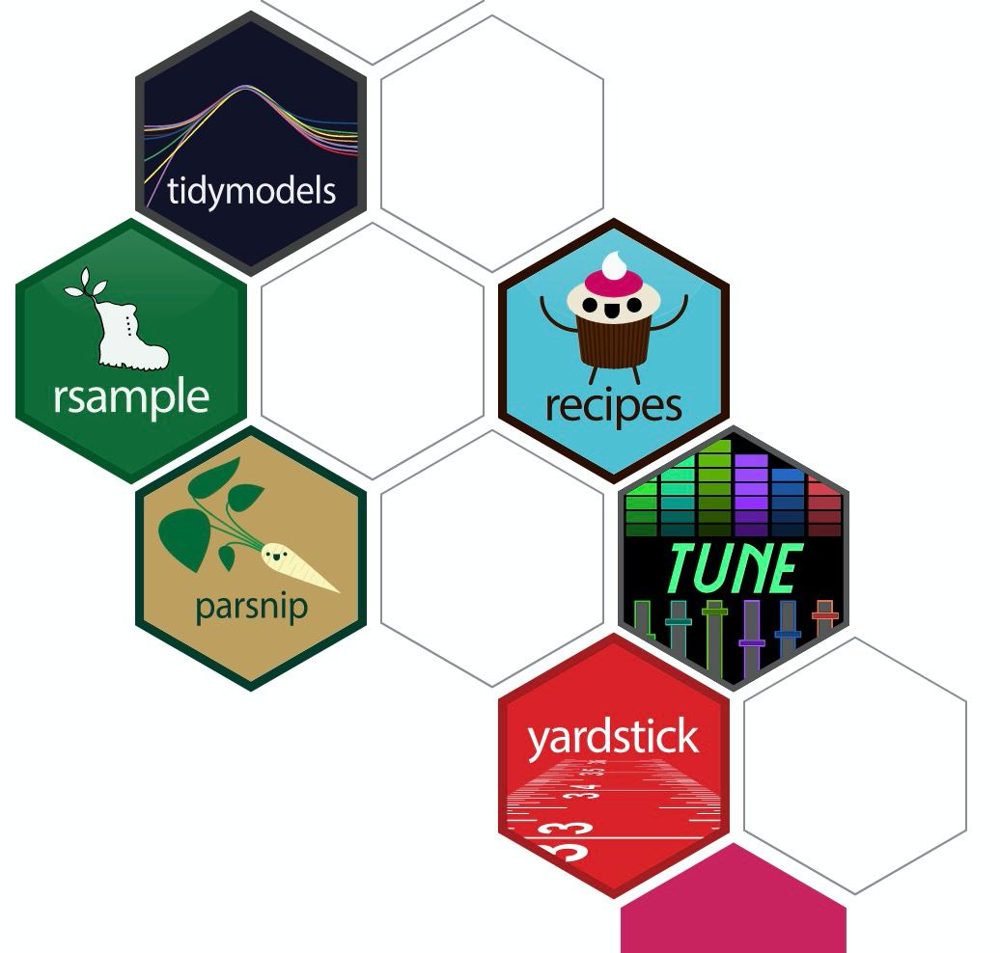
``` 

]

---

# Modelando con .orange[TIDYMODELS]

En uno de los paquetes de `{tidymodels}`, el paquete `{rsample}`, nos proporciona **.bg-purple_light[herramientas para generar particiones]** de train-validación-test al inicio de nuestro proceso.

--

&nbsp;

Usaremos la función `initial_split()`, de forma estratificada por la variable objetivo con

* `strata = Species` indicándole la variable por la que estratificar
* `prop = 0.7` indicándole que el 70% será train y el 30% test (de momento sin validación).

```{r}
library(tidymodels)
iris_split <- initial_split(iris, strata = Species, prop = 0.7)
```

**.bg-red_light[IMPORTANTE]**: la partición deberá hacer siempre DESPUÉS de un posible muestreo (si fuese necesario).


---

# Modelando con .orange[TIDYMODELS]

En `iris_split` no se **.bg-purple_light[ejecutado nada]**: solo están guaradas las **.bg-purple_light[instrucciones]**.

.pull-left[

```{r}
iris_split
```

]

.pull-right[

```{r}
iris_train <- training(iris_split)
iris_test <- testing(iris_split)
```

]

--

Tras aplicar las instrucciones, comprobamos la estratificación.

```{r}
iris_train %>% count(Species) %>% mutate(porc = n / sum(n))
```

---

# Modelando con .orange[TIDYMODELS]

La idea detrás de la filosofía  de `{tidymodels}` es tratar por separado la **.bg-purple_light[depuración]** de los datos, el **.bg-purple_light[modelo]** o paradigma de aprendizaje que se quiere aplicar, la **.bg-purple_light[optimización de los parámetros]** de dicho modelo, el **ajuste**, la **evaluación** y la **predicción** correspondiente.

El objetivo será crear un **.bg-purple_light[flujo de trabajo flexible]**, con una filosofía similar a la que hay detrás de cocinar un plato:

* **.bg-purple_light[Escribimos la receta]**: una lista de pasos e instrucciones.

* **.bg-purple_light[Preparamos los utensilios de cocina]**: en nuestro caso, el modelo.

* **.bg-purple_light[Cocinamos]**: con la receta + utensilios podemos **.bg-purple_light[cocinar el plato muchas veces]**, con **.bg-purple_light[distintos lotes de ingredientes (datos)]**.

También podemos aplicar una **.bg-purple_light[receta distinta a distintos ingredientes]**, o incluso **.bg-purple_light[combinar partes de dos recetas]**. 

---

# Modelando con .orange[TIDYMODELS]

El primer paso en nuestra receta será indicarle en `recipe()` los **.bg-purple_light[datos]** y la **.bg-purple_light[«fórmula»]** de nuestro modelo (en nuestro caso le indicaremos que vamos la objetivo será `Species` frente al resto de predictoras numéricas). La receta **.bg-purple_light[guardará los roles]**: 4 predictoras y 1 objetivo

```{r}
iris_rec <- recipe(data = iris_train, Species ~ .)
```

.pull-left[

```{r}
iris_rec
```

]

.pull-right[

```{r}
summary(iris_rec)
```

]


---

# Modelando con .orange[TIDYMODELS]

Una receta puede **.bg-purple_light[asignar varios roles]** a cada variable: una variable puede ser `predictor`, `outcome` o cualquier otro rol no predefinido.

* `update_role()`: **.bg-purple_light[modifica]** el rol (lo crea si no tiene, borra si lo tenía).

```{r}
iris_rec <-
  recipe(data = iris_train, Species ~ .) %>% 
  update_role(starts_with("Sepal"), new_role = "sepal") %>% 
  update_role(starts_with("Petal"), new_role = "petal")
```

.pull-left[

```{r}
iris_rec
```

]

.pull-right[

```{r}
summary(iris_rec)
```

]

---

# Modelando con .orange[TIDYMODELS]

* `add_role()`: **.bg-purple_light[añade]** un rol a una variable que ya tiene uno (no borra el ya existente)

```{r}
iris_rec <-
  iris_rec %>% 
  add_role(ends_with("Length"), new_role = "length") %>% 
  add_role(ends_with("Width"), new_role = "width")
```

.pull-left[

```{r}
iris_rec
```

]

.pull-right[

```{r}
summary(iris_rec)
```

]

---

# Modelando con .orange[TIDYMODELS]

* `remove_role()`: **.bg-purple_light[elimina]** un rol ya existente

```{r}
iris_rec <-
  iris_rec %>% remove_role(ends_with("Length"), old_role = "length") %>% 
  remove_role(ends_with("Width"), old_role = "width") %>% 
  remove_role(starts_with("Sepal"), old_role = "sepal") %>% 
  remove_role(starts_with("Petal"), old_role = "petal")
```

.pull-left[

```{r}
iris_rec
```

]

.pull-right[

```{r}
summary(iris_rec)
```

]

---

# Modelando con .orange[TIDYMODELS]

La idea es que las acciones que hagamos de depuración podremos **.bg-purple_light[personalizarlas para cada tipo de rol]**. La idea es **.bg-purple_light[añadir pasos]** la `recipe()`, algo así como la receta escrita que tenemos guardada en un cajón para preparar un plato: la receta por sí sola no te cocina, simplemente es una lista de instrucciones, lista para cuando la necesites.

&nbsp;

Las funciones que empiezan por `step_...()` tienen **.bg-purple_light[implementadas muchas de las funcionalidades tidyverse]**: la diferencia al incluirlo en la receta es que se **.bg-purple_light[ejecutará en todas las particiones]** cada vez que dicha receta se aplique (pudiéndose aplicar a diferentes modelos).

* `step_arrange()`
* `step_filter()`
* `step_count()`
* `step_mutate()`
* `step_select()`

---

# Modelando con .orange[TIDYMODELS]

En nuestro caso, en la receta indicaremos la **.bg-purple_light[lista de acciones que hemos decidido]** en diapositivas anteriores (con `step_...()`)


```{r}
iris_rec <-
  recipe(data = iris_train, Species ~ .) %>%
  step_mutate(across(Sepal.Length:Sepal.Width,
                     function(x) { ifelse(abs(scores(x, type = "z")) > 2.5, mean(x, rm.na = TRUE), x) }),
              across(Petal.Length:Petal.Width,
                     function(x) { ifelse(abs(scores(x, type = "mad")) > 3, median(x, rm.na = TRUE), x) })) %>% 
  step_select(-Petal.Length) %>%
  step_mutate(across(c(everything(), -Species), rescale))
```


---

# Modelando con .orange[TIDYMODELS]


```{r}
iris_rec
```

---

# .orange[TIDYMODELS]: .green[RECIPE]

Lo hecho anteriormente es una traducción literal (con `step_...()`) de lo que sabíamos hacer con tidyverse. Pero además de todo eso tendremos **.bg-purple_light[muchas funciones concretas para facilitar]** la depuración de nuestras variables (por roles).

--

Dado que el tratamiento de outliers lo estamos haciendo de manera distinta en las variables de sépalo que en las de pétalo, lo primero que haremos es **.bg-purple_light[asignar]** roles (sin eliminar el rol de predictor que ya tiene, así que lo haremos con `add_role()`)

```{r}
iris_rec <-
  recipe(data = iris_train, Species ~ .) %>%
  add_role(starts_with("Sepal"), new_role = "sepal") %>% 
  add_role(starts_with("Petal"), new_role = "petal")
```


---

# .orange[TIDYMODELS]: .green[RECIPE]

Tras ello **.bg-purple_light[detectaremos outliers]** (transformando a `NA`)

```{r}
iris_rec <-
  iris_rec %>% 
  step_mutate(across(starts_with("Sepal"), function(x) { ifelse(abs(scores(x, type = "z")) > 2.5, NA, x) }),
              across(starts_with("Petal"), function(x) { ifelse(abs(scores(x, type = "mad")) > 3, NA, x) }))
```

--

Y decidiremos cómo **.bg-purple_light[tratar los ausentes]** (los existentes y los generados al detectar los outliers). Tenemos muchísimas funciones para ello (ver `step_impute_...()`):

.pull-left[

* `step_impute_mean()`, `step_impute_median()` y `step_impute_mode()`: imputamos por media, mediana o moda.

* `step_impute_knn()`: usaremos un knn previo para imputar los ausentes.

]

.pull-right[

```{r}
iris_rec <-
  iris_rec %>% 
  step_impute_mean(has_role("sepal")) %>% 
  step_impute_median(has_role("petal"))
```

Fíjate la **.bg-purple_light[utilidad de los roles]**: con `has_role()` podemos indicarle a qué variables aplicar la acción.

]

---

# .orange[TIDYMODELS]: .green[RECIPE]

Para tratar los **.bg-purple_light[problemas de colinealidad]** usaremos directamente `step_corr()`, al que le tendremos que pasar un umbral en `threshold`: se queda solo con una variable de todo par de variables cuya **.bg-purple_light[correlación en valor absoluto supere el umbral]** (en este caso usaremos `all_numeric_predictors()` para considerar solo las predictoras numéricas)


```{r}
iris_rec <-
  iris_rec %>% 
  step_corr(all_numeric_predictors(), threshold = 0.9)
```


--

Por último, le indicaremos con `step_range()` que nos **.bg-purple_light[normalice por rango]** las variables predictoras que sean numéricas, y añadimos siempre un último **.bg-purple_light[filtro de cero varianza]** para que nos elimine las variables con varianza constante.


```{r}
iris_rec <-
  iris_rec %>%
  step_range(all_numeric_predictors()) %>% 
  step_zv(all_predictors())
```

---

# .orange[TIDYMODELS]: .green[RECIPE]


Esta será por tanto nuestra **receta completa**:

```{r}
iris_rec <-
  # Fórmula y datos
  recipe(data = iris_train, Species ~ .) %>%
  # Roles
  add_role(starts_with("Sepal"), new_role = "sepal") %>% 
  add_role(starts_with("Petal"), new_role = "petal") %>% 
  # Detectar outliers
  step_mutate(across(starts_with("Sepal"), function(x) { ifelse(abs(scores(x, type = "z")) > 2.5, NA, x) }),
              across(starts_with("Petal"), function(x) { ifelse(abs(scores(x, type = "mad")) > 3, NA, x) })) %>% 
  # Imputar ausentes
  step_impute_mean(has_role("sepal")) %>% 
  step_impute_median(has_role("petal")) %>% 
  # Filtro de correlación
  step_corr(all_numeric_predictors(), threshold = 0.9) %>% 
  # Normalizar por rango
  step_range(all_numeric_predictors()) %>% 
  # Filtro de cero varianza
  step_zv(all_predictors())
```

---

# .orange[TIDYMODELS]: .green[RECIPE]

```{r}
iris_rec
```

---

# .orange[TIDYMODELS]: .green[RECIPE]

Tras «redactar» la receta **.bg-purple_light[hornear la receta]** a unos datos, haciiendo uso de `bake()`, y en `new_data` le podemos indicar el dataset al que aplicaremos la receta (si `new_data = NULL`, se hará con el conjunto de entrenamiento).

```{r}
bake(iris_rec %>% prep(), new_data = NULL)
```
  

---

# Fase 4: .orange[MODELIZACIÓN]


Tras la receta vamos a **.bg-purple_light[definir el modelo en abstracto]**, sin pasarle aún datos

* `nearest_neighbor()`: definimos el modelo KNN
  - `mode = ...`: puede ser **"classification"** o **"regression"**
  - `neighbors = ...`: número k de vecinos.
  - `weight_func = ...`: método de ponderación de distancias. Las diferentes opciones de las puedes ver en <https://epub.ub.uni-muenchen.de/1769/>
  - `dist_power = ...`: exponente a usar en nuestra familia de métricas de Minkowski
  
* `set_engine("kknn")`: motor interno que usa para optimizar el modelo.
  
```{r}
knn_model <-
  nearest_neighbor(mode = "classification", neighbors = 10,
                   weight_func = "inv", dist_power = 2) %>%
  set_engine("kknn") # «motor interno» que realiza el ajuste
```


---

# Fase 4: .orange[MODELIZACIÓN]


```{r}
knn_model <-
  nearest_neighbor(mode = "classification", neighbors = 10,
                   weight_func = "inv", dist_power = 2) %>%
  set_engine("kknn") # «motor interno» que realiza el ajuste
knn_model
```


---

# .orange[TIDYMODELS]: .green[FLUJO]


* Tenemos una **.bg-purple_light[receta]** para preprocesar los datos, una lista de instrucciones.
* Tenemos los **.bg-purple_light[utensilios de cocina]** (modelo).
* Tenemos los **.bg-purple_light[ingredientes (datos)]**

Todo ello lo **.bg-purple_light[juntaremos en un flujo de trabajo]** con `workflow()`

```{r}
iris_wflow <-
  workflow() %>% add_recipe(iris_rec) %>% add_model(knn_model)
iris_wflow
```


---

# .orange[TIDYMODELS]: .green[AJUSTE]

El siguiente paso, una vez que tenemos construido el flujo de trabajo, es **.bg-purple_light[aplicarlo al conjunto de entrenamiento]** con `fit(data = iris_train)` (es aquí donde el algoritmo aprenderá del conjunto de entrenamiento, aunque en el caso de knn deberá calcular siempre la distancia de cada punto al resto)

```{r}
iris_knn_fit <- iris_wflow %>% fit(data = iris_train)
iris_knn_fit
```

---

# Fase 5: .orange[PREDICCIÓN Y EVALUACIÓN]


Tras realizar el ajuste, con `predict()` podremos **.bg-purple_light[obtener las predicciones]** de `Species` de nuestro **.bg-purple_light[conjunto de test]** (en este caso concreto del knn, lo que hará será calcular los vecinos de cada registro de test usando los registros de train)

```{r}
predict(iris_knn_fit, iris_test)
```

---

# Fase 5: .orange[PREDICCIÓN Y EVALUACIÓN]


Recuerda que el objetivo de estos algoritmos es **.bg-purple_light[estimar aquellas probabilidades de pertenencia]** teóricas del clasificador Bayesiano (y que desconocemos), algo que podemos obtener añadiendo `type = "prob"`

```{r}
predict(iris_knn_fit, iris_test, type = "prob")
```

---

# Fase 5: .orange[PREDICCIÓN Y EVALUACIÓN]


En muchas ocasiones querremos tener una **.bg-purple_light[visión conjunta]**: ver la clasificación realizada de cada registro pero también ver los valores de cada registro, juntando en una sola tabla los datos originales y las predicciones con `augment()`

```{r}
prob_test <- augment(iris_knn_fit, iris_test)
prob_test
```

---

# Fase 5: .orange[PREDICCIÓN Y EVALUACIÓN]


La **.bg-purple_light[matriz confusión]** de verdaderos positivos y negativos, y falsos positivos y negativos, de la que saldrán todas las métricas que usemos para **.bg-purple_light[evaluar nuestro modelo]** se podrán obtener con `conf_mat(truth = ..., estimate = ...)`, indicándole la **.bg-purple_light[columna con la clase real]** y la **.bg-purple_light[columna con la clase predicha]** (que como ves le podemos cambiar el nombre si queremos, por defecto es `.pred_class`)

```{r}
conf_mat_test <- 
  prob_test %>%
  rename(pred_species = .pred_class) %>% 
  conf_mat(truth = Species, estimate = pred_species)
conf_mat_test
```

---

# Fase 5: .orange[PREDICCIÓN Y EVALUACIÓN]

Por último podemos  **.bg-purple_light[obtener la mayoría de métricas]** haciendo uso de `summary()`, aplicado a dicha matriz de confusión

```{r}
conf_mat_test %>% summary()
```

---

# Fase 5: .orange[PREDICCIÓN Y EVALUACIÓN]


```{r}
conf_mat_test %>%
  summary() %>%
  filter(.metric %in% c("accuracy", "sens", "spec"))
```

Fíjate que aunque no sea un problema de clasificación binaria nos proporciona métricas como la sensibilidad y especificidad: lo que es, **.bg-purple_light[para cada clase, construir una matriz de confusión]** (ser setosa vs no serlo, ser virginica vs no serlo, ser versicolor vs no serlo), y devuelve la **.bg-purple_light[media de las tres sensibilidad o especificidades]**


---

class: inverse center middle
name: clase-8

# CLASE 8: profundizando en tidymodels

&nbsp;

### [Repaso knn en iris](#repaso-knn-iris)

### [Complicamos el asunto: hoteles](#knn-hoteles)

### [Fase 2: exploratorio](#fase2-hoteles)

### [Fase 3: modificación](#fase3-hoteles)

### [Fase 4: modelización](#fase4-hoteles)

### [Fase 5: evaluación](#fase5-hoteles)

---


# Fase 1: .orange[¿MUESTREO?]

```{r}
iris %>%
  count(Species) %>%
  mutate(porc = 100 * n/sum(n))
```

En el caso del `iris` no necesitamos hacerlo ya que tenemos pocas observaciones y, además, la **.bg-purple_light[variable objetivo está balanceada]**

---

# Fase 2: .orange[EXPLORACIÓN]

* **.bg-purple_light[Resumen numérico]**: ausentes, medidas de centralización, medidas de dispersión, problemas de codificación, etc.

.pull-left[

```{r eval = FALSE}
library(skimr)
iris %>% skim()
```

]

.pull-right[

```{r echo = FALSE,  out.width = "100%", fig.align = "center"}

``` 

]

---

# Fase 2: .orange[EXPLORACIÓN]

* **.bg-purple_light[Dependencia]**: correlación entre predictoras, **predictoras vs objetivo**

```{r}
iris %>%
  group_by(Species) %>% summarise(mean = across(where(is.numeric), mean)) %>% 
  ungroup()
```

```{r}
library(corrplot)
cor_matrix <- iris %>% select(where(is.numeric)) %>% cor()
cor_matrix
# corrplot(iris %>% %>% select(where(is.numeric)) %>% cor())
```

---

# .orange[PARTICIONES]

```{r}
# Partición 70-30% de train y test (solo instrucciones)
iris_split <- initial_split(iris, strata = Species, prop = 0.7)
iris_split

# Aplicamos partición (ejecuta instrucciones)
iris_train <- training(iris_split)
iris_test <- testing(iris_split)

# Comprobamos estratos
iris_train %>% count(Species) %>% mutate(porc = 100 * n / sum(n))
iris_test %>% count(Species) %>% mutate(porc = 100 * n / sum(n))
```

---

# Fase 3: .orange[MODIFICACIÓN]


* **.bg-purple_light[Receta y roles]**: lo primero es **.bg-orange[definir la receta]** (indicando la partición de train y la objetivo vs todas) y los **.bg-orange[roles]** de las variables (permitiendo una depuración personalizada)

```{r}
# Receta
iris_rec <-
  recipe(data = iris_train, Species ~ .) %>%
  # Roles
  add_role(starts_with("Sepal"), new_role = "simétrica") %>% 
  add_role(starts_with("Petal"), new_role = "no simétrica")
iris_rec
```

---

# Fase 3: .orange[MODIFICACIÓN]


* **.bg-purple_light[Tipología de las variables]** --> todas las predictoras son numéricas (no necesito recategorizar o dummys)

*  **.bg-purple_light[Codificación de las variables]** --> todas mis variables tienen un **.bg-orange[rango coherente]**

* **.bg-purple_light[Atípicos y ausentes]**. ¿Tengo **.bg-orange[valores atípicos (outliers)]**? 


```{r}
iris_rec <-
  iris_rec %>%
  # Detectar outliers
  step_mutate(across(starts_with("Sepal"),
                     function(x) { ifelse(abs(scores(x, type = "z")) > 2.5, NA, x) }),
              across(starts_with("Petal"),
                     function(x) { ifelse(abs(scores(x, type = "mad")) > 3, NA, x) }))
```

---

# Fase 3: .orange[MODIFICACIÓN]


* **.bg-purple_light[Ausentes]**: ¿tengo **.bg-orange[datos ausentes]**? ¿Cómo los imputo?

```{r}
iris_rec <-
  iris_rec %>%
  # Imputar ausentes
  step_impute_mean(has_role("simétrica")) %>% 
  step_impute_median(has_role("no simétrica"))
```

* **.bg-purple_light[Añadir info]** --> en este caso no necesito **crear nuevas variables** que nos aporte info extra

---

# Fase 3: .orange[MODIFICACIÓN]

* **.bg-purple_light[Selección de variables]**. ¿Necesito seleccionar variables? ¿Tengo **.bg-orange[problemas de dependencia o colinealidad]**? ¿Tengo alguna de varianza cero (es decir, sin información)? 

* **.bg-purple_light[Normalizar variables]**. ¿Tengo ya mis variables preparadas (tras tratar lo anterior) para la métrica que vaya usar?


```{r}
iris_rec <-
  iris_rec %>%
  # Filtro de correlación
  step_corr(all_numeric_predictors(), threshold = 0.9)%>% 
  # Filtro de cero varianza
  step_zv(all_predictors()) %>%
  # Normalizar por rango
  step_range(all_numeric_predictors())
```

---

# .orange[HORNEADO]

**.bg-purple_light[Horneamos la receta]** sobre las particiones para comprobar que la fase 3 se ha realizado correctamente

```{r}
bake(iris_rec %>% prep(), new_data = NULL)
bake(iris_rec %>% prep(), new_data = iris_test)
```

---

# Fase 4: .orange[MODELADO]

Definimos los **.bg-purple_light[parámetros de nuestro modelo]**

```{r}
# Modelo knn
knn_model <-
  nearest_neighbor(mode = "classification", neighbors = 10,
                   weight_func = "inv", dist_power = 2) %>%
  set_engine("kknn") # el «motor» que realiza el ajuste
knn_model
```

---

# .orange[FLUJO Y AJUSTE]: receta (fase 3) + modelo (fase 4)

```{r}
# Flujo
iris_wflow <-
  workflow() %>%
  add_recipe(iris_rec) %>%
  add_model(knn_model)

# Ajuste
iris_knn_fit <- iris_wflow %>% fit(data = iris_train)
```

---

# Fase 5: .orange[PREDICCIÓN/EVALUACIÓN]

Usando `predict()` obtenemos las predicciones (usando el ajuste, y le proporcionamos un archivo a clasificar, en este caso test). Nos **.bg-purple_light[devuelve la clase predicha]** 

```{r}
# Predecir el conjunto test: devuelve la clase
predict(iris_knn_fit, iris_test)
```

---

# Fase 5: .orange[PREDICCIÓN/EVALUACIÓN]

Con `type = prob` obtenemos la **.bg-purple_light[probabilidad estimada de pertenencia]** a cada clase predicha (recuerda que nuestro objetivo es estimar las probabilidades de pertenencia teóricas que nos daría el clasificador Bayesiano)

```{r}
# Predecir las probabilidades (las necesitamos para la ROC)
predict(iris_knn_fit, iris_test, type = "prob")
```


---

# Fase 5: .orange[PREDICCIÓN/EVALUACIÓN]

Con `augment()` podemos obtener **.bg-purple_light[predicciones y datos en una sola tabla]**

```{r}
# Incluir predicciones en tabla
prob_test <- augment(iris_knn_fit, iris_test)
prob_test
```


---

# Fase 5: .orange[PREDICCIÓN/EVALUACIÓN]

* **.bg-purple_light[Matriz de confusión]**: matriz con los valores enfrentando **.bg-orange[etiqueta real vs predicha]** (hay que pasarle la salida del `augment` e indicarle como `truth = ...` la clase real y como `estimate = ...` la clase predicha, que por defecto sale como `.pred_class`

```{r}
# Matriz de confusión: etiqueta real vs etiqueta predicha
conf_mat_test <-
  prob_test %>%
  conf_mat(truth = Species, estimate = .pred_class)
conf_mat_test 
```

---

# Fase 5: .orange[PREDICCIÓN/EVALUACIÓN]

* **.bg-purple_light[Métricas]**: las obtenemos haciendo un `summary()` a la matriz de confusión

```{r}
# Métricas en test
metricas <- conf_mat_test %>% summary()
metricas
```

---

# ¿Y AHORA?

¿Basta con esto?

--

En realidad no: recuerda que nuestro objetivo es minimizar el error, y para saber si estamos en un modelo óptimo, sobreajustado o bajoajustado, necesitamos **.bg-purple_light[ejecutar el paradigma de aprendizaje con diferentes parámetros]**.

* Diferentes k (`neighbors = ...`),
                
* Diferentes métricas (`dist_power = ...`) 

* Diferentes ponderaciones (`weight_func = ...`)

&nbsp;

Dicha evaluación la deberíamos hacer en **.bg-purple_light[validación]** pero vamos a pasar a un ejemplo más complicado con más filas para ello.

---

name: knn-hoteles


# Ejemplo real: .orange[HOTELES]

Vamos ir a **ejemplo real**, haciendo uso de un **.bg-purple_light[dataset de reservas de hotel]**

```{r}
hoteles_bruto <- read_csv(file = "./datos/hoteles.csv")
```

Los datos forman parte de un **.bg-purple_light[conjunto de reservas de hotel]** elaborado por Antonio et al., 2019 con 50 000 registros de reservas

📚 **Detalle de variables**: <https://linkinghub.elsevier.com/retrieve/pii/S2352340918315191>

---

# Ejemplo real: .orange[HOTELES]

Lo primero es conocer las variables.

```{r eval = FALSE}
glimpse(hoteles_bruto)
```
--

* `hotel`: tipo de hotel (urbano o resort)
* `lead_time`: número de días entre la reserva y la estancia.
* `stays_in_weekend_nights, stays_in_week_nights`: noches en fin de semana y entre semana
* `adults`: número de adultos
* `children`: ¿la reserva tiene niños?
* `meal`: régimen de comidas
* `country`: país de origen
* `market_segment`: segmento de mercado de la reserva
* `distribution_channel`: canal de distribución de la oferta
* `is_repeated_guest`: ¿repite como huésped?

---

# Ejemplo real: .orange[HOTELES]


Lo primero es conocer las variables.

```{r eval = FALSE}
glimpse(hoteles_bruto)
```


* `previous_cancellations`: cancelaciones previas
* `previous_bookings_not_canceled`: reservas previas (no canceladas)
* `reserved_room_type, assigned_room_type`: tipo de habitación reservada/asignada
* `booking_changes`: cambios en la reserva
* `deposit_type`: tipo de depósito
* `days_in_waiting_list`: días en lista de espera
* `customer_type`: tipo de cliente
* `average_daily_rate`: tarifa media diaria
* `required_car_parking_spaces`: ¿parking?
* `total_of_special_requests`: número de requisitos especiales demandados
* `arrival_date`: fecha de llegada 


---

# Ejemplo real: .orange[HOTELES]


```{r eval = FALSE}
glimpse(hoteles_bruto)
```

El objetivo será **.bg-purple_light[predecir si una reserva incluye niños/as o no]**, por lo que `children` será nuestra variable objetivo. Primer paso: conocer cómo se **.bg-purple_light[distribuyen los niveles de la objetivo]** (es binaria)

```{r}
hoteles_bruto %>% 
  count(children) %>%
  mutate(porc = 100*n/sum(n))
```

---

name: fase2-hoteles

# Fases 1-2-3: .orange[HOTELES]

Examina los datos y apunta las **.bg-purple_light[decisiones que deberíamos adoptar]**:

&nbsp;

* ¿Necesitamos **.bg-orange[muestreo]**? ¿De qué forma? ¿Podremos permitirnos crear esta vez un dataset de **.bg-orange[validación]**?

* ¿De qué **.bg-orange[tipo]** es cada variable? ¿Tenemos **.bg-orange[problemas de codificación o rango]**?

* ¿Cómo **.bg-orange[afectan las predictoras]** a los niveles de la variable objetivo?

* ¿Hay problemas de **.bg-orange[dependencia]** entre las variables?

* ¿Necesitamos **.bg-orange[recategorizar]** las variables? ¿Tenemos variables de **.bg-orange[fecha]**?

* ¿Tenemos **.bg-orange[datos atípicos]**?  ¿Tenemos **.bg-orange[datos ausentes]**? ¿Cómo imputarlos?

* ¿Todas las variables son **.bg-orange[numéricas]** para poder aplicar la métrica?

&nbsp;

**.bg-purple_light[Filosofía]**: las modificaciones «estructurales» las hacemos fuera de la receta (modificando la base de datos), las modificaciones más concretas para un algoritmo dentro de la receta (sin modificar la base de datos).


---

# Factores

* **.bg-purple_light[Factores]**: lo primero que debemos decidir es si las variables de tipo texto son **.bg-purple_light[variables cualitativas]** (factores) o meros id's.

```{r}
hoteles_bruto %>% select(where(is.character)) %>% glimpse()
```

---

# Factores

Todas las variables de tipo texto representan **.bg-purple_light[categorías de una cualitativa]** así que las convertimos todas ellas a factor.

--

```{r}
hoteles <- 
  hoteles_bruto %>%
  mutate(across(where(is.character), as_factor))
hoteles
```

---

# Factores

* **.bg-purple_light[Ordinales]**: ¿existe alguna variable que pueda ser ordinal?

--

La variable `meal` si sigue una jerarquía: `SC` (sin nada) < `BB` (Bed & Breakfast) < `HB` (Half board, media pensión) < `FB` (Full board, pensión completa). Además tenemos un nivel para los desconocidos llamado `Undefined`

```{r}
hoteles %>%
  count(meal) %>% 
  mutate(porc = 100*n/sum(n))
```

---

# Factores

* **.bg-purple_light[Ordinales]**: convertimos `meal` a cualitativa pero ordinal.

```{r}
hoteles <-
  hoteles %>%
  mutate(meal = factor(meal, levels = c("Undefined", "SC", "BB", "HB", "FB"),
                       ordered = TRUE))
```

--

Ahora podremos hacer **.bg-purple_light[operaciones asociadas a una jerarquía]** como comparar registros

```{r}
hoteles %>%
  group_by(meal < "HB") %>% #<<
  count() %>% 
  ungroup()
```


---

# Variable hotel

Una vez convertidas en cualitativas analicemos cada una de ellas. La variable `hotel` es **.bg-purple_light[binaria]**: urbanos vs resort (60% vs 40% aprox)

```{r}
hoteles %>%
  count(hotel, sort = TRUE) %>%
  mutate(porc = 100*n/sum(n))
```

---

# Variable hotel

Parece que cuando hay **.bg-purple_light[niños en la reserva]** se opta ligeramente **.bg-purple_light[más por los resort]**

```{r}
hoteles %>%
  group_by(hotel) %>% 
  count(children) %>%
  mutate(porc = 100*n/sum(n)) %>% 
  ungroup()
```

---


# Variable meal

La variable `meal` toma **.bg-purple_light[5 modalidades]**: quizás para algunos algoritmos haga falta reagrupar niveles (por ejemplo `Undefined` con `SC`)

```{r}
hoteles %>%
  count(meal, sort = TRUE) %>%
  mutate(porc = 100*n/sum(n))
```


---

# Variable meal

Parece que **.bg-purple_light[cuando hay niños]** en la reserva hay el **.bg-purple_light[doble de reservas con pensión completa]**: aunque haya pocos registros de `meal = "FB"` pueden ser determinantes. El 11% de la reservas sin niños van sin nada, mientras que solo el 3% de las reservas con niños.

.pull-left[

```{r}
hoteles %>%
  group_by(meal) %>% 
  count(children) %>% 
  mutate(porc = 100*n/sum(n)) %>% 
  ungroup()
```

]

.pull-right[

```{r}
hoteles %>%
  group_by(children) %>% 
  count(meal) %>% 
  mutate(porc = 100*n/sum(n)) %>% 
  ungroup()
```

]

---

# Variable country

La variable `country` toma **.bg-purple_light[155 modalidades]** pero tan solo **.bg-purple_light[21 modalidades aparecen en más del 0.5% de registros]** (una de ellas es NULL): quizás sea más práctico reagrupar niveles de esos países (representan juntos aprox el 10% del total).

```{r}
hoteles %>%
  count(country, sort = TRUE) %>%
  mutate(porc = 100*n/sum(n), cumul = cumsum(porc))
```


---


# Variable country

Aunque hay países que representa muy poco de los datos, parece que **.bg-purple_light[algunos son más propensos a reservas con niños]**.

```{r}
hoteles %>%
  group_by(country) %>% count(children) %>% 
  mutate(porc_children = 100*n/sum(n)) %>% 
  ungroup()
```


---

# Variable market_segment

La variable `market_segment` toma **.bg-purple_light[7 modalidades]** aunque algunas representan menos del 1% del total.

```{r}
hoteles %>%
  count(market_segment, sort = TRUE) %>%
  mutate(porc = 100*n/sum(n), cumul = cumsum(porc))
```

---

# Variable market_segment

Fíjate que aunque `market_segment = "Aviation"` representa muy pocos registros, el 100% son sin niños (casi similar con `market_segment = "Corporate"` y `market_segment = "Groups"`)

```{r}
hoteles %>%
  group_by(market_segment) %>% 
  count(children) %>% 
  mutate(porc = 100*n/sum(n)) %>% 
  ungroup()
```


---

# Variable distribution_channel

La variable `distribution_channel` toma **.bg-purple_light[5 modalidades]**  pero solo **.bg-purple_light[3 de ellas agrupan ya más del 99%]** de los registros.

```{r}
hoteles %>%
  count(distribution_channel, sort = TRUE) %>%
  mutate(porc = 100*n/sum(n),
         cumul = cumsum(porc))
```

---

# Variable distribution_channel

Fíjate que de `distribution_channel = "Undefined"` y `distribution_channel = "GDS"` representan **.bg-purple_light[muy pocos registros]**, y todos con una sola modalidad en la objetivo (pero solo pesan el 0.2% de los datos)

```{r}
hoteles %>%
  group_by(distribution_channel) %>% 
  count(children) %>% 
  mutate(porc = 100*n/sum(n)) %>% 
  ungroup()
```


---

# Variable reserved_room_type

La variable `reserved_room_type` toma **.bg-purple_light[9 modalidades]** (no nos especifican si hay jerarquía) pero **.bg-purple_light[solo 5 de ellas tienen un peso superior al 1%]** de los registros.

```{r}
hoteles %>%
  count(reserved_room_type, sort = TRUE) %>%
  mutate(porc = 100*n/sum(n),
         cumul = cumsum(porc))
```

---

# Variable reserved_room_type

Fíjate que `reserved_room_type` será **.bg-purple_light[tremendamente importante]**: si la habitación es de tipo F, el 47% viene con niños (frente al 8% global), del 70% incluso si es de tipo C

```{r}
hoteles %>%
  group_by(reserved_room_type) %>% 
  count(children) %>% 
  mutate(porc = 100*n/sum(n)) %>% 
  ungroup()
```

---

# Variable assigned_room_type

La variable `assigned_room_type` toma **.bg-purple_light[10 modalidades]** (no nos especifican si hay jerarquía) pero solo 7 de ellas tienen un peso superior al 1% de los registros.

```{r}
hoteles %>%
  count(assigned_room_type, sort = TRUE) %>%
  mutate(porc = 100*n/sum(n),
         cumul = cumsum(porc))
```

Como sucedía antes `assigned_room_type` será tremendamente importante

---

# Variable reserved_room_type vs assigned_room_type

Quizás sea interesante, al margen del tipo de habitación, ver que sucede cuando la **.bg-purple_light[asignada es distinta de la reservada]**. 

```{r}
hoteles %>%
  mutate(same_room = as.character(reserved_room_type) == as.character(assigned_room_type)) %>%
  group_by(same_room) %>% 
  count(children) %>% 
  mutate(porc = 100*n/sum(n)) %>% 
  ungroup()
```

No parece que influya significativamente

---

# Variable deposit_type

La variable `deposit_type` toma **.bg-purple_light[3 modalidades]** pero el 99.6% de los registros es la misma.

```{r}
hoteles %>%
  count(deposit_type, sort = TRUE) %>%
  mutate(porc = 100*n/sum(n), cumul = cumsum(porc))
```

---

# Variable deposit_type

Además de ser **.bg-purple_light[muy pocos]** los registros que no sean `No_Deposit`, prácticamente su totalidad son **.bg-purple_light[sin niños]** (clase ya mayoritaria en los datos).

```{r}
hoteles %>%
  group_by(deposit_type) %>% 
  count(children) %>% 
  mutate(porc = 100*n/sum(n)) %>% 
  ungroup()
```

---

# Variable deposit_type

La variable `customer_type` toma **.bg-purple_light[4 modalidades]** pero **.bg-purple_light[dos de ellas representan más del 95%]** de los registros.

```{r}
hoteles %>%
  count(customer_type, sort = TRUE) %>%
  mutate(porc = 100*n/sum(n),
         cumul = cumsum(porc))
```

---

# Variable deposit_type

El 88% de las reservas con niños son de tipo `"Transient"`

```{r}
hoteles %>%
  group_by(children) %>% 
  count(customer_type) %>% 
  mutate(porc = 100*n/sum(n)) %>% 
  ungroup()
```


---


# Variable required_car_parking_spaces

La variable `required_car_parking_spaces` es binaria (muy desbalanceada).

```{r}
hoteles %>%
  count(required_car_parking_spaces, sort = TRUE) %>%
  mutate(porc = 100*n/sum(n),
         cumul = cumsum(porc))
```

---

# Variable required_car_parking_spaces

El % de las reservas con niños es el doble cuando hay parking solicitado.

```{r}
hoteles %>%
  group_by(children) %>% 
  count(required_car_parking_spaces) %>% 
  mutate(porc = 100*n/sum(n)) %>% 
  ungroup()
```

---

# Dependencia entre variables cualitativas

Más allá del análisis exploratorio numérico, podemos ejecutar un **.bg-purple_light[contraste de independencia]** (prueba $\chi^2$ de independencia) para tener mayor certeza de si la predictora es dependiente o no de la variable objetivo (si fuera independiente, no tendría sentido mantenerla)

```{r warning = FALSE}
chisq.test(hoteles$children, hoteles$hotel)
```

Si fijamos $\alpha = 0.05$ (nivel de significación), si p-valor < 0.05 deberíamos rechazar la **.bg-purple_light[hipótesis nula de independencia]** (bajo dicho nivel).

---

# Dependencia entre variables cualitativas


Podemos hacerlo con **.bg-purple_light[todas las variables a la vez]** enfrentándola a la objetivo

```{r warning = FALSE}
chisq <-
  tibble("variable" = hoteles %>% select(where(is.factor)) %>% names(),
         "p_value" = hoteles %>% select(where(is.factor)) %>%
           map_dbl(.f = function(x) { chisq.test(hoteles$children, x)$p.value}))
chisq %>% arrange(desc(p_value))
```

---

# Dependencia entre variables cualitativas


```{r warning = FALSE}
chisq %>% filter(p_value > 0.05)
```

**.bg-purple_light[No hay evidencia suficiente para decir que existe predictora independiente de la objetivo]** (al 95% de confianza) según la prueba de independencia realizada

---

# Resumen de las variables cuali

* `hotel` --> **.bg-purple_light[no hacer nada]**.

* `meal`: aunque haya pocos registros de `meal = "FB"`, parece que pueden ser determinantes --> **.bg-purple_light[reagrupar "Undefined" con "SC" y dejar "FB"]**.

* `country`: tan solo 21 de ellas aparecen en más del 0.5% de registros (una de ellas es NULL) --> **.bg-purple_light[reagrupar niveles de países minoritarios]** (representan juntos aprox el 10% del total) quedándonos con aquellos que superen en un mínimo de representatividad (más fino: incluir también los que sean más propensos que otros a reservas con niños).

* `market_segment`:  algunas representan menos del 1% del total, aunque para `market_segment = "Aviation"` el 100% son sin niños (casi similar con `market_segment = "Corporate"` y `market_segment = "Groups"`) --> **.bg-purple_light[agrupar los 3 junto con "complementary"]** (pesan muy poco estos últimos) en un `"others"`.

* `distribution_channel`: solo 3 de ellas agrupan ya más del 99% de los registros --> **.bg-purple_light[reagrupar "Corporate" (98.9% no children), "GDS" (100%  no children) y "Undefined" (solo 1 dato)]** en `"others"` (aprox. el 7% de los datos).

---

# Resumen de las variables cuali


* `reserved_room_type`: solo 5 de ellas tienen un peso superior al 1% de los registros, si es de tipo **.bg-purple_light[C, H o L]** (juntas suman el 1.3% de los datos aprox.), con niños superan el 70% --> **.bg-purple_light[reagrupamos las 3]** en un `"others"`

* `assigned_room_type`: con el mismo razonamiento que antes podemos **.bg-purple_light[reaagupar las categorías H-I-K]** en `"others"` 

* `deposit_type`: el 99.6% de registros es la misma -->  muy poca varianza y además casi todos de esas clases minoritarias son de la clase mayoritaria de la  objetivo  --> **.bg-purple_light[eliminar]**

* `customer_type` --> **.bg-purple_light[reagrupar "Transient" y "others"]**

* `required_car_parking_spaces` --> **.bg-purple_light[no hacer nada]**


---

# Variables de tipo de fecha

Solo tenemos una `arrival_date`: ¿qué parte de la fecha exactamente influye más? ¿El año? ¿El mes? ¿El día como número en sí o el día de la semana? Tras extraer info la eliminaremos.

```{r}
hoteles <- 
  hoteles %>% 
  mutate(m_arr = month(arrival_date), y_arr = year(arrival_date),
         wday_arr = wday(arrival_date))

hoteles %>% group_by(y_arr) %>% count(children) %>% 
  mutate(porc = 100*n/sum(n))
```

No parece que el año influya mucho (veremos si influyen los días festivos en sí)

---

# Variables de tipo de fecha

Parece que los meses de julio, agosto y diciembre influye mucho al tener más niños --> podemos agrupar los meses en `"month_holy"` y `"month_no_holy"`

```{r}
hoteles %>%  group_by(m_arr) %>% count(children) %>% 
  mutate(porc = 100*n/sum(n))
```


---

# Variables de tipo de fecha

Parece que los viernes, sábados y domingos hay más reservas con niños --> podemos agrupar los meses en `"weekend"` y `"workday"`

```{r}
hoteles %>%  group_by(wday_arr) %>%  count(children) %>% 
  mutate(porc = 100*n/sum(n))
```

---

# Variables numéricas

* `lead_time`: variable con una alta concentración a la izquierda (cola pesada a la derecha), con un máximo de días muy elevado.

```{r}
hoteles %>% summarise(min_lead = min(lead_time), max_lead = max(lead_time))
```

--

Quizas no tenga sentido tanto número de días entre la reserva y la estancia --> todo lo que **.bg-purple_light[supere 365, imputarle 366]** (representan además el 1.35% solo)

```{r}
hoteles %>% group_by(lead_time > 365) %>% count()
```

---

# Variables numéricas

* `stays_in_weekend_nights`: en realidad es una variable cualitativa más que cuantitativa, y a partir de 2 noches en festivo representa menos de 1% --> podríamos probar a **.bg-purple_light[dejarla tal cual o recategorizarla en 4 categorías]** (ninguna - 1 - 2 - más de 2)

```{r}
hoteles %>%
  count(stays_in_weekend_nights, sort = TRUE) %>% 
  mutate(porc = 100*n/sum(n), cumul = cumsum(porc))
```

---

# Variables numéricas

* `stays_in_week_nights`: en realidad es una variable cualitativa más que cuantitativa, y a partir de 5 noches representa menos del 5% --> podríamos probar a **.bg-purple_light[dejarla tal cual o recategorizarla en 7 categorías]** (ninguna - 1 - 2 - 3 - 4 - 5 - más de 5)

```{r}
hoteles %>%
  count(stays_in_week_nights, sort = TRUE) %>% 
  mutate(porc = 100*n/sum(n), cumul = cumsum(porc))
```

---

# Variables numéricas

* `adults`: en realidad es una variable cualitativa más que cuantitativa --> podríamos probar a **.bg-purple_light[dejarla tal cual o recategorizarla en 4 categorías]** (ninguno - 1 - 2 - más de 2)

```{r}
hoteles %>% count(adults, sort = TRUE) %>% 
  mutate(porc = 100*n/sum(n), cumul = cumsum(porc))
```

---

# Variables numéricas

* `is_repeated_guest`: en realidad es **.bg-purple_light[binaria]** --> hay que convertirla a cualitativa (factor)

```{r}
hoteles %>% count(is_repeated_guest, sort = TRUE) %>% mutate(porc = 100*n/sum(n))

hoteles %>% group_by(is_repeated_guest) %>% count(children) %>% 
  mutate(porc = 100*n/sum(n)) %>% ungroup()
```

---

# Variables numéricas

* `previous_cancellations`: el 99.238% son 0 (y la mayoría de 1, sin niños) --> **.bg-purple_light[eliminar]**

* `previous_bookings_not_canceled`: el 95.47% son 0, el 1.9% son 1 --> se podría probar a **.bg-purple_light[dejarla tal cual o recategorizar en 3 categorías]**

```{r}
hoteles %>% count(previous_cancellations == 0, sort = TRUE)

hoteles %>% count(previous_bookings_not_canceled, sort = TRUE) %>%
  mutate(porc = 100*n/sum(n), cumul = cumsum(porc))
```


---

# Variables numéricas

* `booking_changes`: el 94.194% son 0 o 1 --> se podría probar a **.bg-purple_light[dejarla numérica o recategorizar en 3 categorías]**

```{r}
hoteles %>% count(booking_changes, sort = TRUE) %>% 
  mutate(porc = 100*n/sum(n), cumul = cumsum(porc))
```

---

# Variables numéricas

* `days_in_waiting_list`: el 98% de los registros son 0 (y de los que no son casi todos no tienen niños) --> **.bg-purple_light[eliminar variable]**

```{r}
hoteles %>% count(days_in_waiting_list, sort = TRUE) %>% 
  mutate(porc = 100*n/sum(n), cumul = cumsum(porc))
```

---

# Variables numéricas

* `average_daily_rate`: es la única numérica continua pero tiene **.bg-purple_light[valores negativos o cero]** (deberían ser estrictamente positivo) --> el 2.33% tiene **.bg-purple_light[problemas de codificación o rango]** que deberemos pasar a ausentes e imputarles un valores luego.

```{r}
hoteles %>% count(average_daily_rate <= 0) %>% mutate(porc = 100*n/sum(n))
```

---

# Variables numéricas

* `total_of_special_requests`: más del 96% son 0-1-2 --> se podría **.bg-purple_light[dejar numérica o recategorizarla en 4 categorías]**.

```{r}
hoteles %>% count(total_of_special_requests, sort = TRUE) %>% 
  mutate(porc = 100*n/sum(n), cumul = cumsum(porc))
```

---

# .orange[COLINEALIDAD]

Por último, nos falta comprobar los **.bg-purple_light[problemas de  colinealidad]** entre las predictoras numéricas. 

Podemos tratar las **.bg-orange[numéricas por separado]** (aunque tengamos muchas que en realidad hacen más de cuali que de cuanti)

```{r}
library(corrr)
cor_matrix <- hoteles %>% select(where(is.numeric)) %>% cor() %>% round(2)
cor_matrix
```

---

# .orange[COLINEALIDAD]

```{r eval = FALSE}
cor_matrix %>%
  corrplot(method = "number", tl.cex = 0.55, number.cex = 0.7, type = "lower")
```

```{r echo = FALSE, out.width = "40%", fig.align = "center"}
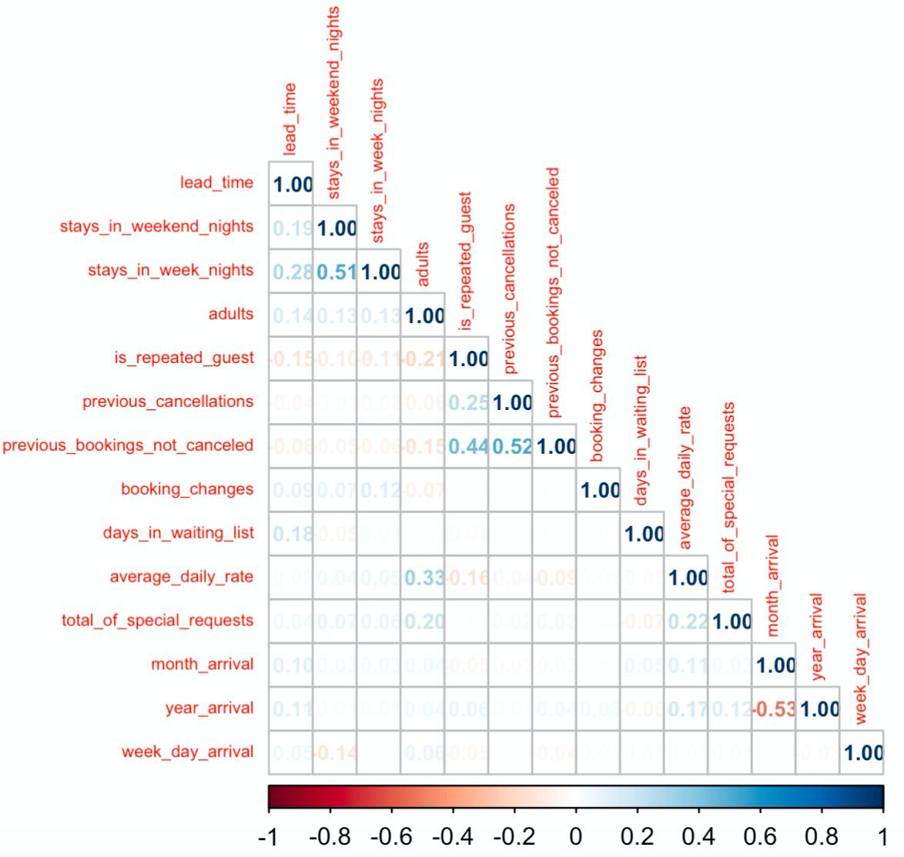
``` 

No parece existir una correlación elevada entre ninguna.

---

name: fase3-hoteles

# Fase 3: .orange[MODIFICACIÓN]

Con lo observado en la fase de exploración deberemos tomar **.bg-purple_light[dos tipos decisiones]**:

* las que afectan a la **.bg-orange[base de datos en general]**: pasar a factores, problemas de codificación o rango, variables que no aportan, creación de variables en general, etc

* las que afectan a un **.bg-orange[algoritmo en concreto]**: normalización para la métrica, recategorización, tratamiento de outliers/ausentes, dummyficación, etc.

---

# Fase 1: .orange[MUESTREO]

Pero antes...¿hace falta **.bg-purple_light[muestreo]**? Parece que sí dado que tenemos muchas filas (al menos para hacer pruebas) --> muestreo **.bg-purple_light[estratificado]** (por ej., del 10%)

```{r}
hoteles_sample <-
  hoteles %>%
  group_by(children) %>% 
  slice_sample(prop = 0.10) %>%
  ungroup()

hoteles_sample %>%
  count(children) %>% 
  mutate(porc = 100*n/sum(n))
```

¿Hace falta algo más?


---

# Fase 3: .orange[MODIFICACIÓN] (fuera receta)

```{r}
# Muestreo del 10
hoteles_sample <-
  hoteles_bruto %>%
  group_by(children) %>% 
  slice_sample(prop = 0.10) %>%
  ungroup()

# Eli%minar variables
hoteles_sample <-
  hoteles_sample %>%
  select(-c(deposit_type, days_in_waiting_list, previous_cancellations))
```

---

# Fase 3: .orange[MODIFICACIÓN] (fuera receta)

```{r}
# Convertir a cuali
hoteles_sample <-
  hoteles_sample %>% 
  mutate(across(where(is.character), as_factor)) %>%
  mutate(meal = factor(meal, levels = c("Undefined", "SC", "BB", "HB", "FB"),
                       ordered = TRUE))

# Modificaciones de variables existentes
hoteles_sample <-
  hoteles_sample %>% 
  mutate(lead_time = ifelse(lead_time > 365, 366, lead_time),
         average_daily_rate = ifelse(average_daily_rate <= 0, NA, average_daily_rate),
         is_repeated_guest = as_factor(is_repeated_guest))
```

---

# .orange[RECETA]: .green[PARTICIÓN]

Primero dividimos en **.bg-purple_light[test y lo demás]**, con `initial_split()`

```{r}
# Partición 10% de test
hoteles_split <- initial_split(hoteles_sample, strata = children, prop = 0.9)
hoteles_split

# Aplicamos partición
hoteles_train <- training(hoteles_split)
hoteles_test <- testing(hoteles_split)

# Comprobamos estratos
hoteles_train %>% count(children) %>% mutate(porc = 100 * n / sum(n))
hoteles_test %>% count(children) %>% mutate(porc = 100 * n / sum(n))
```

---

# .orange[RECETA]: .green[PARTICIÓN]

Tras ello usamos `validation_split()` para **.bg-purple_light[dividir en train-validación]** lo que teníamos en `hoteles_train` (75% del 90% = 67.5% vs 22.5%)

```{r}
# Validación
hoteles_val <- validation_split(hoteles_train, strata = children,
                                prop = 0.75)
hoteles_val
```

---

# .orange[RECETA]: .green[ROLES]


```{r}
# Receta
hoteles_rec <-
  # Fórmula y datos
  recipe(data = hoteles_train, children ~ .)%>%
  # Roles
  add_role(contains("date"), new_role = "date") %>% 
  add_role(where(is.factor), new_role = "cuali") %>% 
  add_role(where(is.numeric), new_role = "cuanti") %>% 
  add_role(c(hotel, required_car_parking_spaces, is_repeated_guest), new_role = "binary") %>% 
  add_role(where(is.numeric) & !average_daily_rate, new_role = "maybe_cuali")
```


---

# .orange[RECETA]: .green[FECHAS]

* Con `step_date()` podemos indicarle directamente que extraiga de la fecha los elementos que le pidamos (en nuestro caso mes, día de la semana y año).

* Con `listHolidays()` del paquete `{timeDate}` seleccionaremos festivos relevantes internacionalmente, y con `step_holiday()` marcaremos las fechas que lo sean. Tras ello eliminaremos la fecha original con `step_rm()`.

```{r}
library(timeDate)
# Receta
hoteles_rec <-
  hoteles_rec %>% 
  step_date(arrival_date, features = c("month", "dow", "year")) %>% 
  step_holiday(arrival_date,
               holidays = c(listHolidays("\\Mary"), listHolidays("\\Easter"),
                            listHolidays("\\Christ"), "NewYearsDay")) %>%
  # Eliminamos la variable
  step_rm(arrival_date)
```

---


# .orange[RECETA]: .green[OUTLIERS/AUSENTE]

Tras ello de momento vamos a **.bg-purple_light[detectar outliers a lo bruto]**: detectando por la media e imputando por la media, pero solo de `has_role("cuanti")`, para no incluir a las binarias. Las cuali por la moda en caso de haber ausentes.

```{r}
library(outliers)
# Receta
hoteles_rec <-
  hoteles_rec %>% 
  # Detectar outliers
  step_mutate(across(where(is.numeric), function(x) { ifelse(abs(scores(x, type = "z")) > 2.5 & !is.na(x), NA, x) })) %>% 
  # Imputar ausentes
  step_impute_mean(has_role("cuanti")) %>%
  step_impute_mode(has_role("cuali"))
```

---

# .orange[RECETA]: .green[TRANSFORMACIONES]

* Aplicamos un filtro de correlación para **.bg-purple_light[prevenir problemas de colinealidad]**.

* **.bg-purple_light[Normalizamos por rango]** para la métrica.

* **.bg-purple_light[Dummyficamos]** las cualitativas: crea k-1 variables binarias por de cada cualitativa de k niveles.

* **.bg-purple_light[Filtro de cero varianza]**.

```{r}
# Receta
hoteles_rec <-
  hoteles_rec %>% 
  # Filtro de correlación
  step_corr(has_role("cuanti"), threshold = 0.9) %>% 
  # Normalizar por rango
  step_range(all_numeric_predictors()) %>%
  # Dummyficamos
  step_dummy(all_nominal(), -all_outcomes()) %>% 
  # Filtro de cero varianza
  step_zv(all_predictors())
```


---

name: fase4-hoteles

# Fase 4: .orange[MODELO Y FLUJO]


Una vez definida la receta, definimos el **.bg-purple_light[modelo]** y unimos con la receta creando un **.bg-purple_light[flujo de clasificación]**

```{r}
# Modelo
knn_model <-
  nearest_neighbor(mode = "classification", neighbors = 15,
                   weight_func = "inv", dist_power = 2) %>%
  set_engine("kknn")

# Flujo de trabajo
hoteles_wflow <-
  workflow() %>%
  add_recipe(hoteles_rec) %>%
  add_model(knn_model)
```

---

name: fase5-hoteles

# Fase 5: .orange[EVALUACIÓN] en validación

En este caso tenemos un conjunto de validación guardado en `hoteles_val`. Para realizar el **.bg-purple_light[ajuste en train y después obtener las métricas en validación]** usaremos `fit_resamples()`, pasándole como argumento los conjuntos de validación que tengamos y las **.bg-purple_light[métricas]** que queremos que evaluar (con `metric_set()` y el nombre de la métrica)

```{r}
# Solo contra un conjunto de validación
hoteles_knn_fit_val <-
  hoteles_wflow %>%
  fit_resamples(hoteles_val,
                metrics = metric_set(accuracy, sensitivity,
                                     specificity, roc_auc))
```


---

# Fase 5: .orange[EVALUACIÓN] en validación


Con `collect_metrics()` obtenemos las métricas pedidas (dado que solo tenemos un conjunto de validación `n = 1` y `std_err = NA`, ya que no tiene con qué promediar al solor tener uno)

```{r}
collect_metrics(hoteles_knn_fit_val)
```

---

# Fase 5: .orange[EVALUACIÓN] con .green[CURVA ROC]

Si te has fijado amén de la sensibilidad y la especificidad (y la tasa de bien de clasificados o accuracy), le hemos pedido una métrica llamada `roc_auc`: el **.bg-purple_light[área bajo la curva ROC]**

```{r}
collect_metrics(hoteles_knn_fit_val)
```

--

¿Qué es la **.bg-purple_light[curva ROC]**? Si recuerdas, aunque la salida que usamos normalmente es la clase predicha directamente, nuestro objetivo subyacente es **.bg-purple_light[calcular la probabilidad estimada de pertenencia]**

---

# Fase 5: .orange[EVALUACIÓN] con .green[CURVA ROC]

En clasificación binaria, por defecto, estamos estableciendo que la **.bg-purple_light[predicción es 1]** si la probabilidad estimada de serlo es **.bg-purple_light[superior a 0.5]**. 

Imagina que el objetivo es clasificar si una vacuna puede salir al mercado. ¿Es **.bg-purple_light[suficiente exigirle un umbral del 50%]** para asignar un 1?

--

La idea detrás de la curva ROC es **.bg-purple_light[mover dicho umbral de probabilidad]**, desde el 0 hasta el 1, para **.bg-purple_light[cada uno de esos umbrales]** calcular

* **sensibilidad** (% de 1's reales que han sido clasificados como tal)

* **especificidad** (% de 0's reales que han sido clasificados como tal)

Y pintarlos en un gráfico (eje x = 1 - especificidad, eje y = sensibilidad)

---

# Fase 5: .orange[EVALUACIÓN] con .green[CURVA ROC]

.pull-left[

* Eje X: **.bg-purple_light[1 - especificidad]**, conocido como False Positive Rate (FPR), ya que es el % de 0's reales que han sido mal clasificados (como falsos positivos).

* Eje Y: **.bg-purple_light[sensibilidad]**, conocido como True Positive Rate (TPR), ya que es el % de 1's reales que han sido clasificados como tal (verdaders positivos).

* **.bg-purple_light[AUC ROC]**: área bajo la curva ROC, medida que oscila entre 0 (no hay curva) y 1 (la curva es el cuadrado entero). Clasificador dummy aleatorio: 0.5.

]

.pull-right[


```{r echo = FALSE,  out.width = "110%", fig.align = "left"}
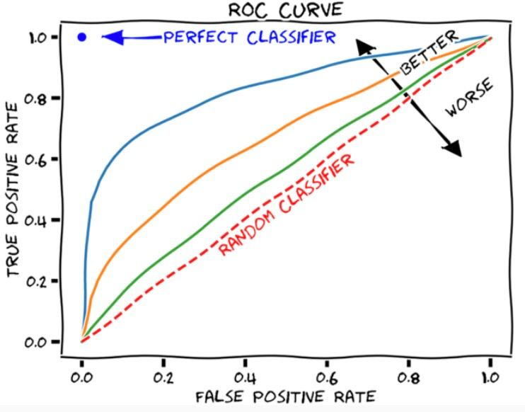
``` 

]

---

# Fase 5: .orange[EVALUACIÓN] con .green[CURVA ROC]


```{r echo = FALSE,  out.width = "50%", fig.align = "center"}
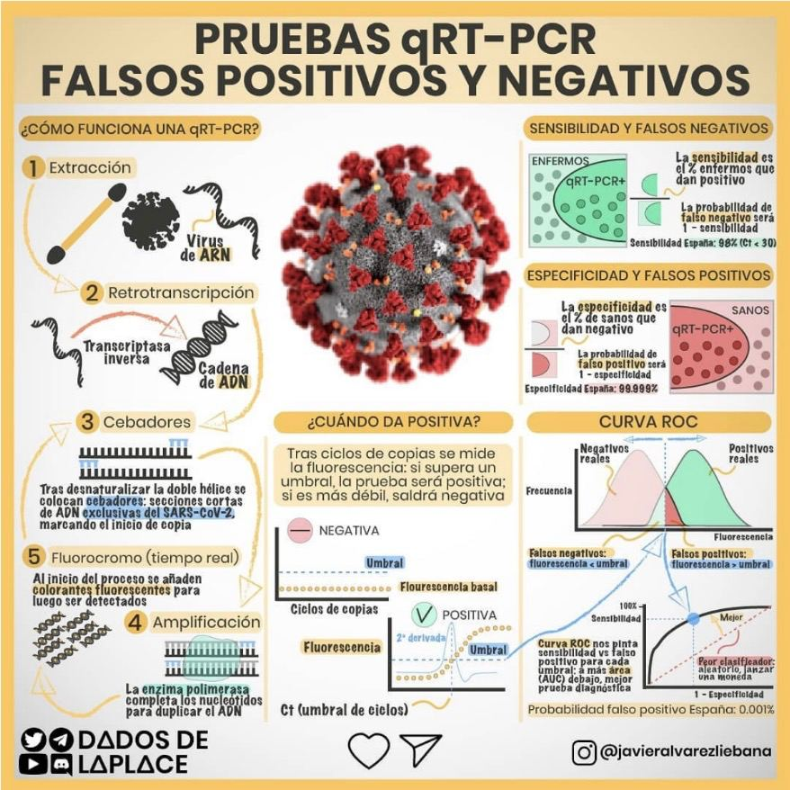
``` 


---

# .orange[TUNE]

Hasta ahora solo hemos probado un modelo pero la idea es **.bg-purple_light[entrenar varios modelos]** y **.bg-purple_light[evaluar en validación]** su calidad o conveniencia.

Para ello lo que vamos a hacer al definir el modelo es **.bg-purple_light[no asignar una constante a los parámetros]** sino que los vamos a dejar sin fijar, asignándoles `tune()` (entre paréntesis una **etiqueta** para luego ser usada), para luego indicarle los «diales» en los que queremos que «sintonice»

```{r}
# Modelo con tune
knn_model_tune <-
  nearest_neighbor(mode = "classification", neighbors = tune("k"),
                   weight_func = tune("weight"), dist_power = tune("dist")) %>%
  set_engine("kknn")
```

---

# .orange[TUNE]

```{r}
# Nuevo flujo (con tune)
hoteles_wflow <-
  workflow() %>%
  add_recipe(hoteles_rec) %>%
  add_model(knn_model_tune)
```

El anterior modelo **.bg-purple_light[no tiene parámetros fijados]** a priori: vamos a definir un **.bg-purple_light[grid de parámetros]**

Por ejemplo, podemos definir un grid de 7 valores de `k` (lo demás fijo)

```{r}
grid_knn <- 
  tibble("k" = seq(20, 140, by = 20), "weight" = rep("inv", 7),
         "dist" = rep(2, 7))
grid_knn
```

---

# .orange[TUNE GRID]

Con `tune_grid()` le indicaremos que **.bg-purple_light[en lugar de entrenar un solo modelo]** entre uno por cada fila de parámetros que tenemos en `grid_knn`, y con `control_grid(verbose = TRUE)` le indicamos que nos informe del proceso. Tras ello con `collect_metrics()` obtendremos de una tacada la métrica de todos.

```{r}
# Entrenamos y evaluamos los 7 modelos
hoteles_knn_fit_tune <-
 hoteles_wflow %>%
  tune_grid(resamples = hoteles_val, grid = grid_knn,
            control = control_grid(verbose = TRUE),
            metrics = metric_set(accuracy, sensitivity,
                                 specificity, roc_auc))
hoteles_knn_fit_tune %>% collect_metrics()
```

---


# .orange[TUNE GRID]

Ese grid también podemos definirlo para el resto de parámetros, definiendo los **.bg-purple_light[posibles valores para cada parámetro]** y probar **.bg-purple_light[todas las combinaciones entre ellos]**. Para eso haremos uso de `expand_grid()`

```{r}
expand_grid("x" = 1:3, "y" = 8:9)
```

---

# .orange[TUNE GRID]

Con dicha herramienta vamos a **.bg-purple_light[crear 18 modelos]**: 3 valores diferentes de vecinos, 2 tipos de promedios y 3 métricas.

```{r}
grid_knn <-
  expand_grid("k" = c(10, 50, 100),
              "weight" = c("inv", "gaussian"),
              "dist" = c(0.01, 2, 10))
grid_knn
```

---

# .orange[TUNE GRID]

```{r}
# Entrenamos y evaluamos los 18 modelos
hoteles_knn_fit_tune <-
 hoteles_wflow %>%
  tune_grid(resamples = hoteles_val, grid = grid_knn,
            control = control_grid(verbose = TRUE),
            metrics = metric_set(accuracy, sensitivity,
                                 specificity, roc_auc))
hoteles_knn_fit_tune %>% collect_metrics()
```

---

# .orange[TUNE GRID]


Incluso podemos generar ese grid de una manera más  **.bg-purple_light[automática]** haciendo uso de `update()` y `grid_regular()`, para el mismo número de valores en cada parámetro (por ejemplo 3 en cada uno, siempre que haya tres opciones dadas)

```{r}
grid_knn <-
  extract_parameter_set_dials(hoteles_wflow) %>%
  # Actualizamos
  update(k = neighbors(range = c(10, 100)),
         weight = weight_func(values = c("inv", "gaussian")),
         dist = dist_power(range = c(0.1, 10))) %>%
  grid_regular(levels = 3) 
grid_knn # 18 modelos (3 x 2 x 3)
```

---

# .orange[TUNE GRID]

```{r}
# Entrenamos y evaluamos los 18 modelos
hoteles_knn_fit_tune <-
 hoteles_wflow %>%
  tune_grid(resamples = hoteles_val, grid = grid_knn,
            control = control_grid(verbose = TRUE),
            metrics = metric_set(accuracy, sensitivity,
                                 specificity, roc_auc))
hoteles_knn_fit_tune %>% collect_metrics()
```

---


class: inverse center middle
name: clase-9


# CLASE 9: otras validaciones y ggplot

&nbsp;

### [Mejor modelo en validación](#show-best)

### [Modelización paralelizada](#parallel)

### [Sobremuestreo](#oversampling)

### [Validación cruzada y bootstrap](#cv-hoteles)

### [Visualización de datos](#dataviz)

---

name: show-best

# Fase 5: .orange[evaluación]

No solo vamos a poder trastear con tidyverse en esos resultados en validación sino que tenemos **.bg-purple_light[dos funciones especialmente pensadas]** para ello: `show_best()` nos devuelve los mejores modelos según la métrica pedida, `select_best()` nos selecciona el mejor

```{r}
# Los mejores según accuraccy
hoteles_knn_fit_tune %>% show_best("accuracy")

# Elegir el mejor según ROC
hoteles_knn_fit_tune %>% select_best("roc_auc")
```

---

# .orange[SELECCIÓN DEL MEJOR]

```{r}
# Finalizamos flujo con el mejor modelo (según una métrica)
best_knn_model_acc <- hoteles_knn_fit_tune %>% select_best("accuracy")
final_wf <- 
  hoteles_wflow %>% 
  finalize_workflow(best_knn_model_acc)
final_wf
```

---

# Fase 5: .orange[EVALUACIÓN EN TEST]

```{r}
# Ajustamos a test con ese modelo seleccionado en validación
final_knn_fit <- 
  final_wf %>%
  last_fit(hoteles_split) 

# Calculamos métricas en test (las indicadas)
final_knn_fit %>% collect_metrics()
```


---

# Fase 5: .orange[PREDICCIÓN EN TEST]

Podemos volver a usar `predict()`, extrayendo el flujo de ese ajuste final con `extract_workflow(final_knn_fit)`

```{r}
# Predecir el conjunto test: devuelve la clase
predict(extract_workflow(final_knn_fit), hoteles_test)
```

---

# Fase 5: .orange[PREDICCIÓN EN TEST]

```{r}
# Predecir las probabilidades (las necesitamos para la ROC)
predict(extract_workflow(final_knn_fit), hoteles_test, type = "prob")
```

---

# Fase 5: .orange[PREDICCIÓN EN TEST]

```{r}
# Incluir predicciones en tabla
prob_test <- augment(extract_workflow(final_knn_fit), hoteles_test)

# Matriz de confusión: etiqueta real vs etiqueta predicha
conf_mat_test <-
  prob_test %>%
  conf_mat(truth = children, estimate = .pred_class)
conf_mat_test 
```

---

# Fase 5: .orange[PREDICCIÓN EN TEST]

```{r}
# todas las métricas en test
conf_mat_test %>% summary()
```

---

# Fase 5: .orange[PREDICCIÓN EN TEST]

Podemos **.bg-purple_light[dibujar la curva ROC]** haciendo uso de `roc_curve()` pasándole el archivo con las predicciones, y usando las probabilidades de ser 1 (guardadas en `.pred_children` en nuestro conjunto). Aprenderemos a dibujarla mejor pero podemos mientras hacerlo con `autoplot()`

```{r}
roc_data <- prob_test %>% roc_curve(truth = children, .pred_children)
roc_data %>% autoplot()
```


---

name: parallel

# Computación .orange[EN PARALELO]

Si queremos probar muchos modelos y/o nuestro volumen de datos es elevado, quizás nos lleve demasiado tiempo: vamos a hacer una incursión a la **.bg-purple_light[programación paralelizada]**. 

```{r}
library(parallel)
library(doParallel)
```

--

Ambos paquetes serán los que nos permitan paralelizar de forma sencilla. La idea es **.bg-purple_light[mandar tareas independientes a procesadores distintos]**, de forma que si una tarea tarda 6 minutos en un pc, al mandarlo a otros dos procesadores, el tiempo pueda bajar hasta los 2 minutos (no es del todo lineal ya que hay un tiempo mínimo necesario en cada paso).

---

# Computación .orange[EN PARALELO]

En muchas empresas u organismos de investigación se suele tener a disposición de los usuarios un conjunto de ordenadores (un clúster) común a todos de forma que cada persona pueda mandar sus hilos en paralelo. Pero…no tenemos de eso. ¿Entonces?

&nbsp;

Vamos a **.bg-purple_light[paralelizar en NUESTRO PROPIO ORDENADOR]**: un ordenador suele tener **.bg-purple_light[varios procesadores o cores]** que pueden funcionar de manera «independiente» uno de otro. Vamos a detectar la cantidad de núcleos de los que podemos disponer con `detectCores()`.

```{r}
# Detectamos los cores que tenemos
detectCores()
```

---

# Computación .orange[EN PARALELO]

A la hora de paralelizar es importante que lo hagamos con cuidado ya que puede que nuestro ordenador se quede colgado: mi consejo es que definas el número de cores a usar como los que tienes menos uno.

Con `makeCluster()` montamos los **.bg-purple_light[clúster en cada nodo]** y con `registerDoParallel()` registramos la paralelización (puedes ver los hilos abiertos con `showConnections()`).

```{r}
# Iniciamos la paralelización
clusters <- detectCores() - 1
make_cluster <- makeCluster(clusters)
registerDoParallel(make_cluster)
showConnections()
```


---

# Computación .orange[EN PARALELO]
 
El único cambio respecto a antes es indicarle `tune_grid()`  que queremos la **.bg-purple_light[validación paralelizada]**, con `control = control_grid(allow_par = TRUE)`. Para que no queden hilos sueltos es importante que al **.bg-purple_light[acabar la paralelización le indiquemos que cerramos los clúster]**.

```{r}
# Entrenamos y evaluamos los 18 modelos en paralelo
hoteles_knn_fit_tune <-
 hoteles_wflow %>%
  tune_grid(resamples = hoteles_val, grid = grid_knn,
            control = control_grid(verbose = TRUE, allow_par = TRUE,
                                   pkgs = c("outliers")),
            metrics = metric_set(accuracy, sensitivity,
                                 specificity, roc_auc))
# finalizamos clusters
stopCluster(make_cluster)
registerDoSEQ()

# Métricas
hoteles_knn_fit_tune %>% collect_metrics()
```


---

name: oversampling

# .orange[SOBREMUESTREO] .green[BAJOMUESTREO]

Un paso que hemos obviado: si tenemos la **.bg-purple_light[variable objetivo desbalanceada]** solo aprenderá de la clase mayoritaria. Este desbalanceamiento podemos mitigarlo realizando **.bg-purple_light[sobremuestro/bajomuestreo]**, añadiendo `step_upsample()` (del paquete `{themis}`) a la receta (el parámetro `over_ratio` nos cuantifica el % de la clase minoritaria entre la mayoritaria).

```{r}
hoteles_rec_oversampling <-
  hoteles_rec %>% 
  themis::step_upsample(children, over_ratio = 0.5)

bake(hoteles_rec_oversampling %>% prep(), new_data = NULL) %>%
  count(children) %>% 
  mutate(porc = 100*n/sum(n))
```

---

# .orange[SOBREMUESTREO] .green[BAJOMUESTREO]

Basta con repetir el proceso con la **receta con sobremuestreo**

```{r eval = FALSE}
# Flujo de trabajo
hoteles_wflow_oversampling <-
  workflow() %>%
  add_recipe(hoteles_rec_oversampling) %>%
  add_model(knn_model_tune)

# Ajuste
hoteles_knn_fit_tune_oversampling <-
  hoteles_wflow_oversampling %>%
  tune_grid(resamples = hoteles_val, grid = grid_knn,
            control = control_grid(verbose = TRUE,
                                   allow_par = TRUE,
                                   pkgs = c("outliers")),
            metrics = metric_set(accuracy, sensitivity,
                                 specificity, roc_auc))
```
  
---

---

names: cv-hoteles

# Validación .orange[CRUZADA v-folds]


* cv v-folds

---

names: bootstrap-val-hoteles

# Validación .orange[BOOTSTRAP]

* Bootstrap Out-of-Bag

---

name: dataviz

# .orange[VISUALIZACIÓN] de datos

---

# .orange[RECURSOS] y .green[BIBLIOGRAFÍA]

&nbsp;


#### 📚 **.bg-purple_light[Artículos o libros]** científicos que han sido sometidos a revisión por pares.

&nbsp;

#### 🔗 **.bg-green_light[Recursos online]** recomendados

&nbsp;

#### 💻 Recursos para la **.bg-orange[programación en R]**

---

# Bibliografía general

📚 **«Statistical tests, P values, confidence intervals, and power: a guide to misinterpretations»**. Greenland et al. (2016) <https://github.com/dadosdelaplace/teaching/blob/main/data_mining/biblio/p-value_Greenland_etal_2016.pdf>

💻 **Tidy Data Tutor**: para visualizar la mecánica interna de `{tidyverse}`. <https://tidydatatutor.com/>

🔗 Web con recursos para la **introducción a la estadística y Machine Learning en R** <https://artofstat.com/>

💻 **Manual introductorio de R** (Javier Álvarez Liébana): <https://dadosdelaplace.github.io/courses-intro-R/>


---

# Bibliografía general

📚 **«The reproducibility of research and the misinterpretation of p-values»**. Colquhoun (2017) <https://github.com/dadosdelaplace/teaching/blob/main/data_mining/biblio/p-values_Colquhoun_2017.pdf>


📚 **«An Introduction to Multivariate Statistical Analysis»**. Anderson (1958) <https://github.com/dadosdelaplace/teaching/blob/main/data_mining/biblio/introduction_mva_anderson_2003.pdf>

📚 **«A New Measure of Rank Correlation»**. Kendall (1938) <https://github.com/dadosdelaplace/teaching/blob/main/data_mining/biblio/correlation_kendall_1938.pdf>

📚 **«The generalised product moment distribution in samples from a normal multivariate population»**. Wishart (1928) <https://github.com/dadosdelaplace/teaching/blob/main/data_mining/biblio/multivariate_normal_wishart_1928.pdf>

📚 **«On lines and planes of closest fit to systems of points in space»**. Pearson (1901) <https://github.com/dadosdelaplace/teaching/blob/main/data_mining/biblio/fit_pearson_1901.pdf>


---

# Recursos dataviz

### Dataviz

📚 **«Gramática de las gráficas: pistas para mejorar las representaciones de datos»**. Sevilla (2005) <http://academica-e.unavarra.es/bitstream/handle/2454/15785/Gram%C3%A1tica.pdf>

📚 **«Quantitative Graphics in Statistics: A Brief History»**. Beniger and Robyn (1978) <https://github.com/dadosdelaplace/teaching/blob/main/bdba-pca-clustering-2022/biblio/graphics_beniger_robin_1978.pdf>
 
 
💻 **«Analizando datos, visualizando información, contando historias»** (curso de dataviz en R). Álvarez-Liébana y Valverde-Castilla (2022) <https://dadosdelaplace.github.io/curso-dataviz-ECI-2022>

📚 **«40 years of boxplots»**. Wickham and Stryjewski (2011) <https://github.com/dadosdelaplace/teaching/blob/main/bdba-pca-clustering-2022/biblio/boxplot_Wickham_Stryjewski_2011.pdf>
 
 


---

# Bibliografía componentes principales

💻 **Componentes principales** en `{tidymodels}`. <https://www.tmwr.org/dimensionality.html#beans>


📚 **«Principal Component Analysis»**. Jolliffe (2002) <https://github.com/dadosdelaplace/teaching/blob/main/bdba-pca-clustering-2022/biblio/pca_jolliffe_2002.pdf>

📚 **«Principal Component Analysis»**. Hervé and Lynne (2010) <http://staff.ustc.edu.cn/~zwp/teach/MVA/abdi-awPCA2010.pdf>

📚 **«Principal Component Analysis: a review and recent developments»**. Jolliffe and Cadima (2016) <https://royalsocietypublishing.org/doi/10.1098/rsta.2015.0202>

🔗 **«The Mathematics Behind Principal Component Analysis»**. Dubey (2018).  <https://towardsdatascience.com/the-mathematics-behind-principal-component-analysis-fff2d7f4b643>


🔗 **«A One-Stop Shop for Principal Component Analysis»**. Brems (2017). <https://towardsdatascience.com/a-one-stop-shop-for-principal-component-analysis-5582fb7e0a9c>

📚 **«On the number of principal components: a test of dimensionality based on measurements of similarity between matrices»**. Dray (2008) <https://github.com/dadosdelaplace/teaching/blob/main/bdba-pca-clustering-2022/biblio/numer_pca_dray_2008.pdf>


---
