```{r settings, include = FALSE, warning = FALSE}
knitr::opts_chunk$set(fig.retina = 3, out.width = "100%",
                      cache = FALSE, comment = ">",
                      echo = TRUE, message = FALSE,
                      warning = FALSE, hiline = TRUE,
                      dpi = 100)
```

```{r xaringan-extra, include = FALSE, warning = FALSE}
# devtools::install_github("gadenbuie/xaringanExtra")
library(xaringanExtra)
use_xaringan_extra(c("tile_view", "animate_css", "tachyons"))
use_tile_view() # panel
use_extra_styles(hover_code_line = TRUE,
                 mute_unhighlighted_code = FALSE) # Hover triangle
# code line
use_clipboard( # About clipboard
  button_text = "Click para copiar código",
  success_text = "Código copiado",
  error_text = "Ctrl+C para copiar"
)

# use_freezeframe() # restarting gifs
# use_animate_all("fade") # animates
use_panelset() # panels 

use_search(show_icon = TRUE)
```

```{r xaringan-themer, include = FALSE, warning = FALSE}
# devtools::install_github("gadenbuie/xaringanthemer")
library(xaringanthemer)
style_duo_accent(primary_color = "#1F4257",
          secondary_color = "#EA9D8E", # #F97B64",
          background_color = "#FFFEFE",
          header_font_google = google_font("Josefin Sans"),
          text_font_google =
            google_font("Montserrat", "300", "300i", "400", "500", "600", "700", "800", "900"),
          code_font_google = google_font("Fira Mono"),
          black = "#1F4257",
          inverse_text_color = "#1F4257",
          inverse_header_color = "#1F4257",
          base_font_size = "21px",
          text_font_size = "1.1rem",
          code_font_size = "1rem",
          header_h1_font_size = "2.8rem",
          header_h2_font_size = "2.3rem",
          header_h3_font_size = "1.8rem",
          code_highlight_color = "rgba(248, 223, 88, 0.25)",
          code_inline_background_color = "rgba(248, 223, 88, 0.6)",
          code_inline_font_size = "1em",
          colors = c(purple = "#74688D",
                     yellow = "#F8DF58",
                     green = "#2c8475",
                     red = "#E54F4D",
                     orange = "#EA9D8E",
                     green_light = "rgba(44, 132, 117, 0.35)",
                     red_light = "rgba(229, 79, 77, 0.7)",
                     purple_light = "rgba(116, 104, 141, 0.5)"),
          text_bold_font_weight = 800,
          link_decoration = "underline dotted",
          link_color = "#74688D",
          inverse_link_color = "#1F4257"
)
```


class: inverse center middle

# ATAJOS DE LAS DIAPOSITIVAS


```{r packages, include = FALSE, warning = FALSE}
library(tidyverse)
library(lubridate)
library(glue)
```


$$\\[2in]$$

.left[Pulsa <kbd-black>O</kbd-black> para ver el **PANEL DE DIAPOSITIVAS**]
.left[Pulsa <kbd-black>H</kbd-black> para ver **OTROS ATAJOS**]

---

# .orange[MATERIAL] de las clases


.pull-left[

- **.bg-purple_light[Diapositivas]** del curso:
<https://dadosdelaplace.github.io/teaching/data_science_seguros/slides>

- **.bg-red_light[Evaluación]** de la asignatura
<https://github.com/dadosdelaplace/teaching/tree/main/data_science_seguros/eval>

- **.bg-yellow[Scripts]** de la asignatura
<https://github.com/dadosdelaplace/teaching/tree/main/data_science_seguros/scripts>

- **.bg-orange[Bibliografía]**: <https://github.com/dadosdelaplace/teaching/tree/main/data_science_seguros/biblio>

&nbsp;

- **.bg-green_light[Manual introductorio de R]**: <https://dadosdelaplace.github.io/courses-intro-R/>

]

---

# Me presento: la turra

.pull-left[

```{r echo = FALSE,  out.width = "80%", fig.align = "left"}
knitr::include_graphics("./img/me.jpeg")
``` 

]

.pull-right[

* **.bg-purple_light[Javier Álvarez Liébana]**, nacido en 1989 en Carabanchel Bajo (Madrid)

* Licenciado (UCM) en **Matemáticas** (Erasmus en Bologna mediante). **Máster (UCM) en Ingeniería Matemática** (2013-2014)


* **.bg-orange[Doctorado en estadística]** por la Universidad de Granada


* Encargado de la **visualización y análisis de datos covid** de la Consejería de Salud del **Principado de Asturias**

]


Intentando eso de la **.bg-yellow[divulgación]** por **Twitter** (@dadosdelaplace) e **Instagram** (@javieralvarezliebana)

---

name: objetivos

# .orange[OBJETIVOS] de la asignatura


El **.bg-purple_light[propósito]** de esta asignatura será triple

- **.bg-orange[Quitarnos el miedo]** a programar: a programar se aprende programando, no hace falta ser Julian Assange para ello


- Aprender a **.bg-orange[abstraer ideas]** para implementarlas en un lenguaje de programación, así como adquirir una base para el **.bg-orange[preprocesamiento, análisis y visualización de datos]**.

- Amén de no tener miedo a hacerlo, encontrarle la **.bg-orange[utilidad]** y entender las facilidades que nos ofrece `R` frente a otras opciones como Excel o SPSS.


&nbsp;

📚 Estas **diapositivas** han sido elaboradas con el propio `R` haciendo uso de los paquetes `{xaringan}`, `{xaringanExtra}` y `{xaringanthemer}`.

---

# .orange[EVALUACIÓN] del bloque

Las 3 sesiones que tendremos contarán un **.bg-purple_light[50% de la nota final]** de la asignatura. La evaluación será mediante 3 entregas:

* **.bg-purple_light[Entrega I]**: contará un **.bg-orange[15% de la nota]** (sobre 100%)

* **.bg-purple_light[Entrega II]**: contará un **.bg-orange[40% de la nota]** (sobre 100%)

* **.bg-purple_light[Entrega III]**: contará un **.bg-orange[45% de la nota]** (sobre 100%)


--

Dos opciones a decidir: **.bg-purple_light[escalar]** los deadline (20 de noviembre - 11 de diciembre - 25 de diciembre, para tener una **retroalimentación** antes de las siguientes, o **.bg-purple_light[acumular]** deadline (todas el 25 de diciembre).

&nbsp;

Además después de cada sesión se planteará una **.bg-purple_light[pequeña entrega]** de ejercicios sencillos que serán **.bg-purple_light[voluntarios]**, con deadline de una semana (antes de la siguiente clase), y que quién quiera entregar recibirá una **.bg-orange[corrección de la misma]** (como si contase para nota).

---

class: inverse center middle

# CLASES

&nbsp;


#### [CLASE 1: intro a R](#clase-1)

#### [CLASE 2: introducción a tidyverse y sesgos](#clase-2)

#### [CLASE 3: introducción al dataviz](#clase-3)

---

class: inverse center middle
name: clase-1

# CLASE 1: introducción a R desde cero.

&nbsp;

### [Introducción a R y R studio: primeros pasos](#instalacion)

### [Variables individuales](#variables)

### [Vectores](#vectores)

### [Ejercicios con vectores](#ejercicios-vectores)

### [Operaciones con vectores](#operaciones-vectores)

### [Ejercicios y entrega](#complementos-I)

---

name: instalacion

# Requisitos

Para la asignatura los únicos **.bg-purple_light[requisitos]** serán:

--

1. **.bg-orange[Conexión a internet]** (para la descarga de algunos datos y paquetes).

--

2. **.bg-orange[Instalar R]**: será nuestro lenguaje, nuestro **.bg-yellow[castellano]** para poder «comunicarnos con el ordenador. La descarga la haremos (gratuitamente) desde <https://cran.r-project.org/>

--

3. **.bg-orange[Instalar R Studio]**. De la misma manera que podemos escribir castellano en un Word o en un tuit, podemos usar **distintos IDE** (entornos de desarrollo integrados, nuestro Office), para que el trabajo sea más cómodo. Nuestro **.bg-yellow[Word]** para nosotros será **RStudio**.

.left[
  
]

.right[
  
]


---

# Instalación de R

El lenguaje `R` será nuestra **.bg-purple_light[gramática]**, nuestra ortografía y nuestro diccionario

.pull-left[


- **Paso 1**: entra en <https://cran.r-project.org/> y selecciona **.bg-purple_light[sistema operativo]**.

- **Paso 2**: para **.bg-purple_light[Mac]** basta con que hacer click en el archivo .pkg, y abrirlo una vez descargado. Para sistemas **.bg-purple_light[Windows]**, debemos clickar en `install R for the first time` y en la siguiente pantalla en `Download R for Windows`. Una vez descargado, abrirlo como cualquier archivo de instalación.

- **Paso 3**: abrir el **ejecutable**.

]

.pull-right[


]

**.bg-green_light[Consejo]**: siempre que tengas que descargar algo de CRAN (ya sea el propio R o un paquete), asegúrate de tener conexión a **.bg-orange[internet]**.


---

# Primera operación

Para comprobar que se ha instalado correctamente, tras abrir `R`, deberías ver una **pantalla blanca** (en realidad se llama **.bg-purple_light[consola]**). Vamos a escribir nuestra **.bg-orange[primera operación]** en la consola:

.pull-left[

* A una variable llamada `a` le asignaremos el valor 1 (asignamos con `<-`, como una flecha)

```{r eval = FALSE}
# Una variable a con valor --> 1
a <- 1 #<<
```

]

--

.pull-right[

* A otra variable llamada `b` le asignaremos el valor 2 (cambia a la izquierda el nombre, cambia a la derecha el valor).

```{r eval = FALSE}
# Una variable b con valor --> 2
b <- 2 #<<
```

]

--

.pull-left[

* Sumamos las variables haciendo `a + b`.

```{r eval = FALSE}
# Primera operación
a <- 1 # Una variable a con valor --> 1
b <- 2 # Una variable b con valor --> 2
a + b #<<
```
]

--

.pull-right[

* El resultado que nos devuelve será `3`.

```{r echo = FALSE}
a <- 1
b <- 2
a + b
```

]

---

# .orange[INSTALACIÓN] de RStudio

El **.bg-purple_ligth[Word]** que usaremos para trabajar y escribir en nuestro lenguaje será **.bg-purple_ligth[RStudio]** (lo que se conoce como un **IDE**, un entorno integrado de desarrollo).

.pull-left[

* **Paso 1**: entra en la [web oficial de RStudio](https://www.rstudio.com/products/rstudio/download/#download) y selecciona la **.bg-purple_light[descarga gratuita]**.

* **Paso 2**: selecciona el ejecutable que te aparezca, acorde a tu sistema operativo.

* **Paso 3**: tras descargar el ejecutable, hay que abrirlo como otro cualquier otro ejecutable y dejar que **.bg-purple_light[termine la instalación]**.

]

.pull-right[

```{r echo = FALSE,  out.width = "80%", fig.align = "left"}
knitr::include_graphics("./img/R-studio.jpg")
``` 


]

---

# .orange[ORGANIZACIÓN] de RStudio

.pull-left[

```{r echo = FALSE,  out.width = "95%", fig.align = "left"}
knitr::include_graphics("./img/inicio_rstudio_2.jpg")
``` 

]

.pull-right[

* **.bg-purple_light[Consola]**: es el nombre para llamar a la ventana grande que te ocupa buena parte de tu pantalla. Prueba a escribir el mismo código que antes (la suma) en ella. La consola será donde **.bg-orange[ejecutaremos órdenes]** y **.bg-yellow[mostraremos resultados]**.
]

---

# .orange[ORGANIZACIÓN] de RStudio

.pull-left[

```{r echo = FALSE,  out.width = "75%", fig.align = "left"}
knitr::include_graphics("./img/inicio_rstudio_3.jpg")
``` 

]

.pull-right[

* **.bg-purple_light[Environment]** (entorno de variables): la pantalla pequeña (puedes ajustar los márgenes con el ratón) que tenemos en la parte superior derecha. Nos mostrará las **variables que tenemos definidas, el tipo y su valor**.

]

---

# .orange[ORGANIZACIÓN] de RStudio

.pull-left[

```{r echo = FALSE,  out.width = "85%", fig.align = "left"}
knitr::include_graphics("./img/inicio_rstudio_4.jpg")
``` 

]

.pull-right[

* **.bg-purple_light[Panel multiusos]**: la ventana que tenemos en la parte inferior derecha no servirá para buscar **.bg-orange[ayuda de funciones]**, además de para **.bg-yellow[visualizar gráficos]**. 

]

---

name: que-es-R

# ¿Qué es R?


`R` es un **.bg-purple_light[lenguaje estadístico]**, creado por y para la estadística, con 4 ventajas fundamentales:


* **.bg-purple_light[Software libre]** (como C++, Python, etc). no solo es gratis, sino que permite **.bg-orange[acceder libremente a código ajeno]**.


* **.bg-purple_light[Lenguaje modular]**: en la instalación que hemos realizado solo se ha instalado el mínimo para poder funcionar. Al ser software libre, existen **.bg-orange[trozos de código]** hechos por otras personas (**.bg-yellow[paquetes]**) que podemos instalar según necesidades.

--

* **.bg-purple_light[Gran comunidad de usuarios]**: `R` tiene una comunidad de usuarios gigante para hacer estadística (Python tiene una comunidad más enfocada al Machine Learning), con más de 18 000 paquetes.

--

* **.bg-purple_light[Lenguaje de alto nivel]**. Los lenguajes de alto nivel, como `R` o `Python`, facilitan la programación al usuario (menor curva de aprendizaje, aunque más lentos en ejecución).

---

class: inverse center middle

**COMPRAR** libro --> instalar un paquete (una sola vez) `install.packages()`
<figure>

</figure>

**SELECCIONAR** libro (ya comprado) --> acceder a un paquete instalado (en cada sesión que queramos usarlo) `library()`
<figure>

</figure>


---

# Paquetes en R

A lo largo del curso usaremos varios de esos **.bg-purple_light[paquetes]**, como por ejemplo el paquete `{ggplot2}`, un paquete para la elaboración de **.bg-purple_light[visualizaciones de datos]**. Vamos a instalarlo (necesitamos internet para ello) con la orden `install.packages("ggplot")`

```{r eval = FALSE}
install.packages("ggplot2")
```

&nbsp;


&nbsp;


La **.bg-purple_light[instalación]** de un paquete es el equivalente a **.bg-orange[comprar a un libro]**: solo lo debemos hacer **la primera vez** que lo usemos en un ordenador. Una vez que tenemos comprado nuestro libro, para poder usarlo, simplemente debemos indicar al programa que nos lo **.bg-purple_light[acerque de la estantería]** con `library(ggplot2)`.

```{r eval = FALSE}
library(ggplot2)
```

---

class: center middle

# ¿Por qué .orange[NO] usar Excel?


---

# ¿Por qué .orange[NO] usar Excel?

Excel es una **.bg-purple_light[hoja de cálculo]**, ni más ni menos, y el propio **Microsoft desaconseja su uso** para el análisis de datos. El Excel es una herramienta maravillosa para ser usada como una sencilla hoja de cálculo (llevar cuentas de tu familia, declaración de Renta, planificar viajes, etc).

&nbsp;

**.bg-red_light[NO ESTÁ DISEÑADO]** para ser una base de datos, y muchos menos pensado para generar un entorno flexible para el análisis estadístico:

* **.bg-red_light[Software de pago]**

* **.bg-red_light[Software cerrado]**: solo podemos hacer lo que Excel ha creído que interesante que podamos hacer.

* **.bg-red_light[Alto consumo de memoria]**.

* **.bg-red_light[No es universal]**: no solo es de pago sino que además, dependiendo de la versión que tengas de Excel, tendrá un formato distinto para datos como fechas, teniendo incluso extensiones distintas.

---

# .orange[Incel] vs excel

```{r echo = FALSE, out.width = '75%', fig.align = "center"}
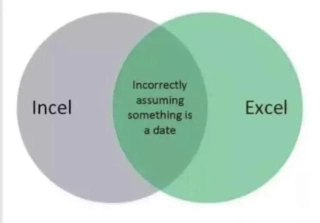
```

---

name: primeros-pasos

# Primeros pasos en R: .orange[CALCULADORA]

Empecemos por lo sencillo: **.bg-purple-light[¿cómo usar R como una calculadora?]** Si escribimos `2 + 1` en la consola y pulsamos ENTER, la consola nos mostrará el resultado de la suma.

```{r}
2 + 1
```

--

Si dicha suma la quisiéramos utilizar para un segundo cálculo: ¿y si la **.bg-purple-light[almacenamos en alguna variable]**? Por ejemplo, vamos a guardar la suma en una variable `x`

```{r}
x <- 2 + 1 #<<
```

--

Si te fijas ahora `x` aparece definida en nuestro **.bg-yellow[environment]**, y puede ser usada de nuevo

```{r}
x + 3
```

---

# Primeros pasos en R: .orange[CALCULADORA]

### Multiplicación

```{r eval = FALSE}
x * y #<<
```

### Elevar al cuadrado

```{r eval = FALSE}
x^2 #<<
```

### Valor absoluto

```{r eval = FALSE}
abs(x) #<<
```

---

# .red[Errores]

Durante tu aprendizaje va a ser **muy habitual** que las cosas no salgan a la primera, apareciendo en consola **.bg-purple_light[mensajes de error]** en un **.bg-red_light[color rojo]**. No te asustes: lo peor que puede pasar es que tengas que reiniciar `R`).

&nbsp;

* Mensajes de **.bg-red_light[ERROR]**: irán precedidos de la frase **.bg-yellow[«Error in…»]**, y serán aquellos fallos que **impidan la ejecución del código** 

```{r error = TRUE}
"a" + 1 # intentando sumar 1 a un texto
```

&nbsp;

**.bg-green_light[CONSEJO]**: lee siempre los mensajes de error para aprender de ellos (ya que suelen dar pistas de cómo resolverlos).

---

# .red[Errores]

Durante tu aprendizaje va a ser **muy habitual** que las cosas no salgan a la primera, apareciendo en consola **.bg-purple_light[mensajes de error]** en un **.bg-red_light[color rojo]**. No te asustes: lo peor que puede pasar es que tengas que reiniciar `R`).

&nbsp;
 
* Mensajes de **.bg-orange[WARNING]**: irán precedidos de la frase **.bg-yellow[«Warning in…»]**, y son los fallos más delicados ya que son posibles incoherencias pero sin que tu código deje de ejecutarse.

```{r warning = TRUE}
sqrt(-1) # raiz cuadrada de número negativo
```

&nbsp;

**¿Ha ejecutado la orden?** Sí, pero te advierte de que el resultado de la operación es un `NaN`, **Not A Number**, un valor que no existe (al menos dentro de los números reales).


---

# ¿Dónde programamos? .orange[SCRIPTS]

Un **.bg-purple_light[script]** será el documento en el que programamos, nuestro equivalente a un archivo .doc, pero aquí será un archivo con extensión `.R`, donde **escribiremos las órdenes**. Para **.bg-purple_light[abrir nuestro primero script]**, haz click en el menú superior en `File << New File << R Script`.

&nbsp;


.pull-left[


```{r echo = FALSE,  out.width = "95%", fig.align = "left"}
knitr::include_graphics("./img/inicio_rstudio_5.jpg")
``` 

]

.pull-right[

**.bg-green_light[CONSEJO]**: intenta no abusar de la consola, ya que todo lo que no escribas en un script, cuando cierres `RStudio`, lo **habrás perdido** (cómo si en lugar de escribir en un Word y guardarlo, nunca guardases el documento).

]

---


Ahora tenemos una **cuarta ventana**: la ventana donde **escribiremos nuestros códigos**


### **¿Cómo ejecutar nuestro script?**

.pull-left[

```{r echo = FALSE,  out.width = "95%", fig.align = "left"}
knitr::include_graphics("./img/inicio_rstudio_6.jpg")
``` 

]

.pull-right[

1. **.bg-purple_light[Escribimos el código]** a ejecutar.

2. **.bg-purple_light[Guardamos]** el archivo `.R` haciendo click en `Save current document`.

3. El código **no se ejecuta salvo que se lo indiquemos**. Tenemos tres opciones:
  - **.orange[Copiar y pegar]** en consola.
  - **.orange[Seleccionar líneas]** y clickar en `Run`.
  - Activar `Source on save` a la **derecha de guardar**: no solo guarda sino que ejecuta el código completo.

]

---

name: ejercicios1

# Primeros ejercicios

.panelset[
.panel[.panel-name[Ejercicios]


* 📝 **Ejercicio 1**: añade debajo otra línea para definir una variable `b` con el valor `5`. Tras asignarles valores, multiplica los números en consola.

```{r}
a <- 2
```

* 📝 **Ejercicio 2**: modifica el código inferior para definir dos variables `c` y `d`, con valores 3 y -1.

```{r eval = FALSE}
c <- # deberías asignarle el valor 3
d <- # deberías asignarle el valor -1
```

* 📝 **Ejercicio 3**: con las variables `a` y `b` del ej. 1, crea una nueva variable `e` guardando el resultado de su multiplicación `a * b`. Escribe `e` en consola para ver su resultado

]

.panel[.panel-name[Solución ej. 1]

```{r}
# Para poner comentarios en el código se usa #

# Definición de variables
a <- 2
b <- 5

# Multiplicación
a * b
```
]

.panel[.panel-name[Solución ej. 2]

```{r}
# Definición de variables
c <- 3
d <- -1
```
]

.panel[.panel-name[Solución ej. 3]

```{r}
# Variables
a <- 2
b <- 5

# Resultado
e <- a * b

# Muestro en consola
e
```

]
]

---

name: variables

# De la .orange[celda] a la .green[tabla]
 

¿De qué tipo pueden ser los datos que tenemos contenidos en cada celda de una «tabla»?


```{r echo = FALSE,  out.width = "55%", fig.align = "center"}
knitr::include_graphics("./img/celdas.jpg")
``` 

* **.bg-purple_light[Celda]**: un dato **.bg-orange[individual]** de un tipo concreto.
* **.bg-purple_light[Variable]**: una **.bg-orange[concatenación de valores]** del mismo tipo (**vectores**).
* **.bg-purple_light[Matriz]**: **.bg-orange[concatenación de variables]** del **.bg-yellow[mismo tipo]** y longitud.
* **.bg-purple_light[Tabla]**: **.bg-orange[concatenación de variables]** de **.bg-yellow[distinto tipo]** pero igual longitud.

---

# .orange[Celdas]: tipos de datos individuales

¿Existen **variables más allá de los números**?

&nbsp;

Piensa por ejemplo en los **datos guardados de una persona**:

* La edad o el peso será un **.bg-purple_light[número]**.
* Su nombre será una cadena de **.bg-purple_light[texto]**.
* Su fecha de nacimiento será precisamente eso, una **.bg-purple_light[fecha]**.
* A la pregunta «¿está usted soltero/a?» la respuesta será lo que llamamos una **.bg-purple_light[variable lógica]** (`TRUE` si está soltero/a o `FALSE` en otro caso).

```{r echo = FALSE,  out.width = "40%", fig.align = "center"}
knitr::include_graphics("./img/celdas.jpg")
``` 

---

# Variables .orange[NUMÉRICAS]

El **dato más sencillo**, dato que ya hemos usado en nuestros primeros pasos como calculadora, serán las variables que guardan simplemente números

```{r}
a <- 1
b <- 2
a + b
```

--

En el código anterior, tanto `a` como `b` como la suma `a + b` son de **.bg-purple_light[tipo numérico]**

```{r}
class(a) #<<
typeof(a) #<<
```


---

# Variables .orange[NUMÉRICAS]

Como ya hemos visto, con los datos numéricos podemos realizar todas las **.bg-purple_light[operaciones aritméticas]** que se nos ocurriría hacer en una **calculadora** como sumar (`+`), restar (`-`), multiplicar (`+`), dividir (`/`), raíz cuadrada (`sqrt()`), valor absoluto (`abs()`), elevar al cuadrado (`^2`), elevar al cubo (`^3`), etc.


```{r}
a <- 5
a^3 # Elevar al cubo
```

```{r}
b <- -43
abs(b) # valor absoluto
```

---

# Variables de .orange[TEXTO]

No solo de números viven los datos: imagina que además de la edad de una persona queremos **guardar su nombre** (**.bg-purple_light[tipo caracter]**: una **cadena de texto**)

```{r}
nombre <- "Javier" #<<
class(nombre)
```

--

Las cadenas de texto son un **tipo especial de dato** con los que obviamente no podremos hacer operaciones aritméticas (pero sí **.bg-purple_light[otras operaciones]** como pegar o localizar patrones).

```{r error = TRUE}
nombre + 1 # error al sumar número a texto
```

&nbsp;

--

**.bg-green_light[IMPORTANTE]**: las variables de tipo texto van **.bg-red_light[SIEMPRE ENTRE comillas]**.

---

name: primer-paquete

# .orange[PRIMERA FUNCIÓN]: paste

Una **.bg-purple_light[función]** es un **trozo de código encapsulado** bajo un nombre, que depende de unos **.bg-purple_light[argumentos de entrada]**.

--

Nuestra primera función será `paste()`: dadas dos cadenas de texto como argumento de entrada nos permite pegarlas, indicándole en el argumento `sep = ` el caracter que queremos entre medias.

```{r}
# todo junto, sin espacios, igual a paste0("Javier", "Álvarez")
paste("Javier", "Álvarez", sep = "") 
```


```{r}
paste("Javier", "Álvarez", sep = "?*?") # separados por un ?*?
```


---

# .orange[PRIMERA FUNCIÓN]: paste


```{r}
paste("Javier", "Álvarez") #<<
```

Por defecto, `paste()` añade un espacio, es decir, `sep = " "`. Muchas funciones en `R` tendrán lo que llamamos **.bg-purple_light[argumentos por defecto]**, el valor que tomará sino se le asigna otro. Puedes mirar la **.bg-green_light[ayuda de la función]** escribiendo en consola `? paste`

Existe una función similar llamada `paste0()` que pega por defecto con `sep = ""` (sin nada).

```{r}
paste0("Javier", "Álvarez") 
paste("Javier", "Álvarez", sep = "") 
```

---

# .orange[PRIMER PAQUETE]: glue

Otra forma **más intuitiva de trabajar con textos** es usar el **paquete** `{glue}`.

```{r}
library(glue) # solo la 1ª vez install.packages("glue")
```

--

Con dicho paquete podemos **.bg-purple_light[usar variables dentro de cadenas]** de texto. Por ejemplo, la frase «la edad es de ... años», donde la edad concreta la tenemos guardada en una variable.

```{r}
edad <- 33
glue("La edad es de {edad} años") #<<
```

Dentro de las llaves también podemos ejecutar operaciones

```{r}
unidades <- "días"
glue("La edad es de {edad * 365} {unidades}") #<<
```

---

name: vectores

# .orange[VECTORES]: concatenación

¿Y si en lugar de querer almacenar un solo elemento, por ejemplo , tenemos una **colección de elementos**?

Hasta ahora solo hemos operado con el contenido de las **celdas**, pero cuando trabajamos con datos normalmente tendremos columnas que representan variables o características: llamaremos **.bg-purple_light[vectores]** a una **.bg-orange[concatenación]** de variables del **.bg-orange[mismo tipo]**
 
--

La forma más sencilla es con el comando `c()` (c de concatenar), y basta con introducir sus **elementos entre paréntesis y separados por comas** (por ejemplo, la edad de 4 personas).

```{r}
edades <- c(33, 27, 60, 61) #<<
edades
```


&nbsp;

--

**.bg-green_light[IMPORTANTE]**: un número individual (`x <- 1`) es en realidad un vector de longitud uno. 

---

# .orange[VECTORES]: concatenación


Como ves ahora en el `environment` tenemos una **.bg-purple_light[colección de elementos]** guardada

.pull-left[

```{r}
edades
```

]


.pull-right[
```{r echo = FALSE,  out.width = "80%", fig.align = "left"}
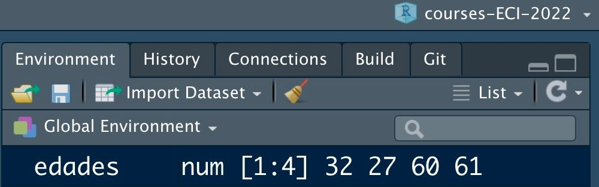
``` 
]

--

.pull-left[

La **.bg-purple_light[longitud de un vector]** se puede calcular con `length()`

```{r}
length(edades) #<<
```

]


.pull-right[

También podemos **.bg-purple_light[concatenar vectores]**

```{r}
c(edades, edades, 8)
```

]

---

# Vectores: .orange[SECUENCIAS NUMÉRICAS]

En muchas ocasiones querremos **.bg-purple_light[crear secuencias numéricas]** mucho más rápido (por ejemplo, un vector con los días del mes). El comando `seq()` nos permite crear una **secuencia** desde un elemento inicial hasta un elemento final, avanzando de uno en uno.

```{r}
seq(1, 31)
```

--

El comando `1:n` nos devuelve lo mismo que la orden `seq(1, n)`. Además, si el elemento inicial es mayor que el final, `R` entenderá solo que la secuencia es **decreciente**.

```{r}
n <- 5
n:1
```

---

# Vectores: .orange[SECUENCIAS NUMÉRICAS]

También podemos definir **.bg-purple_light[otro tipo de distancia]** (**.bg-orange[paso de discretización]**) entre dos elementos consecutivos

```{r}
seq(1, 7, by = 0.5) # secuencia desde 1 a 7 de 0.5 en 0.5
```

--

Otras veces nos interesará definir una **.bg-purple_light[secuencia con un número concreto]** de elementos.

```{r}
seq(1, 50, l = 7) # secuencia desde 1 a 50 de longitud 7
```

--

También podemos crear **.bg-purple_light[vectores de elementos repetidos]** con la función `rep()`

```{r}
rep(0, 7) # vector de 7 ceros
```


---

# Vectores: .orange[CARACTERES]

Un vector es una **.bg-purple_light[concatenación de elementos del mismo tipo]**, pero no tienen porque ser necesariamente números. Vamos a crear una frase de ejemplo, con 4 elementos.

.pull-left[

```{r}
vector <- c("Me", "llamo", "Javi") #<<
vector
length(vector)
```

]

.pull-right[

```{r}
frase <- "Mi llamo Javi"
frase
length(frase)
```

]

Fíjate la **diferencia** entre tenerlo guardado en un vector o tenerlo como una sola cadena de texto (unida).

---

# Vectores: .orange[CARACTERES]

Cuando usamos la función `paste()` con variables diferentes, usábamos `sep = ...`. Cuando la función `paste()` la aplicamos a un vector de caracteres, decidiremos que caracter queremos que vaya entre palabra con el argumento `collapse = ...`.

```{r}
paste(vector, collapse = ".") # separados por un punto
```

Podemos **combinar las secuencias de números y un vector de caracteres** con `glue()`

```{r}
edad <- 10:12 # edades
glue("La edad es de {edad} años")
```

---


# Vectores de tipo .orange[LÓGICO]

Un tipo de datos muy importante en todo lenguaje de programación: los **.bg-purple_light[valores lógicos]**. Un valor lógico puede tomar **tres valores**:

* `TRUE` (guardado internamente como un `1`).
* `FALSE` (guardado internamente como un `0`).
* `NA` (**.bg-purple_light[dato ausente]**, son las siglas de **.bg-orange[not available]**).

--

Los valores lógicos suelen ser resultado de evaluar **.bg-purple_light[condiciones lógicas]** (preguntar a los datos). Por ejemplo, imaginemos que definimos un vector de temperaturas. ¿Qué días hizo menos de 22 grados?

```{r}
x <- c(15, 20, 31, 27, 15, 29)
x < 22 #<<
```

Nos devolverá un **vector lógico** con `TRUE` o `FALSE` en cada hueco, en función de si cumple o no la condición pedida.

---

# Vectores de tipo .orange[LÓGICO]


Dicha condición lógica puede hacerse con `<=` (menor o igual), `>` (mayor) o `>=` (mayor igual).

```{r}
x <= 22
```

--

```{r}
x > 30
```

--

```{r}
x >= 15
```

---

# Vectores de tipo .orange[LÓGICO]

También podemos comparar **.bg-purple_light[si es igual a otro elemento]**, para lo que usaremos el operador `==`, pudiendo usar también su opuesto `!=` («distinto de»).

```{r}
x == 15
x != 15
```

--

Si tuviéramos un **.bg-purple_light[dato ausente]** (por error del aparato ese día, marcado como `NA`), la condición evaluada también sería `NA`

```{r}
y <- c(15, 20, NA, 31, 27, 7, 29, 10)
y < 22
```

---

# Vectores de tipo .orange[LÓGICO]

Las **.bg-purple_light[condiciones pueden ser combinadas]**, principalmente de dos maneras:

.pull-left[

* **.bg-purple_light[Intersección]**: **.bg-orange[TODAS]** las condiciones concatenadas se deben cumplir (conjunción y) para devolver un `TRUE`.

```{r}
x
x < 30 & x > 15
```

]

.pull-right[

* **.bg-purple_light[Unión]**: basta con que **.bg-orange[AL MENOS UNA]** de las condiciones se cumpla (conjunción o) para devolver un `TRUE`.

```{r}
x
x < 30 | x > 15
```

]

---

# Vectores de tipo .orange[FECHA]


Un tipo de datos muy especial: los **.bg-purple_light[datos de tipo fecha]**. 

```{r}
# Cadena de texto
fecha_char <- "2021-04-21"
class(fecha_char)
```

Podríamos pensar que no tiene nada de especial ya que parece una simple cadena de texto pero representa un **.bg-purple_light[instante en el tiempo]**, que deberíamos poder operar como tal.

--

¿Qué sucedería si **sumamos un 1 (un día)** a una fecha definida como una cadena de texto?

```{r error = TRUE}
fecha_char + 1
```

--

Si guardamos las fechas como un cadena de texto **.bg-red_light[no podemos operar con ellas]**

---

# Vectores de tipo .orange[FECHA]

Para trabajar con fechas tenemos el paquete `{lubridate}`, y su función `as_date()`: nos **.bg-purple_light[convierte texto a fecha]**.

```{r}
library(lubridate)
fecha <- as_date(fecha_char) #<<
class(fecha)
```

--

```{r}
fecha + 1 # día siguiente
```

--

```{r}
fecha - 3 # 3 días antes
```

--

Al convertir texto a fecha, aunque se visualice como un texto, **.bg-purple_light[internamente es un número]**. 

---

# Vectores de tipo .orange[FECHA]

La función `as_date()` tiene un argumento opcional, el **.bg-purple_light[formato]**, que por defecto será `format = "yyyy-mm-dd"` (que podemos cambiar)


```{r}
as_date("10-03-2020", format = "%d-%m-%Y") #<<
```


```{r}
as_date("03-10-2020", format = "%m-%d-%Y")
```


```{r}
as_date("Octubre 21, 1995 21:24", format = "%B %d, %Y %H:%M")
```

---

# Vectores de tipo .orange[FECHA]

Para facilitar conversiones de formatos habituales, el paquete también tiene a nuestra disposición diferentes funciones preparadas para directamente **.bg-purple_light[convertir fechas en distintos formatos]**, como la función `ymd_hms()` o `ydm_hms()`

```{r}
ymd_hms("2017-11-28 14:02:00") # convertir a fecha una cadena año-mes-día + hora
```

De la misma manera tenemos la función `dmy_hms()`

```{r}
dmy_hms("1 Jan 2017 23:59:59")
```

También podemos hacerlo de forma muy simplificada con `ymd()`

```{r}
ymd(20170131)
```

 
---

# Vectores de tipo .orange[FECHA]


Otra de las funcionalidades es obtener automáticamente la **.bg-purple_light[fecha de hoy]**, con `today()`, y el **.bg-purple_light[«hoy y ahora»]** con `now()`

```{r}
today() #<<
now()
```
 
--

También tenemos disponibles funciones para **.bg-purple_light[extraer facilmente algunas variables]**.

.pull-left[

```{r}
year(fecha)
month(fecha)
hour(fecha)
second(fecha)
```

]

.pull-right[
```{r}
week(fecha)
wday(fecha)
wday(fecha, week_start = 1) # Día de la semana 
```

]


---

# Vectores de tipo .orange[FECHA]

.pull-left[

```{r echo = FALSE,  out.width = "120%", fig.align = "right", fig.cap = "Chuleta de https://lubridate.tidyverse.org/"}
knitr::include_graphics("./img/lubridate.png")
``` 

]

.pull-right[

También podemos hacer uso de diferentes funciones para **.bg-purple_light[añadir intervalos]** de tiempo.

```{r}
fecha + weeks(0:2)
fecha + seconds(2)
```

]

---

name: ejercicios-vectores

# Ejercicios


.panelset[
.panel[.panel-name[Ejercicios]


* 📝 **Ejercicio 1**: define una variable `edad` que guarde tu edad y otra `nombre` con tu nombre.

* 📝 **Ejercicio 2**: define otra variable con tus apellidos y junta las variables `nombre` y `apellidos` en una sola cadena de texto que guardes en `nombre_completo`.
 
* 📝 **Ejercicio 3**: define un vector que contenga los números `1`, `10`, `-1` y `2`, y guárdalo en una variable llamada `vector_num`. Obtén la longitud del vector anterior.
 
* 📝 **Ejercicio 4**: crea una secuencia de -2 a 17 de forma que salte de uno en uno (y también de forma decreciente). Repite el proceso pero saltando de 3 en 3.


]

.panel[.panel-name[Solución ej. 1]

```{r}
# variable numérica
edad <- 33
edad

# variable de tipo texto
nombre <- "Javi"
nombre
```
]

.panel[.panel-name[Solución ej. 2]

```{r}
apellidos <- "Álvarez Liébana"

# Opción 1
nombre_completo <- glue("{nombre} {apellidos}")
nombre_completo

# Opción 2
nombre_completo <- paste(nombre, apellidos)
nombre_completo
```
]

.panel[.panel-name[Solución ej. 3]

```{r}
vector_num <- c(1, 10, -1, 2)
vector_num

# longitud
length(vector_num)
```

]

.panel[.panel-name[Solución ej. 4]

```{r}
secuencia <- -2:17
secuencia
# otra forma
secuencia <- seq(-2, 17, by = 1)

# decreciente
17:-2

# de 3 en 3
seq(-2, 17, by = 3)
```

]

]

---

# Ejercicios


.panelset[
.panel[.panel-name[Ejercicios]


* 📝 **Ejercicio 5**: crea una secuencia que repita 7 veces el patrón -1, 2, 4. Después crea otra que repita dicho patrón pero de forma intercalada.
 
* 📝 **Ejercicio 6**: crea una secuencia de 7 valores lógicos en los que haya 2 valores ciertos, 3 valores falsos y 2 valores ausentes.


* 📝 **Ejercicio 7**: toma el vector `vector_num` del ejercicio 3 y obtén un vector lógico que nos diga que valores son mayores de 0. Obtén otro vector lógico que nos diga que valores están entre 0 y 7. Obtén otro vector lógico que nos diga que valores son distintos de 1 en valor absoluto.

* 📝 **Ejercicio 8**: obtén la fecha de hoy, define la fecha de tu cumpleaños, y calcula la diferencia de días.
 
* 📝 **Ejercicio 9**: suma un mes y una semana a la fecha de tu cumpleaños

 

]

.panel[.panel-name[Sol ej. 5]

```{r}
secuencia <- rep(c(-1, 2, 4), 7)
secuencia

# intercalada
rep(c(-1, 2, 4), each = 7)
```

]

.panel[.panel-name[Sol ej. 6]

```{r}
secuencia <- c(FALSE, TRUE, NA, FALSE, NA, TRUE, FALSE)
secuencia
```

]

.panel[.panel-name[Sol ej. 7]

```{r}
vector_num > 0
vector_num > 0 & vector_num < 7
abs(vector_num) != 1
```

]


.panel[.panel-name[Sol ej. 8]

```{r}
library(lubridate)
hoy <- today()
cumple <- as_date("1989-09-10")
hoy - cumple
```

]

.panel[.panel-name[Sol ej. 9]

```{r}
cumple + months(1) + weeks(1)
```

]

]


---


name: operaciones-vectores

# .green[OPERACIONES] .orange[ARITMÉTICAS]
 
Dado que un **.bg-purple_light[número es un vector]** de longitud 1, toda **.bg-orange[operación aritmética]** (suma, resta, multiplicación, etc) que podamos hacer con un número la vamos a poder a hacer con un vector de números.

--

Si hacemos por ejemplo la operación `2 * x`, siendo `x` un vector, lo que sucederá es que la operación se realizará en **.bg-purple_light[CADA ELEMENTO]** del vector (una sola línea de código paro realizar operaciones en 10, 20, 1000 o 100000 elementos).

```{r}
# Multiplicamos por 2 a CADA ELEMENTO del vector
x <- c(2, 4, 6)
2 * x #<<
```

--

&nbsp;

**.bg-green_light[IMPORTANTE]**: el **.bg-purple_light[resultado]** de una operación aritmética sobre un vector será **.bg-orange[otro vector]**.

---

# .green[OPERACIONES] .orange[ARITMÉTICAS]
 
 
De la misma manera podemos **.bg-purple_light[sumar o restar una constante]** al vector

```{r}
# Sumamos 3 a CADA ELEMENTO DEL VECTOR
x + 3
```

--

Los vectores también pueden **.bg-purple_light[interactuar entre ellos]**, así que podemos definir sumas de vectores, como `x + y`

```{r}
y <- c(1, 3, 5)

# suma de vectores 
x + y #<< 
```

--

**.bg-green_light[IMPORTANTE]**: salvo que especifiquemos lo contrario, toda operación aritmética que hagas a un vector será **.bg-purple_light[elemento a elemento]**.

 
---

# .green[OPERACIONES] .orange[ARITMÉTICAS]
 

Dado que la operación (por ejemplo, una suma) se realiza elemento a elemento, ¿qué sucederá si **.bg-purple_light[sumamos dos vectores de distinta longitud]**?

--

Por ejemplo, definamos `z` con los 4 primeros impares, e intentemos hacer la suma `x + z`.

```{r}
z <- c(1, 3, 5, 7)
x + z
```

--

.pull-left[


```{r echo = FALSE,  out.width = "99%", fig.align = "left"}
knitr::include_graphics("./img/recycle.jpg")
``` 


]

.pull-right[

`R` intenta molestarte lo menos posible, así que lo que hace es **.bg-purple_light[reciclar elementos]**: si tiene un vector de 4 elementos y le intentas sumar uno de 3 elementos, lo que hará será reciclar elementos del vector con menor longitud: hará `1 + 2`, `3 + 4`, `5 + 6` pero… `7 + 2` (vuelve al primero).

]

---


# .green[OPERACIONES] .orange[ARITMÉTICAS]


Los **.bg-purple_light[valores lógicos]** `TRUE` y `FALSE` son **.bg-orange[guardados internamente]** como `0` y `1`, por lo que podemos usar operaciones aritméticas con ellos.

--

Por ejemplo, si queremos **.bg-purple_light[averiguar el número de elementos que cumplen una condición]** (por ejemplo, `< 3`), los que lo hagan tendrán asignado un 1 y los que no un 0, por lo que basta con sumar dicho vector lógico para obtener el número de elementos que cumplen dicha condición (elementos que son `TRUE`).

```{r}
# sumamos el vector de TRUE/FALSE
x
sum(x < 3) 
```

---

# .green[OPERACIONES] .orange[ESTADÍSTICAS]

También podemos realizar **.bg-purple_light[operaciones estadísticas]** con los vectores, como calcular su **suma**, su **media**, su **mediana**, entre otros.

--

Hagamos antes un **.bg-purple_light[breve repaso]** de algunos términos estadísticos:

* **.bg-purple_light[Media]**: medida de **.bg-orange[centralización]** que consiste en sumar todos los elementos y dividirlos entre la cantidad de elementos sumados (función `mean()`). La más conocida pero la menos robusta: dado un conjunto, si se introducen valores atípicos o outliers (valores muy grandes o muy pequeños), la media se perturba con mucha facilidad.

$$\overline{x} = \frac{1}{n} \sum_{i=1}^{n} x_i$$

```{r}
x <- c(165, 170, 181, 191, 150, 155, 167, 173, 177)
mean(x)
```

---

# .green[OPERACIONES] .orange[ESTADÍSTICAS]

También podemos realizar **.bg-purple_light[operaciones estadísticas]** con los vectores, como calcular su **suma**, su **media**, su **mediana**, entre otros.


Hagamos antes un **.bg-purple_light[breve repaso]** de algunos términos estadísticos:

* **.bg-purple_light[Mediana]**: medida de **.bg-orange[centralización]** (función `median()`) que consiste en, tras **.bg-orange[ordenar]** los datos de menor a mayor, quedarnos con el valor que ocupa el medio (deja tantos números por debajo como por encima). 


$$Me_{x} = \displaystyle \arg \min_{x_i} \left\lbrace F_i > 0.5 \right\rbrace, \quad F_i = \frac{\# \left\lbrace x_j \leq x_i \right\rbrace}{n}$$

```{r}
x <- c(165, 170, 181, 191, 150, 155, 167, 173, 177)
median(x)
```

---

# .green[OPERACIONES] .orange[ESTADÍSTICAS]

Otra de las funciones más útil es la **.bg-purple_light[suma de elementos]** de un vector con `sum()`

```{r}
# suma
sum(x) #<<
sum(x) / length(x) # media artesanal
```

--

Otra función útil es la **.bg-purple_light[suma acumulada]** de un vector haciendo uso de `cumsum()`

```{r}
# suma acumulada
cumsum(c(1, 2, 4, 7, 7, 10)) #<<
```

---

# .green[OPERACIONES] .orange[ESTADÍSTICAS]

No solo de medidas de centralización vive la estadística: **.bg-purple_light[¿cómo calcular las medidas de dispersión?]**

* **.bg-purple_light[Varianza]**: definida como la media de desviaciones (respecto a la media) al cuadrado, tal que $s_{x}^{2} = \frac{1}{n} \sum_{i = 1}^{n} \left(x_i - \overline{x} \right)^2 = \overline{x^2} - \overline{x}^2$

```{r}
var(x)
```

--

**.bg-green_light[IMPORTANTE]**: las funciones de `R` (y de cualquier calculadora) nos devuelve la **.bg-red_light[cuasivarianza]** (dividido entre $n-1$)
 
```{r}
# Varianza real
mean((x - mean(x))^2)
```

---


# .green[OPERACIONES] .orange[ESTADÍSTICAS]

No solo de medidas de centralización vive la estadística: **.bg-purple_light[¿cómo calcular las medidas de dispersión?]**

* **.bg-purple_light[Desv. típica (standard deviation)]**: definida como la raíz cuadrada de la varianza, tal que $s_{x} = \sqrt{s_{x}^{2} }$

```{r}
sd(x)
```

--

**.bg-green_light[IMPORTANTE]**: las funciones de `R` (y de cualquier calculadora) nos devuelve la **.bg-red_light[cuasidesviación típica]** (raíz de la cuasivarianza, dividida entre $n-1$)
 
```{r}
# Desv. típica real
sqrt(mean((x - mean(x))^2))
```


---

# .green[OPERACIONES] .orange[ESTADÍSTICAS]

También pueden sernos útiles las **.bg-purple_light[medidas de posición/localización]**, como los **.bg-orange[percentiles]** (valores que nos dividen en partes iguales los datos).

```{r}
y <- c(1, 2, 5, 5, 10, 10, 10, 13, 15, 20, 25)

# Percentiles por defecto: cuartiles
quantile(y) #<<
```

--

En `quantile()` hay un argumento por defecto `probs = c(0, 0.25, 0.5, 0.75, 1)` (**percentiles** a calcular) que puede ser cambiado, por ejemplo, para percentiles 20%-30%-70%-90%.

```{r}
quantile(y, probs = c(0.2, 0.3, 0.7, 0.9))
```

---

# .green[OPERACIONES] con .orange[AUSENTES]

Imagina que tenemos un vector de temperaturas pero varios de los días el aparato de medición no funcionaba, por lo que tenemos un **.bg-purple_light[dato ausente]** marcado como `NA`.

```{r}
x <- c(21, NA, 13, NA, NA, 25, 36, 17, 19, 5)
sum(x)
```

--

Dado que hay días que no tenemos disponibles, la suma tampoco la podemos conocer.  Para evitar que nos impida hacer ciertas operaciones, en muchas funciones de `R` podemos añadir el **argumento** `na.rm = TRUE`: primero elimina ausentes, y luego ejecuta la función.

```{r}
# eliminando datos ausentes antes de aplicar la función
sum(x, na.rm = TRUE) #<<
mean(x, na.rm = TRUE)
```


---

# .green[OPERACIONES] con .orange[AUSENTES]

Para **comprobar** si tenemos un **dato ausente**  podemos hacer uso de la función `is.na()`

```{r}
is.na(x)
```

--

También puede aparecernos un **.bg-purple_light[resultado no permitido]**, marcado como `NaN` (not a number): no es un dato ausente, es un dato resultado de una **operación no permitida**.

```{r}
x <- c(1, NA, 3, 4, 6, 7, sqrt(-1), NA)
x
is.nan(x)
```


---

# .orange[SELECCIONAR] elementos

Otra operación muy habitual es la **.bg-purple_light[extraer un subconjunto del mismo]**. La forma más sencilla es **usar el operador de selección** `[i]` para **acceder al elemento i-ésimo**

```{r}
edades <- c(20, 30, 33, NA, 61)

# accedemos a la edad de la tercera persona en la lista
edades[3] #<<

# accedemos a la edad de la cuarta persona
edades[4]
```

---

# .orange[SELECCIONAR] elementos

Un número no es más que un vector de longitud uno, así que esta operación también la podemos aplicar usando un **.bg-purple_light[vector de índices a seleccionar]**

```{r}
# Tercer y cuarto elemento
edades[c(3, 4)] #<<
```

--

Esta lógica para acceder a elementos también sirve para **vectores de caracteres**.

```{r}
y <- c("hola", "qué", "tal", "todo", "ok", "?")
y[1:2]
```

--

**.bg-green_light[TIP]**: para **.bg-purple_light[acceder al último elemento]** podemos pasarle como índice la longitud del vector 

```{r}
y[length(y)] 
```

---


# Valores .orange[UNICOS]

Con la función `unique()` podemos también extraer los **.bg-purple_light[valores únicos de una variable]**

```{r}
colores <- c("azul", "azul", "verde", "amarillo",
             "azul", "rojo", "rojo", "azul", "rojo",
             "verde", "morado")
unique(colores) #<<
```

---


# .orange[FILTRAR] elementos


Otras veces no querremos seleccionar un elemento en concreto sino **.bg-purple_light[filtrar algunos elementos en concreto]** y no extraerlos, **.bg-orange[eliminarlos]**.

Deberemos repetir la misma operación pero con el signo `-` delante: el operador `[-i]` **no selecciona** el elemento i-ésimo del vector sino que lo **elimina**

```{r}
y
y[-2] 
```

---

# .orange[FILTRAR] elementos

Lo habitual es que dicho filtro lo hagamos **.bg-purple_light[en base a una condición lógica]**. Supongamos que tenemos las edades de dos grupos de personas y que queremos quedarnos **solo con los mayores edad**: vamos a seleccionar los **elementos que cumplen una condición dada**.

```{r}
edades_1 <- c(7, 20, 18, 3, 19, 9, 13, 3, 45)
edades_2 <- c(17, 21, 58, 33, 15, 59, 13, 1, 45)
```

--

```{r}
edades_1[edades_1 >= 18] #<<
edades_2[edades_2 >= 18]
```

Lo que hemos hecho ha sido pasar como **índices a seleccionar un vector lógico** `TRUE/FALSE`: solo filtrará los lugares donde se guarde un `TRUE`.

---

# .orange[FILTRAR] elementos

Esto también nos puede servir para **.bg-purple_light[limpiar de datos ausentes]**, combinando la función `is.na()`: nos localiza el lugar que ocupan los ausentes, con el operador `!` (**negar el valor lógico** que venga detrás).

```{r}
x <- c(7, NA, 20, 3, 19, 21, 25, 80, NA)
x[is.na(x)] # solo valores ausentes
x[!is.na(x)] # sin valores ausentes: ! es el símbolo de 
```

--

También podemos probar a **combinar condiciones lógicas** para nuestra selección.

```{r}
x[x >= 18 & x <= 25] # los valores que cumplen ambas (&): entre 18 y 25 años
```

---
 

# .green[SELECCIONAR] elementos: .orange[WHICH]

A veces no querremos el elemento en sí, sino el **.bg-purple_light[lugar que ocupa]**: ¿qué valores de un vector cumplen una condición lógica? Para obtener dicho índice usaremos la función `which()`.

```{r}
x <- c(7, NA, 20, 3, 19, 21, 25, 80, NA)
which(x >= 18) # Obtenemos los lugares 
```

--

Esta función es muy útil especialmente cuando queremos el valor que ocupa el **.bg-purple_light[máximo/mínimo]** de un vector, con las funciones `which.max()` y `which.min()`.

```{r}
max(x, na.rm = TRUE)
which.max(x) # Lugar que ocupa el máximo
```


---

# .green[SELECCIONAR] elementos: .orange[any/all]
 

Existen dos funciones muy útiles para saber si **.bg-purple_light[todos o alguno de los elementos]** de un vector cumple una condición: `all()` y `any()` nos devolverá un único valor lógico.

```{r}
x <- c(1, 2, 3, 4, 5, NA, 7)
all(x < 3) #<<
any(x < 3)
all(x > 0)
```


---


# .orange[ORDENAR] vectores


Una acción también habitual al trabajar con datos es saber **.bg-purple_light[ordenarlos]**: de menor a mayor edad, datos más recientes vs antiguos, etc. Para ello tenemos la función `sort()`, que podemos usar directamente para ordenar de **menor a mayor**.

```{r}
edades <- c(81, 7, 25, 41, 65, 20, 33, 23, 77)

# orden de joven a mayor
sort(edades) #<<
```

--

Por defecto, `sort()` ordena de menor a mayor. Con el argumento opcional `decreasing = TRUE` podemos **ordenar de mayor a menor**.

```{r}
# orden de mayor a joven
sort(edades, decreasing = FALSE) #<<
```

---

# .orange[ORDENAR] vectores

Otra forma de ordenar es obtener los **índices de los elementos ordenados**, y luego usar dichos índices para **reorganizar los elementos**, con la función `order()`.

```{r}
order(x) #<<
x[order(x)]
```

---


# .orange[MEDIR] tiempos de ejecución

Hay un paquete muy útil para **.bg-purple_light[medir tiempos de distintas órdenes]** que hacen lo mismo (el paquete `{microbenchmark}`). Vamos a comparar `order()` y `sort()`.

```{r}
library(microbenchmark) # instalar primera vez
x <- rnorm(1e3) # 1000 elementos aleatorias
microbenchmark(sort(x), x[order(x)], times = 1e3) #<<
```


---

name: ejercicios-operaciones-vectores
# Ejercicios de vectores


.panelset[
.panel[.panel-name[Ejercicios]


* 📝 **Ejercicio 1**: define el vector `x` como la concatenación de los 5 primeros números impares, y calcula su suma.
 
* 📝 **Ejercicio 2**: obtén los elementos de `x` mayores que 4. Determina los lugares que ocupan. Calcula el número de elementos de `x` mayores que 4.

* 📝 **Ejercicio 3**: calcula el vector `1/x` y obtén la versión ordenada (de menor a mayor).

* 📝 **Ejercicio 4**: define un vector con tu estatura y peso, y nombra cada elemento.

 
]

.panel[.panel-name[Solución ej. 1]

```{r}
x <- c(1, 3, 5, 7, 9)

# otra forma
x <- seq(1, 9, by = 2)

# Suma
sum(x)
```
]

.panel[.panel-name[Solución ej. 2]

```{r}
# Elementos mayores que 4
x[x > 4]

# Lugares que ocupan
which(x > 4)

# Cantidad de elementos mayores que 4
sum(x > 4)
```
]

.panel[.panel-name[Solución ej. 3]

```{r}
y <- 1/x

# una forma
sort(y)

# otra forma
y[order(y)]
```

]


.panel[.panel-name[Solución ej. 4]

```{r}
x <- c("estatura" = 180, "peso" = 80)
x
```

]

]

---

# Ejercicios de vectores

.panelset[
.panel[.panel-name[Ejercicios]

 
* 📝 **Ejercicio 5**:  encuentra del vector `x` del ejercicio 1 los elementos mayores (estrictos) que 1 y menores (estrictos) que 7. Encuentra una forma de averiguar si todos los elementos son o no positivos.
 
 
* 📝 **Ejercicio 6**: define el vector `x <- c(-1, 0, -2, 5, 3, 7)` y obtén los elementos que ocupan una posición impar.
 
 
* 📝 **Ejercicio 7**: define el vector de los primeros números impares (hasta el 21) y extrae los elementos que ocupan los lugares `1, 4, 5, 8`. Elimina del vector el segundo elemento

 
* 📝 **Ejercicio 8**: define un vector de 8 valores y determina la media, la mediana y los cuartiles.

]

.panel[.panel-name[Solución ej. 5]

```{r}
x <- c(1, 3, 5, 7, 9)
# valores >1 y <7
x[x > 1 & x < 7]

# ¿Todos positivos?
all(x > 0)
sum(all(x <= 0)) # debe dar 0
```

]

 
 
.panel[.panel-name[Solución ej. 6]

```{r}
x <- c(-1, 0, -2, 5, 3, 7)
x[seq(1, length(x), by = 2)]
```

]

.panel[.panel-name[Solución ej. 7]

```{r}
x <- seq(1, 21, by = 2)

# posiciones pedidas
x[c(1, 4, 5, 8)]

# sin las posiciones pedidas
x[-c(1, 4, 5, 8)]

# eliminamos del vector el segundo elemento
x[-2]
```
]

.panel[.panel-name[Solución ej. 8]

```{r}
x <- c(0, -2, 3, 7, -5, 9, 3, 1)
mean(x)
median(x)
quantile(x)
```
]


]


---

name: complementos-I

class: inverse

# COMPLEMENTOS

#### [Estructuras de control: if-else y bucles](#estructuras-condicionales)

&nbsp;

# EJERCICIOS Y ENTREGA

#### [Presentar resultados: rmd](#rmd)

#### [Ejercicios extras](#ejercicios-I)

#### [Entrega I (15%)](#entrega-I)

---

name: estructuras-condicionales

# Estructuras de control: .orange[IF-ELSE]


Una **.bg-purple_light[expresión de control]** será un conjunto de órdenes que nos permiten **.bg-purple_light[decidir el camino]** por el que queremos que avance nuestro código:

* ¿Qué hacemos si sucede A?

* ¿Y si sucede B?

* ¿Tengo que programar X veces lo mismo si quiere que se repita?

&nbsp;

Si has programado en algún otro lenguaje, estarás familiarizado/a con **.bg-purple_light[estructuras condicionales]** como un `if (blabla) {...} else {...}` (que los usaremos a veces) o **.bg-purple_light[bucles]** `for/while` (que intentaremos evitarlos lo máximo posible).

---

# Estructuras de control: .orange[IF]

Una de las estructuras de control más famosas de cualquier lenguaje de programación es la **.bg-purple_light[estructura condicional]** `if`

> SI las condiciones impuestas se cumplen (TRUE), ejecuta las órdenes que tengamos dentro de la misma.

Por ejemplo, la estructura `if (x == 1) { código A }` lo que hará será **.bg-purple_light[ejecutar el código entre llaves]** pero **.bg-orange[SI Y SOLO SI]** la **.bg-purple_light[condición es cierta]** (en este caso, solo si `x` es igual 1). En **caso contrario, no hace nada**.

--

Definamos por ejemplo una variable sencilla, las edades de 8 personas y comprobemos cuales son menores de edad.

```{r}
edades <- c(14, 17, 24, 56, 31, 20, 87, 73)
edades < 18
```

---

# Estructuras de control: .orange[IF]


Recuerda que con las funciones `any()` y `all()` podemos saber si **.bg-purple_light[todos o alguno de los elementos]** de un vector cumplen una condición.

```{r}
any(edades < 18) # existe algun menor de edad
```

--

Con dichos elementos vamos a construir nuestra primera estructura condicional: queremos que, **.bg-purple_light[SI existe algún menor de edad, nos imprima un mensaje]**.

```{r}
if (any(edades < 18)) { 
  
  print("existe alguna persona mayor de edad")
  
}
```

---

# Estructuras de control: .orange[IF]

```{r eval = FALSE}
if (any(edades < 18)) { 
  
  print("existe alguna persona mayor de edad")
  
}
```


En caso de que **.bg-purple_light[no se cumplan las condiciones]** dentro del `if()` (FALSE), no sucederá nada. 


```{r}
if (all(edades >= 18)) { 
  
  print("todas las personas son mayores de edad")
  
}
```

Fíjate que en este caso **no hemos obtenido ningún mensaje** porque la condición `all(edades >= 18)` no es cierta (no son todos mayores de 18 años), así que **no ha ejecutado el código**.

---

# Estructuras de control: .orange[IF-ELSE]

La estructura `if (condicion) { }` puede ser combinada con un `else { }`: cuando la **.bg-purple_light[condición no se cumpla]** (como en el último ejemplo), se **.bg-purple_light[ejecutará el código alternativo]** que haya dentro del `else { }`, permitiéndonos decidir que sucede cuando SÍ se cumple y cuando NO se cumple.

--

Por ejemplo, la estructura `if (x == 1) { código A } else { código B }` ejecutará A si `x` es 1 y B en cualquier otro caso.

```{r}
if (all(edades >= 18)) { 
  
  print("todas las personas son mayores de edad")
  
} else { #<<
  
  print("existe alguna persona menor de edad")
}
```

---

# Estructuras de control: .orange[IF-ELSE]

Dicha estructura `if - else` puede **.bg-purple_light[anidarse]**: imagina que queremos realizar una acción si todos fuesen mayores de edad; en caso contrario, pero si todos los menores tienen 16 años o más, realizar otra acción; en caso contrario, otra acción

```{r}
if (all(edades >= 18)) { 
  
  print("todas las personas son mayores de edad")
  
} else if (all(edades >= 16)) {
  
  print("Existe alguna persona menor de edad pero todos con 16 años o más")
  
} else { print("Existe alguna persona menor de 16 años") }
```

**.bg-green_light[CONSEJO]**: puedes **colapsar las estructuras de control** pulsando en la flecha que aparece a la izquierda de ellas en tu script.


---

# Estructuras de control: .orange[IFELSE()]


Esta estructura condicional puede ser **.bg-purple_light[vectorizada]**: reunir en una sola fila un número elevado de estructuras de comparación con la función `ifelse()`, cuyos argumentos de entrada serán

* la condición a evaluar
* lo que sucede cuando se cumple
* lo que sucede cuando no se cumple

Con el ejemplo de las edades, vamos a dejar el dato ausente si son menores de edad, y si son mayores de edad se queda como está.

```{r}
# NA si no cumple la condición, la edad si se cumple.
ifelse(edades >= 18, edades, NA) #<<
```

---

# Estructuras de control: .orange[IFELSE()]


Todas estas estructuras **.bg-purple_light[no solo sirven para datos numéricos]**. Vamos a definir un vector de nombres con algunos ausentes, y vamos a sustituir los ausentes por el texto `"nombre_desconocido"` (los que no sean ausentes, es decir los que `is.na()` devuelva FALSE, se quedan como están).

```{r}
nombres <- c("Juan", "María", NA, NA, "Lucía",
             "Carmen", "Javier", NA, "Carlos", 
             NA, "Gregorio", "Paloma")

# Si tiene ausente --> "nombre_desconocido"
# Si no tiene ausente --> nombres originales
nombres <-
  ifelse(is.na(nombres), "nombre_desconocido", nombres)
nombres
```

---

name: bucles

# Estructuras de control: .orange[BUCLES]

Aunque la mayoría de veces son sustituibles por otras expresiones más legibles y eficientes, es importante que conozcamos otra archiconocida expresion de control: **.bg-purple_light[los bucles]**.

* `for { }`: permite **.bg-purple_light[repetir el mismo código]** un **.bg-orange[número fijo y conocido]** de veces (normalmente en función de un índice).

* `while { }`: permite **.bg-purple_light[repetir el mismo código]** un **.bg-orange[número indeterminado de veces]**, hasta que una **condición** dada se deje de cumplir.

---

# Estructuras de control: .orange[BUCLES FOR]

Un **.bg-purple_light[bucle for]** es una estructura que nos permite **.bg-purple_light[repetir]** un conjunto de órdenes un **.bg-orange[número finito y conocido]** de veces: dado un **conjunto de índices**, el bucle irá recorriendo cada uno de ellos.

Vamos a definir un vector `x`. Si quisiéramos el primer elemento al cuadrado escribiríamos `x[1]^2`; si quisiéramos el segundo elemento al cuadrado `x[2]^2`; si lo quisiéramos hacer en general, para el elemento i-ésimo, `x[i]^2`. Lo que haremos dentro del `for (indices) { órdenes }` es indicarle que valores irá tomando `i` (**.bg-purple_light[vector de índices]**).

```{r}
x <- c(0, -7, 1, 4)
for (i in 1:4) { #<<
  
  print(x[i]^2) # órdenes
  
}
```

---

# Estructuras de control: .orange[BUCLES FOR]

```{r eval = FALSE}
for (i in 1:4) { #<<
  print(x[i]^2) # órdenes
}
```

Lo que tenemos dentro de los paréntesis `for ()` no es más que la **.bg-purple_light[secuencia de números]** que hemos aprendido a construir. Si quisiéramos que haga lo mismo pero excluyendo por ejemplo el segundo elemento bastaría con definir los índices a recorrer como `c(1, 3, 4)`.

```{r}
for (i in c(1, 3, 4)) {
  
  print(x[i]^2) # que lo imprima
  
}
```

---

# Estructuras de control: .orange[BUCLES FOR]

Podemos definir también una variable `y <- rep(0, 4)` (un **vector «vacío»** lleno de ceros), y hacer que el **.bg-purple_light[elemento i-ésimo del vector]** se defina como `x[i]^2`

```{r}
y <- rep(0, 4)
for (i in 1:4) {
  
  y[i] <- x[i]^2
  
}
y
```

--

Lo anterior es equivalente a esto

```{r}
y <- x^2
y
```

---

# .orange[BUCLES] suelen ser .red[INEFICIENTES]


Haciendo uso del paquete `microbenchmark` podemos comprobar como los **.bg-purple_light[bucles son menos eficientes]** (de ahí que la mayoría de veces los intentemos evitar si existe otra alternativa)

```{r}
library(microbenchmark)
x <- 1:100
microbenchmark(x^2, 
               for (i in 1:100) { y[i] <- x[i]^2 },
               times = 1000)
```

---
 
# Estructuras de control: .orange[BUCLES FOR]


Veamos otro ejemplo **.bg-purple_light[combinando vectores numéricos y de caracteres]**: vamos a definir de nuevo un vector de edades y nombres, y vamos a recorrer cada uno imprimiento un mensaje por pantalla.

```{r}
nombres <- c("Javi", "Laura", "Carlos", "Lucía", "Mar")
edades <- c(33, 51, 18, 43, 29)

# Recorremos cada uno de los 5 elementos e imprimimos un
# mensaje que depende de ese índice i
for (i in 1:5) { 
  
  print(glue("{nombres[i]} tiene {edades[i]} años")) 
  
}
```

---

# Estructuras de control: .orange[BUCLES FOR]

Fíjate que **.bg-purple_light[si no nos queremos preocupar de si añadimos otra persona]**, podemos hacer que el bucle empiece en 1 y termine en el **.bg-purple_light[último lugar]** (sea el que sea), usando `length()`.

```{r}
for (i in 1:length(nombres)) { 
  
  print(glue("{nombres[i]} tiene {edades[i]} años")) 
  
}
```

---

# Estructuras de control: .orange[BUCLES FOR]

Aunque normalmente el conjunto que recorre el bucle suelen ser índices numéricos, podemos **.bg-purple_light[recorrer cualquier tipo de objeto]**, por ejemplo días e la semana

```{r}
library(stringr)
dias_semana <- c("lunes", "martes", "miércoles", "jueves",
                 "viernes", "sábado", "domingo")

for (dias in dias_semana) { # dias recorre los días de la semana
  
  print(str_to_upper(dias)) # Imprimimos en mayúsculas el día
}
```

---

# Estructuras de control: .orange[BUCLES FOR]

Un último ejemplo: vamos a recorrer nuestro conjunto de datos `swiss` del paquete `{datasets}` y vamos a **pasar a dato ausente** todos los valores de fertilidad superiores a 80. Para ello recorreremos cada fila para después ejecutar un `if`.

```{r}
for (i in 1:nrow(swiss)) {
  
  # si cumple la condición dicha fila, ponemos ausente.
  if (swiss$Fertility[i] > 80) { 
    
    swiss$Fertility[i] <- NA
    
  }
}
```

--

Esto sería exactamente equivalente al `ifelse()` vectorizado que vimos en el tema anterior

```{r}
data("swiss") # lo cargamos de 0
swiss$Fertility <- ifelse(swiss$Fertility > 80, NA, swiss$Fertility)
```


---

# Estructuras de control: .orange[BUCLES WHILE]

Otra manera de diseñar un bucle es con la estructura `while { }`, que ejecutará el bucle un **.bg-purple_light[número de veces a priori  desconocido]**, lo hará hasta que la **.bg-purple_light[condición impuesta deje de ser cierta]**. Por ejemplo, vamos a inicializar una variable `ciclos <- 1`, y en cada paso aumentaremos una unidad, y no saldremos del bucle hasta que `ciclos > 4`

```{r}
ciclos <- 1

# Mientras el número de ciclos sea inferior 4, imprime
while(ciclos <= 4) {
  
  print(paste("Todavía no, vamos por el ciclo ", ciclos)) # Pegamos la frase al número de ciclo por el que vayamos con paste
  ciclos <- ciclos + 1
  
}
```


---
  
# Estructuras de control: .orange[BUCLES WHILE]


¿Y qué sucede cuando la **.bg-purple_light[condición nunca llega a ser FALSE]**? Compruébalo tú mismo/a.

```{r eval = FALSE}
while (1 > 0) { # Nunca va a dejar de ser cierto
  
  print("Presiona ESC para salir del bucle")
  
}
```

&nbsp;

**.bg-red_light[CUIDADO]**: un bucle `while { }` puede ser muy peligroso sino se controla bien que el bucle acaba en algún momento.

---

# Estructuras de control: .orange[BUCLES WHILE]

Tenemos dos comandos reservados para poder **.bg-purple_light[abortar un bucle o avanzar forzosamente]**:

* `break`: os habilita para **.bg-purple_light[parar un bucle]** aunque no haya llegado al final de su conjunto de índices a recorrer (o se siga cumpliendo la condición).

```{r}
for(i in 1:10) {
  if (i == 3) {
    
    break # si i es 3, el bucle frena aquí
    
  }
  print(i)
}
```

---

# Estructuras de control: .orange[BUCLES WHILE]

Tenemos dos comandos reservados para poder **.bg-purple_light[abortar un bucle o avanzar forzosamente]**:

* `next`: **.bg-purple_light[obliga al bucle a avanzar]** a la siguiente iteracción, abortando la iteración actual en la que se encuentra. 

```{r}
for(i in 1:5) {
  if (i == 3) {
    
    next # si i es 3, pasará a la siguiente
    
  }
  print(i)
}
```

---

name: rmd

# .orange[COMUNICANDO] resultados: archivos .green[.Rmd] 


Una de las principales **.bg-purple_light[fortalezas]** de `R` es la facilidad para generar informes, libros, webs, **.bg-purple_light[apuntes y hasta diapositivas]** (este material por ejemplo).

&nbsp;

Para ello instalaremos antes el paquete `{rmarkdown}` que nos permitirá generar documentos `.Rmd`

```{r eval = FALSE}
install.packages("rmarkdown")
```

---

# .orange[COMUNICANDO] resultados: archivos .green[.Rmd] 

¿Cuál son las **ventajas** de generarlos desde **.bg-purple_light[rmarkdown]**?

--

* Al hacerlo desde `RStudio`, puedes generar un informe o una presentación **.bg-purple_light[sin salirte del entorno]** de programación en el que estás trabajando

--

* Podrás analizar los datos, resumirlos y a la vez **.bg-purple_light[comunicarlos]**. 

--

* Permite **.bg-purple_light[integrar fácilmente código]** `R`, de forma que no solo podremos integrar las salidas de nuestro trabajo sino también el código con el que lo hemos generado.

---

# ¿Qué es .orange[RMARKDOWN]? 


Una herramienta que nos permite crear de forma sencilla **documentos combinando**:

--

* **.bg-purple_light[Markdown]**: creado en 2004 por John Gruber, y de uso libre, es un «lenguaje» que nos permite crear contenido de una manera sencilla de escribir, y que en todo momento mantenga un diseño legible, con algunas de las ventajas de un HTML (si acostumbras a escribir en wordpress o blogs, seguramente hayas escrito de esta forma).

--

* **.bg-green_light[Matemáticas (latex)]**: herramienta (lenguaje en realidad) para escribir notación matemática como $x^2$ o $\sqrt{2}$ (si escribes notación similar en editores de texto, seguramente sin saberlo estés usando ya latex).

--

* **.bg-purple_light[Código]** y salidas de `R`: podremos no solo mostrar el paso final sino el código que has ido realizando, con **cajitas de código** como las del manual.

--

* **.bg-green_light[Imágenes y tablas]**.

--

* **.bg-purple_light[Estilos]** (css, js, etc).

---

# Creando nuestro .orange[PRIMER INFORME] 

.pull-left[

```{r echo = FALSE,  out.width = "80%", fig.align = "left", fig.cap = "Creando el primer fichero .rmd"}
knitr::include_graphics("./img/file_rmarkdown.jpg")
``` 


]

.pull-right[

Vamos a crear el **.bg-purple_light[primer fichero]** con extensión `.Rmd` (la extensión de los archivos R Markdown).

&nbsp;

Haz click en el botón `File << New File << R Markdown`.

]

---

# Creando nuestro .orange[PRIMER INFORME] 

.pull-left[

```{r echo = FALSE,  out.width = "80%", fig.align = "left", fig.cap = "Creando el primer fichero .rmd"}
knitr::include_graphics("./img/new_rmd.jpg")
``` 


]

.pull-right[

Tras hacerlo, nos aparecerán **.bg-purple_light[varias opciones]**de formatos de salida:

* archivo `.pdf`

* archivo `.html` (**.bg-purple_light[recomendable]**): documento dinámico, permite la interacción con el usuario, como una «página web»)

* archivo `.doc` (nada recomendable)

De momento dejaremos marcado el **.bg-purple_light[formato HTML que viene por defecto]**, y escribiremos el título de nuestro documento. Tras ello tendremos nuestro archivo `.Rmd` (ya no es un script `.R` como los que hemos abierto hasta ahora)

]

---


# Creando nuestro .orange[PRIMER INFORME] 

Un fichero `.Rmd` se divide básicamente en **.bg-purple_light[tres partes]**

1. **.bg-purple_light[Cabecera]**: la parte que tienes al inicio entre `---`.

2.  **.bg-purple_light[Texto]**: que podremos formatear y mejorar con **negritas** (escrito como `**negritas**`, con doble astérisco al inicio y final), _cursivas_ (`_cursivas_`, con barra baja al inicio y final) o destacar nombres de funciones o variables de `R` (con ``R`). Recuerda que puedes añadir además ecuaciones como $x^2$ (he escrito `$x^2$`, la ecuación entre dólares).

3. **.bg-purple_light[Código R]**.

---

# .orange[PRIMER INFORME]: .green[CABECERA]


La cabecera están en formato `YAML`, y contiene los **.bg-purple_light[metadatos del documento]**: título, autor, fecha, estilos (si los tuviésemos), etc. Para probar, vamos a cambiar la cabecera que nos ha generado por defecto de la siguiente forma:

```{r eval = FALSE}
---
title: "Probando Probando"
author: "Señor/a X"
date: "11/7/2014"
output: html_document
---
```

Tras tunear nuestra cabecera borraremos todo lo que viene después para **.bg-purple_light[empezar desde cero]**.

```{r echo = FALSE,  out.width = "27%", fig.align = "left", fig.cap = "Fichero .Rmd vacío, solo con la cabecera"}
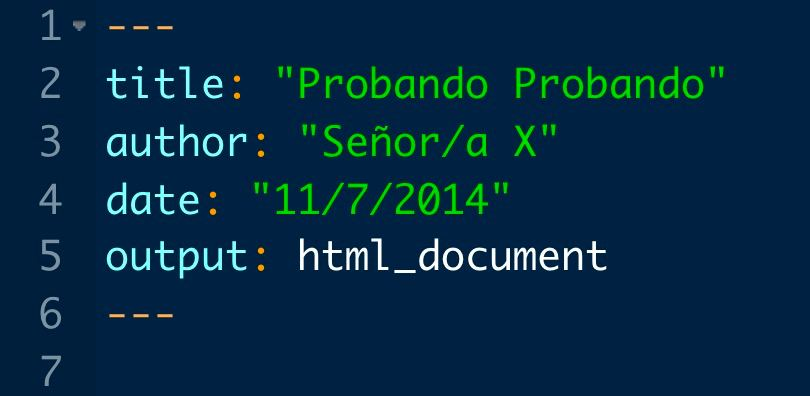
``` 

---

# .orange[PRIMER INFORME]: .green[TEXTO]

Solo hay una cosa **.bg-purple_light[importante]** a tener en cuenta en este entorno: salvo que indiquemos lo contrario, **.bg-purple_light[TODO lo que vamos a escribir en el documento es texto]**. No código R. Texto plano que podremos mejorar un poco con algun detalle, pero texto.

Vamos a empezar nuestro documento escribiendo por ejemplo la siguiente frase


```{r eval = FALSE}
Este material ha sido diseñado por el profesor Javier Álvarez Liébana,
docente en la Universidad Complutense de Madrid
```

---

# .orange[PRIMER INFORME]: .green[TEXTO]


.pull-left[

```{r echo = FALSE,  out.width = "99%", fig.align = "left", fig.cap = "Primer informe html"}
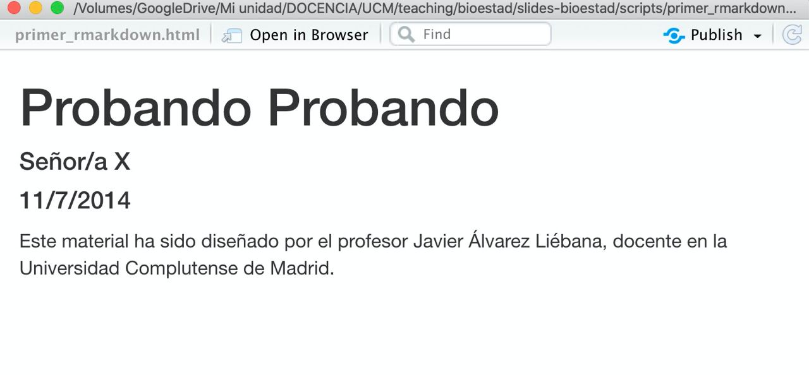
``` 

]

.pull-right[

Una vez que hemos escrito el texto vamos a **.bg-purple_light[guardar el archivo .Rmd]** haciendo click en el botón `Guardar` (yo he llamado al archivo `primer_rmarkdown.Rmd`). Tras guardar el documento, **.bg-purple_light[«tejeremos» nuestro documento]** haciendo click en el botón `Knit`.

Al «tejer» se nos habrá generado (seguramente en una ventana al margen) un archivo .html, que podemos incluso **.bg-purple_light[abrir en nuestro navegador]**. Hemos creado nuestro primer informe, obviamente vacío de momento. 


]


---

# .orange[PRIMER INFORME]: .green[TEXTO]


.pull-left[

```{r echo = FALSE,  out.width = "99%", fig.align = "left", fig.cap = "Tuneando nuestro primer informe html"}
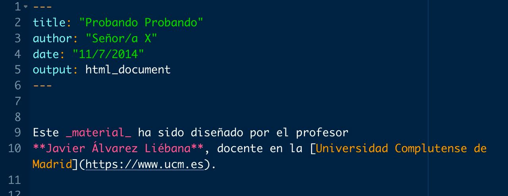
``` 

]

.pull-right[

Vamos a **.bg-purple_light[mejorar]** un poco el texto haciendo lo siguiente:

* Vamos a añadir **.bg-purple_light[negrita]** al nombre (poniendo `**` al inicio y al final).

* Vamos añadir _cursiva_ a la palabra `material` (poniendo `_` al inicio y al final).

*  Vamos añadir un enlace `https://www.ucm.es`, asociándolo al nombre de la Universidad. Para ello el título lo ponemos entre corchetes y justo detrás el enlace entre paréntesis `[«Universidad Complutense de Madrid»](https://www.ucm.es)`

]

---


# .orange[PRIMER INFORME]: .green[CHUNKS] de R

Para añadir **.bg-purple_light[código R]** debemos crear nuestras **.bg-purple_light[cajas de código]** llamadas **.bg-orange[chunks]**: altos en el camino en nuestro texto markdown donde podremos incluir **código**. Para incluir uno deberá de ir encabezado de la siguiente forma.

```{r echo = FALSE,  out.width = "90%", fig.align = "left", fig.cap = "Encabezado/final del chunk"}
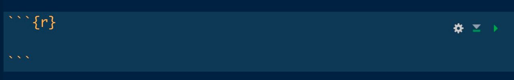
``` 

---

# .orange[PRIMER INFORME]: .green[CHUNKS] de R


Dentro de dicha **.bg-purple_light[cajita]** (que tiene ahora **otro color** en el documento) escribiremos **.bg-purple_light[código R]**, como lo veníamos haciendo hasta ahora. Vamos por ejemplo a **.bg-purple_light[definir dos variables]** y su suma de la siguiente manera, escribiendo dicho código en nuestro `.Rmd` (dentro de ese chunk)

.pull-left[

```{r}
# Código R
x <- 1
y <- 2
x + y
```

]

.pull-right[

```{r echo = FALSE,  out.width = "99%", fig.align = "left", fig.cap = "Primer chunk con código"}
knitr::include_graphics("./img/rmd_3.jpg")
``` 

]

---

# .orange[PRIMER INFORME]: .green[CHUNKS] de R

.pull-left[

```{r}
# Código R
x <- 1
y <- 2
x + y
```

]

.pull-right[

```{r echo = FALSE,  out.width = "70%", fig.align = "left", fig.cap = "Primer chunk con código"}
knitr::include_graphics("./img/rmd_3.jpg")
``` 

]

Como ves dentro de esos _chunks_ puedes **.bg-purple_light[comentar código]** con `#` (ahora veremos que hace `#` fuera de esas cajas de código). Tras hacerlo tejemos de nuevo y obtenemos ahora un documento que tiene una caja de código y su salida.

```{r echo = FALSE,  out.width = "40%", fig.align = "left", fig.cap = "Salida del html con el primer chunk"}
knitr::include_graphics("./img/html_rmd_3.jpg")
``` 


---

# .orange[PRIMER INFORME]: .green[CHUNKS] de R


Somos capaces de **.bg-purple_light[escribir en un mismo documento texto]** con cierto formato, **.bg-purple_light[código R y la salida]** del resultado, permitiéndonos generar informes (ya veremos como incluir gráficas). De hecho, lo más práctico para **.bg-purple_light[tomar apuntes de R]** es ir anotando en un archivo `.Rmd`.

Los chunks pueden tener un **.bg-purple_light[nombre o etiqueta]**, de forma que podamos referenciarlos de nuevo para no repetir código.

```{r echo = FALSE,  out.width = "40%", fig.align = "left", fig.cap = "Etiquetando un chunk y reciclándolo"}
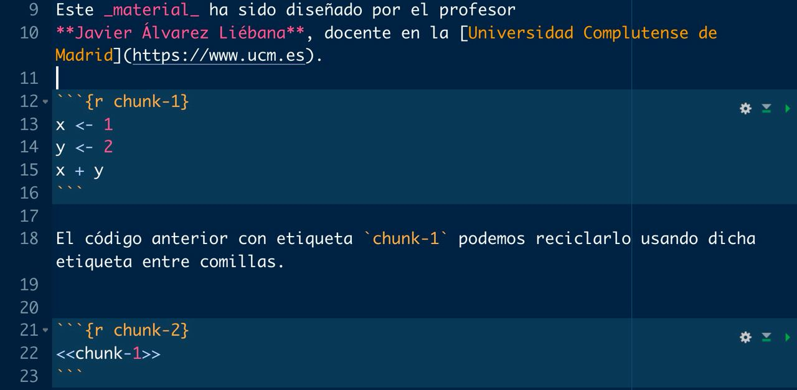
``` 


---

# .orange[PRIMER INFORME]: .green[ORGANIZANDO]

Con todo incluido en el documento podemos **.bg-purple_light[dividirlo en secciones y subsecciones]**. Para ello usaremos la sintaxis de markdown, poniendo **.bg-purple_light[almohadillas]**: una `#` para secciones, `##` para subsecciones, `###` para subsubsecciones, etc. Por ejemplo, vamos a

* Hacer una sección principal que sea `# Primer informe`
* Tras ello añadiremos la parte de texto.
* Creamos una subsección que se titule `## Chunks de código` donde incluiremos los dos chunks que tenemos hasta ahora.


.pull-left[

```{r echo = FALSE,  out.width = "80%", fig.align = "right", fig.cap = "Secciones en el rmd"}
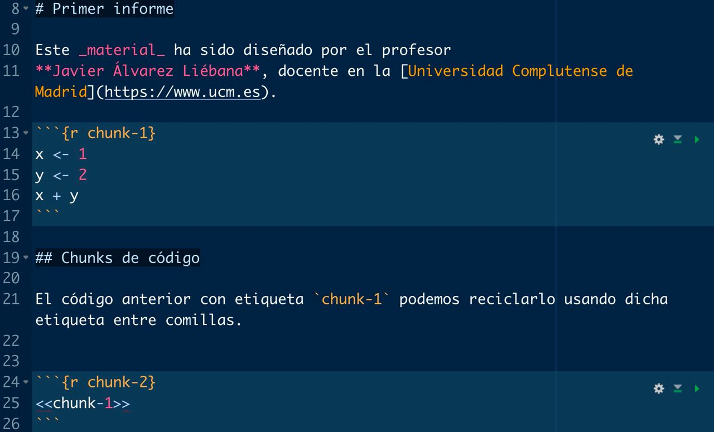
``` 


]

.pull-right[

```{r echo = FALSE,  out.width = "80%", fig.align = "left", fig.cap = "Secciones en el html"}
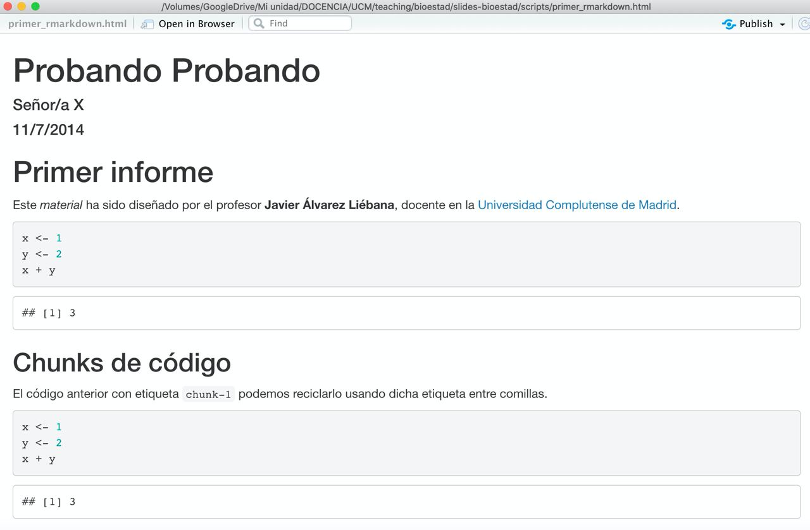
``` 


]

---


# .orange[PRIMER INFORME]: .green[ORGANIZANDO]

Además podemos incluir tras el título (y entre llaves `{}`) **.bg-purple_light[etiquetas]** (con `{#etiqueta}`) para luego **.bg-purple_light[referenciar dichas secciones]** en el documento.

.pull-left[

```{r echo = FALSE,  out.width = "75%", fig.align = "left", fig.cap = "Referencias a secciones y subsecciones"}
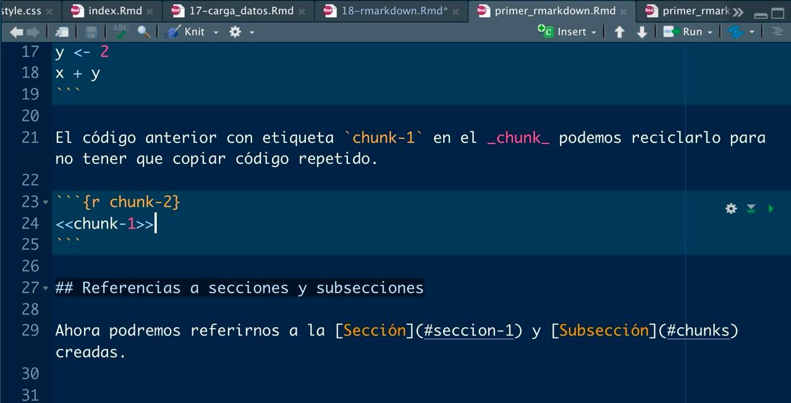
``` 

]

.pull-right[

También podemos organizar nuestro código **.bg-purple_light[creando listas]**, usando `*` como ítems.

```{r echo = FALSE,  out.width = "85%", fig.align = "left", fig.cap = "Creando listas con ítems"}
knitr::include_graphics("./img/items_rmd.jpg")
``` 

]

---

# .orange[PRIMER INFORME]: .green[PERSONALIZAR]

En cada chunk aparece una **.bg-purple_light[botón de play]**: pulsándolo podemos tener la **ejecución y salida** de cada chunk en nuestro `.Rmd`, sin tener que esperar a «tejer» (con Knit) todo el documento para ver lo que vamos ejecutando.


.pull-left[

```{r echo = FALSE,  out.width = "99%", fig.align = "left", fig.cap = "Pulsando al botón play"}
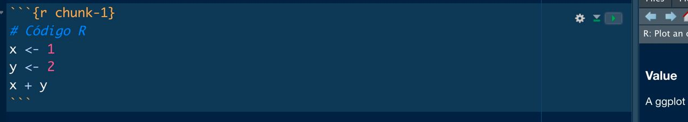
```

]

.pull-right[

```{r echo = FALSE,  out.width = "99%", fig.align = "left", fig.cap = "Chunk ejecutado in-line"}
knitr::include_graphics("./img/chunk_ejecutado.jpg")
```

]

---

# .orange[PRIMER INFORME]: .green[PERSONALIZAR]


Además podemos **.bg-purple_light[incluir código R dentro de la línea de texto]** (en lugar de mostrar el texto x ejecuta el código R mostrando la variable).


.pull-left[

```{r echo = FALSE,  out.width = "99%", fig.align = "left", fig.cap = "Código R inline"}
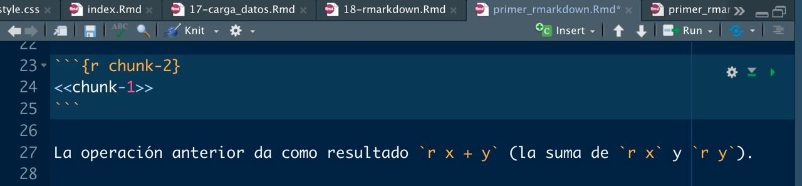
```

]

.pull-right[

```{r echo = FALSE,  out.width = "99%", fig.align = "left", fig.cap = "Salida del código in-line"}
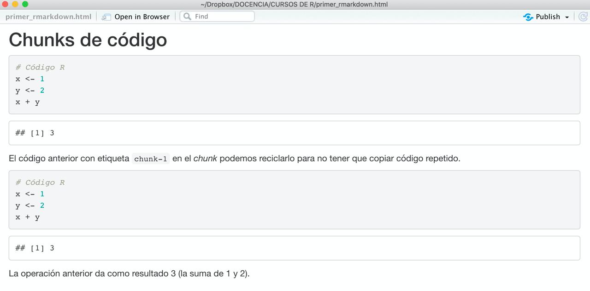
```

]

---

# .orange[PRIMER INFORME]: .green[PERSONALIZAR]


Los chunk podemos **.bg-purple_light[personalizar su salida]** con algunas opciones, pasándolos como argumentos dentro de las llaves ({r etiqueta, ...}).

* `include = FALSE`: **.bg-green_light[ejecuta código]** pero **.bg-red_light[no se muestra (ni resultados)]** en la salida.

* `echo = FALSE`: **.bg-green_light[ejecuta código]** y se **.bg-green_light[muestra resultado]** pero **.bg-red_light[no el código]** en la salida.

* `eval = FALSE`: se **.bg-green_light[muestra el código]** pero **.bg-red_light[no se ejecuta]** en la salida final.

* `message = FALSE`: se **.bg-green_light[ejecuta el código]** pero **.bg-red_light[no se muestran mensajes]** de salida que tendríamos en consola.

* `warning = FALSE`: **.bg-green_light[ejecuta código]** pero **.bg-red_light[no se muestran warning]**.

* `error = TRUE`: se **.bg-green_light[ejecuta el código]** pero permite ejecutar el código **.bg-green_light[con errores]** mostrando los mensajes de error.
 
--

Estas opciones podemos aplicarlas chunk a chunk o fijar los parámetros de forma global con `knitr::opts_chunk$set()` (dentro de un chunk), pasándole como argumentos dichas opciones (por ejemplo, `knitr::opts_chunk$set(echo = FALSE)`).

---

# .orange[PRIMER INFORME]: .green[VARIABLES/ECUACIONES]

Por último en este primer documento vamos a añadir una subsección `## Variables y ecuaciones` donde añadiremos un chunk asignando la suma `x + y` a una variable `z`, escribiendo antes en texto el nombre de la variable y la **.bg-purple_light[fórmula]** ($z = x + y$ entre dólares).


.pull-left[

```{r echo = FALSE,  out.width = "90%", fig.align = "left", fig.cap = "Añadiendo variables en el .rmd"}
knitr::include_graphics("./img/variables_rmd.jpg")
``` 

]

.pull-right[

```{r echo = FALSE,  out.width = "110%", fig.align = "left", fig.cap = "Añadiendo variables en el .rmd"}
knitr::include_graphics("./img/variables_html.jpg")
``` 

]


---

name: ejercicios-I

# Ejercicios extras

La entrega de dicho ejercicios tienen de deadline antes de la próxima clase y son **.bg-purple_light[voluntarios]** (no contará para la nota). A cambio el alumno que lo haga recibirá una corrección de la tarea (como si contase para nota), teniendo una retroalimentación.

.panelset[
.panel[.panel-name[Vectores y matrices: I]

* 📝 **Ejercicio 1**: define un vector `y` que contenga los 5 primeros pares, y otro `x` con los 5 primeros impares. Haz la suma de `x` e `y`.
 
* 📝 **Ejercicio 2**: encuentra del vector `x <- c(-1, 0, -2, 5, 3, 7)` el lugar (el índice) que ocupa su mínimo y su máximo.
 
* 📝 **Ejercicio 3**: haz uso de `x <- rnorm(n = 1000, mean = 0, sd = 1)` para guardar en `x` datos generados por una normal de media 0 y desviación típica 1. Tras ello, ordena el vector `x` de menor a mayor y mayor a menor.

]

.panel[.panel-name[Vectores y matrices: II]

* 📝 **Ejercicio 4**:  el siguiente código define una matriz de dimensiones `4 x 3` y calcula la suma por columnas. Modifica el código para que realice la suma por filas.
 
```{r eval = FALSE}
matriz <- matrix(1:12, nrow = 4)
apply(matriz, MARGIN = 2, FUN = "sum")
```

* 📝 **Ejercicio 5**: tomando la matriz del ejercicio anterior, accede a la segunda variable. Accede al primer registro. Accede al valor de la tercera variable del segundo individuo.

]

]

---

name: entrega-I

# .orange[ENTREGA I]
pendiente de concretar

&nbsp;

🔎 Mira antes <https://github.com/dadosdelaplace/teaching/tree/main/data_science_seguros/scripts> el ejemplo de entrega (con enunciados sin y con resolver) para realizarla correctamente (tras revisar las diapositivas de `.rmd`).


---

class: inverse center middle
name: clase-2

# CLASE 2: primeros datos

&nbsp;

### [Datos tabulados: matrices, data.frame y tibble](#matrices)

### [Tidy data](#tidydata)

### [Introducción a tidyverse](#tidyverse-1)

### [Ejercicios y entrega](#complementos-II)

---


name: matrices

# De la .orange[celda] a la .green[tabla]
 

```{r echo = FALSE,  out.width = "55%", fig.align = "center"}
knitr::include_graphics("./img/celdas.jpg")
``` 

* **.bg-purple_light[Celda]**: un dato **.bg-orange[individual]** de un tipo concreto.

* **.bg-purple_light[Variable]**: una **.bg-orange[concatenación de valores]** del mismo tipo (**vectores**).


&nbsp;


**.bg-purple_light[Matriz]**: **.bg-orange[concatenación de variables]** del **.bg-yellow[mismo tipo]** y longitud.

---

# .orange[MATRICES]: concatenando variables


Cuando analizamos datos solemos tener varias **variables distintas** de cada individuo: necesitamos una «tabla» con **.bg-purple_light[distintas variables]** (de **.bg-orange[IGUAL longitud]**).

Las **.bg-purple_light[matrices]** son una concatenación de variables, del **.bg-orange[mismo tipo e igual longitud]**, dispuestas en **p columnas** (datos p-dimensionales) 

--

&nbsp;

Vamos a empezar definiendo una **matriz sencilla**: imagina que tenemos las estaturas y pesos de 5 personas. ¿Cómo juntar las dos variables creando nuestro primer conjunto de datos? Fíjate que son del mismo tipo e igual longitud.

```{r}
estaturas <- c(150, 160, 170, 180, 190)
pesos <- c(60, 70, 80, 90, 100)
```

---

# .orange[MATRICES]: concatenando variables

```{r}
estaturas <- c(150, 160, 170, 180, 190)
pesos <- c(60, 70, 80, 90, 100)
```

¿Cómo juntar las dos variables creando nuestro primer conjunto de datos? Vamos a **.bg-purple_light[crear una matriz]**, un conjunto de números organizado en 2 columnas (una por variable) y 5 filas o registros (una por persona). Para ello usaremos la función `cbind()`, que nos **concatena vectores de igual longitud en columnas**.

 
```{r}
# Construimos la matriz por columnas
datos_matriz <- cbind(estaturas, pesos) #<<
datos_matriz
```

---

# .orange[MATRICES]: concatenando variables


.pull-left[

```{r echo = FALSE,  out.width = "99%", fig.align = "left"}
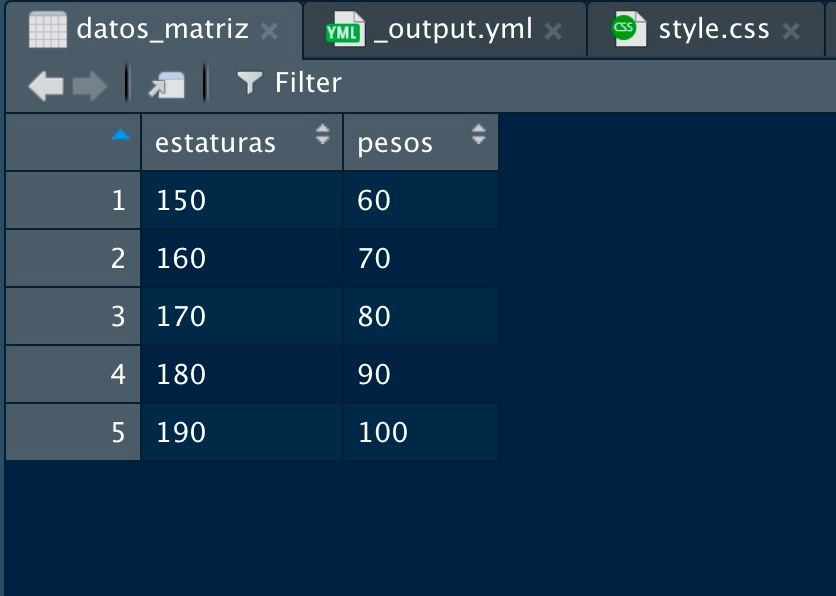
``` 


]


.pull-right[

```{r eval = FALSE}
View(datos_matriz)
```

Podemos **.bg-purple_light[visualizar la matriz]** en un formato «excelizado» con la función `View()`.


También podemos **.bg-purple_light[construir la matriz por filas]** con la función `rbind()` (aunque lo recomendable es tener cada variable en  columna y cada individuo en fila).

```{r}
# Construimos la matriz por filas
rbind(estaturas, pesos) 
```

]

---
 
 
# .orange[MATRICES]: concatenando variables

Podemos comprobar las **.bg-purple_light[dimensiones de una matriz]** con `dim()`, `nrow()` y `ncol()`: nuestros datos están **.bg-orange[tabulados]**:

```{r}
dim(datos_matriz) # vector
nrow(datos_matriz)
ncol(datos_matriz)
```

---

# .orange[MATRICES]: concatenando variables


Veamos un ejemplo con **tres variables/columnas**: edades, teléfonos y códigos postales.

```{r}
edades <- c(14, 24, 56, 31, 20, 87, 73) 
tlf <- c(NA, 683839390, 621539732, 618211286, NA, 914727164, NA)
cp <- c(33007, 28019, 37005, 18003, 33091, 25073, 17140)

# Construimos la matriz por columnas
datos_matriz <- cbind(edades, tlf, cp) #<<
datos_matriz
```


---

# .orange[MATRICES]: añadir registros/variables

Las funciones `cbind()` y `rbind()` no solo nos permiten crear matrices desde cero sino también **.bg-purple_light[añadir filas o columnas]** a matrices existentes.

```{r}
# Añadimos una fila
rbind(datos_matriz, c(27, 620125780, 28051))
```


---

# .orange[MATRICES]: valores repetidos

Podemos definir una **.bg-purple_light[matriz de nº repetidos]** con `matrix(..., nrow = ..., ncol = ...)`

```{r}
# matriz de ceros de 3 filas, 2 columnas,
matrix(0, nrow = 3, ncol = 2) #<<
```

--

También podemos definir una **.bg-purple_light[matriz a partir de un vector numérico]**, reorganizando los valores en forma de matriz (sabiendo que los elementos se van colocando por columnas).

```{r}
matrix(1:15, ncol = 5) # Matriz con el vector 1:15
```

---

# .green[OPERACIONES] con .orange[MATRICES]

Con las matrices sucede como con los vectores: cuando aplicamos una **.bg-purple_light[operación aritmética]** lo hacemos **.bg-orange[elemento a elemento]**

```{r}
z <- matrix(1:15, ncol = 5) 
z / 5
z + 3
```

---

# .orange[MATRICES] de .green[CARACTERES]

También podemos crear matrices de otros tipos de datos, siempre y cuando las **.bg-purple_light[columnas sean del mismo tipo e igual longitud]**, por ejemplo una **.bg-orange[matriz de caracteres]**.

```{r}
# matriz de caracteres
nombres <- c("Javier", "Carlos", "María")
apellidos <- c("Álvarez", "García", "Pérez")
cbind(nombres, apellidos)
```

--

```{r}
# matriz de valores lógicos
cbind(c(TRUE, FALSE), c(FALSE, TRUE))
```

---

# .orange[SELECCIONAR] elementos

Si recuerdas para los vectores, usábamos el operador `[i]` para **acceder al elemento i-ésimo**. En el caso de las matrices la lógica será la misma:

* para **.bg-purple_light[acceder a la fila i-ésima]** se usa el operador `[i, ]` (dejando libre la columna).

```{r}
datos_matriz[1, ] # fila 1
```

---

# .orange[SELECCIONAR] elementos

Si recuerdas para los vectores, usábamos el operador `[i]` para **acceder al elemento i-ésimo**. En el caso de las matrices la lógica será la misma:

* para **.bg-purple_light[acceder a la columna j-ésima]** se usa el operador `[, j]` (dejando libre la fila).

```{r}
datos_matriz[, 3] # columna 3
```


---

# .orange[SELECCIONAR] elementos

Si recuerdas para los vectores, usábamos el operador `[i]` para **acceder al elemento i-ésimo**. En el caso de las matrices la lógica será la misma:

* para **.bg-purple_light[acceder conjuntamente al elemento (i, j)]** se usa el operador `[i, j]`.

```{r}
datos_matriz[1, 3] # elemento (1, 3)
datos_matriz[2, 2] # elemento (1, 3)
```

---


# Ejercicios de matrices

.panelset[
.panel[.panel-name[Ejercicios]


* 📝 **Ejercicio 1**: modifica el código para definir una matriz `x` de ceros de 3 filas y 7 columnas.
 
```{r eval = FALSE}
# Matriz
x <- matrix(0, nrow = 2, ncol = 3)
x
```

* 📝 **Ejercicio 2**: a la matriz anterior, suma un 1 a cada número de la matriz y divide el resultado entre 5.
 

* 📝 **Ejercicio 3**: tras definir la matriz `x` calcula su transpuesta (mira `t()`) y obtén sus dimensiones
 

]

.panel[.panel-name[Solución ej. 1]

```{r}
x <- matrix(0, nrow = 3, ncol = 7)
x
```

]

.panel[.panel-name[Solución ej. 2]

```{r}
# sumamos 1
x + 1

# dividimos entre 5
(x + 1) / 5
 
```

]

.panel[.panel-name[Solución ej. 3]

```{r}
# dimensiones originales
dim(x)

# transpuesta
y <- t(x)
y
dim(y)
```

]


]

---

# Ejercicios de matrices

.panelset[
.panel[.panel-name[Ejercicios]


* 📝 **Ejercicio 4**: define la matriz `x <- matrix(1:12, nrow = 4)`. Obtén la primera fila, la tercera columna, y el elemento (4, 1).

* 📝 **Ejercicio 5**: en la matriz anterior, pon a cada fila `i` el nombre `fila_i` (fila_1, fila_2, fila_3, fila_4).

]

.panel[.panel-name[Solución ej. 4]

```{r}
x <- matrix(1:12, nrow = 4)

# primera fila
x[1, ]

# tercera columna
x[, 3]

# (4, 1)
x[4, 1]
```

]

.panel[.panel-name[Solución ej. 5]

```{r}
x
row.names(x) <- glue("fila_{1:4}")
x
```

]

]


---

# .orange[TABLAS]: variables .green[data.frame]
 


```{r echo = FALSE,  out.width = "45%", fig.align = "center"}
knitr::include_graphics("./img/celdas.jpg")
``` 

* **.bg-purple_light[Celda]**: un dato **.bg-orange[individual]** de un tipo concreto.

* **.bg-purple_light[Variable]**: una **.bg-orange[concatenación de valores]** del mismo tipo (**vectores**).

* **.bg-purple_light[Matriz]**: **.bg-orange[concatenación de variables]** del **.bg-yellow[mismo tipo]** y longitud.

&nbsp;


* **.bg-purple_light[data.frame (tabla)]**: **.bg-orange[concatenación de variables]** de **.bg-yellow[DISTINTO tipo]** e igual longitud.


---

# .red[PROBLEMAS] de las .green[MATRICES]


Retomemos nuestra matriz de edades, teléfonos y códigos postales.

```{r}
edades <- c(14, 24, 56, 31, 20, 87) 
tlf <- c(NA, 683839390, 621539732, 618211286, NA, 914727164)
cp <- c(33007, 28019, 37005, 18003, 33091, 25073)

# Construimos la matriz por columnas
datos_matriz <- cbind(edades, tlf, cp) #<<
datos_matriz
```

--

¿Qué sucederá si ahora **.bg-purple_light[añadimos una columna con los nombres]** (tipo caracter) de cada persona?

---


# .red[PROBLEMAS] de las .green[MATRICES]

```{r}
nombres <- c("Sonia", "Carla", "Pepito", "Carlos", "Lara", "Sandra", "Javi")
datos_matriz_nueva <- cbind(nombres, datos_matriz)
```

```{r echo = FALSE}
datos_matriz_nueva 
```

**.bg-red_light[¿Has visto lo que ha sucedido?]**

--

Como una **.bg-purple_light[matriz solo puedes tener un tipo de dato]**, al añadir una variable de tipo texto, `R` se ha visto obligado a **convertir los números en texto** (poniéndole **comillas**). 

```{r error = TRUE}
datos_matriz_nueva[, "edades"] + 1
```

---

# .red[PROBLEMAS] de las .green[MATRICES]

Las **.bg-purple_light[matrices]** nos permiten almacenar distintas variables SIEMPRE Y CUANDO tengan

* **.bg-orange[Misma longitud]**.
* **.bg-orange[Mismo tipo]** de dato (sin mezclar).

Esto es bastante limitante en la vida real nuestros datos tendrán variables de todo tipo: supongamos que queremos **guardar de 7 personas las siguientes variables**.


```{r}
# Nombres
nombres <- c("Sonia", "Carla", "Pepito", "Carlos", "Lara", "Sandra", "Javi")

# Edades
edades <- c(45, 67, NA, 31, 27, 19, 50)

# Estado civil
casado <- c(TRUE, FALSE, FALSE, NA, TRUE, FALSE, FALSE)

# Fecha de creación en el sistema
fecha_creacion <-
  as_date(c("2021-03-04", "2020-10-12", "1990-04-05", "2019-09-10",
            "2017-03-21", "2020-07-07", "2000-01-28"))
```


---

# .red[PROBLEMAS] de las .green[MATRICES]

Aahora tenemos un **popurrí de variables**, de la misma longitud pero de tipos distintos:

* `edades` variable **numérica**.
* `nombres` variable de **texto**.
* `casado` es una variable **lógica**.
* `fecha_creacion` de tipo **fecha**.

¿Qué sucedería si **.bg-purple_light[intentamos mezclar todo en una matriz]**?

--

```{r}
# Juntamos por columnas
datos_matriz <- cbind(nombres, edades, casado, fecha_creacion)
datos_matriz
```

---

# .red[PROBLEMAS] de las .green[MATRICES]

```{r}
datos_matriz
```

Dado que en una **.bg-purple_light[matriz solo podemos almacenar datos del mismo tipo]**, los números los convierte a texto, las variables lógicas las convierte a texto (`TRUE` era un valor lógico, `"TRUE"` es un texto, sin significado de verdadero/falso) y las fechas las ha convertido a texto.

```{r error = TRUE}
datos_matriz[1, "fecha_creacion"] - datos_matriz[2, "fecha_creacion"]
```

---

# .orange[TABLAS]: variables .green[data.frame]

Vamos a aprender cómo juntar variables de distinto tipo, sin **modificar la integridad** del dato. El formato de **.bg-purple_light[tabla de datos]** que vamos a empezar a usar se llama `data.frame`: una **.bg-purple_light[colección de variables de igual longitud]** pero cada una puede ser de un **.bg-orange[tipo distinto]**.

--

Para crearlo basta con usar la función `data.frame()`, pasándole como argumentos (separados por comas) las variables que queremos reunir.

```{r}
# Creamos nuestro primer data.frame
tabla <- data.frame(nombres, edades, casado, fecha_creacion) #<<
tabla
```

---

# .orange[TABLAS]: variables .green[data.frame]

```{r}
tabla
class(tabla)
dim(tabla)
```

---

# .orange[TABLAS]: variables .green[data.frame]

Al igual que con matrices, podemos **.bg-purple_light[crear un data.frame]** indicando **nombre de columnas**

```{r}
tabla <-
  data.frame("nombre" = nombres, "edad" = edades,
             "casado" = casado, "fecha_registro" = fecha_creacion)
tabla
```

&nbsp;

**.bg-green_light[¡TENEMOS NUESTRO PRIMER CONJUNTO DE DATOS!]** Puedes visualizarlo escribiendo su nombre en consola o con `View(tabla)`

---

# .orange[TABLAS]: variables .green[data.frame]

Si tenemos uno ya creado y queremos **.bg-purple_light[añadir una columna]** es tan simple como usar la `función data.frame()` que ya hemos visto para concatenar la columna. Vamos añadir por ejemplo una nueva variable, el **número de hermanos** de cada individuo.

```{r}
# Añadimos una nueva columna con nº de hermanos/as
hermanos <- c(0, 0, 1, 5, 2, 3, 0)
tabla <- data.frame(tabla, "n_hermanos" = hermanos)
tabla
```

---

# .orange[TABLAS]: variables .green[data.frame]

Si queremos **.bg-purple_light[acceder a una columna, fila o elemento]** en concreto, los `data.frame` tienen las mismas ventajas que una matriz, así que bastaría con usar los mismos operadores.

```{r}
tabla[5, ] # Accedemos a la quinta fila
```

--

.pull-left[

```{r echo = FALSE,  out.width = "99%", fig.align = "left", fig.cap = "Menú desplegable de variables (columnas)"}
knitr::include_graphics("./img/tabla_dolar.jpg")
``` 
]

.pull-right[

No solo tiene las ventajas de una matriz sino que también tiene las **.bg-purple_light[ventajas de una «base» de datos]**: podemos aceder a las variables por el índice de columna que ocupan pero también **.bg-purple_light[acceder por su nombre]**, poniendo el nombre de la tabla, el símbolo `$` y, con el tabulador, nos aparecerá un menú de columnas a elegir.

]

---

name: tibble

# Mejorando los data.frame: .orange[TIBBLE]
 
Las tablas en formato `tibble` (con `tibble()` del paquete `{tibble}`, su clase será `tbl_df`) son un tipo de `data.frame` mejorado, para una gestión **.bg-purple_light[más ágil, eficiente y coherente]**. Las tablas en formato `tibble` tienen **.bg-purple_light[4 ventajas principales]**

```{r echo = FALSE,  out.width = "30%", fig.align = "center"}
knitr::include_graphics("./img/tibble.svg")
``` 

---

# Mejorando los data.frame: .orange[TIBBLE]


*  Muestran **.bg-purple_light[metainformación de las variables]**, y solo imprime por defecto las primeras filas.

```{r}
library(tibble)
tabla_tb <- tibble("x" = 1:50, "y" = rep(c("a", "b", "c", "d", "e"), 10),
                   "logica" = rep(c(TRUE, FALSE), 25))
tabla_tb
```


---

# Mejorando los data.frame: .orange[TIBBLE]
 
Puedes **imprimir las filas y columnas** que quieras con `print()`

```{r}
print(tabla_tb, n = 12, width = Inf) #<<
```

---

# Mejorando los data.frame: .orange[TIBBLE]
 

* La función `tibble()` **.bg-purple_light[construye las variables secuencialmente]**, pudiendo hacer uso en la propia definición de variables recién definidas en dicha definición.

```{r error = TRUE}
# data.frame
data.frame("x1" = 1:3, "x2" = 4:6, "y" = x1 * x2)
```

```{r}
# tibble
tibble("x1" = 1:3, "x2" = 4:6, "y" = x1 * x2)
```


---

# Mejorando los data.frame: .orange[TIBBLE]
 
* Si accedes a una **.bg-purple_light[columna que no existe]** avisa con un **.bg-red[warning]**.

```{r}
tabla_df <- data.frame("x" = 1:50, "y" = rep(c("a", "b", "c", "d", "e"), 10),
                   "logica" = rep(c(TRUE, FALSE), 25))
```

.pull-left[

```{r warning = TRUE}
# data.frame
tabla_df$variable_inexistente
```

]

.pull-right[

```{r warning = TRUE}
# tibble
tabla_tb$variable_inexistente
```

]

---


# Mejorando los data.frame: .orange[TIBBLE]

* No solo no te cambiará el tipo de datos sino que **.bg-purple_light[no te cambiará el nombre de las variables]**.

.pull-left[

```{r}
data.frame(":)" = "emoticono",
           " " = "en blanco",
           "2000" = "número")
```

]

.pull-right[

```{r}
tibble(":)" = "emoticono",
       " " = "en blanco",
       "2000" = "número")
```

]

---


# Mejorando los data.frame: .orange[TIBBLE]

Si ya tienes un `data.frame` es altamente recomendable **.bg-purple_light[convertirlo a tibble]** con `as_tibble()` (del paquete `{dplyr}`)

```{r}
library(dplyr)
as_tibble(USArrests)
```

Puedes consultar **más funcionalidades** de dichos datos en <https://tibble.tidyverse.org/>

---

# Mejorando los data.frame: .orange[TIBBLE]

Una de las ventajas es la función `glimpse()`, que nos permite obtener el **.bg-purple_light[resumen de columnas]** (no es para tener un resumen de los datos sino para ver las variables que tenemos y su tipo).

```{r}
glimpse(tabla_tb)
```

---

# Mejorando los data.frame: .orange[TIBBLE]

Amén de poder convetir con `as_tibble()` podemos **.bg-purple_light[crearlos por filas]** (como copiar y pegar de una tabla en documento) en lugar de por columnas con `tribble()`

```{r}
datos <- tribble(
  ~colA, ~colB,
  "a",   1,
  "b",   2)
datos
```

&nbsp;

--

**.bg-green_light[CONSEJO]**: prueba además el paquete `{datapasta}`, que nos permite **.bg-purple_light[copiar y pegar tablas de páginas web]**


---

name: ejercicios-tibble

# Ejercicios

.panelset[
.panel[.panel-name[Ejercicios]


* 📝 **Ejercicio 1**: carga del paquete `{datasets}` el conjunto de datos `airquality` (contiene variables de la calidad del aire de la ciudad de Nueva York desde mayo hasta septiembre de 1973). ¿Es el conjunto de datos airquality de tipo tibble? En caso negativo, conviértelo a `tibble`.

* 📝 **Ejercicio 2**: obtén el nombre de las variables y las dimensiones del conjunto de datos. ¿Cuántas variables hay? ¿Cuántos días se han medido?
 
* 📝 **Ejercicio 3**:  modifica el código inferior para que nos filtre solo los datos del mes de agosto.
 
```{r eval = FALSE}
# Filtramos filas
filtro_fila <- subset(., subset = Month < 6)
filtro_fila
```

]

.panel[.panel-name[Solución ej. 1]

```{r}
library(datasets)
class(airquality) # no es data.frame

# Convertimos a tibble
airquality <- as_tibble(airquality)
class(airquality)
```

]

.panel[.panel-name[Solución ej. 2]

```{r}
names(airquality)

dim(airquality)

# Número variables
ncol(airquality)

# Número días
nrow(airquality)
```

]


.panel[.panel-name[Solución ej. 3]

```{r}
# Filtramos filas
filtro_fila <- subset(airquality, subset = Month == 8)
filtro_fila
```
]

]

---

# Ejercicios

.panelset[
.panel[.panel-name[Ejercicios]


* 📝 **Ejercicio 4**: del conjunto selecciona aquellos datos que no sean ni de julio ni de agosto.

* 📝 **Ejercicio 5**: modifica el siguiente código para quedarte solo con las variable de ozono y temperatura.
 
```{r eval = FALSE}
filtro_col <- subset(.,  select = c("Ozone"))
filtro_col
```

* 📝 **Ejercicio 6**:  selecciona los datos de temperatura y viento de agosto. Traduce a castellano el nombre de las columnas del conjunto filtrado.


* 📝 **Ejercicio 7**: añade a los datos originales una columna con la fecha completa (recuerda que es del año 1973 todas las observaciones).

]

.panel[.panel-name[Solución ej. 4]

```{r}
subset(airquality, subset = !(Month %in% c(7, 8)))
```

]

.panel[.panel-name[Solución ej. 5]

```{r}
# Filtramos columnas
filtro_col <- subset(airquality,  select = c("Ozone", "Temp"))
filtro_col
```

]

.panel[.panel-name[Solución ej. 6]

```{r}
datos <- subset(airquality, subset = Month == 8, select = c("Temp", "Wind"))
datos 

# Traducimos a castellano el nombre
names(datos) <- c("temperatura", "viento")
glimpse(datos)
```

]

.panel[.panel-name[Solución ej. 7]

```{r}
nuevos_datos <- 
  tibble(airquality, "fecha" = as_date(glue("1973-{Month}-{Day}")))
nuevos_datos
```

]


]

---


name: tidydata

# Datos limpios: .orange[TIDY DATA]

.pull-left[

```{r echo = FALSE,  out.width = "99%", fig.align = "center"}
knitr::include_graphics("./img/tidyverrse_universe.jpg")
``` 

]

.pull-right[
```{r echo = FALSE,  out.width = "99%", fig.align = "center"}
knitr::include_graphics("./img/flow_tidyverse.jpg")
``` 
]

Universo de **.bg-purple_light[paquetes tidyverse]**: un conjunto de paquetes para un flujo de **trabajo eficiente, coherente y lexicográficamente** sencillo de entender.

---

# Datos limpios: .orange[TIDY DATA]

> Tidy datasets are all alike, but every messy dataset is messy in its own way (Hadley Wickham, Chief Scientist en RStudio)

Hasta ahora solo le hemos dado importancia al «qué» pero no al **.bg-purple_light[«cómo» manejamos los datos]**. La organización de nuestros datos es fundamental para que su **.bg-purple_light[preparación y explotación]** sea lo más eficiente posible.

```{r echo = FALSE,  out.width = "60%", fig.align = "center", fig.cap = "Flujo deseable de datos según Hadley Wickham, extraída de https://r4ds.had.co.nz/wrangle-intro.html"}
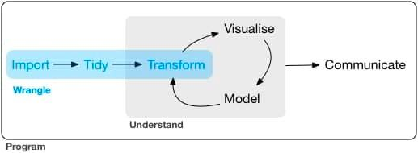
``` 


---

# Datos limpios: .orange[TIDY DATA]

El concepto **.bg-purple_light[tidy data]** fue introducido por **Hadley Wickham** (Wickham, 2014) como el primer paso de un flujo de trabajo eficiente. Para ello haremos uso del paquete `{tidyr}` (dentro de `{tidyverse}`) que nos proporciona herramientas eficientes y sencillaspara su manejo.

--

&nbsp;

Los **.bg-purple_light[conjuntos tidy u ordenados]** tienen tres objetivos

* **.bg-orange[Estandarización]** en su estructura para una depuración y análisis eficiente.
* **.bg-orange[Sencillez]** en su manipulación.
* Listos para ser **.bg-orange[modelizados y visualizados]**.

&nbsp;

📚 Ver Wickham (2014) en **.bg-green_light[bibliografía]** en <https://github.com/dadosdelaplace/teaching/tree/main/bioestad/biblio>

---

# Datos limpios: .orange[TIDY DATA]


.pull-left[

Los **.bg-purple_light[datos ordenados o tidy data]** deben cumplir:

1. Cada **.bg-green_light[variable en una columna]**.

2. Cada **.bg-orange[observación/individuo en una fila]** diferente.

3. Cada **.bg-green_light[celda con un único valor]**.

4. Cada **.bg-orange[conjunto en un tibble]** (tabla).

5. Si usamos múltiples tablas a la vez debemos tener una **.bg-green_light[columna común para poder cruzarlas]**.

]

.pull-right[

```{r echo = FALSE,  out.width = "85%", fig.align = "center"}
knitr::include_graphics("./img/tidy_def.jpg")
``` 

&nbsp;

```{r echo = FALSE,  out.width = "50%", fig.align = "center"}
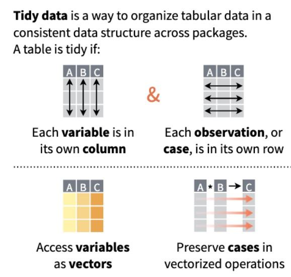
``` 


]


---

# Tubería .orange[PIPE]

En este entorno de trabajo tendremos un **.bg-purple_light[operador clave]**: el **.bg-purple_light[operador pipeline]** `%>%` (podemos usar el atajo con `ctrl+shift+M` o `command+shift+M`). Dicho operador lo debemos interpretar como una **.bg-purple_light[tubería]** que va pasando por los datos y los va transformando.

--

Por ejemplo, si tuviésemos tres funciones `first()`, `second()` y `third()`, la opción más inmediata sería anidar las tres funciones tal que `third(second(first(x)))`, algo que dificulta la lectura posterior del código

--

Con `%>%` podremos escribir (y leer) la concetanción de acciones como una **.bg-purple_light[tubería de izquierda a derecha]**:

```{r eval = FALSE}
first(x) %>% second(x) %>% third(x)
```

--

Dicho operador viene del paquete `{magrittr}`. Para **evitar esta dependencia** (cuantos menos paquetes tengamos que cargar, mejor), desde la versión 4.1.0 de R, disponemos de un pipeline nativo de R, el **operador** `|>` (disponible además fuera del entorno tidyverse).

---

# Tubería .orange[PIPE]

.pull-left[

```{r eval = FALSE}
datos %>%
  limpio(...) %>%
  selecciono(...) %>%
  filtro(...) %>%
  ordeno(...) %>%
  agrupo(...) %>%
  cuento(...) %>%
  resumo(...) %>% 
  pinto(...)
```

```{r eval = FALSE}
datos |>
  limpio(...) |>
  selecciono(...) |>
  filtro(...) |>
  ordeno(...) |>
  agrupo(...) |>
  cuento(...) |>
  resumo(...) |>
  pinto(...)
```

]

.pull-right[

```{r echo = FALSE,  out.width = "90%", fig.align = "center"}
knitr::include_graphics("./img/tuberia.jpg")
``` 

]

---

# Datos .orange[SUCIOS]: messy data

Por ejemplo, vamos a cargar la tabla `table4a` del paquete `{tidyr}` (que ya lo tenemos cargado del entorno `{tidyverse}`).

```{r echo = FALSE}
library(tidyverse)
```

```{r}
table4a
```

**.bg-purple_light[¿Qué falla?]**

---


# Datos .orange[SUCIOS]: messy data

.pull-left[

```{r echo = FALSE}
library(tidyverse)
```

```{r}
table4a
```

**.bg-purple_light[¿Qué falla?]**

]

.pull-right[


❎ Cada **.bg-green_light[variable en una columna]**.

❎ Cada **.bg-orange[observación/individuo en una fila]** diferente.

❎ Cada **.bg-green_light[celda con un único valor]**.

]

Aunque la columna `$country` representa una variable, las otras columnas no: **.bg-purple_light[ambas son la misma variable]**, solo que medida en años distintos (que debería ser a su vez otra variable), de forma que **.bg-purple_light[cada fila está representando dos observaciones]** (1999, 2000).


---

# Datos .orange[SUCIOS]: messy data


.pull-left[

Lo que haremos será incluir una nueva columna llamada (por ejemplo) `year` que nos marque el año y otra llamada `cases` que nos diga el valor de la variable de interés en cada uno de esos años.

]

.pull-right[

```{r echo = FALSE,  out.width = "65%", fig.align = "center"}
knitr::include_graphics("./img/table4a.jpg")
``` 


]

--

Con la función `pivot_longer()` pivotaremos la tabla para pasarla a **formato long**:

```{r}
table4a %>%
  pivot_longer(cols = c("1999", "2000"), names_to = "year", values_to = "cases") #<<
```

---

# Datos .orange[SUCIOS]: messy data

.pull-left[

```{r}
table4a %>%
  pivot_longer(cols = c("1999", "2000"),
               names_to = "year", 
               values_to = "cases") #<<
```

]

.pull-right[

```{r echo = FALSE,  out.width = "99%", fig.align = "center"}
knitr::include_graphics("./img/table4a_2.png")
``` 


]


* `cols`: el **.bg-purple_light[nombre de las columnas a pivotar]** (con comillas por ser números y no caracteres).
* `names_to`: el **.bg-purple_light[nombre de la nueva columna]** a la mandamos los **.bg-purple_light[nombres]** de las columnas.
* `values_to`: el **.bg-purple_light[nombre de la nueva columna]** a la que vamos a mandar los **.bg-purple_light[datos]**.


---

# Datos .orange[SUCIOS]: messy data


.panelset[
.panel[.panel-name[table4b]

Echa un vistazo a la tabla `{table4b}`

```{r}
table4b
```

**.bg-purple_light[TODO TUYO]**: ¿es tidy o messy? ¿Cómo convertirla a tidy data en caso de que no lo sea ya?

]

.panel[.panel-name[Solución]

```{r}
table4b %>% pivot_longer(cols = "1999":"2000",
                         names_to = "year",
                         values_to = "cases")
```

]

]


---

# Datos .orange[SUCIOS]: messy data

.panelset[
.panel[.panel-name[relig_income]


Echa un vistazo a la tabla `{relig_income}`

```{r}
relig_income
```

**.bg-purple_light[TODO TUYO]**: ¿es tidy o messy? ¿Cómo convertirla a tidy data en caso de que no lo sea ya?

]

.panel[.panel-name[Solución]

```{r}
relig_income %>%
  pivot_longer(cols = "<$10k":"Don't know/refused",
               names_to = "income",
               values_to = "people")
```

]
]


---

# Datos .orange[SUCIOS]: messy data

Veamos un segundo tipo de dato sucio: vamos a cargar la tabla `table2` del paquete `{tidyr}` (que ya lo tenemos cargado del entorno `{tidyverse}`). **.bg-purple_light[¿Qué falla?]**


```{r}
table2
```


---

# Datos .orange[SUCIOS]: messy data

.pull-left[


```{r}
head(table2)
```

]

.pull-right[


```{r echo = FALSE,  out.width = "69%", fig.align = "center"}
knitr::include_graphics("./img/table2.jpg")
``` 
]


❎ Cada **.bg-orange[observación/individuo en una fila]** diferente.


Fíjate en las cuatro primeras filas: los registros con el mismo año deberían ser el mismo, es la misma información, **.bg-purple_light[debería estar en la misma fila]**, pero está dividada en dos. 

---


# Datos .orange[SUCIOS]: messy data

Lo que haremos será lo opuesto a antes: con `pivot_wider()` «ampliaremos» la **.bg-purple_light[tabla a lo ancho]**, con menos filas pero con más columnas.

```{r}
table2 %>%
  pivot_wider(names_from = type, values_from = count) #<<
```

* `names_from`: el **.bg-purple_light[nombre de la columna original]** de la que vamos a sacar las **.bg-purple_light[nuevas columnas]** que vamos a crear (`cases` y `population`).
* `values_from`: el **.bg-purple_light[nombre de la columna orignal]** de la que vamos a sacar los **.bg-purple_light[datos]**.


---

# Datos .orange[SUCIOS]: messy data


Por último veamos un tercer tipo de dato sucio: vamos a cargar la tabla `table3` del paquete `{tidyr}` (que ya lo tenemos cargado del entorno `{tidyverse}`). **.bg-purple_light[¿Qué falla?]**


```{r}
table3
```

--

❎ Cada **.bg-green_light[celda con un único valor]**.


---

# Datos .orange[SUCIOS]: messy data

Lo que haremos será hacer uso de la función `separate()` para mandar **.bg-purple_light[cada valor a una columna diferente]**.

```{r}
table3 %>%
  separate(rate, into = c("cases", "pop")) #<<
```

* `into`: **.bg-purple_light[nombre de nuevas columnas]** donde separaremos valores.


```{r echo = FALSE,  out.width = "50%", fig.align = "center"}
knitr::include_graphics("./img/seperate.jpg")
``` 

---

# Datos .orange[SUCIOS]: messy data


Por defecto lo que hace es **.bg-purple_light[localizar como separador cualquier caracter que no sea alfa-numérico]**. Si queremos un caracter concreto para dividir podemos indicárselo explícitamente. Si usas un separador que no está en los datos te devolverá dichas columnas vacías ya que no ha podido dividirlas.


```{r warning = TRUE}
table3 %>% separate(rate, into = c("cases", "population"), sep = ".")
```

---

# Datos .orange[SUCIOS]: messy data

De la misma manera que podemos separar columnas también podemos **.bg-purple_light[unir columnas]**. Para ello vamos a usar la tabla `table5` del ya mencionado paquete.

```{r}
table5
```

---

# Datos .orange[SUCIOS]: messy data

.pull-left[

Con la función `unite()` vamos a **.bg-purple_light[unir]** el siglo (en `century`) y el año (en `year`), y al inicio le indicaremos como se llamará la nueva variable `year_ok`

```{r}
table5 %>%
  unite(col = year_ok,
        century, year, sep = "")
```

]

.pull-right[

```{r echo = FALSE,  out.width = "99%", fig.align = "center"}
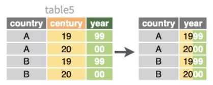
``` 

]


---

# Eliminando .orange[AUSENTES]

El paquete `{tidyr}` también dispone de algunas herramientas útiles para **.bg-purple_light[quitar ausentes]**

```{r}
datos <- tibble(x = c(1, 2, NA), y = c("a", NA, "b"))
datos
```

---

# Eliminando .orange[AUSENTES]


Con `drop_na()` podemos indicarle que nos **.bg-purple_light[elimine las filas con algún ausente]** en alguna de las variables (o especificarle la variable concreta).


.pull-left[

```{r}
datos %>% drop_na()
```

]


.pull-right[

```{r}
datos %>% drop_na(x)
```

]

---

# Eliminando .orange[AUSENTES]

A veces no querremos eliminarlos sino **.bg-purple_light[imputar por el valor previo/siguiente]**  con `fill()`

.pull-left[

```{r}
datos %>% fill(x)
datos %>% fill(x, .direction = c("up"))
```

]

.pull-right[

```{r}
datos %>% fill(y)
datos %>% fill(y, .direction = c("up"))
```

]


---

# Eliminando .orange[AUSENTES]

Los **.bg-purple_light[ausentes]** también pueden ser **.bg-purple_light[eliminados al pivotar]** con `values_drop_na`.


```{r}
stocks <-
  tibble(qtr = 1:4,
         "2015" = c(1.88, 0.59, 0.35, NA),
         "2016" = c(NA, 0.92, 0.17, 2.66))
stocks
```

---

# Eliminando .orange[AUSENTES]

Los **.bg-purple_light[ausentes]** también pueden ser **.bg-purple_light[eliminados al pivotar]** con `values_drop_na`.

```{r}
stocks %>%
  pivot_longer(cols = c("2015", "2016"), names_to = "year",
               values_to = "return", values_drop_na = TRUE)
```

---

# Reemplazando .orange[AUSENTES]

Otras veces querremos **.bg-purple_light[imputar los ausentes por un valor fijo]**, algo que podemos hacer con `replace_na()`

.pull-left[

```{r}
datos
```

]

.pull-right[

```{r}

datos %>%
  replace_na(list(x = -1,
                  y = "unknown"))
```

]

---


# Completando .orange[AUSENTES]

Por último, también podemos **.bg-purple_light[crear todas las combinaciones posibles de variables]** (para completar datos ausentes que se hayan podido eliminar).


```{r}
stocks <- tibble(year = c(2015, 2015, 2015, 2015, 2016, 2016, 2016),
                 qtr = c(1, 2, 3, 4, 2, 3, 4),
                 return = c(1.88, 0.59, 0.35, NA, 0.92, 0.17, 2.66))
```

.pull-left[

```{r}
stocks
```

]

.pull-right[

```{r}
stocks %>% complete(year, qtr)
```

]

---

name: tidvyerse-I

# Introducción a .orange[TIDYVERSE]


.pull-left[

```{r echo = FALSE,  out.width = "89%", fig.align = "center"}
knitr::include_graphics("./img/tidyverrse_universe.jpg")
``` 

También tenemos los paquetes `{purrr}` y `{lubridate}` para el manejo de **listas** y **fechas**, `{readxl}` para importar archivos **.xls y .xlsx**, `{haven}` para importar archivos **SPSS, Stata y SAS**, `{httr}` para importar **desde web** y `{rvest}` para **web scraping**.


]

.pull-right[

* `{tibble}`: **.bg-purple_light[optimizando data.frame]**.

* `{tidyr}`: **.bg-purple_light[limpiar datos]**.

* `{readr}`: **.bg-purple_light[carga rápida]** de datos rectangulares (formatos .csv, .tsv, etc). 

* `{dplyr}`: gramática para **.bg-purple_light[depuración de datos]** para facilitar su procesamiento.

* `{stringr}`: manejo de **.bg-purple_light[textos]**. 

* `{forcast}` manejo de **.bg-purple_light[cualitativas]**.

* `{ggplot2}`: una gramática para la **.bg-purple_light[visualización de datos]**.

* `{tidymodels}`: una gramática para la **.bg-purple_light[modelización y predicción]**.


]


Puedes ver su **documentación completa** en <https://www.tidyverse.org/>.


---

# Introducción a .orange[TIDYVERSE]


```{r echo = FALSE,  out.width = "75%", fig.align = "center", fig.cap = "Flujo deseable de datos según Hadley Wickham, extraída de https://r4ds.had.co.nz/wrangle-intro.html"}

``` 

&nbsp;

El paquete vamos a usar para **.bg-purple_light[depurar los datos]** será el paquete `{dplyr}`, una gramática para la manipulación de datos.

---

# Introducción a .orange[TIDYVERSE]


```{r dplyr, echo = FALSE,  out.width = "60%", fig.align = "center", fig.cap = "Cheet sheet de las opciones del paquete dplyr"}
knitr::include_graphics("./img/dplyr.png")
``` 

El paquete vamos a usar para **.bg-purple_light[depurar los datos]** será el paquete `{dplyr}`, una gramática para la manipulación de datos.

---

name: filas

# .orange[FILTRAR] registros: filter()

.pull-left[

```{r eval = FALSE}
datos %>%
  filtro(condicion)
```

]

.pull-right[

```{r eval = FALSE}
starwars %>%
  filter(condicion)
```

]

--

Una de las **operaciones más comunes** es **.bg-purple_light[filtrar registros]** en base a alguna **.bg-purple_light[condición lógica]**: con `filter()` se seleccionarán solo individuos que cumplan ciertas condiciones.

--

&nbsp;

Comparadores habituales:

* `==, !=` igual/distinto que
* `>, <` mayor/menor que
* `>=, <=` mayor/menor o igual que
* `%in%` los valores pertenecen a un listado
* `!is.na()` los valores no son ausentes (mejor usar `drop_na()`)
* `between(variable, val1, val2)`: si los valores (normalmente continuos) están dentro de un rango.

---

# .orange[FILTRAR] registros: filter()

.pull-left[

```{r eval = FALSE}
datos %>%
  filtro(condicion)
```

]

.pull-right[

```{r eval = FALSE}
starwars %>%
  filter(condicion)
```

]

&nbsp;

```{r echo = FALSE,  out.width = "80%", fig.align = "center", fig.cap = "Tablas de verdad de operadores lógicos"}
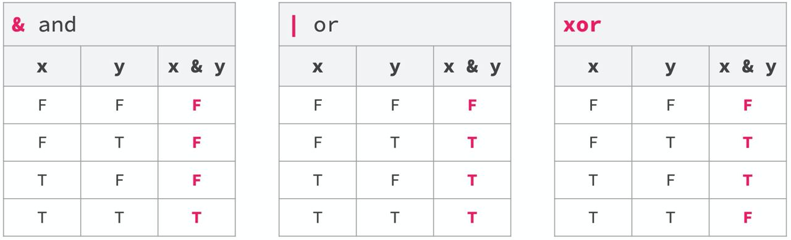
``` 

---

# .orange[FILTRAR] registros: filter()

.pull-left[

```{r eval = FALSE}
datos %>%
  filtro(condicion)
```

]

.pull-right[

```{r eval = FALSE}
starwars %>%
  filter(condicion)
```

]


Por ejemplo, vamos a **filtrar** aquellos personajes con **.bg-purple_light[ojos marrones]**.

```{r}
starwars %>%
  filter(eye_color == "brown") #<<
```

---

# .orange[VISUALIZAR] operaciones con datos


En la web <https://tidydatatutor.com/> podemos visualizar el flujo de datos d las transformaciones que podemos hacer con `dplyr`

```{r filter1, echo = FALSE,  out.width = "90%", fig.align = "center", fig.cap = "Flujo de https://tidydatatutor.com/"}
knitr::include_graphics("./img/filter1.jpg")
``` 

]

---

# .orange[FILTRAR] registros: filter()


De la misma manera podemos **filtrar** los personajes que **.bg-purple_light[no tienen ojos marrones]** (en realidad estamos eliminando filas de alguna manera).


```{r}
starwars %>%
  filter(eye_color != "brown")
```

---

# .orange[FILTRAR] registros: filter()


Al ser una variable discreta, sería bastante lógico comprobar si toma algún valor **.bg-purple_light[dentro de una lista permitida]**  (por ejemplo, personjes con ojos marrones o azules).


```{r}
starwars %>%
  filter(eye_color %in% c("brown", "blue"))
```

---

# .orange[FILTRAR] registros: filter()

Cuando es una variable continua el interés podría estar en comprobar si la variable toma valores **.bg-purple_light[dentro de un intervalo continuo]**.


.pull-left[

```{r eval = FALSE}
starwars %>%
  filter(between(height, 120, 160))
```

```{r echo = FALSE}
# con estatura entre 120 y 160 cm
starwars %>%
  select(name, height, mass, eye_color) %>%
  filter(between(height, 120, 160)) %>%
  slice(1:5)
```

]

.pull-right[

```{r filter3, echo = FALSE,  out.width = "150%", fig.align = "center", fig.cap = "Flujo de https://tidydatatutor.com/"}
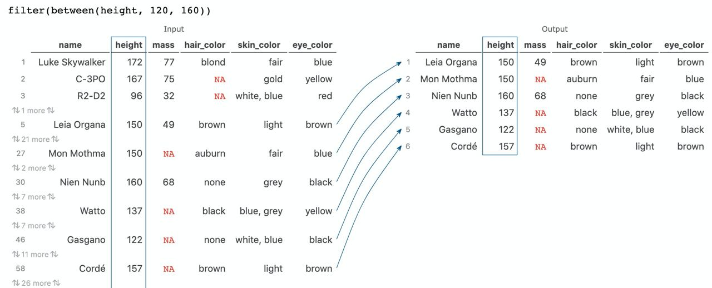
``` 

]


---


# .orange[FILTRAR] registros: filter()


Las condiciones también se pueden **.bg-purple_light[concatenar]**, pudiendo en pocas líneas realizar un filtro complejo. Por ejemplo, podemos filtrar los personajes con **.bg-purple_light[ojos marrones Y ADEMÁS NO humanos]**, o **.bg-purple_light[con más de 60 años]**.

.pull-left[

```{r eval = FALSE}
starwars %>%
  filter((eye_color == "brown" &
            species != "Human") |
           birth_year > 60)
```

]

.pull-right[

```{r filter5, echo = FALSE,  out.width = "100%", fig.align = "center", fig.cap = "Flujo de https://tidydatatutor.com/"}
knitr::include_graphics("./img/filter5.jpg")
``` 


]

---

# .orange[FILTRAR] datos ausentes

Podemos también **.bg-purple_light[filtrar los registros ausentes]** en alguna de sus variables con `drop_na()`. Si no especificamos, elimina todos los registros que tenga alguno de sus campos ausente.

```{r eval = FALSE}
starwars %>% drop_na()
```

--

Podemos indicarle que nos elimine filas con datos ausentes fijándonos solo en **.bg-purple_light[alguna variable particular]**.

```{r}
starwars %>% drop_na(mass, height, sex, gender)
```

---


# Ejercicios (filtro)

.panelset[
.panel[.panel-name[Ejercicios]


* 📝 **Ejercicio 1**: selecciona del conjunto de `starwars` solo los personajes que sean humanos (`species == "Human"`)

* 📝 **Ejercicio 2**: selecciona del conjunto de `starwars` solo los personajes cuyo peso esté entre 65 y 90 kg.

* 📝 **Ejercicio 3**: selecciona del conjunto de `starwars` los personajes con ojos marrones o rojos.

* 📝 **Ejercicio 4**: selecciona del conjunto de `starwars` los personajes no humanos, hombres y que midan más de 170 cm, o los personajes con ojos marrones o rojos.

]

.panel[.panel-name[Sol. Ej. 1]

```{r}
starwars %>%
  filter(species == "Human")
```

]

.panel[.panel-name[Sol. Ej. 2]

```{r}
starwars %>%
  filter(between(mass, 65, 90))
```

]

.panel[.panel-name[Sol. Ej. 3]

```{r}
starwars %>%
  filter(eye_color %in% c("brown", "red"))
```

]

.panel[.panel-name[Sol. Ej. 4]

```{r}
starwars %>%
  filter((species != "Human" & sex == "Male" & height > 170) |
           eye_color %in% c("brown", "red"))
```

]


]


---

# .orange[FILTRAR] registros:  slice()


.pull-left[

```{r eval = FALSE}
datos %>%
  rebanada(posicion)
```

]

.pull-right[

```{r eval = FALSE}
starwars %>%
  slice(posicion)
```

]

--

Normalmente filtraremos registros por alguna condición pero no siempre, a veces nos puede interesar, por ejemplo, sacar las primeras n filas. Para podemos crear **.bg-purple_light[rebanadas de los datos]**, seleccionando filas por su posición con `slice()`.

```{r}
starwars %>% slice(1) #<<
```

---

# .orange[FILTRAR] registros:  slice()

.pull-left[

```{r eval = FALSE}
datos %>%
  rebanada(posicion)
```

]

.pull-right[

```{r eval = FALSE}
starwars %>%
  slice(posicion)
```

]


Recuerda que todo lo que podemos hacer con un número (vector de longitud 1) podemos hacerlo con un vector de índices, así que podemos **.bg-purple_light[extraer varias rebanadas]**, a la vez.

```{r}
# filas de la 1 a la 5
starwars %>% slice(1:5)
```

---

# .orange[FILTRAR] registros:  slice()

También podríamos usar una **.bg-purple_light[secuencia de índices]** a extraer.

```{r}
# filas 1, 2, 10, 13, 27
starwars %>% slice(c(1, 2, 10, 13, 27))
```


---

# .orange[FILTRAR] registros:  slice()


Disponemos además de opciones por defecto de operaciones habituales

* `slice_head(n = ...)`: extraer las n **.bg-purple_light[primeras filas]**.


```{r}
# las 2 primeras filas
starwars %>% slice_head(n = 2)
```

---


# .orange[FILTRAR] registros:  slice()

* `slice_tail(n = ...)`: extraer las n **.bg-purple_light[últimas filas]**.

```{r}
# los 3 últimas filas
starwars %>% slice_tail(n = 3) 
```

---

# .orange[FILTRAR] registros:  slice()

* `slice_sample(n = ...)`: extraer n **.bg-purple_light[registros aleatoriamente]** (a priori equiprobables). Podemos indicar el número o la proporción


```{r}
# 3 registros aleatorios
starwars %>% slice_sample(n = 3)
```

---

# .orange[FILTRAR] registros:  slice()

* `slice_sample(n = ...)`: extraer n **.bg-purple_light[registros aleatoriamente]** (a priori equiprobables). Podemos indicar el número o la proporción


```{r}
# 2.5% de los datos
starwars %>% slice_sample(prop = 0.025)
```

---

# .orange[FILTRAR] registros:  slice()

En `slice_sample(n = ...)` podemos incluso pasarlo un vector de probabilidades. Vamos a forzar que sea muy improbable sacar una fila que no sean las dos primeras

```{r eval = FALSE}
starwars %>% slice_sample(n = 2, weight_by = c(0.495, 0.495, rep(0.01/85, 85)))
```

```{r echo = FALSE}
starwars %>% slice_sample(n = 2, weight_by = c(0.495, 0.495, rep(0.01/85, 85))) %>% select(name:gender)
```

```{r eval = FALSE}
starwars %>% slice_sample(n = 2, weight_by = c(0.495, 0.495, rep(0.01/85, 85)))
```

```{r echo = FALSE}
starwars %>% slice_sample(n = 2, weight_by = c(0.495, 0.495, rep(0.01/85, 85))) %>% select(name:gender)
```

---


# .orange[FILTRAR] registros: slice()


* `slice_min(var, n = ...)` y `slice_max(var, n = ...)`: extrae las n filas con **.bg-purple_light[menor/mayor de una variable]** (si hay empate, mostrará todas salvo que `with_ties = FALSE`). 

.pull-left[

```{r eval = FALSE}
# los 3 más bajitos
starwars %>% slice_min(height, n = 3) 
```

```{r echo = FALSE}
# los 3 más bajitos
starwars %>% slice_min(height, n = 3) %>% select(name:hair_color)
```

]

.pull-right[

```{r eval = FALSE}
# los 3 más pesados
starwars %>% slice_max(mass, n = 3) 
```

```{r echo = FALSE}
# los 3 más pesados
starwars %>% slice_max(mass, n = 3) %>% select(name:hair_color)
```

]

---

# .orange[REORDENAR] filas: rearrange()

.pull-left[

```{r eval = FALSE}
datos %>%
  ordeno(var1, desc(var2))
```

]

.pull-right[

```{r eval = FALSE}
starwars %>%
  arrange(var1, desc(var2))
```

]

--

Otra operación será **.bg-purple_light[ordenar filas]** con `arrange()`, pasándole las variables que usaremos para la ordenación (por defecto de menor a mayor, podemos invertirlo usando `desc()`. Por ejemplo, vamos a **ordenar** por altura, de bajitos a altos, y en caso de empate, por peso (pero al revés, de pesados a ligeros).


```{r}
starwars %>% arrange(height, desc(mass))
```

---

# .orange[ELIMINAR] duplicados: distinct()

Otra opción es **.bg-purple_light[eliminar filas duplicadas]** con `distinct()`, pasándole como argumentos las variables. Por defecto, solo extrae las columnas en base a las cuales hemos eliminado duplicados. Si queremos que nos **mantenga todas** deberemos explicitarlo con `.keep_all = TRUE`.

.pull-left[

```{r}
# Elimina filas con igual (color_pelo, color_ojos)
starwars %>% distinct(hair_color, eye_color)
```

]

.pull-left[

```{r}
# Elimina filas con igual (color_pelo, color_ojos)
starwars %>% distinct(hair_color, eye_color, .keep_all = TRUE)
```

]
  
---

# .orange[AÑADIR] filas: bind_rows()

Si quisiéramos **.bg-purple_light[añadir un nuevo registro]** manualmente, podremos hacerlo con `bind_rows()`, asegurándonos que las **variables en el nuevo registro son las mismas** que en el original. Por ejemplo, vamos a añadir al fichero original los 3 primeros registros (al final).

```{r}
starwars_nuevo <- bind_rows(starwars, starwars %>% slice(1:3))
dim(starwars)
dim(starwars_nuevo)
```

---

# .orange[OPERACIONES] por filas

Con **.bg-purple_light[pocas líneas de código]** podemos manipular ágilmente los registros de nuestros datos, de una manera **.bg-purple_light[muy literal]**

.pull-left[

```{r eval = FALSE}
datos %>%
  filtro(peso < 200 y ojos marrones) #<<
```

]

.pull-right[

```{r}
starwars %>%
  filter(mass < 200 &
           eye_color == "brown")#<<
```

]

---

# .orange[OPERACIONES] por filas

Con **.bg-purple_light[pocas líneas de código]** podemos manipular ágilmente los registros de nuestros datos, de una manera **.bg-purple_light[muy literal]**

.pull-left[

```{r eval = FALSE}
datos %>%
  filtro(peso < 200 y ojos marrones) %>% 
  quito_na(estatura y peso) #<<
```

]

.pull-right[

```{r}
starwars %>%
  filter(mass < 200 &
           eye_color == "brown") %>% 
  drop_na(mass, height) #<<
```

]

---

# .orange[OPERACIONES] por filas

Con **.bg-purple_light[pocas líneas de código]** podemos manipular ágilmente los registros de nuestros datos, de una manera **.bg-purple_light[muy literal]**

.pull-left[

```{r eval = FALSE}
datos %>%
  filtro(peso < 200 y ojos marrones) %>% 
  quito_na(estatura y peso) %>%
  rebanada(7 primeras filas) #<<
```

]

.pull-right[

```{r}
starwars %>%
  filter(mass < 200 &
           eye_color == "brown") %>% 
  drop_na(mass, height) %>%
  slice(1:7) #<<
```

]


---

# .orange[OPERACIONES] por filas

Con **.bg-purple_light[pocas líneas de código]** podemos manipular ágilmente los registros de nuestros datos, de una manera **.bg-purple_light[muy literal]**

.pull-left[

```{r eval = FALSE}
datos %>%
  filtro(peso < 200 y ojos marrones) %>% 
  quito_na(estatura y peso) %>%
  rebanada(7 primeras filas) %>%
  ordeno(peso, si empate pesados 1º) #<<
```

]

.pull-right[

```{r}
starwars %>%
  filter(mass < 200 &
           eye_color == "brown") %>% 
  drop_na(mass, height) %>%
  slice(1:7) %>%
  arrange(height, desc(mass)) #<<
```

]


---

# .orange[OPERACIONES] por filas

Con **.bg-purple_light[pocas líneas de código]** podemos manipular ágilmente los registros de nuestros datos, de una manera **.bg-purple_light[muy literal]**

.pull-left[

```{r eval = FALSE}
datos %>%
  filtro(peso < 200 y ojos marrones) %>% 
  quito_na(estatura y peso) %>%
  rebanada(7 primeras filas) %>%
  ordeno(peso, si empate pesados 1º) %>%
  quito_duplicados(color de piel) #<<
```

]

.pull-right[

```{r}
starwars %>%
  filter(mass < 200 &
           eye_color == "brown") %>% 
  drop_na(mass, height) %>%
  slice(1:7) %>%
  arrange(height, desc(mass)) %>%
  distinct(skin_color,
           .keep_all = TRUE) #<<
```

]

---


# Ejercicios (filas)

.panelset[
.panel[.panel-name[Ejercicios]


* 📝 **Ejercicio 1**: selecciona solo los personajes que sean humanos y de ojos marrones, para después ordernarlos en altura descendente y peso ascendente.

* 📝 **Ejercicio 2**:  extrae 3 registros aleatoriamente. Vuelve a hacerlo para comprobar que salen diferentes.

* 📝 **Ejercicio 3**:  extrae el 10% de los registros aleatoriamente.

* 📝 **Ejercicio 4**: selecciona los 3 personajes más mayores y los 3 personajes más bajitos.

* 📝 **Ejercicio 5**: para saber que valores únicos hay en el color de pelo, elimina duplicados por dicha variable `hair_color`, eliminando antes los ausentes de dicha variable.


]

.panel[.panel-name[Sol. Ej. 1]

```{r}
# Podemos combinar varias acciones en pocas líneas
starwars %>%
  filter(eye_color == "brown",
         species == "Human") %>%
  arrange(height, desc(mass))
```

]

.panel[.panel-name[Sol. Ej. 2]

```{r}
starwars %>%
  slice_sample(n = 3)
```

```{r}
starwars %>%
  slice_sample(n = 3)
```


]

.panel[.panel-name[Sol. Ej. 3]

```{r}
starwars %>%
  slice_sample(prop = 0.1)
```

]

.panel[.panel-name[Sol. Ej. 4]


```{r}
starwars %>%
  slice_max(birth_year, n = 3)
```

```{r}
starwars %>%
  slice_min(height, n = 3)
```
]

.panel[.panel-name[Sol. Ej. 5]


```{r}
starwars %>%
  drop_na(hair_color) %>%
  distinct(hair_color)
```

]

]


---

# .orange[SELECCIONAR] columnas:  select()

.pull-left[

```{r eval = FALSE}
datos %>%
  selecciono(col1, col2, ...)
```

]

.pull-right[

```{r eval = FALSE}
starwars %>%
  select(col1, col2, ...)
```

]

--

La opción más sencilla para **.bg-purple_light[seleccionar variables]** es `select()`, dando como argumentos los nombres de columnas. Por ejemplo, vamos a seleccionar las variables `names` y `hair_color`

```{r}
starwars %>%
  select(name, hair_color) #<<
```


---

# .orange[SELECCIONAR] columnas:  select()

.pull-left[

```{r}
starwars %>% select(name, hair_color)
```

]

.pull-right[

```{r select1, echo = FALSE,  out.width = "140%", fig.align = "center", fig.cap = "Flujo de https://tidydatatutor.com/"}
knitr::include_graphics("./img/select1.jpg")
``` 

]

---

# .orange[SELECCIONAR] columnas:  select()


Como sucedía al filtrar, la función `select()` es bastante versatil y nos permite:

* Seleccionar **.bg-purple_light[varias variables a la vez]** (concatenando sus nombres).

```{r}
starwars %>% select(name:skin_color)
```

---

# .orange[SELECCIONAR] columnas:  select()

* **.bg-purple_light[Deseleccionar]** columnas con `-`

```{r}
starwars %>% select(-c(mass:eye_color), -species, -c(films:starships))
```

---

# .orange[SELECCIONAR] columnas:  select()


* Seleccionar columnas que **.bg-purple_light[comiencen por un prefijo]** (`starts_with()`), **.bg-purple_light[terminen]** con un sufijo (`ends_with()`), **.bg-purple_light[contengan]** un texto (`contains()`) o cumplan una **.bg-purple_light[expresión regular]** (`matches()`)


```{r}
# nombre acaba en "color"
starwars %>% select(ends_with("color"))
```

---

# .orange[SELECCIONAR] columnas:  select()


* Seleccionar columnas que **.bg-purple_light[comiencen por un prefijo]** (`starts_with()`), **.bg-purple_light[terminen]** con un sufijo (`ends_with()`), **.bg-purple_light[contengan]** un texto (`contains()`) o cumplan una **.bg-purple_light[expresión regular]** (`matches()`)

```{r}
# empiezan por new_sp
who %>% select(country, year, starts_with("new_sp"))
```

---

# .orange[SELECCIONAR] columnas:  select()


* Seleccionar columnas que **.bg-purple_light[comiencen por un prefijo]** (`starts_with()`), **.bg-purple_light[terminen]** con un sufijo (`ends_with()`), **.bg-purple_light[contengan]** un texto (`contains()`) o cumplan una **.bg-purple_light[expresión regular]** (`matches()`)

```{r}
tb <- tibble("edad" = c(30, 35, 40),
             "color_ojos" = c("azul", "amarillo", "negro"),
             "pelo_color" = c("negro", "marrón", "rubio"))
tb %>% select(contains("color"))
```


---

# .orange[SELECCIONAR] columnas:  select()

Incluso podemos seleccionar por rango numérico si tenemos variables conun prefijo y números.

```{r}
billboard %>% select(num_range("wk", 10:15))
```

---

# .orange[SELECCIONAR] columnas:  select()

* Seleccionar columnas de un **.bg-purple_light[tipo]** haciendo uso de `where()`.


```{r}
# Solo columnas numéricas o de trexto
starwars %>% select(where(is.numeric) | where(is.character))
```

---

# .orange[RECOLOCAR] columnas: relocate()

Fíjate que con `select()` podrías además **.bg-purple_light[recolocar columnas]**, indícandole el orden, ayudándote también de `everything()`

```{r}
starwars %>%  select(c(species, name, birth_year, everything()))
```

---

# .orange[RECOLOCAR] columnas: relocate()


.pull-left[

```{r eval = FALSE}
datos %>% 
  recolocar(col1, col2, .after = ...)
```

]

.pull-right[

```{r eval = FALSE}
starwars %>% 
  relocate(col1, col2, .after = ...)
```

]

--

Para facilitar la **.bg-purple_light[recolocación]** tenemos una función para ello, `relocate()`,  indicándole en `.after` o `.before` detrás o delante de qué columnas queremos moverlas.

```{r}
starwars %>% relocate(species, .before = name)
```

---

# .orange[EXTRAER] columnas: pull()


.pull-left[

```{r eval = FALSE}
datos %>% 
  retirar(variable)
```

]

.pull-right[

```{r eval = FALSE}
starwars %>% 
  pull(variable)
```

]

--

.pull-left[

Si observas la salida de los `select()`, sigue siendo una tabla `tibble`, nos preserva la naturaleza de nuestros datos.

```{r}
starwars %>% select(name)
```

]

.pull-right[

A veces no querremos dicha estructura sino **.bg-purple_light[extraer literalmente la columna]**, algo que podemos hacer con `pull()`

```{r}
starwars %>% pull(name)
```

]

---

# .orange[RENOMBRAR] columnas: rename()


.pull-left[

```{r eval = FALSE}
datos %>% 
  renombrar(col1, col2)
```

]

.pull-right[

```{r eval = FALSE}
starwars %>% 
  rename(col1, col2)
```

]

--

A veces también podemos querer **modificar la «metainformación»** de los datos, **.bg-purple_light[renombrando columnas]**. Para ello usaremos la función `rename()` poniendo primero el nombre nuevo y luego el antiguo.

```{r}
starwars %>% 
  rename(nombre = name, altura = height,  peso = mass)
```


---

# Ejercicios (columnas)

.panelset[
.panel[.panel-name[Ejercicios]


* 📝 **Ejercicio 1**: filtra el conjunto de personajes y quédate solo con aquellos que en la variable `height` no tengan un dato ausente.

* 📝 **Ejercicio 2**: con los datos obtenidos del filtro anterior, selecciona solo las variables `name`, `height`, así como todas aquellas variables que CONTENGAN la palabra `color` en su nombre.

* 📝 **Ejercicio 3**: con los datos obtenidos del ejercicio anterior, traduce el nombre de las columnas a castellano

* 📝 **Ejercicio 4**: con los datos obtenidos del ejercicio anterior, coloca la variable de color de pelo justo detrás de la variable de nombres.

* 📝 **Ejercicio 5**: con los datos obtenidos del ejercicio, comprueba cuántas modalidades únicas hay en la variable de color de pelo.

]

.panel[.panel-name[Sol. Ej. 1]

**IMPORTANTE**: todo lo que hagas en la tabla original, si el resultado final no se lo asignas `<-` a otra variable, lo verás en consola pero no se guardará en ningún sitio. Lo que no guardes, no existe.


```{r}
starwars_NA <- starwars %>% drop_na(height)
starwars_NA 
```

]

.panel[.panel-name[Sol. Ej. 2]

```{r}
starwars %>%
  drop_na(height) %>%
  select(c(name, height, contains("color")))
```

]

.panel[.panel-name[Sol. Ej. 3]


```{r}
starwars %>%
  drop_na(height) %>%
  select(c(name, height, contains("color"))) %>%
  rename(nombre = name, altura = height,
         color_pelo = hair_color,
         color_piel = skin_color,
         color_ojos = eye_color)
```

]

.panel[.panel-name[Sol. Ej. 4]


```{r}
starwars %>%
  drop_na(height) %>%
  select(c(name, height, contains("color"))) %>%
  rename(nombre = name, altura = height,
         color_pelo = hair_color,
         color_piel = skin_color,
         color_ojos = eye_color) %>%
  relocate(color_pelo, .after = nombre)
```

]

.panel[.panel-name[Sol. Ej. 5]

```{r}
starwars %>%
  drop_na(height) %>%
  select(c(name, height, contains("color"))) %>%
  rename(nombre = name, altura = height, color_pelo = hair_color,
         color_piel = skin_color, color_ojos = eye_color) %>%
  relocate(color_pelo, .after = nombre) %>%
  distinct(color_pelo)
```

**IMPORTANTE**: recuerda que `distinct()` de mantener todas las columnas añadiendo `.keep_all = TRUE`.

]

]


---

name: mutate


# .orange[MODIFICAR] columnas: mutate()


.pull-left[

```{r eval = FALSE}
datos %>%
  modificar(nueva_var = ...)
```

]

.pull-right[

```{r eval = FALSE}
starwars %>%
  mutate(nueva_var = ...)
```

]

--

En muchas ocasiones querremos **.bg-purple_light[modificar o crear  variables]**. Para ello tenemos la función `mutate()`. Vamos a crear una **nueva variable** `height_m` con la altura en centímetros.

```{r}
# altura en metros
starwars %>%
  mutate(height_m = height / 100) #<<
```

---

# .orange[MODIFICAR] columnas: mutate()


```{r eval = FALSE}
starwars %>% mutate(height_m = height / 100)
```

```{r mutate1, echo = FALSE,  out.width = "90%", fig.align = "center", fig.cap = "Flujo de https://tidydatatutor.com/"}
knitr::include_graphics("./img/mutate1.jpg")
``` 

---

# .orange[MODIFICAR] columnas: mutate()

Otra opción es **.bg-purple_light[quedarnos solo con las modificadas]** (por ejemplo, para ver si hace lo que debe) con `transmute()`

```{r}
starwars %>%
  transmute(height_m = height / 100) #<<
```

---


# .orange[MODIFICAR] columnas: mutate()

También se pueden aplicar **.bg-purple_light[funciones más complejas]** o incluso **.bg-purple_light[funciones propias]** creadas por nosotros mismos (y varias a la vez).

```{r}
calculo_IMC <- function(peso, estatura, unidades = "metros") {
  
  estatura <- ifelse(unidades == "metros", estatura, estatura / 100)
  IMC <- peso / (estatura^2)
  
  return(IMC)
}
```

---

# .orange[MODIFICAR] columnas: mutate()

También se pueden aplicar **.bg-purple_light[funciones más complejas]** o incluso **.bg-purple_light[funciones propias]** creadas por nosotros mismos (y varias a la vez).

```{r}
starwars %>%
  mutate(IMC = calculo_IMC(mass, height, unidades = "centímetros"),
         height_m = height / 100) %>%
  relocate(IMC, height_m, .after = mass)
```

---

# .orange[MODIFICAR] columnas: mutate()

También podemos combinarlo con la función `if_else()`, una modificación dentro de `{tidyverse}` para hacer un `if-else` vectorizado, que nos puede ayudar a **.bg-purple_light[recategorizaciones sencillas]**.

```{r}
starwars %>%
  mutate(human = if_else(species == "Human", "Human", "Not Human")) %>% 
  relocate(human, .after = name)
```


---

# .orange[RECATEGORIZAR]: case_when()

Para **.bg-purple_light[recategorizaciones más complejas]** tenemos a nuestra disposición `case_when()`. Supongamos por ejemplo que queremos crear una **categoría en función de su altura**.

* Si `height > 180` –> serán `"alto"`.
* Si `height <= 180` y `height > 120` –> serán `"bajo"`
* Si `height <= 120` y `height > 0` –> serán `"enano"`
* Si no se cumple lo anterior –> serán `"ausente"`

--

```{r}
starwars %>% mutate(height = case_when(height > 180 ~ "alto",
                                       height > 120 ~ "bajo",
                                       height > 0 ~ "enano",
                                       TRUE ~ "ausente"))
```

---

# .orange[RECATEGORIZAR]: case_when()

Las condiciones de `case_when()` pueden combinar varias variables, cómo por ejemplo:

* Si pesan mucho o miden mucho --> `"large"`
* Si `species == "Droid"` --> `"robot"`
* En caso contrario --> `"other"`

```{r}
starwars %>%
  mutate(type =
           case_when(height > 200 | mass > 200 ~ "large",
                     species == "Droid" ~ "robot",
                     TRUE ~ "other"))
```

---

# Ejercicios (mutate)


.panelset[
.panel[.panel-name[Ejercicios]


* 📝 **Ejercicio 1**: crea tres nuevas columnas que nos digan el número de películas en las que han salido, el número de vehículos y el número d naves (pero haciendo uso de mutate()). 

* 📝 **Ejercicio 2**: con las 3 columnas creadas, crea una nueva columna llamada `frequency` que nos ponga `almost_all` en personajes que salen en 5 o más películas, `many` en personajes que salen en más de 2 películas pero en menos de 5 y `some` en personajes que salen 1 o 2 películas.

* 📝 **Ejercicio 3**: elimina registros con datos ausentes en la variable `birth_year` y filtra solo los 20 personajes más jóvenes.

* 📝 **Ejercicio 4**: selecciona solo las variables numéricas y de tipo texto. Define una nueva variable llamada `under_18` que nos recategorice la variable `birth_year`: `TRUE` si es menor de edad y `FALSE` en caso contrario

]

.panel[.panel-name[Sol. Ej. 1]

```{r}
starwars_nueva <- 
  starwars %>%
  mutate(n_films = films %>% map_int(length),
         n_vehicles = vehicles %>% map_int(length),
         n_starships = starships %>% map_int(length))
starwars_nueva
```

]

.panel[.panel-name[Sol. Ej. 2]

```{r}
starwars_nueva <-
  starwars_nueva %>%
  mutate(frequency =
           case_when(n_films >= 5 ~ "almost_all",
                     n_films > 2 ~ "many",
                     TRUE ~ "some"))
starwars_nueva
```

]

.panel[.panel-name[Sol. Ej. 3]

```{r}
starwars_nueva <-
  starwars_nueva %>%
  drop_na(birth_year) %>%
  slice_min(n = 20, birth_year)
starwars_nueva
```

]

.panel[.panel-name[Sol. Ej. 4]

```{r}
starwars_nueva <-
  starwars_nueva %>%
  select(where(is.numeric) | where(is.character)) %>%
  mutate(under_18 = birth_year < 18)
starwars_nueva
```


]

]


---


# Ejercicios (mutate)


.panelset[
.panel[.panel-name[Ejercicios]

* 📝 **Ejercicio 5**: de la base de datos original, determina el número de modalidades que toma la variable `species` (elimina antes registros con ausente en dicha variable). Después elimina duplicados por dicha variable, dejando el representante más bajito.

* 📝 **Ejercicio 6**: sobre la base de datos original, crea una nueva columna llamada `auburn` (cobrizo/caoba) que nos diga `TRUE` si el color de pelo contiene dicha palabra y `FALSE` en caso contrario.

]

.panel[.panel-name[Sol. Ej. 5]

```{r}
starwars %>%
  drop_na(species) %>%
  distinct(species)

starwars %>%
  drop_na(species) %>%
  arrange(height) %>%
  distinct(species, .keep_all = TRUE)
```

]

.panel[.panel-name[Sol. Ej. 6]

```{r}
starwars %>%
  drop_na(hair_color) %>%
  mutate(auburn = str_detect(hair_color, "auburn"))
```

]

]

---

# .orange[CONTAR]: group_by() + count()

Hasta ahora solo hemos transformado o consultado nuestra tabla pero no hemos aprendido a **.bg-purple_light[generar resúmenes estadísticos]**. Empecemos por lo sencillo: contar (frecuencias)

.pull-left[

```{r eval = FALSE}
datos %>%
  contar(var1, var2)
```

]

.pull-right[

```{r eval = FALSE}
starwars %>%
  count(var1, var2)
```

]

--

Cuando lo usamos en solitario, `count()` nos devolverá simplemente el **.bg-purple_light[número de registros]**

```{r}
starwars %>% count()
```

---

# .orange[CONTAR]: group_by() + count()

Sin embargo, cuando lo usamos pasándole como **.bg-purple_light[argumento una o varias variables]**, `count()` nos cuenta lo que se conoce en estadística como **.bg-purple_light[frecuencias absolutas]**: el número de elementos pertenecientes a cada una de las **modalidades**. En nuestro caso, la variable `sex` tiene 4 modalidades: `female, hermaphroditic, male, none`.

```{r}
starwars %>% count(sex)#<<
```

---

# .orange[CONTAR]: group_by() + count()


Además si pasamos **.bg-purple_light[varias variables]** nos calcula una **.bg-purple_light[tabla de contigencia]** con las frecuencias absolutas n-dimensionales

```{r}
starwars %>% count(sex, gender)
```

---


# .orange[CONTAR]: group_by() + count()

Lo anterior podemos combinarlo con lo que ya sabemos para **.bg-purple_light[añadir variables]** a una tabla, de forma que podremos obtener no solo las frecuencias absolutas sino también las acumuladas o las relativas. Vamos a añadir por ejemplo una columna `f` que nos devuelve el conteo pero en % respecto al total de datos.

--

```{r}
starwars %>%
  count(sex) %>% 
  mutate(f = 100 * n/sum(n))
```

---

# .orange[CONTAR]: group_by() + count()

Además dentro del `count()` podemos añadir `sort = TRUE`, que nos devolverá el conteo de frecuencias con los **.bg-purple_light[elementos más frecuentes primero]** (sin necesidad de añadir un `arrange()` a la tabla de conteo generada).

```{r}
starwars %>%
  count(sex, sort = TRUE) %>% 
  mutate(f = 100 * n/sum(n))
```

---


# .orange[CONTAR]: group_by() + count()


Una de las funciones más potentes a combinar con `count()` es `group_by()`  que nos permitirá **.bg-purple_light[agrupar nuestros registros]**


.pull-left[

```{r eval = FALSE}
datos %>%
  agrupar(var_grupo1, var_grupo2) %>% 
  contar() %>% 
  desagrupar()
```

]

.pull-right[

```{r eval = FALSE}
starwars %>%
  group_by(var_grupo1, var_grupo2) %>%
  count() %>% 
  ungroup()
```

]

--

Cuando apliquemos `group_by()` es importante entender que **.bg-purple_light[NO MODIFICA los datos]**: nos crea una variable de grupo que **.bg-purple_light[modificará las acciones futuras]** que apliquemos, generando una especie de generar **múltiples subtablas**, y las operaciones aplicadas después se **.bg-purple_light[aplicarán a cada una por separado]**.

---


# .orange[CONTAR]: group_by() + count()

.pull-left[

Por ejemplo, imagina que queremos saber el **.bg-purple_light[número de registros por sexo]**: primero **.bg-purple_light[agruparemos]** por la variable `sex`, y después aplicaremos el **.bg-purple_light[conteo]** con `count()` (realiza la acción pedida en cada subtabla).

```{r}
starwars %>%
  group_by(sex) %>% #<< 
  count() %>%
  ungroup() #<<
```

**IMPORTANTE**: siempre que agrupes, acuérdate de desagrupar con `ungroup()`.

]


.pull-right[

```{r echo = FALSE,  out.width = "45%", fig.align = "center"}
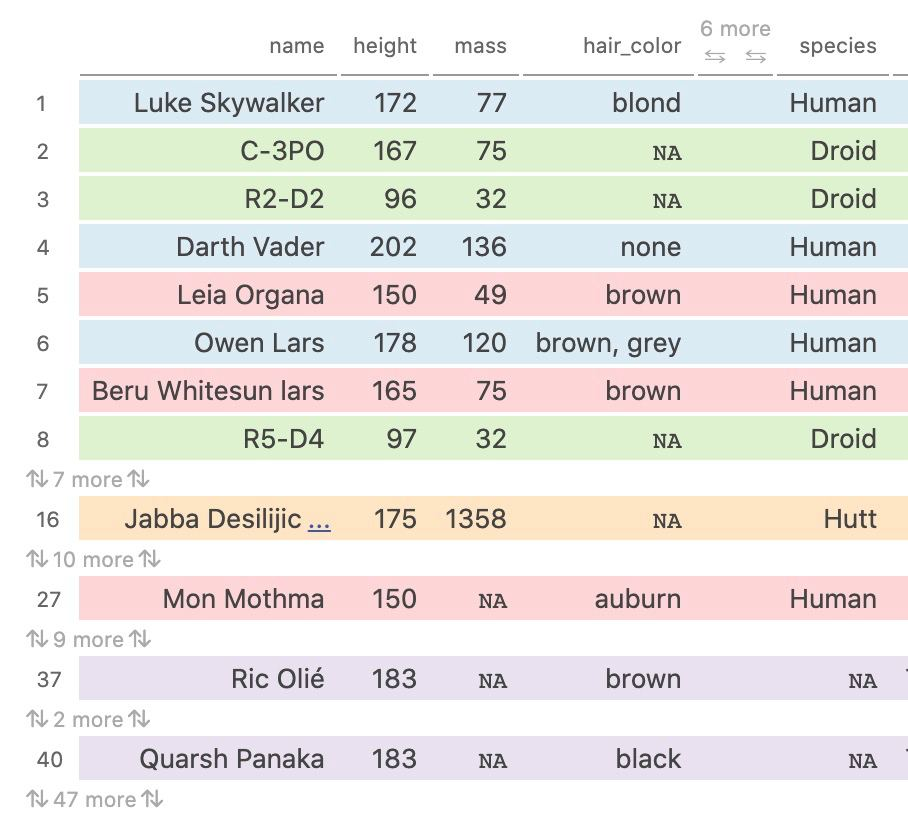
``` 

```{r echo = FALSE,  out.width = "95%", fig.align = "center", fig.cap = "Flujo de https://tidydatatutor.com/"}
knitr::include_graphics("./img/count_group_2.jpg")
``` 


]

---


# .orange[CONTAR]: group_by() + count()

.pull-left[

Podemos **.bg-purple_light[agrupar por variables]**, por ejemplo vamos a agrupar por `sex` y `gender`, y después aplicaremos `count()` (realiza la acción en cada subtabla).

```{r}
starwars %>%
  group_by(sex, gender) %>% #<< 
  count() %>%
  ungroup() #<<
```

**IMPORTANTE**: siempre que agrupes, acuérdate de desagrupar con `ungroup()`.

]

.pull-right[

```{r echo = FALSE,  out.width = "150%", fig.align = "center"}
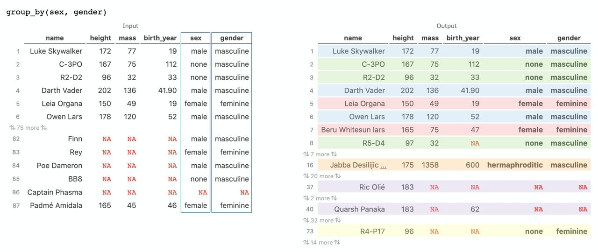
``` 

```{r group-count, echo = FALSE,  out.width = "150%", fig.align = "center", fig.cap = "Flujo de https://tidydatatutor.com/"}
knitr::include_graphics("./img/group_count.jpg")
``` 

]

---

name: summarise

# .orange[RESUMIR]: summarise()

La agrupación `group_by()` es una idea superpotente porque permite **.bg-purple_light[desagregar cualquier acción posterior]**, entre otras, la función `summarise()`, que nos permite **.bg-purple_light[resumir]**.

.pull-left[

```{r eval = FALSE}
datos %>%
  agrupar(var_grupo1, var_grupo2) %>% 
  resumir() %>% 
  desagrupar()
```

]

.pull-right[

```{r eval = FALSE}
starwars %>%
  group_by(var_grupo1, var_grupo2) %>%
  summarise() %>% 
  ungroup()
```

]

--

Un ejemplo: vamos a calcular la **.bg-purple_light[media de las alturas]**. Si lo hacemos sin `group_by()` se hará de todos los personajes.

```{r}
starwars %>% drop_na(height) %>%
  summarise(media_altura = mean(height))
```

Dentro de `summarise()` podrás definir cada estadístico como el `nombre = ` seguido de la función a aplicar (que exista o tuya propia definida anteriormente).

---

# .orange[RESUMIR]: summarise()


Si la misma acción la realizamos con un `group_by()` previo, la media de las alturas se **.bg-purple_light[calculará de manera desagregada]** (por sexos por ejemplo), de forma independiente en cada subtabla por grupo creada.

.pull-left[

```{r}
starwars %>% 
  drop_na(height) %>%
  group_by(sex) %>% 
  summarise(media = mean(height)) %>%
  ungroup()
```

]

.pull-right[

```{r group-summa, echo = FALSE,  out.width = "140%", fig.align = "center", fig.cap = "Flujo de https://tidydatatutor.com/"}
knitr::include_graphics("./img/group_summarise.jpg")
``` 

]


---

# .orange[RESUMIR]: summarise()

Podemos **.bg-purple_light[resumir varias variables]** a la vez combinándolo con la función `across()`: primero indicamos las **.bg-purple_light[variables a recorrer]** (por ejemplo, `height:mass`), después la función a aplicar (en este caso, la media `mean()`), y por último argumentos extras si fuesen necesarios (por ejemplo, `na.rm = TRUE`)

```{r}
starwars %>%
  group_by(sex) %>% #<<
  summarise(medias = across(height:mass, mean, na.rm = TRUE)) %>% #<<
  ungroup()
```

---

# .orange[RESUMIR]: summarise()

Además la función `across()` podemos combinarla con un viejo conocido, `where()`, para que **.bg-purple_light[resuma las variables de un tipo]**, por ejemplo `where(is.numeric)` selecciona solo las numéricas.

```{r}
starwars %>%
  drop_na(height, mass) %>%
  group_by(sex, gender) %>%
  summarise(across(where(is.numeric), mean, na.rm = TRUE)) %>%
  ungroup()
```

---

# .orange[RESUMIR]: summarise()

Algunas de las funciones más útiles dentro de `summarise()`:

* `sum()`, `mean()`, `median()`
* `min()`, `which.min()`, `max()`, `which.max()`
* `n()` (número de registros), `n_distinct()` (número de registros únicos).

```{r}
starwars %>%
  summarise(valores_unicos = n_distinct(eye_color))
```

---

# Ejercicios (count y summarise)


.panelset[
.panel[.panel-name[Ejercicios]


* 📝 **Ejercicio 1**: calcula cuántos personajes hay de cada especie de `starwars` haciendo uso de `group_by()` y `count()`

* 📝 **Ejercicio 2**: determina el número de especies distintas.

* 📝 **Ejercicio 3**: tras eliminar ausentes en las variables `mass` y `height`, añade una nueva variable que nos calcule el IMC de cada personaje, y determina el IMC medio de nuestros personajes desagregada por sexo (`sex`).

* 📝 **Ejercicio 4**: obtén la edad mínima y máxima de cada sexo.

]

.panel[.panel-name[Sol Ej. 1]

```{r}
starwars %>% 
  group_by(species) %>% 
  count() %>% 
  ungroup()

# sin group
starwars %>%
  count(species)
```

]

.panel[.panel-name[Sol Ej. 2]

```{r}
starwars %>%
  summarise(unique_species = n_distinct(species))
```


]


.panel[.panel-name[Sol Ej. 3]

```{r}
starwars %>%
  drop_na(mass, height) %>% 
  mutate(IMC = mass / (height/100)^2) %>%
  group_by(sex) %>% 
  summarise(mean_IMC = mean(IMC)) %>% 
  ungroup()
```

]

.panel[.panel-name[Sol Ej. 4]

```{r}
starwars %>% 
  drop_na(birth_year) %>% 
  group_by(sex) %>% 
  summarise(min_age = min(birth_year),
            max_age = max(birth_year)) %>% 
  ungroup()
```

]

]


---


name: complementos-II

class: inverse

# COMPLEMENTOS

#### [Generando muestras aleatorias](#sample)

#### [Operaciones con matrices](#apply)

&nbsp;

# EJERCICIOS Y ENTREGA

#### [Ejercicios extras](#ejercicios-I)

#### [Entrega II](#entrega-II)

---

name: sample


# Simulando muestras: .orange[SAMPLE]

La función `sample()` nos permitirá **.bg-purple_light[generar muestras aleatorias]** indicando cuál es la **.bg-purple_light[función de probabilidad]** asociada] (generar **«tiradas de dados»** indicando cuál es la **probabilidad** de cada cara).

* `x`: **.bg-purple_light[soporte]** (valores permitidos, caras del dado).
* `size`: **.bg-purple_light[tamaño]** (número de tiradas)
* `replace`: **.bg-purple_light[¿con reemplazamiento?]** (¿puede salir un elemento que ya ha salido?)
* `prob`: **.bg-purple_light[vector de probabilidades]** (probabilidad de cada cara)

--

Por ejempo, vamos a simular **.bg-purple_light[2 tiradas de una moneda]**, indicando el soporte (0 y 1, cara y cruz), y `size = 2`

```{r}
sample(x = 0:1, size = 2)
```

**.bg-red_light[IMPORTANTE]**: si no indicamos nada en el vector de probabilidades `prob`, asume que son equiprobables (en este caso, $1/2$ para cada cara).


---

# Simulando muestras: .orange[SAMPLE]

Fíjate que tampoco le hemos indicado nada en `replace`, ya que por defecto toma el valor `FALSE`. ¿Qué sucede si hubiésemos querido generar 10 tiradas de una moneda?

```{r error = TRUE}
sample(x = 0:1, size = 10)
```

--

&nbsp;

Dado que solo tenemos 2 posibles valores a elegir, y le hemos pedido 10 tiradas, al llegar a la segunda **.bg-purple_light[no tiene opciones de seguir eligiendo]**. Para poder generarlas deberemos asignar `replace = TRUE` (ahora podrán repetirse las caras).


```{r}
# 30 tiradas
sample(x = 0:1, size = 30, replace = TRUE)
```

---

# Simulando muestras: .orange[SAMPLE]

El soporte no solo tiene porqué ser numérico, sino que podríamos definir un **.bg-purple_light[soporte de valores de texto]**, de forma que asignemos en los posibles valores directamente `"cara"` y `"cruz"`

```{r}
sample(x = c("cara", "cruz"), size = 10, replace = TRUE)
```

--

El comando `sample()` nos genera **.bg-purple_light[valores (pseudo) aleatorios]**, por lo que si volvemos a ejecutar la misma órden tendremos (seguramente) **.bg-red_light[valores diferentes]**.

```{r}
sample(x = c("cara", "cruz"), size = 10, replace = TRUE)
```

---

# Simulando muestras: .orange[SAMPLE]

Si quisiéramos generar resultados que no dependiesen de la aleatoriedad de una muestra simulada (por ejemplo, para ver si un método es mejor que otro), tenemos la opción de **.bg-purple_light[fijar semilla]** (valor inicial usado para generar el mecanismo de pseudoaleatoriedad).

```{r}
set.seed(1234567)
sample(x = c("cara", "cruz"), size = 10, replace = TRUE)
```


```{r}
set.seed(1234567)
sample(x = c("cara", "cruz"), size = 10, replace = TRUE)
```

```{r}
set.seed(1234567)
sample(x = c("cara", "cruz"), size = 10, replace = TRUE)
```

---


# Simulando muestras: .orange[SAMPLE]


De esta manera podemos **.bg-purple_light[simular una gran cantidad de datos]** y ver cómo evoluciona por ejemplo la media muestral.

> ¿Cómo hacer uso de un bucle para generar 1 tirada, 2 tiradas, 3 tiradas, ..., 25 tiradas (con `sample()`), y guardar la media de caras?

--

```{r}
tiradas <- 1:25
media <- rep(0, length(tiradas))

for (i in tiradas) {
  
  tirada <- sample(x = c("cara", "cruz"), size = i, replace = TRUE)
  media[i] <- sum(tirada == "cruz") / i

}
media
```

---


# Simulando muestras: .orange[SAMPLE]


Esto nos permite comprobar de primera mano algo muy importante a la hora de simular: nuestra muestra será (seguramente) distinta pero según  **.bg-purple_light[aumenta el tamaño muestral]**, los **.bg-purple_light[parámetros muestrales]** (media, por ejemplo) tenderán a los **.bg-purple_light[parámetros teóricos o poblacionales]** (la media si aumentamos el tamaño debería tender a $0.5$).


```{r}
tiradas <- c(1, 5, 10, 15, 25, 50, 100, 500, 1000, 5000,
             10000, 25000, 50000, 100000, 200000, 500000)
media <- rep(0, length(tiradas))

for (i in 1:length(tiradas)) {
  
  tirada <- sample(x = c(0, 1), size = tiradas[i], 
                   replace = TRUE)
  media[i] <- mean(tirada)

}
media
```


Lo anterior se debe al **.bg-purple_light[TEOREMA CENTRAL DEL LÍMITE]**


---

name: apply

# .orange[OPERACIONES] por filas/columnas

Normalmente, para explicar las **operaciones con matrices** en un lenguaje de programación al uso, necesitaríamos hablar de una **herramienta llamada bucles**. Lo mencionaremos más adelante pero no los vamos a necesitar de momento (cuántos menos los usemos en `R`, mejor)

--

Imagina que tuviésemos nuestra matriz de estaturas y pesos.

```{r}
datos_matriz <- cbind(estaturas, pesos)
datos_matriz
```

--

¿Cómo podemos **.bg-purple_light[aplicar una operación para cada una de las filas o columnas]** de una matriz?

---

# .orange[OPERACIONES] por filas/columnas

Imagina que queremos obtener la **.bg-purple_light[media de cada columna]**. Lo haremos con la función `apply()`, y le indicaremos como argumentos la matriz, el **.bg-orange[sentido de la operación]** (`MARGIN = 1` por filas, `MARGIN = 2` por columnas) y la **función a aplicar**

```{r}
# Media (mean) por columnas (MARGIN = 2)
apply(datos_matriz, MARGIN = 2, FUN = "mean")
```

--

Si la función **requiere de argumentos extras** se lo podemos indicar al final.

```{r}
estaturas_bis <- c(150, NA, 170, 180, 190)
datos_matriz_bis <- cbind(estaturas_bis, pesos) 
apply(datos_matriz_bis, MARGIN = 2, FUN = "mean")
```

---

name: ejercicios-II

# Ejercicios extras

La entrega de dicho ejercicios tienen de deadline antes de la próxima clase y son **.bg-purple_light[voluntarios]** (no contará para la nota). A cambio el alumno que lo haga recibirá una corrección de la tarea (como si contase para nota), teniendo una retroalimentación.

.panelset[
.panel[.panel-name[Tibble]


* 📝 **Ejercicio 1**: define un `tibble` con tres variables numéricas `a, b, c`, tal que la tercera sea el producto de las dos primeras `c = a * b`.

* 📝 **Ejercicio 2**:  obten de los paquetes `{dplyr}` y `{gapminder}` los conjuntos de datos `starwars` y `gapminder`. Comprueba el número de variables, de registros e imprime los datos

* 📝 **Ejercicio 3**: define un tibble que recopile datos de 5 personas de tu entorno (o inventadas) que incluyan su nombre, apellidos, código postal, edades, si están o no casados y su fecha de boda (si no están casados...piensa que valor tendría que tener).

]


.panel[.panel-name[Tidy data]

* 📝 **Ejercicio 1**: del paquete `{tidyr}` carga el dataset `billboard` y busca en la ayuda (`? billboard`) para ver que significan las variables.

* 📝 **Ejercicio 2**: convierte a tidydata el conjunto de datos, ignorando de momento el tratamiento de ausentes, obteniendo un dataset de 24 092 filas y 5 columnas.

* 📝 **Ejercicio 3**: repite el ejercicio anterior pero tras la conversión a tidydata, elimina datos ausentes (deberías obtener un dataset de 5307 filas y 5 columnas). Tras ello, selecciona solo aquellos registros del primer año natural (es decir, de la semana 1 a la semana 52), y elimina la variable `date.entered`.

]


.panel[.panel-name[Filter, slice y select]

* 📝 **Ejercicio 1**: selecciona aquellos personajes de `starwars` que hayan salido en la película "El ataque de los clones" ("Attack of the Clones"). Busca información de la función `str_detect()` del paquete `stringr`. 

* 📝 **Ejercicio 2**: de los personajes que son humanos y miden más de 160 cm, elimina duplicados en color de ojos, elimina ausentes en peso y selecciona los 5 más altos. Devuelve la tabla.

* 📝 **Ejercicio 3**: selecciona solo las variables `name`, `homeworld`, `species` y aquellas que sean de tipo numérico, y selecciona solo los personajes que no sean humanos y que pesen entre 70 y 90 kg.  Tras ello elimina datos ausentes, y elimina duplicados con el mismo valor en `homeworld`. Tras ello, recoloca variables para que la primera columna sea `name` y la segunda `birth_year`.

]


.panel[.panel-name[Mutate, group_by y count]

* 📝 **Ejercicio 1**: sobre la base de datos original de `starwars`, filtra solo aquellos personajes de la familia `"Skywalker"` o `"Antilles"`, selecciona solo las columnas de `name` y `specie`, y renombra a castellano.

* 📝 **Ejercicio 2**: obtén el personaje más viejo por cada sexo.

* 📝 **Ejercicio 3**: obtén las frecuencias (absolutas) desagregadas por `sex` y `gender` y ordenados de mayor a menor aparición (investiga `? count`)

* 📝 **Ejercicio 4**: filtra el conjunto original para que solo haya `sex = male` y  `sex = female`. Tras ello extrae un 50% de los datos pero manteniendo la proporción de hombres y mujeres.

]

]


---

name: entrega-II

# .orange[ENTREGA II]

pendiente de concretar

&nbsp;

🔎 Mira antes <https://github.com/dadosdelaplace/teaching/tree/main/data_science_seguros/scripts> el ejemplo de entrega (con enunciados sin y con resolver) para realizarla correctamente (tras revisar las diapositivas de `.rmd`).

---


# .orange[RECURSOS] y .green[BIBLIOGRAFÍA]

&nbsp;


#### 📚 **.bg-purple_light[Artículos o libros]** científicos que han sido sometidos a revisión por pares.

&nbsp;

#### 🔗 **.bg-green_light[Recursos online]** recomendados

&nbsp;

#### 💻 Recursos para la **.bg-orange[programación en R]**

---

# Bibliografía general

📚 **«Statistical tests, P values, confidence intervals, and power: a guide to misinterpretations»**. Greenland et al. (2016) <https://github.com/dadosdelaplace/teaching/blob/main/bioestad/biblio/p-value_Greenland_etal_2016.pdf>

💻 **Tidy Data Tutor**: para visualizar la mecánica interna de `{tidyverse}`. <https://tidydatatutor.com/>

🔗 Web con recursos para la **introducción a la estadística y Machine Learning en R** <https://artofstat.com/>

💻 **Manual introductorio de R** (Javier Álvarez Liébana): <https://dadosdelaplace.github.io/courses-intro-R/>


---

# Bibliografía general

📚 **«The reproducibility of research and the misinterpretation of p-values»**. Colquhoun (2017) <https://github.com/dadosdelaplace/teaching/blob/main/bioestad/biblio/p-values_Colquhoun_2017.pdf>


📚 **«An Introduction to Multivariate Statistical Analysis»**. Anderson (1958) <https://github.com/dadosdelaplace/teaching/blob/main/bioestad/biblio/introduction_mva_anderson_2003.pdf>

📚 **«A New Measure of Rank Correlation»**. Kendall (1938) <https://github.com/dadosdelaplace/teaching/blob/main/bioestad/biblio/correlation_kendall_1938.pdf>

📚 **«The generalised product moment distribution in samples from a normal multivariate population»**. Wishart (1928) <https://github.com/dadosdelaplace/teaching/blob/main/bioestad/biblio/multivariate_normal_wishart_1928.pdf>

📚 **«On lines and planes of closest fit to systems of points in space»**. Pearson (1901) <https://github.com/dadosdelaplace/teaching/blob/main/bioestad/biblio/fit_pearson_1901.pdf>


---

# Recursos dataviz

### Dataviz

📚 **«Gramática de las gráficas: pistas para mejorar las representaciones de datos»**. Sevilla (2005) <http://academica-e.unavarra.es/bitstream/handle/2454/15785/Gram%C3%A1tica.pdf>

📚 **«Quantitative Graphics in Statistics: A Brief History»**. Beniger and Robyn (1978) <https://github.com/dadosdelaplace/teaching/blob/main/bdba-pca-clustering-2022/biblio/graphics_beniger_robin_1978.pdf>
 
 
💻 **«Analizando datos, visualizando información, contando historias»** (curso de dataviz en R). Álvarez-Liébana y Valverde-Castilla (2022) <https://dadosdelaplace.github.io/curso-dataviz-ECI-2022>

📚 **«40 years of boxplots»**. Wickham and Stryjewski (2011) <https://github.com/dadosdelaplace/teaching/blob/main/bdba-pca-clustering-2022/biblio/boxplot_Wickham_Stryjewski_2011.pdf>
 
 


---

# Bibliografía componentes principales

💻 **Componentes principales** en `{tidymodels}`. <https://www.tmwr.org/dimensionality.html#beans>


📚 **«Principal Component Analysis»**. Jolliffe (2002) <https://github.com/dadosdelaplace/teaching/blob/main/bdba-pca-clustering-2022/biblio/pca_jolliffe_2002.pdf>

📚 **«Principal Component Analysis»**. Hervé and Lynne (2010) <http://staff.ustc.edu.cn/~zwp/teach/MVA/abdi-awPCA2010.pdf>

📚 **«Principal Component Analysis: a review and recent developments»**. Jolliffe and Cadima (2016) <https://royalsocietypublishing.org/doi/10.1098/rsta.2015.0202>

🔗 **«The Mathematics Behind Principal Component Analysis»**. Dubey (2018).  <https://towardsdatascience.com/the-mathematics-behind-principal-component-analysis-fff2d7f4b643>


🔗 **«A One-Stop Shop for Principal Component Analysis»**. Brems (2017). <https://towardsdatascience.com/a-one-stop-shop-for-principal-component-analysis-5582fb7e0a9c>

📚 **«On the number of principal components: a test of dimensionality based on measurements of similarity between matrices»**. Dray (2008) <https://github.com/dadosdelaplace/teaching/blob/main/bdba-pca-clustering-2022/biblio/numer_pca_dray_2008.pdf>


---

# Bibliografía análisis clúster

📚 **«Multiclass classification of dry beans using computer vision and machine learning techniques»**. Koklu y Ozkan (2020) <https://github.com/dadosdelaplace/teaching/blob/main/bdba-pca-clustering-2022/biblio/multiclass_classif_koklu_ozlan_2020.pdf>

💻 **«Clustering y heatmaps: aprendizaje no supervisado»**. Amat (2017). <https://rpubs.com/Joaquin_AR/310338>

💻 **«K-means clustering with tidy data principles»** <https://www.tidymodels.org/learn/statistics/k-means/>

🔗 **«ISLR tidymodels Labs»** <https://emilhvitfeldt.github.io/ISLR-tidymodels-labs/unsupervised-learning.html#kmeans-clustering>


📚 **«Algorithm AS 136: a K-Means Clustering Algorithm»**. Hartigan y Wong (1979) <http://www.jstor.org/stable/2346830>

🔗 **«Machine Learning for Social Scientists»**. Cimentada (2020) <https://cimentadaj.github.io/ml_socsci/unsupervised-methods.html>

---
