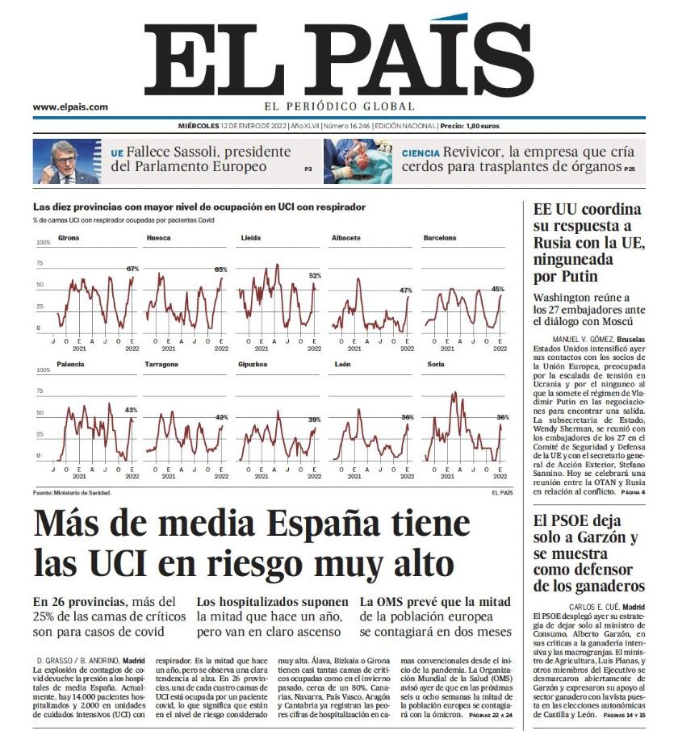
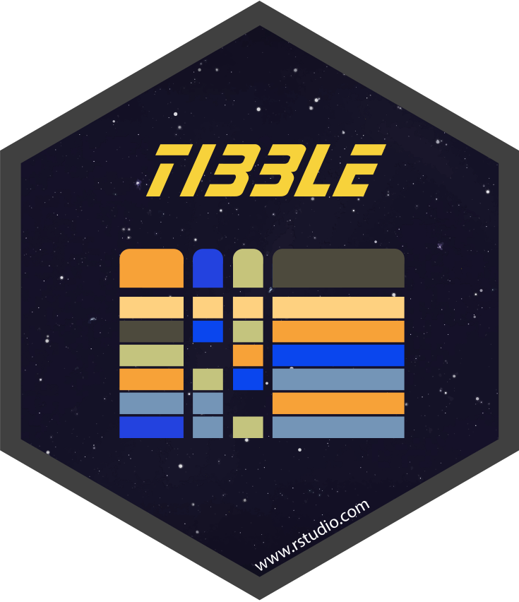

```{r settings, include = FALSE, warning = FALSE}
knitr::opts_chunk$set(fig.retina = 3, out.width = "100%",
                      cache = FALSE, comment = ">",
                      echo = TRUE, message = FALSE,
                      warning = FALSE, hiline = TRUE,
                      dpi = 100)
```

```{r xaringan-extra, include = FALSE, warning = FALSE}
# devtools::install_github("gadenbuie/xaringanExtra")
library(xaringanExtra)
use_xaringan_extra(c("tile_view", "animate_css", "tachyons"))
use_tile_view() # panel
use_extra_styles(hover_code_line = TRUE,
                 mute_unhighlighted_code = FALSE) # Hover triangle
# code line
use_clipboard( # About clipboard
  button_text = "Click para copiar código",
  success_text = "Código copiado",
  error_text = "Ctrl+C para copiar"
)

# use_freezeframe() # restarting gifs
# use_animate_all("fade") # animates
use_panelset() # panels 
```

```{r xaringan-themer, include = FALSE, warning = FALSE}
# devtools::install_github("gadenbuie/xaringanthemer")
library(xaringanthemer)
style_duo_accent(primary_color = "#1F4257",
          secondary_color = "#EA9D8E", # #F97B64",
          background_color = "#FFFEFE",
          header_font_google = google_font("Josefin Sans"),
          text_font_google =
            google_font("Montserrat", "300", "300i", "400", "500", "600", "700", "800", "900"),
          code_font_google = google_font("Fira Mono"),
          black = "#1F4257",
          inverse_text_color = "#1F4257",
          inverse_header_color = "#1F4257",
          base_font_size = "21px",
          text_font_size = "1.1rem",
          code_font_size = "1rem",
          header_h1_font_size = "2.8rem",
          header_h2_font_size = "2.3rem",
          header_h3_font_size = "1.8rem",
          code_highlight_color = "rgba(248, 223, 88, 0.25)",
          code_inline_background_color = "rgba(248, 223, 88, 0.6)",
          code_inline_font_size = "1em",
          colors = c(purple = "#74688D",
                     yellow = "#F8DF58",
                     green = "#2c8475",
                     red = "#E54F4D",
                     orange = "#EA9D8E",
                     green_light = "rgba(44, 132, 117, 0.35)",
                     red_light = "rgba(229, 79, 77, 0.7)",
                     purple_light = "rgba(116, 104, 141, 0.5)"),
          text_bold_font_weight = 800,
          link_decoration = "underline dotted",
          link_color = "#74688D",
          inverse_link_color = "#1F4257"
)
```


class: inverse center middle

# ATAJOS DE LAS DIAPOSITIVAS


```{r packages, include = FALSE, warning = FALSE}
library(tidyverse)
library(lubridate)
library(glue)
```


$$\\[2in]$$

.left[Pulsa <kbd-black>O</kbd-black> para ver el **PANEL DE DIAPOSITIVAS**]
.left[Pulsa <kbd-black>H</kbd-black> para ver **OTROS ATAJOS**]

---

# .orange[MATERIAL] de las clases


.pull-left[

- **.bg-purple_light[Diapositivas]** del curso:
<https://dadosdelaplace.github.io/teaching/pca-clustering>

- **.bg-yellow[Scripts]** de la asignatura
<https://github.com/dadosdelaplace/teaching/tree/main/bdba-pca-clustering-2022/scripts>

- **.bg-orange[Bibliografía]**: <https://github.com/dadosdelaplace/teaching/tree/main/bdba-pca-clustering-2022/biblio>

&nbsp;

- **.bg-green_light[Manual de R]**: <https://dadosdelaplace.github.io/courses-intro-R/>

]

---

# Me presento: la turra

.pull-left[

```{r echo = FALSE,  out.width = "80%", fig.align = "left"}
knitr::include_graphics("./img/me.jpeg")
``` 

]

.pull-right[

* **.bg-purple_light[Javier Álvarez Liébana]**, nacido en 1989 en Carabanchel Bajo (Madrid)

* Licenciado (UCM) en **Matemáticas** (Erasmus en Bologna mediante). **Máster (UCM) en Ingeniería Matemática** (2013-2014)


* **.bg-orange[Doctorado en estadística]** por la Universidad de Granada


* Encargado de la **visualización y análisis de datos covid** de la Consejería de Salud del **Principado de Asturias**

]


Intentando eso de la **.bg-yellow[divulgación]** por **Twitter** (@dadosdelaplace) e **Instagram** (@javieralvarezliebana)

---

class: inverse center middle

# CLASES

&nbsp;

#### [CLASE 1](#clase-1)

#### [CLASE 2](#clase-2)

#### [CLASE 3](#clase-3)

#### [CLASE 4](#clase-4)

#### [CLASE 5](#clase-5)

---


class: inverse center middle
name: clase-1

# CLASE 1: introducción a R desde cero.

&nbsp;

### [Planificación y objetivos](#objetivos)

### [Instalación](#instalacion)

### [¿Qué es R?](#que-es-R)

### [Primeros pasos](#primeros-pasos)

### [Ejercicios](#ejercicios1)

---

name: objetivos

# .orange[OBJETIVOS] de la asignatura


El **.bg-purple_light[propósito]** de esta asignatura será triple

- **.bg-orange[Quitarnos el miedo]** a programar: a programar se aprende programando, no hace falta ser Julian Assange para ello

--

- Aprender a **.bg-orange[abstraer ideas]** para implementarlas en un lenguaje de programación, así como adquirir una base para el **.bg-orange[preprocesamiento, análisis y visualización de datos]**.

--

- Amén de no tener miedo a hacerlo, encontrarle la **.bg-orange[utilidad]** y entender las facilidades que nos ofrece `R` frente a otras opciones como Excel o SPSS.


&nbsp;

📚 Estas **diapositivas** han sido elaboradas con el propio `R` haciendo uso de los paquetes `{xaringan}`, `{xaringanExtra}` y `{xaringanthemer}`.

---

# .orange[CASOS REALES] de uso de R


.pull-left[

```{r echo = FALSE,  out.width = "97%", fig.align = "left"}
knitr::include_graphics("./img/covid_isciii.jpg")
``` 

]

.pull-right[

```{r echo = FALSE,  out.width = "97%", fig.align = "left"}
knitr::include_graphics("./img/momo_isciii.jpg")
``` 


]

Las webs del Instituto de Salud Carlos III <https://cnecovid.isciii.es/covid19/> y <https://momo.isciii.es/panel_momo/> están hechas con `R` (con `{shiny}` y `{plotly}` )

---

# .orange[CASOS REALES] de uso de R

.pull-left[

```{r echo = FALSE,  out.width = "99%", fig.align = "left"}

``` 

]

.pull-right[

El **.bg-purple_light[equipo de datos]** (Borja Andrino, Kiko Llaneras y Daniele Grasso) trabaja con `R` para elaborar sus análisis, desde los datos electorales hasta el cambio climático.

Es una de las razones por las que son capaces de realizar brillantes análisis de grandes volúmenes de datos de forma rápida y ágil: la **.bg-purple_light[automatización de procesos]** que nos permite programar en `R` puede ser fundamental para analizar datos que hasta entonces no podíamos.

]

---

name: instalacion

# Requisitos

Para la asignatura los únicos **.bg-purple_light[requisitos]** serán:

--

1. **.bg-orange[Conexión a internet]** (para la descarga de algunos datos y paquetes).

--

2. **.bg-orange[Instalar R]**: será nuestro lenguaje, nuestro **.bg-yellow[castellano]** para poder «comunicarnos con el ordenador. La descarga la haremos (gratuitamente) desde <https://cran.r-project.org/>

--

3. **.bg-orange[Instalar R Studio]**. De la misma manera que podemos escribir castellano en un Word o en un tuit, podemos usar **distintos IDE** (entornos de desarrollo integrados, nuestro Office), para que el trabajo sea más cómodo. Nuestro **.bg-yellow[Word]** para nosotros será **RStudio**.

.left[
  
]

.right[
  
]


---

# Instalación de R

El lenguaje `R` será nuestra **.bg-purple_light[gramática]**, nuestra ortografía y nuestro diccionario

.pull-left[


- **Paso 1**: entra en <https://cran.r-project.org/> y selecciona **.bg-purple_light[sistema operativo]**.

- **Paso 2**: para **.bg-purple_light[Mac]** basta con que hacer click en el archivo .pkg, y abrirlo una vez descargado. Para sistemas **.bg-purple_light[Windows]**, debemos clickar en `install R for the first time` y en la siguiente pantalla en `Download R for Windows`. Una vez descargado, abrirlo como cualquier archivo de instalación.

- **Paso 3**: abrir el **ejecutable**.

]

.pull-right[


]

**.bg-green_light[Consejito]**: siempre que tengas que descargar algo de CRAN (ya sea el propio R o un paquete), asegúrate de tener conexión a **.bg-orange[internet]**.


---

# Primera operación

Para comprobar que se ha instalado correctamente, tras abrir `R`, deberías ver una **pantalla blanca** similar a esta (en realidad se llama **.bg-purple_light[consola]**). Vamos a escribir nuestra **.bg-orange[primera operación]** en la consola:

.pull-left[

* A una variable llamada `a` le asignaremos el valor 1 (asignamos con `<-`, como una flecha)

```{r eval = FALSE}
# Una variable a con valor --> 1
a <- 1 #<<
```

]

--

.pull-right[

* A otra variable llamada `b` le asignaremos el valor 2 (cambia a la izquierda el nombre, cambia a la derecha el valor).

```{r eval = FALSE}
# Una variable b con valor --> 2
b <- 2 #<<
```

]

--

.pull-left[

* Sumamos las variables haciendo `a + b`.

```{r eval = FALSE}
# Primera operación
a <- 1 # Una variable a con valor --> 1
b <- 2 # Una variable b con valor --> 2
a + b #<<
```
]

--

.pull-right[

* El resultado que nos devuelve será `3`.

```{r echo = FALSE}
a <- 1
b <- 2
a + b
```

]

---

# .orange[INSTALACIÓN] de RStudio

El **.bg-purple_ligth[Word]** que usaremos para trabajar y escribir en nuestro lenguaje será **.bg-purple_ligth[RStudio]** (lo que se conoce como un **IDE**, un entorno integrado de desarrollo).

.pull-left[

* **Paso 1**: entra en la [web oficial de RStudio](https://www.rstudio.com/products/rstudio/download/#download) y selecciona la **.bg-purple_light[descarga gratuita]**.

* **Paso 2**: selecciona el ejecutable que te aparezca, acorde a tu sistema operativo.

* **Paso 3**: tras descargar el ejecutable, hay que abrirlo como otro cualquier otro ejecutable y dejar que **.bg-purple_light[termine la instalación]**.

]

.pull-right[

```{r echo = FALSE,  out.width = "80%", fig.align = "left"}

``` 


]

---

# .orange[ORGANIZACIÓN] de RStudio

.pull-left[

```{r echo = FALSE,  out.width = "95%", fig.align = "left"}
knitr::include_graphics("./img/inicio_rstudio_2.jpg")
``` 

]

.pull-right[

* **.bg-purple_light[Consola]**: es el nombre para llamar a la ventana grande que te ocupa buena parte de tu pantalla. Prueba a escribir el mismo código que antes (la suma) en ella. La consola será donde **.bg-orange[ejecutaremos órdenes]** y **.bg-yellow[mostraremos resultados]**.
]

---

# .orange[ORGANIZACIÓN] de RStudio

.pull-left[

```{r echo = FALSE,  out.width = "75%", fig.align = "left"}
knitr::include_graphics("./img/inicio_rstudio_3.jpg")
``` 

]

.pull-right[

* **.bg-purple_light[Environment]** (entorno de variables): la pantalla pequeña (puedes ajustar los márgenes con el ratón) que tenemos en la parte superior derecha. Nos mostrará las **variables que tenemos definidas, el tipo y su valor**.

]

---

# .orange[ORGANIZACIÓN] de RStudio

.pull-left[

```{r echo = FALSE,  out.width = "85%", fig.align = "left"}
knitr::include_graphics("./img/inicio_rstudio_4.jpg")
``` 

]

.pull-right[

* **.bg-purple_light[Panel multiusos]**: la ventana que tenemos en la parte inferior derecha no servirá para buscar **.bg-orange[ayuda de funciones]**, además de para **.bg-yellow[visualizar gráficos]**. 

]

---

name: que-es-R

# ¿Qué es R?


`R` es un **.bg-purple_light[lenguaje estadístico]**, creado por y para la estadística, con 4 ventajas fundamentales:

--

* **.bg-purple_light[Software libre]** (como C++, Python, etc). no solo es gratis, sino que permite **.bg-orange[acceder libremente a código ajeno]**.

--

* **.bg-purple_light[Lenguaje modular]**: en la instalación que hemos realizado solo se ha instalado el mínimo para poder funcionar. Al ser software libre, existen **.bg-orange[trozos de código]** hechos por otras personas (**.bg-yellow[paquetes]**) que podemos instalar según necesidades.

--

* **.bg-purple_light[Gran comunidad de usuarios]**: `R` tiene una comunidad de usuarios gigante para hacer estadística (Python tiene una comunidad más enfocada al Machine Learning), con más de 18 000 paquetes.

--

* **.bg-purple_light[Lenguaje de alto nivel]**. Los lenguajes de alto nivel, como `R` o `Python`, facilitan la programación al usuario (menor curva de aprendizaje, aunque más lentos en ejecución).

---

class: inverse center middle

**COMPRAR** libro --> instalar un paquete (una sola vez) `install.packages()`
<figure>

</figure>

**SELECCIONAR** libro (ya comprado) --> acceder a un paquete instalado (en cada sesión que queramos usarlo) `library()`
<figure>

</figure>


---

# Paquetes en R

A lo largo del curso usaremos varios de esos **.bg-purple_light[paquetes]**, como por ejemplo el paquete `{ggplot2}`, un paquete para la elaboración de **.bg-purple_light[visualizaciones de datos]**. Vamos a instalarlo (necesitamos internet para ello) con la orden `install.packages("ggplot")`

```{r eval = FALSE}
install.packages("ggplot2")
```

&nbsp;


&nbsp;


La **.bg-purple_light[instalación]** de un paquete es el equivalente a **.bg-orange[comprar a un libro]**: solo lo debemos hacer **la primera vez** que lo usemos en un ordenador. Una vez que tenemos comprado nuestro libro, para poder usarlo, simplemente debemos indicar al programa que nos lo **.bg-purple_light[acerque de la estantería]** con `library(ggplot2)`.

```{r eval = FALSE}
library(ggplot2)
```

---

class: center middle

# ¿Por qué .orange[NO] usar Excel?


---

# ¿Por qué .orange[NO] usar Excel?

Excel es una **.bg-purple_light[hoja de cálculo]**, ni más ni menos, y el propio **Microsoft desaconseja su uso** para el análisis de datos. El Excel es una herramienta maravillosa para ser usada como una sencilla hoja de cálculo (llevar cuentas de tu familia, declaración de Renta, planificar viajes, etc).

&nbsp;

**.bg-red_light[NO ESTÁ DISEÑADO]** para ser una base de datos, y muchos menos pensado para generar un entorno flexible para el análisis estadístico:

* **.bg-red_light[Software de pago]**

* **.bg-red_light[Software cerrado]**: solo podemos hacer lo que Excel ha creído que interesante que podamos hacer.

* **.bg-red_light[Alto consumo de memoria]**.

* **.bg-red_light[No es universal]**: no solo es de pago sino que además, dependiendo de la versión que tengas de Excel, tendrá un formato distinto para datos como fechas, teniendo incluso extensiones distintas.

---


# .red[EPIC FAILS] en Excel


.pull-left[

```{r echo = FALSE,  out.width = "80%", fig.align = "left"}
knitr::include_graphics("./img/excel_genes.jpg")
``` 

]

.pull-right[


## Problemas de **.red[versiones]**

]

---

# .red[EPIC FAILS] en Excel

.left[

```{r echo = FALSE,  out.width = "40%", fig.align = "left"}
knitr::include_graphics("./img/excel_uk.jpg")
``` 

]

.pull-right[

## Problemas de **.red[memoria]**

]

---

# .red[EPIC FAILS] en Excel

.left[

```{r echo = FALSE,  out.width = "40%", fig.align = "left"}
knitr::include_graphics("./img/excel_edades.jpg")
``` 

]

.pull-right[


## Problemas de **.red[codificación]**


]

---

# .orange[Incel] vs excel

```{r echo = FALSE, out.width = '75%', fig.align = "center"}
knitr::include_graphics("./img/incel.jpg")
```

---

name: primeros-pasos

# Primeros pasos en R: .orange[CALCULADORA]

Empecemos por lo sencillo: **.bg-purple-light[¿cómo usar R como una calculadora?]** Si escribimos `2 + 1` en la consola y pulsamos ENTER, la consola nos mostrará el resultado de la suma.

```{r}
2 + 1
```

--

Si dicha suma la quisiéramos utilizar para un segundo cálculo: ¿y si la **.bg-purple-light[almacenamos en alguna variable]**? Por ejemplo, vamos a guardar la suma en una variable `x`

```{r}
x <- 2 + 1 #<<
```

--

Si te fijas ahora `x` aparece definida en nuestro **.bg-yellow[environment]**, y puede ser usada de nuevo

```{r}
x + 3
```

---

# Primeros pasos en R: .orange[CALCULADORA]

### Multiplicación

```{r eval = FALSE}
x * y #<<
```

### Elevar al cuadrado

```{r eval = FALSE}
x^2 #<<
```

### Valor absoluto

```{r eval = FALSE}
abs(x) #<<
```

---

# .red[Errores]

Durante tu aprendizaje va a ser **muy habitual** que las cosas no salgan a la primera, apareciendo en consola **.bg-purple_light[mensajes de error]** en un **.bg-red_light[color rojo]**. No te asustes: lo peor que puede pasar es que tengas que reiniciar `R`).

&nbsp;

* Mensajes de **.bg-red_light[ERROR]**: irán precedidos de la frase **.bg-yellow[«Error in…»]**, y serán aquellos fallos que **impidan la ejecución del código** 

```{r error = TRUE}
"a" + 1 # intentando sumar 1 a un texto
```

&nbsp;

**.bg-green_light[CONSEJO]**: lee siempre los mensajes de error para aprender de ellos (ya que suelen dar pistas de cómo resolverlos).

---

# .red[Errores]

Durante tu aprendizaje va a ser **muy habitual** que las cosas no salgan a la primera, apareciendo en consola **.bg-purple_light[mensajes de error]** en un **.bg-red_light[color rojo]**. No te asustes: lo peor que puede pasar es que tengas que reiniciar `R`).

&nbsp;
 
* Mensajes de **.bg-orange[WARNING]**: irán precedidos de la frase **.bg-yellow[«Warning in…»]**, y son los fallos más delicados ya que son posibles incoherencias pero sin que tu código deje de ejecutarse.

```{r warning = TRUE}
sqrt(-1) # raiz cuadrada de número negativo
```

&nbsp;

**¿Ha ejecutado la orden?** Sí, pero te advierte de que el resultado de la operación es un `NaN`, **Not A Number**, un valor que no existe (al menos dentro de los números reales).


---

# ¿Dónde programamos? .orange[SCRIPTS]

Un **.bg-purple_light[script]** será el documento en el que programamos, nuestro equivalente a un archivo .doc, pero aquí será un archivo con extensión `.R`, donde **escribiremos las órdenes**. Para **.bg-purple_light[abrir nuestro primero script]**, haz click en el menú superior en `File << New File << R Script`.

&nbsp;


.pull-left[


```{r echo = FALSE,  out.width = "95%", fig.align = "left"}
knitr::include_graphics("./img/inicio_rstudio_5.jpg")
``` 

]

.pull-right[

**.bg-green_light[CONSEJO]**: intenta no abusar de la consola, ya que todo lo que no escribas en un script, cuando cierres `RStudio`, lo **habrás perdido** (cómo si en lugar de escribir en un Word y guardarlo, nunca guardases el documento).

]

---

# .orange[EJECUTAR] nuestros scripts

Ahora tenemos una **cuarta ventana**: la ventana donde **escribiremos nuestros códigos**


### **¿Cómo ejecutar nuestro script?**

.pull-left[

```{r echo = FALSE,  out.width = "95%", fig.align = "left"}
knitr::include_graphics("./img/inicio_rstudio_6.jpg")
``` 

]

.pull-right[

1. **.bg-purple_light[Escribimos el código]** a ejecutar.

2. **.bg-purple_light[Guardamos]** el archivo `.R` haciendo click en `Save current document`.

3. El código **no se ejecuta salvo que se lo indiquemos**. Tenemos tres opciones:
  - **.orange[Copiar y pegar]** en consola.
  - **.orange[Seleccionar líneas]** y clickar en `Run`.
  - Activar `Source on save` a la **derecha de guardar**: no solo guarda sino que ejecuta el código completo.

]

---

name: ejercicios1

# Primeros ejercicios

.panelset[
.panel[.panel-name[Ejercicios]


* 📝 **Ejercicio 1**: añade debajo otra línea para definir una variable `b` con el valor `5`. Tras asignarles valores, multiplica los números en consola.

```{r}
a <- 2
```

* 📝 **Ejercicio 2**: modifica el código inferior para definir dos variables `c` y `d`, con valores 3 y -1.

```{r eval = FALSE}
c <- # deberías asignarle el valor 3
d <- # deberías asignarle el valor -1
```

* 📝 **Ejercicio 3**: con las variables `a` y `b` del ej. 1, crea una nueva variable `e` guardando el resultado de su multiplicación `a * b`. Escribe `e` en consola para ver su resultado

]

.panel[.panel-name[Solución ej. 1]

```{r}
# Para poner comentarios en el código se usa #

# Definición de variables
a <- 2
b <- 5

# Multiplicación
a * b
```
]

.panel[.panel-name[Solución ej. 2]

```{r}
# Definición de variables
c <- 3
d <- -1
```
]

.panel[.panel-name[Solución ej. 3]

```{r}
# Variables
a <- 2
b <- 5

# Resultado
e <- a * b

# Muestro en consola
e
```

]
]

---

# Primeros ejercicios


.panelset[
.panel[.panel-name[Ejercicios extra]


* 📝 **Ejercicio 4**: asigna un valor positivo a `x` y calcula su raíz cuadrada; asigna otro negativo y calcula su valor absoluto con la función `abs()`.


* 📝 **Ejercicio 5**: usando la variable `x` ya definida, completa/modifica el código inferior para guardar en una nueva variable `z` el resultado guardado en `x` menos 5.

```{r eval = FALSE}
z <- ? - ? # completa el código
z
```

* 📝 **Ejercicio 6**: usando las variables `x` e `y` ya definidas, calcula el máximo de ambas (función `max()`), y guárdalo en una nueva variable `t`.

]

.panel[.panel-name[Solución ej. 4]

```{r}
# Raíz cuadrada
x <- 73 # por ejemplo
sqrt(x)

# Valor absoluto
y <- -19 # por ejemplo
abs(y)
```
]

.panel[.panel-name[Solución ej. 5]

```{r}
z <- x - 5
z
```
]

.panel[.panel-name[Solución ej. 6]

```{r}
t <- max(x, y)
t
```

]
]


---

class: inverse center middle
name: clase-2

# CLASE 2: primeros datos en R

&nbsp;

### [Variables individuales: numéricas y caracteres](#variables)

### [Primer paquete y primera función](#primer-paquete)

### [Vectores: numéricos y de caracteres](#vectores)

### [Variables de tipo lógicas](#logicas)

### [Variables de tipo fecha](#fecha)

### [Ejercicios](#ejercicios2)

---

name: variables

# De la .orange[celda] a la .green[tabla]
 

¿De qué tipo pueden ser los datos que tenemos contenidos en cada celda de una «tabla»?


```{r echo = FALSE,  out.width = "55%", fig.align = "center"}
knitr::include_graphics("./img/celdas.jpg")
``` 

* **.bg-purple_light[Celda]**: un dato **.bg-orange[individual]** de un tipo concreto.
* **.bg-purple_light[Variable]**: una **.bg-orange[concatenación de valores]** del mismo tipo (**vectores**).
* **.bg-purple_light[Matriz]**: **.bg-orange[concatenación de variables]** del **.bg-yellow[mismo tipo]** y longitud.
* **.bg-purple_light[Tabla]**: **.bg-orange[concatenación de variables]** de **.bg-yellow[distinto tipo]** pero igual longitud.

---

# .orange[Celdas]: tipos de datos individuales

¿Existen **variables más allá de los números**?

&nbsp;

Piensa por ejemplo en los **datos guardados de una persona**:

* La edad o el peso será un **.bg-purple_light[número]**.
* Su nombre será una cadena de **.bg-purple_light[texto]**.
* Su fecha de nacimiento será precisamente eso, una **.bg-purple_light[fecha]**.
* A la pregunta «¿está usted soltero/a?» la respuesta será lo que llamamos una **.bg-purple_light[variable lógica]** (`TRUE` si está soltero/a o `FALSE` en otro caso).

```{r echo = FALSE,  out.width = "40%", fig.align = "center"}
knitr::include_graphics("./img/celdas.jpg")
``` 

---

# Variables .orange[NUMÉRICAS]

El **dato más sencillo**, dato que ya hemos usado en nuestros primeros pasos como calculadora, serán las variables que guardan simplemente números

```{r}
a <- 1
b <- 2
a + b
```

--

En el código anterior, tanto `a` como `b` como la suma `a + b` son de **.bg-purple_light[tipo numérico]**

```{r}
class(a) #<<
typeof(a) #<<
```


---

# Variables .orange[NUMÉRICAS]

Como ya hemos visto, con los datos numéricos podemos realizar todas las **.bg-purple_light[operaciones aritméticas]** que se nos ocurriría hacer en una **calculadora** como sumar (`+`), restar (`-`), multiplicar (`+`), dividir (`/`), raíz cuadrada (`sqrt()`), valor absoluto (`abs()`), elevar al cuadrado (`^2`), elevar al cubo (`^3`), etc.


```{r}
a <- 5
a^3 # Elevar al cubo
```

```{r}
b <- -43
abs(b) # valor absoluto
```

---

# Variables de .orange[TEXTO]

No solo de números viven los datos: imagina que además de la edad de una persona queremos **guardar su nombre** (**.bg-purple_light[tipo caracter]**: una **cadena de texto**)

```{r}
nombre <- "Javier" #<<
class(nombre)
```

--

Las cadenas de texto son un **tipo especial de dato** con los que obviamente no podremos hacer operaciones aritméticas (pero sí **.bg-purple_light[otras operaciones]** como pegar o localizar patrones).

```{r error = TRUE}
nombre + 1 # error al sumar número a texto
```

&nbsp;

--

**.bg-green_light[IMPORTANTE]**: las variables de tipo texto van **.bg-red_light[SIEMPRE ENTRE comillas]**.

---

name: primer-paquete

# .orange[PRIMERA FUNCIÓN]: paste

Una **.bg-purple_light[función]** es un **trozo de código encapsulado** bajo un nombre, que depende de unos **.bg-purple_light[argumentos de entrada]**.

--

Nuestra primera función será `paste()`: dadas dos cadenas de texto como argumento de entrada nos permite pegarlas, indicándole en el argumento `sep = ` el caracter que queremos entre medias.

```{r}
# todo junto, sin espacios, igual a paste0("Javier", "Álvarez")
paste("Javier", "Álvarez", sep = "") 
```


```{r}
paste("Javier", "Álvarez", sep = "?*?") # separados por un ?*?
```


---

# .orange[PRIMERA FUNCIÓN]: paste


```{r}
paste("Javier", "Álvarez") #<<
```

Por defecto, `paste()` añade un espacio, es decir, `sep = " "`. Muchas funciones en `R` tendrán lo que llamamos **.bg-purple_light[argumentos por defecto]**, el valor que tomará sino se le asigna otro. Puedes mirar la **.bg-green_light[ayuda de la función]** escribiendo en consola `? paste`

Existe una función similar llamada `paste0()` que pega por defecto con `sep = ""` (sin nada).

```{r}
paste0("Javier", "Álvarez") 
paste("Javier", "Álvarez", sep = "") 
```

---

# .orange[PRIMER PAQUETE]: glue

Otra forma **más intuitiva de trabajar con textos** es usar el **paquete** `{glue}`.

```{r}
library(glue) # solo la 1ª vez install.packages("glue")
```

--

Con dicho paquete podemos **.bg-purple_light[usar variables dentro de cadenas]** de texto. Por ejemplo, la frase «la edad es de ... años», donde la edad concreta la tenemos guardada en una variable.

```{r}
edad <- 32
glue("La edad es de {edad} años") #<<
```

Dentro de las llaves también podemos ejecutar operaciones

```{r}
unidades <- "días"
glue("La edad es de {edad * 365} {unidades}") #<<
```

---


# .orange[VECTORES]: concatenación

¿Y si en lugar de querer almacenar un solo elemento, por ejemplo , tenemos una **colección de elementos**?

Hasta ahora solo hemos operado con el contenido de las **celdas**, pero cuando trabajamos con datos normalmente tendremos columnas que representan variables o características: llamaremos **.bg-purple_light[vectores]** a una **.bg-orange[concatenación]** de variables del **.bg-orange[mismo tipo]**
 
--

La forma más sencilla es con el comando `c()` (c de concatenar), y basta con introducir sus **elementos entre paréntesis y separados por comas** (por ejemplo, la edad de 4 personas).

```{r}
edades <- c(32, 27, 60, 61) #<<
edades
```


&nbsp;

--

**.bg-green_light[IMPORTANTE]**: un número individual (`x <- 1`) es en realidad un vector de longitud uno. 

---

# .orange[VECTORES]: concatenación


Como ves ahora en el `environment` tenemos una **.bg-purple_light[colección de elementos]** guardada

.pull-left[

```{r}
edades
```

]


.pull-right[
```{r echo = FALSE,  out.width = "80%", fig.align = "left"}
knitr::include_graphics("./img/vectores_enviroment.jpg")
``` 
]

--

.pull-left[

La **.bg-purple_light[longitud de un vector]** se puede calcular con `length()`

```{r}
length(edades) #<<
```

]


.pull-right[

También podemos **.bg-purple_light[concatenar vectores]**

```{r}
c(edades, edades, 8)
```

]

---

# Vectores: .orange[SECUENCIAS NUMÉRICAS]

En muchas ocasiones querremos **.bg-purple_light[crear secuencias numéricas]** mucho más rápido (por ejemplo, un vector con los días del mes). El comando `seq()` nos permite crear una **secuencia** desde un elemento inicial hasta un elemento final, avanzando de uno en uno.

```{r}
seq(1, 31)
```

--

El comando `1:n` nos devuelve lo mismo que la orden `seq(1, n)`. Además, si el elemento inicial es mayor que el final, `R` entenderá solo que la secuencia es **decreciente**.

```{r}
n <- 5
n:1
```

---

# Vectores: .orange[SECUENCIAS NUMÉRICAS]

También podemos definir **.bg-purple_light[otro tipo de distancia]** (**.bg-orange[paso de discretización]**) entre dos elementos consecutivos

```{r}
seq(1, 7, by = 0.5) # secuencia desde 1 a 7 de 0.5 en 0.5
```

--

Otras veces nos interesará definir una **.bg-purple_light[secuencia con un número concreto]** de elementos.

```{r}
seq(1, 50, l = 7) # secuencia desde 1 a 50 de longitud 7
```

--

También podemos crear **.bg-purple_light[vectores de elementos repetidos]** con la función `rep()`

```{r}
rep(0, 7) # vector de 7 ceros
```


---

# Vectores: .orange[CARACTERES]

Un vector es una **.bg-purple_light[concatenación de elementos del mismo tipo]**, pero no tienen porque ser necesariamente números. Vamos a crear una frase de ejemplo, con 4 elementos.

.pull-left[

```{r}
vector <- c("Me", "llamo", "Javi") #<<
vector
length(vector)
```

]

.pull-right[

```{r}
frase <- "Mi llamo Javi"
frase
length(frase)
```

]

Fíjate la **diferencia** entre tenerlo guardado en un vector o tenerlo como una sola cadena de texto (unida).

---

# Vectores: .orange[CARACTERES]

Cuando usamos la función `paste()` con variables diferentes, usábamos `sep = ...`. Cuando la función `paste()` la aplicamos a un vector de caracteres, decidiremos que caracter queremos que vaya entre palabra con el argumento `collapse = ...`.

```{r}
paste(vector, collapse = ".") # separados por un punto
```

Podemos **combinar las secuencias de números y un vector de caracteres** con `glue()`

```{r}
edad <- 10:12 # edades
glue("La edad es de {edad} años")
```

---

name: logicas

# Datos de tipo .orange[LÓGICO]

Un tipo de datos muy importante en todo lenguaje de programación: los **.bg-purple_light[valores lógicos]**. Un valor lógico puede tomar **tres valores**:

* `TRUE` (guardado internamente como un `1`).
* `FALSE` (guardado internamente como un `0`).
* `NA` (**.bg-purple_light[dato ausente]**, son las siglas de **.bg-orange[not available]**).

--

Los valores lógicos suelen ser resultado de evaluar **.bg-purple_light[condiciones lógicas]** (preguntar a los datos). Por ejemplo, imaginemos que definimos un vector de temperaturas. ¿Qué días hizo menos de 22 grados?

```{r}
x <- c(15, 20, 31, 27, 15, 29)
x < 22 #<<
```

Nos devolverá un **vector lógico** con `TRUE` o `FALSE` en cada hueco, en función de si cumple o no la condición pedida.

---

# Datos de tipo .orange[LÓGICO]


Dicha condición lógica puede hacerse con `<=` (menor o igual), `>` (mayor) o `>=` (mayor igual).

```{r}
x <= 22
```

--

```{r}
x > 30
```

--

```{r}
x >= 15
```

---

# Datos de tipo .orange[LÓGICO]

También podemos comparar **.bg-purple_light[si es igual a otro elemento]**, para lo que usaremos el operador `==`, pudiendo usar también su opuesto `!=` («distinto de»).

```{r}
x == 15
x != 15
```

--

Si tuviéramos un **.bg-purple_light[dato ausente]** (por error del aparato ese día, marcado como `NA`), la condición evaluada también sería `NA`

```{r}
y <- c(15, 20, NA, 31, 27, 7, 29, 10)
y < 22
```

---

# Datos de tipo .orange[LÓGICO]

Las **.bg-purple_light[condiciones pueden ser combinadas]**, principalmente de dos maneras:

.pull-left[

* **.bg-purple_light[Intersección]**: **.bg-orange[TODAS]** las condiciones concatenadas se deben cumplir (conjunción y) para devolver un `TRUE`.

```{r}
x
x < 30 & x > 15
```

]

.pull-right[

* **.bg-purple_light[Unión]**: basta con que **.bg-orange[AL MENOS UNA]** de las condiciones se cumpla (conjunción o) para devolver un `TRUE`.

```{r}
x
x < 30 | x > 15
```

]

---

name: fecha

# Datos de tipo .orange[FECHA]


Un tipo de datos muy especial: los **.bg-purple_light[datos de tipo fecha]**. 

```{r}
# Cadena de texto
fecha_char <- "2021-04-21"
class(fecha_char)
```

Podríamos pensar que no tiene nada de especial ya que parece una simple cadena de texto pero representa un **.bg-purple_light[instante en el tiempo]**, que deberíamos poder operar como tal.

--

¿Qué sucedería si **sumamos un 1 (un día)** a una fecha definida como una cadena de texto?

```{r error = TRUE}
fecha_char + 1
```

--

Si guardamos las fechas como un cadena de texto **.bg-red_light[no podemos operar con ellas]**

---

# Datos de tipo .orange[FECHA]

Para trabajar con fechas tenemos el paquete `{lubridate}`, y su función `as_date()`: nos **.bg-purple_light[convierte texto a fecha]**.

```{r}
library(lubridate)
fecha <- as_date(fecha_char) #<<
class(fecha)
```

--

```{r}
fecha + 1 # día siguiente
```

--

```{r}
fecha - 3 # 3 días antes
```

--

Al convertir texto a fecha, aunque se visualice como un texto, **.bg-purple_light[internamente es un número]**. 

---

# Datos de tipo .orange[FECHA]

La función `as_date()` tiene un argumento opcional, el **.bg-purple_light[formato]**, que por defecto será `format = "yyyy-mm-dd"` (que podemos cambiar)


```{r}
as_date("10-03-2020", format = "%d-%m-%Y") #<<
```

--

```{r}
as_date("10-03-20", format = "%d-%m-%y")
```

--

```{r}
as_date("03-10-2020", format = "%m-%d-%Y")
```

--

```{r}
as_date("Octubre 21, 1995 21:24", format = "%B %d, %Y %H:%M")
```

---

# Datos de tipo .orange[FECHA]

Para facilitar conversiones de formatos habituales, el paquete también tiene a nuestra disposición diferentes funciones preparadas para directamente **.bg-purple_light[convertir fechas en distintos formatos]**, como la función `ymd_hms()` o `ydm_hms()`

```{r}
ymd_hms("2017-11-28 14:02:00") # convertir a fecha una cadena año-mes-día + hora
ydm_hms("2017-22-12 10:00:00") # convertir a fecha una cadena año-día-mes + hora
```

--

De la misma manera tenemos la función `dmy_hms()`

```{r}
dmy_hms("1 Jan 2017 23:59:59") # convertir a fecha una cadena textual de fecha + hora
```

 
---

# Datos de tipo .orange[FECHA]


También podemos hacerlo de forma muy simplificada con `ymd()`

```{r}
ymd(20170131)
```

--

Otra de las funcionalidades que nos proporciona dicho paquete es obtener automáticamente la **.bg-purple_light[fecha de hoy]**, haciendo uso de la función `today()`

```{r}
hoy <- today() #<<
hoy
```

--

También podemos obtener el **.bg-purple_light[«hoy y ahora»]** con la función `now()`

```{r}
now() #<<
```
 
---

# Datos de tipo .orange[FECHA]

También tenemos disponibles funciones para **.bg-purple_light[extraer facilmente algunas variables]**.

.pull-left[

```{r}
year(fecha)
month(fecha)
hour(fecha)
second(fecha)
```

]

.pull-right[
```{r}
week(fecha)
wday(fecha)
wday(fecha, week_start = 1) # Día de la semana 
```

]


---

# Datos de tipo .orange[FECHA]


También podemos **.bg-purple_light[realizar comparaciones]**

```{r}
fecha_actual <- today()
fecha_actual > ymd(20170131) # Actual vs 2017-01-31
fecha_actual > ymd(21000131) # Actual vs 2100-01-31
```
 
--

Con la función `leap_year()` podremos saber si la fecha **.bg-purple_light[corresponde a un año bisiesto]**

```{r}
leap_year(as_date(ymd(20190131)))
```

---

# Datos de tipo .orange[FECHA]

.pull-left[

```{r echo = FALSE,  out.width = "101%", fig.align = "right", fig.cap = "Chuleta de https://lubridate.tidyverse.org/"}
knitr::include_graphics("./img/lubridate.png")
``` 

]

.pull-right[

También podemos hacer uso de diferentes funciones para **.bg-purple_light[añadir intervalos]** de tiempo.

```{r}
fecha + weeks(0:2)
fecha + seconds(2)
```

]

---


name: ejercicios2

# Ejercicios


.panelset[
.panel[.panel-name[Ejercicios]


* 📝 **Ejercicio 1**: define una variable `edad` que guarde tu edad y otra `nombre` con tu nombre.

* 📝 **Ejercicio 2**: define otra variable con tus apellidos y junta las variables `nombre` y `apellidos` en una sola cadena de texto que guardes en `nombre_completo`.
 
* 📝 **Ejercicio 3**: define un vector que contenga los números `1`, `10`, `-1` y `2`, y guárdalo en una variable llamada `vector_num`. Obtén la longitud del vector anterior.
 
* 📝 **Ejercicio 4**: crea una secuencia de -2 a 17 de forma que salte de uno en uno (y también de forma decreciente). Repite el proceso pero saltando de 3 en 3.


]

.panel[.panel-name[Solución ej. 1]

```{r}
# variable numérica
edad <- 32
edad

# variable de tipo texto
nombre <- "Javi"
nombre
```
]

.panel[.panel-name[Solución ej. 2]

```{r}
apellidos <- "Álvarez Liébana"

# Opción 1
nombre_completo <- glue("{nombre} {apellidos}")
nombre_completo

# Opción 2
nombre_completo <- paste(nombre, apellidos)
nombre_completo
```
]

.panel[.panel-name[Solución ej. 3]

```{r}
vector_num <- c(1, 10, -1, 2)
vector_num

# longitud
length(vector_num)
```

]

.panel[.panel-name[Solución ej. 4]

```{r}
secuencia <- -2:17
secuencia
# otra forma
secuencia <- seq(-2, 17, by = 1)

# decreciente
17:-2

# de 3 en 3
seq(-2, 17, by = 3)
```

]

]

---

# Ejercicios


.panelset[
.panel[.panel-name[Ejercicios]


* 📝 **Ejercicio 5**: crea una secuencia que repita 7 veces el patrón -1, 2, 4. Después crea otra que repita dicho patrón pero de forma intercalada.
 
* 📝 **Ejercicio 6**: crea una secuencia de 7 valores lógicos en los que haya 2 valores ciertos, 3 valores falsos y 2 valores ausentes.


* 📝 **Ejercicio 7**: toma el vector `vector_num` del ejercicio 3 y obtén un vector lógico que nos diga que valores son mayores de 0. Obtén otro vector lógico que nos diga que valores están entre 0 y 7. Obtén otro vector lógico que nos diga que valores son distintos de 1 en valor absoluto.

* 📝 **Ejercicio 8**: obtén la fecha de hoy, define la fecha de tu cumpleaños, y calcula la diferencia de días.
 
* 📝 **Ejercicio 9**: suma un mes y una semana a la fecha de tu cumpleaños

 

]

.panel[.panel-name[Sol ej. 5]

```{r}
secuencia <- rep(c(-1, 2, 4), 7)
secuencia

# intercalada
rep(c(-1, 2, 4), each = 7)
```

]

.panel[.panel-name[Sol ej. 6]

```{r}
secuencia <- c(FALSE, TRUE, NA, FALSE, NA, TRUE, FALSE)
secuencia
```

]

.panel[.panel-name[Sol ej. 7]

```{r}
vector_num > 0
vector_num > 0 & vector_num < 7
abs(vector_num) != 1
```

]


.panel[.panel-name[Sol ej. 8]

```{r}
library(lubridate)
hoy <- today()
cumple <- as_date("1989-09-10")
hoy - cumple
```

]

.panel[.panel-name[Solución ej. 9]

```{r}
cumple + months(1) + weeks(1)
```

]

]

---

# Ejercicios extras

.panelset[
.panel[.panel-name[Ejercicios extra]


* 📝 **Ejercicio 10**: construye con `glue()` una frase que diga «Hola, me llamo … y tengo … años».

* 📝 **Ejercicio 11**: modifica el código inferior para crear un vector de nombre `vector_num` que contenga los números 1, 5 y -7.

```{r eval = FALSE}
# Vector de números
vector_num <- c(1)
vector_num
```

* 📝 **Ejercicio 12**:  extrae el mes, año y día de la semana de tu cumpleaños

]

.panel[.panel-name[Solución ej. 10]

```{r}
nombre <- "Javi"
edad <- 32
glue("Hola, me llamo {nombre} y tengo {edad} años")
```
]

.panel[.panel-name[Solución ej. 11]

```{r}
# Vector de números
vector_num <- c(1, 5, -7)
vector_num

# longitud
length(vector_num)
```

]

.panel[.panel-name[Solución ej. 12]

```{r}
library(lubridate)
cumple <- as_date("1989-09-10")
month(cumple)
day(cumple)
year(cumple)
wday(cumple, week_start = 1, label = TRUE)
```

]


]


---

class: inverse center middle
name: clase-3

# CLASE 3: operaciones con vectores y matrices

&nbsp;

### [Operaciones con vectores](#operaciones-vectores)

### [Ejercicios vectores](#ejercicios-vectores)

### [Matrices](#matrices)

### [Ejercicios matrices](#ejercicios-matrices)

---

name: operaciones-vectores

# .green[OPERACIONES] .orange[ARITMÉTICAS]
 
Dado que un **.bg-purple_light[número es un vector]** de longitud 1, toda **.bg-orange[operación aritmética]** (suma, resta, multiplicación, etc) que podamos hacer con un número la vamos a poder a hacer con un vector de números.

--

Si hacemos por ejemplo la operación `2 * x`, siendo `x` un vector, lo que sucederá es que la operación se realizará en **.bg-purple_light[CADA ELEMENTO]** del vector (una sola línea de código paro realizar operaciones en 10, 20, 1000 o 100000 elementos).

```{r}
# Multiplicamos por 2 a CADA ELEMENTO del vector
x <- c(2, 4, 6)
2 * x #<<
```

--

&nbsp;

**.bg-green_light[IMPORTANTE]**: el **.bg-purple_light[resultado]** de una operación aritmética sobre un vector será **.bg-orange[otro vector]**.

---

# .green[OPERACIONES] .orange[ARITMÉTICAS]
 
 
De la misma manera podemos **.bg-purple_light[sumar o restar una constante]** al vector

```{r}
# Sumamos 3 a CADA ELEMENTO DEL VECTOR
x + 3
```

--

Los vectores también pueden **.bg-purple_light[interactuar entre ellos]**, así que podemos definir sumas de vectores, como `x + y`

```{r}
y <- c(1, 3, 5)

# suma de vectores 
x + y #<< 
```

--

**.bg-green_light[IMPORTANTE]**: salvo que especifiquemos lo contrario, toda operación aritmética que hagas a un vector será **.bg-purple_light[elemento a elemento]**.

 
---

# .green[OPERACIONES] .orange[ARITMÉTICAS]
 

Dado que la operación (por ejemplo, una suma) se realiza elemento a elemento, ¿qué sucederá si **.bg-purple_light[sumamos dos vectores de distinta longitud]**?

--

Por ejemplo, definamos `z` con los 4 primeros impares, e intentemos hacer la suma `x + z`.

```{r}
z <- c(1, 3, 5, 7)
x + z
```

--

.pull-left[


```{r echo = FALSE,  out.width = "99%", fig.align = "left"}

``` 


]

.pull-right[

`R` intenta molestarte lo menos posible, así que lo que hace es **.bg-purple_light[reciclar elementos]**: si tiene un vector de 4 elementos y le intentas sumar uno de 3 elementos, lo que hará será reciclar elementos del vector con menor longitud: hará `1 + 2`, `3 + 4`, `5 + 6` pero… `7 + 2` (vuelve al primero).

]

---


# .green[OPERACIONES] .orange[ARITMÉTICAS]


Los **.bg-purple_light[valores lógicos]** `TRUE` y `FALSE` son **.bg-orange[guardados internamente]** como `0` y `1`, por lo que podemos usar operaciones aritméticas con ellos.

--

Por ejemplo, si queremos **.bg-purple_light[averiguar el número de elementos que cumplen una condición]** (por ejemplo, `< 3`), los que lo hagan tendrán asignado un 1 y los que no un 0, por lo que basta con sumar dicho vector lógico para obtener el número de elementos que cumplen dicha condición (elementos que son `TRUE`).

```{r}
# sumamos el vector de TRUE/FALSE
x
sum(x < 3) 
```

---

# .green[OPERACIONES] .orange[ESTADÍSTICAS]

También podemos realizar **.bg-purple_light[operaciones estadísticas]** con los vectores, como calcular su **suma**, su **media**, su **mediana**, entre otros.

--

Hagamos antes un **.bg-purple_light[breve repaso]** de algunos términos estadísticos:

* **.bg-purple_light[Media]**: medida de **.bg-orange[centralización]** que consiste en sumar todos los elementos y dividirlos entre la cantidad de elementos sumados (función `mean()`). La más conocida pero la menos robusta: dado un conjunto, si se introducen valores atípicos o outliers (valores muy grandes o muy pequeños), la media se perturba con mucha facilidad.

$$\overline{x} = \frac{1}{n} \sum_{i=1}^{n} x_i$$

```{r}
x <- c(165, 170, 181, 191, 150, 155, 167, 173, 177)
mean(x)
```

---

# .green[OPERACIONES] .orange[ESTADÍSTICAS]

También podemos realizar **.bg-purple_light[operaciones estadísticas]** con los vectores, como calcular su **suma**, su **media**, su **mediana**, entre otros.


Hagamos antes un **.bg-purple_light[breve repaso]** de algunos términos estadísticos:

* **.bg-purple_light[Mediana]**: medida de **.bg-orange[centralización]** (función `median()`) que consiste en, tras **.bg-orange[ordenar]** los datos de menor a mayor, quedarnos con el valor que ocupa el medio (deja tantos números por debajo como por encima). 


$$Me_{x} = \displaystyle \arg \min_{x_i} \left\lbrace F_i > 0.5 \right\rbrace, \quad F_i = \frac{\# \left\lbrace x_j \leq x_i \right\rbrace}{n}$$

```{r}
x <- c(165, 170, 181, 191, 150, 155, 167, 173, 177)
median(x)
```

---

# .green[OPERACIONES] .orange[ESTADÍSTICAS]

También podemos realizar **.bg-purple_light[operaciones estadísticas]** con los vectores, como calcular su **suma**, su **media**, su **mediana**, entre otros.


Hagamos antes un **.bg-purple_light[breve repaso]** de algunos términos estadísticos:

* **.bg-purple_light[Moda]**: medida de **.bg-orange[centralización]** que consiste en encontrar el **.bg-orange[valor o valores más repetidos]**. Es la medida de centralización más robusta. 

$$Mo_{x} = \displaystyle \arg \max_{x_i}  f_i , \quad f_i = \frac{\# \left\lbrace x_j = x_i \right\rbrace}{n}$$

&nbsp;

**.bg-red_light[PROBLEMA]**: la moda no siempre es fácil de calcular (aunque existen paquetes para calcularla como `{modeest}`)


---

# .green[OPERACIONES] .orange[ESTADÍSTICAS]

Otra de las funciones más útil es la **.bg-purple_light[suma de elementos]** de un vector con `sum()`

```{r}
# suma
sum(x) #<<
sum(x) / length(x) # media artesanal
```

--

Otra función útil es la **.bg-purple_light[suma acumulada]** de un vector haciendo uso de `cumsum()`

```{r}
# suma acumulada
cumsum(c(1, 2, 4, 7, 7, 10)) #<<
```

---

# .green[OPERACIONES] .orange[ESTADÍSTICAS]

No solo de medidas de centralización vive la estadística: **.bg-purple_light[¿cómo calcular las medidas de dispersión?]**

* **.bg-purple_light[Varianza]**: definida como la media de desviaciones (respecto a la media) al cuadrado, tal que $s_{x}^{2} = \frac{1}{n} \sum_{i = 1}^{n} \left(x_i - \overline{x} \right)^2 = \overline{x^2} - \overline{x}^2$

```{r}
var(x)
```

--

**.bg-green_light[IMPORTANTE]**: las funciones de `R` (y de cualquier calculadora) nos devuelve la **.bg-red_light[cuasivarianza]** (dividido entre $n-1$)
 
```{r}
# Varianza real
mean((x - mean(x))^2)
```

---


# .green[OPERACIONES] .orange[ESTADÍSTICAS]

No solo de medidas de centralización vive la estadística: **.bg-purple_light[¿cómo calcular las medidas de dispersión?]**

* **.bg-purple_light[Desv. típica (standard deviation)]**: definida como la raíz cuadrada de la varianza, tal que $s_{x} = \sqrt{s_{x}^{2} }$

```{r}
sd(x)
```

--

**.bg-green_light[IMPORTANTE]**: las funciones de `R` (y de cualquier calculadora) nos devuelve la **.bg-red_light[cuasidesviación típica]** (raíz de la cuasivarianza, dividida entre $n-1$)
 
```{r}
# Desv. típica real
sqrt(mean((x - mean(x))^2))
```


---

# .green[OPERACIONES] .orange[ESTADÍSTICAS]

También pueden sernos útiles las **.bg-purple_light[medidas de posición/localización]**, como los **.bg-orange[percentiles]** (valores que nos dividen en partes iguales los datos).

```{r}
y <- c(1, 2, 5, 5, 10, 10, 10, 13, 15, 20, 25)

# Percentiles por defecto: cuartiles
quantile(y) #<<
```

--

En `quantile()` hay un argumento por defecto `probs = c(0, 0.25, 0.5, 0.75, 1)` (**percentiles** a calcular) que puede ser cambiado, por ejemplo, para percentiles 20%-30%-70%-90%.

```{r}
quantile(y, probs = c(0.2, 0.3, 0.7, 0.9))
```

---

# .green[OPERACIONES] con .orange[AUSENTES]

Imagina que tenemos un vector de temperaturas pero varios de los días el aparato de medición no funcionaba, por lo que tenemos un **.bg-purple_light[dato ausente]** marcado como `NA`.

```{r}
x <- c(21, NA, 13, NA, NA, 25, 36, 17, 19, 5)
sum(x)
```

--

Dado que hay días que no tenemos disponibles, la suma tampoco la podemos conocer.  Para evitar que nos impida hacer ciertas operaciones, en muchas funciones de `R` podemos añadir el **argumento** `na.rm = TRUE`: primero elimina ausentes, y luego ejecuta la función.

```{r}
# eliminando datos ausentes antes de aplicar la función
sum(x, na.rm = TRUE) #<<
mean(x, na.rm = TRUE)
```


---

# .green[OPERACIONES] con .orange[AUSENTES]

Para **comprobar** si tenemos un **dato ausente**  podemos hacer uso de la función `is.na()`

```{r}
is.na(x)
```

--

También puede aparecernos un **.bg-purple_light[resultado no permitido]**, marcado como `NaN` (not a number): no es un dato ausente, es un dato resultado de una **operación no permitida**.

```{r}
x <- c(1, NA, 3, 4, 6, 7, sqrt(-1), NA)
x
is.nan(x)
```


---

# .orange[SELECCIONAR] elementos

Otra operación muy habitual es la **.bg-purple_light[extraer un subconjunto del mismo]**. La forma más sencilla es **usar el operador de selección** `[i]` para **acceder al elemento i-ésimo**

```{r}
edades <- c(20, 30, 32, NA, 61)

# accedemos a la edad de la tercera persona en la lista
edades[3] #<<

# accedemos a la edad de la cuarta persona
edades[4]
```

---

# .orange[SELECCIONAR] elementos

Un número no es más que un vector de longitud uno, así que esta operación también la podemos aplicar usando un **.bg-purple_light[vector de índices a seleccionar]**

```{r}
# Tercer y cuarto elemento
edades[c(3, 4)] #<<
```

--

Esta lógica para acceder a elementos también sirve para **vectores de caracteres**.

```{r}
y <- c("hola", "qué", "tal", "todo", "ok", "?")
y[1:2]
```

--

**.bg-green_light[TIP]**: para **.bg-purple_light[acceder al último elemento]** podemos pasarle como índice la longitud del vector 

```{r}
y[length(y)] 
```

---

# .orange[FILTRAR] elementos


Otras veces no querremos seleccionar un elemento en concreto sino **.bg-purple_light[filtrar algunos elementos en concreto]** y no extraerlos, **.bg-orange[eliminarlos]**.

Deberemos repetir la misma operación pero con el signo `-` delante: el operador `[-i]` **no selecciona** el elemento i-ésimo del vector sino que lo **elimina**

```{r}
y
y[-2] 
```

---

# .orange[FILTRAR] elementos

Lo habitual es que dicho filtro lo hagamos **.bg-purple_light[en base a una condición lógica]**. Supongamos que tenemos las edades de dos grupos de personas y que queremos quedarnos **solo con los mayores edad**: vamos a seleccionar los **elementos que cumplen una condición dada**.

```{r}
edades_1 <- c(7, 20, 18, 3, 19, 9, 13, 3, 45)
edades_2 <- c(17, 21, 58, 33, 15, 59, 13, 1, 45)
```

--

```{r}
edades_1[edades_1 >= 18] #<<
edades_2[edades_2 >= 18]
```

Lo que hemos hecho ha sido pasar como **índices a seleccionar un vector lógico** `TRUE/FALSE`: solo filtrará los lugares donde se guarde un `TRUE`.

---

# .orange[FILTRAR] elementos

Esto también nos puede servir para **.bg-purple_light[limpiar de datos ausentes]**, combinando la función `is.na()`: nos localiza el lugar que ocupan los ausentes, con el operador `!` (**negar el valor lógico** que venga detrás).

```{r}
x <- c(7, NA, 20, 3, 19, 21, 25, 80, NA)
x[is.na(x)] # solo valores ausentes
x[!is.na(x)] # sin valores ausentes: ! es el símbolo de 
```

--

También podemos probar a **combinar condiciones lógicas** para nuestra selección.

```{r}
x[x >= 18 & x <= 25] # los valores que cumplen ambas (&): entre 18 y 25 años
```

---
 

# .green[SELECCIONAR] elementos: .orange[WHICH]

A veces no querremos el elemento en sí, sino el **.bg-purple_light[lugar que ocupa]**: ¿qué valores de un vector cumplen una condición lógica? Para obtener dicho índice usaremos la función `which()`.

```{r}
x <- c(7, NA, 20, 3, 19, 21, 25, 80, NA)
which(x >= 18) # Obtenemos los lugares 
```

--

Esta función es muy útil especialmente cuando queremos el valor que ocupa el **.bg-purple_light[máximo/mínimo]** de un vector, con las funciones `which.max()` y `which.min()`.

```{r}
max(x, na.rm = TRUE)
which.max(x) # Lugar que ocupa el máximo
```


---

# .green[SELECCIONAR] elementos: .orange[any/all]
 

Existen dos funciones muy útiles para saber si **.bg-purple_light[todos o alguno de los elementos]** de un vector cumple una condición: `all()` y `any()` nos devolverá un único valor lógico.

```{r}
x <- c(1, 2, 3, 4, 5, NA, 7)
all(x < 3) #<<
any(x < 3)
all(x > 0)
```


---

# .orange[NOMBRAR] elementos

`R` nos permite dar **.bg-purple_light[significado léxico a nuestros valores]** (significan algo, no solo números), pudiendo poner **nombres a los elementos** de un vector.

```{r}
x <- c("edad" = 31, "tlf" = 613910687, "cp" = 33007)
x
```

--

Esto es una ventaja ya que nos permite su **.bg-purple_light[selección usando dichos nombres]**

```{r}
x[c("edad", "cp")] # seleccionamos los elementos que tienen ese nombre asignado
```

--

Con la función `names()` podemos, no solo **.bg-purple_light[consultar los nombres]** sino **cambiarlos**.

---

# .orange[ORDENAR] vectores


Una acción también habitual al trabajar con datos es saber **.bg-purple_light[ordenarlos]**: de menor a mayor edad, datos más recientes vs antiguos, etc. Para ello tenemos la función `sort()`, que podemos usar directamente para ordenar de **menor a mayor**.

```{r}
edades <- c(81, 7, 25, 41, 65, 20, 32, 23, 77)

# orden de joven a mayor
sort(edades) #<<
```

--

Por defecto, `sort()` ordena de menor a mayor. Con el argumento opcional `decreasing = TRUE` podemos **ordenar de mayor a menor**.

```{r}
# orden de mayor a joven
sort(edades, decreasing = FALSE) #<<
```

---

# .orange[ORDENAR] vectores

Otra forma de ordenar es obtener los **índices de los elementos ordenados**, y luego usar dichos índices para **reorganizar los elementos**, con la función `order()`.

```{r}
order(x) #<<
x[order(x)]
```

---


# .orange[MEDIR] tiempos de ejecución

Hay un paquete muy útil para **.bg-purple_light[medir tiempos de distintas órdenes]** que hacen lo mismo (el paquete `{microbenchmark}`). Vamos a comparar `order()` y `sort()`.

```{r}
library(microbenchmark) # instalar primera vez
x <- rnorm(1e3) # 1000 elementos aleatorias
microbenchmark(sort(x), x[order(x)], times = 1e3) #<<
```

--

# .orange[DIFERENCIA] de conjuntos
 
Por último, una función muy útil para ver las **.bg-purple_light[diferencias entre dos conjuntos]** es `setdiff()`, una función que nos devuelve los elementos distintos entre dos conjuntos.

```{r}
y <- 1:10
z <- c(1, 3, 7, 10)
setdiff(y, z)
```


---

name: ejercicios-vectores

# Ejercicios de vectores


.panelset[
.panel[.panel-name[Ejercicios]


* 📝 **Ejercicio 1**: define el vector `x` como la concatenación de los 5 primeros números impares, y calcula su suma.
 
* 📝 **Ejercicio 2**: obtén los elementos de `x` mayores que 4. Determina los lugares que ocupan. Calcula el número de elementos de `x` mayores que 4.

* 📝 **Ejercicio 3**: calcula el vector `1/x` y obtén la versión ordenada (de menor a mayor).

* 📝 **Ejercicio 4**: define un vector con tu estatura y peso, y nombra cada elemento.

 
]

.panel[.panel-name[Solución ej. 1]

```{r}
x <- c(1, 3, 5, 7, 9)

# otra forma
x <- seq(1, 9, by = 2)

# Suma
sum(x)
```
]

.panel[.panel-name[Solución ej. 2]

```{r}
# Elementos mayores que 4
x[x > 4]

# Lugares que ocupan
which(x > 4)

# Cantidad de elementos mayores que 4
sum(x > 4)
```
]

.panel[.panel-name[Solución ej. 3]

```{r}
y <- 1/x

# una forma
sort(y)

# otra forma
y[order(y)]
```

]


.panel[.panel-name[Solución ej. 4]

```{r}
x <- c("estatura" = 180, "peso" = 80)
x
```

]

]

---

# Ejercicios de vectores

.panelset[
.panel[.panel-name[Ejercicios]

 
* 📝 **Ejercicio 5**:  encuentra del vector `x` del ejerciio 1 los elementos mayores (estrictos) que 1 y menores (estrictos) que 7. Encuentra una forma de averiguar si todos los elementos son o no positivos.
 
 
* 📝 **Ejercicio 6**: define el vector `x <- c(-1, 0, -2, 5, 3, 7)` y obtén los elementos que ocupan una posición impar.
 
 
* 📝 **Ejercicio 7**: define el vector de los primeros números impares (hasta el 21) y extrae los elementos que ocupan los lugares `1, 4, 5, 8`. Elimina del vector el segundo elemento

 
* 📝 **Ejercicio 8**: define un vector de 8 valores y determina la media, la mediana y los cuartiles.

]

.panel[.panel-name[Solución ej. 5]

```{r}
x <- c(1, 3, 5, 7, 9)
# valores >1 y <7
x[x > 1 & x < 7]

# ¿Todos positivos?
all(x > 0)
sum(all(x <= 0)) # debe dar 0
```

]

 
 
.panel[.panel-name[Solución ej. 6]

```{r}
x <- c(-1, 0, -2, 5, 3, 7)
x[seq(1, length(x), by = 2)]
```

]

.panel[.panel-name[Solución ej. 7]

```{r}
x <- seq(1, 21, by = 2)

# posiciones pedidas
x[c(1, 4, 5, 8)]

# sin las posiciones pedidas
x[-c(1, 4, 5, 8)]

# eliminamos del vector el segundo elemento
x[-2]
```
]

.panel[.panel-name[Solución ej. 8]

```{r}
x <- c(0, -2, 3, 7, -5, 9, 3, 1)
mean(x)
median(x)
quantile(x)
```
]


]

---

name: matrices

# De la .orange[celda] a la .green[tabla]
 

```{r echo = FALSE,  out.width = "55%", fig.align = "center"}
knitr::include_graphics("./img/celdas.jpg")
``` 

* **.bg-purple_light[Celda]**: un dato **.bg-orange[individual]** de un tipo concreto.

* **.bg-purple_light[Variable]**: una **.bg-orange[concatenación de valores]** del mismo tipo (**vectores**).


&nbsp;

--

**.bg-purple_light[Matriz]**: **.bg-orange[concatenación de variables]** del **.bg-yellow[mismo tipo]** y longitud.

---

# .orange[MATRICES]: concatenando variables


Cuando analizamos datos solemos tener varias **variables distintas** de cada individuo: necesitamos una «tabla» con **.bg-purple_light[distintas variables]** (de **.bg-orange[IGUAL longitud]**).

Las **.bg-purple_light[matrices]** son una concatenación de variables, del **.bg-orange[mismo tipo e igual longitud]**, dispuestas en **p columnas** (datos p-dimensionales) 

--

&nbsp;

Vamos a empezar definiendo una **matriz sencilla**: imagina que tenemos las estaturas y pesos de 5 personas. ¿Cómo juntar las dos variables creando nuestro primer conjunto de datos? Fíjate que son del mismo tipo e igual longitud.

```{r}
estaturas <- c(150, 160, 170, 180, 190)
pesos <- c(60, 70, 80, 90, 100)
```

---

# .orange[MATRICES]: concatenando variables

```{r}
estaturas <- c(150, 160, 170, 180, 190)
pesos <- c(60, 70, 80, 90, 100)
```

¿Cómo juntar las dos variables creando nuestro primer conjunto de datos? Vamos a **.bg-purple_light[crear una matriz]**, un conjunto de números organizado en 2 columnas (una por variable) y 5 filas o registros (una por persona). Para ello usaremos la función `cbind()`, que nos **concatena vectores de igual longitud en columnas**.

 
```{r}
# Construimos la matriz por columnas
datos_matriz <- cbind(estaturas, pesos) #<<
datos_matriz
```

---

# .orange[MATRICES]: concatenando variables


.pull-left[

```{r echo = FALSE,  out.width = "99%", fig.align = "left"}
knitr::include_graphics("./img/datos_matriz_1.jpg")
``` 


]


.pull-right[

```{r eval = FALSE}
View(datos_matriz)
```

Podemos **.bg-purple_light[visualizar la matriz]** en un formato «excelizado» con la función `View()`.


También podemos **.bg-purple_light[construir la matriz por filas]** con la función `rbind()` (aunque lo recomendable es tener cada variable en  columna y cada individuo en fila).

```{r}
# Construimos la matriz por filas
rbind(estaturas, pesos) 
```

]

---
 
 
# .orange[MATRICES]: concatenando variables

Podemos comprobar las **.bg-purple_light[dimensiones de una matriz]** con `dim()`, `nrow()` y `ncol()`: nuestros datos están **.bg-orange[tabulados]**:

```{r}
dim(datos_matriz) # vector
nrow(datos_matriz)
ncol(datos_matriz)
```

---

# .orange[MATRICES]: concatenando variables


Veamos un ejemplo con **tres variables/columnas**: edades, teléfonos y códigos postales.

```{r}
edades <- c(14, 24, 56, 31, 20, 87, 73) 
tlf <- c(NA, 683839390, 621539732, 618211286, NA, 914727164, NA)
cp <- c(33007, 28019, 37005, 18003, 33091, 25073, 17140)

# Construimos la matriz por columnas
datos_matriz <- cbind(edades, tlf, cp) #<<
datos_matriz
```


---

# .orange[MATRICES]: añadir registros/variables

Las funciones `cbind()` y `rbind()` no solo nos permiten crear matrices desde cero sino también **.bg-purple_light[añadir filas o columnas]** a matrices existentes.

```{r}
# Añadimos una fila
rbind(datos_matriz, c(27, 620125780, 28051))
```

---

# .orange[MATRICES]: transpuesta

También podemos «darle vuelta» (**.bg-purple_light[matriz transpuesta]**) con `t()`.

```{r}
datos_matriz
t(datos_matriz) #<<
```

---

# .orange[MATRICES]: valores repetidos

Podemos definir una **.bg-purple_light[matriz de nº repetidos]** con `matrix(..., nrow = ..., ncol = ...)`

```{r}
# matriz de ceros de 3 filas, 2 columnas,
matrix(0, nrow = 3, ncol = 2) #<<
```

--

También podemos definir una **.bg-purple_light[matriz a partir de un vector numérico]**, reorganizando los valores en forma de matriz (sabiendo que los elementos se van colocando por columnas).

```{r}
matrix(1:15, ncol = 5) # Matriz con el vector 1:15
```

---

# .green[OPERACIONES] con .orange[MATRICES]

Con las matrices sucede como con los vectores: cuando aplicamos una **.bg-purple_light[operación aritmética]** lo hacemos **.bg-orange[elemento a elemento]**

```{r}
z <- matrix(1:15, ncol = 5) 
z / 5
z + 3
```

---

# .orange[MATRICES] de .green[CARACTERES]

También podemos crear matrices de otros tipos de datos, siempre y cuando las **.bg-purple_light[columnas sean del mismo tipo e igual longitud]**, por ejemplo una **.bg-orange[matriz de caracteres]**.

```{r}
# matriz de caracteres
nombres <- c("Javier", "Carlos", "María")
apellidos <- c("Álvarez", "García", "Pérez")
cbind(nombres, apellidos)
```

--

```{r}
# matriz de valores lógicos
cbind(c(TRUE, FALSE), c(FALSE, TRUE))
```

---

# .orange[SELECCIONAR] elementos

Si recuerdas para los vectores, usábamos el operador `[i]` para **acceder al elemento i-ésimo**. En el caso de las matrices la lógica será la misma:

* para **.bg-purple_light[acceder a la fila i-ésima]** se usa el operador `[i, ]` (dejando libre la columna).

```{r}
datos_matriz[1, ] # fila 1
```

---

# .orange[SELECCIONAR] elementos

Si recuerdas para los vectores, usábamos el operador `[i]` para **acceder al elemento i-ésimo**. En el caso de las matrices la lógica será la misma:

* para **.bg-purple_light[acceder a la columna j-ésima]** se usa el operador `[, j]` (dejando libre la fila).

```{r}
datos_matriz[, 3] # columna 3
```


---

# .orange[SELECCIONAR] elementos

Si recuerdas para los vectores, usábamos el operador `[i]` para **acceder al elemento i-ésimo**. En el caso de las matrices la lógica será la misma:

* para **.bg-purple_light[acceder conjuntamente al elemento (i, j)]** se usa el operador `[i, j]`.

```{r}
datos_matriz[1, 3] # elemento (1, 3)
datos_matriz[2, 2] # elemento (1, 3)
```


---

# .orange[NOMBRAR] variables

Una matriz por defecto adopta los nombres de los vectores como los nombres de columnas, pero podemos 
**.bg-purple_light[personalizar los nombres de las variables]**

```{r}
estaturas <- c(150, 160, 170)
pesos <- c(60, 70, 80)
cbind("altura" = estaturas, "pesaje" = pesos)
```


--

Si las columnas tienen nombres podemos hacer uso de ellos para **acceder a las columnas**

```{r}
datos_matriz[, c("edades", "tlf")]
```

---

# .orange[NOMBRAR] variables

También podemos **.bg-purple_light[asignar nombres]** a las filas de una matriz con `row.names()` y acceder a filas y columnas por nombres.

```{r}
row.names(datos_matriz) <- c("Javi", "Laura", "Patricia", "Carlos", "Juan", "Luis", "Carla")
datos_matriz
datos_matriz["Javi", "edades"]
```

---

# .orange[OPERACIONES] por filas/columnas

Normalmente, para explicar las **operaciones con matrices** en un lenguaje de programación al uso, necesitaríamos hablar de una **herramienta llamada bucles**. Lo mencionaremos más adelante pero no los vamos a necesitar de momento (cuántos menos los usemos en `R`, mejor)

--

Imagina que tuviésemos nuestra matriz de estaturas y pesos.

```{r}
datos_matriz <- cbind(estaturas, pesos)
datos_matriz
```

--

¿Cómo podemos **.bg-purple_light[aplicar una operación para cada una de las filas o columnas]** de una matriz?

---

# .orange[OPERACIONES] por filas/columnas

Imagina que queremos obtener la **.bg-purple_light[media de cada columna]**. Lo haremos con la función `apply()`, y le indicaremos como argumentos la matriz, el **.bg-orange[sentido de la operación]** (`MARGIN = 1` por filas, `MARGIN = 2` por columnas) y la **función a aplicar**

```{r}
# Media (mean) por columnas (MARGIN = 2)
apply(datos_matriz, MARGIN = 2, FUN = "mean")
```

--

Si la función **requiere de argumentos extras** se lo podemos indicar al final.

```{r}
estaturas_bis <- c(150, NA, 170, 180, 190)
datos_matriz_bis <- cbind(estaturas_bis, pesos) 
apply(datos_matriz_bis, MARGIN = 2, FUN = "mean")
```

---

name: ejercicios-matrices

# Ejercicios de matrices

.panelset[
.panel[.panel-name[Ejercicios]


* 📝 **Ejercicio 1**: modifica el código para definir una matriz `x` de ceros de 3 filas y 7 columnas.
 
```{r eval = FALSE}
# Matriz
x <- matrix(0, nrow = 2, ncol = 3)
x
```

* 📝 **Ejercicio 2**: a la matriz anterior, suma un 1 a cada número de la matriz y divide el resultado entre 5.
 

* 📝 **Ejercicio 3**: tras definir la matriz `x` calcula su transpuesta y obtén sus dimensiones
 

]

.panel[.panel-name[Solución ej. 1]

```{r}
x <- matrix(0, nrow = 3, ncol = 7)
x
```

]

.panel[.panel-name[Solución ej. 2]

```{r}
# sumamos 1
x + 1

# dividimos entre 5
(x + 1) / 5
 
```

]

.panel[.panel-name[Solución ej. 3]

```{r}
# dimensiones originales
dim(x)

# transpuesta
y <- t(x)
y
dim(y)
```

]


]

---

# Ejercicios de matrices

.panelset[
.panel[.panel-name[Ejercicios]


* 📝 **Ejercicio 4**: define la matriz `x <- matrix(1:12, nrow = 4)`. Obtén la primera fila, la tercera columna, y el elemento (4, 1).

* 📝 **Ejercicio 5**: en la matriz anterior, pon a cada fila `i` el nombre `fila_i` (fila_1, fila_2, fila_3, fila_4).

* 📝 **Ejercicio 6**: con la matriz anterior definida como `matrix(1:12, nrow = 4)`, calcula la media de todos los elementos, la media de cada fila y la media de cada columna. Calcula la suma de de cada fila y de cada columna

]

.panel[.panel-name[Solución ej. 4]

```{r}
x <- matrix(1:12, nrow = 4)

# primera fila
x[1, ]

# tercera columna
x[, 3]

# (4, 1)
x[4, 1]
```

]

.panel[.panel-name[Solución ej. 5]

```{r}
x
row.names(x) <- glue("fila_{1:4}")
x
```

]

.panel[.panel-name[Solución ej. 6]

```{r}
# media por filas
apply(x, MARGIN = 1, FUN = mean)

# media por columnas
apply(x, MARGIN = 2, FUN = mean)

# suma por filas
apply(x, MARGIN = 1, FUN = sum)

# suma por columnas
apply(x, MARGIN = 2, FUN = sum)
```

]

]


---

# Ejercicios extras (matrices y vectores)

.panelset[
.panel[.panel-name[Ejercicios extra]

* 📝 **Ejercicio 1**: define un vector `y` que contenga los 5 primeros pares, y otro `x` con los 5 primeros impares. Haz la suma de `x` (ejercicio 1 anterior) e `y`.
 
* 📝 **Ejercicio 2**: encuentra del vector `x <- c(-1, 0, -2, 5, 3, 7)` el lugar (el índice) que ocupa su mínimo y su máximo.
 

* 📝 **Ejercicio 3**: define el vector `c(-1, 0, 4, 5, -2)`, calcula la raíz cuadrada del vector y determina que lugares son de tipo `NaN`.

* 📝 **Ejercicio 4**:  el siguiente código define una matriz de dimensiones `4 x 3` y calcula la suma por columnas. Modifica el código para que realice la suma por filas.
 
```{r eval = FALSE}
matriz <- matrix(1:12, nrow = 4)
apply(matriz, MARGIN = 2, FUN = "sum")
```

]

.panel[.panel-name[Solución ej. 1]

```{r}
y <- c(0, 2, 4, 6, 8)
x <- y + 1 # forma más rápida de (1, 3, 5, 7, 9)
x + y
```

]

.panel[.panel-name[Solución ej. 2]

```{r}
x <- c(-1, 0, -2, 5, 3, 7)
which.max(x)
which.min(y)
```

]

.panel[.panel-name[Solución ej. 3]

```{r}
x <- c(-1, 0, 4, 5, -2)
sqrt(x)
is.nan(sqrt(x))
```

]

.panel[.panel-name[Solución ej. 4]

```{r}
matriz <- matrix(1:12, nrow = 4)
apply(matriz, MARGIN = 1, FUN = "sum")
```

]

]

---

class: inverse center middle
name: clase-4

# CLASE 4: primeros datos

&nbsp;

### [data.frame](#data.frame)

### [tibble](#tibble)

### [Ejercicios](#ejercicios-tibble)

---

name: data.frame

# .orange[TABLAS]: variables .green[data.frame]
 


```{r echo = FALSE,  out.width = "45%", fig.align = "center"}
knitr::include_graphics("./img/celdas.jpg")
``` 

* **.bg-purple_light[Celda]**: un dato **.bg-orange[individual]** de un tipo concreto.

* **.bg-purple_light[Variable]**: una **.bg-orange[concatenación de valores]** del mismo tipo (**vectores**).

* **.bg-purple_light[Matriz]**: **.bg-orange[concatenación de variables]** del **.bg-yellow[mismo tipo]** y longitud.

&nbsp;

--

* **.bg-purple_light[data.frame (tabla)]**: **.bg-orange[concatenación de variables]** de **.bg-yellow[DISTINTO tipo]** e igual longitud.


---

# .red[PROBLEMAS] de las .green[MATRICES]


Retomemos nuestra matriz de edades, teléfonos y códigos postales.

```{r}
edades <- c(14, 24, 56, 31, 20, 87) 
tlf <- c(NA, 683839390, 621539732, 618211286, NA, 914727164)
cp <- c(33007, 28019, 37005, 18003, 33091, 25073)

# Construimos la matriz por columnas
datos_matriz <- cbind(edades, tlf, cp) #<<
datos_matriz
```

--

¿Qué sucederá si ahora **.bg-purple_light[añadimos una columna con los nombres]** (tipo caracter) de cada persona?

---


# .red[PROBLEMAS] de las .green[MATRICES]

```{r}
nombres <- c("Sonia", "Carla", "Pepito", "Carlos", "Lara", "Sandra", "Javi")
datos_matriz_nueva <- cbind(nombres, datos_matriz)
```

```{r echo = FALSE}
datos_matriz_nueva 
```

**.bg-red_light[¿Has visto lo que ha sucedido?]**

--

Como una **.bg-purple_light[matriz solo puedes tener un tipo de dato]**, al añadir una variable de tipo texto, `R` se ha visto obligado a **convertir los números en texto** (poniéndole **comillas**). 

```{r error = TRUE}
datos_matriz_nueva[, "edades"] + 1
```

---

# .red[PROBLEMAS] de las .green[MATRICES]

Las **.bg-purple_light[matrices]** nos permiten almacenar distintas variables SIEMPRE Y CUANDO tengan

* **.bg-orange[Misma longitud]**.
* **.bg-orange[Mismo tipo]** de dato (sin mezclar).

Esto es bastante limitante en la vida real nuestros datos tendrán variables de todo tipo: supongamos que queremos **guardar de 7 personas las siguientes variables**.


```{r}
# Nombres
nombres <- c("Sonia", "Carla", "Pepito", "Carlos", "Lara", "Sandra", "Javi")

# Apellidos
apellidos <- c(NA, "González", "Fernández", "Martínez", "Liébana", "García", "Ortiz")

# Código postal
cp <- c(28019, 28001, 34005, 18410, 33007, 34500, 28017)

# Edades
edades <- c(45, 67, NA, 31, 27, 19, 50)
```

---


# .red[PROBLEMAS] de las .green[MATRICES]

Las **.bg-purple_light[matrices]** nos permiten almacenar distintas variables SIEMPRE Y CUANDO tengan

* **.bg-orange[Misma longitud]**.
* **.bg-orange[Mismo tipo]** de dato (sin mezclar).

Esto es bastante limitante en la vida real nuestros datos tendrán variables de todo tipo: supongamos que queremos **guardar de 7 personas las siguientes variables**.


```{r}
# Teléfono
tlf <- c(618910564, 914718475, 934567891, 620176565, NA, NA, 688921344)

# Estado civil (no lo sabemos de una persona)
casado <- c(TRUE, FALSE, FALSE, NA, TRUE, FALSE, FALSE)

# Fecha de creación (fecha en el que esa persona entra en el sistema)
# lo convertimos a tipo fecha
fecha_creacion <-
  as_date(c("2021-03-04", "2020-10-12", "1990-04-05",
            "2019-09-10", "2017-03-21", "2020-07-07",
            "2000-01-28"))
```


---

# .red[PROBLEMAS] de las .green[MATRICES]

Aahora tenemos un **popurrí de variables**, de la misma longitud pero de tipos distintos:

* `(edades, tlf, cp)` son variables **numéricas**.
* `(nombres, apellidos)` son variables de **texto**.
* `casado` es una variable **lógica**.
* `fecha_creacion` de tipo **fecha**.

¿Qué sucedería si **.bg-purple_light[intentamos mezclar todo en una matriz]**?

--

```{r}
# Juntamos por columnas
datos_matriz <-
  cbind(nombres, apellidos, edades, tlf, cp, casado, fecha_creacion)
datos_matriz
```

---

# .red[PROBLEMAS] de las .green[MATRICES]

```{r}
datos_matriz
```

Dado que en una **.bg-purple_light[matriz solo podemos almacenar datos del mismo tipo]**, los números los convierte a texto, las variables lógicas las convierte a texto (`TRUE` era un valor lógico, `"TRUE"` es un texto, sin significado de verdadero/falso) y las fechas las ha convertido a texto.

```{r error = TRUE}
datos_matriz[1, "fecha_creacion"] - datos_matriz[2, "fecha_creacion"]
```

---

# .orange[TABLAS]: variables .green[data.frame]

Vamos a aprender cómo juntar variables de distinto tipo, sin **modificar la integridad** del dato. El formato de **.bg-purple_light[tabla de datos]** que vamos a empezar a usar se llama `data.frame`: una **.bg-purple_light[colección de variables de igual longitud]** pero cada una puede ser de un **.bg-orange[tipo distinto]**.

--

Para crearlo basta con usar la función `data.frame()`, pasándole como argumentos (separados por comas) las variables que queremos reunir.

```{r}
# Creamos nuestro primer data.frame
tabla <- data.frame(nombres, apellidos, edades, tlf,
                    cp, casado, fecha_creacion) #<<
tabla
```

---

# .orange[TABLAS]: variables .green[data.frame]

```{r}
tabla
class(tabla)
dim(tabla)
```

---

# .orange[TABLAS]: variables .green[data.frame]

Al igual que con matrices, podemos **.bg-purple_light[crear un data.frame]** indicando **nombre de columnas**

```{r}
tabla <- data.frame("nombre" = nombres, "apellido" = apellidos, "edad" = edades, "teléfono" = tlf, 
                    "cp" = cp, "casado" = casado, "fecha_registro" = fecha_creacion)
tabla
```

&nbsp;

**.bg-green_light[¡TENEMOS NUESTRO PRIMER CONJUNTO DE DATOS!]** Puedes visualizarlo escribiendo su nombre en consola o con `View(tabla)`

---

# .orange[TABLAS]: variables .green[data.frame]

Si tenemos uno ya creado y queremos **.bg-purple_light[añadir una columna]** es tan simple como usar la `función data.frame()` que ya hemos visto para concatenar la columna. Vamos añadir por ejemplo una nueva variable, el **número de hermanos** de cada individuo.

```{r}
# Añadimos una nueva columna con nº de hermanos/as
hermanos <- c(0, 0, 1, 5, 2, 3, 0)
tabla <- data.frame(tabla, "n_hermanos" = hermanos)
tabla
```

---

# .orange[TABLAS]: variables .green[data.frame]

Si queremos **.bg-purple_light[acceder a una columna, fila o elemento]** en concreto, los `data.frame` tienen las mismas ventajas que una matriz, así que bastaría con usar los mismos operadores.

```{r}
tabla[5, ] # Accedemos a la quinta fila
```

--

.pull-left[

```{r echo = FALSE,  out.width = "99%", fig.align = "left", fig.cap = "Menú desplegable de variables (columnas)"}
knitr::include_graphics("./img/tabla_dolar.jpg")
``` 
]

.pull-right[

No solo tiene las ventajas de una matriz sino que también tiene las **.bg-purple_light[ventajas de una «base» de datos]**: podemos aceder a las variables por el índice de columna que ocupan pero también **.bg-purple_light[acceder por su nombre]**, poniendo el nombre de la tabla, el símbolo `$` y, con el tabulador, nos aparecerá un menú de columnas a elegir.

]

---

# Primer .orange[ANÁLISIS DE DATOS]

.panelset[
.panel[.panel-name[USArrests]

Nuestro primer conjunto será `USArrests`, un dataset de **.bg-purple_light[arrestos en EE.UU.]** del paquete `{datasets}` (si escribimos `datasets::` y pulsamos tabulador, se nos abre un desplegable con distintos conjuntos de datos para ser usado)

```{r}
# install.packages("datasets") # Descomentar si nunca se ha instalado
library(datasets)
datasets::USArrests
```

Contiene **.bg-purple_light[estadísticas de arrestos en 1973 (por cada 100 000 habitantes)]** por agresión, asesinato y violación, en cada uno de los 50 estados de Estados Unidos.
]

.panel[.panel-name[Visualizar]

Con `View()` se nos abrirá el conjunto en un formato «excelizado». Además con `head()` podemos **.bg-purple_light[visualizar la cabecera]** (primeras) del conjunto de datos.

```{r}
head(USArrests)
```

]

.panel[.panel-name[Variables]

Con la función `names()` podemos obtener directamente el **.bg-purple_light[nombre de las variables]** (también podemos usarlo para renombrarlas)

```{r}
names(USArrests)
```

El conjunto contiene los **3 tipos de delito** mencionados (para cada estado), y además el **porcentaje de población que vive en áreas urbanas**. Esto lo podemos saber ejecutando la ayuda con `? datasets::USArrests`.

]

.panel[.panel-name[Individuos]

Con la función `row.names()` podemos obtener el **.bg-purple_light[nombre de las filas]** (de los estados) para cada uno de ellos.

```{r}
row.names(USArrests)
```

]


.panel[.panel-name[Dimensiones]

¿Cómo averiguar el **.bg-purple_light[número de registros y el número de variables]**?

```{r}
dim(USArrests)
nrow(USArrests)
ncol(USArrests)
```

]

.panel[.panel-name[Selección]

Al igual que antes, podemos **.bg-purple_light[seleccionar filas por índices]** y **.bg-purple_light[variables nombre]**.


```{r}
USArrests[c(2, 10), c("Murder", "Assault")]
```

También podemos usar las ventajas de los `data.frame` para acceder a las variables.

```{r}
USArrests$Murder
```

]

.panel[.panel-name[subset]

En el caso de los `data.frame` tenemos además a nuestro disposición una **herramienta muy potente**: la función `subset()`. Dicha función nos va a permitir **.bg-purple_light[seleccionar filas y columnas a la vez]**, tomando de entrada la tabla, `subset = ...` igual a la **condición lógica** para filtrar registros (filas) y `select = ...` igual al  nombre de las columnas que queremos seleccionar.

```{r}
subset(USArrests, subset = UrbanPop > 70, select = c("Murder"))
```

]

.panel[.panel-name[Caso práctico]

* 📝 **Ejercicio**: filtra aquellos estados cuyo porcentaje de población urbana sea inferior al 70% y donde las agresiones sean superiores a 250 por cada 100 000 habitantes, seleccionando solo las variables.

]

.panel[.panel-name[Caso práctico]

* 📝 **Ejercicio**: filtra aquellos estados cuyo porcentaje de población urbana sea inferior al 70% y donde las agresiones sean superiores a 250 por cada 100 000 habitantes, seleccionando solo las variables.

```{r}
subset(USArrests, subset = UrbanPop < 70 & Assault > 250,
       select = c("Murder", "Rape"))
```

]

]

---

name: tibble

# Mejorando los data.frame: .orange[TIBBLE]
 
Las tablas en formato `tibble` (con `tibble()` del paquete `{tibble}`, su clase será `tbl_df`) son un tipo de `data.frame` mejorado, para una gestión **.bg-purple_light[más ágil, eficiente y coherente]**. Las tablas en formato `tibble` tienen **.bg-purple_light[4 ventajas principales]**

```{r echo = FALSE,  out.width = "30%", fig.align = "center"}

``` 

---

# Mejorando los data.frame: .orange[TIBBLE]


*  Muestran **.bg-purple_light[metainformación de las variables]**, y solo imprime por defecto las primeras filas.

```{r}
library(tibble)
tabla_tb <- tibble("x" = 1:50, "y" = rep(c("a", "b", "c", "d", "e"), 10),
                   "logica" = rep(c(TRUE, FALSE), 25))
tabla_tb
```


---

# Mejorando los data.frame: .orange[TIBBLE]
 
Puedes **imprimir las filas y columnas** que quieras con `print()`

```{r}
print(tabla_tb, n = 12, width = Inf) #<<
```

---

# Mejorando los data.frame: .orange[TIBBLE]
 

* La función `tibble()` **.bg-purple_light[construye las variables secuencialmente]**, pudiendo hacer uso en la propia definición de variables recién definidas en dicha definición.

```{r error = TRUE}
# data.frame
data.frame("x1" = 1:3, "x2" = 4:6, "y" = x1 * x2)
```

```{r}
# tibble
tibble("x1" = 1:3, "x2" = 4:6, "y" = x1 * x2)
```


---

# Mejorando los data.frame: .orange[TIBBLE]
 
* Si accedes a una **.bg-purple_light[columna que no existe]** avisa con un **.bg-red[warning]**.

```{r}
tabla_df <- data.frame("x" = 1:50, "y" = rep(c("a", "b", "c", "d", "e"), 10),
                   "logica" = rep(c(TRUE, FALSE), 25))
```

.pull-left[

```{r warning = TRUE}
# data.frame
tabla_df$variable_inexistente
```

]

.pull-right[

```{r warning = TRUE}
# tibble
tabla_tb$variable_inexistente
```

]

---


# Mejorando los data.frame: .orange[TIBBLE]

* No solo no te cambiará el tipo de datos sino que **.bg-purple_light[no te cambiará el nombre de las variables]**.

.pull-left[

```{r}
data.frame(":)" = "emoticono",
           " " = "en blanco",
           "2000" = "número")
```

]

.pull-right[

```{r}
tibble(":)" = "emoticono",
       " " = "en blanco",
       "2000" = "número")
```

]

---


# Mejorando los data.frame: .orange[TIBBLE]

Si ya tienes un `data.frame` es altamente recomendable **.bg-purple_light[convertirlo a tibble]** con `as_tibble()` (del paquete `{dplyr}`)

```{r}
library(dplyr)
as_tibble(USArrests)
```

Puedes consultar **más funcionalidades** de dichos datos en <https://tibble.tidyverse.org/>

---

# Mejorando los data.frame: .orange[TIBBLE]

Una de las ventajas es la función `glimpse()`, que nos permite obtener el **.bg-purple_light[resumen de columnas]** (no es para tener un resumen de los datos sino para ver las variables que tenemos y su tipo).

```{r}
glimpse(tabla_tb)
```

---

# Mejorando los data.frame: .orange[TIBBLE]

Amén de poder convetir con `as_tibble()` podemos **.bg-purple_light[crearlos por filas]** (como copiar y pegar de una tabla en documento) en lugar de por columnas con `tribble()`

```{r}
datos <- tribble(
  ~colA, ~colB,
  "a",   1,
  "b",   2)
datos
```

&nbsp;

--

**.bg-green_light[CONSEJO]**: prueba además el paquete `{datapasta}`, que nos permite **.bg-purple_light[copiar y pegar tablas de páginas web]**


---

name: ejercicios-tibble

# Ejercicios

.panelset[
.panel[.panel-name[Ejercicios]


* 📝 **Ejercicio 1**: carga del paquete `{datasets}` el conjunto de datos `airquality` (contiene variables de la calidad del aire de la ciudad de Nueva York desde mayo hasta septiembre de 1973). ¿Es el conjunto de datos airquality de tipo tibble? En caso negativo, conviértelo a `tibble`.

* 📝 **Ejercicio 2**: obtén el nombre de las variables y las dimensiones del conjunto de datos. ¿Cuántas variables hay? ¿Cuántos días se han medido?
 
* 📝 **Ejercicio 3**:  modifica el código inferior para que nos filtre solo los datos del mes de agosto.
 
```{r eval = FALSE}
# Filtramos filas
filtro_fila <- subset(., subset = Month < 6)
filtro_fila
```

]

.panel[.panel-name[Solución ej. 1]

```{r}
library(datasets)
class(airquality) # no es data.frame

# Convertimos a tibble
airquality <- as_tibble(airquality)
class(airquality)
```

]

.panel[.panel-name[Solución ej. 2]

```{r}
names(airquality)

dim(airquality)

# Número variables
ncol(airquality)

# Número días
nrow(airquality)
```

]


.panel[.panel-name[Solución ej. 3]

```{r}
# Filtramos filas
filtro_fila <- subset(airquality, subset = Month == 8)
filtro_fila
```
]

]

---

# Ejercicios

.panelset[
.panel[.panel-name[Ejercicios]


* 📝 **Ejercicio 4**: del conjunto selecciona aquellos datos que no sean ni de julio ni de agosto.

* 📝 **Ejercicio 5**: modifica el siguiente código para quedarte solo con las variable de ozono y temperatura.
 
```{r eval = FALSE}
filtro_col <- subset(.,  select = c("Ozone"))
filtro_col
```

* 📝 **Ejercicio 6**:  selecciona los datos de temperatura y viento de agosto. Traduce a castellano el nombre de las columnas del conjunto filtrado.


* 📝 **Ejercicio 7**: añade a los datos originales una columna con la fecha completa (recuerda que es del año 1973 todas las observaciones).

]

.panel[.panel-name[Solución ej. 4]

```{r}
subset(airquality, subset = !(Month %in% c(7, 8)))
```

]

.panel[.panel-name[Solución ej. 5]

```{r}
# Filtramos columnas
filtro_col <- subset(airquality,  select = c("Ozone", "Temp"))
filtro_col
```

]

.panel[.panel-name[Solución ej. 6]

```{r}
datos <- subset(airquality, subset = Month == 8, select = c("Temp", "Wind"))
datos 

# Traducimos a castellano el nombre
names(datos) <- c("temperatura", "viento")
glimpse(datos)
```

]

.panel[.panel-name[Solución ej. 7]

```{r}
nuevos_datos <- 
  tibble(airquality, "fecha" = as_date(glue("1973-{Month}-{Day}")))
nuevos_datos
```

]


]

---

# Ejercicios extras

.panelset[
.panel[.panel-name[Ejercicios extras]


* 📝 **Ejercicio 8**: define un `tibble` con tres variables numéricas `a, b, c`, tal que la tercera sea el producto de las dos primeras `c = a * b`.

* 📝 **Ejercicio 9**:  define un tibble con tres variables de nombres `variable`, `2`, `tercera` y `:)`, e intenta acceder a ellas.
 
* 📝 **Ejercicio 10**:  obten de los paquetes `{dplyr}` y `{gapminder}` los conjuntos de datos `starwars` y `gapminder`. Comprueba el número de variables, de registros e imprime los datos

]

.panel[.panel-name[Solución ej. 8]

```{r}
tibble("a" = 1:4, "b" = 11:14, "c" = a * b)
```

]

.panel[.panel-name[Solución ej. 9]

```{r}
datos <- tibble("variable" = 1, "2" = "a", "tercera" = 3, ":)" = "b")

# Accedemos
datos$variable
datos$`2`
datos$tercera
datos$`:)`
```

]

.panel[.panel-name[Solución ej. 10]

```{r}
library(dplyr)
dim(starwars)

library(gapminder)
dim(gapminder)
```

]

]

---

a


---

class: inverse center middle
name: clase-5

# CLASE 5: rmarkdown y casos prácticos

&nbsp;

### [informes/apuntes: rmarkdown](#rmd)

### [Caso práctico I: ...](#clase5-caso-I)

### [Caso práctico II: ...](#clase5-caso-II)

---

a

---


# .orange[TÍTULO] de prueba

Este será el color de **.bg-purple_light[resaltado principal]** aunque se puedan usar otros en la misma slide como **.bg-yellow[resaltado más para código]** y también este otro de **.bg-orange[resaltado random extra]**...de los de lanza en astillero, adarga antigua, rocín flaco y galgo corredor. 


- **.bg-yellow[Resaltado]** de algo con **negrita**, con código cuando sea necesario `x <- 1` y web <https://www.linkrandom.com>


```{r}
x <- 1
y <- 2
x + y #<<
```

&nbsp;

**.bg-green_light[Consejito]**: no trabajes gratis

**.bg-red_light[¡Cuidado, insensatos!]** No uses excel

---

# .orange[RECURSOS] y .green[BIBLIOGRAFÍA]

&nbsp;


#### 📚 **.bg-purple_light[Artículos o libros]** científicos que han sido sometidos a revisión por pares.

&nbsp;

#### 🔗 **.bg-green_light[Recursos online]** recomendados

&nbsp;

#### 💻 Recursos para la **.bg-orange[programación en R]**

---

# Bibliografía general

💻 **Tidy Data Tutor**: para visualizar la mecánica interna de `{tidyverse}`. <https://tidydatatutor.com/>

🔗 Web con recursos para la **introducción a la estadística y Machine Learning en R** <https://artofstat.com/>

📚 **«An Introduction to Multivariate Statistical Analysis»**. Anderson (1958) <https://github.com/dadosdelaplace/teaching/blob/main/bdba-pca-clustering-2022/biblio/introduction_mva_anderson_2003.pdf>

📚 **«A New Measure of Rank Correlation»**. Kendall (1938) <https://github.com/dadosdelaplace/teaching/blob/main/bdba-pca-clustering-2022/biblio/correlation_kendall_1938.pdf>

📚 **«The generalised product moment distribution in samples from a normal multivariate population»**. Wishart (1928) <https://github.com/dadosdelaplace/teaching/blob/main/bdba-pca-clustering-2022/biblio/multivariate_normal_wishart_1928.pdf>

📚 **«On lines and planes of closest fit to systems of points in space»**. Pearson (1901) <https://github.com/dadosdelaplace/teaching/blob/main/bdba-pca-clustering-2022/biblio/fit_pearson_1901.pdf>


---

# Recursos dataviz

### Dataviz

📚 **«Gramática de las gráficas: pistas para mejorar las representaciones de datos»**. Sevilla (2005) <http://academica-e.unavarra.es/bitstream/handle/2454/15785/Gram%C3%A1tica.pdf>

📚 **«Quantitative Graphics in Statistics: A Brief History»**. Beniger and Robyn <https://github.com/dadosdelaplace/teaching/blob/main/bdba-pca-clustering-2022/biblio/graphics_beniger_robin_1978.pdf>
 
 
💻 **«Analizando datos, visualizando información, contando historias»** (curso de dataviz en R). Álvarez-Liébana y Valverde-Castilla (2022) <https://dadosdelaplace.github.io/curso-dataviz-ECI-2022>

---

# Bibliografía componentes principales

💻 **Componentes principales** en `{tidymodels}`. <https://www.tmwr.org/dimensionality.html#beans>


📚 **«Principal Component Analysis»**. Jolliffe (2002) <https://github.com/dadosdelaplace/teaching/blob/main/bdba-pca-clustering-2022/biblio/pca_jolliffe_2002.pdf>

📚 **«Principal Component Analysis»**. Hervé and Lynne (2010) <http://staff.ustc.edu.cn/~zwp/teach/MVA/abdi-awPCA2010.pdf>

📚 **«Principal Component Analysis: a review and recent developments»**. Jolliffe and Cadima (2016) <https://royalsocietypublishing.org/doi/10.1098/rsta.2015.0202>

🔗 **«The Mathematics Behind Principal Component Analysis»**. Dubey (2018).  <https://towardsdatascience.com/the-mathematics-behind-principal-component-analysis-fff2d7f4b643>


🔗 **«A One-Stop Shop for Principal Component Analysis»**. Brems (2017). <https://towardsdatascience.com/a-one-stop-shop-for-principal-component-analysis-5582fb7e0a9c>

📚 **«On the number of principal components: a test of dimensionality based on measurements of similarity between matrices»**. Dray (2008) <https://github.com/dadosdelaplace/teaching/blob/main/bdba-pca-clustering-2022/biblio/numer_pca_dray_2008.pdf>


---

# Bibliografía análisis clúster

📚 **«Multiclass classification of dry beans using computer vision and machine learning techniques»**. Koklu y Ozkan (2020) <https://github.com/dadosdelaplace/teaching/blob/main/bdba-pca-clustering-2022/biblio/multiclass_classif_koklu_ozlan_2020.pdf>

💻 **«Clustering y heatmaps: aprendizaje no supervisado»**. Amat (2017). <https://rpubs.com/Joaquin_AR/310338>

💻 **«K-means clustering with tidy data principles»** <https://www.tidymodels.org/learn/statistics/k-means/>

🔗 **«ISLR tidymodels Labs»** <https://emilhvitfeldt.github.io/ISLR-tidymodels-labs/unsupervised-learning.html#kmeans-clustering>


📚 **«Algorithm AS 136: a K-Means Clustering Algorithm»**. Hartigan y Wong (1979) <http://www.jstor.org/stable/2346830>

🔗 **«Machine Learning for Social Scientists»**. Cimentada (2020) <https://cimentadaj.github.io/ml_socsci/unsupervised-methods.html>

---

# Recursos y bibliografía

### Otras técnicas de reducción de la dimensión

🔗 Sobre **PCA y PLS**. Amat (2017). <https://www.cienciadedatos.net/documentos/35_principal_component_analysis#Introducci%C3%B3n>

📚 **«On the early history of the singular value decomposition»**. Stewart (1993) <https://github.com/dadosdelaplace/teaching/blob/main/bdba-pca-clustering-2022/biblio/svd_stewart_1993.pdf>

📚 **«UMAP: Uniform Manifold Approximation and Projection for Dimension Reduction»**. McInnes, healy and Melville (2020) <https://github.com/dadosdelaplace/teaching/blob/main/bdba-pca-clustering-2022/biblio/umap_mcinnesetal_2020.pdf>

